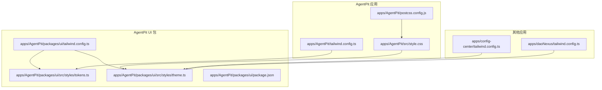
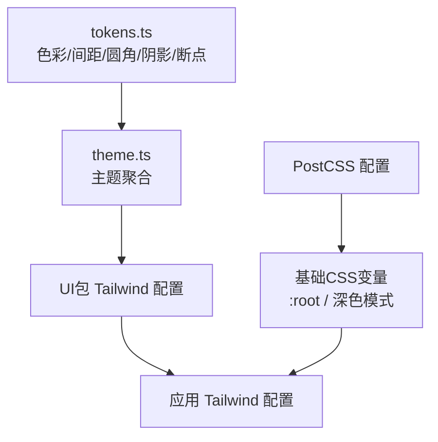
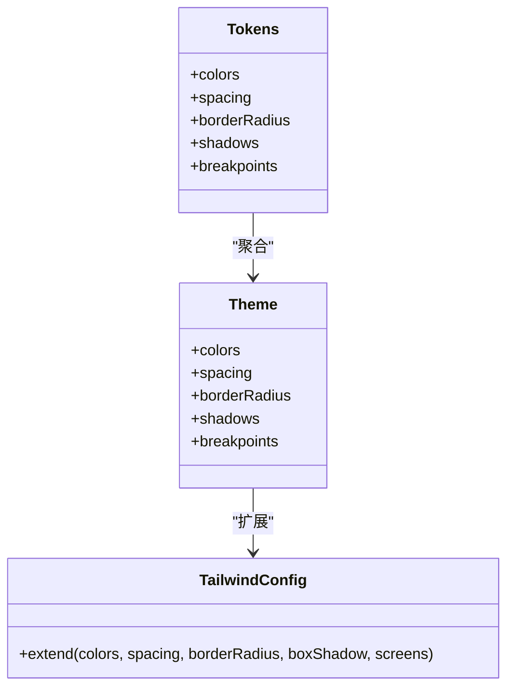
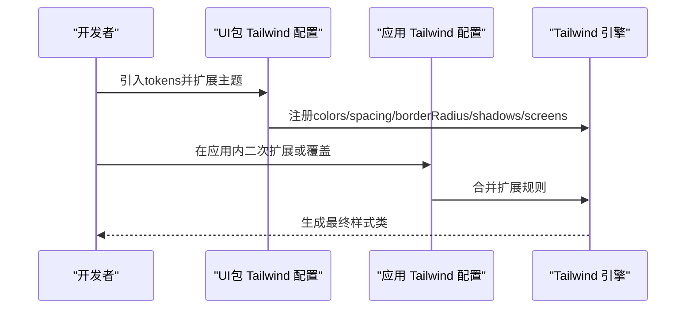
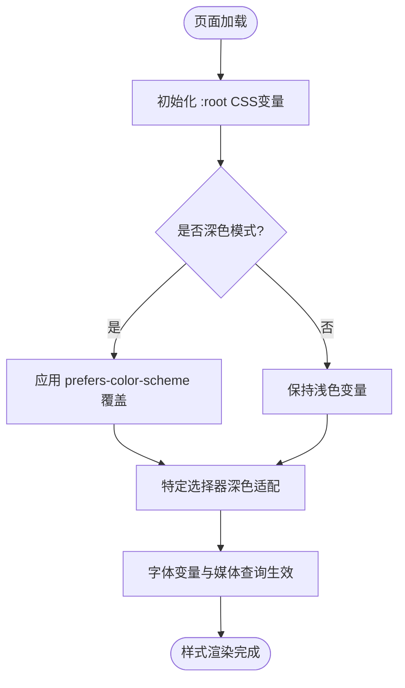
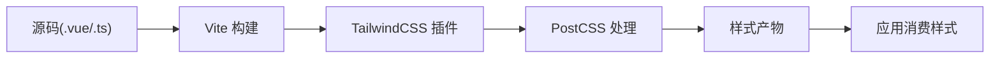
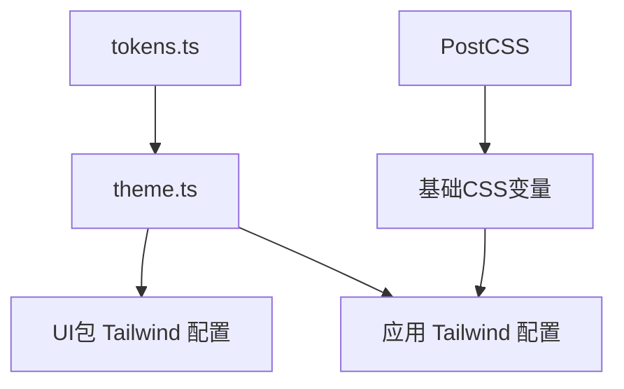

# 样式系统

<cite>
**本文引用的文件**
- [apps/AgentPit/packages/ui/tailwind.config.ts](file://apps/AgentPit/packages/ui/tailwind.config.ts)
- [apps/AgentPit/packages/ui/src/styles/tokens.ts](file://apps/AgentPit/packages/ui/src/styles/tokens.ts)
- [apps/AgentPit/packages/ui/src/styles/theme.ts](file://apps/AgentPit/packages/ui/src/styles/theme.ts)
- [apps/AgentPit/src/style.css](file://apps/AgentPit/src/style.css)
- [apps/AgentPit/postcss.config.js](file://apps/AgentPit/postcss.config.js)
- [apps/AgentPit/packages/ui/package.json](file://apps/AgentPit/packages/ui/package.json)
- [apps/AgentPit/tailwind.config.ts](file://apps/AgentPit/tailwind.config.ts)
- [apps/config-center/tailwind.config.ts](file://apps/config-center/tailwind.config.ts)
- [apps/daoNexus/tailwind.config.ts](file://apps/daoNexus/tailwind.config.ts)
</cite>

## 目录
1. [简介](#简介)
2. [项目结构](#项目结构)
3. [核心组件](#核心组件)
4. [架构总览](#架构总览)
5. [详细组件分析](#详细组件分析)
6. [依赖关系分析](#依赖关系分析)
7. [性能考量](#性能考量)
8. [故障排查指南](#故障排查指南)
9. [结论](#结论)
10. [附录](#附录)

## 简介
本文件面向DAOApps样式系统，系统性梳理主题系统、色彩体系与字体规范；详解CSS变量、Tailwind配置与样式继承机制；解释tokens设计令牌的定义、命名约定与使用方法；提供主题定制（深色模式、品牌色彩、响应式断点）指南；并覆盖样式组织结构、模块化CSS与CSS-in-JS实现思路、调试工具与性能优化建议。内容基于仓库中AgentPit UI包与多应用的Tailwind配置进行归纳总结。

## 项目结构
DAOApps采用“多应用 + 统一UI包”的组织方式：各应用独立维护Tailwind配置与基础样式，同时通过AgentPit UI包提供共享的主题令牌与样式导出能力。整体结构如下：

图示来源
- [apps/AgentPit/packages/ui/tailwind.config.ts:1-20](file://apps/AgentPit/packages/ui/tailwind.config.ts#L1-L20)
- [apps/AgentPit/packages/ui/src/styles/tokens.ts:1-121](file://apps/AgentPit/packages/ui/src/styles/tokens.ts#L1-L121)
- [apps/AgentPit/packages/ui/src/styles/theme.ts:1-12](file://apps/AgentPit/packages/ui/src/styles/theme.ts#L1-L12)
- [apps/AgentPit/src/style.css:1-295](file://apps/AgentPit/src/style.css#L1-L295)
- [apps/AgentPit/postcss.config.js:1-6](file://apps/AgentPit/postcss.config.js#L1-L6)
- [apps/AgentPit/packages/ui/package.json:1-58](file://apps/AgentPit/packages/ui/package.json#L1-L58)
- [apps/AgentPit/tailwind.config.ts:1-27](file://apps/AgentPit/tailwind.config.ts#L1-L27)
- [apps/config-center/tailwind.config.ts:1-104](file://apps/config-center/tailwind.config.ts#L1-L104)
- [apps/daoNexus/tailwind.config.ts:1-156](file://apps/daoNexus/tailwind.config.ts#L1-L156)

章节来源
- [apps/AgentPit/packages/ui/tailwind.config.ts:1-20](file://apps/AgentPit/packages/ui/tailwind.config.ts#L1-L20)
- [apps/AgentPit/packages/ui/src/styles/tokens.ts:1-121](file://apps/AgentPit/packages/ui/src/styles/tokens.ts#L1-L121)
- [apps/AgentPit/packages/ui/src/styles/theme.ts:1-12](file://apps/AgentPit/packages/ui/src/styles/theme.ts#L1-L12)
- [apps/AgentPit/src/style.css:1-295](file://apps/AgentPit/src/style.css#L1-L295)
- [apps/AgentPit/postcss.config.js:1-6](file://apps/AgentPit/postcss.config.js#L1-L6)
- [apps/AgentPit/packages/ui/package.json:1-58](file://apps/AgentPit/packages/ui/package.json#L1-L58)
- [apps/AgentPit/tailwind.config.ts:1-27](file://apps/AgentPit/tailwind.config.ts#L1-L27)
- [apps/config-center/tailwind.config.ts:1-104](file://apps/config-center/tailwind.config.ts#L1-L104)
- [apps/daoNexus/tailwind.config.ts:1-156](file://apps/daoNexus/tailwind.config.ts#L1-L156)

## 核心组件
- 主题令牌（tokens）
  - 色彩：主色、强调色、成功/警告/危险、灰阶等分阶体系
  - 间距：以4px为步进的离散值集合
  - 圆角：从none到full的常用半径
  - 阴影：sm/md/lg/xl/2xl等层级
  - 断点：sm至2xl的响应式断点
- 主题对象（theme）
  - 将tokens聚合为可被Tailwind扩展使用的主题键
- Tailwind配置
  - UI包：从tokens扩展colors/spacings/borderRadius/shadows/screens
  - 应用侧：可直接复用UI包tokens或自定义扩展
- 基础样式（CSS变量）
  - 文本、背景、边框、强调色、代码块背景等
  - 字体族：无衬线、标题、等宽
  - 深色模式：prefers-color-scheme与特定选择器下的变量覆盖
- 构建链路
  - PostCSS：autoprefixer
  - UI包：Vite + Vue + TailwindCSS插件

章节来源
- [apps/AgentPit/packages/ui/src/styles/tokens.ts:1-121](file://apps/AgentPit/packages/ui/src/styles/tokens.ts#L1-L121)
- [apps/AgentPit/packages/ui/src/styles/theme.ts:1-12](file://apps/AgentPit/packages/ui/src/styles/theme.ts#L1-L12)
- [apps/AgentPit/packages/ui/tailwind.config.ts:1-20](file://apps/AgentPit/packages/ui/tailwind.config.ts#L1-L20)
- [apps/AgentPit/src/style.css:1-295](file://apps/AgentPit/src/style.css#L1-L295)
- [apps/AgentPit/postcss.config.js:1-6](file://apps/AgentPit/postcss.config.js#L1-L6)

## 架构总览
DAOApps样式系统由“共享令牌 + 可选UI包 + 应用配置”三层构成。UI包提供标准化的tokens与Tailwind扩展入口；应用侧通过引入UI包或自定义扩展实现一致的主题体验与差异化风格。

图示来源
- [apps/AgentPit/packages/ui/src/styles/tokens.ts:1-121](file://apps/AgentPit/packages/ui/src/styles/tokens.ts#L1-L121)
- [apps/AgentPit/packages/ui/src/styles/theme.ts:1-12](file://apps/AgentPit/packages/ui/src/styles/theme.ts#L1-L12)
- [apps/AgentPit/packages/ui/tailwind.config.ts:1-20](file://apps/AgentPit/packages/ui/tailwind.config.ts#L1-L20)
- [apps/AgentPit/tailwind.config.ts:1-27](file://apps/AgentPit/tailwind.config.ts#L1-L27)
- [apps/AgentPit/src/style.css:1-295](file://apps/AgentPit/src/style.css#L1-L295)
- [apps/AgentPit/postcss.config.js:1-6](file://apps/AgentPit/postcss.config.js#L1-L6)

## 详细组件分析

### 组件A：UI包主题令牌与主题对象
- 设计原则
  - 分层分阶：色彩采用100–900的分阶映射，便于语义化使用
  - 离散化：间距、圆角、阴影、断点均采用明确数值，避免过度抽象
  - 可组合：通过theme聚合，供Tailwind按需扩展
- 使用路径
  - tokens.ts导出基础数据
  - theme.ts聚合为主题对象
  - UI包tailwind.config.ts从theme扩展到Tailwind

图示来源
- [apps/AgentPit/packages/ui/src/styles/tokens.ts:1-121](file://apps/AgentPit/packages/ui/src/styles/tokens.ts#L1-L121)
- [apps/AgentPit/packages/ui/src/styles/theme.ts:1-12](file://apps/AgentPit/packages/ui/src/styles/theme.ts#L1-L12)
- [apps/AgentPit/packages/ui/tailwind.config.ts:1-20](file://apps/AgentPit/packages/ui/tailwind.config.ts#L1-L20)

章节来源
- [apps/AgentPit/packages/ui/src/styles/tokens.ts:1-121](file://apps/AgentPit/packages/ui/src/styles/tokens.ts#L1-L121)
- [apps/AgentPit/packages/ui/src/styles/theme.ts:1-12](file://apps/AgentPit/packages/ui/src/styles/theme.ts#L1-L12)
- [apps/AgentPit/packages/ui/tailwind.config.ts:1-20](file://apps/AgentPit/packages/ui/tailwind.config.ts#L1-L20)

### 组件B：应用侧Tailwind配置与样式继承
- AgentPit UI包配置
  - 从tokens扩展主题键，content扫描范围覆盖Vue/TS组件
- AgentPit应用配置
  - 在自身tailwind.config.ts中对primary颜色做直接扩展
- 其他应用（如config-center、daoNexus）
  - 使用CSS变量（hsl(var(--*))）驱动深色类名切换
  - 扩展容器、圆角、字体、动画、渐变、阴影等

图示来源
- [apps/AgentPit/packages/ui/tailwind.config.ts:1-20](file://apps/AgentPit/packages/ui/tailwind.config.ts#L1-L20)
- [apps/AgentPit/tailwind.config.ts:1-27](file://apps/AgentPit/tailwind.config.ts#L1-L27)
- [apps/config-center/tailwind.config.ts:1-104](file://apps/config-center/tailwind.config.ts#L1-L104)
- [apps/daoNexus/tailwind.config.ts:1-156](file://apps/daoNexus/tailwind.config.ts#L1-L156)

章节来源
- [apps/AgentPit/tailwind.config.ts:1-27](file://apps/AgentPit/tailwind.config.ts#L1-L27)
- [apps/config-center/tailwind.config.ts:1-104](file://apps/config-center/tailwind.config.ts#L1-L104)
- [apps/daoNexus/tailwind.config.ts:1-156](file://apps/daoNexus/tailwind.config.ts#L1-L156)

### 组件C：基础CSS变量与深色模式
- CSS变量覆盖策略
  - :root定义文本、背景、边框、强调色、代码块背景、字体族等
  - prefers-color-scheme媒体查询在深色模式下重定义变量
  - 特定选择器（如#social .button-icon）在深色模式下进行视觉调整
- 字体规范
  - --sans、--heading、--mono三套变量，配合媒体查询在小屏适配
- 响应式断点
  - 通过CSS变量与Tailwind断点协同，确保组件在不同视口下的表现一致性

图示来源
- [apps/AgentPit/src/style.css:1-295](file://apps/AgentPit/src/style.css#L1-L295)

章节来源
- [apps/AgentPit/src/style.css:1-295](file://apps/AgentPit/src/style.css#L1-L295)

### 组件D：构建与打包链路
- PostCSS
  - 自动前缀处理，保证跨浏览器兼容
- UI包构建
  - Vite + Vue + TailwindCSS插件，支持类型检查与文档站点
- 导出产物
  - UI包导出样式与类型声明，便于应用按需消费

图示来源
- [apps/AgentPit/postcss.config.js:1-6](file://apps/AgentPit/postcss.config.js#L1-L6)
- [apps/AgentPit/packages/ui/package.json:1-58](file://apps/AgentPit/packages/ui/package.json#L1-L58)

章节来源
- [apps/AgentPit/postcss.config.js:1-6](file://apps/AgentPit/postcss.config.js#L1-L6)
- [apps/AgentPit/packages/ui/package.json:1-58](file://apps/AgentPit/packages/ui/package.json#L1-L58)

## 依赖关系分析
- UI包对tokens的依赖是单向的，theme作为中间层聚合，再被Tailwind配置消费
- 应用侧Tailwind配置可直接复用UI包tokens，也可在自身配置中扩展或覆盖
- CSS变量与Tailwind主题相互补充：前者负责全局变量与深色模式，后者负责原子化类名与响应式

图示来源
- [apps/AgentPit/packages/ui/src/styles/tokens.ts:1-121](file://apps/AgentPit/packages/ui/src/styles/tokens.ts#L1-L121)
- [apps/AgentPit/packages/ui/src/styles/theme.ts:1-12](file://apps/AgentPit/packages/ui/src/styles/theme.ts#L1-L12)
- [apps/AgentPit/packages/ui/tailwind.config.ts:1-20](file://apps/AgentPit/packages/ui/tailwind.config.ts#L1-L20)
- [apps/AgentPit/tailwind.config.ts:1-27](file://apps/AgentPit/tailwind.config.ts#L1-L27)
- [apps/AgentPit/src/style.css:1-295](file://apps/AgentPit/src/style.css#L1-L295)
- [apps/AgentPit/postcss.config.js:1-6](file://apps/AgentPit/postcss.config.js#L1-L6)

章节来源
- [apps/AgentPit/packages/ui/src/styles/tokens.ts:1-121](file://apps/AgentPit/packages/ui/src/styles/tokens.ts#L1-L121)
- [apps/AgentPit/packages/ui/src/styles/theme.ts:1-12](file://apps/AgentPit/packages/ui/src/styles/theme.ts#L1-L12)
- [apps/AgentPit/packages/ui/tailwind.config.ts:1-20](file://apps/AgentPit/packages/ui/tailwind.config.ts#L1-L20)
- [apps/AgentPit/tailwind.config.ts:1-27](file://apps/AgentPit/tailwind.config.ts#L1-L27)
- [apps/AgentPit/src/style.css:1-295](file://apps/AgentPit/src/style.css#L1-L295)
- [apps/AgentPit/postcss.config.js:1-6](file://apps/AgentPit/postcss.config.js#L1-L6)

## 性能考量
- 原子化优先：Tailwind原子类减少重复样式，提升可维护性与体积可控性
- 按需扫描：content配置仅扫描实际使用文件，避免生成冗余类
- CSS变量最小化：仅在必要处使用，避免过度拆分导致的解析成本上升
- 渐进增强：基础样式（CSS变量）与Tailwind类并行，保障降级与首屏渲染
- 构建优化：PostCSS自动前缀与压缩，结合Vite快速热更新与生产打包

## 故障排查指南
- 类名不生效
  - 检查content扫描路径是否包含目标文件
  - 确认UI包tokens是否正确扩展到Tailwind配置
- 深色模式异常
  - 确认prefers-color-scheme媒体查询与特定选择器覆盖逻辑
  - 检查应用侧darkMode配置（如class模式）与根元素类名
- 字体与断点不一致
  - 对比CSS变量与Tailwind断点配置，确保命名与取值一致
- 构建报错
  - 检查PostCSS插件与Tailwind版本兼容性
  - 确认UI包导出样式路径与应用消费方式一致

章节来源
- [apps/AgentPit/packages/ui/tailwind.config.ts:1-20](file://apps/AgentPit/packages/ui/tailwind.config.ts#L1-L20)
- [apps/AgentPit/tailwind.config.ts:1-27](file://apps/AgentPit/tailwind.config.ts#L1-L27)
- [apps/AgentPit/src/style.css:1-295](file://apps/AgentPit/src/style.css#L1-L295)
- [apps/AgentPit/postcss.config.js:1-6](file://apps/AgentPit/postcss.config.js#L1-L6)

## 结论
DAOApps样式系统通过“共享令牌 + 可选UI包 + 应用配置”的分层架构，实现了主题一致性与灵活性的平衡。tokens提供稳定的设计语言，Tailwind保证原子化与可组合性，CSS变量与深色模式确保跨场景的可用性。建议在新功能开发中优先复用UI包tokens，并在应用侧按需扩展，以维持整体风格的一致性与可演进性。

## 附录
- 主题定制清单
  - 深色模式：确认prefers-color-scheme与class模式开关
  - 品牌色彩：在tokens中新增或调整主色/强调色分阶
  - 响应式断点：统一CSS变量与Tailwind断点命名
  - 字体规范：在:root中集中管理sans/heading/mono
  - 动画与阴影：通过tokens与Tailwind扩展统一管理
- 调试工具
  - 浏览器开发者工具检查元素类名与计算样式
  - Tailwind官方调试技巧与类名冲突排查
  - PostCSS输出对比，定位前缀与兼容性问题
- 性能优化建议
  - 控制content扫描范围，避免无关文件参与
  - 合理拆分样式入口，按需加载
  - 使用CSS变量缓存常用值，减少重复计算