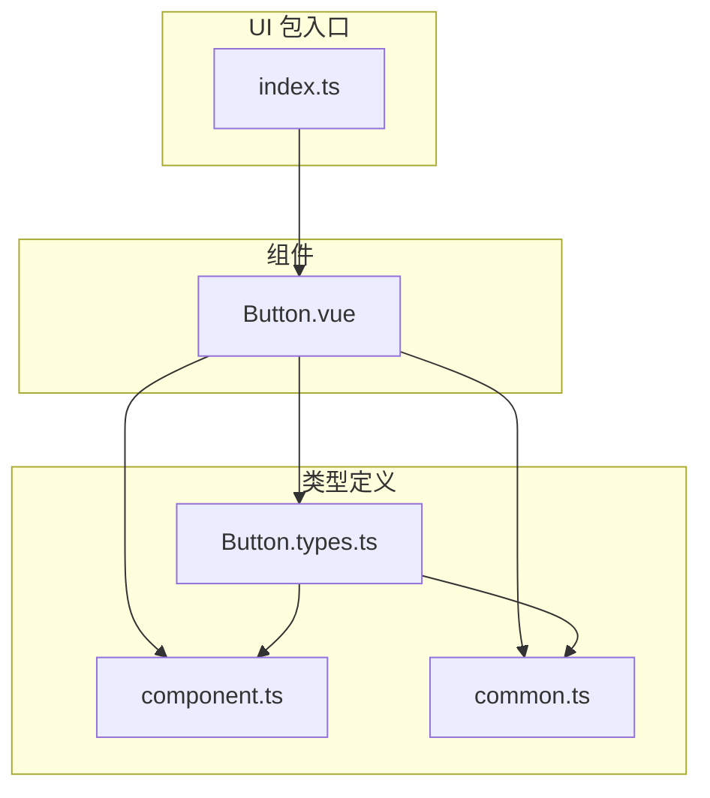
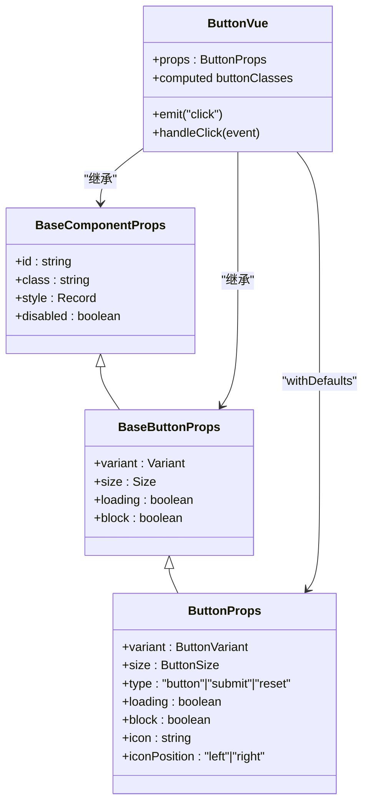
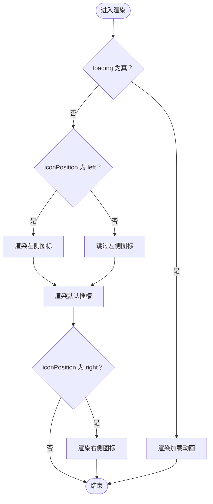
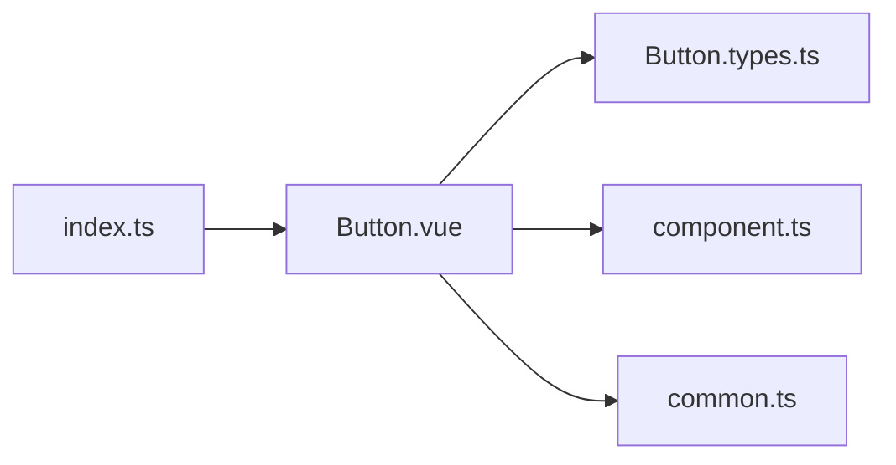

# 核心组件

<cite>
**本文引用的文件**
- [Button.vue](file://apps/AgentPit/packages/ui/src/components/Button/Button.vue)
- [Button.types.ts](file://apps/AgentPit/packages/ui/src/components/Button/Button.types.ts)
- [component.ts](file://apps/AgentPit/packages/ui/src/types/component.ts)
- [common.ts](file://apps/AgentPit/packages/ui/src/types/common.ts)
- [index.ts](file://apps/AgentPit/packages/ui/src/index.ts)
</cite>

## 目录
1. [简介](#简介)
2. [项目结构](#项目结构)
3. [核心组件](#核心组件)
4. [架构总览](#架构总览)
5. [详细组件分析](#详细组件分析)
6. [依赖分析](#依赖分析)
7. [性能考虑](#性能考虑)
8. [无障碍与可访问性](#无障碍与可访问性)
9. [样式定制与主题适配](#样式定制与主题适配)
10. [故障排查](#故障排查)
11. [结论](#结论)
12. [附录：使用示例索引](#附录使用示例索引)

## 简介
本文件聚焦 DAOApps 的核心 UI 组件体系，以 Button（按钮）为例，系统阐述基础组件的设计理念、属性配置、事件处理、插槽使用、内部实现原理、DOM 结构与 CSS 类名、无障碍支持、键盘导航与屏幕阅读器兼容性，并提供样式定制与主题适配指南。文档同时给出组件间关系图与关键流程图，帮助开发者快速理解并正确使用组件。

## 项目结构
UI 组件库采用按功能域分层组织的方式：组件源码位于 packages/ui/src/components 下，类型定义集中在 packages/ui/src/types 中，入口导出统一通过 index.ts 暴露。Button 组件由单文件 Vue 组件实现，配合类型模块与通用类型定义，形成清晰的职责边界与可复用性。

图表来源
- [index.ts](file://apps/AgentPit/packages/ui/src/index.ts)
- [Button.vue](file://apps/AgentPit/packages/ui/src/components/Button/Button.vue)
- [Button.types.ts](file://apps/AgentPit/packages/ui/src/components/Button/Button.types.ts)
- [component.ts](file://apps/AgentPit/packages/ui/src/types/component.ts)
- [common.ts](file://apps/AgentPit/packages/ui/src/types/common.ts)

章节来源
- [index.ts](file://apps/AgentPit/packages/ui/src/index.ts)
- [Button.vue](file://apps/AgentPit/packages/ui/src/components/Button/Button.vue)

## 核心组件
本节聚焦 Button 组件，说明其设计理念与能力边界：
- 设计理念：以“可组合的变体与尺寸”为核心，通过 class-variance-authority（cva）将语义化变体（variant）、尺寸（size）与通用基类进行声明式组合；通过 cn 工具函数合并动态类名，确保可扩展性与可维护性。
- 能力范围：支持多种变体（如 primary、secondary、success、warning、danger、outline、ghost）、多种尺寸（xs 到 xl）、加载态（loading）、块级显示（block）、图标（icon）与左右位置控制（iconPosition），以及标准的点击事件（click）与禁用态（disabled）。
- DOM 结构：渲染为原生 button 元素，内部包含一个可选的加载动画容器、左侧或右侧图标占位、默认插槽内容。
- 可访问性：继承原生 button 的可访问性行为，结合 focus-ring 与禁用态样式，保证键盘可达与视觉反馈。

章节来源
- [Button.vue](file://apps/AgentPit/packages/ui/src/components/Button/Button.vue)
- [Button.types.ts](file://apps/AgentPit/packages/ui/src/components/Button/Button.types.ts)
- [component.ts](file://apps/AgentPit/packages/ui/src/types/component.ts)
- [common.ts](file://apps/AgentPit/packages/ui/src/types/common.ts)

## 架构总览
下图展示 Button 组件与其类型定义之间的关系，以及默认值与变体映射的来源。

图表来源
- [Button.vue](file://apps/AgentPit/packages/ui/src/components/Button/Button.vue)
- [Button.types.ts](file://apps/AgentPit/packages/ui/src/components/Button/Button.types.ts)
- [component.ts](file://apps/AgentPit/packages/ui/src/types/component.ts)
- [common.ts](file://apps/AgentPit/packages/ui/src/types/common.ts)

## 详细组件分析

### 属性定义与默认值
- 基础属性（继承自 BaseComponentProps）
  - id：可选标识符
  - class：透传额外类名
  - style：透传内联样式
  - disabled：禁用态
- 按钮特有属性（BaseButtonProps 扩展）
  - variant：变体（默认 primary）
  - size：尺寸（默认 md）
  - loading：加载态（默认 false）
  - block：块级显示（默认 false）
- ButtonProps 扩展
  - type：原生 button type（默认 button）
  - icon：图标文本（可选）
  - iconPosition：图标位置（默认 left）

默认值与校验策略
- 使用 withDefaults 在组件内部设置默认值，确保运行时一致性与类型安全。
- 尺寸与变体枚举来自公共类型定义，避免魔法字符串，提升可维护性。

章节来源
- [Button.vue](file://apps/AgentPit/packages/ui/src/components/Button/Button.vue)
- [Button.types.ts](file://apps/AgentPit/packages/ui/src/components/Button/Button.types.ts)
- [component.ts](file://apps/AgentPit/packages/ui/src/types/component.ts)
- [common.ts](file://apps/AgentPit/packages/ui/src/types/common.ts)

### 事件处理
- 事件名称：click
- 触发条件：仅当组件未禁用且非加载态时触发
- 事件参数：原生 MouseEvent
- 实现要点：在 handleClick 中进行状态判断后发射事件，保证交互一致性与可访问性

章节来源
- [Button.vue](file://apps/AgentPit/packages/ui/src/components/Button/Button.vue)

### 插槽使用
- 默认插槽：用于放置按钮文本或任意内容
- 图标位置：通过 iconPosition 控制图标在左/右两侧显示，与默认插槽并存时保持间距与对齐
- 加载态：当 loading 为真时，优先显示内置加载动画，隐藏插槽内容

章节来源
- [Button.vue](file://apps/AgentPit/packages/ui/src/components/Button/Button.vue)

### 内部实现原理
- 类名生成：使用 cva 定义变体与尺寸的类名映射，再通过 cn 合并 block、class 等动态类名
- 计算属性：buttonClasses 基于 props 动态计算最终类名
- 渲染逻辑：根据 loading、iconPosition、插槽是否存在决定子节点渲染顺序与可见性

图表来源
- [Button.vue](file://apps/AgentPit/packages/ui/src/components/Button/Button.vue)

### DOM 结构与 CSS 类名
- 外层元素：原生 button，绑定 type、class、disabled
- 子元素：
  - 加载态容器（仅 loading 时出现）
  - 左侧图标容器（仅存在 icon 且 iconPosition 为 left 时出现）
  - 默认插槽（按钮内容）
  - 右侧图标容器（仅存在 icon 且 iconPosition 为 right 时出现）
- 类名来源：
  - 固定基类：居中、圆角、过渡、焦点环等
  - 变体类：不同 variant 对应的颜色与边框策略
  - 尺寸类：不同 size 对应的内边距与字号
  - 动态类：block、class、disabled 状态

章节来源
- [Button.vue](file://apps/AgentPit/packages/ui/src/components/Button/Button.vue)

### 使用示例（路径索引）
以下为常见用法的代码片段路径（不直接展示代码内容）：
- 基础主按钮：[Button.vue](file://apps/AgentPit/packages/ui/src/components/Button/Button.vue)
- 幽灵按钮（ghost）：[Button.vue](file://apps/AgentPit/packages/ui/src/components/Button/Button.vue)
- 警告按钮（warning）：[Button.vue](file://apps/AgentPit/packages/ui/src/components/Button/Button.vue)
- 危险按钮（danger）：[Button.vue](file://apps/AgentPit/packages/ui/src/components/Button/Button.vue)
- 轻量按钮（outline）：[Button.vue](file://apps/AgentPit/packages/ui/src/components/Button/Button.vue)
- 成功按钮（success）：[Button.vue](file://apps/AgentPit/packages/ui/src/components/Button/Button.vue)
- 小尺寸按钮（size=sm/xs）：[Button.vue](file://apps/AgentPit/packages/ui/src/components/Button/Button.vue)
- 大尺寸按钮（size=lg/xl）：[Button.vue](file://apps/AgentPit/packages/ui/src/components/Button/Button.vue)
- 块级按钮（block=true）：[Button.vue](file://apps/AgentPit/packages/ui/src/components/Button/Button.vue)
- 带图标的按钮（icon + iconPosition）：[Button.vue](file://apps/AgentPit/packages/ui/src/components/Button/Button.vue)
- 提交按钮（type=submit）：[Button.vue](file://apps/AgentPit/packages/ui/src/components/Button/Button.vue)
- 禁用按钮（disabled=true）：[Button.vue](file://apps/AgentPit/packages/ui/src/components/Button/Button.vue)
- 加载中按钮（loading=true）：[Button.vue](file://apps/AgentPit/packages/ui/src/components/Button/Button.vue)

## 依赖分析
- 组件依赖
  - Button.vue 依赖 Button.types.ts、component.ts、common.ts 中的类型定义
  - 使用 class-variance-authority（cva）与 cn 工具进行类名组合
- 导出与入口
  - index.ts 统一导出组件、组合式函数、类型、工具与样式，便于上层应用按需引入

图表来源
- [Button.vue](file://apps/AgentPit/packages/ui/src/components/Button/Button.vue)
- [Button.types.ts](file://apps/AgentPit/packages/ui/src/components/Button/Button.types.ts)
- [component.ts](file://apps/AgentPit/packages/ui/src/types/component.ts)
- [common.ts](file://apps/AgentPit/packages/ui/src/types/common.ts)
- [index.ts](file://apps/AgentPit/packages/ui/src/index.ts)

章节来源
- [index.ts](file://apps/AgentPit/packages/ui/src/index.ts)

## 性能考虑
- 渲染开销：Button 为轻量无状态组件，渲染成本极低；建议在高频列表中复用同一变体与尺寸，减少类名切换带来的重排。
- 事件处理：click 事件仅在可用状态下触发，避免无效回调；loading 与 disabled 同时影响交互，减少不必要的事件监听。
- 类名计算：buttonClasses 为计算属性，基于响应式 props 变更时才重新计算，符合 Vue 的响应式优化原则。
- 图标与插槽：插槽内容由父组件控制，建议避免在插槽中放置重型内容；图标为静态文本占位，不会引入额外资源。

## 无障碍与可访问性
- 键盘可达性：原生 button 支持 Enter/Space 键激活；组件保留原生交互语义，无需额外键盘事件处理。
- 焦点环：cva 定义了 focus:ring-* 类，确保键盘用户可感知当前焦点。
- 禁用态：disabled 或 loading 时 opacity 降低并禁用指针事件，避免误操作。
- 屏幕阅读器：按钮文本通过默认插槽传递，屏幕阅读器可读取；若需更明确的语义，可在父组件中添加 aria-label 或 aria-describedby。
- 颜色对比：各变体颜色遵循对比度要求，建议在深色模式下保持一致的对比度策略。

## 样式定制与主题适配
- 主题变量：通过 Tailwind 配置与 CSS 变量实现主题切换；Button 的变体类名基于语义化颜色（如 primary、accent、success 等），可在主题中统一调整。
- 自定义类名：通过 class 属性透传额外类名，覆盖默认样式；注意与 block、variant、size 的优先级关系。
- 尺寸扩展：如需新增尺寸，可在 Button.vue 的 cva 尺寸映射中增加条目，并在 common.ts 中同步扩展 Size 类型。
- 变体扩展：如需新增变体，可在 Button.vue 的 cva 变体映射中增加条目，并在 Button.types.ts 中扩展 ButtonVariant 类型。
- 禁用态与加载态：保持禁用态与加载态的一致性，避免视觉冲突；可通过覆盖类名微调透明度与指针样式。

## 故障排查
- 问题：按钮点击无响应
  - 排查：确认 disabled 与 loading 均为 false；检查父组件是否阻止了事件冒泡；核对 click 事件监听是否正确绑定。
  - 参考：[Button.vue](file://apps/AgentPit/packages/ui/src/components/Button/Button.vue)
- 问题：图标不显示或位置异常
  - 排查：确认 icon 存在且 iconPosition 设置为 left 或 right；loading 为 true 时会隐藏插槽与图标。
  - 参考：[Button.vue](file://apps/AgentPit/packages/ui/src/components/Button/Button.vue)
- 问题：样式被覆盖或类名冲突
  - 排查：检查是否同时设置了 block 与自定义 class；确认 Tailwind 配置中颜色与尺寸映射是否生效。
  - 参考：[Button.vue](file://apps/AgentPit/packages/ui/src/components/Button/Button.vue)
- 问题：主题切换后颜色不一致
  - 排查：检查主题变量是否更新；确认 cva 变体类名与主题变量映射一致。
  - 参考：[Button.vue](file://apps/AgentPit/packages/ui/src/components/Button/Button.vue)

## 结论
Button 组件以类型安全、可组合的变体与尺寸为核心设计目标，通过 cva 与 cn 实现灵活的样式组合，并提供完善的交互与可访问性支持。其简洁的 API 与清晰的类名体系，使其易于扩展与定制，适合在复杂业务场景中作为统一的交互入口。

## 附录：使用示例索引
- 基础主按钮：[Button.vue](file://apps/AgentPit/packages/ui/src/components/Button/Button.vue)
- 幽灵按钮（ghost）：[Button.vue](file://apps/AgentPit/packages/ui/src/components/Button/Button.vue)
- 警告按钮（warning）：[Button.vue](file://apps/AgentPit/packages/ui/src/components/Button/Button.vue)
- 危险按钮（danger）：[Button.vue](file://apps/AgentPit/packages/ui/src/components/Button/Button.vue)
- 轻量按钮（outline）：[Button.vue](file://apps/AgentPit/packages/ui/src/components/Button/Button.vue)
- 成功按钮（success）：[Button.vue](file://apps/AgentPit/packages/ui/src/components/Button/Button.vue)
- 小尺寸按钮（size=sm/xs）：[Button.vue](file://apps/AgentPit/packages/ui/src/components/Button/Button.vue)
- 大尺寸按钮（size=lg/xl）：[Button.vue](file://apps/AgentPit/packages/ui/src/components/Button/Button.vue)
- 块级按钮（block=true）：[Button.vue](file://apps/AgentPit/packages/ui/src/components/Button/Button.vue)
- 带图标的按钮（icon + iconPosition）：[Button.vue](file://apps/AgentPit/packages/ui/src/components/Button/Button.vue)
- 提交按钮（type=submit）：[Button.vue](file://apps/AgentPit/packages/ui/src/components/Button/Button.vue)
- 禁用按钮（disabled=true）：[Button.vue](file://apps/AgentPit/packages/ui/src/components/Button/Button.vue)
- 加载中按钮（loading=true）：[Button.vue](file://apps/AgentPit/packages/ui/src/components/Button/Button.vue)