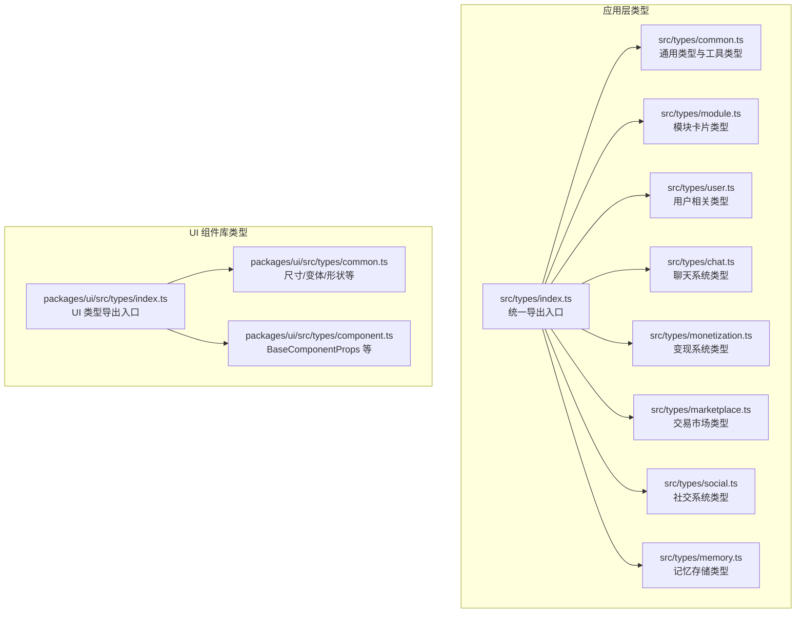
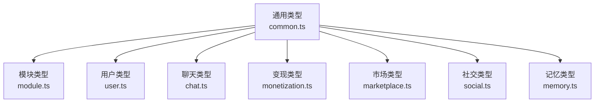
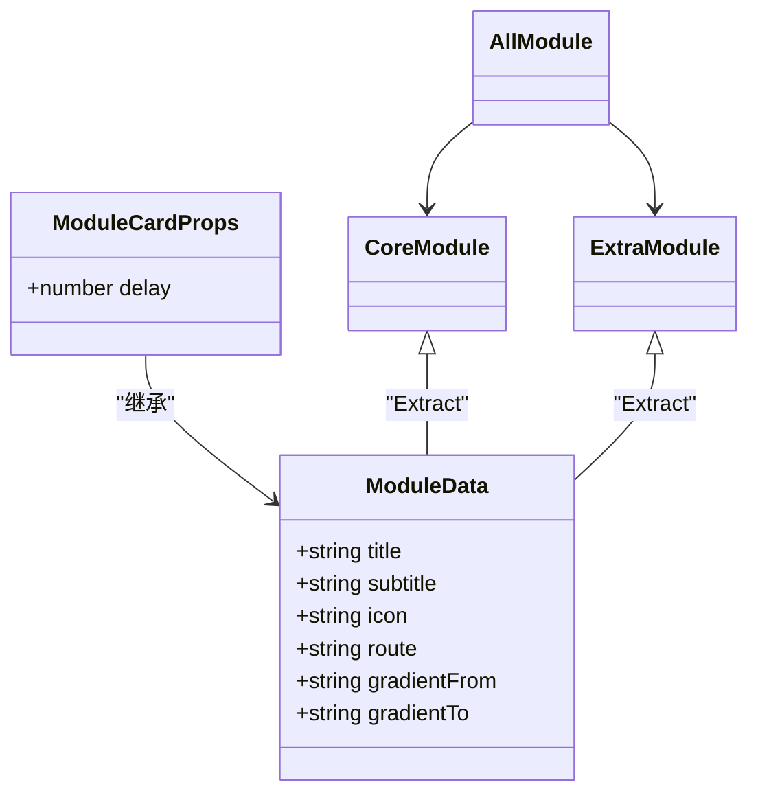
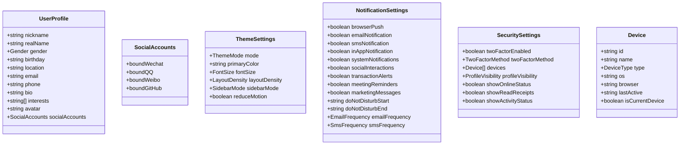
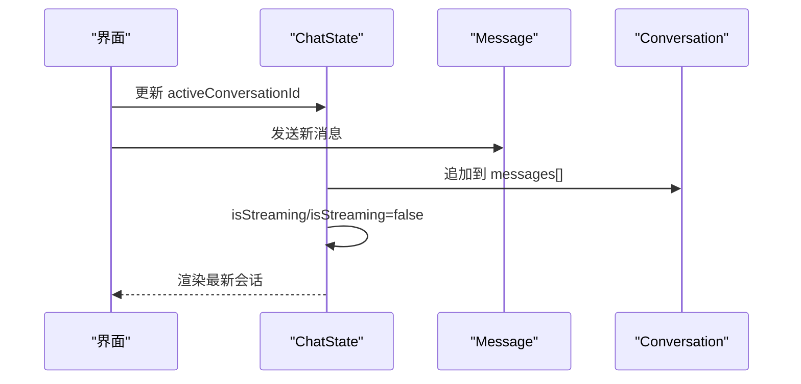
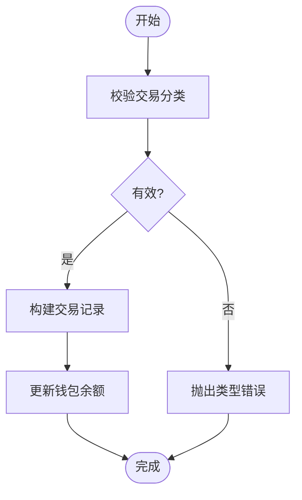
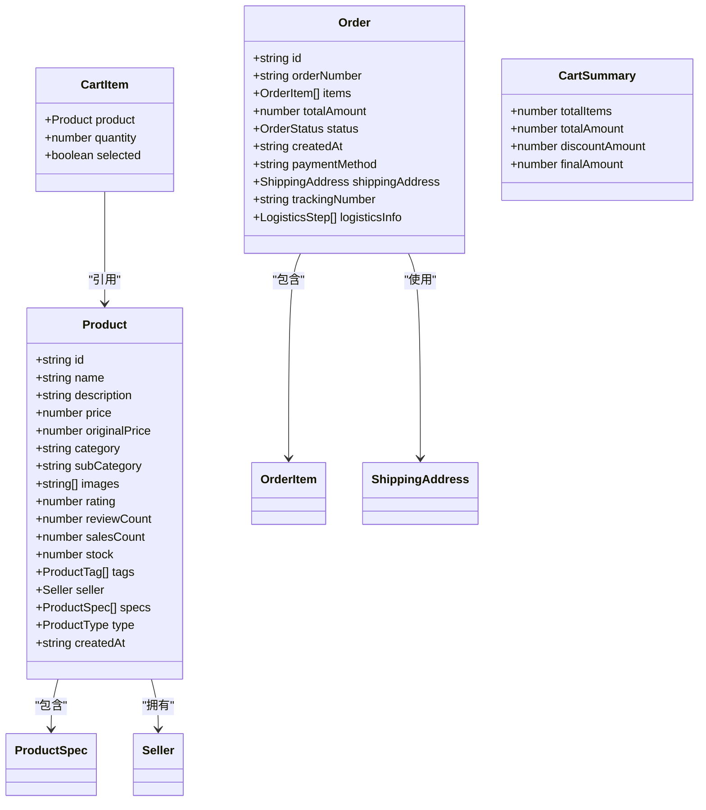
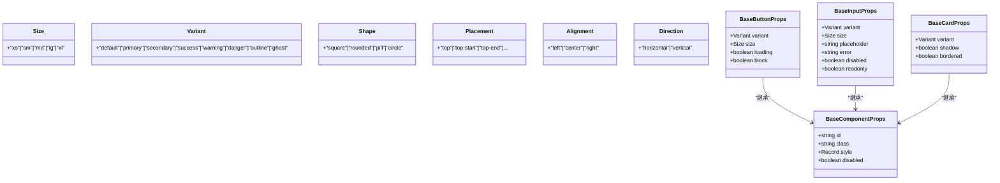
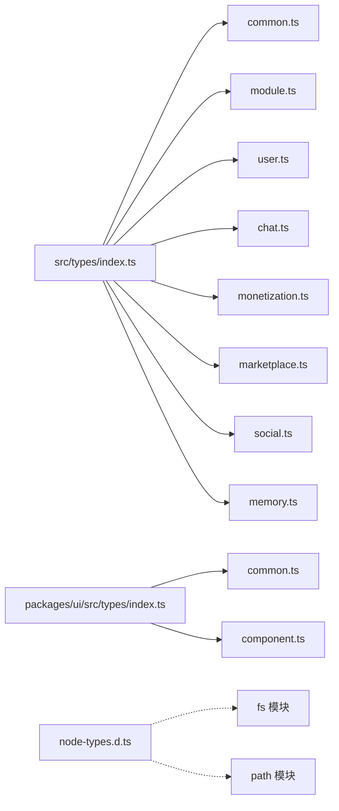

# 类型定义

<cite>
**本文档引用的文件**
- [apps/AgentPit/src/types/index.ts](file://apps/AgentPit/src/types/index.ts)
- [apps/AgentPit/packages/ui/src/types/index.ts](file://apps/AgentPit/packages/ui/src/types/index.ts)
- [apps/AgentPit/src/types/common.ts](file://apps/AgentPit/src/types/common.ts)
- [apps/AgentPit/src/types/module.ts](file://apps/AgentPit/src/types/module.ts)
- [apps/AgentPit/src/types/user.ts](file://apps/AgentPit/src/types/user.ts)
- [apps/AgentPit/src/types/chat.ts](file://apps/AgentPit/src/types/chat.ts)
- [apps/AgentPit/src/types/monetization.ts](file://apps/AgentPit/src/types/monetization.ts)
- [apps/AgentPit/src/types/marketplace.ts](file://apps/AgentPit/src/types/marketplace.ts)
- [apps/AgentPit/src/types/social.ts](file://apps/AgentPit/src/types/social.ts)
- [apps/AgentPit/src/types/memory.ts](file://apps/AgentPit/src/types/memory.ts)
- [apps/AgentPit/packages/ui/src/types/common.ts](file://apps/AgentPit/packages/ui/src/types/common.ts)
- [apps/AgentPit/packages/ui/src/types/component.ts](file://apps/AgentPit/packages/ui/src/types/component.ts)
- [apps/AgentPit/src/utils/node-types.d.ts](file://apps/AgentPit/src/utils/node-types.d.ts)
- [apps/AgentPit/tsconfig.json](file://apps/AgentPit/tsconfig.json)
- [apps/AgentPit/packages/ui/tsconfig.json](file://apps/AgentPit/packages/ui/tsconfig.json)
- [apps/AgentPit/package.json](file://apps/AgentPit/package.json)
- [apps/AgentPit/packages/ui/package.json](file://apps/AgentPit/packages/ui/package.json)
</cite>

## 目录
1. [引言](#引言)
2. [项目结构](#项目结构)
3. [核心组件](#核心组件)
4. [架构总览](#架构总览)
5. [详细组件分析](#详细组件分析)
6. [依赖分析](#依赖分析)
7. [性能考虑](#性能考虑)
8. [故障排查指南](#故障排查指南)
9. [结论](#结论)
10. [附录](#附录)

## 引言
本文件面向 DAOApps 类型定义系统，系统化梳理通用类型、组件类型与业务类型的设计原则与使用规范，覆盖类型别名、接口定义、泛型约束与类型推导；提供类型安全最佳实践、常见陷阱规避方法；解释类型模块组织与导入导出规则；给出类型扩展指南与第三方类型声明建议；并提供类型测试与类型检查的工具配置参考。

## 项目结构
类型定义主要分布在两个层次：
- 应用层类型：集中于 AgentPit 应用的 src/types 目录，按领域拆分，统一通过 index.ts 导出，便于全局引用。
- UI 组件库类型：位于 packages/ui/src/types，提供通用尺寸、变体、形状等基础类型以及组件 Props 的基类类型。

**图表来源**
- [apps/AgentPit/src/types/index.ts:1-29](file://apps/AgentPit/src/types/index.ts#L1-L29)
- [apps/AgentPit/packages/ui/src/types/index.ts:1-3](file://apps/AgentPit/packages/ui/src/types/index.ts#L1-L3)

**章节来源**
- [apps/AgentPit/src/types/index.ts:1-29](file://apps/AgentPit/src/types/index.ts#L1-L29)
- [apps/AgentPit/packages/ui/src/types/index.ts:1-3](file://apps/AgentPit/packages/ui/src/types/index.ts#L1-L3)

## 核心组件
本节聚焦通用类型与工具类型，它们是所有业务类型的基石，提供可复用的类型构造能力与约束。

- 标识与时间戳
  - ID：字符串或数字标识符，适用于多种实体主键。
  - Timestamp：数字时间戳、字符串 ISO8601 或 Date 对象，统一时间表达。
- 状态与枚举
  - Status：只读枚举，涵盖 active/inactive/pending/completed/in_progress/failed/cancelled。
  - SortDirection：升序/降序。
- 分页与响应
  - PaginationParams/PaginationResponse<T>：分页查询参数与响应结构，泛型承载具体数据项类型。
  - ApiResponse<T>：统一响应结构，包含 success/data/message/code。
- 排序与筛选
  - SortParams：字段与方向。
  - FilterOption：标签化筛选项。
- 配置与几何
  - ColorConfig/SizeConfig/Position/Range<T>/DateRange：主题、尺寸、坐标、数值范围、日期范围。
- 选项与标签
  - Option<T>：带标签、值、禁用、图标、描述的选项，T 为值类型。
  - Tag：标签实体。
- 工具类型
  - Nullable<T>：空值安全包装。
  - Optional<T,K>：将指定键集合转为可选。
  - RequiredFields<T,K>：将指定键集合强制为必填。

这些类型通过类型别名与接口组合，形成强约束的数据契约，降低运行期错误概率，并提升 IDE 智能提示质量。

**章节来源**
- [apps/AgentPit/src/types/common.ts:1-157](file://apps/AgentPit/src/types/common.ts#L1-L157)

## 架构总览
类型系统采用“领域分层 + 通用工具”的组织方式：
- 通用层：common.ts 提供 ID、Timestamp、ApiResponse、分页、排序、筛选、配置、工具类型等。
- 领域层：module、user、chat、monetization、marketplace、social、memory 各自定义领域模型与行为类型。
- UI 层：ui/types 提供组件库通用类型与 BaseProps，确保组件库消费方的一致性。

**图表来源**
- [apps/AgentPit/src/types/common.ts:1-157](file://apps/AgentPit/src/types/common.ts#L1-L157)
- [apps/AgentPit/src/types/module.ts:1-143](file://apps/AgentPit/src/types/module.ts#L1-L143)
- [apps/AgentPit/src/types/user.ts:1-200](file://apps/AgentPit/src/types/user.ts#L1-L200)
- [apps/AgentPit/src/types/chat.ts:1-151](file://apps/AgentPit/src/types/chat.ts#L1-L151)
- [apps/AgentPit/src/types/monetization.ts:1-135](file://apps/AgentPit/src/types/monetization.ts#L1-L135)
- [apps/AgentPit/src/types/marketplace.ts:1-239](file://apps/AgentPit/src/types/marketplace.ts#L1-L239)
- [apps/AgentPit/src/types/social.ts:1-80](file://apps/AgentPit/src/types/social.ts#L1-L80)
- [apps/AgentPit/src/types/memory.ts:1-89](file://apps/AgentPit/src/types/memory.ts#L1-L89)

## 详细组件分析

### 通用类型与工具类型（common.ts）
- 设计原则
  - 使用只读枚举与字面量联合类型，保证值域收敛。
  - 泛型用于跨领域复用（如 PaginationResponse<T>、Range<T>、Option<T>）。
  - 工具类型 Optional/RequiredFields/Nullable 提供编译期字段控制。
- 使用规范
  - 优先使用 Timestamp 统一时间表达，避免混用不同格式。
  - 分页场景统一返回 PaginationResponse<T>，确保客户端一致处理。
  - ApiResponse<T> 作为后端接口返回标准，前端统一解析。
- 类型推导
  - Status 通过 typeof Status[keyof typeof Status] 推导出字面量联合类型，避免魔法字符串。

```mermaid
classDiagram
class ID {
+string|number
}
class Timestamp {
+number|string|Date
}
class Status {
+"active"|"inactive"|"pending"|...
}
class ApiResponse~T~ {
+boolean success
+T data
+string message
+string code
}
class PaginationParams {
+number page
+number pageSize
}
class PaginationResponse~T~ {
+T[] list
+number total
+number page
+number pageSize
+number totalPages
}
class SortParams {
+string field
+SortDirection direction
}
class FilterOption {
+string label
+string|number value
+string icon
}
class ColorConfig {
+string primary
+string secondary
+string accent
+string background
+string text
}
class SizeConfig {
+number|string width
+number|string height
+number|string maxWidth
+number|string maxHeight
}
class Position {
+number x
+number y
}
class Range~T~ {
+T min
+T max
}
class DateRange {
+string start
+string end
}
class Option~T~ {
+string label
+T value
+boolean disabled
+string icon
+string description
}
class Tag {
+string id
+string name
+string color
+string icon
}
class Nullable~T~ {
+T|nil
}
class Optional~T,K~ {
+...omit
+partial
}
class RequiredFields~T,K~ {
+...required
}
```

  - Range<T>、Option<T> 通过泛型约束值域类型，保持类型安全。

**图表来源**
- [apps/AgentPit/src/types/common.ts:1-157](file://apps/AgentPit/src/types/common.ts#L1-L157)

**章节来源**
- [apps/AgentPit/src/types/common.ts:1-157](file://apps/AgentPit/src/types/common.ts#L1-L157)

### 模块卡片类型（module.ts）
- 设计原则
  - 使用字面量联合类型限定渐变方向与路由路径，避免拼写错误。
  - 通过 Extract 从 ModuleData 中派生 CoreModule/ExtraModule，实现精确类型划分。
  - 使用 Record<string, ModuleData> 建立配置映射，便于运行时查找。
- 使用规范
  - ModuleCardProps 直接继承 ModuleData，保持组件 Props 与数据模型一致。
  - AllModule = CoreModule | ExtraModule，统一模块类型集合。
- 类型推导
  - CoreModule/ExtraModule 通过字面量路由过滤，编译期锁定可用路由集合。

**图表来源**
- [apps/AgentPit/src/types/module.ts:1-143](file://apps/AgentPit/src/types/module.ts#L1-L143)

**章节来源**
- [apps/AgentPit/src/types/module.ts:1-143](file://apps/AgentPit/src/types/module.ts#L1-L143)

### 用户相关类型（user.ts）
- 设计原则
  - 使用字面量联合类型约束性别、主题模式、字体大小、布局密度、侧边栏模式等。
  - 通知设置、安全设置、设备信息等复杂对象通过接口聚合，便于扩展。
- 使用规范
  - ThemeSettings/NotificationSettings/SecuritySettings 等接口字段明确职责边界。
  - DeviceType 与 ProfileVisibility 等类型约束外部输入。
- 类型推导
  - FAQCategory 与 ProfileVisibility 通过字面量联合类型，避免运行期错误。

**图表来源**
- [apps/AgentPit/src/types/user.ts:1-200](file://apps/AgentPit/src/types/user.ts#L1-L200)

**章节来源**
- [apps/AgentPit/src/types/user.ts:1-200](file://apps/AgentPit/src/types/user.ts#L1-L200)

### 聊天系统类型（chat.ts）
- 设计原则
  - 消息角色、状态、内容类型均以字面量联合类型约束，保证消息生命周期与内容形态可控。
  - FileMetadata/ImageMetadata/CodeMetadata 等元数据接口解耦不同类型消息的附加信息。
  - ChatState/Conversation/Message 等核心实体定义清晰的关联关系。
- 使用规范
  - 使用 DEFAULT_STREAMING_CONFIG 与 StreamingConfig 控制流式输出节奏。
  - ChatEventType/ChatEventCallback 为事件驱动提供类型安全的回调签名。
- 类型推导
  - MessageStatus、MessageType、QuickCommandCategory 等通过字面量联合类型，确保状态与分类稳定。

**图表来源**
- [apps/AgentPit/src/types/chat.ts:1-151](file://apps/AgentPit/src/types/chat.ts#L1-L151)

**章节来源**
- [apps/AgentPit/src/types/chat.ts:1-151](file://apps/AgentPit/src/types/chat.ts#L1-L151)

### 变现系统类型（monetization.ts）
- 设计原则
  - Currency/TransactionType/TransactionStatus 等字面量类型约束货币与交易状态。
  - WalletData/RevenueDataPoint/TransactionRecord 等接口定义钱包与交易明细的标准结构。
  - TransactionCategory 通过只读枚举与字面量联合类型，统一分类维度。
- 使用规范
  - SourceDistribution 与 FinancialMetrics 用于可视化与报表生成。
  - WithdrawRequest/WithdrawMethod 支持多渠道提现流程。
- 类型推导
  - 通过枚举与联合类型，编译期校验交易分类与提现方式的有效性。

**图表来源**
- [apps/AgentPit/src/types/monetization.ts:1-135](file://apps/AgentPit/src/types/monetization.ts#L1-L135)

**章节来源**
- [apps/AgentPit/src/types/monetization.ts:1-135](file://apps/AgentPit/src/types/monetization.ts#L1-L135)

### 交易市场类型（marketplace.ts）
- 设计原则
  - Product/ProductSpec/Seller 等实体接口清晰分离商品、规格与卖家信息。
  - Category/SubCategory 支持树形分类结构，便于导航与筛选。
  - Review/Order/OrderItem/ShippingAddress/LogisticsStep 等定义完整的电商闭环。
  - CartItem/CartSummary 用于购物车场景的聚合计算。
- 使用规范
  - MarketplaceFilter 提供关键词、分类、价格区间、类型、排序、标签等多维筛选。
  - 订单状态通过字面量联合类型严格约束流转。
- 类型推导
  - 通过接口与联合类型，确保商品类型、物流状态、订单状态等在编译期受控。

**图表来源**
- [apps/AgentPit/src/types/marketplace.ts:1-239](file://apps/AgentPit/src/types/marketplace.ts#L1-L239)

**章节来源**
- [apps/AgentPit/src/types/marketplace.ts:1-239](file://apps/AgentPit/src/types/marketplace.ts#L1-L239)

### 社交系统类型（social.ts）
- 设计原则
  - SocialProfile/SocialPost/Friend/FriendRequest/Notification/MeetingRoom/MeetingParticipant 等接口覆盖社交核心场景。
  - 状态与在线状态通过字面量联合类型约束，保证一致性。
- 使用规范
  - 通过接口字段明确各实体的职责与关联关系，便于后续扩展。

**章节来源**
- [apps/AgentPit/src/types/social.ts:1-80](file://apps/AgentPit/src/types/social.ts#L1-L80)

### 记忆存储类型（memory.ts）
- 设计原则
  - FileNode/GraphNode/GraphEdge/SearchResult/TimelineEvent 等类型支撑文件系统、知识图谱、检索与时间线等能力。
  - BackupConfig/BackupRecord/StorageStats 提供备份与存储统计能力。
- 使用规范
  - 通过接口与联合类型，确保文件类型、图谱关系、事件类型等在编译期受控。

**章节来源**
- [apps/AgentPit/src/types/memory.ts:1-89](file://apps/AgentPit/src/types/memory.ts#L1-L89)

### UI 组件库类型（packages/ui）
- 设计原则
  - Size/Variants/Shapes/Placement/Alignment/Direction 等基础类型统一组件风格体系。
  - BaseComponentProps/BaseButtonProps/BaseInputProps/BaseCardProps 等基类 Props 保证组件库一致性。
- 使用规范
  - 组件库消费方应优先使用 Base*Props，避免重复定义样式与行为属性。

**图表来源**
- [apps/AgentPit/packages/ui/src/types/common.ts:1-18](file://apps/AgentPit/packages/ui/src/types/common.ts#L1-L18)
- [apps/AgentPit/packages/ui/src/types/component.ts:1-31](file://apps/AgentPit/packages/ui/src/types/component.ts#L1-L31)

**章节来源**
- [apps/AgentPit/packages/ui/src/types/common.ts:1-18](file://apps/AgentPit/packages/ui/src/types/common.ts#L1-L18)
- [apps/AgentPit/packages/ui/src/types/component.ts:1-31](file://apps/AgentPit/packages/ui/src/types/component.ts#L1-L31)

## 依赖分析
- 模块导出
  - 应用层通过 src/types/index.ts 统一导出通用与各领域类型，便于全局引用。
  - UI 层通过 packages/ui/src/types/index.ts 统一导出通用与组件类型。
- 第三方类型声明
  - node-types.d.ts 为 Node.js 核心模块 fs/path 提供显式类型声明，避免隐式 any。
- TypeScript 配置
  - 应用与 UI 包均开启严格模式与未使用检查，确保类型健壮性。
  - UI 包生成声明文件并输出到 dist，支持类型透传与 IDE 智能提示。

**图表来源**
- [apps/AgentPit/src/types/index.ts:1-29](file://apps/AgentPit/src/types/index.ts#L1-L29)
- [apps/AgentPit/packages/ui/src/types/index.ts:1-3](file://apps/AgentPit/packages/ui/src/types/index.ts#L1-L3)
- [apps/AgentPit/src/utils/node-types.d.ts:1-15](file://apps/AgentPit/src/utils/node-types.d.ts#L1-L15)

**章节来源**
- [apps/AgentPit/src/types/index.ts:1-29](file://apps/AgentPit/src/types/index.ts#L1-L29)
- [apps/AgentPit/packages/ui/src/types/index.ts:1-3](file://apps/AgentPit/packages/ui/src/types/index.ts#L1-L3)
- [apps/AgentPit/src/utils/node-types.d.ts:1-15](file://apps/AgentPit/src/utils/node-types.d.ts#L1-L15)

## 性能考虑
- 类型层面
  - 使用字面量联合类型与只读枚举替代字符串常量，减少运行期校验成本。
  - 泛型约束减少运行时类型转换与分支判断。
- 编译层面
  - 严格模式与未使用检查有助于提前发现潜在问题，避免冗余代码进入产物。
  - 声明文件生成与模块化导出有利于增量编译与缓存优化。

## 故障排查指南
- 常见问题
  - 字段缺失或类型不匹配：检查 Optional/RequiredFields 的使用，确保必要字段在特定上下文中被强制。
  - 时间戳格式不一致：统一使用 Timestamp 类型，避免混合使用字符串与数字。
  - 状态枚举错误：使用 Status/TransactionStatus 等只读枚举，避免魔法字符串。
- 工具配置
  - 类型检查：通过脚本命令执行类型检查，确保变更符合类型约束。
  - 代码格式与校验：结合 ESLint 与 Prettier，保持代码风格与类型安全一致。

**章节来源**
- [apps/AgentPit/package.json:14-14](file://apps/AgentPit/package.json#L14-L14)
- [apps/AgentPit/packages/ui/package.json:26-26](file://apps/AgentPit/packages/ui/package.json#L26-L26)

## 结论
DAOApps 类型定义系统通过“通用类型 + 领域类型 + UI 类型”的分层设计，实现了高内聚、低耦合的类型组织。借助字面量联合类型、只读枚举与泛型约束，系统在编译期提供了强大的类型安全保障。配合严格的 TypeScript 配置与工具链，能够持续产出高质量、可维护的类型定义。

## 附录

### 类型模块组织与导入导出规则
- 应用层
  - 通过 src/types/index.ts 统一导出，避免分散引用导致的循环依赖与遗漏。
- UI 组件库
  - 通过 packages/ui/src/types/index.ts 统一导出，支持样式与类型子路径导出。
- 第三方类型声明
  - 通过 node-types.d.ts 为 Node.js 核心模块提供显式类型，避免隐式 any。

**章节来源**
- [apps/AgentPit/src/types/index.ts:1-29](file://apps/AgentPit/src/types/index.ts#L1-L29)
- [apps/AgentPit/packages/ui/src/types/index.ts:1-3](file://apps/AgentPit/packages/ui/src/types/index.ts#L1-L3)
- [apps/AgentPit/src/utils/node-types.d.ts:1-15](file://apps/AgentPit/src/utils/node-types.d.ts#L1-L15)

### 类型扩展指南与第三方类型声明
- 新增领域类型
  - 在对应领域文件中定义接口与类型别名，遵循现有命名与注释规范。
  - 如需对外暴露，更新对应 index.ts 统一导出。
- 第三方类型
  - 优先通过 npm 包提供的 @types/*；若缺失，可在项目根目录新增 .d.ts 文件进行声明。
  - 命名空间与模块声明需与实际模块路径一致，避免冲突。

**章节来源**
- [apps/AgentPit/src/utils/node-types.d.ts:1-15](file://apps/AgentPit/src/utils/node-types.d.ts#L1-L15)

### 类型测试与类型检查工具配置
- 类型检查
  - 应用与 UI 包均提供 type-check 脚本，建议在 CI 中执行以保证类型安全。
- 单元测试
  - 结合 Vitest 与 Vue Test Utils，对涉及类型断言的逻辑进行测试。
- 代码质量
  - ESLint 与 Prettier 配置确保代码风格与类型安全一致。

**章节来源**
- [apps/AgentPit/package.json:14-14](file://apps/AgentPit/package.json#L14-L14)
- [apps/AgentPit/packages/ui/package.json:26-26](file://apps/AgentPit/packages/ui/package.json#L26-L26)