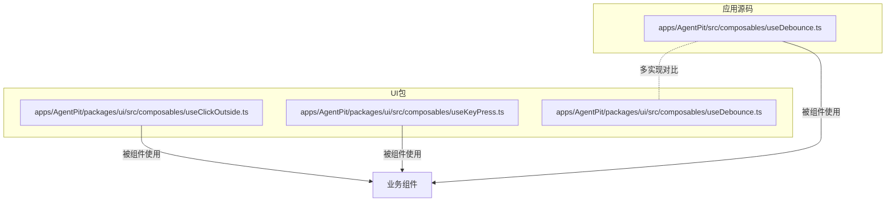
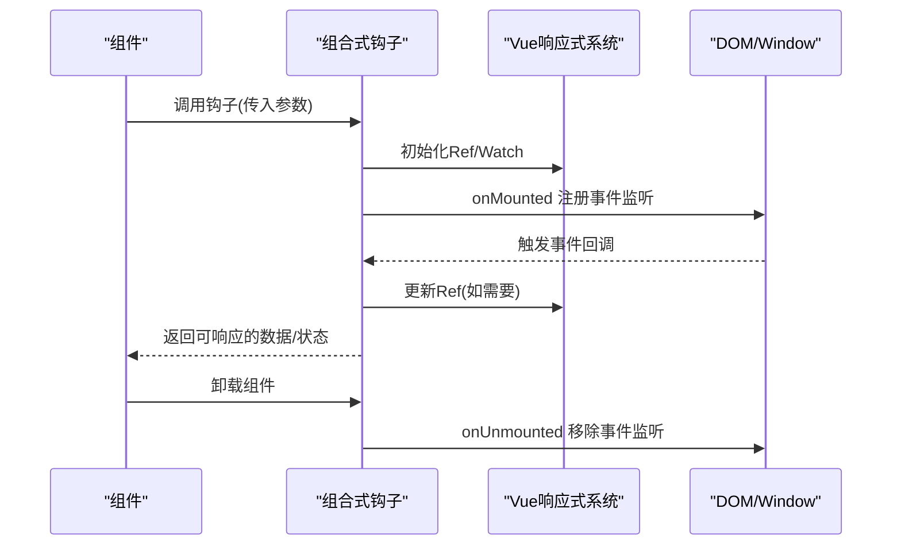
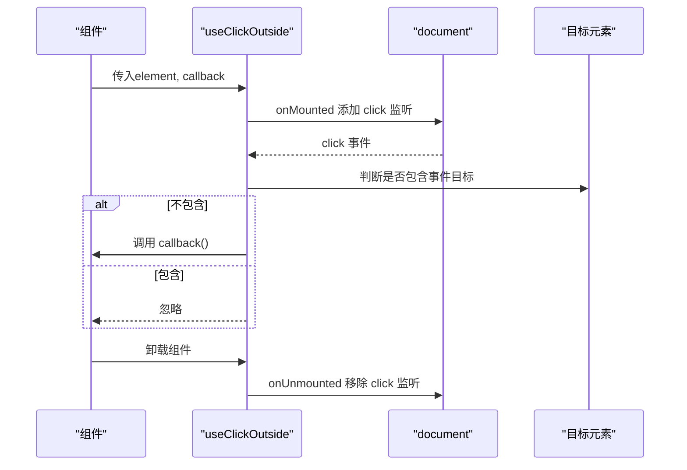
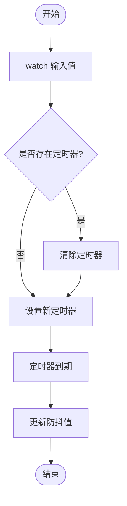
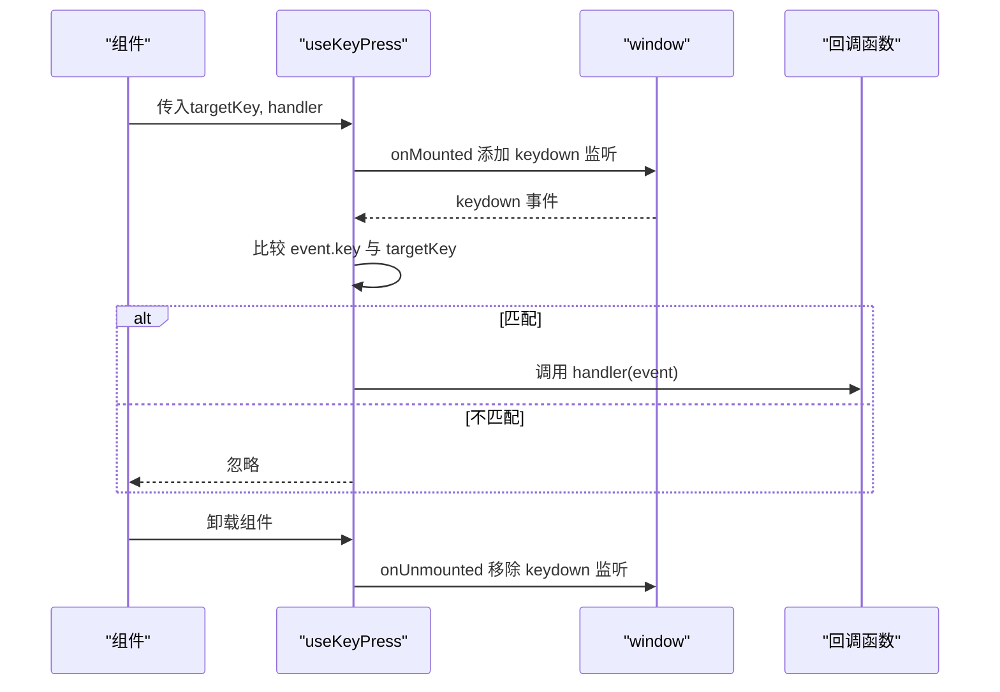
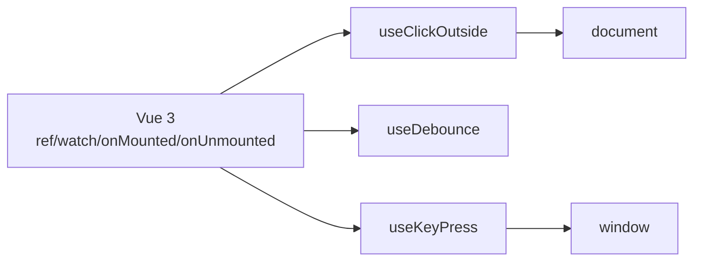

# 组合式API

<cite>
**本文引用的文件**
- [useDebounce.ts（UI包）](file://apps/AgentPit/packages/ui/src/composables/useDebounce.ts)
- [useDebounce.ts（应用源码）](file://apps/AgentPit/src/composables/useDebounce.ts)
- [useClickOutside.ts](file://apps/AgentPit/packages/ui/src/composables/useClickOutside.ts)
- [useKeyPress.ts](file://apps/AgentPit/packages/ui/src/composables/useKeyPress.ts)
</cite>

## 目录
1. [简介](#简介)
2. [项目结构](#项目结构)
3. [核心组件](#核心组件)
4. [架构总览](#架构总览)
5. [详细组件分析](#详细组件分析)
6. [依赖关系分析](#依赖关系分析)
7. [性能考量](#性能考量)
8. [故障排查指南](#故障排查指南)
9. [结论](#结论)
10. [附录](#附录)

## 简介
本文件面向DAOApps中的组合式API，系统性梳理并说明以下可复用逻辑钩子的设计目的、使用场景、参数与返回值、副作用、内部实现原理、依赖注入与状态管理方式，并给出性能优化建议、最佳实践与调试技巧：
- useClickOutside：监听全局点击事件，当点击目标不在指定元素内时触发回调
- useDebounce：对输入值进行防抖处理，延迟更新到新值
- useKeyPress：监听键盘按键事件，匹配目标键时调用处理器

这些组合式API均基于Vue 3的响应式系统与生命周期钩子，遵循“关注点分离”的设计原则，便于在组件中以声明式的方式接入通用交互与数据处理逻辑。

## 项目结构
DAOApps采用多应用工作区组织，组合式API主要分布在两个位置：
- 应用源码目录：apps/AgentPit/src/composables
- UI包目录：apps/AgentPit/packages/ui/src/composables

两者均提供useDebounce实现，但存在差异；其余两个钩子仅在UI包中提供。下图展示了与本文相关的文件分布与关系：

图表来源
- [useDebounce.ts（UI包）:1-18](file://apps/AgentPit/packages/ui/src/composables/useDebounce.ts#L1-L18)
- [useDebounce.ts（应用源码）:1-21](file://apps/AgentPit/src/composables/useDebounce.ts#L1-L21)
- [useClickOutside.ts:1-18](file://apps/AgentPit/packages/ui/src/composables/useClickOutside.ts#L1-L18)
- [useKeyPress.ts:1-18](file://apps/AgentPit/packages/ui/src/composables/useKeyPress.ts#L1-L18)

章节来源
- [useDebounce.ts（UI包）:1-18](file://apps/AgentPit/packages/ui/src/composables/useDebounce.ts#L1-L18)
- [useDebounce.ts（应用源码）:1-21](file://apps/AgentPit/src/composables/useDebounce.ts#L1-L21)
- [useClickOutside.ts:1-18](file://apps/AgentPit/packages/ui/src/composables/useClickOutside.ts#L1-L18)
- [useKeyPress.ts:1-18](file://apps/AgentPit/packages/ui/src/composables/useKeyPress.ts#L1-L18)

## 核心组件
本节概述三个组合式API的设计目标与典型使用场景：
- useClickOutside：用于实现“点击外部关闭”“弹层外点击收起”等交互模式，常配合下拉菜单、模态框、提示气泡等组件
- useDebounce：用于优化高频输入或频繁变更带来的性能压力，如搜索框输入、窗口尺寸变化、滚动事件等
- useKeyPress：用于快捷键绑定、热键触发、无障碍访问等场景，如Esc关闭、Enter提交等

章节来源
- [useClickOutside.ts:1-18](file://apps/AgentPit/packages/ui/src/composables/useClickOutside.ts#L1-L18)
- [useDebounce.ts（UI包）:1-18](file://apps/AgentPit/packages/ui/src/composables/useDebounce.ts#L1-L18)
- [useDebounce.ts（应用源码）:1-21](file://apps/AgentPit/src/composables/useDebounce.ts#L1-L21)
- [useKeyPress.ts:1-18](file://apps/AgentPit/packages/ui/src/composables/useKeyPress.ts#L1-L18)

## 架构总览
三个组合式API均通过Vue 3的响应式系统与生命周期钩子实现：
- 响应式数据：使用ref与watch建立依赖与更新链路
- 生命周期：在onMounted注册事件监听，在onUnmounted移除监听，避免内存泄漏
- 事件处理：在组件挂载后向document/window注册事件监听器，回调中判断条件并执行用户提供的处理函数

图表来源
- [useClickOutside.ts:1-18](file://apps/AgentPit/packages/ui/src/composables/useClickOutside.ts#L1-L18)
- [useDebounce.ts（UI包）:1-18](file://apps/AgentPit/packages/ui/src/composables/useDebounce.ts#L1-L18)
- [useDebounce.ts（应用源码）:1-21](file://apps/AgentPit/src/composables/useDebounce.ts#L1-L21)
- [useKeyPress.ts:1-18](file://apps/AgentPit/packages/ui/src/composables/useKeyPress.ts#L1-L18)

## 详细组件分析

### useClickOutside 分析
- 设计目的：在全局范围内监听点击事件，当点击目标不在指定元素内时触发回调，常用于“点击外部关闭”
- 参数
  - element: Ref<HTMLElement | null>，指向需要排除在外的元素引用
  - callback: () => void，点击外部时的回调函数
- 返回值：无（不返回可观察数据）
- 副作用：在组件挂载时向document添加click监听，在卸载时移除；若多次调用需确保成对注册与移除
- 内部实现要点
  - 使用onMounted/onUnmounted管理事件监听生命周期
  - 在事件回调中通过element.value.contains判断是否在目标元素内部
  - 通过闭包捕获callback，保证回调在正确的上下文中执行
- 典型使用场景
  - 下拉菜单、弹层、提示气泡等需要“点击外部关闭”的交互
- 注意事项
  - 需要确保传入的element是真实DOM节点且在组件挂载后才被赋值
  - 若存在多个useClickOutside实例，注意避免重复注册同一事件类型导致的冲突

图表来源
- [useClickOutside.ts:1-18](file://apps/AgentPit/packages/ui/src/composables/useClickOutside.ts#L1-L18)

章节来源
- [useClickOutside.ts:1-18](file://apps/AgentPit/packages/ui/src/composables/useClickOutside.ts#L1-L18)

### useDebounce 分析
- 设计目的：对频繁变更的值进行防抖，减少不必要的计算与渲染开销
- 参数
  - value: Ref<T> 或 (() => T)，支持Ref或函数形式的动态取值
  - delay: number，默认300ms，防抖延迟时间
- 返回值：Ref<T>，防抖后的可观察值
- 副作用：在组件挂载时开始watch，卸载时自动停止；内部维护定时器，避免竞态与内存泄漏
- 内部实现要点
  - 使用watch监听输入值的变化
  - 每次变更前清理上一次定时器，确保只保留最后一次变更
  - 定时器到期后更新debouncedValue
  - 支持两种输入形式：Ref或函数，函数形式会在每次取值时重新计算
- 典型使用场景
  - 搜索框输入、窗口resize、滚动事件、高频表单字段变更
- 注意事项
  - 函数形式的输入会带来额外的计算成本，需谨慎使用
  - 若delay过小可能导致防抖失效，过大则影响交互反馈

图表来源
- [useDebounce.ts（UI包）:1-18](file://apps/AgentPit/packages/ui/src/composables/useDebounce.ts#L1-L18)
- [useDebounce.ts（应用源码）:1-21](file://apps/AgentPit/src/composables/useDebounce.ts#L1-L21)

章节来源
- [useDebounce.ts（UI包）:1-18](file://apps/AgentPit/packages/ui/src/composables/useDebounce.ts#L1-L18)
- [useDebounce.ts（应用源码）:1-21](file://apps/AgentPit/src/composables/useDebounce.ts#L1-L21)

### useKeyPress 分析
- 设计目的：监听键盘事件，当按下目标键时触发回调，常用于快捷键与无障碍功能
- 参数
  - targetKey: string，目标按键标识，如'Escape'、'Enter'
  - handler: (event: KeyboardEvent) => void，按键匹配时的回调函数
- 返回值：无（不返回可观察数据）
- 副作用：在组件挂载时向window注册keydown监听，在卸载时移除
- 内部实现要点
  - 使用onMounted/onUnmounted管理事件监听生命周期
  - 在事件回调中比较event.key与targetKey，匹配则调用handler
  - 通过闭包捕获handler，保证回调在正确的上下文中执行
- 典型使用场景
  - Esc关闭、Enter提交、空格播放/暂停等
- 注意事项
  - 需要确保targetKey与浏览器实际事件key一致
  - 若存在多个useKeyPress实例，注意避免重复注册同一事件类型

图表来源
- [useKeyPress.ts:1-18](file://apps/AgentPit/packages/ui/src/composables/useKeyPress.ts#L1-L18)

章节来源
- [useKeyPress.ts:1-18](file://apps/AgentPit/packages/ui/src/composables/useKeyPress.ts#L1-L18)

## 依赖关系分析
- Vue 3核心依赖
  - ref：用于创建可观察的响应式值
  - watch：用于监听响应式数据变化
  - onMounted/onUnmounted：用于管理生命周期内的副作用
- 事件依赖
  - useClickOutside依赖document事件
  - useKeyPress依赖window事件
- 代码耦合度
  - 三个钩子均与Vue生命周期强耦合，但彼此独立，无直接相互依赖
  - 事件监听器在钩子内部注册与移除，避免跨组件污染

图表来源
- [useClickOutside.ts:1-18](file://apps/AgentPit/packages/ui/src/composables/useClickOutside.ts#L1-L18)
- [useDebounce.ts（UI包）:1-18](file://apps/AgentPit/packages/ui/src/composables/useDebounce.ts#L1-L18)
- [useDebounce.ts（应用源码）:1-21](file://apps/AgentPit/src/composables/useDebounce.ts#L1-L21)
- [useKeyPress.ts:1-18](file://apps/AgentPit/packages/ui/src/composables/useKeyPress.ts#L1-L18)

章节来源
- [useClickOutside.ts:1-18](file://apps/AgentPit/packages/ui/src/composables/useClickOutside.ts#L1-L18)
- [useDebounce.ts（UI包）:1-18](file://apps/AgentPit/packages/ui/src/composables/useDebounce.ts#L1-L18)
- [useDebounce.ts（应用源码）:1-21](file://apps/AgentPit/src/composables/useDebounce.ts#L1-L21)
- [useKeyPress.ts:1-18](file://apps/AgentPit/packages/ui/src/composables/useKeyPress.ts#L1-L18)

## 性能考量
- 防抖策略
  - 合理设置delay：过短无法达到去抖效果，过长影响交互体验
  - 对于高频率输入，优先使用useDebounce减少无效计算
- 事件监听
  - 确保在onUnmounted中移除监听，避免内存泄漏与重复注册
  - 在复杂页面中，尽量减少全局监听数量，必要时考虑委托或条件过滤
- 响应式更新
  - useDebounce内部通过定时器控制更新时机，避免频繁渲染
  - 对函数形式的输入值，注意其计算成本，必要时缓存或拆分逻辑
- 最佳实践
  - 将useClickOutside与useKeyPress封装为更高层的组合式工具，统一管理事件策略
  - 在大型组件树中，优先使用局部事件监听而非全局监听

## 故障排查指南
- 常见问题
  - 回调未触发：检查element引用是否正确赋值、事件是否在挂载后注册、targetKey是否匹配
  - 内存泄漏：确认onUnmounted是否执行，监听器是否被移除
  - 防抖无效：检查delay设置是否合理，watch是否正确触发
- 调试技巧
  - 在回调中加入日志输出，定位事件触发路径
  - 使用浏览器开发者工具断点，检查事件回调中的this与上下文
  - 对useDebounce，可在定时器设置与清理处加日志，验证竞态与清理逻辑
- 排查步骤
  - 确认组件生命周期：onMounted/onUnmounted是否成对出现
  - 检查事件目标：useClickOutside中event.target与element.value的关系
  - 校验按键标识：useKeyPress中event.key与targetKey的一致性

## 结论
DAOApps的组合式API以简洁、可复用为核心设计理念，通过Vue 3的响应式与生命周期机制，将通用交互与数据处理逻辑抽象为可插拔的钩子。useClickOutside、useDebounce、useKeyPress分别覆盖了“点击外部关闭”“输入防抖”“按键监听”三大高频场景。在实际使用中，建议结合业务需求选择合适的参数与延迟，严格遵循生命周期管理与事件清理，以获得稳定、高性能的用户体验。

## 附录
- 实际使用示例（路径参考）
  - 在组件中使用useClickOutside：[useClickOutside.ts:1-18](file://apps/AgentPit/packages/ui/src/composables/useClickOutside.ts#L1-L18)
  - 在组件中使用useDebounce：[useDebounce.ts（UI包）:1-18](file://apps/AgentPit/packages/ui/src/composables/useDebounce.ts#L1-L18)、[useDebounce.ts（应用源码）:1-21](file://apps/AgentPit/src/composables/useDebounce.ts#L1-L21)
  - 在组件中使用useKeyPress：[useKeyPress.ts:1-18](file://apps/AgentPit/packages/ui/src/composables/useKeyPress.ts#L1-L18)
- 版本与差异
  - UI包与应用源码均提供useDebounce实现，前者更偏向Ref输入，后者同时支持Ref与函数输入，可根据场景选择