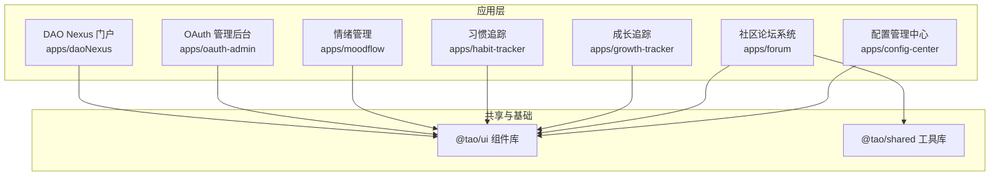
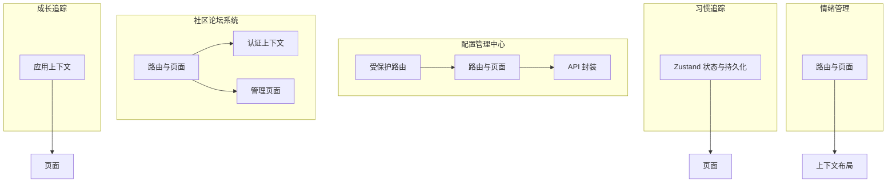
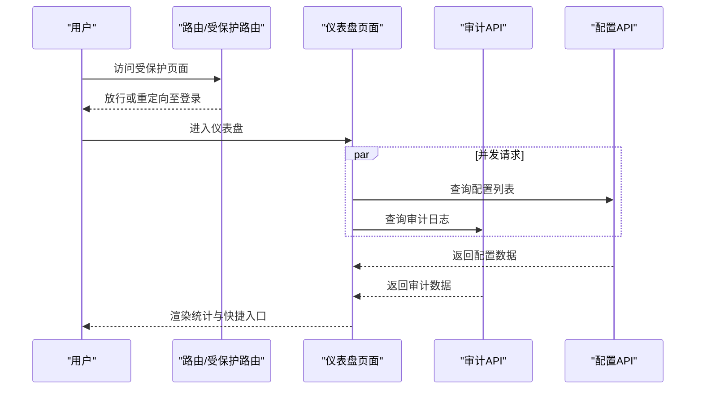
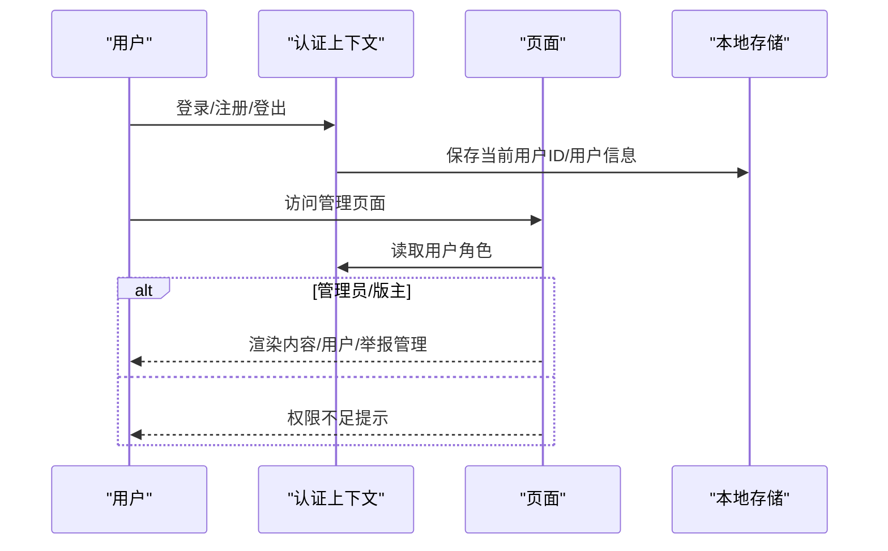
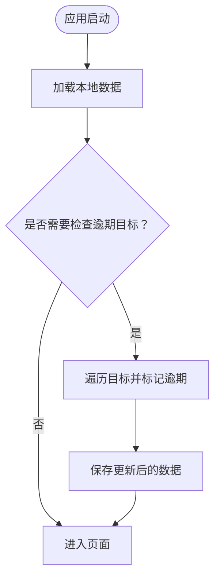
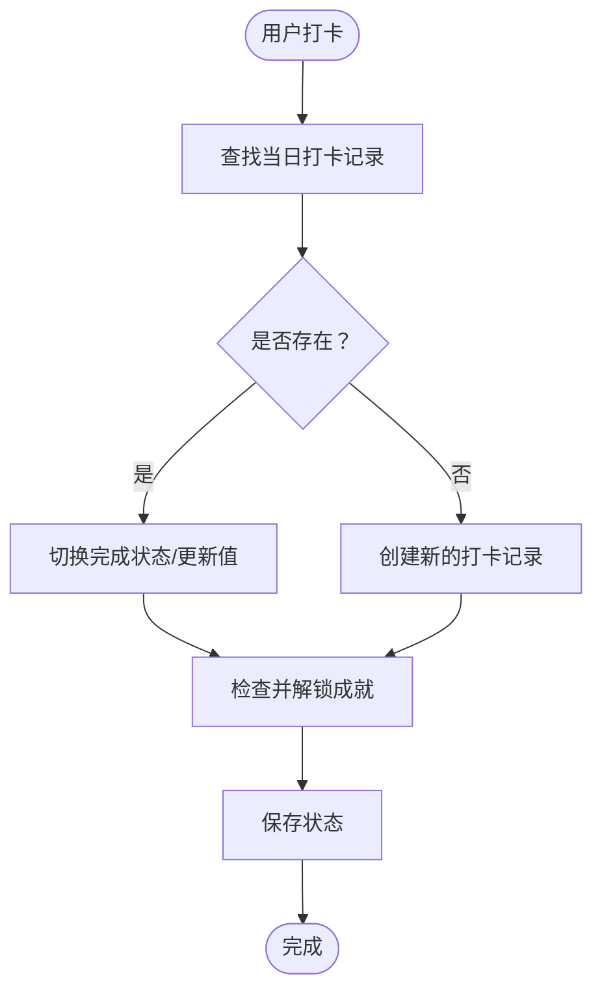
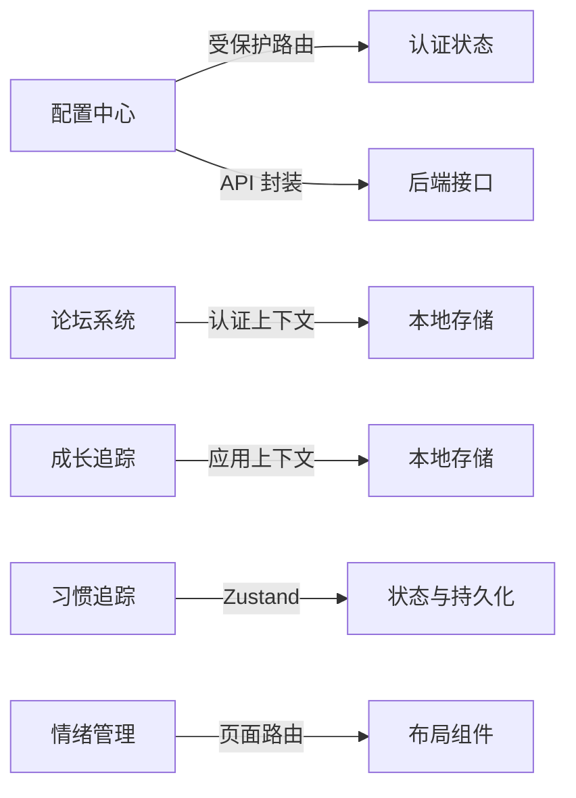

# 业务应用集合

<cite>
**本文引用的文件**
- [apps/config-center/src/App.tsx](file://apps/config-center/src/App.tsx)
- [apps/config-center/src/components/ProtectedRoute.tsx](file://apps/config-center/src/components/ProtectedRoute.tsx)
- [apps/config-center/src/pages/DashboardPage.tsx](file://apps/config-center/src/pages/DashboardPage.tsx)
- [apps/config-center/src/api/configs.ts](file://apps/config-center/src/api/configs.ts)
- [apps/config-center/src/api/users.ts](file://apps/config-center/src/api/users.ts)
- [apps/config-center/src/api/roles.ts](file://apps/config-center/src/api/roles.ts)
- [apps/config-center/src/api/audit.ts](file://apps/config-center/src/api/audit.ts)
- [apps/forum/src/App.tsx](file://apps/forum/src/App.tsx)
- [apps/forum/src/context/AuthContext.tsx](file://apps/forum/src/context/AuthContext.tsx)
- [apps/forum/src/pages/AdminPage.tsx](file://apps/forum/src/pages/AdminPage.tsx)
- [apps/growth-tracker/src/App.tsx](file://apps/growth-tracker/src/App.tsx)
- [apps/growth-tracker/src/context/AppContext.tsx](file://apps/growth-tracker/src/context/AppContext.tsx)
- [apps/habit-tracker/src/App.tsx](file://apps/habit-tracker/src/App.tsx)
- [apps/habit-tracker/src/store/habitStore.ts](file://apps/habit-tracker/src/store/habitStore.ts)
- [apps/moodflow/src/App.tsx](file://apps/moodflow/src/App.tsx)
</cite>

## 目录
1. [简介](#简介)
2. [项目结构](#项目结构)
3. [核心组件](#核心组件)
4. [架构总览](#架构总览)
5. [详细组件分析](#详细组件分析)
6. [依赖关系分析](#依赖关系分析)
7. [性能与可扩展性](#性能与可扩展性)
8. [故障排查指南](#故障排查指南)
9. [结论](#结论)
10. [附录：部署与配置](#附录部署与配置)

## 简介
本文件面向“业务应用集合”，系统化梳理以下业务域的功能与实现要点：
- 配置管理中心：动态配置管理、权限控制（RBAC）、审计日志
- 社区论坛系统：用户管理、内容发布、管理员功能
- 个人成长工具集：成长追踪、习惯管理、情绪管理、目标设定
同时，给出应用间的数据交互与共享机制、统一认证方案、部署与配置建议。

## 项目结构
该仓库采用多应用并行的前端工程组织方式，每个业务应用独立构建与运行，通过统一的入口与路由进行导航。核心应用包括：
- 配置管理中心（React + 路由）
- 社区论坛系统（React + 上下文）
- 成长追踪（React + 上下文）
- 习惯追踪（React + Zustand 持久化）
- 情绪管理（React + 上下文）
- OAuth 管理后台（用于连接与活动监控）
- DAO Nexus 应用门户（应用聚合入口）

图示来源
- [apps/config-center/src/App.tsx:1-39](file://apps/config-center/src/App.tsx#L1-L39)
- [apps/forum/src/App.tsx:1-49](file://apps/forum/src/App.tsx#L1-L49)
- [apps/growth-tracker/src/App.tsx:1-37](file://apps/growth-tracker/src/App.tsx#L1-L37)
- [apps/habit-tracker/src/App.tsx:1-30](file://apps/habit-tracker/src/App.tsx#L1-L30)
- [apps/moodflow/src/App.tsx:1-43](file://apps/moodflow/src/App.tsx#L1-L43)

章节来源
- [apps/config-center/src/App.tsx:1-39](file://apps/config-center/src/App.tsx#L1-L39)
- [apps/forum/src/App.tsx:1-49](file://apps/forum/src/App.tsx#L1-L49)
- [apps/growth-tracker/src/App.tsx:1-37](file://apps/growth-tracker/src/App.tsx#L1-L37)
- [apps/habit-tracker/src/App.tsx:1-30](file://apps/habit-tracker/src/App.tsx#L1-L30)
- [apps/moodflow/src/App.tsx:1-43](file://apps/moodflow/src/App.tsx#L1-L43)

## 核心组件
- 配置管理中心
  - 路由与受保护访问：登录页、仪表盘、配置列表、版本管理、审计日志、用户与角色管理
  - 权限控制：受保护路由组件校验登录态
  - 数据访问：配置、用户、角色、审计日志 API 封装
- 社区论坛系统
  - 认证上下文：登录、注册、登出、更新资料
  - 管理员界面：内容管理、用户管理、举报处理
- 成长追踪
  - 应用上下文：技能、目标、成就、设置的增删改查与本地持久化
- 习惯追踪
  - 状态管理：Zustand + 持久化，支持习惯 CRUD、打卡、连击统计、成就解锁、导入导出
- 情绪管理
  - 应用上下文布局与页面路由，提供仪表盘、日记、日历、洞察、设置等页面

章节来源
- [apps/config-center/src/components/ProtectedRoute.tsx:1-14](file://apps/config-center/src/components/ProtectedRoute.tsx#L1-L14)
- [apps/config-center/src/api/configs.ts:1-33](file://apps/config-center/src/api/configs.ts#L1-L33)
- [apps/config-center/src/api/users.ts:1-26](file://apps/config-center/src/api/users.ts#L1-L26)
- [apps/config-center/src/api/roles.ts:1-26](file://apps/config-center/src/api/roles.ts#L1-L26)
- [apps/config-center/src/api/audit.ts:1-18](file://apps/config-center/src/api/audit.ts#L1-L18)
- [apps/forum/src/context/AuthContext.tsx:1-93](file://apps/forum/src/context/AuthContext.tsx#L1-L93)
- [apps/forum/src/pages/AdminPage.tsx:1-242](file://apps/forum/src/pages/AdminPage.tsx#L1-L242)
- [apps/growth-tracker/src/context/AppContext.tsx:1-163](file://apps/growth-tracker/src/context/AppContext.tsx#L1-L163)
- [apps/habit-tracker/src/store/habitStore.ts:1-545](file://apps/habit-tracker/src/store/habitStore.ts#L1-L545)
- [apps/moodflow/src/App.tsx:1-43](file://apps/moodflow/src/App.tsx#L1-L43)

## 架构总览
从架构视角看，各应用以“前端单页应用”形态存在，内部通过：
- 路由与页面组件组织功能
- 上下文/状态库（如 React Context、Zustand）管理局部状态
- API 层封装与后端服务交互
- 共享 UI 与工具库提升一致性与复用度

图示来源
- [apps/config-center/src/App.tsx:1-39](file://apps/config-center/src/App.tsx#L1-L39)
- [apps/config-center/src/components/ProtectedRoute.tsx:1-14](file://apps/config-center/src/components/ProtectedRoute.tsx#L1-L14)
- [apps/forum/src/App.tsx:1-49](file://apps/forum/src/App.tsx#L1-L49)
- [apps/growth-tracker/src/context/AppContext.tsx:1-163](file://apps/growth-tracker/src/context/AppContext.tsx#L1-L163)
- [apps/habit-tracker/src/store/habitStore.ts:1-545](file://apps/habit-tracker/src/store/habitStore.ts#L1-L545)
- [apps/moodflow/src/App.tsx:1-43](file://apps/moodflow/src/App.tsx#L1-L43)

## 详细组件分析

### 配置管理中心
- 功能特性
  - 动态配置管理：查询、创建、更新、删除、发布配置
  - 权限控制：基于受保护路由的登录态校验
  - 审计日志：按资源类型/ID/操作者/动作查询与查看
  - 用户与角色管理：用户与角色的增删改查
- 关键流程
  - 登录后进入受保护路由，仪表盘并发加载配置与审计日志，展示统计与快捷入口
  - 配置列表支持分页与筛选，详情页支持发布操作
  - 审计日志支持多维过滤，便于溯源与合规

图示来源
- [apps/config-center/src/components/ProtectedRoute.tsx:1-14](file://apps/config-center/src/components/ProtectedRoute.tsx#L1-L14)
- [apps/config-center/src/pages/DashboardPage.tsx:1-174](file://apps/config-center/src/pages/DashboardPage.tsx#L1-L174)
- [apps/config-center/src/api/configs.ts:1-33](file://apps/config-center/src/api/configs.ts#L1-L33)
- [apps/config-center/src/api/audit.ts:1-18](file://apps/config-center/src/api/audit.ts#L1-L18)

章节来源
- [apps/config-center/src/App.tsx:1-39](file://apps/config-center/src/App.tsx#L1-L39)
- [apps/config-center/src/components/ProtectedRoute.tsx:1-14](file://apps/config-center/src/components/ProtectedRoute.tsx#L1-L14)
- [apps/config-center/src/pages/DashboardPage.tsx:1-174](file://apps/config-center/src/pages/DashboardPage.tsx#L1-L174)
- [apps/config-center/src/api/configs.ts:1-33](file://apps/config-center/src/api/configs.ts#L1-L33)
- [apps/config-center/src/api/users.ts:1-26](file://apps/config-center/src/api/users.ts#L1-L26)
- [apps/config-center/src/api/roles.ts:1-26](file://apps/config-center/src/api/roles.ts#L1-L26)
- [apps/config-center/src/api/audit.ts:1-18](file://apps/config-center/src/api/audit.ts#L1-L18)

### 社区论坛系统
- 功能特性
  - 用户管理：登录、注册、登出、资料更新
  - 内容发布：主题创建、分类浏览、搜索、个人资料页
  - 管理员功能：内容管理（置顶/锁定/隐藏/删除）、用户管理、举报处理
- 关键流程
  - 认证上下文负责用户状态与持久化；管理员页面根据角色渲染不同能力
  - 管理员可对主题与用户进行批量操作，支持搜索过滤

图示来源
- [apps/forum/src/context/AuthContext.tsx:1-93](file://apps/forum/src/context/AuthContext.tsx#L1-L93)
- [apps/forum/src/pages/AdminPage.tsx:1-242](file://apps/forum/src/pages/AdminPage.tsx#L1-L242)
- [apps/forum/src/App.tsx:1-49](file://apps/forum/src/App.tsx#L1-L49)

章节来源
- [apps/forum/src/context/AuthContext.tsx:1-93](file://apps/forum/src/context/AuthContext.tsx#L1-L93)
- [apps/forum/src/pages/AdminPage.tsx:1-242](file://apps/forum/src/pages/AdminPage.tsx#L1-L242)
- [apps/forum/src/App.tsx:1-49](file://apps/forum/src/App.tsx#L1-L49)

### 成长追踪
- 功能特性
  - 技能管理：新增、升级、删除，带历史记录与更新时间
  - 目标管理：新增、进度更新、完成、删除，自动逾期检测
  - 成就管理：新增、删除
  - 设置管理：应用级设置更新
- 关键流程
  - 应用上下文在内存中维护数据，变更时持久化到本地存储
  - 自动任务：启动时检查逾期目标并更新状态

图示来源
- [apps/growth-tracker/src/context/AppContext.tsx:1-163](file://apps/growth-tracker/src/context/AppContext.tsx#L1-L163)

章节来源
- [apps/growth-tracker/src/context/AppContext.tsx:1-163](file://apps/growth-tracker/src/context/AppContext.tsx#L1-L163)
- [apps/growth-tracker/src/App.tsx:1-37](file://apps/growth-tracker/src/App.tsx#L1-L37)

### 习惯追踪
- 功能特性
  - 习惯 CRUD、打卡、归档
  - 连击统计（当前/最长）、完成率、活跃习惯
  - 成就系统：基于连击、里程碑、探索、完美日、回归等条件解锁
  - 数据管理：导出 JSON、导入 JSON、清空数据
- 关键流程
  - 打卡触发后异步检查成就，必要时更新成就状态
  - 统计函数按天窗口计算完成率，支持全局平均值

图示来源
- [apps/habit-tracker/src/store/habitStore.ts:237-268](file://apps/habit-tracker/src/store/habitStore.ts#L237-L268)
- [apps/habit-tracker/src/store/habitStore.ts:371-450](file://apps/habit-tracker/src/store/habitStore.ts#L371-L450)

章节来源
- [apps/habit-tracker/src/store/habitStore.ts:1-545](file://apps/habit-tracker/src/store/habitStore.ts#L1-L545)
- [apps/habit-tracker/src/App.tsx:1-30](file://apps/habit-tracker/src/App.tsx#L1-L30)

### 情绪管理
- 功能特性
  - 页面路由：仪表盘、日记、日历、洞察、设置
  - 布局组件：侧边栏、移动端导航、检查项弹窗、消息提示
- 关键流程
  - 应用提供统一布局与页面容器，具体情绪记录与分析由页面组件承载

章节来源
- [apps/moodflow/src/App.tsx:1-43](file://apps/moodflow/src/App.tsx#L1-L43)

## 依赖关系分析
- 组件内聚与耦合
  - 各应用内部以页面/上下文/状态库为单元，内聚度高，跨应用耦合低
  - 共享 UI 与工具库通过 @tao/* 提供一致的视觉与工具能力
- 外部依赖
  - 配置中心：受保护路由依赖认证状态；API 封装统一调用后端
  - 论坛系统：认证上下文与本地存储结合，管理用户态
  - 成长追踪：应用上下文集中管理业务数据
  - 习惯追踪：Zustand 管理复杂状态与持久化
  - 情绪管理：页面路由与布局组件为主

图示来源
- [apps/config-center/src/components/ProtectedRoute.tsx:1-14](file://apps/config-center/src/components/ProtectedRoute.tsx#L1-L14)
- [apps/forum/src/context/AuthContext.tsx:1-93](file://apps/forum/src/context/AuthContext.tsx#L1-L93)
- [apps/growth-tracker/src/context/AppContext.tsx:1-163](file://apps/growth-tracker/src/context/AppContext.tsx#L1-L163)
- [apps/habit-tracker/src/store/habitStore.ts:1-545](file://apps/habit-tracker/src/store/habitStore.ts#L1-L545)
- [apps/moodflow/src/App.tsx:1-43](file://apps/moodflow/src/App.tsx#L1-L43)

## 性能与可扩展性
- 性能优化建议
  - 配置中心：仪表盘并发加载配置与审计日志，建议增加分页与缓存策略，避免一次性拉取过多数据
  - 论坛系统：管理员页面表格渲染量大时，建议虚拟滚动与懒加载
  - 成长追踪：本地存储频繁写入，建议节流/防抖合并更新
  - 习惯追踪：Zustand 持久化默认使用 localStorage，注意容量限制；大数据量场景可考虑 IndexedDB 或服务端同步
- 可扩展性建议
  - 统一认证：建议引入统一 OAuth Provider 与 Token 管理，跨应用共享登录态
  - 数据共享：通过事件总线或服务端推送实现跨应用数据联动（如成长追踪与习惯追踪的成就互通）
  - 审计与日志：配置中心的审计 API 可作为其他应用审计埋点的参考模板

[本节为通用指导，不直接分析具体文件]

## 故障排查指南
- 登录与权限
  - 若受保护路由跳转至登录页，请确认认证状态是否正确设置
  - 检查认证上下文中的用户状态与本地存储当前用户 ID 是否一致
- 配置中心
  - 仪表盘加载失败：检查网络请求与 API 返回格式，确认分页参数与鉴权头
  - 审计日志为空：确认查询参数与后端过滤逻辑
- 论坛系统
  - 管理员页面无权限：确认用户角色字段是否为 admin 或 moderator
  - 登录/注册失败：检查用户名/邮箱唯一性与密码校验
- 成长追踪
  - 数据未持久化：确认本地存储写入时机与异常捕获
- 习惯追踪
  - 打卡无效：检查 habitId 与日期匹配、提醒配置
  - 成就未解锁：核对解锁条件与当前数据状态

章节来源
- [apps/config-center/src/components/ProtectedRoute.tsx:1-14](file://apps/config-center/src/components/ProtectedRoute.tsx#L1-L14)
- [apps/forum/src/context/AuthContext.tsx:1-93](file://apps/forum/src/context/AuthContext.tsx#L1-L93)
- [apps/growth-tracker/src/context/AppContext.tsx:1-163](file://apps/growth-tracker/src/context/AppContext.tsx#L1-L163)
- [apps/habit-tracker/src/store/habitStore.ts:1-545](file://apps/habit-tracker/src/store/habitStore.ts#L1-L545)

## 结论
本业务应用集合以“应用自治、共享基础库”的方式实现，配置中心提供统一的动态配置与审计能力，论坛系统具备完善的用户与内容治理，成长追踪、习惯追踪、情绪管理覆盖个人成长的关键场景。建议后续在统一认证、跨应用数据共享与审计规范方面进一步完善，以支撑更大规模的业务演进。

[本节为总结性内容，不直接分析具体文件]

## 附录：部署与配置
- 部署建议
  - 各应用独立构建与部署，通过反向代理或网关统一入口
  - 配置中心与论坛系统建议启用 HTTPS 与鉴权中间件
  - 习惯追踪的持久化数据量较大时，建议迁移至服务端存储或 IndexedDB
- 配置选项
  - 路由与页面：根据实际菜单与权限调整路由表
  - API 基础地址：统一在 API 封装中配置，便于切换环境
  - 主题与语言：习惯追踪与情绪管理提供主题与语言设置，可在设置页调整
- 扩展开发建议
  - 引入统一认证与会话管理，实现跨应用单点登录
  - 建立跨应用事件总线或消息队列，实现数据联动（如成就互通）
  - 对关键业务（配置发布、内容审核）增加审批流与回滚机制

[本节为通用指导，不直接分析具体文件]