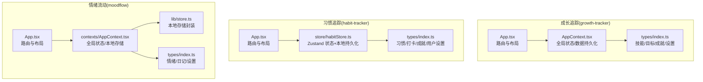
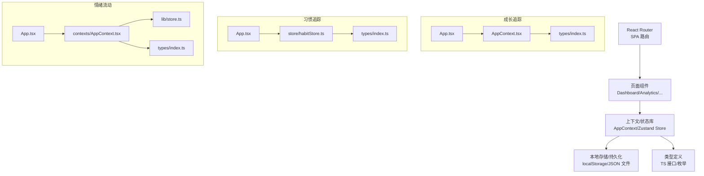
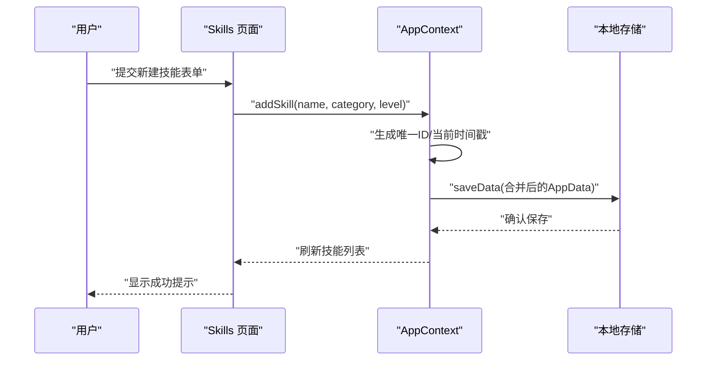
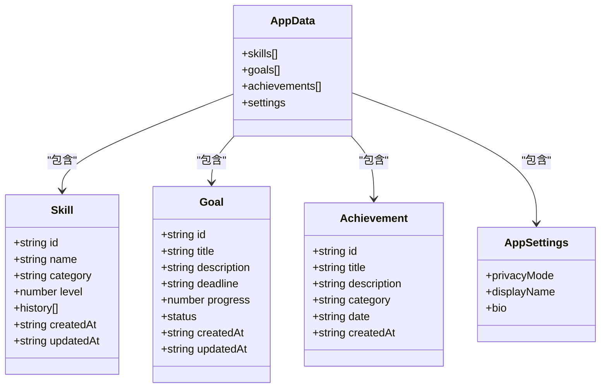
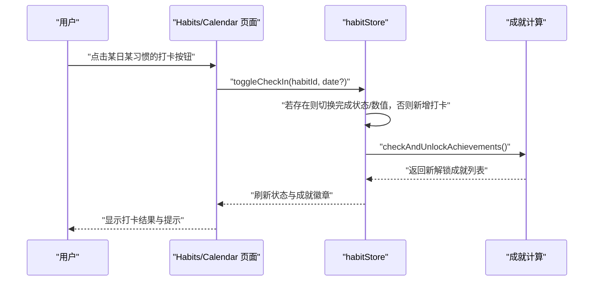
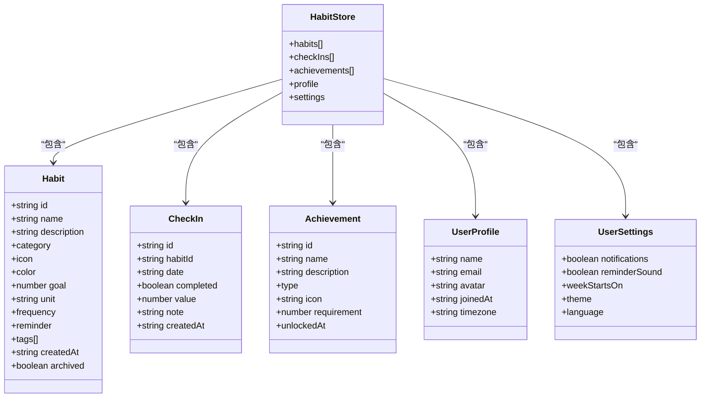
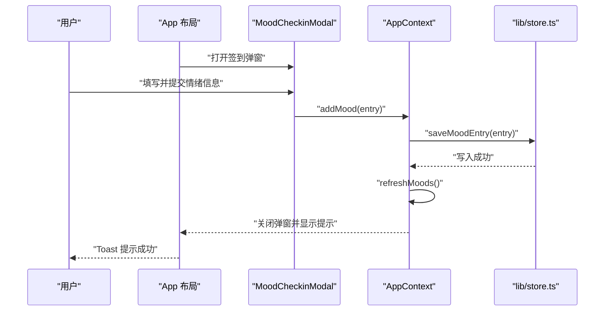
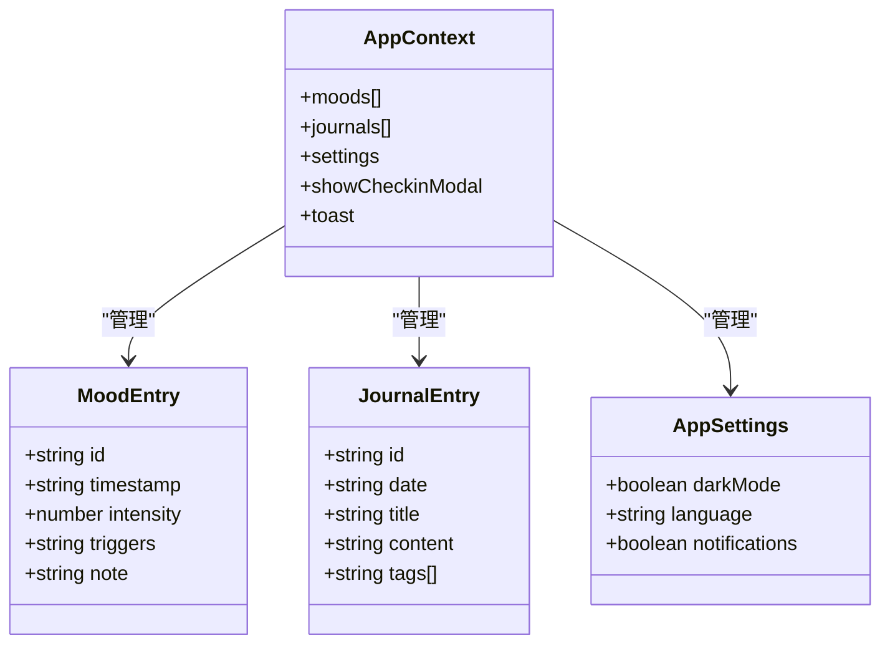
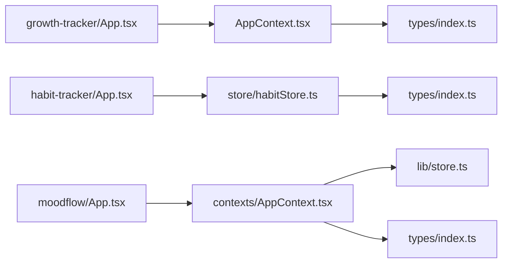

# 个人成长工具

<cite>
**本文引用的文件**
- [apps/growth-tracker/src/App.tsx](file://apps/growth-tracker/src/App.tsx)
- [apps/growth-tracker/src/context/AppContext.tsx](file://apps/growth-tracker/src/context/AppContext.tsx)
- [apps/growth-tracker/src/tabs/index.ts](file://apps/growth-tracker/src/tabs/index.ts)
- [apps/growth-tracker/src/types/index.ts](file://apps/growth-tracker/src/types/index.ts)
- [apps/habit-tracker/src/App.tsx](file://apps/habit-tracker/src/App.tsx)
- [apps/habit-tracker/src/store/habitStore.ts](file://apps/habit-tracker/src/store/habitStore.ts)
- [apps/habit-tracker/src/types/index.ts](file://apps/habit-tracker/src/types/index.ts)
- [apps/moodflow/src/App.tsx](file://apps/moodflow/src/App.tsx)
- [apps/moodflow/src/contexts/AppContext.tsx](file://apps/moodflow/src/contexts/AppContext.tsx)
- [apps/moodflow/src/lib/store.ts](file://apps/moodflow/src/lib/store.ts)
- [apps/moodflow/src/types/index.ts](file://apps/moodflow/src/types/index.ts)
</cite>

## 目录
1. [简介](#简介)
2. [项目结构](#项目结构)
3. [核心组件](#核心组件)
4. [架构总览](#架构总览)
5. [详细组件分析](#详细组件分析)
6. [依赖关系分析](#依赖关系分析)
7. [性能考量](#性能考量)
8. [故障排查指南](#故障排查指南)
9. [结论](#结论)
10. [附录](#附录)

## 简介
本文件面向“个人成长工具集合”，聚焦三大应用：成长追踪（growth-tracker）、习惯追踪（habit-tracker）、情绪流动（moodflow）。文档从系统架构、数据模型、功能特性、交互流程、数据持久化与导入导出、隐私与安全、UI 设计与个性化配置等方面，提供可操作的技术说明与使用指导，帮助用户高效达成个人成长目标。

## 项目结构
三个应用均采用前端单页应用（SPA）架构，分别在各自目录下提供路由、上下文/状态管理、类型定义与页面组件。整体组织方式为“按功能域分包”：路由入口负责页面级组件挂载，上下文或状态库负责数据与业务逻辑，类型定义统一约束数据结构，页面组件组合 UI 组件与业务逻辑。

图示来源
- [apps/growth-tracker/src/App.tsx:1-37](file://apps/growth-tracker/src/App.tsx#L1-L37)
- [apps/growth-tracker/src/context/AppContext.tsx:1-163](file://apps/growth-tracker/src/context/AppContext.tsx#L1-L163)
- [apps/growth-tracker/src/types/index.ts:1-44](file://apps/growth-tracker/src/types/index.ts#L1-L44)
- [apps/habit-tracker/src/App.tsx:1-30](file://apps/habit-tracker/src/App.tsx#L1-L30)
- [apps/habit-tracker/src/store/habitStore.ts:1-545](file://apps/habit-tracker/src/store/habitStore.ts#L1-L545)
- [apps/habit-tracker/src/types/index.ts:1-113](file://apps/habit-tracker/src/types/index.ts#L1-L113)
- [apps/moodflow/src/App.tsx:1-43](file://apps/moodflow/src/App.tsx#L1-L43)
- [apps/moodflow/src/contexts/AppContext.tsx:1-100](file://apps/moodflow/src/contexts/AppContext.tsx#L1-L100)
- [apps/moodflow/src/lib/store.ts](file://apps/moodflow/src/lib/store.ts)
- [apps/moodflow/src/types/index.ts](file://apps/moodflow/src/types/index.ts)

章节来源
- [apps/growth-tracker/src/App.tsx:1-37](file://apps/growth-tracker/src/App.tsx#L1-L37)
- [apps/habit-tracker/src/App.tsx:1-30](file://apps/habit-tracker/src/App.tsx#L1-L30)
- [apps/moodflow/src/App.tsx:1-43](file://apps/moodflow/src/App.tsx#L1-L43)

## 核心组件
- 成长追踪（growth-tracker）
  - 路由与布局：基于 React Router 的 SPA，提供仪表盘、技能、目标、成就、分析、报告、设置等页面。
  - 全局状态：AppContext 提供技能、目标、成就、设置的增删改查与本地持久化。
  - 数据模型：技能（含等级与历史）、目标（进度与状态）、成就（分类与日期）、应用设置（隐私、展示名、简介）。
- 习惯追踪（habit-tracker）
  - 路由与布局：SPA 结构，提供仪表盘、习惯列表、日历、成就、分析、设置。
  - 状态管理：Zustand + 持久化中间件，内置样本数据与成就解锁规则。
  - 数据模型：习惯（类别、频率、提醒、标签）、打卡（日期、完成状态、数值）、成就（类型与门槛）、用户资料与设置。
- 情绪流动（moodflow）
  - 路由与布局：SPA 结构，提供仪表盘、日记、日历、洞察、设置。
  - 全局状态：AppContext 封装情绪与日记的增删查与本地存储，支持暗色主题切换与提示消息。
  - 数据模型：情绪记录（时间戳、强度、触发事件）、日记条目（文本、标签）、应用设置（语言、主题、通知）。

章节来源
- [apps/growth-tracker/src/App.tsx:1-37](file://apps/growth-tracker/src/App.tsx#L1-L37)
- [apps/growth-tracker/src/context/AppContext.tsx:1-163](file://apps/growth-tracker/src/context/AppContext.tsx#L1-L163)
- [apps/growth-tracker/src/types/index.ts:1-44](file://apps/growth-tracker/src/types/index.ts#L1-L44)
- [apps/habit-tracker/src/App.tsx:1-30](file://apps/habit-tracker/src/App.tsx#L1-L30)
- [apps/habit-tracker/src/store/habitStore.ts:1-545](file://apps/habit-tracker/src/store/habitStore.ts#L1-L545)
- [apps/habit-tracker/src/types/index.ts:1-113](file://apps/habit-tracker/src/types/index.ts#L1-L113)
- [apps/moodflow/src/App.tsx:1-43](file://apps/moodflow/src/App.tsx#L1-L43)
- [apps/moodflow/src/contexts/AppContext.tsx:1-100](file://apps/moodflow/src/contexts/AppContext.tsx#L1-L100)
- [apps/moodflow/src/lib/store.ts](file://apps/moodflow/src/lib/store.ts)
- [apps/moodflow/src/types/index.ts](file://apps/moodflow/src/types/index.ts)

## 架构总览
三应用共享一致的前端架构范式：路由驱动页面、上下文/状态库承载业务数据、类型定义统一数据契约。数据持久化策略因应用而异：成长追踪通过上下文自动保存；习惯追踪通过 Zustand 持久化；情绪流动通过本地存储封装。

图示来源
- [apps/growth-tracker/src/App.tsx:1-37](file://apps/growth-tracker/src/App.tsx#L1-L37)
- [apps/growth-tracker/src/context/AppContext.tsx:1-163](file://apps/growth-tracker/src/context/AppContext.tsx#L1-L163)
- [apps/growth-tracker/src/types/index.ts:1-44](file://apps/growth-tracker/src/types/index.ts#L1-L44)
- [apps/habit-tracker/src/App.tsx:1-30](file://apps/habit-tracker/src/App.tsx#L1-L30)
- [apps/habit-tracker/src/store/habitStore.ts:1-545](file://apps/habit-tracker/src/store/habitStore.ts#L1-L545)
- [apps/habit-tracker/src/types/index.ts:1-113](file://apps/habit-tracker/src/types/index.ts#L1-L113)
- [apps/moodflow/src/App.tsx:1-43](file://apps/moodflow/src/App.tsx#L1-L43)
- [apps/moodflow/src/contexts/AppContext.tsx:1-100](file://apps/moodflow/src/contexts/AppContext.tsx#L1-L100)
- [apps/moodflow/src/lib/store.ts](file://apps/moodflow/src/lib/store.ts)
- [apps/moodflow/src/types/index.ts](file://apps/moodflow/src/types/index.ts)

## 详细组件分析

### 成长追踪（growth-tracker）
- 功能要点
  - 技能管理：新增、更新等级、删除；等级变更记录历史并按日去重合并。
  - 目标管理：新增、更新进度（0-100）、完成目标、删除；自动标记逾期目标。
  - 成就系统：按时间顺序插入新成就，支持分类与日期。
  - 设置管理：更新应用设置（隐私模式、展示名、简介）。
  - 数据持久化：每次状态变更自动保存至本地存储。
- 关键流程（添加技能）

图示来源
- [apps/growth-tracker/src/context/AppContext.tsx:49-54](file://apps/growth-tracker/src/context/AppContext.tsx#L49-L54)
- [apps/growth-tracker/src/context/AppContext.tsx:30-32](file://apps/growth-tracker/src/context/AppContext.tsx#L30-L32)

- 数据模型（简化）

图示来源
- [apps/growth-tracker/src/types/index.ts:1-44](file://apps/growth-tracker/src/types/index.ts#L1-L44)

章节来源
- [apps/growth-tracker/src/context/AppContext.tsx:1-163](file://apps/growth-tracker/src/context/AppContext.tsx#L1-L163)
- [apps/growth-tracker/src/types/index.ts:1-44](file://apps/growth-tracker/src/types/index.ts#L1-L44)

### 习惯追踪（habit-tracker）
- 功能要点
  - 习惯 CRUD：新增、更新、删除、归档。
  - 打卡机制：按日切换完成状态或自定义数值；支持备注；自动检查成就。
  - 连续性统计：当前连击与最长连击计算。
  - 奖励激励：多种成就类型（连击、里程碑、完美周/月、探索者、回归者）。
  - 统计分析：单习惯完成率、总体完成率、活跃习惯数。
  - 个性化配置：通知开关、提醒音效、周起始日、主题、语言。
  - 数据管理：导出 JSON、导入 JSON、清空数据并重置样本。
- 关键流程（打卡与成就解锁）

图示来源
- [apps/habit-tracker/src/store/habitStore.ts:237-268](file://apps/habit-tracker/src/store/habitStore.ts#L237-L268)
- [apps/habit-tracker/src/store/habitStore.ts:371-450](file://apps/habit-tracker/src/store/habitStore.ts#L371-L450)

- 数据模型（简化）

图示来源
- [apps/habit-tracker/src/types/index.ts:1-113](file://apps/habit-tracker/src/types/index.ts#L1-L113)
- [apps/habit-tracker/src/store/habitStore.ts:1-545](file://apps/habit-tracker/src/store/habitStore.ts#L1-L545)

章节来源
- [apps/habit-tracker/src/store/habitStore.ts:1-545](file://apps/habit-tracker/src/store/habitStore.ts#L1-L545)
- [apps/habit-tracker/src/types/index.ts:1-113](file://apps/habit-tracker/src/types/index.ts#L1-L113)

### 情绪流动（moodflow）
- 功能要点
  - 情绪记录：每日情绪签到（弹窗），支持刷新列表。
  - 日记管理：新增、删除日记条目，支持刷新。
  - 趋势分析：基于历史数据的可视化洞察（页面提供）。
  - 个性化建议：根据情绪与日记内容生成（页面提供）。
  - 设置管理：主题切换（暗色/亮色）、语言、通知等。
  - 数据持久化：本地存储封装，提供读写与删除接口。
- 关键流程（情绪签到与提示）

图示来源
- [apps/moodflow/src/App.tsx:12-28](file://apps/moodflow/src/App.tsx#L12-L28)
- [apps/moodflow/src/contexts/AppContext.tsx:59-67](file://apps/moodflow/src/contexts/AppContext.tsx#L59-L67)
- [apps/moodflow/src/contexts/AppContext.tsx:84-88](file://apps/moodflow/src/contexts/AppContext.tsx#L84-L88)
- [apps/moodflow/src/lib/store.ts](file://apps/moodflow/src/lib/store.ts)

- 数据模型（简化）

图示来源
- [apps/moodflow/src/types/index.ts](file://apps/moodflow/src/types/index.ts)
- [apps/moodflow/src/contexts/AppContext.tsx:1-100](file://apps/moodflow/src/contexts/AppContext.tsx#L1-L100)
- [apps/moodflow/src/lib/store.ts](file://apps/moodflow/src/lib/store.ts)

章节来源
- [apps/moodflow/src/App.tsx:1-43](file://apps/moodflow/src/App.tsx#L1-L43)
- [apps/moodflow/src/contexts/AppContext.tsx:1-100](file://apps/moodflow/src/contexts/AppContext.tsx#L1-L100)
- [apps/moodflow/src/lib/store.ts](file://apps/moodflow/src/lib/store.ts)
- [apps/moodflow/src/types/index.ts](file://apps/moodflow/src/types/index.ts)

## 依赖关系分析
- 应用内依赖
  - 成长追踪：App → AppContext → 类型定义；路由负责页面挂载。
  - 习惯追踪：App → Zustand 状态库 → 类型定义；内置样本数据与成就定义。
  - 情绪流动：App → 上下文 → 本地存储封装 → 类型定义；提供主题与提示能力。
- 外部依赖
  - React Router：路由与导航。
  - Zustand：状态管理与持久化（仅习惯追踪）。
  - localStorage：成长追踪与情绪流动的本地持久化基础。
- 可能的耦合点
  - 习惯追踪的成就系统与状态紧密耦合，需注意计算复杂度与触发时机。
  - 成长追踪的目标状态变更与逾期检测在初始化时执行一次，避免重复计算。

图示来源
- [apps/growth-tracker/src/App.tsx:1-37](file://apps/growth-tracker/src/App.tsx#L1-L37)
- [apps/growth-tracker/src/context/AppContext.tsx:1-163](file://apps/growth-tracker/src/context/AppContext.tsx#L1-L163)
- [apps/growth-tracker/src/types/index.ts:1-44](file://apps/growth-tracker/src/types/index.ts#L1-L44)
- [apps/habit-tracker/src/App.tsx:1-30](file://apps/habit-tracker/src/App.tsx#L1-L30)
- [apps/habit-tracker/src/store/habitStore.ts:1-545](file://apps/habit-tracker/src/store/habitStore.ts#L1-L545)
- [apps/habit-tracker/src/types/index.ts:1-113](file://apps/habit-tracker/src/types/index.ts#L1-L113)
- [apps/moodflow/src/App.tsx:1-43](file://apps/moodflow/src/App.tsx#L1-L43)
- [apps/moodflow/src/contexts/AppContext.tsx:1-100](file://apps/moodflow/src/contexts/AppContext.tsx#L1-L100)
- [apps/moodflow/src/lib/store.ts](file://apps/moodflow/src/lib/store.ts)
- [apps/moodflow/src/types/index.ts](file://apps/moodflow/src/types/index.ts)

章节来源
- [apps/growth-tracker/src/App.tsx:1-37](file://apps/growth-tracker/src/App.tsx#L1-L37)
- [apps/habit-tracker/src/App.tsx:1-30](file://apps/habit-tracker/src/App.tsx#L1-L30)
- [apps/moodflow/src/App.tsx:1-43](file://apps/moodflow/src/App.tsx#L1-L43)

## 性能考量
- 渲染与状态更新
  - 成长追踪：每次状态变更触发保存，建议批量更新或节流保存以减少频繁 IO。
  - 习惯追踪：Zustand 已内置持久化，注意成就计算在打卡后异步触发，避免阻塞 UI。
  - 情绪流动：本地存储读写在上下文中集中处理，避免重复查询。
- 计算复杂度
  - 连续性统计与完成率计算涉及日期遍历与排序，建议限制窗口天数或缓存中间结果。
  - 成就解锁遍历所有习惯与打卡记录，建议在用户空闲时或批量触发。
- 存储容量
  - 长期积累的历史数据可能增长，建议提供清理策略（如保留最近 N 天）与导出压缩。

## 故障排查指南
- 无法保存数据
  - 成长追踪：检查本地存储可用性与权限；确认 AppContext 的保存回调是否执行。
  - 习惯追踪：确认持久化中间件已启用且命名空间正确。
  - 情绪流动：确认本地存储 API 可用，查看写入函数异常。
- 打卡不生效
  - 习惯追踪：核对 habitId 与日期参数；检查 toggleCheckIn 是否被调用；查看成就计算是否抛错。
- 成就未解锁
  - 习惯追踪：核对成就门槛与当前统计值；确认 checkAndUnlockAchievements 是否被触发。
- 主题与语言异常
  - 情绪流动：确认设置项写入成功且 DOM 属性已更新；检查主题类名切换逻辑。
- 导入失败
  - 习惯追踪：确认 JSON 结构包含必需字段（如 habits、checkIns）；捕获解析异常并提示格式错误。

章节来源
- [apps/growth-tracker/src/context/AppContext.tsx:30-32](file://apps/growth-tracker/src/context/AppContext.tsx#L30-L32)
- [apps/habit-tracker/src/store/habitStore.ts:509-526](file://apps/habit-tracker/src/store/habitStore.ts#L509-L526)
- [apps/moodflow/src/contexts/AppContext.tsx:51-54](file://apps/moodflow/src/contexts/AppContext.tsx#L51-L54)

## 结论
本集合以清晰的 SPA 架构与明确的数据契约支撑三大成长领域：技能与目标的追踪、习惯的养成与激励、情绪的记录与洞察。通过本地持久化与可选的导入导出，用户可在多设备间保持一致性体验。建议后续增强跨平台同步、更丰富的可视化图表与更细粒度的隐私控制。

## 附录

### 使用场景示例与效果评估
- 成长追踪
  - 场景：设定季度学习目标，每日更新进度，查看完成率与逾期提醒。
  - 评估：目标完成率、技能等级提升曲线、成就解锁数量。
- 习惯追踪
  - 场景：建立晨跑、阅读、冥想等习惯，关注连击与完成率变化。
  - 评估：连击天数分布、总体完成率、成就解锁里程碑。
- 情绪流动
  - 场景：每日签到情绪强度，记录触发事件，定期回顾日记。
  - 评估：情绪波动趋势、触发事件频次、洞察报告质量。

### 数据导入导出与备份恢复
- 习惯追踪
  - 导出：导出完整状态为 JSON 字符串，包含习惯、打卡、成就、用户资料与设置。
  - 导入：解析 JSON 并校验必需字段，成功后替换当前状态。
  - 清空：重置为默认样本数据与设置。
- 成长追踪与情绪流动
  - 通过上下文或本地存储封装提供的读写接口进行迁移；建议先导出再导入，确保数据完整性。

章节来源
- [apps/habit-tracker/src/store/habitStore.ts:496-537](file://apps/habit-tracker/src/store/habitStore.ts#L496-L537)
- [apps/growth-tracker/src/context/AppContext.tsx:21-22](file://apps/growth-tracker/src/context/AppContext.tsx#L21-L22)
- [apps/moodflow/src/contexts/AppContext.tsx:59-77](file://apps/moodflow/src/contexts/AppContext.tsx#L59-L77)

### 隐私与安全
- 隐私模式
  - 成长追踪：应用设置中提供隐私模式选项，用于控制公开范围。
- 本地存储
  - 习惯追踪与情绪流动：数据存储于本地，建议用户定期导出备份；避免在公共设备上开启“记住我”等会话持久化。
- 建议
  - 对敏感数据进行本地加密（如需要更高安全级别）；提供一键清除数据功能。

章节来源
- [apps/growth-tracker/src/types/index.ts:33-37](file://apps/growth-tracker/src/types/index.ts#L33-L37)
- [apps/habit-tracker/src/store/habitStore.ts:528-537](file://apps/habit-tracker/src/store/habitStore.ts#L528-L537)
- [apps/moodflow/src/contexts/AppContext.tsx:79-82](file://apps/moodflow/src/contexts/AppContext.tsx#L79-L82)

### 用户界面设计与交互
- 统一布局
  - 三应用均采用侧边栏导航与主内容区的布局，移动端提供响应式适配。
- 交互模式
  - 成长追踪：表单提交后即时保存并反馈。
  - 习惯追踪：点击式打卡、数值式打卡、成就徽章提示。
  - 情绪流动：弹窗签到、Toast 提示、主题切换。
- 个性化配置
  - 习惯追踪：主题、语言、周起始日、通知与提醒音效。
  - 情绪流动：暗色/亮色主题、语言、通知。

章节来源
- [apps/growth-tracker/src/App.tsx:1-37](file://apps/growth-tracker/src/App.tsx#L1-L37)
- [apps/habit-tracker/src/App.tsx:1-30](file://apps/habit-tracker/src/App.tsx#L1-L30)
- [apps/moodflow/src/App.tsx:1-43](file://apps/moodflow/src/App.tsx#L1-L43)
- [apps/habit-tracker/src/store/habitStore.ts:67-73](file://apps/habit-tracker/src/store/habitStore.ts#L67-L73)
- [apps/moodflow/src/contexts/AppContext.tsx:51-54](file://apps/moodflow/src/contexts/AppContext.tsx#L51-L54)