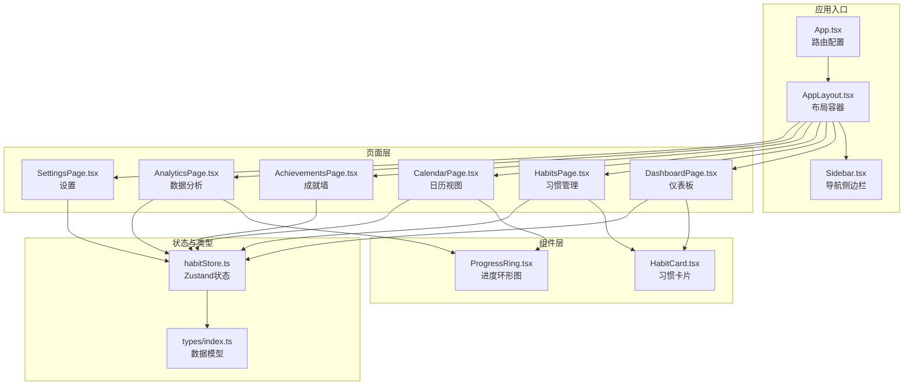
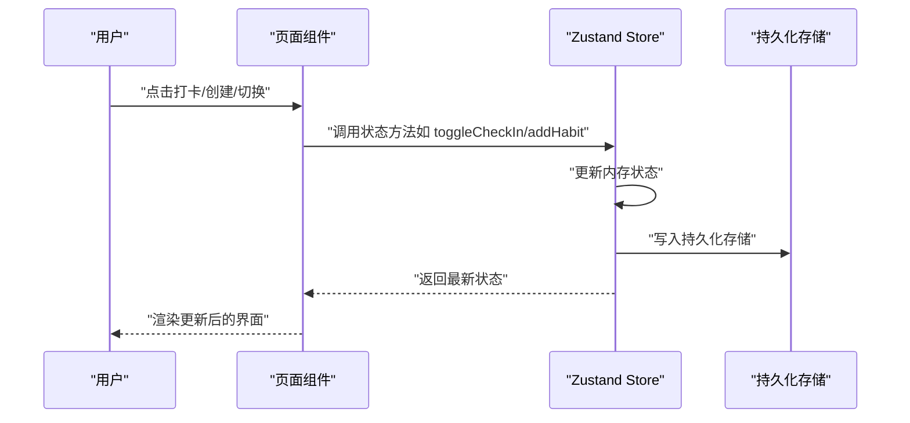
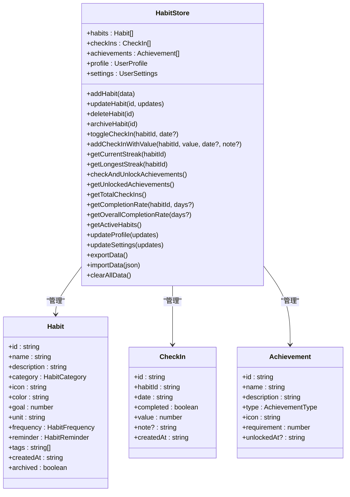
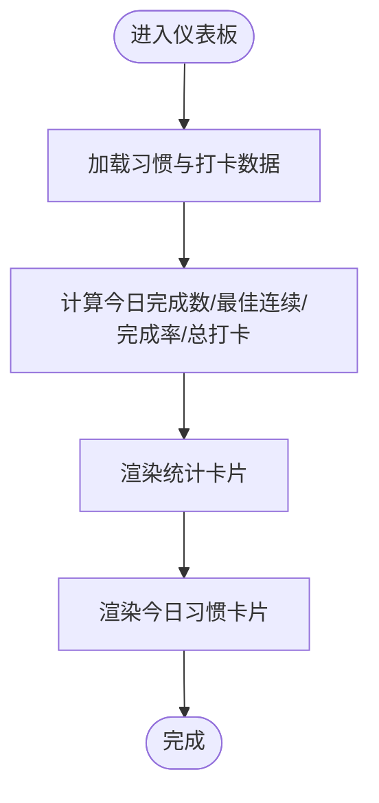
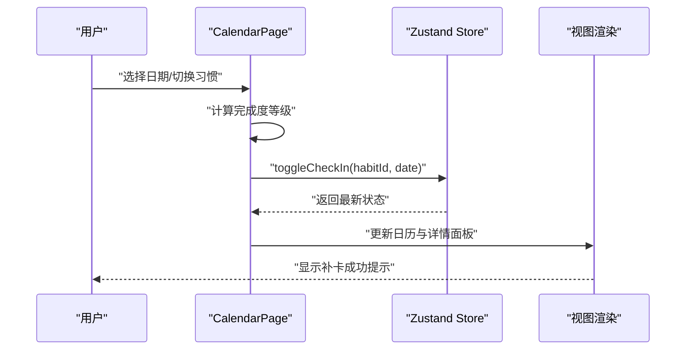
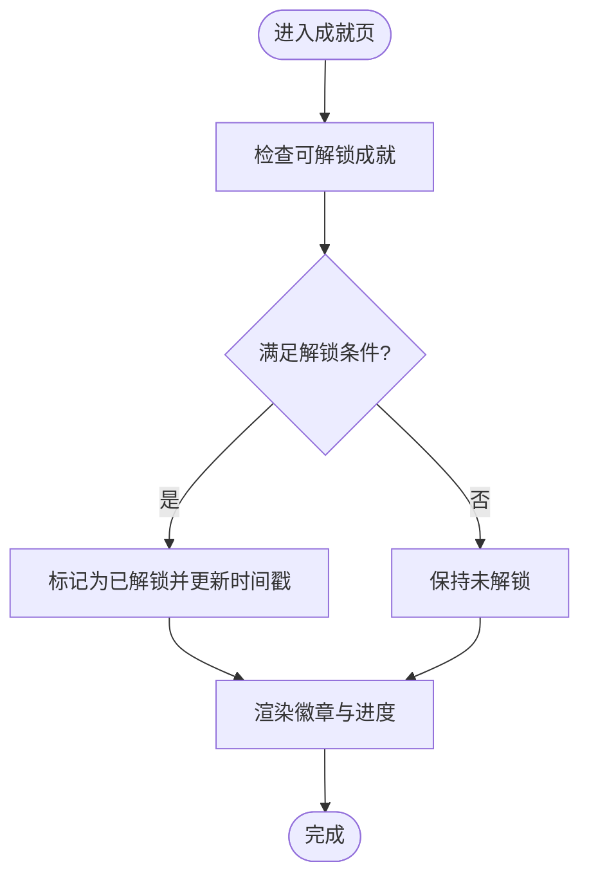
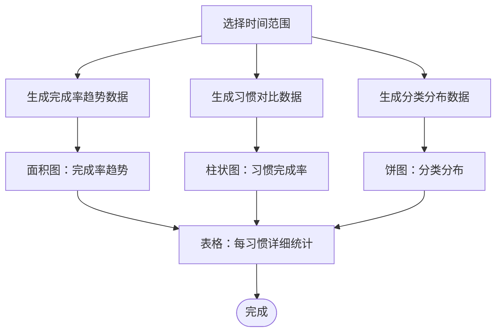
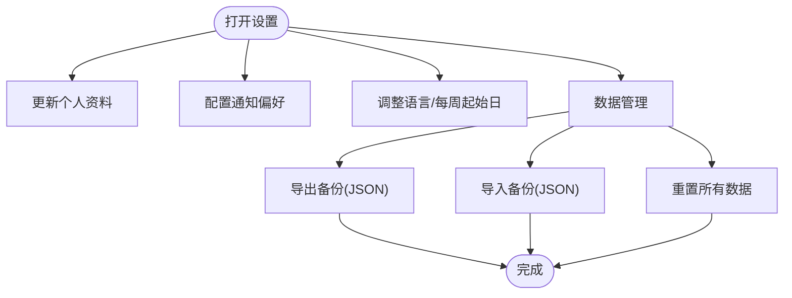
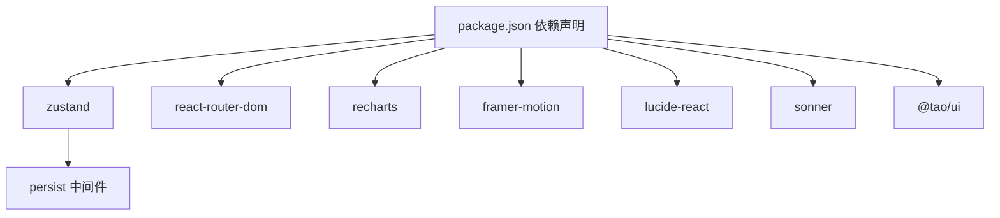

# 习惯管理系统

<cite>
**本文档引用的文件**
- [apps/habit-tracker/src/App.tsx](file://apps/habit-tracker/src/App.tsx)
- [apps/habit-tracker/src/store/habitStore.ts](file://apps/habit-tracker/src/store/habitStore.ts)
- [apps/habit-tracker/src/types/index.ts](file://apps/habit-tracker/src/types/index.ts)
- [apps/habit-tracker/src/pages/DashboardPage.tsx](file://apps/habit-tracker/src/pages/DashboardPage.tsx)
- [apps/habit-tracker/src/pages/HabitsPage.tsx](file://apps/habit-tracker/src/pages/HabitsPage.tsx)
- [apps/habit-tracker/src/pages/CalendarPage.tsx](file://apps/habit-tracker/src/pages/CalendarPage.tsx)
- [apps/habit-tracker/src/pages/AchievementsPage.tsx](file://apps/habit-tracker/src/pages/AchievementsPage.tsx)
- [apps/habit-tracker/src/pages/AnalyticsPage.tsx](file://apps/habit-tracker/src/pages/AnalyticsPage.tsx)
- [apps/habit-tracker/src/pages/SettingsPage.tsx](file://apps/habit-tracker/src/pages/SettingsPage.tsx)
- [apps/habit-tracker/src/components/shared/HabitCard.tsx](file://apps/habit-tracker/src/components/shared/HabitCard.tsx)
- [apps/habit-tracker/src/components/shared/ProgressRing.tsx](file://apps/habit-tracker/src/components/shared/ProgressRing.tsx)
- [apps/habit-tracker/src/components/layout/AppLayout.tsx](file://apps/habit-tracker/src/components/layout/AppLayout.tsx)
- [apps/habit-tracker/src/components/layout/Sidebar.tsx](file://apps/habit-tracker/src/components/layout/Sidebar.tsx)
- [apps/habit-tracker/package.json](file://apps/habit-tracker/package.json)
</cite>

## 目录
1. [简介](#简介)
2. [项目结构](#项目结构)
3. [核心组件](#核心组件)
4. [架构总览](#架构总览)
5. [详细组件分析](#详细组件分析)
6. [依赖关系分析](#依赖关系分析)
7. [性能考虑](#性能考虑)
8. [故障排除指南](#故障排除指南)
9. [结论](#结论)
10. [附录](#附录)

## 简介
本项目是一个基于 React 的习惯管理系统，旨在帮助用户建立并维持良好习惯。系统提供完整的习惯生命周期管理：从创建、编辑到每日打卡记录；支持连续性统计分析、成就激励机制、仪表板可视化展示、日历视图追踪、进度环形图展示等核心功能。系统采用本地状态持久化方案，支持数据导出/导入与重置，满足移动端适配需求。

## 项目结构
该应用采用按页面和功能模块划分的组织方式，核心由路由层、页面层、组件层、状态管理层和类型定义组成。主要目录与职责如下：
- 路由与布局：App.tsx、AppLayout.tsx、Sidebar.tsx
- 页面层：DashboardPage、HabitsPage、CalendarPage、AchievementsPage、AnalyticsPage、SettingsPage
- 组件层：HabitCard、ProgressRing 等共享组件
- 状态管理：habitStore.ts（Zustand + 持久化）
- 类型定义：types/index.ts（习惯、打卡、成就、用户配置等）

**图表来源**
- [apps/habit-tracker/src/App.tsx:1-30](file://apps/habit-tracker/src/App.tsx#L1-L30)
- [apps/habit-tracker/src/components/layout/AppLayout.tsx:1-27](file://apps/habit-tracker/src/components/layout/AppLayout.tsx#L1-L27)
- [apps/habit-tracker/src/components/layout/Sidebar.tsx:1-152](file://apps/habit-tracker/src/components/layout/Sidebar.tsx#L1-L152)
- [apps/habit-tracker/src/store/habitStore.ts:1-545](file://apps/habit-tracker/src/store/habitStore.ts#L1-L545)
- [apps/habit-tracker/src/types/index.ts:1-113](file://apps/habit-tracker/src/types/index.ts#L1-L113)

**章节来源**
- [apps/habit-tracker/src/App.tsx:1-30](file://apps/habit-tracker/src/App.tsx#L1-L30)
- [apps/habit-tracker/src/components/layout/AppLayout.tsx:1-27](file://apps/habit-tracker/src/components/layout/AppLayout.tsx#L1-L27)
- [apps/habit-tracker/src/components/layout/Sidebar.tsx:1-152](file://apps/habit-tracker/src/components/layout/Sidebar.tsx#L1-L152)

## 核心组件
本节概述系统的关键能力与实现要点：

- 习惯创建与编辑
  - 支持设置习惯名称、描述、分类、图标、颜色、目标值与单位、频率（每日/工作日/周末/自定义）、提醒开关与时间、标签等
  - 提供筛选与搜索、批量归档/删除、编辑弹窗等交互
- 每日打卡记录
  - 通过点击“立即打卡”切换完成状态，支持补卡（回填）功能
  - 打卡数据以日期维度存储，支持按日期查询与批量获取
- 连续性统计分析
  - 计算当前连续天数与最长连续天数，支持按习惯与整体维度统计
  - 提供完成率趋势、习惯对比、分类分布等可视化图表
- 成就激励机制
  - 包含坚持类、里程碑、完美类、探索类、复出类五大类型成就
  - 基于连续天数、累计打卡、跨类别追踪、当日全完成、中断后回归等规则解锁
- 仪表板可视化
  - 展示今日进度、最佳连续、近7天完成率、总打卡次数等关键指标
  - 提供进度条与环形图直观反馈
- 日历视图
  - 月历热力图展示完成度等级，支持按习惯筛选与日期详情面板
  - 支持补卡操作与今日高亮
- 数据管理
  - 支持导出完整数据为 JSON 文件、导入备份文件、一键重置所有数据
  - 默认持久化存储于浏览器本地

**章节来源**
- [apps/habit-tracker/src/pages/HabitsPage.tsx:1-535](file://apps/habit-tracker/src/pages/HabitsPage.tsx#L1-L535)
- [apps/habit-tracker/src/store/habitStore.ts:1-545](file://apps/habit-tracker/src/store/habitStore.ts#L1-L545)
- [apps/habit-tracker/src/pages/DashboardPage.tsx:1-283](file://apps/habit-tracker/src/pages/DashboardPage.tsx#L1-L283)
- [apps/habit-tracker/src/pages/CalendarPage.tsx:1-289](file://apps/habit-tracker/src/pages/CalendarPage.tsx#L1-L289)
- [apps/habit-tracker/src/pages/AchievementsPage.tsx:1-212](file://apps/habit-tracker/src/pages/AchievementsPage.tsx#L1-L212)
- [apps/habit-tracker/src/pages/AnalyticsPage.tsx:1-425](file://apps/habit-tracker/src/pages/AnalyticsPage.tsx#L1-L425)
- [apps/habit-tracker/src/pages/SettingsPage.tsx:1-306](file://apps/habit-tracker/src/pages/SettingsPage.tsx#L1-L306)

## 架构总览
系统采用前端单页应用架构，核心数据流如下：
- 用户在页面层进行交互（创建习惯、打卡、查看日历、浏览成就等）
- 页面通过 Zustand store 访问与更新状态，store 内部封装 CRUD、统计、成就解锁、数据导入导出等逻辑
- 组件层负责渲染与动画效果，使用 Framer Motion 实现流畅过渡
- Recharts 用于数据可视化，ProgressRing 用于进度展示

**图表来源**
- [apps/habit-tracker/src/store/habitStore.ts:1-545](file://apps/habit-tracker/src/store/habitStore.ts#L1-L545)
- [apps/habit-tracker/src/pages/HabitsPage.tsx:1-535](file://apps/habit-tracker/src/pages/HabitsPage.tsx#L1-L535)
- [apps/habit-tracker/src/pages/CalendarPage.tsx:1-289](file://apps/habit-tracker/src/pages/CalendarPage.tsx#L1-L289)

## 详细组件分析

### 状态管理与数据模型
habitStore.ts 提供统一的状态管理，包含以下核心能力：
- 数据结构：习惯列表、打卡记录、成就列表、用户档案、用户设置
- 习惯 CRUD：新增、更新、删除、归档
- 打卡操作：切换完成状态、按值打卡、按日期查询
- 统计计算：当前连续、最长连续、完成率、整体完成率、活跃习惯
- 成就系统：自动检测解锁条件并更新状态
- 数据管理：导出 JSON、导入 JSON、清空数据

**图表来源**
- [apps/habit-tracker/src/store/habitStore.ts:14-57](file://apps/habit-tracker/src/store/habitStore.ts#L14-L57)
- [apps/habit-tracker/src/types/index.ts:19-56](file://apps/habit-tracker/src/types/index.ts#L19-L56)

**章节来源**
- [apps/habit-tracker/src/store/habitStore.ts:1-545](file://apps/habit-tracker/src/store/habitStore.ts#L1-L545)
- [apps/habit-tracker/src/types/index.ts:1-113](file://apps/habit-tracker/src/types/index.ts#L1-L113)

### 仪表板与可视化展示
DashboardPage 负责首页概览，聚合今日进度、最佳连续、完成率与总打卡次数，并以卡片与环形图形式呈现。HabitCard 在仪表板与习惯列表中复用，提供紧凑与完整两种模式。

**图表来源**
- [apps/habit-tracker/src/pages/DashboardPage.tsx:51-223](file://apps/habit-tracker/src/pages/DashboardPage.tsx#L51-L223)
- [apps/habit-tracker/src/components/shared/HabitCard.tsx:15-217](file://apps/habit-tracker/src/components/shared/HabitCard.tsx#L15-L217)

**章节来源**
- [apps/habit-tracker/src/pages/DashboardPage.tsx:1-283](file://apps/habit-tracker/src/pages/DashboardPage.tsx#L1-L283)
- [apps/habit-tracker/src/components/shared/HabitCard.tsx:1-217](file://apps/habit-tracker/src/components/shared/HabitCard.tsx#L1-L217)

### 日历视图与补卡功能
CalendarPage 提供月历视图，按日期展示完成度热力等级，支持按习惯筛选与日期详情面板。用户可对未完成的日期执行补卡操作。

**图表来源**
- [apps/habit-tracker/src/pages/CalendarPage.tsx:12-289](file://apps/habit-tracker/src/pages/CalendarPage.tsx#L12-L289)
- [apps/habit-tracker/src/store/habitStore.ts:237-268](file://apps/habit-tracker/src/store/habitStore.ts#L237-L268)

**章节来源**
- [apps/habit-tracker/src/pages/CalendarPage.tsx:1-289](file://apps/habit-tracker/src/pages/CalendarPage.tsx#L1-L289)

### 成就系统与解锁流程
AchievementsPage 展示成就墙，支持按类型筛选与进度概览。系统在页面加载时自动检查解锁条件，解锁后通过动画反馈。

**图表来源**
- [apps/habit-tracker/src/pages/AchievementsPage.tsx:17-212](file://apps/habit-tracker/src/pages/AchievementsPage.tsx#L17-L212)
- [apps/habit-tracker/src/store/habitStore.ts:372-450](file://apps/habit-tracker/src/store/habitStore.ts#L372-L450)

**章节来源**
- [apps/habit-tracker/src/pages/AchievementsPage.tsx:1-212](file://apps/habit-tracker/src/pages/AchievementsPage.tsx#L1-L212)
- [apps/habit-tracker/src/store/habitStore.ts:372-450](file://apps/habit-tracker/src/store/habitStore.ts#L372-L450)

### 数据分析与图表展示
AnalyticsPage 提供时间范围切换（7/30/90/365天），生成完成率趋势、习惯对比与分类分布等图表，并输出每习惯的详细统计表。

**图表来源**
- [apps/habit-tracker/src/pages/AnalyticsPage.tsx:74-425](file://apps/habit-tracker/src/pages/AnalyticsPage.tsx#L74-L425)

**章节来源**
- [apps/habit-tracker/src/pages/AnalyticsPage.tsx:1-425](file://apps/habit-tracker/src/pages/AnalyticsPage.tsx#L1-L425)

### 设置与数据管理
SettingsPage 提供个人资料、通知与偏好设置，以及数据备份与恢复功能。支持导出 JSON 备份、导入备份文件、一键重置数据。

**图表来源**
- [apps/habit-tracker/src/pages/SettingsPage.tsx:11-306](file://apps/habit-tracker/src/pages/SettingsPage.tsx#L11-L306)

**章节来源**
- [apps/habit-tracker/src/pages/SettingsPage.tsx:1-306](file://apps/habit-tracker/src/pages/SettingsPage.tsx#L1-L306)

## 依赖关系分析
系统依赖关系清晰，核心库包括：
- 状态管理：zustand（带持久化中间件）
- 路由：react-router-dom
- 图表：recharts
- 动画：framer-motion
- UI 组件：@tao/ui
- 图标：lucide-react
- 通知：sonner

**图表来源**
- [apps/habit-tracker/package.json:12-34](file://apps/habit-tracker/package.json#L12-L34)

**章节来源**
- [apps/habit-tracker/package.json:1-35](file://apps/habit-tracker/package.json#L1-L35)

## 性能考虑
- 状态粒度：使用 Zustand 将状态拆分为多个原子操作，避免不必要的重渲染
- 计算优化：在页面组件中使用 useMemo 缓存计算结果（如统计、过滤、热力等级）
- 渲染优化：使用 Framer Motion 的 layout 动画与批量渲染，减少闪烁
- 图表性能：Recharts 使用响应式容器与预设样式，长列表场景建议分页或虚拟化
- 存储策略：本地持久化适合轻量数据，若用户数据增长显著，建议引入 IndexedDB 或服务端同步

[本节为通用指导，无需特定文件引用]

## 故障排除指南
- 打卡无效或状态不更新
  - 检查 habitStore.toggleCheckIn 是否被正确调用
  - 确认当前日期字符串格式与 checkIns 中一致
- 成就未解锁
  - 确认 checkAndUnlockAchievements 是否在合适时机触发（如打卡后延时调用）
  - 核对成就解锁条件与当前数据是否满足
- 日历热力图异常
  - 检查 completionLevels 的计算逻辑与 selectedHabitId 状态
- 数据导入失败
  - 确认导入文件为有效 JSON，字段包含 habits 与 checkIns
  - 使用 importData 返回值判断导入是否成功
- 移动端显示问题
  - 确认 Tailwind 响应式断点与布局容器宽度设置
  - 检查触摸交互元素尺寸与间距

**章节来源**
- [apps/habit-tracker/src/store/habitStore.ts:237-268](file://apps/habit-tracker/src/store/habitStore.ts#L237-L268)
- [apps/habit-tracker/src/pages/AchievementsPage.tsx:23-41](file://apps/habit-tracker/src/pages/AchievementsPage.tsx#L23-L41)
- [apps/habit-tracker/src/pages/CalendarPage.tsx:55-73](file://apps/habit-tracker/src/pages/CalendarPage.tsx#L55-L73)
- [apps/habit-tracker/src/pages/SettingsPage.tsx:43-61](file://apps/habit-tracker/src/pages/SettingsPage.tsx#L43-L61)

## 结论
本习惯管理系统以简洁的前端架构实现了从创建到追踪、从统计到激励的完整闭环。通过本地持久化与可视化展示，用户可以高效地管理个人习惯并获得持续的正向反馈。未来可在移动端适配、离线同步与云端备份方面进一步扩展，以提升用户体验与数据安全性。

[本节为总结性内容，无需特定文件引用]

## 附录

### 功能清单与使用指南
- 习惯创建与编辑
  - 在“习惯管理”页面点击“创建新习惯”，填写必要信息后保存
  - 支持按分类、搜索与归档状态筛选查看
- 每日打卡
  - 在仪表板或习惯列表点击“立即打卡”，支持补卡回填
- 连续性统计
  - 在“数据分析”中选择时间范围，查看完成率趋势与习惯对比
- 成就系统
  - 在“成就墙”查看解锁进度，满足条件自动解锁
- 仪表板与日历
  - 仪表板展示关键指标；日历视图支持按习惯筛选与日期详情
- 设置与数据管理
  - 在“设置”中配置通知与偏好；支持导出/导入/重置数据

[本节为使用说明，无需特定文件引用]