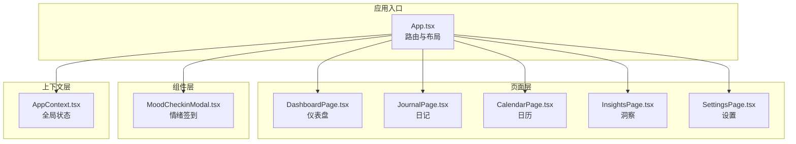
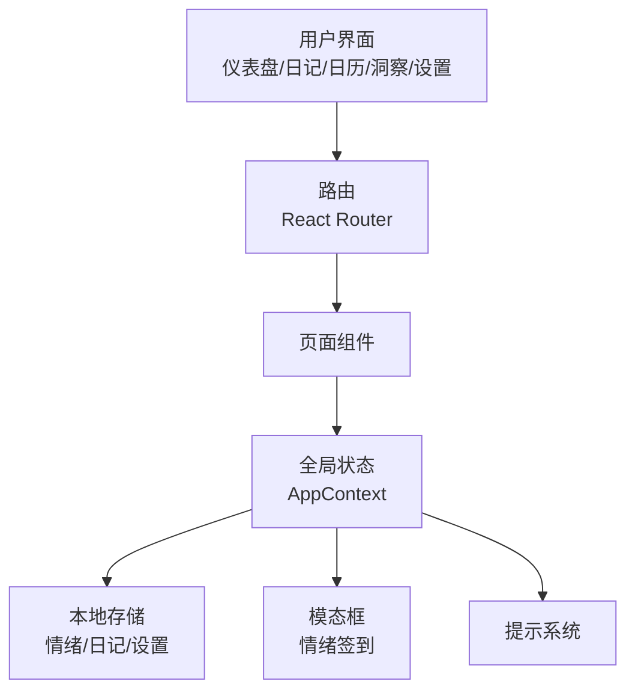
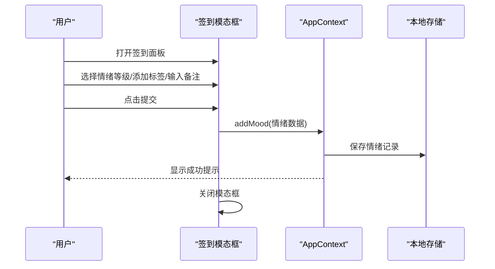
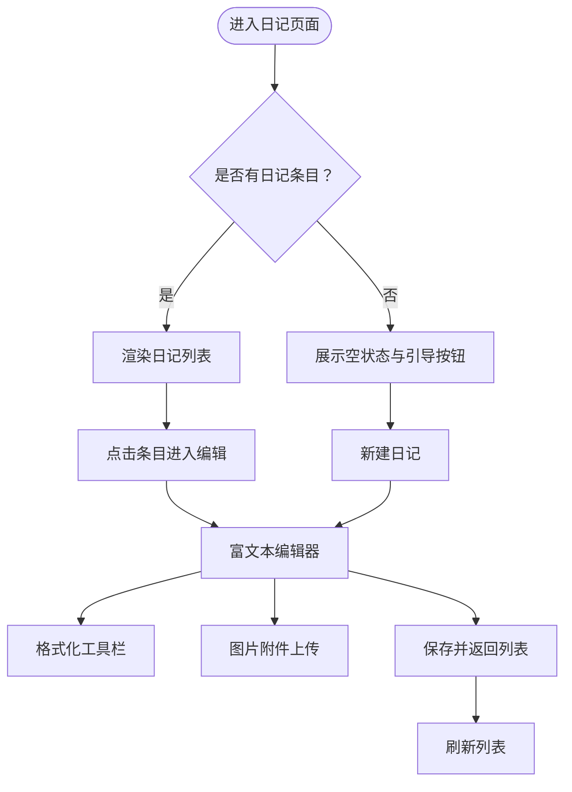
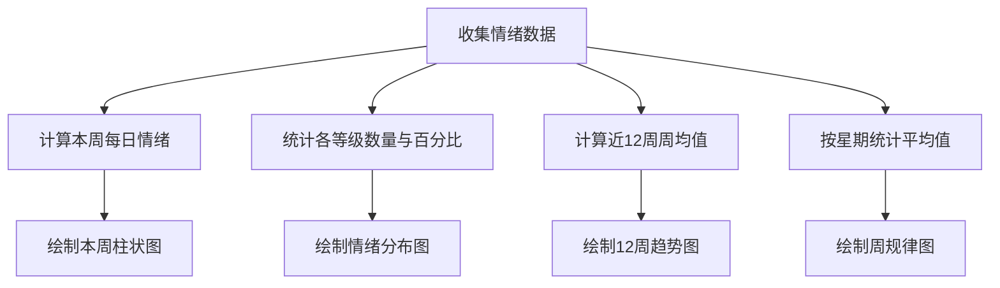
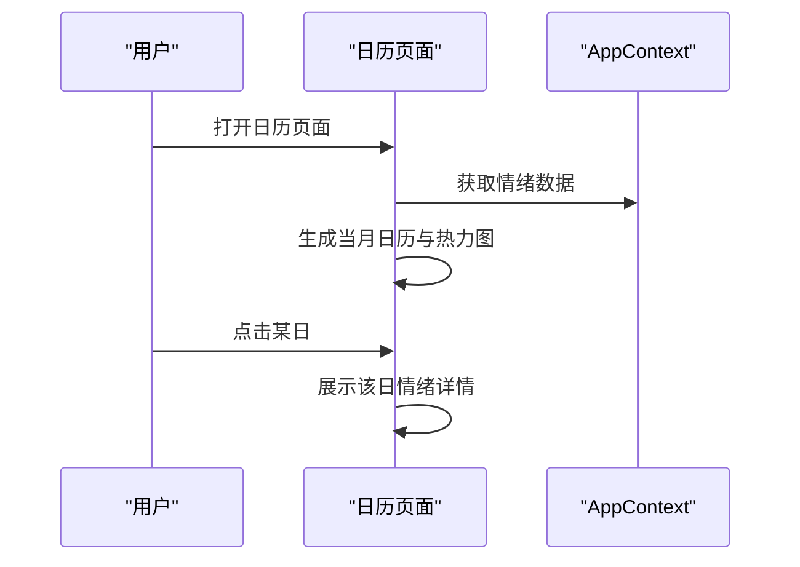
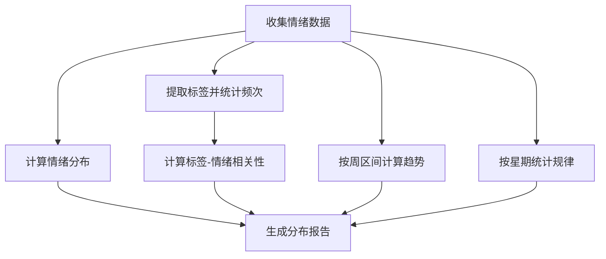
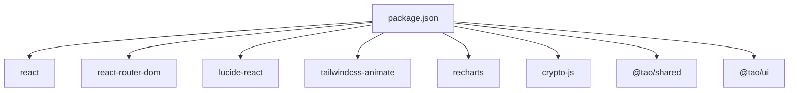

# 情绪管理工具

<cite>
**本文档引用的文件**
- [apps/moodflow/src/App.tsx](file://apps/moodflow/src/App.tsx)
- [apps/moodflow/src/contexts/AppContext.tsx](file://apps/moodflow/src/contexts/AppContext.tsx)
- [apps/moodflow/src/components/mood/MoodCheckinModal.tsx](file://apps/moodflow/src/components/mood/MoodCheckinModal.tsx)
- [apps/moodflow/src/pages/DashboardPage.tsx](file://apps/moodflow/src/pages/DashboardPage.tsx)
- [apps/moodflow/src/pages/JournalPage.tsx](file://apps/moodflow/src/pages/JournalPage.tsx)
- [apps/moodflow/src/pages/CalendarPage.tsx](file://apps/moodflow/src/pages/CalendarPage.tsx)
- [apps/moodflow/src/pages/InsightsPage.tsx](file://apps/moodflow/src/pages/InsightsPage.tsx)
- [apps/moodflow/src/pages/SettingsPage.tsx](file://apps/moodflow/src/pages/SettingsPage.tsx)
- [apps/moodflow/package.json](file://apps/moodflow/package.json)
</cite>

## 目录
1. [简介](#简介)
2. [项目结构](#项目结构)
3. [核心组件](#核心组件)
4. [架构概览](#架构概览)
5. [详细组件分析](#详细组件分析)
6. [依赖分析](#依赖分析)
7. [性能考虑](#性能考虑)
8. [故障排除指南](#故障排除指南)
9. [结论](#结论)
10. [附录](#附录)

## 简介
本项目是一个基于 React 的情绪管理工具（MoodFlow），旨在帮助用户进行日常情绪追踪、记录情绪日记、分析情绪趋势并生成个性化洞察报告。系统提供直观的签到界面、富文本日记编辑器、可视化图表、日历视图以及设置与隐私保护功能。

## 项目结构
MoodFlow 应用采用模块化组织方式，主要分为页面层、组件层、上下文层和页面路由配置：

- 页面层：仪表盘、日记、日历、洞察、设置等页面
- 组件层：通用 UI 组件与业务组件（如情绪签到模态框）
- 上下文层：全局状态管理（情绪记录、日记、设置、UI 状态）
- 路由层：基于 React Router 的页面导航

**图表来源**
- [apps/moodflow/src/App.tsx:1-43](file://apps/moodflow/src/App.tsx#L1-L43)
- [apps/moodflow/src/contexts/AppContext.tsx:1-100](file://apps/moodflow/src/contexts/AppContext.tsx#L1-L100)
- [apps/moodflow/src/components/mood/MoodCheckinModal.tsx:1-144](file://apps/moodflow/src/components/mood/MoodCheckinModal.tsx#L1-L144)
- [apps/moodflow/src/pages/DashboardPage.tsx:1-317](file://apps/moodflow/src/pages/DashboardPage.tsx#L1-L317)
- [apps/moodflow/src/pages/JournalPage.tsx:1-291](file://apps/moodflow/src/pages/JournalPage.tsx#L1-L291)
- [apps/moodflow/src/pages/CalendarPage.tsx:1-205](file://apps/moodflow/src/pages/CalendarPage.tsx#L1-L205)
- [apps/moodflow/src/pages/InsightsPage.tsx:1-387](file://apps/moodflow/src/pages/InsightsPage.tsx#L1-L387)
- [apps/moodflow/src/pages/SettingsPage.tsx:1-281](file://apps/moodflow/src/pages/SettingsPage.tsx#L1-L281)

**章节来源**
- [apps/moodflow/src/App.tsx:1-43](file://apps/moodflow/src/App.tsx#L1-L43)
- [apps/moodflow/src/contexts/AppContext.tsx:1-100](file://apps/moodflow/src/contexts/AppContext.tsx#L1-L100)

## 核心组件
- 全局状态上下文：集中管理情绪记录、日记、设置与 UI 状态，提供增删改查与刷新能力
- 情绪签到模态框：提供快速情绪选择、备注与标签选择，支持即时保存
- 仪表盘页面：展示今日情绪、统计卡片、近期活动与本周情绪走势
- 日记页面：提供富文本编辑器、图片附件、标签与删除操作
- 日历页面：月度日历与热力图展示情绪分布
- 洞察页面：情绪分布、趋势分析、标签关联、最佳日期与周规律
- 设置页面：主题切换、数据导出与清除、关于信息

**章节来源**
- [apps/moodflow/src/contexts/AppContext.tsx:9-28](file://apps/moodflow/src/contexts/AppContext.tsx#L9-L28)
- [apps/moodflow/src/components/mood/MoodCheckinModal.tsx:8-49](file://apps/moodflow/src/components/mood/MoodCheckinModal.tsx#L8-L49)
- [apps/moodflow/src/pages/DashboardPage.tsx:7-24](file://apps/moodflow/src/pages/DashboardPage.tsx#L7-L24)
- [apps/moodflow/src/pages/JournalPage.tsx:11-43](file://apps/moodflow/src/pages/JournalPage.tsx#L11-L43)
- [apps/moodflow/src/pages/CalendarPage.tsx:8-86](file://apps/moodflow/src/pages/CalendarPage.tsx#L8-L86)
- [apps/moodflow/src/pages/InsightsPage.tsx:7-105](file://apps/moodflow/src/pages/InsightsPage.tsx#L7-L105)
- [apps/moodflow/src/pages/SettingsPage.tsx:1-281](file://apps/moodflow/src/pages/SettingsPage.tsx#L1-L281)

## 架构概览
应用采用 React 函数式组件与 Context API 实现状态管理，通过路由分发到不同页面。数据持久化通过本地存储实现，确保用户数据保留在本地设备。

**图表来源**
- [apps/moodflow/src/App.tsx:12-30](file://apps/moodflow/src/App.tsx#L12-L30)
- [apps/moodflow/src/contexts/AppContext.tsx:44-99](file://apps/moodflow/src/contexts/AppContext.tsx#L44-L99)
- [apps/moodflow/src/components/mood/MoodCheckinModal.tsx:51-142](file://apps/moodflow/src/components/mood/MoodCheckinModal.tsx#L51-L142)

## 详细组件分析

### 情绪签到界面设计
- 快速情绪选择：提供 1-5 级情绪图标与标签，支持单选与多选标签
- 备注与标签：支持简短备注与相关因素标签，便于后续分析
- 提交流程：校验必填项后写入本地存储，并显示成功提示

**图表来源**
- [apps/moodflow/src/components/mood/MoodCheckinModal.tsx:22-42](file://apps/moodflow/src/components/mood/MoodCheckinModal.tsx#L22-L42)
- [apps/moodflow/src/contexts/AppContext.tsx:59-67](file://apps/moodflow/src/contexts/AppContext.tsx#L59-L67)

**章节来源**
- [apps/moodflow/src/components/mood/MoodCheckinModal.tsx:8-49](file://apps/moodflow/src/components/mood/MoodCheckinModal.tsx#L8-L49)

### 日记写作功能
- 富文本编辑器：支持标题、正文、格式化按钮与图片附件
- 图片附件：支持多图上传与预览，可移除不需要的附件
- 列表展示：按时间倒序排列，支持删除与跳转编辑

**图表来源**
- [apps/moodflow/src/pages/JournalPage.tsx:11-43](file://apps/moodflow/src/pages/JournalPage.tsx#L11-L43)
- [apps/moodflow/src/pages/JournalPage.tsx:136-272](file://apps/moodflow/src/pages/JournalPage.tsx#L136-L272)

**章节来源**
- [apps/moodflow/src/pages/JournalPage.tsx:1-134](file://apps/moodflow/src/pages/JournalPage.tsx#L1-L134)
- [apps/moodflow/src/pages/JournalPage.tsx:136-291](file://apps/moodflow/src/pages/JournalPage.tsx#L136-L291)

### 情绪图表可视化
- 本周情绪走势：按周内 7 天绘制柱状图，高度映射情绪等级
- 情绪分布：按 1-5 等级统计百分比，使用色相值表示情绪
- 近 12 周趋势：按周区间计算平均值，展示长期趋势
- 一周情绪规律：按星期统计平均值，识别情绪节律

**图表来源**
- [apps/moodflow/src/pages/DashboardPage.tsx:246-292](file://apps/moodflow/src/pages/DashboardPage.tsx#L246-L292)
- [apps/moodflow/src/pages/InsightsPage.tsx:16-105](file://apps/moodflow/src/pages/InsightsPage.tsx#L16-L105)
- [apps/moodflow/src/pages/InsightsPage.tsx:203-271](file://apps/moodflow/src/pages/InsightsPage.tsx#L203-L271)

**章节来源**
- [apps/moodflow/src/pages/DashboardPage.tsx:216-281](file://apps/moodflow/src/pages/DashboardPage.tsx#L216-L281)
- [apps/moodflow/src/pages/InsightsPage.tsx:162-356](file://apps/moodflow/src/pages/InsightsPage.tsx#L162-L356)

### 日历视图的情绪分布
- 月度日历：渲染当前月份日历，标注有记录的日期
- 热力图：按年份分组，用色块密度表示情绪强度
- 详情弹窗：展示当日情绪、备注与标签

**图表来源**
- [apps/moodflow/src/pages/CalendarPage.tsx:8-86](file://apps/moodflow/src/pages/CalendarPage.tsx#L8-L86)
- [apps/moodflow/src/pages/CalendarPage.tsx:88-192](file://apps/moodflow/src/pages/CalendarPage.tsx#L88-L192)
- [apps/moodflow/src/pages/CalendarPage.tsx:194-205](file://apps/moodflow/src/pages/CalendarPage.tsx#L194-L205)

**章节来源**
- [apps/moodflow/src/pages/CalendarPage.tsx:1-205](file://apps/moodflow/src/pages/CalendarPage.tsx#L1-L205)

### 洞察分析算法
- 情绪分布统计：按等级计数与百分比
- 标签关联分析：计算每个标签的平均情绪值，区分积极与需关注因素
- 趋势分析：按周区间计算平均值，识别长期变化
- 规律识别：按星期统计平均值，找出最佳与较差的日子

**图表来源**
- [apps/moodflow/src/pages/InsightsPage.tsx:10-105](file://apps/moodflow/src/pages/InsightsPage.tsx#L10-L105)
- [apps/moodflow/src/pages/InsightsPage.tsx:162-356](file://apps/moodflow/src/pages/InsightsPage.tsx#L162-L356)

**章节来源**
- [apps/moodflow/src/pages/InsightsPage.tsx:7-105](file://apps/moodflow/src/pages/InsightsPage.tsx#L7-L105)

### 个性化建议推送
- 基于标签关联：根据积极/需关注因素推荐行为或注意点
- 基于趋势：识别持续低潮或波动，建议调整策略
- 基于规律：提醒在最佳日进行特定活动，在较差日采取自我关怀

**章节来源**
- [apps/moodflow/src/pages/InsightsPage.tsx:273-331](file://apps/moodflow/src/pages/InsightsPage.tsx#L273-L331)

### 隐私保护措施
- 数据本地化：所有数据存储在本地设备，不上传云端
- 清理选项：提供一键清除所有数据功能
- 主题设置：支持明暗主题切换，保护视觉舒适度

**章节来源**
- [apps/moodflow/src/pages/SettingsPage.tsx:260-278](file://apps/moodflow/src/pages/SettingsPage.tsx#L260-L278)
- [apps/moodflow/src/contexts/AppContext.tsx:51-54](file://apps/moodflow/src/contexts/AppContext.tsx#L51-L54)

### 移动端体验优化
- 响应式布局：适配移动端屏幕尺寸
- 交互优化：触摸友好的按钮与手势
- 通知与提示：Toast 提示提升反馈效率

**章节来源**
- [apps/moodflow/src/App.tsx:14-29](file://apps/moodflow/src/App.tsx#L14-L29)
- [apps/moodflow/src/contexts/AppContext.tsx:84-88](file://apps/moodflow/src/contexts/AppContext.tsx#L84-L88)

### 语音输入支持
- 当前代码未包含语音输入功能实现
- 可通过扩展富文本编辑器集成 Web Speech API 或第三方语音识别服务

**章节来源**
- [apps/moodflow/src/pages/JournalPage.tsx:136-272](file://apps/moodflow/src/pages/JournalPage.tsx#L136-L272)

### 图片/多媒体附件
- 图片上传：支持多图选择与预览
- 附件管理：可移除不需要的附件
- 媒体展示：在日记列表与编辑器中展示缩略图

**章节来源**
- [apps/moodflow/src/pages/JournalPage.tsx:155-166](file://apps/moodflow/src/pages/JournalPage.tsx#L155-L166)
- [apps/moodflow/src/pages/JournalPage.tsx:246-267](file://apps/moodflow/src/pages/JournalPage.tsx#L246-L267)

### 社交分享功能
- 当前代码未包含社交分享功能
- 可通过扩展在洞察页面或日记页面增加分享按钮，调用系统分享 API

**章节来源**
- [apps/moodflow/src/pages/InsightsPage.tsx:333-356](file://apps/moodflow/src/pages/InsightsPage.tsx#L333-L356)
- [apps/moodflow/src/pages/JournalPage.tsx:87-131](file://apps/moodflow/src/pages/JournalPage.tsx#L87-L131)

### 情绪健康评估与专业资源
- 健康评估：通过趋势与规律识别潜在问题
- 专业资源：可在设置页或洞察页提供外部心理健康资源链接
- 紧急求助：提供紧急联系渠道与自助资源入口

**章节来源**
- [apps/moodflow/src/pages/InsightsPage.tsx:134-160](file://apps/moodflow/src/pages/InsightsPage.tsx#L134-L160)
- [apps/moodflow/src/pages/SettingsPage.tsx:267-278](file://apps/moodflow/src/pages/SettingsPage.tsx#L267-L278)

## 依赖分析
MoodFlow 使用 React 生态与 @tao 设计系统，依赖关系如下：

**图表来源**
- [apps/moodflow/package.json:12-33](file://apps/moodflow/package.json#L12-L33)

**章节来源**
- [apps/moodflow/package.json:1-34](file://apps/moodflow/package.json#L1-L34)

## 性能考虑
- 状态更新：使用 useCallback 优化回调函数，减少不必要的重渲染
- 数据计算：使用 useMemo 缓存洞察页面的复杂计算结果
- 图表渲染：按需渲染与动画过渡，避免过度重绘
- 存储访问：集中从本地存储读取与写入，减少频繁 IO

**章节来源**
- [apps/moodflow/src/contexts/AppContext.tsx:56-82](file://apps/moodflow/src/contexts/AppContext.tsx#L56-L82)
- [apps/moodflow/src/pages/InsightsPage.tsx:10-105](file://apps/moodflow/src/pages/InsightsPage.tsx#L10-L105)

## 故障排除指南
- 无法打开签到面板：检查全局状态 showCheckinModal 是否正确传递
- 日记保存失败：确认本地存储权限与数据结构一致性
- 图表空白：检查数据为空时的降级处理逻辑
- 主题切换无效：确认设置中 darkMode 的状态同步

**章节来源**
- [apps/moodflow/src/contexts/AppContext.tsx:48-54](file://apps/moodflow/src/contexts/AppContext.tsx#L48-L54)
- [apps/moodflow/src/pages/DashboardPage.tsx:131-135](file://apps/moodflow/src/pages/DashboardPage.tsx#L131-L135)
- [apps/moodflow/src/pages/InsightsPage.tsx:107-125](file://apps/moodflow/src/pages/InsightsPage.tsx#L107-L125)

## 结论
MoodFlow 提供了完整的情绪管理闭环：从每日签到、日记记录到趋势分析与洞察报告。通过本地化存储与简洁的 UI 设计，帮助用户建立稳定的情绪追踪习惯。未来可扩展语音输入、社交分享与更丰富的个性化建议功能，进一步提升用户体验。

## 附录
- 快速开始：安装依赖后运行开发服务器，访问本地预览地址
- 数据导出：当前版本支持清除数据，导出功能可作为扩展
- 主题定制：通过设置页面切换明暗主题

**章节来源**
- [apps/moodflow/package.json:6-11](file://apps/moodflow/package.json#L6-L11)
- [apps/moodflow/src/pages/SettingsPage.tsx:260-278](file://apps/moodflow/src/pages/SettingsPage.tsx#L260-L278)