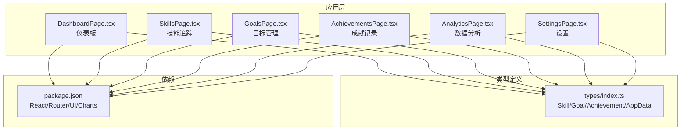
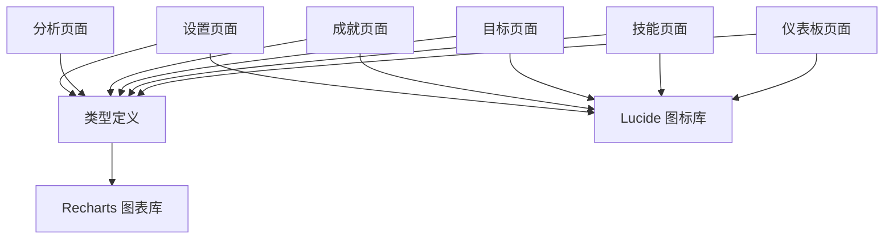
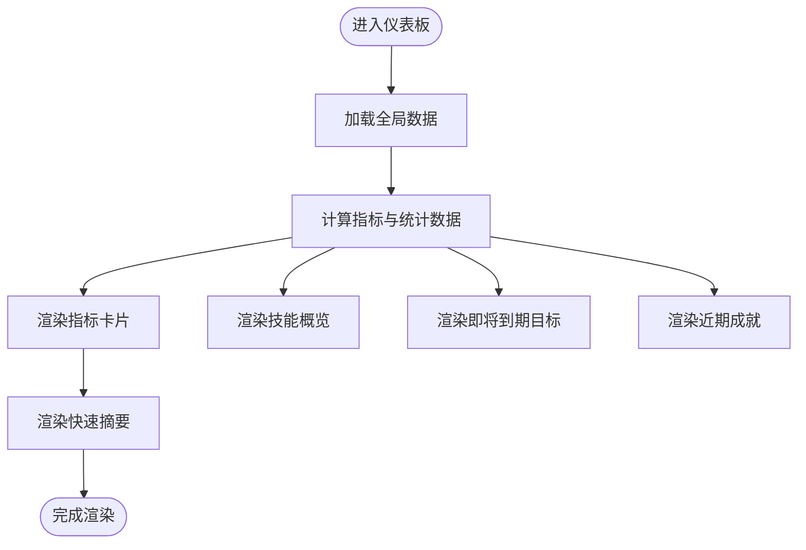
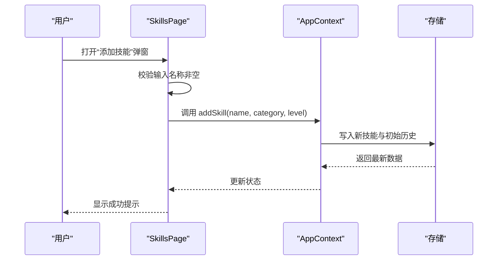
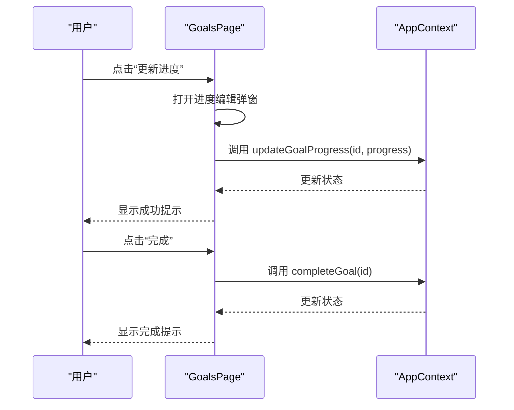
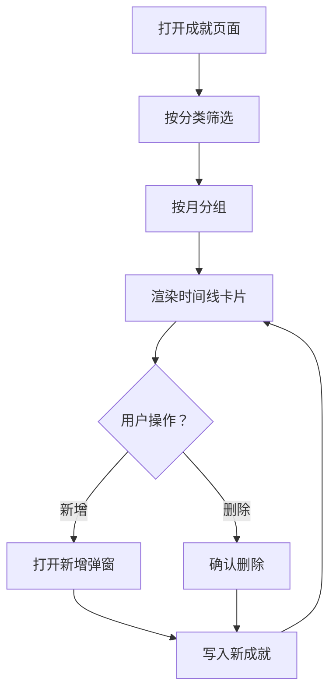
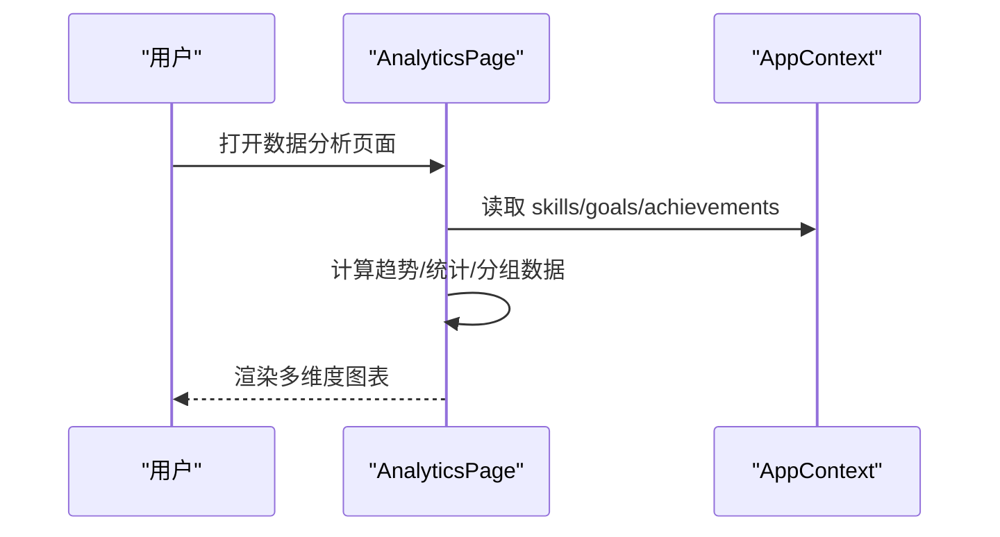
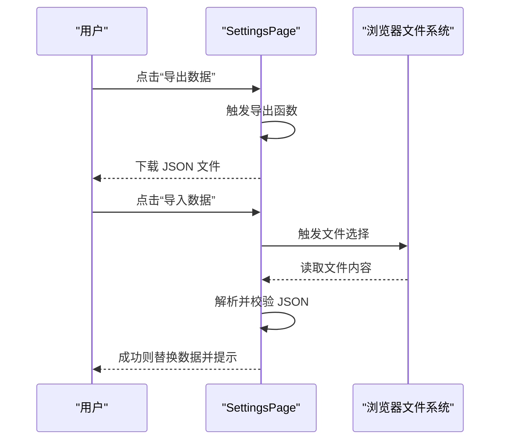
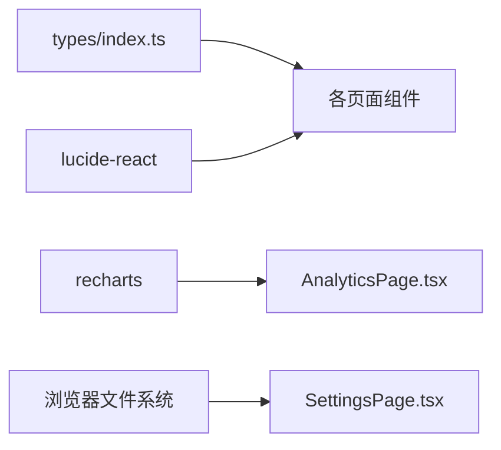

# 成长追踪系统

<cite>
**本文引用的文件**
- [DashboardPage.tsx](file://apps/growth-tracker/src/pages/DashboardPage.tsx)
- [SkillsPage.tsx](file://apps/growth-tracker/src/pages/SkillsPage.tsx)
- [GoalsPage.tsx](file://apps/growth-tracker/src/pages/GoalsPage.tsx)
- [AchievementsPage.tsx](file://apps/growth-tracker/src/pages/AchievementsPage.tsx)
- [AnalyticsPage.tsx](file://apps/growth-tracker/src/pages/AnalyticsPage.tsx)
- [SettingsPage.tsx](file://apps/growth-tracker/src/pages/SettingsPage.tsx)
- [index.ts](file://apps/growth-tracker/src/types/index.ts)
- [package.json](file://apps/growth-tracker/package.json)
</cite>

## 目录
1. [引言](#引言)
2. [项目结构](#项目结构)
3. [核心组件](#核心组件)
4. [架构总览](#架构总览)
5. [详细组件分析](#详细组件分析)
6. [依赖关系分析](#依赖关系分析)
7. [性能考量](#性能考量)
8. [故障排查指南](#故障排查指南)
9. [结论](#结论)
10. [附录](#附录)

## 引言
成长追踪系统是一个面向个人成长的综合型应用，围绕“技能发展追踪、目标设定与完成度统计、成就记录、数据分析报表、进度可视化展示”五大能力构建。系统提供仪表板界面、技能分类管理、目标层级结构、成就解锁机制、统计图表生成、进度提醒与个性化设置，并支持数据导出与导入，帮助用户建立可持续的成长闭环。

## 项目结构
- 应用入口与页面组织位于 apps/growth-tracker/src/pages 下，采用按功能模块划分的页面级组件设计。
- 类型定义集中于 apps/growth-tracker/src/types/index.ts，统一约束技能、目标、成就与应用设置的数据结构。
- 核心依赖在 apps/growth-tracker/package.json 中声明，包括 React 生态、路由、UI 组件库、图标库与图表库等。

**图示来源**
- [DashboardPage.tsx:1-265](file://apps/growth-tracker/src/pages/DashboardPage.tsx#L1-L265)
- [SkillsPage.tsx:1-241](file://apps/growth-tracker/src/pages/SkillsPage.tsx#L1-L241)
- [GoalsPage.tsx:1-262](file://apps/growth-tracker/src/pages/GoalsPage.tsx#L1-L262)
- [AchievementsPage.tsx:1-226](file://apps/growth-tracker/src/pages/AchievementsPage.tsx#L1-L226)
- [AnalyticsPage.tsx:1-235](file://apps/growth-tracker/src/pages/AnalyticsPage.tsx#L1-L235)
- [SettingsPage.tsx:1-211](file://apps/growth-tracker/src/pages/SettingsPage.tsx#L1-L211)
- [index.ts:1-44](file://apps/growth-tracker/src/types/index.ts#L1-L44)
- [package.json:1-33](file://apps/growth-tracker/package.json#L1-L33)

**章节来源**
- [package.json:1-33](file://apps/growth-tracker/package.json#L1-L33)

## 核心组件
- 仪表板（DashboardPage）：聚合展示技能总数、进行中目标、成就总数、连续打卡等关键指标；提供近期成就、即将到期目标、技能概览与快速摘要。
- 技能追踪（SkillsPage）：支持技能分类、新增/编辑/删除技能，实时进度条与历史折线图，按分类筛选。
- 目标管理（GoalsPage）：目标状态（进行中/已完成/已逾期），进度圆环图，截止日期倒计时，进度拖拽更新与一键完成。
- 成就记录（AchievementsPage）：按月时间线展示成就，支持分类筛选与新增/删除。
- 数据分析（AnalyticsPage）：技能成长趋势折线图、目标完成率饼图、成就分类柱状图、月度活跃度柱状图。
- 设置（SettingsPage）：个人资料编辑、隐私模式切换、数据导出/导入与存储信息展示。

**章节来源**
- [DashboardPage.tsx:22-265](file://apps/growth-tracker/src/pages/DashboardPage.tsx#L22-L265)
- [SkillsPage.tsx:11-241](file://apps/growth-tracker/src/pages/SkillsPage.tsx#L11-L241)
- [GoalsPage.tsx:16-262](file://apps/growth-tracker/src/pages/GoalsPage.tsx#L16-L262)
- [AchievementsPage.tsx:19-226](file://apps/growth-tracker/src/pages/AchievementsPage.tsx#L19-L226)
- [AnalyticsPage.tsx:17-235](file://apps/growth-tracker/src/pages/AnalyticsPage.tsx#L17-L235)
- [SettingsPage.tsx:10-211](file://apps/growth-tracker/src/pages/SettingsPage.tsx#L10-L211)

## 架构总览
系统采用前端单页应用架构，以 React + 路由为核心，配合自定义 UI 组件与 Recharts 图表库实现数据可视化。数据模型通过统一类型定义约束，页面组件通过上下文访问全局数据并触发增删改操作。

**图示来源**
- [DashboardPage.tsx:1-14](file://apps/growth-tracker/src/pages/DashboardPage.tsx#L1-L14)
- [SkillsPage.tsx:1-8](file://apps/growth-tracker/src/pages/SkillsPage.tsx#L1-L8)
- [GoalsPage.tsx:1-8](file://apps/growth-tracker/src/pages/GoalsPage.tsx#L1-L8)
- [AchievementsPage.tsx:1-8](file://apps/growth-tracker/src/pages/AchievementsPage.tsx#L1-L8)
- [AnalyticsPage.tsx:1-8](file://apps/growth-tracker/src/pages/AnalyticsPage.tsx#L1-L8)
- [SettingsPage.tsx:1-8](file://apps/growth-tracker/src/pages/SettingsPage.tsx#L1-L8)
- [index.ts:1-44](file://apps/growth-tracker/src/types/index.ts#L1-L44)

## 详细组件分析

### 仪表板（DashboardPage）
- 功能要点
  - 指标卡片：技能总数、进行中目标、成就总数、连续打卡。
  - 技能概览：按等级排序的前 N 技能，带进度条与分类标签。
  - 即将到期：按截止日期排序的前若干目标，显示剩余天数与进度。
  - 近期成就：按时间倒序的最近若干成就，带分类图标与日期。
  - 快速摘要：完成目标数、平均技能水平、累计成就数。
- 交互特性
  - 动画入场：卡片与列表元素逐个淡入，提升视觉层次。
  - 时间处理：使用日期工具计算剩余天数与格式化日期。
- 可视化
  - 使用进度条与颜色分级展示技能等级与目标进度。

**图示来源**
- [DashboardPage.tsx:22-265](file://apps/growth-tracker/src/pages/DashboardPage.tsx#L22-L265)

**章节来源**
- [DashboardPage.tsx:22-265](file://apps/growth-tracker/src/pages/DashboardPage.tsx#L22-L265)

### 技能追踪（SkillsPage）
- 功能要点
  - 技能分类：内置分类集合，支持按分类过滤。
  - 新增技能：弹窗输入名称、分类与初始熟练度，范围 0-100。
  - 编辑等级：弹窗拖动更新技能等级，自动记录历史。
  - 删除技能：确认后移除技能。
  - 历史可视化：展示最近若干次等级记录的迷你折线图。
- 交互特性
  - 分类筛选按钮组，选中态高亮。
  - 悬停显示编辑/删除按钮，保持界面整洁。
  - Toast 提示反馈操作结果。
- 数据模型
  - 技能包含名称、分类、当前等级、历史记录数组、创建/更新时间戳。

**图示来源**
- [SkillsPage.tsx:11-241](file://apps/growth-tracker/src/pages/SkillsPage.tsx#L11-L241)
- [index.ts:1-9](file://apps/growth-tracker/src/types/index.ts#L1-L9)

**章节来源**
- [SkillsPage.tsx:11-241](file://apps/growth-tracker/src/pages/SkillsPage.tsx#L11-L241)
- [index.ts:1-9](file://apps/growth-tracker/src/types/index.ts#L1-L9)

### 目标管理（GoalsPage）
- 功能要点
  - 状态管理：进行中/已完成/已逾期三态，对应不同颜色与图标。
  - 新建目标：弹窗输入标题、描述与截止日期。
  - 更新进度：圆环进度条拖动更新，范围 0-100。
  - 完成目标：一键标记完成，自动变更状态。
  - 删除目标：确认后移除。
  - 过滤器：按状态筛选目标列表。
- 交互特性
  - 截止日期倒计时，临近阈值高亮提醒。
  - 按钮组随状态动态显示（进行中显示“更新进度/完成”，已完成隐藏按钮）。
  - Toast 提示反馈操作结果。

**图示来源**
- [GoalsPage.tsx:16-262](file://apps/growth-tracker/src/pages/GoalsPage.tsx#L16-L262)
- [index.ts:11-20](file://apps/growth-tracker/src/types/index.ts#L11-L20)

**章节来源**
- [GoalsPage.tsx:16-262](file://apps/growth-tracker/src/pages/GoalsPage.tsx#L16-L262)
- [index.ts:11-20](file://apps/growth-tracker/src/types/index.ts#L11-L20)

### 成就记录（AchievementsPage）
- 功能要点
  - 分类体系：学习、项目、个人、职业四类，每类配色与图标。
  - 时间线展示：按月份分组，时间倒序排列。
  - 新增成就：弹窗输入标题、描述、分类与日期。
  - 删除成就：确认后移除。
  - 分类筛选：支持按类别过滤。
- 交互特性
  - 分类按钮组，选中态高亮。
  - 悬停显示删除按钮，保持界面整洁。
  - Toast 提示反馈操作结果。

**图示来源**
- [AchievementsPage.tsx:19-226](file://apps/growth-tracker/src/pages/AchievementsPage.tsx#L19-L226)
- [index.ts:22-31](file://apps/growth-tracker/src/types/index.ts#L22-L31)

**章节来源**
- [AchievementsPage.tsx:19-226](file://apps/growth-tracker/src/pages/AchievementsPage.tsx#L19-L226)
- [index.ts:22-31](file://apps/growth-tracker/src/types/index.ts#L22-L31)

### 数据分析（AnalyticsPage）
- 功能要点
  - 技能成长趋势：合并所有技能历史到时间线，按日期聚合绘制折线图。
  - 目标完成率：按状态统计完成/进行中/逾期的占比。
  - 成就分类分布：按类别统计数量，柱状图展示。
  - 月度活跃度：统计每月成就数量，柱状图展示。
- 可视化
  - 折线图、饼图、柱状图组合，统一配色方案与响应式容器。
  - Tooltip 自定义样式，适配深色主题。

**图示来源**
- [AnalyticsPage.tsx:17-235](file://apps/growth-tracker/src/pages/AnalyticsPage.tsx#L17-L235)
- [index.ts:1-44](file://apps/growth-tracker/src/types/index.ts#L1-L44)

**章节来源**
- [AnalyticsPage.tsx:17-235](file://apps/growth-tracker/src/pages/AnalyticsPage.tsx#L17-L235)
- [index.ts:1-44](file://apps/growth-tracker/src/types/index.ts#L1-L44)

### 设置（SettingsPage）
- 功能要点
  - 个人资料：显示名称与个人简介，支持保存修改。
  - 隐私模式：私密/公开模式切换，即时生效并提示。
  - 数据管理：导出为 JSON 备份文件；导入 JSON 文件恢复数据（覆盖当前数据）。
  - 存储信息：展示各类记录数量，便于核对。
- 交互特性
  - 文件选择器隐藏调用，避免多余 UI。
  - 导入校验失败时提示错误信息。
  - Toast 提示反馈操作结果。

**图示来源**
- [SettingsPage.tsx:10-211](file://apps/growth-tracker/src/pages/SettingsPage.tsx#L10-L211)

**章节来源**
- [SettingsPage.tsx:10-211](file://apps/growth-tracker/src/pages/SettingsPage.tsx#L10-L211)

## 依赖关系分析
- 页面组件依赖类型定义（Skill/Goal/Achievement/AppData），确保数据结构一致性。
- 页面组件依赖 UI 组件库与图标库，用于基础布局与视觉元素。
- 分析页面依赖 Recharts 进行数据可视化。
- 设置页面依赖浏览器文件系统进行数据导入导出。

**图示来源**
- [index.ts:1-44](file://apps/growth-tracker/src/types/index.ts#L1-L44)
- [DashboardPage.tsx:1-14](file://apps/growth-tracker/src/pages/DashboardPage.tsx#L1-L14)
- [SkillsPage.tsx:1-8](file://apps/growth-tracker/src/pages/SkillsPage.tsx#L1-L8)
- [GoalsPage.tsx:1-8](file://apps/growth-tracker/src/pages/GoalsPage.tsx#L1-L8)
- [AchievementsPage.tsx:1-8](file://apps/growth-tracker/src/pages/AchievementsPage.tsx#L1-L8)
- [AnalyticsPage.tsx:1-8](file://apps/growth-tracker/src/pages/AnalyticsPage.tsx#L1-L8)
- [SettingsPage.tsx:1-8](file://apps/growth-tracker/src/pages/SettingsPage.tsx#L1-L8)

**章节来源**
- [package.json:12-21](file://apps/growth-tracker/package.json#L12-L21)

## 性能考量
- 列表渲染优化：页面组件普遍采用动画延迟策略，避免一次性大量元素渲染造成卡顿。
- 图表渲染：使用响应式容器与统一配色，减少不必要的重绘；建议在大数据量时启用图表懒加载或虚拟化。
- 数据处理：趋势与统计计算在组件内完成，建议在数据量增长时考虑缓存与防抖策略。
- 本地存储：导出/导入为一次性操作，注意大文件的内存占用与解析耗时。

## 故障排查指南
- 输入校验
  - 技能/目标/成就新增时需填写必要字段，否则会弹出错误提示。
- 状态异常
  - 目标状态应为 in-progress/completed/overdue 之一，若出现异常状态，检查数据来源或重新初始化。
- 图表空白
  - 若图表无数据，请确认是否存在历史记录或统计聚合逻辑是否正确执行。
- 导入失败
  - 确认导入文件为正确的 JSON 格式，且包含完整数据结构；失败时会提示错误信息。

**章节来源**
- [SkillsPage.tsx:25-35](file://apps/growth-tracker/src/pages/SkillsPage.tsx#L25-L35)
- [GoalsPage.tsx:31-38](file://apps/growth-tracker/src/pages/GoalsPage.tsx#L31-L38)
- [AchievementsPage.tsx:43-49](file://apps/growth-tracker/src/pages/AchievementsPage.tsx#L43-L49)
- [SettingsPage.tsx:44-63](file://apps/growth-tracker/src/pages/SettingsPage.tsx#L44-L63)

## 结论
成长追踪系统以清晰的数据模型与直观的可视化为核心，覆盖技能、目标、成就三大成长要素，并通过仪表板与分析页面形成闭环反馈。设置模块提供隐私与数据管理能力，满足个人使用与备份需求。建议在后续迭代中引入成就规则引擎、里程碑提醒与更丰富的统计维度，进一步增强系统的激励性与可玩性。

## 附录
- 数据模型一览
  - 技能：包含 id、名称、分类、当前等级、历史记录、创建/更新时间戳。
  - 目标：包含 id、标题、描述、截止日期、进度、状态、创建/更新时间戳。
  - 成就：包含 id、标题、描述、分类、日期、创建时间。
  - 应用设置：包含隐私模式、显示名称、个人简介。
- 使用场景与最佳实践
  - 技能树构建：建议按领域划分分类，定期更新等级与历史记录。
  - 目标分解：将长期目标拆分为短期里程碑，设置合理截止日期与提醒。
  - 里程碑设定：达成阶段性成果即刻记录成就，强化正向反馈。
  - 进度提醒：利用“即将到期”与“剩余天数”功能，及时调整计划。
  - 个性化设置：根据个人偏好调整隐私模式与展示风格，定期导出备份。

**章节来源**
- [index.ts:1-44](file://apps/growth-tracker/src/types/index.ts#L1-L44)