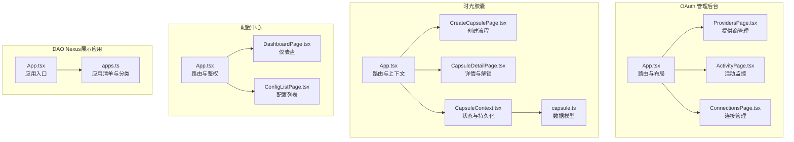
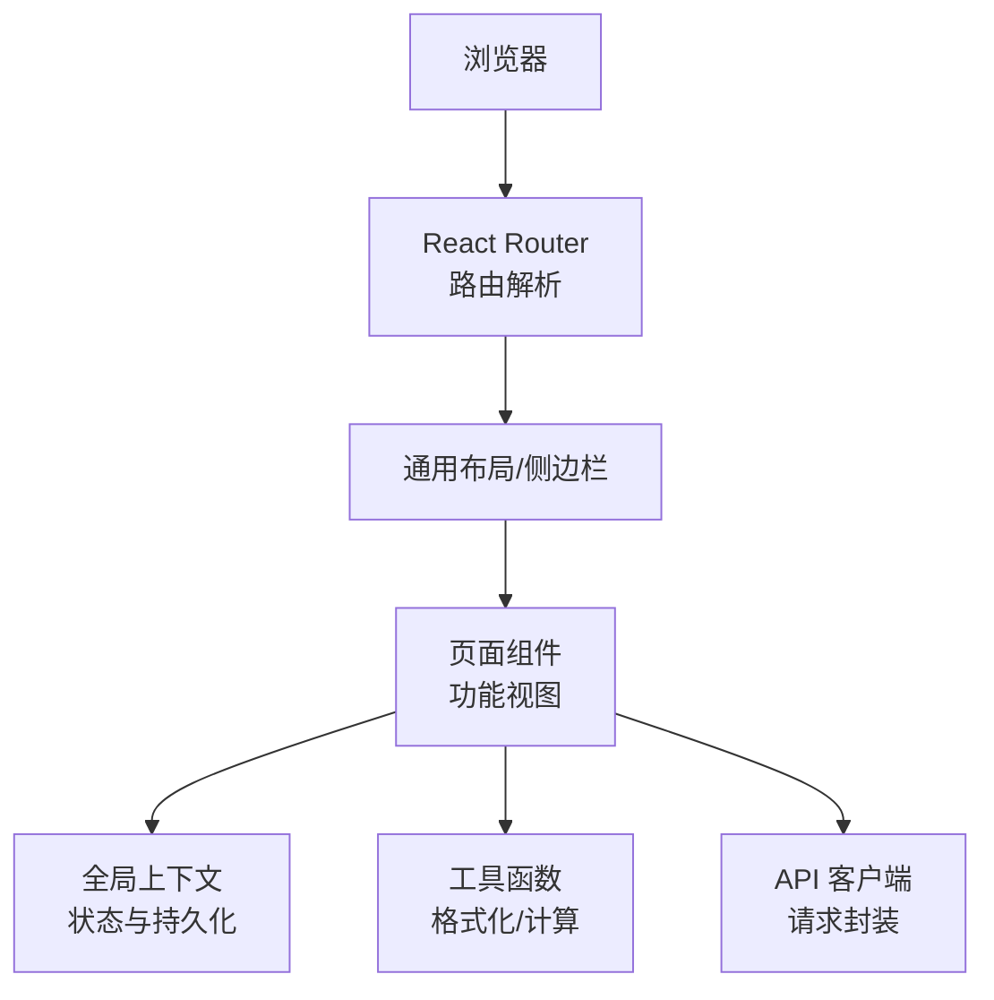
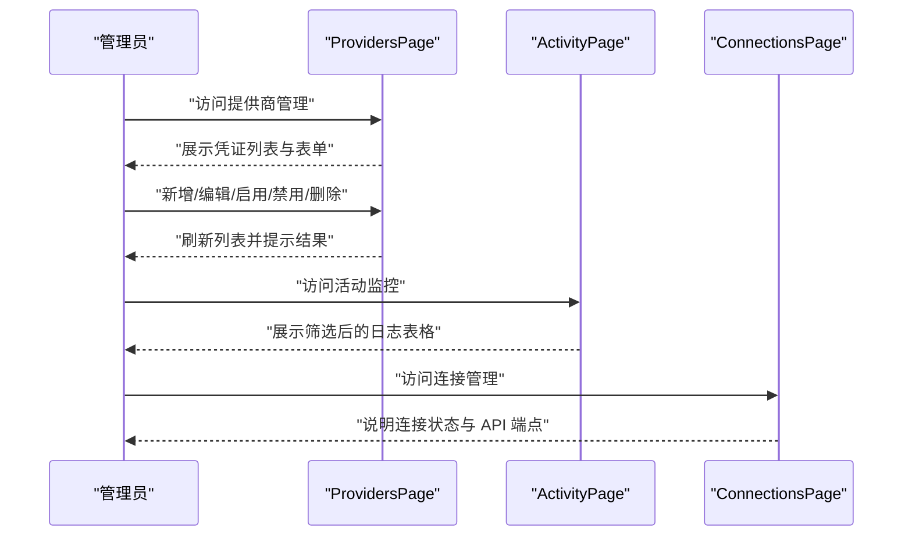
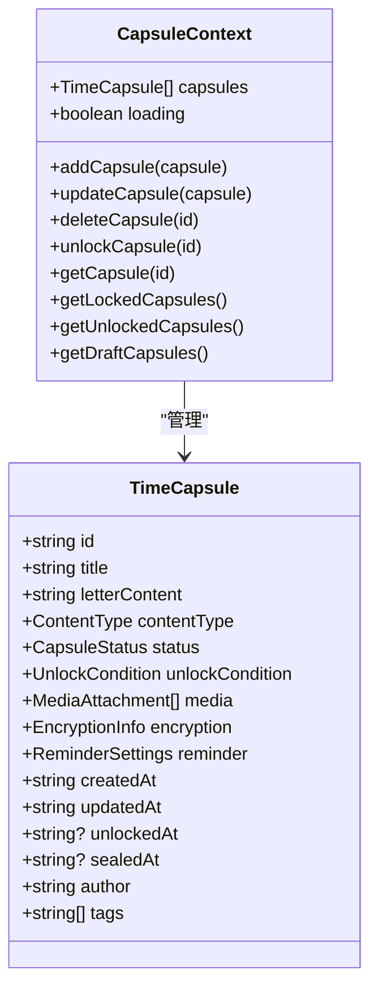
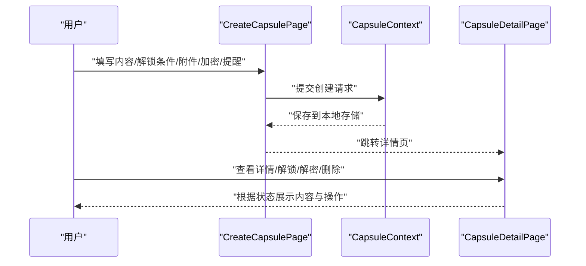
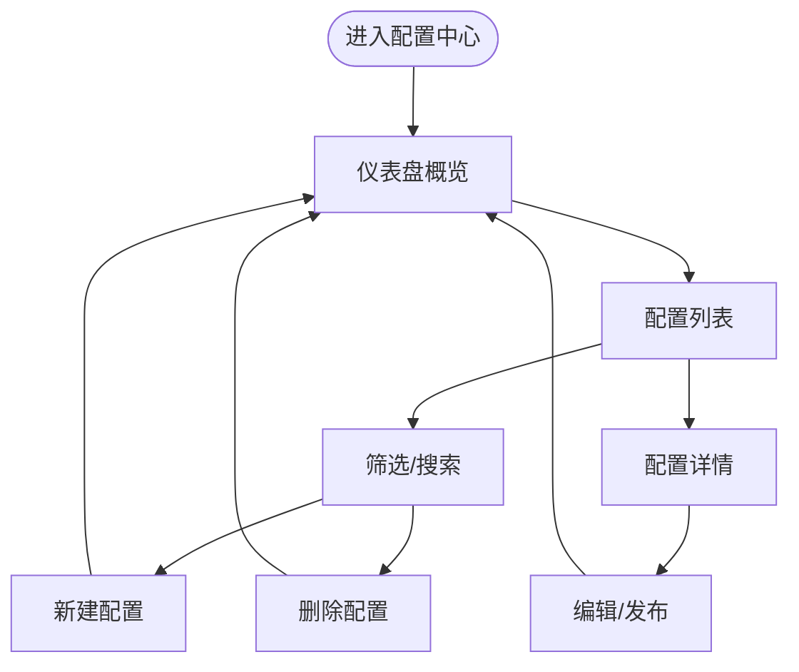
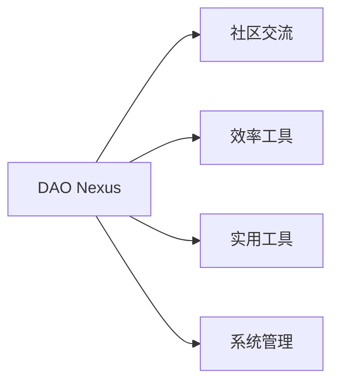
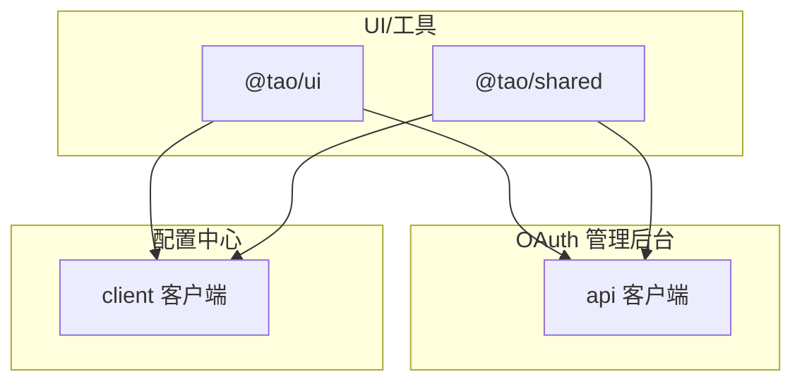

# 其他业务应用

<cite>
**本文引用的文件**
- [apps/oauth-admin/src/App.tsx](file://apps/oauth-admin/src/App.tsx)
- [apps/oauth-admin/src/pages/ProvidersPage.tsx](file://apps/oauth-admin/src/pages/ProvidersPage.tsx)
- [apps/oauth-admin/src/pages/ActivityPage.tsx](file://apps/oauth-admin/src/pages/ActivityPage.tsx)
- [apps/oauth-admin/src/pages/ConnectionsPage.tsx](file://apps/oauth-admin/src/pages/ConnectionsPage.tsx)
- [apps/time-capsule/src/App.tsx](file://apps/time-capsule/src/App.tsx)
- [apps/time-capsule/src/types/capsule.ts](file://apps/time-capsule/src/types/capsule.ts)
- [apps/time-capsule/src/context/CapsuleContext.tsx](file://apps/time-capsule/src/context/CapsuleContext.tsx)
- [apps/time-capsule/src/pages/CreateCapsulePage.tsx](file://apps/time-capsule/src/pages/CreateCapsulePage.tsx)
- [apps/time-capsule/src/pages/CapsuleDetailPage.tsx](file://apps/time-capsule/src/pages/CapsuleDetailPage.tsx)
- [apps/config-center/src/App.tsx](file://apps/config-center/src/App.tsx)
- [apps/config-center/src/pages/DashboardPage.tsx](file://apps/config-center/src/pages/DashboardPage.tsx)
- [apps/config-center/src/pages/ConfigListPage.tsx](file://apps/config-center/src/pages/ConfigListPage.tsx)
- [apps/daoNexus/src/App.tsx](file://apps/daoNexus/src/App.tsx)
- [apps/daoNexus/src/data/apps.ts](file://apps/daoNexus/src/data/apps.ts)
</cite>

## 目录
1. [简介](#简介)
2. [项目结构](#项目结构)
3. [核心组件](#核心组件)
4. [架构总览](#架构总览)
5. [详细组件分析](#详细组件分析)
6. [依赖分析](#依赖分析)
7. [性能考虑](#性能考虑)
8. [故障排除指南](#故障排除指南)
9. [结论](#结论)
10. [附录](#附录)

## 简介
本文件面向其他业务应用，聚焦以下辅助业务功能的应用：
- OAuth 管理后台：提供认证提供商配置、活动监控、连接管理能力，支撑统一身份与权限治理。
- 时光胶囊：提供时间胶囊的创建、内容管理、分享机制、到期提醒与到期解锁流程，强调隐私与体验。
- 展示应用（DAO Nexus）：作为应用入口与导航，聚合社区、效率工具、实用工具与系统管理类应用。

文档将从技术架构、数据模型、API 接口、集成方式、部署配置、性能与运维、使用指南与故障排除等方面进行系统化说明，帮助业务团队快速理解与落地。

## 项目结构
本仓库采用多应用并行组织，每个应用独立构建与运行。OAuth 管理后台、时光胶囊、配置中心、DAO Nexus 等应用分别位于 apps 子目录下，采用前端单页应用（SPA）模式，通过路由进行页面切换与功能编排。

图表来源
- [apps/oauth-admin/src/App.tsx:1-26](file://apps/oauth-admin/src/App.tsx#L1-L26)
- [apps/oauth-admin/src/pages/ProvidersPage.tsx:1-293](file://apps/oauth-admin/src/pages/ProvidersPage.tsx#L1-L293)
- [apps/oauth-admin/src/pages/ActivityPage.tsx:1-160](file://apps/oauth-admin/src/pages/ActivityPage.tsx#L1-L160)
- [apps/oauth-admin/src/pages/ConnectionsPage.tsx:1-32](file://apps/oauth-admin/src/pages/ConnectionsPage.tsx#L1-L32)
- [apps/time-capsule/src/App.tsx:1-51](file://apps/time-capsule/src/App.tsx#L1-L51)
- [apps/time-capsule/src/pages/CreateCapsulePage.tsx:1-621](file://apps/time-capsule/src/pages/CreateCapsulePage.tsx#L1-L621)
- [apps/time-capsule/src/pages/CapsuleDetailPage.tsx:1-387](file://apps/time-capsule/src/pages/CapsuleDetailPage.tsx#L1-L387)
- [apps/time-capsule/src/context/CapsuleContext.tsx:1-161](file://apps/time-capsule/src/context/CapsuleContext.tsx#L1-L161)
- [apps/time-capsule/src/types/capsule.ts:1-101](file://apps/time-capsule/src/types/capsule.ts#L1-L101)
- [apps/config-center/src/App.tsx:1-39](file://apps/config-center/src/App.tsx#L1-L39)
- [apps/config-center/src/pages/DashboardPage.tsx:1-174](file://apps/config-center/src/pages/DashboardPage.tsx#L1-L174)
- [apps/config-center/src/pages/ConfigListPage.tsx:1-178](file://apps/config-center/src/pages/ConfigListPage.tsx#L1-L178)
- [apps/daoNexus/src/App.tsx:1-33](file://apps/daoNexus/src/App.tsx#L1-L33)
- [apps/daoNexus/src/data/apps.ts:1-137](file://apps/daoNexus/src/data/apps.ts#L1-L137)

章节来源
- [apps/oauth-admin/src/App.tsx:1-26](file://apps/oauth-admin/src/App.tsx#L1-L26)
- [apps/time-capsule/src/App.tsx:1-51](file://apps/time-capsule/src/App.tsx#L1-L51)
- [apps/config-center/src/App.tsx:1-39](file://apps/config-center/src/App.tsx#L1-L39)
- [apps/daoNexus/src/App.tsx:1-33](file://apps/daoNexus/src/App.tsx#L1-L33)

## 核心组件
- OAuth 管理后台
  - 提供商配置：支持新增、启用/禁用、删除 OAuth 凭证，配置提供商、Client ID/Secret、回调地址与允许 Scope。
  - 活动监控：筛选与查看 OAuth 登录、Token 刷新、凭证变更等操作日志。
  - 连接管理：展示用户与提供商的连接关系与状态，提供 API 端点说明与管理入口。
- 时光胶囊
  - 创建流程：多步骤向导，包括内容类型、标题、作者、解锁条件（日期/里程碑）、附件上传、加密与提醒设置。
  - 内容管理：详情页支持加密内容解密、内容可见性切换、附件展示、删除等。
  - 分享与到期提醒：可配置提醒天数与接收人，到期自动解锁或手动解锁。
- 配置中心
  - 仪表盘：概览配置总数、活跃配置、草稿配置与最近审计操作。
  - 配置管理：支持按环境与状态筛选、搜索、创建与删除配置。
- DAO Nexus（展示应用）
  - 应用入口：按分类展示社区、效率工具、实用工具与系统管理类应用，统一导航至各子应用。

章节来源
- [apps/oauth-admin/src/pages/ProvidersPage.tsx:1-293](file://apps/oauth-admin/src/pages/ProvidersPage.tsx#L1-L293)
- [apps/oauth-admin/src/pages/ActivityPage.tsx:1-160](file://apps/oauth-admin/src/pages/ActivityPage.tsx#L1-L160)
- [apps/oauth-admin/src/pages/ConnectionsPage.tsx:1-32](file://apps/oauth-admin/src/pages/ConnectionsPage.tsx#L1-L32)
- [apps/time-capsule/src/pages/CreateCapsulePage.tsx:1-621](file://apps/time-capsule/src/pages/CreateCapsulePage.tsx#L1-L621)
- [apps/time-capsule/src/pages/CapsuleDetailPage.tsx:1-387](file://apps/time-capsule/src/pages/CapsuleDetailPage.tsx#L1-L387)
- [apps/config-center/src/pages/DashboardPage.tsx:1-174](file://apps/config-center/src/pages/DashboardPage.tsx#L1-L174)
- [apps/config-center/src/pages/ConfigListPage.tsx:1-178](file://apps/config-center/src/pages/ConfigListPage.tsx#L1-L178)
- [apps/daoNexus/src/data/apps.ts:1-137](file://apps/daoNexus/src/data/apps.ts#L1-L137)

## 架构总览
各应用均采用前端 SPA 架构，通过 React Router 实现页面级路由；部分应用引入全局状态上下文（如时光胶囊的 CapsuleContext）以实现跨组件的状态共享与持久化。DAO Nexus 作为入口应用，聚合各子应用并提供统一导航。

图表来源
- [apps/time-capsule/src/App.tsx:1-51](file://apps/time-capsule/src/App.tsx#L1-L51)
- [apps/time-capsule/src/context/CapsuleContext.tsx:1-161](file://apps/time-capsule/src/context/CapsuleContext.tsx#L1-L161)
- [apps/oauth-admin/src/App.tsx:1-26](file://apps/oauth-admin/src/App.tsx#L1-L26)
- [apps/config-center/src/App.tsx:1-39](file://apps/config-center/src/App.tsx#L1-L39)

## 详细组件分析

### OAuth 管理后台
- 认证提供商配置
  - 支持提供商选择（Google/GitHub）、显示名称、Client ID/Secret、回调 URI、允许 Scope 等字段。
  - 提供启用/禁用与删除操作，支持批量刷新与错误提示。
- 活动监控
  - 支持按提供商、操作类型、状态筛选日志，表格展示时间、操作、状态、提供商、用户 ID、IP 等。
- 连接管理
  - 页面提供连接关系说明与 API 端点提示，便于管理员查看与处置异常连接。

图表来源
- [apps/oauth-admin/src/pages/ProvidersPage.tsx:1-293](file://apps/oauth-admin/src/pages/ProvidersPage.tsx#L1-L293)
- [apps/oauth-admin/src/pages/ActivityPage.tsx:1-160](file://apps/oauth-admin/src/pages/ActivityPage.tsx#L1-L160)
- [apps/oauth-admin/src/pages/ConnectionsPage.tsx:1-32](file://apps/oauth-admin/src/pages/ConnectionsPage.tsx#L1-L32)

章节来源
- [apps/oauth-admin/src/pages/ProvidersPage.tsx:1-293](file://apps/oauth-admin/src/pages/ProvidersPage.tsx#L1-L293)
- [apps/oauth-admin/src/pages/ActivityPage.tsx:1-160](file://apps/oauth-admin/src/pages/ActivityPage.tsx#L1-L160)
- [apps/oauth-admin/src/pages/ConnectionsPage.tsx:1-32](file://apps/oauth-admin/src/pages/ConnectionsPage.tsx#L1-L32)

### 时光胶囊
- 数据模型
  - 时间胶囊包含状态（锁定/解锁/草稿）、解锁条件（日期/里程碑）、媒体附件、加密信息、提醒设置、标签与作者等字段。
  - 表单数据默认值与多步创建流程，确保用户体验与数据完整性。
- 上下文与持久化
  - 使用 useReducer 维护胶囊集合，支持增删改查、解锁状态更新与本地持久化。
  - 启动时自动检查解锁状态并同步更新。
- 创建流程
  - 多步骤向导：内容类型与标题、解锁条件（日期/里程碑）、附件上传、加密开关与密码、提醒设置与接收人。
  - 校验每步必填项，保证创建数据有效。
- 详情与解锁
  - 锁定时展示倒计时进度与到期解锁按钮；解锁后可选择解密查看或模糊显示。
  - 支持附件预览与删除操作。

图表来源
- [apps/time-capsule/src/types/capsule.ts:1-101](file://apps/time-capsule/src/types/capsule.ts#L1-L101)
- [apps/time-capsule/src/context/CapsuleContext.tsx:1-161](file://apps/time-capsule/src/context/CapsuleContext.tsx#L1-L161)

图表来源
- [apps/time-capsule/src/pages/CreateCapsulePage.tsx:1-621](file://apps/time-capsule/src/pages/CreateCapsulePage.tsx#L1-L621)
- [apps/time-capsule/src/context/CapsuleContext.tsx:1-161](file://apps/time-capsule/src/context/CapsuleContext.tsx#L1-L161)
- [apps/time-capsule/src/pages/CapsuleDetailPage.tsx:1-387](file://apps/time-capsule/src/pages/CapsuleDetailPage.tsx#L1-L387)

章节来源
- [apps/time-capsule/src/types/capsule.ts:1-101](file://apps/time-capsule/src/types/capsule.ts#L1-L101)
- [apps/time-capsule/src/context/CapsuleContext.tsx:1-161](file://apps/time-capsule/src/context/CapsuleContext.tsx#L1-L161)
- [apps/time-capsule/src/pages/CreateCapsulePage.tsx:1-621](file://apps/time-capsule/src/pages/CreateCapsulePage.tsx#L1-L621)
- [apps/time-capsule/src/pages/CapsuleDetailPage.tsx:1-387](file://apps/time-capsule/src/pages/CapsuleDetailPage.tsx#L1-L387)

### 配置中心
- 仪表盘
  - 展示配置总数、活跃配置、草稿配置与最近审计操作，支持快速跳转。
- 配置管理
  - 支持按环境与状态筛选、关键词搜索、创建与删除配置，表格展示配置键、服务、环境、状态、版本与更新时间。

图表来源
- [apps/config-center/src/pages/DashboardPage.tsx:1-174](file://apps/config-center/src/pages/DashboardPage.tsx#L1-L174)
- [apps/config-center/src/pages/ConfigListPage.tsx:1-178](file://apps/config-center/src/pages/ConfigListPage.tsx#L1-L178)

章节来源
- [apps/config-center/src/pages/DashboardPage.tsx:1-174](file://apps/config-center/src/pages/DashboardPage.tsx#L1-L174)
- [apps/config-center/src/pages/ConfigListPage.tsx:1-178](file://apps/config-center/src/pages/ConfigListPage.tsx#L1-L178)

### 展示应用（DAO Nexus）
- 应用入口与导航
  - 按分类聚合应用，展示图标、名称、描述与颜色主题，统一跳转至各子应用路径。
- 应用清单
  - 包含社区、效率工具、实用工具与系统管理四类应用，便于统一入口与管理。

图表来源
- [apps/daoNexus/src/App.tsx:1-33](file://apps/daoNexus/src/App.tsx#L1-L33)
- [apps/daoNexus/src/data/apps.ts:1-137](file://apps/daoNexus/src/data/apps.ts#L1-L137)

章节来源
- [apps/daoNexus/src/App.tsx:1-33](file://apps/daoNexus/src/App.tsx#L1-L33)
- [apps/daoNexus/src/data/apps.ts:1-137](file://apps/daoNexus/src/data/apps.ts#L1-L137)

## 依赖分析
- 组件耦合
  - OAuth 管理后台页面间低耦合，通过路由与共享 API 客户端交互。
  - 时光胶囊通过 CapsuleContext 提供跨组件状态共享，减少 props 传递。
  - 配置中心与 DAO Nexus 为纯前端应用，依赖各自的数据与路由配置。
- 外部依赖
  - UI 组件库与工具函数（如格式化、相对时间等）在各应用中复用。
  - OAuth 管理后台与配置中心页面通过 API 客户端封装请求，便于集中处理错误与鉴权。

图表来源
- [apps/oauth-admin/src/pages/ProvidersPage.tsx:1-293](file://apps/oauth-admin/src/pages/ProvidersPage.tsx#L1-L293)
- [apps/config-center/src/pages/DashboardPage.tsx:1-174](file://apps/config-center/src/pages/DashboardPage.tsx#L1-L174)

章节来源
- [apps/oauth-admin/src/pages/ProvidersPage.tsx:1-293](file://apps/oauth-admin/src/pages/ProvidersPage.tsx#L1-L293)
- [apps/config-center/src/pages/DashboardPage.tsx:1-174](file://apps/config-center/src/pages/DashboardPage.tsx#L1-L174)

## 性能考虑
- 前端渲染优化
  - 使用 React Router 的懒加载与按需渲染，避免一次性加载过多页面。
  - 时光胶囊使用本地存储与上下文状态，减少重复网络请求。
- 图片与媒体
  - 附件采用 Blob/DataURL 本地存储，注意大文件对内存与存储的影响；建议在详情页按需加载与释放。
- 列表与筛选
  - 配置中心与活动监控支持筛选与分页参数，建议在后端实现分页与索引以降低前端压力。
- 主题与动画
  - 合理使用 CSS 动画与渐变，避免在低端设备上造成卡顿。

## 故障排除指南
- OAuth 提供商配置
  - 现象：新增/更新凭证失败。
  - 排查：确认回调 URI 与允许 Scope 是否正确；检查 Client ID/Secret 是否有效；查看错误提示并重试。
- 活动监控无数据
  - 现象：筛选后无日志。
  - 排查：确认筛选条件是否过于严格；检查网络请求与后端日志；尝试清除缓存后重试。
- 连接管理页面
  - 现象：连接状态异常。
  - 排查：参考页面提供的 API 端点说明，核对后端连接数据；必要时手动解除异常连接。
- 时光胶囊创建
  - 现象：无法提交或步骤校验失败。
  - 排查：检查必填项（标题、内容、解锁条件等）；确认加密密码长度；检查附件格式与大小限制。
- 时光胶囊详情
  - 现象：内容无法解密或显示异常。
  - 排查：确认密码正确；检查加密开关与提示；确认浏览器支持的媒体格式；清理本地存储后重试。
- 配置中心
  - 现象：配置列表为空或筛选无效。
  - 排查：检查环境与状态过滤；确认搜索关键词；查看网络错误提示；尝试刷新页面。

章节来源
- [apps/oauth-admin/src/pages/ProvidersPage.tsx:1-293](file://apps/oauth-admin/src/pages/ProvidersPage.tsx#L1-L293)
- [apps/oauth-admin/src/pages/ActivityPage.tsx:1-160](file://apps/oauth-admin/src/pages/ActivityPage.tsx#L1-L160)
- [apps/oauth-admin/src/pages/ConnectionsPage.tsx:1-32](file://apps/oauth-admin/src/pages/ConnectionsPage.tsx#L1-L32)
- [apps/time-capsule/src/pages/CreateCapsulePage.tsx:1-621](file://apps/time-capsule/src/pages/CreateCapsulePage.tsx#L1-L621)
- [apps/time-capsule/src/pages/CapsuleDetailPage.tsx:1-387](file://apps/time-capsule/src/pages/CapsuleDetailPage.tsx#L1-L387)
- [apps/config-center/src/pages/ConfigListPage.tsx:1-178](file://apps/config-center/src/pages/ConfigListPage.tsx#L1-L178)

## 结论
本文件梳理了 OAuth 管理后台、时光胶囊与配置中心、DAO Nexus 的功能边界、技术架构与关键流程。通过清晰的路由与上下文设计，这些应用能够满足认证治理、内容存档与分享、配置管理与审计等业务需求。建议在生产环境中结合后端 API 与数据库完善鉴权、日志与监控，并持续优化前端性能与用户体验。

## 附录
- 部署与运行
  - 各应用均为前端 SPA，可使用静态服务器或容器化部署；建议开启 Gzip 压缩与 CDN 加速。
  - 环境变量与 API 地址应在构建时注入或通过运行时配置管理。
- 开发与测试
  - 建议为各应用编写单元测试与集成测试，覆盖关键流程（创建、解锁、配置管理等）。
- 参考文件
  - OAuth 管理后台路由与页面：[apps/oauth-admin/src/App.tsx:1-26](file://apps/oauth-admin/src/App.tsx#L1-L26)，[apps/oauth-admin/src/pages/ProvidersPage.tsx:1-293](file://apps/oauth-admin/src/pages/ProvidersPage.tsx#L1-L293)，[apps/oauth-admin/src/pages/ActivityPage.tsx:1-160](file://apps/oauth-admin/src/pages/ActivityPage.tsx#L1-L160)，[apps/oauth-admin/src/pages/ConnectionsPage.tsx:1-32](file://apps/oauth-admin/src/pages/ConnectionsPage.tsx#L1-L32)
  - 时光胶囊路由与上下文：[apps/time-capsule/src/App.tsx:1-51](file://apps/time-capsule/src/App.tsx#L1-L51)，[apps/time-capsule/src/context/CapsuleContext.tsx:1-161](file://apps/time-capsule/src/context/CapsuleContext.tsx#L1-L161)，[apps/time-capsule/src/types/capsule.ts:1-101](file://apps/time-capsule/src/types/capsule.ts#L1-L101)，[apps/time-capsule/src/pages/CreateCapsulePage.tsx:1-621](file://apps/time-capsule/src/pages/CreateCapsulePage.tsx#L1-L621)，[apps/time-capsule/src/pages/CapsuleDetailPage.tsx:1-387](file://apps/time-capsule/src/pages/CapsuleDetailPage.tsx#L1-L387)
  - 配置中心路由与页面：[apps/config-center/src/App.tsx:1-39](file://apps/config-center/src/App.tsx#L1-L39)，[apps/config-center/src/pages/DashboardPage.tsx:1-174](file://apps/config-center/src/pages/DashboardPage.tsx#L1-L174)，[apps/config-center/src/pages/ConfigListPage.tsx:1-178](file://apps/config-center/src/pages/ConfigListPage.tsx#L1-L178)
  - 展示应用入口与数据：[apps/daoNexus/src/App.tsx:1-33](file://apps/daoNexus/src/App.tsx#L1-L33)，[apps/daoNexus/src/data/apps.ts:1-137](file://apps/daoNexus/src/data/apps.ts#L1-L137)