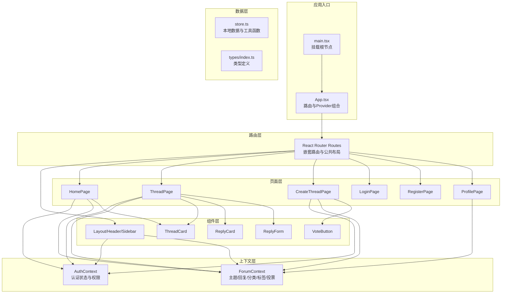
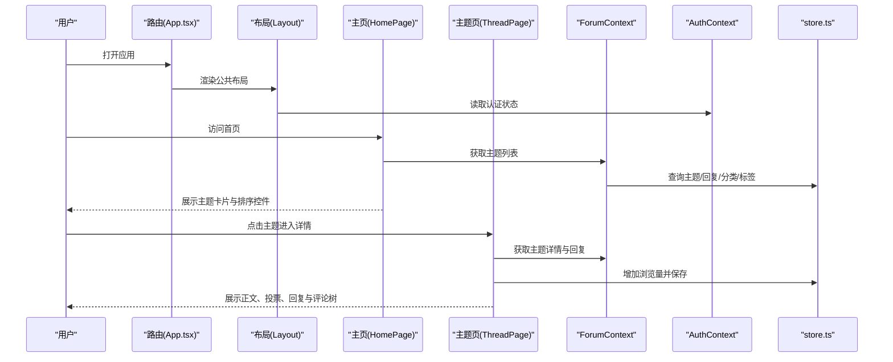
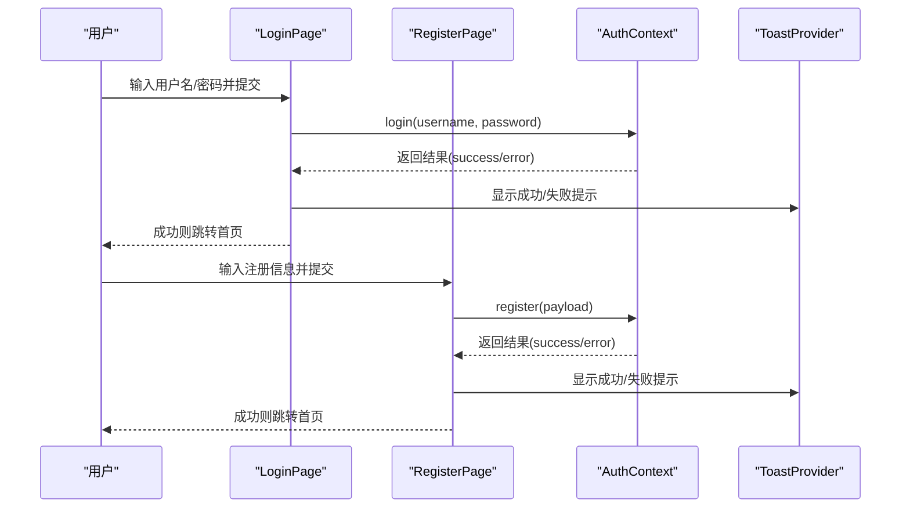
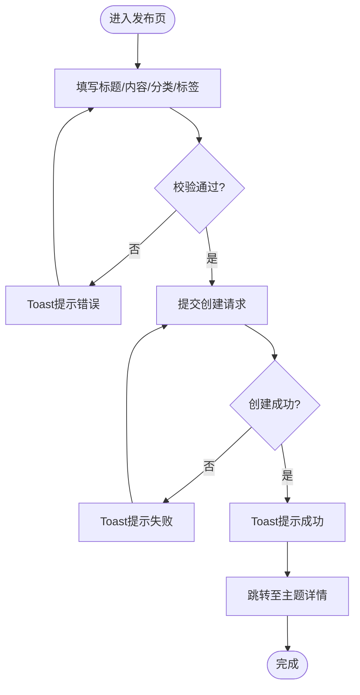
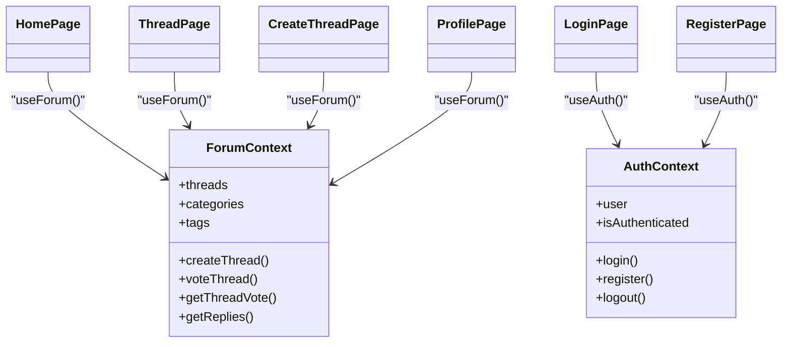
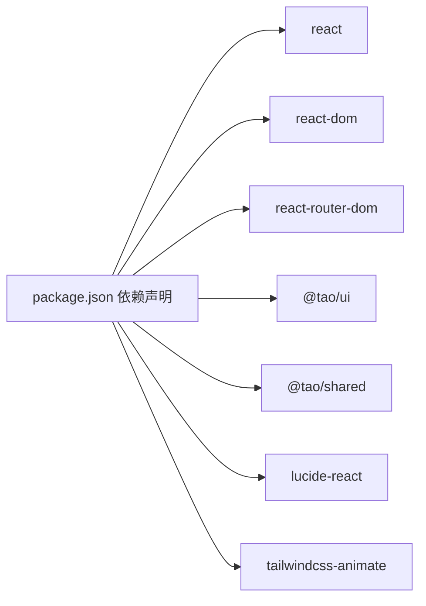

# 社区论坛系统

<cite>
**本文引用的文件**
- [apps/forum/src/App.tsx](file://apps/forum/src/App.tsx)
- [apps/forum/src/main.tsx](file://apps/forum/src/main.tsx)
- [apps/forum/package.json](file://apps/forum/package.json)
- [apps/forum/src/pages/HomePage.tsx](file://apps/forum/src/pages/HomePage.tsx)
- [apps/forum/src/pages/ThreadPage.tsx](file://apps/forum/src/pages/ThreadPage.tsx)
- [apps/forum/src/pages/CreateThreadPage.tsx](file://apps/forum/src/pages/CreateThreadPage.tsx)
- [apps/forum/src/pages/LoginPage.tsx](file://apps/forum/src/pages/LoginPage.tsx)
- [apps/forum/src/pages/RegisterPage.tsx](file://apps/forum/src/pages/RegisterPage.tsx)
- [apps/forum/src/pages/ProfilePage.tsx](file://apps/forum/src/pages/ProfilePage.tsx)
- [apps/forum/src/context/AuthContext.tsx](file://apps/forum/src/context/AuthContext.tsx)
- [apps/forum/src/context/ForumContext.tsx](file://apps/forum/src/context/ForumContext.tsx)
- [apps/forum/src/data/store.ts](file://apps/forum/src/data/store.ts)
- [apps/forum/src/types/index.ts](file://apps/forum/src/types/index.ts)
- [apps/forum/src/components/thread/ThreadCard.tsx](file://apps/forum/src/components/thread/ThreadCard.tsx)
- [apps/forum/src/components/thread/VoteButton.tsx](file://apps/forum/src/components/thread/VoteButton.tsx)
- [apps/forum/src/components/reply/ReplyCard.tsx](file://apps/forum/src/components/reply/ReplyCard.tsx)
- [apps/forum/src/components/reply/ReplyForm.tsx](file://apps/forum/src/components/reply/ReplyForm.tsx)
- [apps/forum/src/components/layout/Header.tsx](file://apps/forum/src/components/layout/Header.tsx)
- [apps/forum/src/components/layout/Layout.tsx](file://apps/forum/src/components/layout/Layout.tsx)
- [apps/forum/src/components/layout/Sidebar.tsx](file://apps/forum/src/components/layout/Sidebar.tsx)
</cite>

## 目录
1. [简介](#简介)
2. [项目结构](#项目结构)
3. [核心组件](#核心组件)
4. [架构总览](#架构总览)
5. [详细组件分析](#详细组件分析)
6. [依赖关系分析](#依赖关系分析)
7. [性能考虑](#性能考虑)
8. [故障排查指南](#故障排查指南)
9. [结论](#结论)
10. [附录](#附录)

## 简介
本文件为社区论坛系统（Nexus Forum）的功能文档，覆盖整体架构、用户交互流程、核心功能模块与数据模型，并对上下文管理器设计模式、状态共享机制、组件间通信方式进行深入解析。系统围绕“主题-回复”内容生态，提供用户认证与权限管理、主题分类与标签体系、投票与排序、搜索与通知等能力。文档同时给出页面组件清单、API 接口规范、前端路由配置、部署与性能优化建议以及扩展开发指导。

## 项目结构
论坛应用采用基于 React 的单页应用（SPA），通过 React Router v6 实现前端路由，使用 Context 提供全局状态与认证上下文，组件按功能域分层组织，数据通过本地存储进行初始化与持久化。

图示来源
- [apps/forum/src/main.tsx:1-11](file://apps/forum/src/main.tsx#L1-L11)
- [apps/forum/src/App.tsx:1-49](file://apps/forum/src/App.tsx#L1-L49)
- [apps/forum/src/context/AuthContext.tsx](file://apps/forum/src/context/AuthContext.tsx)
- [apps/forum/src/context/ForumContext.tsx](file://apps/forum/src/context/ForumContext.tsx)
- [apps/forum/src/data/store.ts](file://apps/forum/src/data/store.ts)
- [apps/forum/src/types/index.ts](file://apps/forum/src/types/index.ts)

章节来源
- [apps/forum/src/main.tsx:1-11](file://apps/forum/src/main.tsx#L1-L11)
- [apps/forum/src/App.tsx:1-49](file://apps/forum/src/App.tsx#L1-L49)
- [apps/forum/package.json:1-36](file://apps/forum/package.json#L1-L36)

## 核心组件
- 应用入口与路由：应用通过 main.tsx 挂载根节点，App.tsx 组合 Provider 并定义路由规则，公共布局由 Layout 包裹。
- 认证与权限：AuthContext 提供登录、注册、登出与角色判断；ForumContext 提供主题、回复、分类、标签、投票等业务操作。
- 页面组件：HomePage、ThreadPage、CreateThreadPage、LoginPage、RegisterPage、ProfilePage 分别承载不同业务场景。
- 布局组件：Header、Sidebar、Layout 提供导航与侧边栏。
- 列表与表单组件：ThreadCard、ReplyCard、ReplyForm、VoteButton 支持主题列表、回复树形展示与投票交互。
- 数据与类型：store.ts 提供本地数据存取与工具函数；types/index.ts 定义排序键与实体类型。

章节来源
- [apps/forum/src/App.tsx:1-49](file://apps/forum/src/App.tsx#L1-L49)
- [apps/forum/src/context/AuthContext.tsx](file://apps/forum/src/context/AuthContext.tsx)
- [apps/forum/src/context/ForumContext.tsx](file://apps/forum/src/context/ForumContext.tsx)
- [apps/forum/src/data/store.ts](file://apps/forum/src/data/store.ts)
- [apps/forum/src/types/index.ts](file://apps/forum/src/types/index.ts)

## 架构总览
系统采用“Provider + Context + 组件”的前端架构，结合 React Router 实现页面级导航。数据流以 store.ts 为中心，通过 ForumContext 将业务操作暴露给页面与组件；认证状态由 AuthContext 管理，影响页面访问控制与交互按钮可见性。

图示来源
- [apps/forum/src/App.tsx:21-46](file://apps/forum/src/App.tsx#L21-L46)
- [apps/forum/src/pages/HomePage.tsx:18-47](file://apps/forum/src/pages/HomePage.tsx#L18-L47)
- [apps/forum/src/pages/ThreadPage.tsx:17-82](file://apps/forum/src/pages/ThreadPage.tsx#L17-L82)
- [apps/forum/src/context/ForumContext.tsx](file://apps/forum/src/context/ForumContext.tsx)
- [apps/forum/src/context/AuthContext.tsx](file://apps/forum/src/context/AuthContext.tsx)
- [apps/forum/src/data/store.ts](file://apps/forum/src/data/store.ts)

## 详细组件分析

### 用户认证与权限管理
- 登录/注册流程：LoginPage 与 RegisterPage 调用 AuthContext 的 login/register 方法，校验表单后跳转首页并提示成功或错误信息。
- 角色与权限：ProfilePage 与 ThreadPage 中根据用户角色渲染徽章与操作菜单；管理员与版主可对主题执行置顶、锁定、隐藏与删除等操作。
- 访问控制：CreateThreadPage 对未登录用户进行重定向；Header 中根据认证状态切换导航项。

图示来源
- [apps/forum/src/pages/LoginPage.tsx:16-31](file://apps/forum/src/pages/LoginPage.tsx#L16-L31)
- [apps/forum/src/pages/RegisterPage.tsx:17-46](file://apps/forum/src/pages/RegisterPage.tsx#L17-L46)
- [apps/forum/src/context/AuthContext.tsx](file://apps/forum/src/context/AuthContext.tsx)

章节来源
- [apps/forum/src/pages/LoginPage.tsx:1-93](file://apps/forum/src/pages/LoginPage.tsx#L1-L93)
- [apps/forum/src/pages/RegisterPage.tsx:1-112](file://apps/forum/src/pages/RegisterPage.tsx#L1-L112)
- [apps/forum/src/context/AuthContext.tsx](file://apps/forum/src/context/AuthContext.tsx)

### 内容审核与治理
- 主题治理：管理员/版主可在 ThreadPage 中对主题执行置顶、锁定、隐藏与删除操作；隐藏后会导航回首页。
- 回复治理：ThreadPage 提供回复排序与最佳答案标记（若实现）；支持删除自己的回复（若实现）。
- 权限判定：通过 user.role 判断 admin/moderator，决定是否显示治理菜单。

章节来源
- [apps/forum/src/pages/ThreadPage.tsx:84-202](file://apps/forum/src/pages/ThreadPage.tsx#L84-L202)

### 主题分类与标签系统
- 分类选择：CreateThreadPage 中通过网格展示分类，点击选择后高亮显示。
- 标签选择：最多选择 5 个标签，支持取消与预览。
- 分类与标签查询：ForumContext 暴露 categories/tags，ThreadPage 展示分类徽章与标签集合。

章节来源
- [apps/forum/src/pages/CreateThreadPage.tsx:75-121](file://apps/forum/src/pages/CreateThreadPage.tsx#L75-L121)
- [apps/forum/src/pages/ThreadPage.tsx:74-75](file://apps/forum/src/pages/ThreadPage.tsx#L74-L75)
- [apps/forum/src/context/ForumContext.tsx](file://apps/forum/src/context/ForumContext.tsx)

### 帖子发布流程
- 表单校验：标题、内容、分类必填；内容长度限制；标签数量限制。
- 创建主题：调用 ForumContext.createThread，成功后跳转至主题详情页。
- 反馈提示：使用 ToastProvider 提示成功/失败。

图示来源
- [apps/forum/src/pages/CreateThreadPage.tsx:34-49](file://apps/forum/src/pages/CreateThreadPage.tsx#L34-L49)
- [apps/forum/src/context/ForumContext.tsx](file://apps/forum/src/context/ForumContext.tsx)

### 回复互动与评论树
- 评论树：ThreadPage 展示顶层回复与嵌套回复；支持展开/收起内联回复框。
- 排序策略：按“最高票/最新/最早”排序；最佳答案优先。
- 投稿与编辑：ReplyForm 支持提交新回复；支持取消与刷新列表。
- 锁定状态：当主题被锁定时，禁止回复。

章节来源
- [apps/forum/src/pages/ThreadPage.tsx:207-268](file://apps/forum/src/pages/ThreadPage.tsx#L207-L268)
- [apps/forum/src/components/reply/ReplyCard.tsx](file://apps/forum/src/components/reply/ReplyCard.tsx)
- [apps/forum/src/components/reply/ReplyForm.tsx](file://apps/forum/src/components/reply/ReplyForm.tsx)

### 投票系统
- 主题投票：ThreadPage 顶部与正文侧边均提供 VoteButton；支持 upvote/downvote；显示当前投票状态与分数。
- 回复投票：若实现，可在 ReplyCard 中集成投票按钮（当前代码未直接引用 ReplyVote 组件）。
- 排序影响：首页与主题页的“最高票”排序依据投票差值计算。

章节来源
- [apps/forum/src/pages/ThreadPage.tsx:149-163](file://apps/forum/src/pages/ThreadPage.tsx#L149-L163)
- [apps/forum/src/components/thread/VoteButton.tsx](file://apps/forum/src/components/thread/VoteButton.tsx)
- [apps/forum/src/pages/HomePage.tsx:40-46](file://apps/forum/src/pages/HomePage.tsx#L40-L46)

### 搜索功能
- 当前实现：SearchPage 存在路由与页面组件，但未在 App 路由中作为公共布局子路由使用；搜索逻辑未在现有页面中实现。
- 建议：在 ForumContext 中提供搜索方法（如按标题/内容/标签/作者），SearchPage 中展示结果列表。

章节来源
- [apps/forum/src/App.tsx:34](file://apps/forum/src/App.tsx#L34)
- [apps/forum/src/pages/SearchPage.tsx](file://apps/forum/src/pages/SearchPage.tsx)

### 通知机制
- ToastProvider：全局提供 Toast 服务，用于登录/注册/发布/删除等操作反馈。
- 使用点：LoginPage、RegisterPage、CreateThreadPage、ThreadPage 等多处调用 addToast 或 toast。

章节来源
- [apps/forum/src/App.tsx:4](file://apps/forum/src/App.tsx#L4)
- [apps/forum/src/pages/LoginPage.tsx:10](file://apps/forum/src/pages/LoginPage.tsx#L10)
- [apps/forum/src/pages/RegisterPage.tsx:9](file://apps/forum/src/pages/RegisterPage.tsx#L9)
- [apps/forum/src/pages/CreateThreadPage.tsx:13](file://apps/forum/src/pages/CreateThreadPage.tsx#L13)
- [apps/forum/src/pages/ThreadPage.tsx:22](file://apps/forum/src/pages/ThreadPage.tsx#L22)

### 上下文管理器设计模式与状态共享
- AuthContext：集中管理用户认证状态、登录/注册/登出与角色判断，供 Header、Profile、Thread 等组件消费。
- ForumContext：集中管理主题、回复、分类、标签、投票等业务状态与操作，供 HomePage、ThreadPage、CreateThreadPage 等消费。
- 共享机制：通过 React Context 将状态与方法注入到组件树，避免跨层级传递 props；store.ts 作为底层数据源，提供查询与更新。

图示来源
- [apps/forum/src/context/AuthContext.tsx](file://apps/forum/src/context/AuthContext.tsx)
- [apps/forum/src/context/ForumContext.tsx](file://apps/forum/src/context/ForumContext.tsx)
- [apps/forum/src/pages/HomePage.tsx:6-7](file://apps/forum/src/pages/HomePage.tsx#L6-L7)
- [apps/forum/src/pages/ThreadPage.tsx:21](file://apps/forum/src/pages/ThreadPage.tsx#L21)
- [apps/forum/src/pages/CreateThreadPage.tsx:12](file://apps/forum/src/pages/CreateThreadPage.tsx#L12)
- [apps/forum/src/pages/LoginPage.tsx:9](file://apps/forum/src/pages/LoginPage.tsx#L9)
- [apps/forum/src/pages/RegisterPage.tsx:9](file://apps/forum/src/pages/RegisterPage.tsx#L9)
- [apps/forum/src/pages/ProfilePage.tsx:12](file://apps/forum/src/pages/ProfilePage.tsx#L12)

### 组件间通信方式
- Props 下传：Layout -> Header/Sidebar；页面 -> 列表/表单组件。
- Context 上行：组件通过 useAuth/useForum 获取状态与方法，触发状态变更。
- 事件回调：ReplyForm.onSubmitted、ThreadPage.setReplyToId 等通过回调驱动局部刷新。

章节来源
- [apps/forum/src/components/layout/Layout.tsx](file://apps/forum/src/components/layout/Layout.tsx)
- [apps/forum/src/components/layout/Header.tsx](file://apps/forum/src/components/layout/Header.tsx)
- [apps/forum/src/components/layout/Sidebar.tsx](file://apps/forum/src/components/layout/Sidebar.tsx)
- [apps/forum/src/components/thread/ThreadCard.tsx](file://apps/forum/src/components/thread/ThreadCard.tsx)
- [apps/forum/src/components/reply/ReplyForm.tsx](file://apps/forum/src/components/reply/ReplyForm.tsx)
- [apps/forum/src/pages/ThreadPage.tsx:244-251](file://apps/forum/src/pages/ThreadPage.tsx#L244-L251)

### 页面组件文档

#### 布局组件
- Layout：公共布局容器，包裹所有受保护路由。
- Header：导航栏，根据认证状态显示登录/注册/个人资料/设置/退出等入口。
- Sidebar：侧边栏，可扩展分类导航与快捷入口。

章节来源
- [apps/forum/src/components/layout/Layout.tsx](file://apps/forum/src/components/layout/Layout.tsx)
- [apps/forum/src/components/layout/Header.tsx](file://apps/forum/src/components/layout/Header.tsx)
- [apps/forum/src/components/layout/Sidebar.tsx](file://apps/forum/src/components/layout/Sidebar.tsx)

#### 列表组件
- ThreadCard：主题卡片，展示标题、作者、时间、统计与标签；支持点击进入详情。
- ReplyCard：回复卡片，展示作者、时间、内容与投票；支持最佳答案标记与嵌套展示。

章节来源
- [apps/forum/src/components/thread/ThreadCard.tsx](file://apps/forum/src/components/thread/ThreadCard.tsx)
- [apps/forum/src/components/reply/ReplyCard.tsx](file://apps/forum/src/components/reply/ReplyCard.tsx)

#### 表单组件
- ReplyForm：回复表单，支持父回复 ID 与占位符；提交后刷新列表。
- CreateThreadPage：发布主题表单，包含标题、分类、标签与内容。

章节来源
- [apps/forum/src/components/reply/ReplyForm.tsx](file://apps/forum/src/components/reply/ReplyForm.tsx)
- [apps/forum/src/pages/CreateThreadPage.tsx:1-161](file://apps/forum/src/pages/CreateThreadPage.tsx#L1-L161)

### 数据模型设计
- 用户：包含用户名、显示名、邮箱、角色、声望、徽章、加入时间等。
- 主题：包含标题、内容、作者、分类、标签、状态、置顶/锁定/解决标记、浏览数、回复数、投票列表、创建时间等。
- 回复：包含作者、父回复 ID、内容、状态、投票列表、创建时间等。
- 分类与标签：分类包含图标与名称；标签包含名称与唯一标识。
- 排序键：ThreadSortBy、ReplySortBy 定义首页与回复页的排序策略。

章节来源
- [apps/forum/src/types/index.ts](file://apps/forum/src/types/index.ts)
- [apps/forum/src/data/store.ts](file://apps/forum/src/data/store.ts)

### API 接口规范
- 认证相关
  - POST /api/auth/login
    - 请求体：{ username, password }
    - 响应：{ success: boolean, error?: string, user?: User }
  - POST /api/auth/register
    - 请求体：{ displayName, username, email, password }
    - 响应：{ success: boolean, error?: string }
  - POST /api/auth/logout
    - 请求体：空
    - 响应：{ success: boolean }
- 主题相关
  - GET /api/threads
    - 查询参数：sortBy, categoryId, status
    - 响应：Thread[]
  - GET /api/threads/:id
    - 响应：Thread
  - POST /api/threads
    - 请求体：{ title, content, categoryId, tags[] }
    - 响应：Thread
  - PUT /api/threads/:id/vote
    - 请求体：{ direction: 'up'|'down' }
    - 响应：{ score: number }
  - DELETE /api/threads/:id
    - 响应：{ success: boolean }
- 回复相关
  - GET /api/threads/:threadId/replies
    - 查询参数：sortBy
    - 响应：Reply[]
  - POST /api/replies
    - 请求体：{ threadId, content, parentReplyId? }
    - 响应：Reply
  - PUT /api/replies/:id/vote
    - 请求体：{ direction: 'up'|'down' }
    - 响应：{ score: number }
  - DELETE /api/replies/:id
    - 响应：{ success: boolean }
- 用户相关
  - GET /api/users/:id/profile
    - 响应：UserProfile
  - GET /api/users/:id/threads
    - 响应：Thread[]
  - GET /api/users/:id/replies
    - 响应：Reply[]
- 系统管理（管理员/版主）
  - PUT /api/threads/:id/pin
  - PUT /api/threads/:id/lock
  - PUT /api/threads/:id/hide
  - PUT /api/threads/:id/solve

说明
- 当前仓库为前端实现，上述接口为建议规范；实际后端需提供对应接口以配合前端调用。

## 依赖关系分析
- 外部依赖：react、react-dom、react-router-dom、@tao/ui、lucide-react、tailwindcss-animate。
- 内部依赖：@tao/shared（工具函数）、@tao/ui（UI 组件与 ToastProvider）。
- 构建与测试：vite、typescript、vitest（含覆盖率）。

图示来源
- [apps/forum/package.json:15-35](file://apps/forum/package.json#L15-L35)

章节来源
- [apps/forum/package.json:1-36](file://apps/forum/package.json#L1-L36)

## 性能考虑
- 列表渲染：使用 useMemo 缓存过滤与排序结果，减少重复计算。
- 图片懒加载：Hero 图片可考虑懒加载以降低首屏压力。
- 无限滚动：在 HomePage/ProfilePage 中可引入虚拟列表或分页加载。
- 状态粒度：将高频更新拆分为多个 Context，避免不必要的重渲染。
- 构建优化：启用 Terser 压缩与 Tailwind Tree-shaking，生产环境开启资源压缩与缓存策略。

## 故障排查指南
- 登录/注册失败
  - 检查表单必填字段与格式校验；查看 Toast 提示；确认 AuthContext 的 login/register 实现。
- 无法发布主题
  - 检查认证状态与表单校验；确认 ForumContext.createThread 是否返回主题对象。
- 评论列表不刷新
  - 确认 ThreadPage 中 onSubmitted 回调是否触发刷新键；检查 ReplyForm 的提交逻辑。
- 投票无效
  - 检查 ThreadPage 中 voteThread 与 getThreadVote 的调用；确认 store 中投票状态更新。
- 路由跳转异常
  - 检查 App.tsx 中路由配置与 Layout 包裹范围；确认 ProtectedRoute 的使用。

章节来源
- [apps/forum/src/pages/LoginPage.tsx:16-31](file://apps/forum/src/pages/LoginPage.tsx#L16-L31)
- [apps/forum/src/pages/RegisterPage.tsx:17-46](file://apps/forum/src/pages/RegisterPage.tsx#L17-L46)
- [apps/forum/src/pages/CreateThreadPage.tsx:34-49](file://apps/forum/src/pages/CreateThreadPage.tsx#L34-L49)
- [apps/forum/src/pages/ThreadPage.tsx:244-251](file://apps/forum/src/pages/ThreadPage.tsx#L244-L251)

## 结论
本论坛系统以 React + Context + Router 为基础，构建了清晰的认证与业务上下文、完善的页面与组件体系，具备良好的扩展性。建议后续完善搜索、回复投票、通知推送与后端接口对接，以形成完整的前后端闭环。

## 附录

### 前端路由配置
- 公共布局路由组：/、/thread/:id、/new、/user/:id、/category/:slug、/search、/admin、/settings
- 独立路由：/login、/register
- 布局：所有受保护路由由 Layout 包裹，独立路由不包裹

章节来源
- [apps/forum/src/App.tsx:27-39](file://apps/forum/src/App.tsx#L27-L39)

### 类型与排序键
- ThreadSortBy：popular、latest、most_voted、unanswered
- ReplySortBy：votes、latest、oldest

章节来源
- [apps/forum/src/types/index.ts](file://apps/forum/src/types/index.ts)
- [apps/forum/src/pages/HomePage.tsx:11-16](file://apps/forum/src/pages/HomePage.tsx#L11-L16)
- [apps/forum/src/pages/ThreadPage.tsx:23](file://apps/forum/src/pages/ThreadPage.tsx#L23)