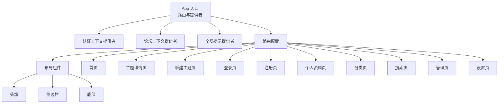
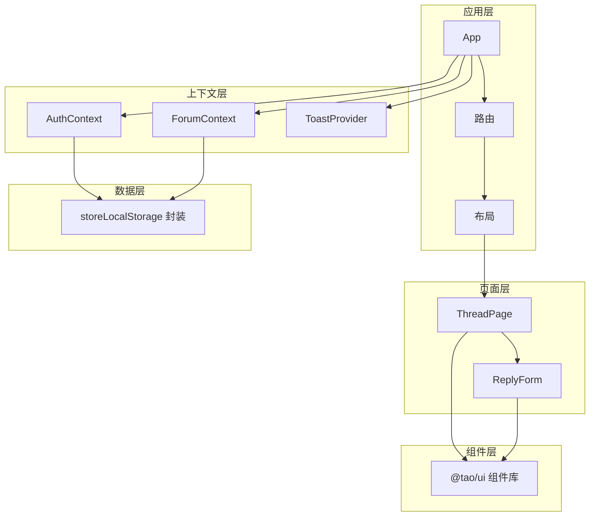
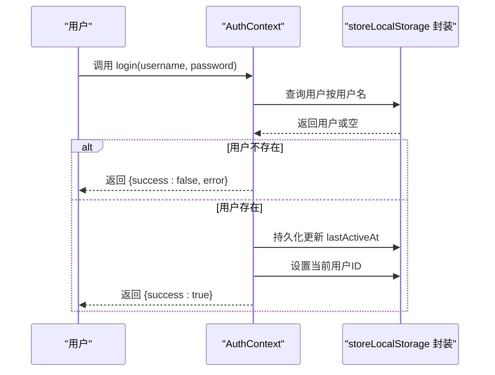
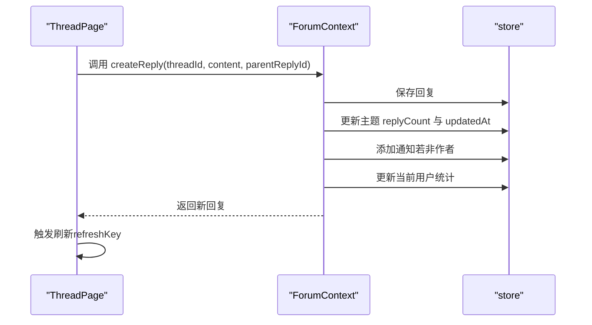
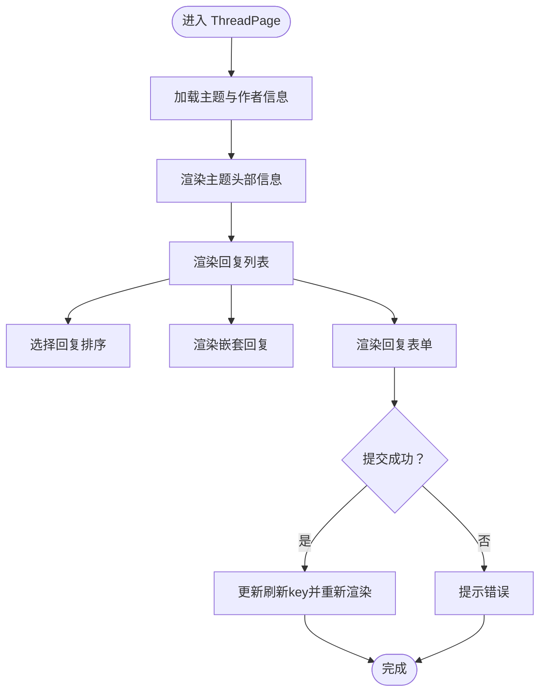
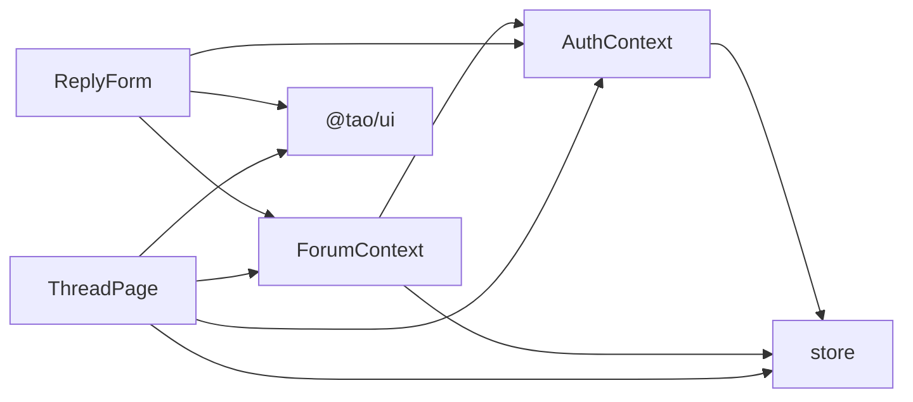

# UI组件库与设计系统

<cite>
**本文档引用的文件**
- [apps/forum/src/App.tsx](file://apps/forum/src/App.tsx)
- [apps/forum/src/index.css](file://apps/forum/src/index.css)
- [apps/forum/src/context/AuthContext.tsx](file://apps/forum/src/context/AuthContext.tsx)
- [apps/forum/src/context/ForumContext.tsx](file://apps/forum/src/context/ForumContext.tsx)
- [apps/forum/src/types/index.ts](file://apps/forum/src/types/index.ts)
- [apps/forum/src/data/store.ts](file://apps/forum/src/data/store.ts)
- [apps/forum/src/pages/ThreadPage.tsx](file://apps/forum/src/pages/ThreadPage.tsx)
- [apps/forum/src/components/reply/ReplyForm.tsx](file://apps/forum/src/components/reply/ReplyForm.tsx)
</cite>

## 目录
1. [简介](#简介)
2. [项目结构](#项目结构)
3. [核心组件](#核心组件)
4. [架构总览](#架构总览)
5. [详细组件分析](#详细组件分析)
6. [依赖关系分析](#依赖关系分析)
7. [性能考虑](#性能考虑)
8. [故障排除指南](#故障排除指南)
9. [结论](#结论)
10. [附录](#附录)

## 简介
本文件为论坛系统的UI组件库与设计系统提供完整文档，涵盖组件架构设计、设计系统规范、组件复用策略、布局设计理念与响应式适配、主题切换机制、通用组件API规范、组件组合模式与状态传递、生命周期管理、设计令牌系统、颜色体系、字体规范、间距标准、组件使用示例与最佳实践、无障碍访问支持、浏览器兼容性以及性能优化策略。

## 项目结构
论坛应用采用分层模块化组织，核心围绕上下文提供者（Context Provider）与页面路由进行组织，组件库通过共享UI包对外提供通用组件与样式能力。整体结构如下：

- 应用入口与路由：应用通过BrowserRouter进行路由配置，并在顶层注入认证、论坛上下文与全局提示提供者。
- 上下文层：提供认证上下文与论坛上下文，封装用户态、权限态、论坛数据与业务方法。
- 页面层：各功能页面按路由组织，如首页、主题详情页、登录注册页等。
- 组件层：页面内组合使用通用UI组件与业务组件，如投票按钮、回复卡片、回复表单等。
- 数据层：本地存储模拟器，提供种子数据与CRUD操作，支撑演示与开发调试。

**图表来源**
- [apps/forum/src/App.tsx:21-46](file://apps/forum/src/App.tsx#L21-L46)

**章节来源**
- [apps/forum/src/App.tsx:1-49](file://apps/forum/src/App.tsx#L1-L49)

## 核心组件
本节梳理UI组件库与设计系统的核心组成，包括上下文提供者、通用UI组件、页面组件与数据层。

- 认证上下文（AuthContext）
  - 职责：管理用户登录、注册、登出、资料更新；持久化当前用户ID；提供认证状态。
  - 关键API：login、register、logout、updateProfile、isAuthenticated、user。
  - 依赖：本地存储模拟器（store）与共享ID生成器。
- 论坛上下文（ForumContext）
  - 职责：管理主题、回复、分类、标签、通知、投票、搜索、管理操作（置顶、锁定、隐藏）。
  - 关键API：createThread、voteThread、getThreadVote、getReplies、createReply、voteReply、markBestAnswer、searchThreads、markNotificationRead、markAllRead、deleteThread、deleteReply、togglePin、toggleLock、hideThread。
  - 依赖：AuthContext、本地存储模拟器（store）、共享ID生成器。
- 通用UI组件
  - 来源：@tao/ui（外部包），提供Button、Badge、Avatar、Textarea、useToast等。
  - 用途：在页面组件中统一风格与交互行为。
- 页面组件
  - 示例：ThreadPage（主题详情页）、ReplyForm（回复表单）等，组合上下文与通用UI组件完成业务功能。
- 数据层（store）
  - 职责：提供种子数据、CRUD操作、搜索、通知管理、当前用户管理。
  - 存储：localStorage封装，键空间隔离。

**章节来源**
- [apps/forum/src/context/AuthContext.tsx:6-92](file://apps/forum/src/context/AuthContext.tsx#L6-L92)
- [apps/forum/src/context/ForumContext.tsx:7-312](file://apps/forum/src/context/ForumContext.tsx#L7-L312)
- [apps/forum/src/data/store.ts:315-398](file://apps/forum/src/data/store.ts#L315-L398)

## 架构总览
论坛系统的架构以“上下文提供者 + 页面路由 + 通用UI组件”为核心，形成清晰的分层与职责分离。认证与论坛状态通过Context在应用树中向下传递，页面组件通过hooks消费状态与动作，通用UI组件提供一致的视觉与交互体验。

**图表来源**
- [apps/forum/src/App.tsx:21-46](file://apps/forum/src/App.tsx#L21-L46)
- [apps/forum/src/context/AuthContext.tsx:17-85](file://apps/forum/src/context/AuthContext.tsx#L17-L85)
- [apps/forum/src/context/ForumContext.tsx:34-305](file://apps/forum/src/context/ForumContext.tsx#L34-L305)
- [apps/forum/src/pages/ThreadPage.tsx:17-271](file://apps/forum/src/pages/ThreadPage.tsx#L17-L271)
- [apps/forum/src/components/reply/ReplyForm.tsx:15-41](file://apps/forum/src/components/reply/ReplyForm.tsx#L15-L41)

## 详细组件分析

### 认证上下文（AuthContext）
- 设计要点
  - 使用React Context与useCallback优化重渲染，避免无谓的Provider包裹导致的全树重渲染。
  - 登录/注册流程中进行唯一性校验与状态持久化，失败时返回错误信息。
  - 用户资料更新通过局部合并与持久化实现。
- 生命周期
  - 初始化：挂载时读取当前用户ID并恢复用户状态。
  - 登录/注册：更新当前用户ID与用户对象。
  - 登出：清除当前用户ID。
- 错误处理
  - 用户不存在、密码错误、用户名/邮箱重复等场景返回明确错误信息。
- 性能
  - 使用useCallback缓存回调函数，减少子组件重渲染。

**图表来源**
- [apps/forum/src/context/AuthContext.tsx:28-37](file://apps/forum/src/context/AuthContext.tsx#L28-L37)
- [apps/forum/src/context/AuthContext.tsx:20-26](file://apps/forum/src/context/AuthContext.tsx#L20-L26)

**章节来源**
- [apps/forum/src/context/AuthContext.tsx:6-92](file://apps/forum/src/context/AuthContext.tsx#L6-L92)

### 论坛上下文（ForumContext）
- 设计要点
  - 将主题、回复、分类、标签、通知等聚合在一个上下文中，便于页面组件统一消费。
  - 投票、最佳答案标记、搜索、管理操作均通过store实现，保持数据一致性。
  - 通知状态与未读数由user驱动，确保登录态切换时状态同步。
- 生命周期
  - 初始化：读取种子数据，建立threads、categories、tags、notifications集合。
  - 动作：createThread、createReply、voteThread/voteReply、markBestAnswer、deleteThread/deleteReply、togglePin/toggleLock/hideThread等。
  - 刷新：通过refreshThreads与内部key更新触发重渲染。
- 错误处理
  - 对不存在的资源（主题/回复）进行防御性判断，避免异常。
- 性能
  - 使用useCallback缓存动作函数，减少子组件重渲染。
  - 通过局部更新（如replyCount、upvotes/downvotes）降低全量刷新成本。

**图表来源**
- [apps/forum/src/context/ForumContext.tsx:122-167](file://apps/forum/src/context/ForumContext.tsx#L122-L167)
- [apps/forum/src/context/ForumContext.tsx:42-48](file://apps/forum/src/context/ForumContext.tsx#L42-L48)

**章节来源**
- [apps/forum/src/context/ForumContext.tsx:7-312](file://apps/forum/src/context/ForumContext.tsx#L7-L312)

### 主题详情页（ThreadPage）
- 设计要点
  - 展示主题标题、作者、分类、标签、内容、统计信息与操作菜单。
  - 支持回复排序（按票数、最新、最早），嵌套回复展示与内联回复表单。
  - 管理员/版主可见管理操作（置顶、锁定、隐藏、删除）。
- 组件组合
  - 使用@tao/ui的Button、Badge、Avatar等组件。
  - 组合VoteButton、ReplyCard、ReplyForm等业务组件。
- 状态传递
  - 通过ForumContext与AuthContext获取数据与动作，通过local state控制排序、回复目标、菜单显示与刷新key。
- 生命周期
  - 加载时根据URL参数获取主题与作者信息，初始化回复列表与排序。
  - 提交回复后通过refreshKey触发局部刷新。

**图表来源**
- [apps/forum/src/pages/ThreadPage.tsx:17-271](file://apps/forum/src/pages/ThreadPage.tsx#L17-L271)

**章节来源**
- [apps/forum/src/pages/ThreadPage.tsx:17-271](file://apps/forum/src/pages/ThreadPage.tsx#L17-L271)

### 回复表单（ReplyForm）
- 设计要点
  - 未登录用户引导至登录页；已登录用户可提交回复。
  - 支持父级回复（嵌套回复）与提交回调。
  - 表单校验与错误提示通过useToast统一处理。
- 组件组合
  - 使用@tao/ui的Button、Textarea、useToast。
  - 通过ForumContext.createReply执行业务动作。
- 状态传递
  - 通过props接收threadId、parentReplyId、onSubmitted、placeholder。
  - 通过AuthContext.isAuthenticated控制渲染分支。
- 生命周期
  - 初始化：清空内容与提交状态。
  - 提交：防抖提交标志，成功后调用onSubmitted并重置表单。

**章节来源**
- [apps/forum/src/components/reply/ReplyForm.tsx:15-41](file://apps/forum/src/components/reply/ReplyForm.tsx#L15-L41)

## 依赖关系分析
- 组件依赖
  - ThreadPage依赖ForumContext、AuthContext、store与@tao/ui组件。
  - ReplyForm依赖AuthContext、ForumContext与@tao/ui组件。
- 上下文依赖
  - ForumContext依赖AuthContext与store。
  - AuthContext依赖store与共享ID生成器。
- 数据依赖
  - store封装localStorage，提供CRUD、搜索、通知、当前用户管理。

**图表来源**
- [apps/forum/src/pages/ThreadPage.tsx:17-271](file://apps/forum/src/pages/ThreadPage.tsx#L17-L271)
- [apps/forum/src/components/reply/ReplyForm.tsx:15-41](file://apps/forum/src/components/reply/ReplyForm.tsx#L15-L41)
- [apps/forum/src/context/ForumContext.tsx:34-305](file://apps/forum/src/context/ForumContext.tsx#L34-L305)
- [apps/forum/src/context/AuthContext.tsx:17-85](file://apps/forum/src/context/AuthContext.tsx#L17-L85)

**章节来源**
- [apps/forum/src/context/ForumContext.tsx:34-305](file://apps/forum/src/context/ForumContext.tsx#L34-L305)
- [apps/forum/src/context/AuthContext.tsx:17-85](file://apps/forum/src/context/AuthContext.tsx#L17-L85)
- [apps/forum/src/data/store.ts:315-398](file://apps/forum/src/data/store.ts#L315-L398)

## 性能考虑
- 渲染优化
  - 使用useCallback缓存上下文动作与回调，减少子组件重渲染。
  - 通过局部状态（如replySortBy、replyToId、refreshKey）控制最小范围重渲染。
- 数据访问
  - store提供批量查询与过滤，避免在渲染路径中进行复杂计算。
- 存储策略
  - 本地存储封装统一键空间，避免命名冲突；演示场景每次初始化重置，确保数据一致性。
- 组件复用
  - 通过@tao/ui组件库统一风格与交互，减少自定义组件开销。

## 故障排除指南
- 登录失败
  - 现象：登录返回错误信息。
  - 排查：确认用户名是否存在、密码是否匹配；检查store中用户数据。
  - 参考：[apps/forum/src/context/AuthContext.tsx:28-37](file://apps/forum/src/context/AuthContext.tsx#L28-L37)
- 注册失败
  - 现象：注册返回错误信息（用户名/邮箱已存在）。
  - 排查：检查store中用户名与邮箱唯一性约束。
  - 参考：[apps/forum/src/context/AuthContext.tsx:39-67](file://apps/forum/src/context/AuthContext.tsx#L39-L67)
- 回复提交失败
  - 现象：表单提示错误或无响应。
  - 排查：确认已登录、内容非空、ForumContext.createReply返回值；查看useToast提示。
  - 参考：[apps/forum/src/components/reply/ReplyForm.tsx:34-41](file://apps/forum/src/components/reply/ReplyForm.tsx#L34-L41)
- 通知未显示
  - 现象：未读通知数量不更新。
  - 排查：确认用户登录态、ForumContext订阅通知；检查store.markNotificationRead/markAllNotificationsRead。
  - 参考：[apps/forum/src/context/ForumContext.tsx:247-256](file://apps/forum/src/context/ForumContext.tsx#L247-L256)

**章节来源**
- [apps/forum/src/context/AuthContext.tsx:28-67](file://apps/forum/src/context/AuthContext.tsx#L28-L67)
- [apps/forum/src/components/reply/ReplyForm.tsx:34-41](file://apps/forum/src/components/reply/ReplyForm.tsx#L34-L41)
- [apps/forum/src/context/ForumContext.tsx:247-256](file://apps/forum/src/context/ForumContext.tsx#L247-L256)

## 结论
本设计系统以上下文提供者为核心，结合通用UI组件库与本地存储模拟器，实现了认证、论坛数据管理与页面功能的解耦与复用。通过明确的API规范、状态传递与生命周期管理，确保组件组合灵活、扩展性强。设计令牌系统与Tailwind类名统一了视觉与交互体验，为后续主题切换与响应式适配奠定了基础。

## 附录

### 设计系统规范与令牌
- 颜色体系
  - 基础色板：背景、前景、卡片、弹出层、输入框、边框、环形光晕等。
  - 主色：活力紫色；辅色：柔和暗表面；强调色：成功绿色、警告黄色；破坏性：危险红色。
  - 投票色：点赞绿色、踩红；声望金：金色。
  - 表面层级：surface、surface-hover、surface-active。
- 渐变与阴影
  - 渐变：主渐变、柔和渐变、卡片渐变、英雄渐变。
  - 阴影：发光阴影、优雅阴影、卡片阴影、悬停阴影。
- 过渡动画
  - 快速过渡、平滑过渡、弹簧过渡。
- 字体与排版
  - 字体：Inter；特征设置：字符变体。
- 间距与网格
  - 圆角半径：0.625rem；滚动条自定义；玻璃拟态效果；闪烁加载效果。

**章节来源**
- [apps/forum/src/index.css:7-184](file://apps/forum/src/index.css#L7-L184)

### 组件API规范（示例）
- ReplyForm
  - 属性
    - threadId: string（必填）
    - parentReplyId?: string | null（可选）
    - onSubmitted?: () => void（可选）
    - placeholder?: string（可选）
  - 事件
    - 提交成功：触发onSubmitted回调
  - 样式
    - 使用@tao/ui的Button、Textarea尺寸与变体
    - 未登录时显示登录引导区域

**章节来源**
- [apps/forum/src/components/reply/ReplyForm.tsx:8-13](file://apps/forum/src/components/reply/ReplyForm.tsx#L8-L13)

### 组件使用示例与最佳实践
- 在页面中组合使用
  - 在ThreadPage中组合ReplyForm与ReplyCard，通过ForumContext与AuthContext传递状态与动作。
  - 使用Button、Badge、Avatar等通用组件保持视觉一致性。
- 最佳实践
  - 使用useCallback缓存动作函数，减少重渲染。
  - 通过局部状态控制UI细节（排序、菜单、回复目标）。
  - 使用Toast统一处理错误与成功提示。
  - 为敏感操作添加二次确认与权限校验。

**章节来源**
- [apps/forum/src/pages/ThreadPage.tsx:17-271](file://apps/forum/src/pages/ThreadPage.tsx#L17-L271)
- [apps/forum/src/components/reply/ReplyForm.tsx:15-41](file://apps/forum/src/components/reply/ReplyForm.tsx#L15-L41)

### 无障碍访问支持与浏览器兼容性
- 无障碍访问
  - 使用语义化HTML与可访问的交互（如按钮、链接、表单控件）。
  - 提供键盘导航与焦点管理（如回车提交、Tab切换）。
  - 使用Toast提供可读的反馈信息。
- 浏览器兼容性
  - Tailwind基础层与现代浏览器兼容；渐变、阴影、backdrop-filter等特性需关注旧版浏览器支持情况。
  - 建议在生产环境中添加必要的polyfill与降级方案。

### 主题切换机制（概念性说明）
- 当前实现
  - 使用CSS变量与Tailwind类名实现浅色/深色主题的基础切换。
- 扩展建议
  - 引入主题提供者，动态切换根节点CSS变量。
  - 通过Tailwind的暗色模式配置与CSS变量映射，实现一键切换。
  - 为图标、渐变、阴影等元素提供多套预设，确保在不同主题下可读性与对比度。