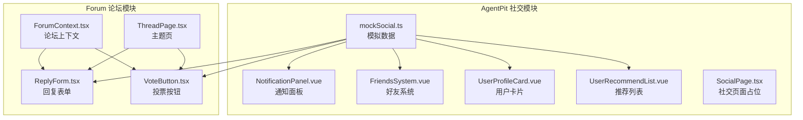
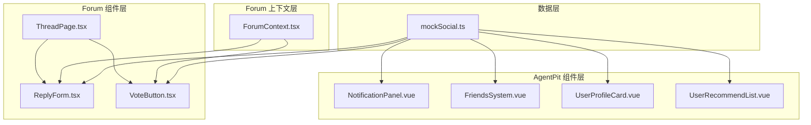
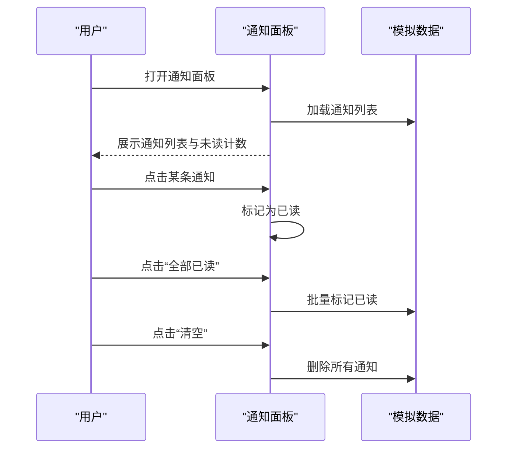
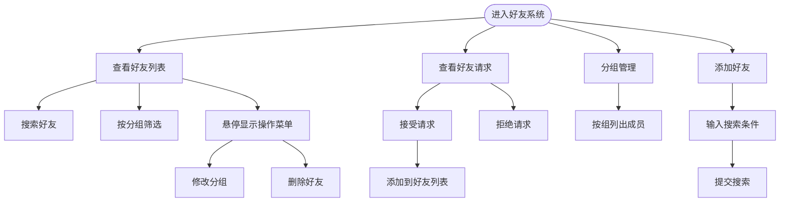
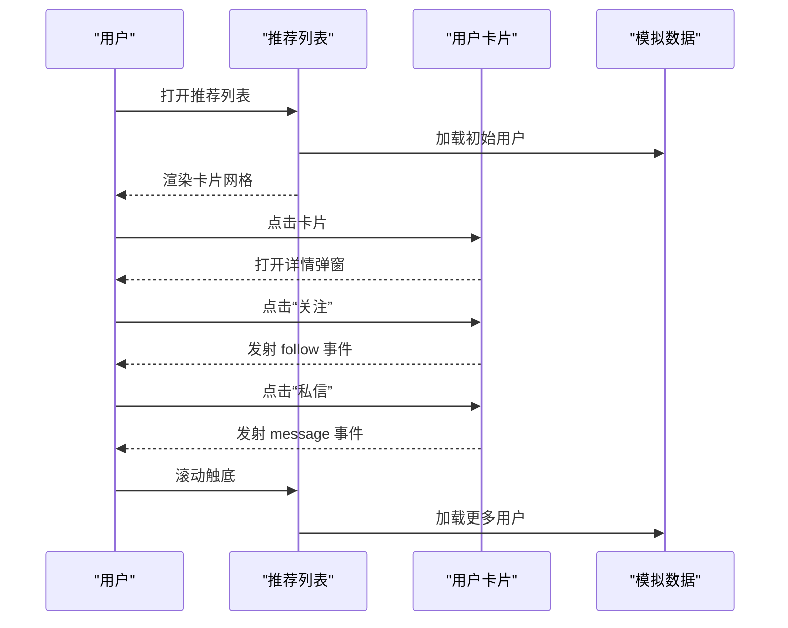
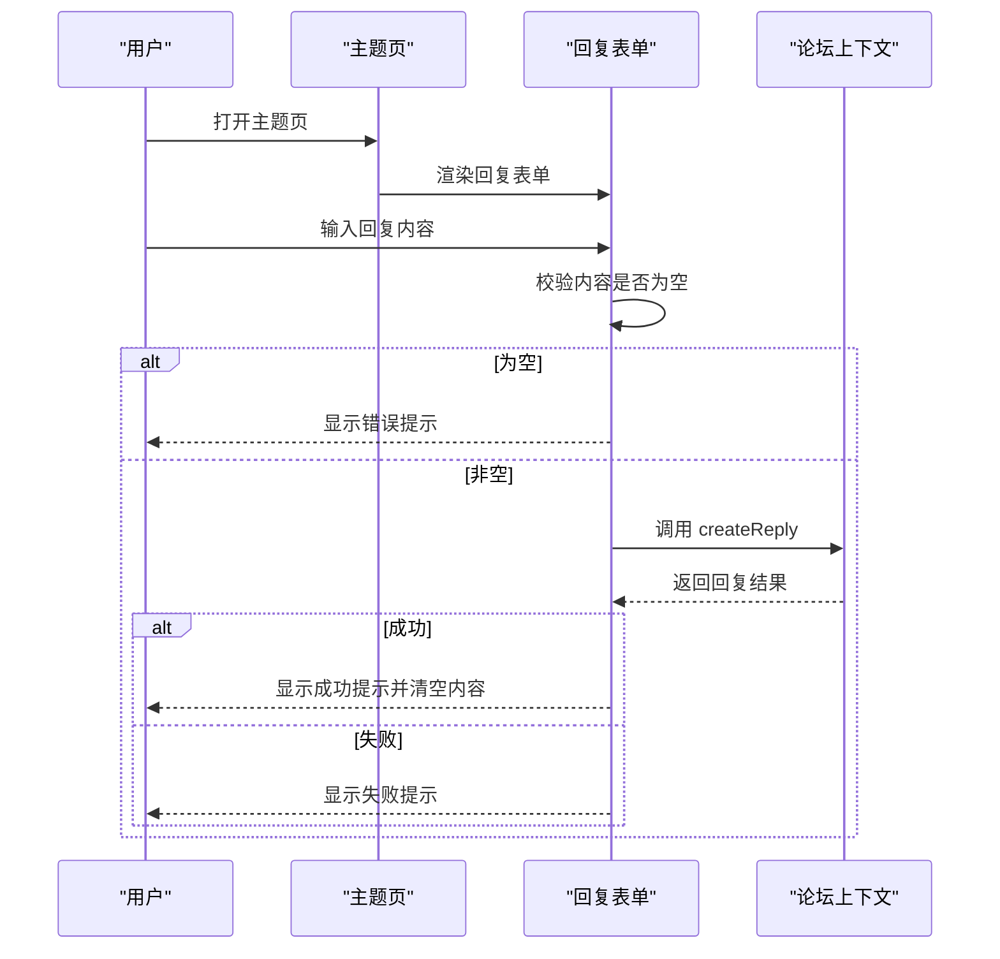
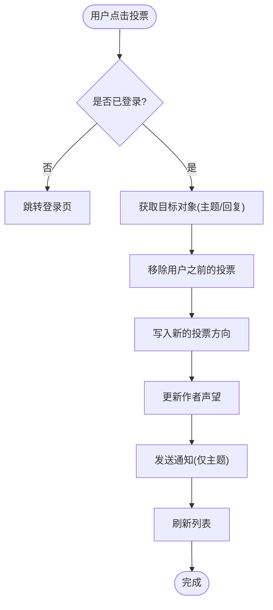
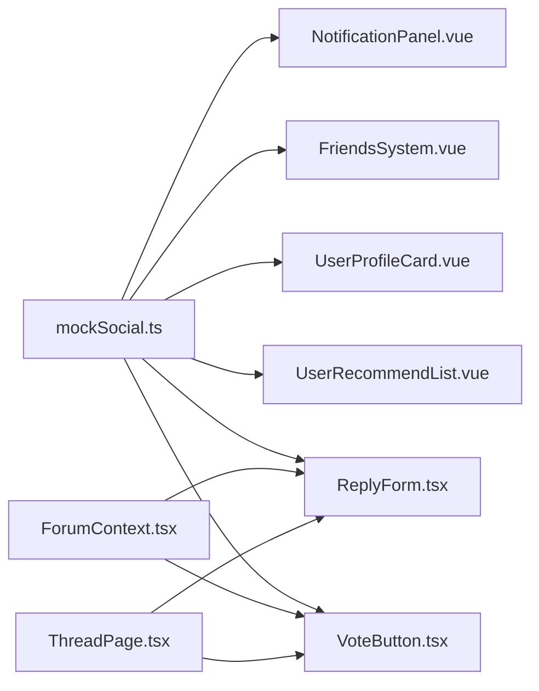

# 互动功能与社交系统

<cite>
**本文档引用的文件**
- [mockSocial.ts](file://apps/AgentPit/src/data/mockSocial.ts)
- [NotificationPanel.vue](file://apps/AgentPit/src/components/social/NotificationPanel.vue)
- [FriendsSystem.vue](file://apps/AgentPit/src/components/social/FriendsSystem.vue)
- [UserProfileCard.vue](file://apps/AgentPit/src/components/social/UserProfileCard.vue)
- [UserRecommendList.vue](file://apps/AgentPit/src/components/social/UserRecommendList.vue)
- [ReplyForm.tsx](file://apps/forum/src/components/reply/ReplyForm.tsx)
- [VoteButton.tsx](file://apps/forum/src/components/thread/VoteButton.tsx)
- [ThreadPage.tsx](file://apps/forum/src/pages/ThreadPage.tsx)
- [ForumContext.tsx](file://apps/forum/src/context/ForumContext.tsx)
- [SocialPage.tsx](file://apps/AgentPit/src-react-backup-20260410/pages/SocialPage.tsx)
- [spec.md](file://apps/AgentPit/.trae/specs/implement-social-connection-system/spec.md)
</cite>

## 目录
1. [引言](#引言)
2. [项目结构](#项目结构)
3. [核心组件](#核心组件)
4. [架构概览](#架构概览)
5. [详细组件分析](#详细组件分析)
6. [依赖分析](#依赖分析)
7. [性能考虑](#性能考虑)
8. [故障排除指南](#故障排除指南)
9. [结论](#结论)
10. [附录](#附录)

## 引言
本文件面向互动功能与社交系统，全面梳理并文档化以下能力：
- 用户互动机制：回复系统、点赞投票、收藏分享功能
- 回复表单设计：实时预览、内容验证、权限控制
- 投票系统算法：评分计算、防刷策略、结果展示
- 通知系统：工作原理、消息推送、提醒机制
- 社交关系：关注系统、私信功能、社交关系管理
- 组件API：属性配置、事件处理、样式定制
- 实时通信与状态更新：策略与用户体验优化

本系统在两个子应用中体现：
- AgentPit 社交模块：好友管理、通知面板、用户卡片与推荐列表
- Forum 论坛模块：回复表单、投票按钮、主题页集成

## 项目结构
社交与互动功能主要分布在以下路径：
- AgentPit 社交模块：数据模拟、通知面板、好友系统、用户卡片与推荐列表
- Forum 论坛模块：回复表单、投票按钮、主题页与上下文

**图表来源**
- [mockSocial.ts:1-375](file://apps/AgentPit/src/data/mockSocial.ts#L1-L375)
- [NotificationPanel.vue:1-312](file://apps/AgentPit/src/components/social/NotificationPanel.vue#L1-L312)
- [FriendsSystem.vue:1-476](file://apps/AgentPit/src/components/social/FriendsSystem.vue#L1-L476)
- [UserProfileCard.vue:1-284](file://apps/AgentPit/src/components/social/UserProfileCard.vue#L1-L284)
- [UserRecommendList.vue:1-164](file://apps/AgentPit/src/components/social/UserRecommendList.vue#L1-L164)
- [ReplyForm.tsx:1-69](file://apps/forum/src/components/reply/ReplyForm.tsx#L1-L69)
- [VoteButton.tsx:1-60](file://apps/forum/src/components/thread/VoteButton.tsx#L1-L60)
- [ThreadPage.tsx:1-30](file://apps/forum/src/pages/ThreadPage.tsx#L1-L30)
- [ForumContext.tsx:66-222](file://apps/forum/src/context/ForumContext.tsx#L66-L222)

**章节来源**
- [mockSocial.ts:1-375](file://apps/AgentPit/src/data/mockSocial.ts#L1-L375)
- [spec.md:17-56](file://apps/AgentPit/.trae/specs/implement-social-connection-system/spec.md#L17-L56)

## 核心组件
本节概述各核心组件职责与交互关系。

- 模拟数据层（AgentPit）
  - 提供用户、帖子、好友、好友请求、通知、会议室等模拟数据，支撑社交功能演示与测试。
  - 数据类型定义与场景完整性由规格文档约束。

- 通知面板（AgentPit）
  - 展示系统/互动/消息类通知，支持筛选、标记已读、批量清理、时间格式化与动画过渡。

- 好友系统（AgentPit）
  - 好友列表、分组管理、请求处理、在线状态与搜索过滤；支持接受/拒绝请求、删除好友、分组变更。

- 用户卡片与推荐列表（AgentPit）
  - 用户卡片展示头像、在线状态、简介、兴趣标签、关注/粉丝/共同好友统计与关注/私信操作；
  - 推荐列表支持懒加载、滚动触底加载、过渡动画与占位提示。

- 回复表单（Forum）
  - 登录态校验、内容必填校验、提交状态控制、成功/失败提示与提交后回调。

- 投票按钮（Forum）
  - 支持赞同/反对/取消投票，根据当前投票状态高亮显示，响应式尺寸与水平布局。

**章节来源**
- [mockSocial.ts:1-375](file://apps/AgentPit/src/data/mockSocial.ts#L1-L375)
- [NotificationPanel.vue:1-312](file://apps/AgentPit/src/components/social/NotificationPanel.vue#L1-L312)
- [FriendsSystem.vue:1-476](file://apps/AgentPit/src/components/social/FriendsSystem.vue#L1-L476)
- [UserProfileCard.vue:1-284](file://apps/AgentPit/src/components/social/UserProfileCard.vue#L1-L284)
- [UserRecommendList.vue:1-164](file://apps/AgentPit/src/components/social/UserRecommendList.vue#L1-L164)
- [ReplyForm.tsx:1-69](file://apps/forum/src/components/reply/ReplyForm.tsx#L1-L69)
- [VoteButton.tsx:1-60](file://apps/forum/src/components/thread/VoteButton.tsx#L1-L60)

## 架构概览
社交与互动系统采用“模拟数据 + 组件化 UI + 上下文服务”的分层架构：
- 模拟数据层：集中管理用户、社交关系、通知与投票等数据结构
- 组件层：以Vue/React组件封装UI与交互逻辑
- 上下文层：论坛模块通过上下文暴露投票、回复、通知等业务方法
- 页面层：社交页面与主题页作为容器承载组件

**图表来源**
- [mockSocial.ts:1-375](file://apps/AgentPit/src/data/mockSocial.ts#L1-L375)
- [NotificationPanel.vue:1-312](file://apps/AgentPit/src/components/social/NotificationPanel.vue#L1-L312)
- [FriendsSystem.vue:1-476](file://apps/AgentPit/src/components/social/FriendsSystem.vue#L1-L476)
- [UserProfileCard.vue:1-284](file://apps/AgentPit/src/components/social/UserProfileCard.vue#L1-L284)
- [UserRecommendList.vue:1-164](file://apps/AgentPit/src/components/social/UserRecommendList.vue#L1-L164)
- [ReplyForm.tsx:1-69](file://apps/forum/src/components/reply/ReplyForm.tsx#L1-L69)
- [VoteButton.tsx:1-60](file://apps/forum/src/components/thread/VoteButton.tsx#L1-L60)
- [ThreadPage.tsx:1-30](file://apps/forum/src/pages/ThreadPage.tsx#L1-L30)
- [ForumContext.tsx:66-222](file://apps/forum/src/context/ForumContext.tsx#L66-L222)

## 详细组件分析

### 通知系统（AgentPit）
- 功能要点
  - 类型筛选：系统/互动/消息三类通知，支持“全部”与“按类型”筛选
  - 未读计数：基于状态计算，提供“全部已读”与“清空”操作
  - 时间格式化：支持“刚刚/分钟前/小时前/天前/日期”人性化显示
  - 交互行为：点击通知标记已读，支持删除单条通知
  - 视觉反馈：未读红点、颜色分类、过渡动画

**图表来源**
- [NotificationPanel.vue:1-312](file://apps/AgentPit/src/components/social/NotificationPanel.vue#L1-L312)
- [mockSocial.ts:279-334](file://apps/AgentPit/src/data/mockSocial.ts#L279-L334)

**章节来源**
- [NotificationPanel.vue:1-312](file://apps/AgentPit/src/components/social/NotificationPanel.vue#L1-L312)
- [mockSocial.ts:279-334](file://apps/AgentPit/src/data/mockSocial.ts#L279-L334)

### 好友系统（AgentPit）
- 功能要点
  - 好友列表：支持搜索、分组筛选（全部/家人/同事/其他）、在线状态与操作菜单
  - 好友请求：接受/拒绝流程，状态变更同步到好友列表
  - 分组管理：按组查看成员，统计每组人数
  - 添加好友：弹窗输入搜索条件，占位实现（后续可接入真实接口）

**图表来源**
- [FriendsSystem.vue:1-476](file://apps/AgentPit/src/components/social/FriendsSystem.vue#L1-L476)
- [mockSocial.ts:182-277](file://apps/AgentPit/src/data/mockSocial.ts#L182-L277)

**章节来源**
- [FriendsSystem.vue:1-476](file://apps/AgentPit/src/components/social/FriendsSystem.vue#L1-L476)
- [mockSocial.ts:182-277](file://apps/AgentPit/src/data/mockSocial.ts#L182-L277)

### 用户卡片与推荐列表（AgentPit）
- 用户卡片
  - 展示头像、在线状态、位置、简介、兴趣标签、关注/粉丝/共同好友统计
  - 提供关注/私信事件发射，支持详情弹窗
- 推荐列表
  - 初始加载固定数量，滚动触底加载更多
  - 过渡动画、加载状态、空状态提示

**图表来源**
- [UserRecommendList.vue:1-164](file://apps/AgentPit/src/components/social/UserRecommendList.vue#L1-L164)
- [UserProfileCard.vue:1-284](file://apps/AgentPit/src/components/social/UserProfileCard.vue#L1-L284)
- [mockSocial.ts:10-107](file://apps/AgentPit/src/data/mockSocial.ts#L10-L107)

**章节来源**
- [UserRecommendList.vue:1-164](file://apps/AgentPit/src/components/social/UserRecommendList.vue#L1-L164)
- [UserProfileCard.vue:1-284](file://apps/AgentPit/src/components/social/UserProfileCard.vue#L1-L284)
- [mockSocial.ts:10-107](file://apps/AgentPit/src/data/mockSocial.ts#L10-L107)

### 回复系统（Forum）
- 回复表单
  - 登录态检查：未登录引导至登录页
  - 内容验证：必填校验，空内容提示
  - 提交流程：禁用提交按钮防止重复提交，成功后清空内容并触发回调
- 主题页集成
  - 从路由参数获取主题ID，注入回复排序、回复嵌套、菜单开关与刷新键

**图表来源**
- [ReplyForm.tsx:1-69](file://apps/forum/src/components/reply/ReplyForm.tsx#L1-L69)
- [ThreadPage.tsx:1-30](file://apps/forum/src/pages/ThreadPage.tsx#L1-L30)
- [ForumContext.tsx:66-222](file://apps/forum/src/context/ForumContext.tsx#L66-L222)

**章节来源**
- [ReplyForm.tsx:1-69](file://apps/forum/src/components/reply/ReplyForm.tsx#L1-L69)
- [ThreadPage.tsx:1-30](file://apps/forum/src/pages/ThreadPage.tsx#L1-L30)
- [ForumContext.tsx:66-222](file://apps/forum/src/context/ForumContext.tsx#L66-L222)

### 投票系统（Forum）
- 投票按钮
  - 支持赞同/反对/取消投票，根据当前投票状态高亮
  - 响应式尺寸与水平布局适配移动端
- 投票逻辑（上下文）
  - 去重：移除用户之前对该主题/回复的投票
  - 更新：写入新的投票方向
  - 作者收益：根据投票方向调整作者声望值
  - 通知：对主题作者发送回复通知
  - 统计：刷新主题/回复列表

**图表来源**
- [VoteButton.tsx:1-60](file://apps/forum/src/components/thread/VoteButton.tsx#L1-L60)
- [ForumContext.tsx:84-107](file://apps/forum/src/context/ForumContext.tsx#L84-L107)
- [ForumContext.tsx:169-190](file://apps/forum/src/context/ForumContext.tsx#L169-L190)

**章节来源**
- [VoteButton.tsx:1-60](file://apps/forum/src/components/thread/VoteButton.tsx#L1-L60)
- [ForumContext.tsx:84-107](file://apps/forum/src/context/ForumContext.tsx#L84-L107)
- [ForumContext.tsx:169-190](file://apps/forum/src/context/ForumContext.tsx#L169-L190)

### 社交页面（AgentPit）
- 占位页面：展示社交模块入口与概览信息（好友、群组、视频通话），用于早期导航与布局验证

**章节来源**
- [SocialPage.tsx:1-77](file://apps/AgentPit/src-react-backup-20260410/pages/SocialPage.tsx#L1-L77)

## 依赖分析
- 组件间耦合
  - AgentPit 社交组件依赖模拟数据层（mockSocial.ts）提供基础数据
  - Forum 的回复与投票组件依赖论坛上下文（ForumContext.tsx）进行业务操作
- 外部依赖
  - UI 组件库：@tao/ui（按钮、输入框、Toast 等）
  - 图标库：lucide-react
  - 路由：react-router-dom
  - 状态：Vue 响应式系统（ref/computed/provide/inject）

**图表来源**
- [mockSocial.ts:1-375](file://apps/AgentPit/src/data/mockSocial.ts#L1-L375)
- [NotificationPanel.vue:1-312](file://apps/AgentPit/src/components/social/NotificationPanel.vue#L1-L312)
- [FriendsSystem.vue:1-476](file://apps/AgentPit/src/components/social/FriendsSystem.vue#L1-L476)
- [UserProfileCard.vue:1-284](file://apps/AgentPit/src/components/social/UserProfileCard.vue#L1-L284)
- [UserRecommendList.vue:1-164](file://apps/AgentPit/src/components/social/UserRecommendList.vue#L1-L164)
- [ReplyForm.tsx:1-69](file://apps/forum/src/components/reply/ReplyForm.tsx#L1-L69)
- [VoteButton.tsx:1-60](file://apps/forum/src/components/thread/VoteButton.tsx#L1-L60)
- [ForumContext.tsx:66-222](file://apps/forum/src/context/ForumContext.tsx#L66-L222)
- [ThreadPage.tsx:1-30](file://apps/forum/src/pages/ThreadPage.tsx#L1-L30)

**章节来源**
- [mockSocial.ts:1-375](file://apps/AgentPit/src/data/mockSocial.ts#L1-L375)
- [ForumContext.tsx:66-222](file://apps/forum/src/context/ForumContext.tsx#L66-L222)

## 性能考虑
- 懒加载与虚拟滚动
  - 推荐列表采用滚动触底加载，减少一次性渲染压力
- 状态最小化
  - 通知面板与好友系统使用计算属性与本地状态，避免不必要的重渲染
- 动画与过渡
  - 使用过渡动画提升交互体验，但需注意复杂动画对低端设备的影响
- 数据缓存
  - 模拟数据在组件内缓存，避免重复加载；实际生产环境建议引入持久化存储或缓存层

[本节为通用指导，无需特定文件引用]

## 故障排除指南
- 通知面板类型枚举错误
  - 现象：类型断言错误，提示数字无法索引到 Number 类型
  - 原因：过滤类型与枚举不一致
  - 解决：确保 filterType 与枚举类型一致，避免隐式 any
- 好友系统分组类型错误
  - 现象：分组类型转换错误
  - 原因：HTMLSelectElement 值与类型不匹配
  - 解决：显式转换为正确的分组类型

**章节来源**
- [NotificationPanel.vue:1-312](file://apps/AgentPit/src/components/social/NotificationPanel.vue#L1-L312)
- [FriendsSystem.vue:1-476](file://apps/AgentPit/src/components/social/FriendsSystem.vue#L1-L476)

## 结论
本社交与互动系统通过清晰的数据层、组件层与上下文层划分，实现了通知、好友、用户卡片、回复与投票等核心功能。系统具备良好的扩展性与可维护性，后续可在以下方面持续优化：
- 完善好友添加与私信功能，接入真实后端接口
- 增强投票防刷策略（频率限制、IP/设备绑定、CAPTCHA）
- 丰富通知类型与推送渠道（站内、邮件、短信）
- 优化推荐算法与社交关系图谱

[本节为总结性内容，无需特定文件引用]

## 附录

### 组件 API 文档

- 通知面板（AgentPit）
  - 属性：无
  - 事件：无
  - 插槽：无
  - 外部暴露：unreadCount、markAllAsRead
  - 样式：支持深色模式，提供自定义滚动条与过渡动画

- 好友系统（AgentPit）
  - 属性：无
  - 事件：无
  - 插槽：无
  - 外部暴露：无
  - 样式：支持分组标签、在线状态点、操作菜单透明度过渡

- 用户卡片（AgentPit）
  - 属性：user（SocialProfile）
  - 事件：follow(userId)、message(userId)
  - 插槽：无
  - 外部暴露：无
  - 样式：详情弹窗、渐变背景、标签云、网格布局

- 推荐列表（AgentPit）
  - 属性：无
  - 事件：无
  - 插槽：无
  - 外部暴露：无
  - 样式：网格布局、滚动条、过渡动画、加载指示器

- 回复表单（Forum）
  - 属性：threadId（string）、parentReplyId（string|null，可选）、onSubmitted（回调，可选）、placeholder（字符串，可选）
  - 事件：无
  - 插槽：无
  - 外部暴露：无
  - 样式：渐变按钮、图标、禁用态

- 投票按钮（Forum）
  - 属性：score（number）、currentVote（'up' | 'down' | null）、onVote（函数）、size（'sm' | 'md'，可选）、horizontal（布尔，可选）
  - 事件：无
  - 插槽：无
  - 外部暴露：无
  - 样式：高亮状态、动画效果、响应式尺寸

**章节来源**
- [NotificationPanel.vue:1-312](file://apps/AgentPit/src/components/social/NotificationPanel.vue#L1-L312)
- [FriendsSystem.vue:1-476](file://apps/AgentPit/src/components/social/FriendsSystem.vue#L1-L476)
- [UserProfileCard.vue:1-284](file://apps/AgentPit/src/components/social/UserProfileCard.vue#L1-L284)
- [UserRecommendList.vue:1-164](file://apps/AgentPit/src/components/social/UserRecommendList.vue#L1-L164)
- [ReplyForm.tsx:1-69](file://apps/forum/src/components/reply/ReplyForm.tsx#L1-L69)
- [VoteButton.tsx:1-60](file://apps/forum/src/components/thread/VoteButton.tsx#L1-L60)