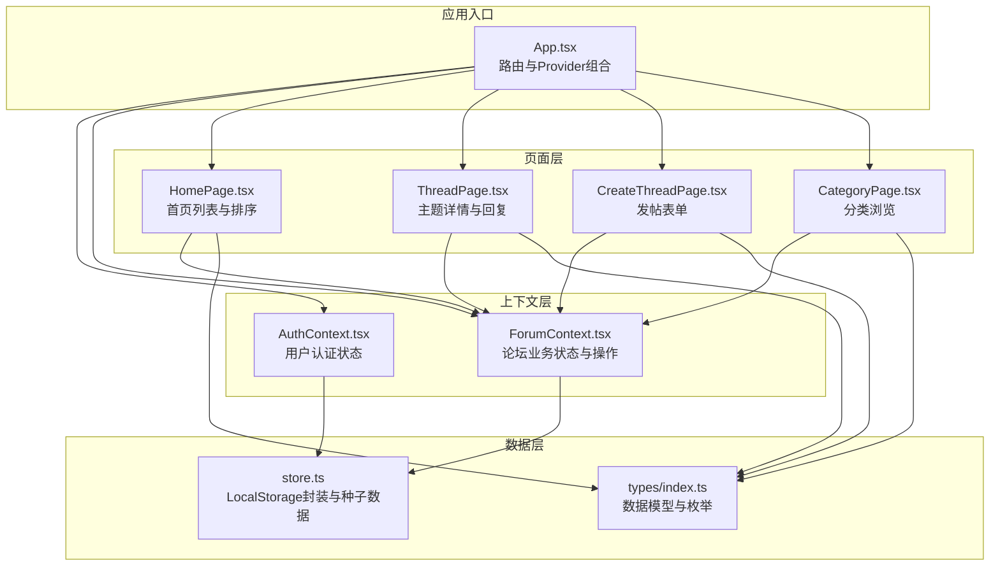
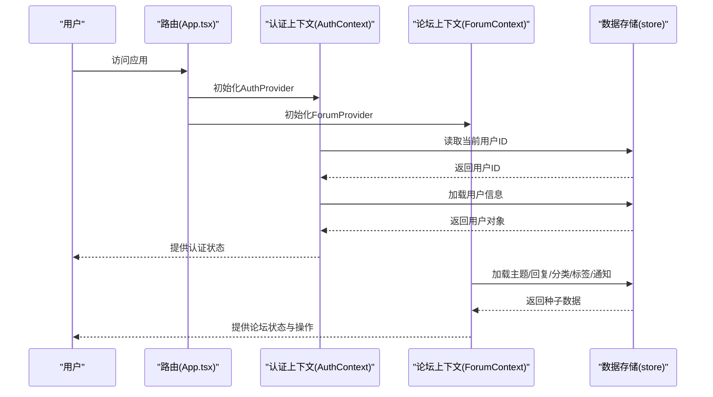
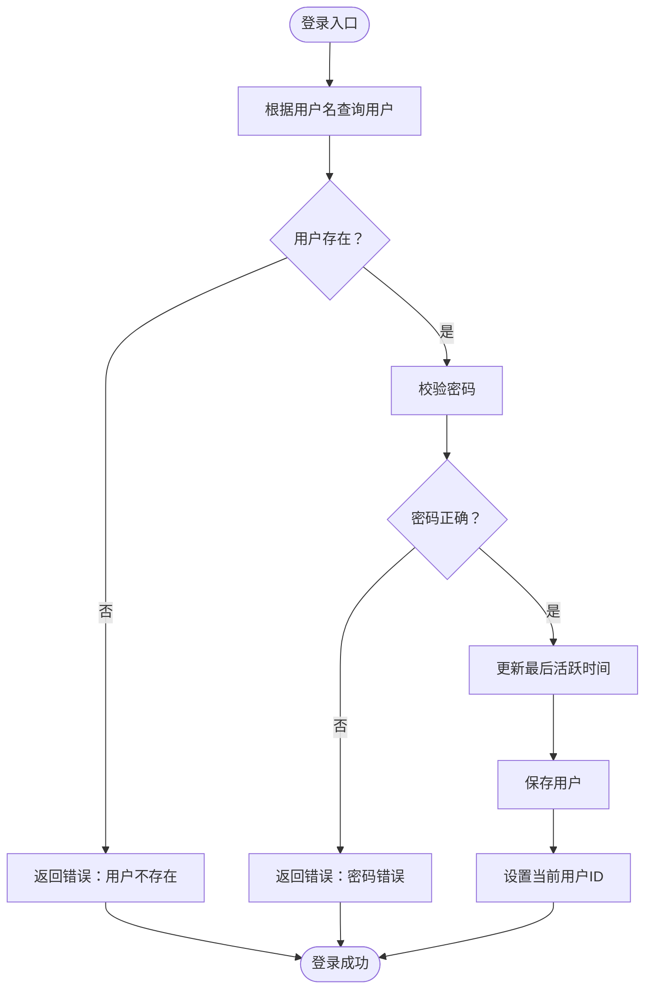
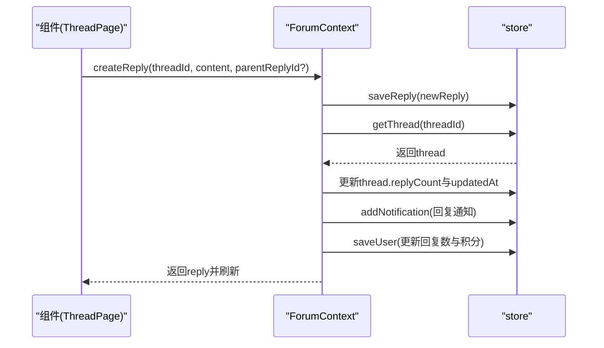
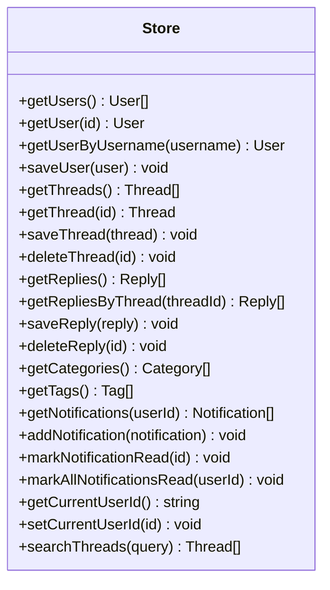
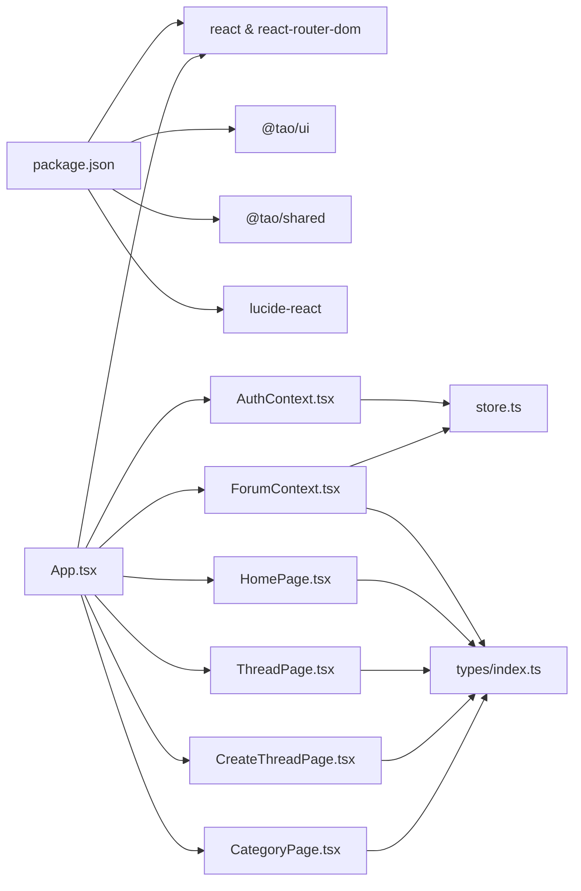
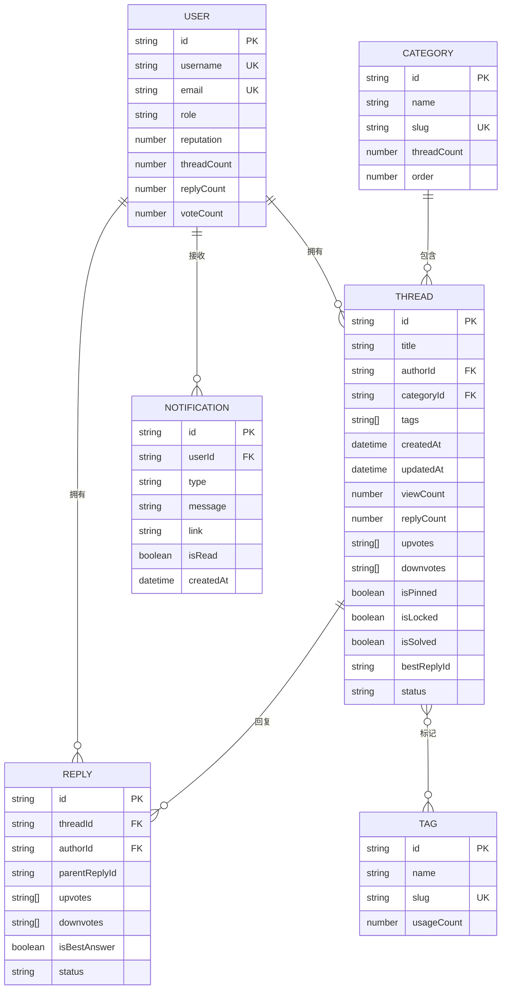
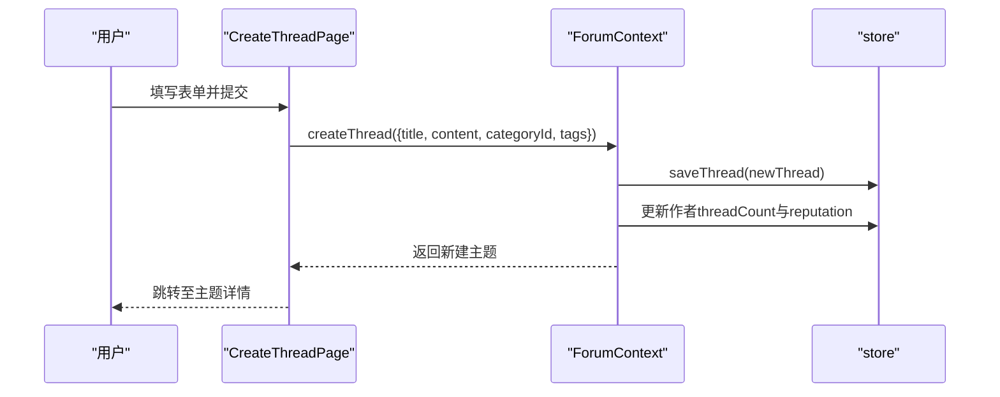

# 内容管理与分类系统

<cite>
**本文档引用的文件**
- [package.json](file://apps/forum/package.json)
- [App.tsx](file://apps/forum/src/App.tsx)
- [AuthContext.tsx](file://apps/forum/src/context/AuthContext.tsx)
- [ForumContext.tsx](file://apps/forum/src/context/ForumContext.tsx)
- [store.ts](file://apps/forum/src/data/store.ts)
- [index.ts](file://apps/forum/src/types/index.ts)
- [HomePage.tsx](file://apps/forum/src/pages/HomePage.tsx)
- [ThreadPage.tsx](file://apps/forum/src/pages/ThreadPage.tsx)
- [CreateThreadPage.tsx](file://apps/forum/src/pages/CreateThreadPage.tsx)
- [CategoryPage.tsx](file://apps/forum/src/pages/CategoryPage.tsx)
</cite>

## 目录
1. [简介](#简介)
2. [项目结构](#项目结构)
3. [核心组件](#核心组件)
4. [架构总览](#架构总览)
5. [详细组件分析](#详细组件分析)
6. [依赖分析](#依赖分析)
7. [性能考虑](#性能考虑)
8. [故障排除指南](#故障排除指南)
9. [结论](#结论)
10. [附录](#附录)

## 简介
本文件为内容管理与分类系统（论坛）的综合技术文档，覆盖主题分类、帖子管理、内容审核机制、上下文状态管理模式、数据获取与更新策略、帖子创建流程、编辑权限控制、内容格式支持、分类层级结构、标签管理、内容检索机制、内容审核规则、举报处理流程、内容删除策略、数据模型、前端路由配置、页面组件设计与状态同步机制。

## 项目结构
论坛应用采用模块化组织，按功能域划分组件、页面、上下文与数据存储，结合类型定义统一约束数据结构与交互契约。

**图表来源**
- [App.tsx:1-49](file://apps/forum/src/App.tsx#L1-L49)
- [AuthContext.tsx:1-93](file://apps/forum/src/context/AuthContext.tsx#L1-L93)
- [ForumContext.tsx:1-313](file://apps/forum/src/context/ForumContext.tsx#L1-L313)
- [store.ts:1-399](file://apps/forum/src/data/store.ts#L1-L399)
- [index.ts:1-107](file://apps/forum/src/types/index.ts#L1-L107)

**章节来源**
- [package.json:1-36](file://apps/forum/package.json#L1-L36)
- [App.tsx:1-49](file://apps/forum/src/App.tsx#L1-L49)

## 核心组件
- 认证上下文（AuthContext）：负责用户登录、注册、登出与个人资料更新；持久化当前用户ID于本地存储，并在应用启动时恢复用户状态。
- 论坛上下文（ForumContext）：集中管理主题、回复、分类、标签、通知等业务数据与操作，包括投票、回复、最佳答案标记、搜索、删除、置顶/锁定/隐藏等管理操作。
- 数据存储（store）：以LocalStorage为后端的轻量数据层，提供种子数据初始化、CRUD操作、搜索与通知管理。
- 页面组件：首页、主题详情页、发帖页、分类页等，负责UI渲染与用户交互。
- 类型定义：统一约束用户、主题、回复、分类、标签、通知等数据结构与枚举值。

**章节来源**
- [AuthContext.tsx:1-93](file://apps/forum/src/context/AuthContext.tsx#L1-L93)
- [ForumContext.tsx:1-313](file://apps/forum/src/context/ForumContext.tsx#L1-L313)
- [store.ts:1-399](file://apps/forum/src/data/store.ts#L1-L399)
- [index.ts:1-107](file://apps/forum/src/types/index.ts#L1-L107)

## 架构总览
系统采用React函数组件+Context状态管理模式，通过Provider向上游注入认证与论坛状态，页面组件通过hooks消费状态并触发动作。数据持久化采用LocalStorage，应用启动时初始化种子数据。

**图表来源**
- [App.tsx:1-49](file://apps/forum/src/App.tsx#L1-L49)
- [AuthContext.tsx:17-86](file://apps/forum/src/context/AuthContext.tsx#L17-L86)
- [ForumContext.tsx:34-306](file://apps/forum/src/context/ForumContext.tsx#L34-L306)
- [store.ts:284-306](file://apps/forum/src/data/store.ts#L284-L306)

## 详细组件分析

### 认证上下文（AuthContext）
- 功能要点
  - 登录：校验用户名与密码，更新最后活跃时间，保存当前用户ID至本地存储。
  - 注册：校验用户名与邮箱唯一性，生成新用户并初始化积分、徽章等字段。
  - 登出：清除当前用户ID。
  - 更新资料：合并更新后的用户信息并持久化。
  - 启动恢复：应用初始化时从本地存储恢复用户状态。
- 权限与安全
  - 密码字段为演示用途，实际应用需通过后端API进行认证。
  - 用户角色（user/moderator/admin）用于区分管理权限。

**图表来源**
- [AuthContext.tsx:28-37](file://apps/forum/src/context/AuthContext.tsx#L28-L37)

**章节来源**
- [AuthContext.tsx:1-93](file://apps/forum/src/context/AuthContext.tsx#L1-L93)
- [store.ts:314-325](file://apps/forum/src/data/store.ts#L314-L325)

### 论坛上下文（ForumContext）
- 功能要点
  - 主题管理：创建主题、刷新列表、删除主题、置顶/锁定/隐藏。
  - 回复管理：获取回复、创建回复、删除回复、最佳答案标记。
  - 投票系统：对主题与回复进行点赞/踩，自动更新作者积分。
  - 搜索：按标题与内容关键词检索主题。
  - 通知：获取用户通知、标记已读、全部已读。
  - 状态同步：通过回调函数与本地存储交互，触发组件重渲染。
- 权限控制
  - 管理员与版主可对主题执行置顶、锁定、隐藏等操作。
  - 主题作者可删除自己的主题。
- 数据一致性
  - 创建主题/回复后同步更新用户统计与通知。
  - 投票时先清理重复投票再写入新方向。

**图表来源**
- [ForumContext.tsx:122-167](file://apps/forum/src/context/ForumContext.tsx#L122-L167)
- [store.ts:342-352](file://apps/forum/src/data/store.ts#L342-L352)

**章节来源**
- [ForumContext.tsx:1-313](file://apps/forum/src/context/ForumContext.tsx#L1-L313)
- [store.ts:314-398](file://apps/forum/src/data/store.ts#L314-L398)

### 数据存储（store）
- 种子数据
  - 用户、分类、标签、主题、回复、通知均提供演示数据，便于快速体验。
- 初始化与重置
  - 每次应用启动都会清空并重新写入种子数据，确保演示环境一致。
- CRUD与查询
  - 提供完整的CRUD方法与搜索接口，支持按分类、标签、状态过滤。
- 通知与认证
  - 支持按用户筛选通知、批量标记已读；维护当前用户ID。

**图表来源**
- [store.ts:314-398](file://apps/forum/src/data/store.ts#L314-L398)

**章节来源**
- [store.ts:1-399](file://apps/forum/src/data/store.ts#L1-L399)

### 页面组件与路由

#### 首页（HomePage）
- 排序选项：热门、最新、最高票、待回答。
- 展示活跃主题列表，支持发起讨论按钮（仅登录用户可见）。

**章节来源**
- [HomePage.tsx:1-122](file://apps/forum/src/pages/HomePage.tsx#L1-L122)

#### 主题详情（ThreadPage）
- 渲染主题正文、作者信息、标签、分类徽章。
- 支持回复排序（最高票/最新/最早）、嵌套回复、回复表单。
- 管理员/版主菜单：置顶、锁定、隐藏、删除。
- 作者菜单：删除。
- 视图计数自增与分享链接复制。

**章节来源**
- [ThreadPage.tsx:1-272](file://apps/forum/src/pages/ThreadPage.tsx#L1-L272)

#### 发帖页（CreateThreadPage）
- 表单字段：标题、分类、标签（最多5个）、内容（支持Markdown）。
- 校验与提交：标题/内容/分类必填，提交后跳转至新主题详情。

**章节来源**
- [CreateThreadPage.tsx:1-161](file://apps/forum/src/pages/CreateThreadPage.tsx#L1-L161)

#### 分类页（CategoryPage）
- 根据分类slug过滤主题，支持置顶优先与时间排序。

**章节来源**
- [CategoryPage.tsx:1-68](file://apps/forum/src/pages/CategoryPage.tsx#L1-L68)

#### 路由配置（App.tsx）
- 根路由与嵌套路由布局，登录/注册独立路由。
- 页面映射：首页、主题详情、发帖、用户主页、分类、搜索、管理、设置。

**章节来源**
- [App.tsx:1-49](file://apps/forum/src/App.tsx#L1-L49)

## 依赖分析
- 外部依赖
  - React与React Router DOM：组件与路由。
  - @tao/shared与@tao/ui：共享工具与UI组件库。
  - lucide-react：图标库。
- 内部依赖
  - 页面组件依赖上下文（AuthContext、ForumContext）与类型定义。
  - 上下文依赖数据存储（store）。
  - store依赖类型定义与共享工具。

**图表来源**
- [package.json:15-35](file://apps/forum/package.json#L15-L35)
- [App.tsx:1-49](file://apps/forum/src/App.tsx#L1-L49)

**章节来源**
- [package.json:1-36](file://apps/forum/package.json#L1-L36)

## 性能考虑
- 本地存储读写：所有数据持久化于LocalStorage，适合演示与轻量场景；生产环境建议迁移到后端API。
- 组件渲染优化：使用useMemo对列表排序与过滤进行缓存，减少重复计算。
- 状态粒度：上下文聚合管理，避免过度拆分导致的多次订阅与重渲染。
- 图标与样式：按需引入图标与Tailwind样式，保持包体大小可控。

## 故障排除指南
- 登录失败
  - 检查用户名是否存在与密码是否匹配。
  - 确认本地存储中当前用户ID是否正确设置。
- 注册失败
  - 校验用户名与邮箱唯一性。
  - 确认用户初始字段（角色、积分、徽章等）是否正确写入。
- 发帖失败
  - 确认登录状态与必填字段校验。
  - 检查分类选择与标签数量限制。
- 回复异常
  - 确认主题未锁定。
  - 检查回复排序与嵌套层级。
- 数据不同步
  - 调用上下文提供的刷新函数或依赖键变更触发重渲染。
  - 确认store的CRUD操作已写入LocalStorage。

**章节来源**
- [AuthContext.tsx:28-72](file://apps/forum/src/context/AuthContext.tsx#L28-L72)
- [ForumContext.tsx:50-53](file://apps/forum/src/context/ForumContext.tsx#L50-L53)
- [CreateThreadPage.tsx:34-49](file://apps/forum/src/pages/CreateThreadPage.tsx#L34-L49)

## 结论
该论坛系统以React与Context为核心，结合LocalStorage实现完整的前后端演示：用户认证、主题与回复管理、投票与通知、分类与标签、搜索与排序。通过清晰的上下文与页面职责分离，系统具备良好的可扩展性。生产环境中建议替换为后端API与数据库，并完善权限控制与内容审核机制。

## 附录

### 数据模型文档
- 用户（User）
  - 字段：标识、用户名、邮箱、密码、显示名、头像、简介、角色、声望、徽章、注册与活跃时间、主题/回复/投票计数。
  - 关系：拥有多个主题与回复，影响主题/回复的作者信息。
- 主题（Thread）
  - 字段：标识、标题、内容、作者ID、分类ID、标签ID数组、创建/更新时间、浏览数、回复数、点赞/踩用户ID数组、置顶/锁定/解决状态、最佳回复ID、状态（激活/关闭/隐藏）。
  - 关系：属于一个分类，关联多个回复，可被作者与管理员管理。
- 回复（Reply）
  - 字段：标识、主题ID、内容、作者ID、创建/更新时间、点赞/踩用户ID数组、父回复ID（支持嵌套）、最佳答案标记、状态（激活/隐藏）。
  - 关系：属于一个主题，可形成树形回复结构。
- 分类（Category）
  - 字段：标识、名称、slug、描述、图标、颜色、主题数、排序。
  - 关系：包含多个主题。
- 标签（Tag）
  - 字段：标识、名称、slug、使用次数。
  - 关系：被多个主题引用。
- 通知（Notification）
  - 字段：标识、接收用户ID、类型（回复/提及/点赞/徽章/最佳答案）、消息、链接、是否已读、创建时间、发送用户ID。
  - 关系：属于一个用户。

**图表来源**
- [index.ts:7-94](file://apps/forum/src/types/index.ts#L7-L94)

### 内容管理与分类流程

#### 帖子创建流程

**图表来源**
- [CreateThreadPage.tsx:34-49](file://apps/forum/src/pages/CreateThreadPage.tsx#L34-L49)
- [ForumContext.tsx:55-82](file://apps/forum/src/context/ForumContext.tsx#L55-L82)
- [store.ts:327-339](file://apps/forum/src/data/store.ts#L327-L339)

#### 编辑权限控制
- 主题作者：可删除自己的主题。
- 管理员/版主：可对任意主题执行置顶、锁定、隐藏与删除操作。
- 回复作者：可删除自己的回复（当前实现为直接删除，未体现“编辑”逻辑）。

**章节来源**
- [ThreadPage.tsx:170-202](file://apps/forum/src/pages/ThreadPage.tsx#L170-L202)
- [ForumContext.tsx:258-290](file://apps/forum/src/context/ForumContext.tsx#L258-L290)

#### 内容格式支持
- 主题内容支持Markdown语法，页面以受控排版渲染。
- 回复支持Markdown与嵌套回复。

**章节来源**
- [CreateThreadPage.tsx:129-131](file://apps/forum/src/pages/CreateThreadPage.tsx#L129-L131)
- [ThreadPage.tsx:154-156](file://apps/forum/src/pages/ThreadPage.tsx#L154-L156)

#### 分类系统与标签管理
- 分类：多级结构（当前为一维分类列表），支持按分类浏览与排序。
- 标签：全局标签池，每个主题可选择最多5个标签，用于内容检索与归类。

**章节来源**
- [CategoryPage.tsx:13-22](file://apps/forum/src/pages/CategoryPage.tsx#L13-L22)
- [CreateThreadPage.tsx:26-32](file://apps/forum/src/pages/CreateThreadPage.tsx#L26-L32)

#### 内容检索机制
- 关键词搜索：按标题与内容匹配，仅返回激活状态的主题。
- 分类过滤：按分类slug过滤主题。
- 排序策略：首页与分类页支持多种排序方式。

**章节来源**
- [store.ts:390-397](file://apps/forum/src/data/store.ts#L390-L397)
- [HomePage.tsx:27-47](file://apps/forum/src/pages/HomePage.tsx#L27-L47)
- [CategoryPage.tsx:13-22](file://apps/forum/src/pages/CategoryPage.tsx#L13-L22)

#### 内容审核规则与举报处理
- 当前实现
  - 管理员/版主可将主题设为隐藏状态。
  - 支持删除主题与回复。
  - 未实现专门的举报收集与审核流程。
- 建议
  - 引入举报类型与状态（待审核/已处理/忽略）。
  - 增加审核员工作台与处理记录。
  - 集成敏感词检测与人工复核流程。

**章节来源**
- [ForumContext.tsx:284-290](file://apps/forum/src/context/ForumContext.tsx#L284-L290)

#### 内容删除策略
- 物理删除：删除主题同时清理其所有回复。
- 逻辑删除：隐藏主题（隐藏状态）保留历史记录与回复。

**章节来源**
- [store.ts:336-352](file://apps/forum/src/data/store.ts#L336-L352)
- [ForumContext.tsx:258-290](file://apps/forum/src/context/ForumContext.tsx#L258-L290)

#### 前端路由与状态同步
- 路由：基于React Router DOM，支持嵌套路由与参数传递。
- 状态同步：上下文通过回调与本地存储交互，组件通过useMemo与依赖键变更触发重渲染。

**章节来源**
- [App.tsx:27-40](file://apps/forum/src/App.tsx#L27-L40)
- [ForumContext.tsx:50-53](file://apps/forum/src/context/ForumContext.tsx#L50-L53)