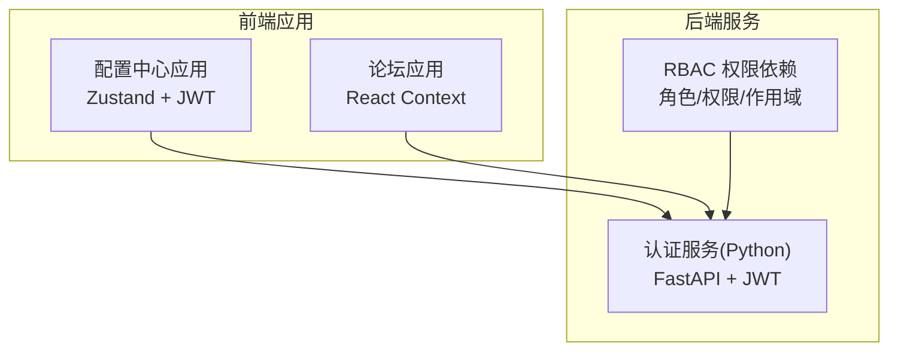
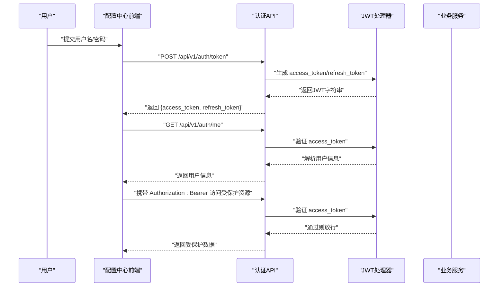
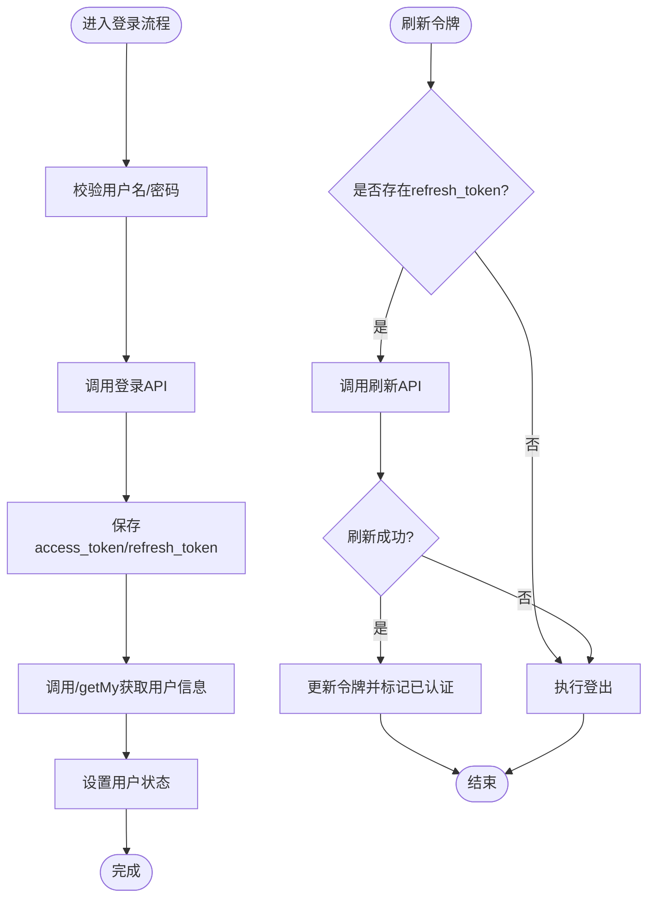
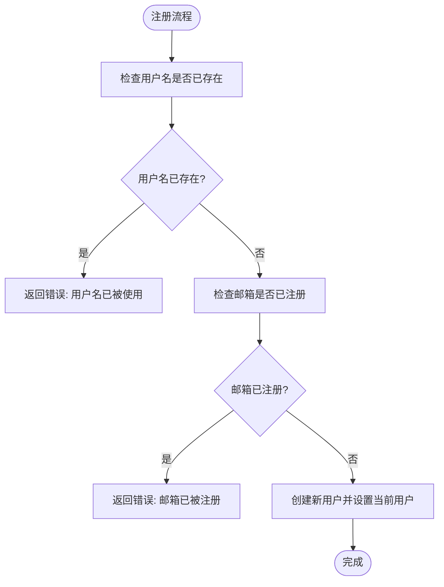
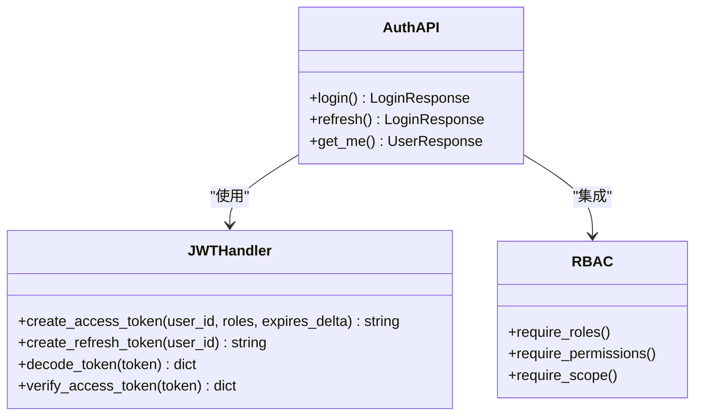
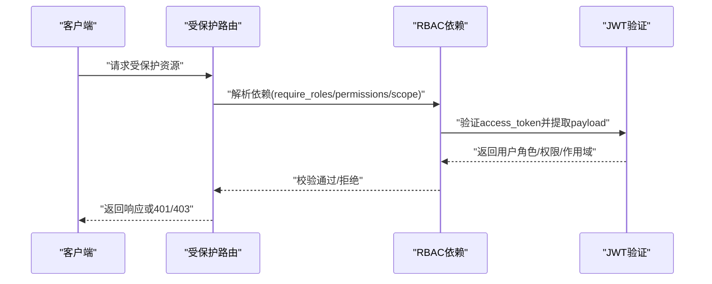
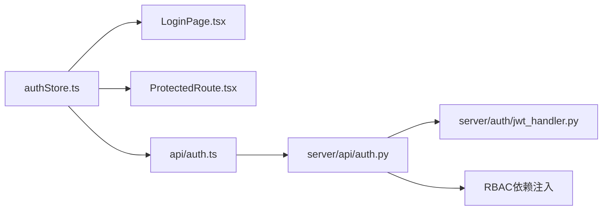

# 用户认证与权限管理

<cite>
**本文档引用的文件**
- [apps/config-center/src/store/authStore.ts](file://apps/config-center/src/store/authStore.ts)
- [apps/config-center/src/api/auth.ts](file://apps/config-center/src/api/auth.ts)
- [apps/config-center/src/pages/LoginPage.tsx](file://apps/config-center/src/pages/LoginPage.tsx)
- [apps/config-center/src/components/ProtectedRoute.tsx](file://apps/config-center/src/components/ProtectedRoute.tsx)
- [apps/config-center/src/api/users.ts](file://apps/config-center/src/api/users.ts)
- [apps/config-center/src/api/roles.ts](file://apps/config-center/src/api/roles.ts)
- [apps/config-center/src/api/configs.ts](file://apps/config-center/src/api/configs.ts)
- [apps/config-center/src/api/versions.ts](file://apps/config-center/src/api/versions.ts)
- [apps/forum/src/context/AuthContext.tsx](file://apps/forum/src/context/AuthContext.tsx)
- [tools/flexloop/src/taolib/testing/config_center/server/auth/jwt_handler.py](file://tools/flexloop/src/taolib/testing/config_center/server/auth/jwt_handler.py)
- [tools/flexloop/src/taolib/testing/config_center/server/api/auth.py](file://tools/flexloop/src/taolib/testing/config_center/server/api/auth.py)
- [tools/flexloop/tests/testing/test_auth/test_fastapi/test_dependencies.py](file://tools/flexloop/tests/testing/test_auth/test_fastapi/test_dependencies.py)
- [tools/flexloop/tests/testing/test_auth/test_fastapi/test_middleware.py](file://tools/flexloop/tests/testing/test_auth/test_fastapi/test_middleware.py)
- [tools/flexloop/tests/testing/test_auth/test_tokens.py](file://tools/flexloop/tests/testing/test_auth/test_tokens.py)
</cite>

## 目录
1. [简介](#简介)
2. [项目结构](#项目结构)
3. [核心组件](#核心组件)
4. [架构总览](#架构总览)
5. [详细组件分析](#详细组件分析)
6. [依赖关系分析](#依赖关系分析)
7. [性能考虑](#性能考虑)
8. [故障排除指南](#故障排除指南)
9. [结论](#结论)
10. [附录](#附录)

## 简介
本文件面向“用户认证与权限管理系统”，系统性阐述认证上下文设计模式、用户状态管理机制、权限控制策略，并覆盖登录注册流程、会话管理、密码安全策略、JWT 令牌处理、本地存储策略、自动登录机制、跨组件用户状态共享以及安全最佳实践。文档同时提供完整 API 接口规范，涵盖认证端点、用户信息获取、权限验证等。

## 项目结构
本仓库包含多个前端应用与后端工具模块，认证与权限相关能力主要分布在以下位置：
- 前端应用（React + Zustand）：配置中心应用提供基于 JWT 的登录、令牌刷新、受保护路由与本地持久化。
- 前端应用（React + 自定义 Context）：论坛应用提供本地化的用户上下文与简单注册/登录逻辑。
- 后端工具（Python + FastAPI + JWT）：提供 JWT 生成与校验、认证 API、RBAC 权限依赖注入与中间件测试。

图表来源
- [apps/config-center/src/store/authStore.ts:1-108](file://apps/config-center/src/store/authStore.ts#L1-L108)
- [apps/forum/src/context/AuthContext.tsx:1-93](file://apps/forum/src/context/AuthContext.tsx#L1-L93)
- [tools/flexloop/src/taolib/testing/config_center/server/api/auth.py:1-54](file://tools/flexloop/src/taolib/testing/config_center/server/api/auth.py#L1-L54)
- [tools/flexloop/src/taolib/testing/config_center/server/auth/jwt_handler.py:1-94](file://tools/flexloop/src/taolib/testing/config_center/server/auth/jwt_handler.py#L1-L94)

章节来源
- [apps/config-center/src/store/authStore.ts:1-108](file://apps/config-center/src/store/authStore.ts#L1-L108)
- [apps/forum/src/context/AuthContext.tsx:1-93](file://apps/forum/src/context/AuthContext.tsx#L1-L93)
- [tools/flexloop/src/taolib/testing/config_center/server/api/auth.py:1-54](file://tools/flexloop/src/taolib/testing/config_center/server/api/auth.py#L1-L54)

## 核心组件
本节聚焦认证与权限系统的核心组件及职责划分：
- 前端认证状态管理（Zustand Store）
  - 负责登录、登出、令牌刷新、用户信息拉取、权限判断（客户端提示）、本地持久化。
- 前端认证上下文（React Context）
  - 提供论坛应用的用户上下文，支持本地注册/登录与用户资料更新。
- 后端认证服务（FastAPI + JWT）
  - 提供登录、刷新令牌、获取当前用户等 API；内置 JWT 生成与校验工具；提供 RBAC 角色/权限/作用域依赖注入。
- 权限控制（RBAC）
  - 基于角色与权限的依赖注入，支持管理员专用端点与细粒度权限校验。

章节来源
- [apps/config-center/src/store/authStore.ts:1-108](file://apps/config-center/src/store/authStore.ts#L1-L108)
- [apps/forum/src/context/AuthContext.tsx:1-93](file://apps/forum/src/context/AuthContext.tsx#L1-L93)
- [tools/flexloop/src/taolib/testing/config_center/server/auth/jwt_handler.py:1-94](file://tools/flexloop/src/taolib/testing/config_center/server/auth/jwt_handler.py#L1-L94)
- [tools/flexloop/src/taolib/testing/config_center/server/api/auth.py:1-54](file://tools/flexloop/src/taolib/testing/config_center/server/api/auth.py#L1-L54)

## 架构总览
下图展示从前端到后端的认证与权限交互流程，包括登录、令牌刷新、受保护资源访问与权限校验。

图表来源
- [apps/config-center/src/api/auth.ts:1-15](file://apps/config-center/src/api/auth.ts#L1-L15)
- [apps/config-center/src/store/authStore.ts:1-108](file://apps/config-center/src/store/authStore.ts#L1-L108)
- [tools/flexloop/src/taolib/testing/config_center/server/auth/jwt_handler.py:1-94](file://tools/flexloop/src/taolib/testing/config_center/server/auth/jwt_handler.py#L1-L94)
- [tools/flexloop/src/taolib/testing/config_center/server/api/auth.py:1-54](file://tools/flexloop/src/taolib/testing/config_center/server/api/auth.py#L1-L54)

## 详细组件分析

### 组件A：前端认证状态管理（Zustand Store）
- 设计模式
  - 使用 Zustand 管理认证状态，结合 persist 实现本地持久化，确保页面刷新后仍可保持登录态。
- 关键职责
  - 登录：调用登录 API 获取 access_token/refresh_token，随后拉取用户信息并更新状态。
  - 登出：清空用户信息与令牌，重置认证状态。
  - 令牌刷新：在缺少 refresh_token 或刷新失败时触发登出，保证状态一致性。
  - 受保护路由：通过受保护路由组件拦截未认证访问。
  - 权限判断：对超级管理员进行快速放行，其他用户仅作 UI 层提示（安全边界在服务端）。
- 数据模型要点
  - 状态字段：user、accessToken、refreshToken、isAuthenticated、isLoading。
  - 本地持久化字段：仅保存令牌与认证状态，避免敏感信息泄露。

图表来源
- [apps/config-center/src/store/authStore.ts:29-95](file://apps/config-center/src/store/authStore.ts#L29-L95)

章节来源
- [apps/config-center/src/store/authStore.ts:1-108](file://apps/config-center/src/store/authStore.ts#L1-L108)
- [apps/config-center/src/components/ProtectedRoute.tsx:1-14](file://apps/config-center/src/components/ProtectedRoute.tsx#L1-L14)

### 组件B：前端认证上下文（React Context）
- 设计模式
  - 使用 React Context 提供全局用户上下文，配合本地存储实现轻量级认证。
- 关键职责
  - 登录：根据用户名查找用户并校验密码，更新最后活跃时间，设置当前用户。
  - 注册：校验用户名与邮箱唯一性，创建新用户并设置当前用户。
  - 登出：清除当前用户。
  - 更新资料：合并用户更新并保存。
- 数据模型要点
  - 用户角色默认为普通用户，便于后续扩展权限。

图表来源
- [apps/forum/src/context/AuthContext.tsx:39-67](file://apps/forum/src/context/AuthContext.tsx#L39-L67)

章节来源
- [apps/forum/src/context/AuthContext.tsx:1-93](file://apps/forum/src/context/AuthContext.tsx#L1-L93)

### 组件C：后端认证服务（FastAPI + JWT）
- 设计模式
  - 基于 JWT 的无状态认证，提供登录、刷新令牌与获取当前用户信息的 API。
  - 内置 JWT 工具：生成 access_token/refresh_token、解码与验证。
  - RBAC 支持：通过依赖注入实现角色/权限/作用域的访问控制。
- 关键职责
  - 登录：接收表单数据，校验凭据，签发 access_token 与 refresh_token。
  - 刷新：接收 refresh_token，签发新的 access_token/refresh_token。
  - 获取当前用户：验证 access_token，返回用户信息。
  - 权限校验：通过依赖注入在路由层强制要求特定角色或权限。
- 数据模型要点
  - Access Token：短期有效，用于日常 API 请求。
  - Refresh Token：长期有效，用于刷新短期令牌。
  - Payload 字段：包含用户标识、角色列表、令牌类型等。

图表来源
- [tools/flexloop/src/taolib/testing/config_center/server/auth/jwt_handler.py:1-94](file://tools/flexloop/src/taolib/testing/config_center/server/auth/jwt_handler.py#L1-L94)
- [tools/flexloop/src/taolib/testing/config_center/server/api/auth.py:1-54](file://tools/flexloop/src/taolib/testing/config_center/server/api/auth.py#L1-L54)

章节来源
- [tools/flexloop/src/taolib/testing/config_center/server/auth/jwt_handler.py:1-94](file://tools/flexloop/src/taolib/testing/config_center/server/auth/jwt_handler.py#L1-L94)
- [tools/flexloop/src/taolib/testing/config_center/server/api/auth.py:1-54](file://tools/flexloop/src/taolib/testing/config_center/server/api/auth.py#L1-L54)

### 组件D：权限控制（RBAC 依赖注入）
- 设计模式
  - 在 FastAPI 路由中通过依赖注入强制校验角色、权限或作用域。
- 关键职责
  - require_roles：限制仅特定角色可访问。
  - require_permissions：限制具备特定资源/动作权限的用户访问。
  - require_scope：限制在特定环境或作用域内的访问。
- 测试验证
  - 单元测试覆盖了无凭据、过期令牌、角色/权限/作用域校验等场景。

图表来源
- [tools/flexloop/tests/testing/test_auth/test_fastapi/test_dependencies.py:86-132](file://tools/flexloop/tests/testing/test_auth/test_fastapi/test_dependencies.py#L86-L132)
- [tools/flexloop/tests/testing/test_auth/test_fastapi/test_middleware.py:84-123](file://tools/flexloop/tests/testing/test_auth/test_fastapi/test_middleware.py#L84-L123)

章节来源
- [tools/flexloop/tests/testing/test_auth/test_fastapi/test_dependencies.py:86-132](file://tools/flexloop/tests/testing/test_auth/test_fastapi/test_dependencies.py#L86-L132)
- [tools/flexloop/tests/testing/test_auth/test_fastapi/test_middleware.py:84-123](file://tools/flexloop/tests/testing/test_auth/test_fastapi/test_middleware.py#L84-L123)

## 依赖关系分析
- 前端依赖
  - 配置中心应用依赖认证 API 与 JWT 工具；受保护路由依赖认证状态；UI 组件依赖认证状态进行渲染控制。
- 后端依赖
  - 认证 API 依赖 JWT 工具与用户仓储；RBAC 依赖策略与权限策略对象。
- 外部依赖
  - JWT 库负责编码/解码与签名验证；FastAPI 负责路由与依赖注入；数据库/仓储负责用户数据存取。

图表来源
- [apps/config-center/src/store/authStore.ts:1-108](file://apps/config-center/src/store/authStore.ts#L1-L108)
- [apps/config-center/src/pages/LoginPage.tsx:1-77](file://apps/config-center/src/pages/LoginPage.tsx#L1-L77)
- [apps/config-center/src/components/ProtectedRoute.tsx:1-14](file://apps/config-center/src/components/ProtectedRoute.tsx#L1-L14)
- [apps/config-center/src/api/auth.ts:1-15](file://apps/config-center/src/api/auth.ts#L1-L15)
- [tools/flexloop/src/taolib/testing/config_center/server/api/auth.py:1-54](file://tools/flexloop/src/taolib/testing/config_center/server/api/auth.py#L1-L54)
- [tools/flexloop/src/taolib/testing/config_center/server/auth/jwt_handler.py:1-94](file://tools/flexloop/src/taolib/testing/config_center/server/auth/jwt_handler.py#L1-L94)

章节来源
- [apps/config-center/src/store/authStore.ts:1-108](file://apps/config-center/src/store/authStore.ts#L1-L108)
- [apps/config-center/src/api/auth.ts:1-15](file://apps/config-center/src/api/auth.ts#L1-L15)
- [tools/flexloop/src/taolib/testing/config_center/server/api/auth.py:1-54](file://tools/flexloop/src/taolib/testing/config_center/server/api/auth.py#L1-L54)

## 性能考虑
- 令牌有效期
  - Access Token 短期有效，降低泄露风险；Refresh Token 长期有效但需安全存储与严格校验。
- 前端缓存与持久化
  - 仅持久化必要令牌与认证状态，避免敏感信息落盘；在内存中维护用户信息以减少重复请求。
- 后端校验
  - 所有权限校验均在服务端执行，前端仅作 UI 提示，确保安全边界一致。
- 网络优化
  - 合理使用并发请求与错误重试；在令牌即将过期时提前刷新，提升用户体验。

## 故障排除指南
- 常见问题
  - 无认证凭据：返回 401，提示未提供认证凭据。
  - 令牌过期：返回 401，提示令牌已过期；触发前端自动登出。
  - 无效令牌：返回 401，提示令牌无效；触发前端自动登出。
  - 权限不足：返回 403，提示无权访问；检查角色/权限/作用域配置。
- 排查步骤
  - 检查前端是否正确设置 Authorization 头。
  - 检查后端 JWT 密钥与算法配置是否一致。
  - 检查 RBAC 策略与用户角色映射。
  - 查看后端日志与单元测试用例定位问题。

章节来源
- [tools/flexloop/tests/testing/test_auth/test_fastapi/test_middleware.py:84-123](file://tools/flexloop/tests/testing/test_auth/test_fastapi/test_middleware.py#L84-L123)
- [tools/flexloop/tests/testing/test_auth/test_tokens.py:76-206](file://tools/flexloop/tests/testing/test_auth/test_tokens.py#L76-L206)

## 结论
本系统采用前后端分离的认证与权限架构：前端通过 Zustand 管理认证状态并持久化令牌，后端通过 JWT 提供无状态认证与 RBAC 权限控制。登录注册流程清晰，会话管理与令牌刷新机制完善，权限控制策略可扩展且安全边界明确。建议持续完善密码安全策略与审计日志，进一步强化系统安全性。

## 附录

### API 接口规范（认证与用户管理）
- 认证端点
  - POST /api/v1/auth/token
    - 功能：用户登录，返回 access_token 与 refresh_token。
    - 请求体：application/x-www-form-urlencoded，包含 username 与 password。
    - 成功响应：包含 access_token 与 refresh_token。
  - POST /api/v1/auth/refresh
    - 功能：使用 refresh_token 刷新 access_token。
    - 请求体：JSON，包含 refresh_token。
    - 成功响应：返回新的 access_token 与 refresh_token。
  - GET /api/v1/auth/me
    - 功能：获取当前登录用户信息。
    - 成功响应：返回用户信息。
- 用户管理端点
  - GET /api/v1/users
    - 功能：分页查询用户列表。
  - GET /api/v1/users/{userId}
    - 功能：获取指定用户详情。
  - POST /api/v1/users
    - 功能：创建用户。
  - PUT /api/v1/users/{userId}
    - 功能：更新用户。
  - DELETE /api/v1/users/{userId}
    - 功能：删除用户。
- 角色管理端点
  - GET /api/v1/roles
    - 功能：分页查询角色列表。
  - GET /api/v1/roles/{roleId}
    - 功能：获取指定角色详情。
  - POST /api/v1/roles
    - 功能：创建角色。
  - PUT /api/v1/roles/{roleId}
    - 功能：更新角色。
  - DELETE /api/v1/roles/{roleId}
    - 功能：删除角色。
- 配置管理端点
  - GET /api/v1/configs
    - 功能：分页查询配置列表。
  - GET /api/v1/configs/{id}
    - 功能：获取指定配置详情。
  - POST /api/v1/configs
    - 功能：创建配置。
  - PUT /api/v1/configs/{id}
    - 功能：更新配置。
  - DELETE /api/v1/configs/{id}
    - 功能：删除配置。
  - POST /api/v1/configs/{id}/publish
    - 功能：发布配置。
- 版本管理端点
  - GET /api/v1/configs/{configId}/versions
    - 功能：分页查询配置版本列表。
  - GET /api/v1/configs/{configId}/versions/{versionNum}
    - 功能：获取指定版本详情。
  - GET /api/v1/configs/{configId}/versions/diff/{v1}/to/{v2}
    - 功能：对比两个版本差异。
  - POST /api/v1/configs/{configId}/versions/{versionNum}/rollback
    - 功能：回滚到指定版本。

章节来源
- [apps/config-center/src/api/auth.ts:1-15](file://apps/config-center/src/api/auth.ts#L1-L15)
- [apps/config-center/src/api/users.ts:1-26](file://apps/config-center/src/api/users.ts#L1-L26)
- [apps/config-center/src/api/roles.ts:1-26](file://apps/config-center/src/api/roles.ts#L1-L26)
- [apps/config-center/src/api/configs.ts:1-33](file://apps/config-center/src/api/configs.ts#L1-L33)
- [apps/config-center/src/api/versions.ts:1-29](file://apps/config-center/src/api/versions.ts#L1-L29)

### 用户角色体系与权限范围
- 角色定义
  - 访客：未认证用户，仅可访问公开资源。
  - 普通用户：已认证用户，可访问自身相关资源与部分公开资源。
  - 管理员：具备更高权限，可访问管理端资源。
  - 超级管理员：拥有全部权限，通常用于系统级操作。
- 权限范围
  - 基于角色的访问控制（RBAC）：通过 require_roles 限制访问。
  - 基于权限的访问控制：通过 require_permissions 限制资源/动作。
  - 基于作用域的访问控制：通过 require_scope 限制环境或范围。
- 客户端提示
  - 前端对超级管理员进行快速放行，对非超级管理员仅作 UI 提示，最终安全边界以服务端为准。

章节来源
- [apps/config-center/src/store/authStore.ts:84-95](file://apps/config-center/src/store/authStore.ts#L84-L95)
- [tools/flexloop/tests/testing/test_auth/test_fastapi/test_dependencies.py:102-124](file://tools/flexloop/tests/testing/test_auth/test_fastapi/test_dependencies.py#L102-L124)

### JWT 令牌处理与本地存储策略
- 令牌处理
  - Access Token：短期有效，用于日常 API 请求。
  - Refresh Token：长期有效，用于刷新短期令牌。
  - Payload 字段：包含用户标识、角色列表、令牌类型等。
- 本地存储
  - 前端仅持久化令牌与认证状态，避免敏感信息落盘。
  - 页面刷新后自动尝试刷新令牌，维持登录态。

章节来源
- [tools/flexloop/src/taolib/testing/config_center/server/auth/jwt_handler.py:14-58](file://tools/flexloop/src/taolib/testing/config_center/server/auth/jwt_handler.py#L14-L58)
- [apps/config-center/src/store/authStore.ts:97-106](file://apps/config-center/src/store/authStore.ts#L97-L106)

### 自动登录机制
- 令牌刷新
  - 在缺少 refresh_token 或刷新失败时触发登出，保证状态一致性。
- 受保护路由
  - 未认证用户跳转至登录页，登录成功后返回原路径。

章节来源
- [apps/config-center/src/store/authStore.ts:57-82](file://apps/config-center/src/store/authStore.ts#L57-L82)
- [apps/config-center/src/components/ProtectedRoute.tsx:1-14](file://apps/config-center/src/components/ProtectedRoute.tsx#L1-L14)

### 跨组件用户状态共享机制
- 配置中心应用
  - 通过 Zustand Store 全局共享认证状态，受保护路由组件统一拦截未认证访问。
- 论坛应用
  - 通过 React Context 提供用户上下文，支持本地注册/登录与用户资料更新。

章节来源
- [apps/config-center/src/store/authStore.ts:1-108](file://apps/config-center/src/store/authStore.ts#L1-L108)
- [apps/forum/src/context/AuthContext.tsx:1-93](file://apps/forum/src/context/AuthContext.tsx#L1-L93)

### 安全最佳实践
- 密码安全
  - 建议采用强哈希算法（如 bcrypt）存储密码，避免明文存储。
- 传输安全
  - 使用 HTTPS 传输，防止令牌与凭据被窃听。
- 存储安全
  - 仅持久化必要令牌与认证状态，避免敏感信息落盘。
- 权限最小化
  - 采用 RBAC 最小权限原则，定期审查角色与权限映射。
- 审计与监控
  - 记录登录、登出、权限变更等关键事件，建立异常检测与告警机制。