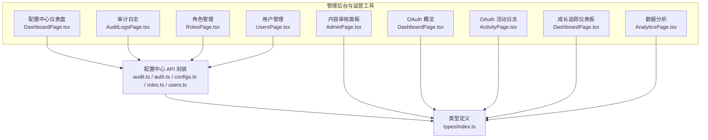
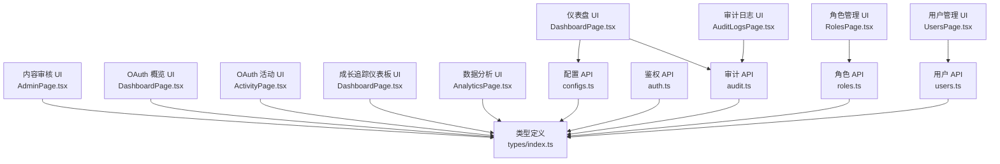
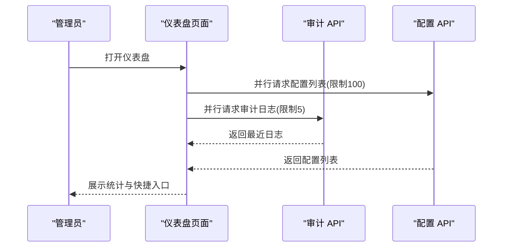
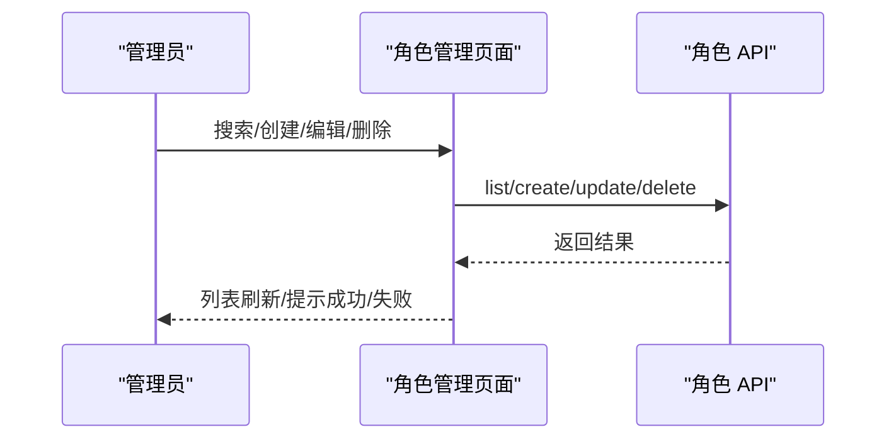
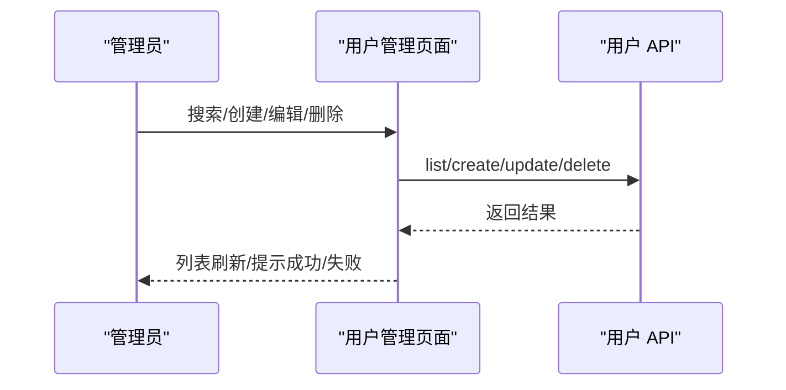
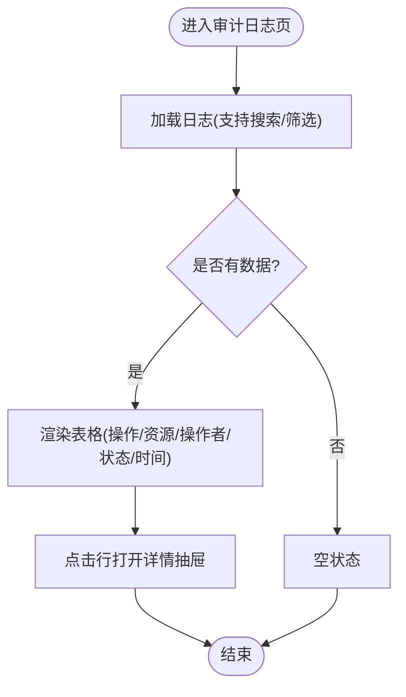
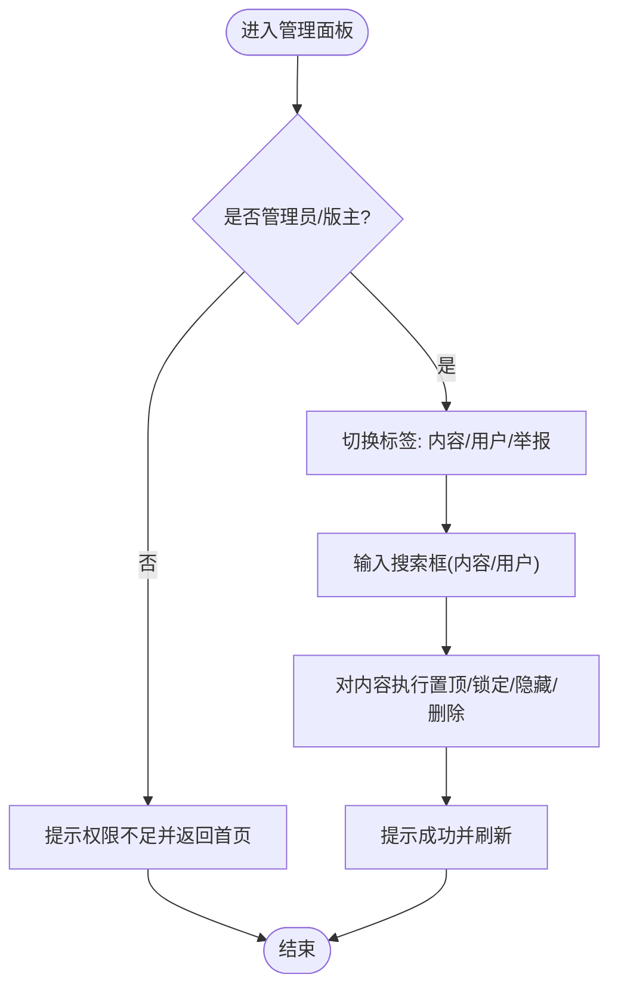
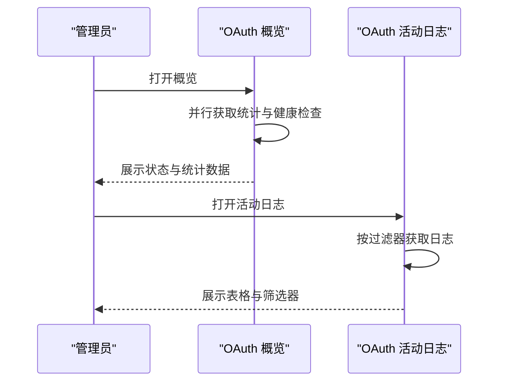
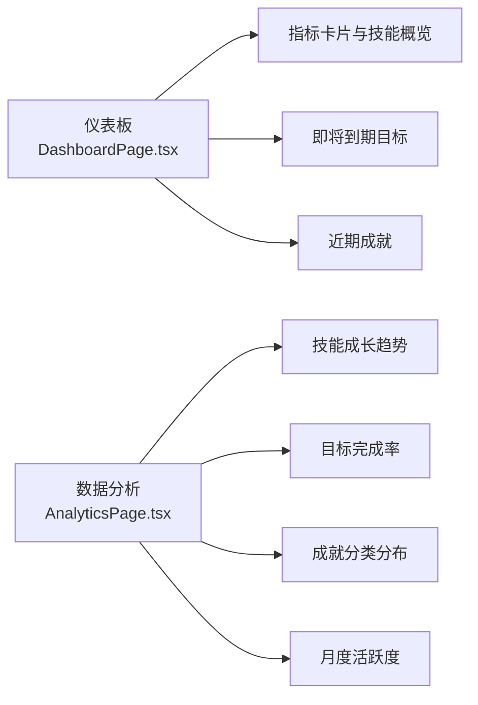
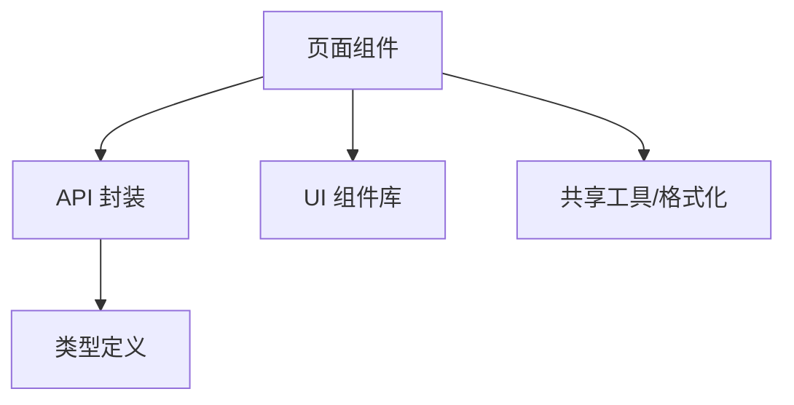

# 管理后台与运营工具

<cite>
**本文引用的文件**
- [apps/config-center/src/pages/DashboardPage.tsx](file://apps/config-center/src/pages/DashboardPage.tsx)
- [apps/config-center/src/pages/AuditLogsPage.tsx](file://apps/config-center/src/pages/AuditLogsPage.tsx)
- [apps/config-center/src/pages/RolesPage.tsx](file://apps/config-center/src/pages/RolesPage.tsx)
- [apps/config-center/src/pages/UsersPage.tsx](file://apps/config-center/src/pages/UsersPage.tsx)
- [apps/config-center/src/api/audit.ts](file://apps/config-center/src/api/audit.ts)
- [apps/config-center/src/api/auth.ts](file://apps/config-center/src/api/auth.ts)
- [apps/config-center/src/api/configs.ts](file://apps/config-center/src/api/configs.ts)
- [apps/config-center/src/api/roles.ts](file://apps/config-center/src/api/roles.ts)
- [apps/config-center/src/api/users.ts](file://apps/config-center/src/api/users.ts)
- [apps/config-center/src/types/index.ts](file://apps/config-center/src/types/index.ts)
- [apps/forum/src/pages/AdminPage.tsx](file://apps/forum/src/pages/AdminPage.tsx)
- [apps/oauth-admin/src/pages/DashboardPage.tsx](file://apps/oauth-admin/src/pages/DashboardPage.tsx)
- [apps/oauth-admin/src/pages/ActivityPage.tsx](file://apps/oauth-admin/src/pages/ActivityPage.tsx)
- [apps/growth-tracker/src/pages/AnalyticsPage.tsx](file://apps/growth-tracker/src/pages/AnalyticsPage.tsx)
- [apps/growth-tracker/src/pages/DashboardPage.tsx](file://apps/growth-tracker/src/pages/DashboardPage.tsx)
</cite>

## 目录
1. [简介](#简介)
2. [项目结构](#项目结构)
3. [核心组件](#核心组件)
4. [架构总览](#架构总览)
5. [详细组件分析](#详细组件分析)
6. [依赖关系分析](#依赖关系分析)
7. [性能考量](#性能考量)
8. [故障排查指南](#故障排查指南)
9. [结论](#结论)
10. [附录](#附录)

## 简介
本文件面向管理后台与运营工具，系统性梳理管理员权限体系、后台功能模块与运营工具集，覆盖内容审核面板、用户管理界面、系统配置管理、数据统计分析、用户行为监控、系统性能指标、批量操作与批量管理机制，并提供完整的管理 API 接口规范与后台安全策略、操作审计与权限控制说明。文档同时给出可视化架构图与流程图，帮助技术与非技术读者快速理解与落地。

## 项目结构
本仓库包含多个前端应用，其中与“管理后台与运营工具”直接相关的主要有：
- 配置中心（config-center）：提供仪表盘、配置管理、角色与用户管理、审计日志等后台能力。
- 论坛（forum）：提供内容审核与举报处理的管理面板。
- OAuth 管理后台（oauth-admin）：提供认证服务概览与活动日志。
- 成长追踪（growth-tracker）：提供数据分析与仪表板，用于运营分析与用户行为洞察。

图表来源
- [apps/config-center/src/pages/DashboardPage.tsx:13-173](file://apps/config-center/src/pages/DashboardPage.tsx#L13-L173)
- [apps/config-center/src/pages/AuditLogsPage.tsx:11-161](file://apps/config-center/src/pages/AuditLogsPage.tsx#L11-L161)
- [apps/config-center/src/pages/RolesPage.tsx:11-169](file://apps/config-center/src/pages/RolesPage.tsx#L11-L169)
- [apps/config-center/src/pages/UsersPage.tsx:11-163](file://apps/config-center/src/pages/UsersPage.tsx#L11-L163)
- [apps/config-center/src/api/audit.ts:1-18](file://apps/config-center/src/api/audit.ts#L1-L18)
- [apps/config-center/src/api/auth.ts:1-15](file://apps/config-center/src/api/auth.ts#L1-L15)
- [apps/config-center/src/api/configs.ts:1-33](file://apps/config-center/src/api/configs.ts#L1-L33)
- [apps/config-center/src/api/roles.ts:1-26](file://apps/config-center/src/api/roles.ts#L1-L26)
- [apps/config-center/src/api/users.ts:1-26](file://apps/config-center/src/api/users.ts#L1-L26)
- [apps/config-center/src/types/index.ts:1-163](file://apps/config-center/src/types/index.ts#L1-L163)
- [apps/forum/src/pages/AdminPage.tsx:15-241](file://apps/forum/src/pages/AdminPage.tsx#L15-L241)
- [apps/oauth-admin/src/pages/DashboardPage.tsx:6-97](file://apps/oauth-admin/src/pages/DashboardPage.tsx#L6-L97)
- [apps/oauth-admin/src/pages/ActivityPage.tsx:22-159](file://apps/oauth-admin/src/pages/ActivityPage.tsx#L22-L159)
- [apps/growth-tracker/src/pages/DashboardPage.tsx:22-264](file://apps/growth-tracker/src/pages/DashboardPage.tsx#L22-L264)
- [apps/growth-tracker/src/pages/AnalyticsPage.tsx:17-234](file://apps/growth-tracker/src/pages/AnalyticsPage.tsx#L17-L234)

章节来源
- [apps/config-center/src/pages/DashboardPage.tsx:13-173](file://apps/config-center/src/pages/DashboardPage.tsx#L13-L173)
- [apps/config-center/src/pages/AuditLogsPage.tsx:11-161](file://apps/config-center/src/pages/AuditLogsPage.tsx#L11-L161)
- [apps/config-center/src/pages/RolesPage.tsx:11-169](file://apps/config-center/src/pages/RolesPage.tsx#L11-L169)
- [apps/config-center/src/pages/UsersPage.tsx:11-163](file://apps/config-center/src/pages/UsersPage.tsx#L11-L163)
- [apps/config-center/src/api/audit.ts:1-18](file://apps/config-center/src/api/audit.ts#L1-L18)
- [apps/config-center/src/api/auth.ts:1-15](file://apps/config-center/src/api/auth.ts#L1-L15)
- [apps/config-center/src/api/configs.ts:1-33](file://apps/config-center/src/api/configs.ts#L1-L33)
- [apps/config-center/src/api/roles.ts:1-26](file://apps/config-center/src/api/roles.ts#L1-L26)
- [apps/config-center/src/api/users.ts:1-26](file://apps/config-center/src/api/users.ts#L1-L26)
- [apps/config-center/src/types/index.ts:1-163](file://apps/config-center/src/types/index.ts#L1-L163)
- [apps/forum/src/pages/AdminPage.tsx:15-241](file://apps/forum/src/pages/AdminPage.tsx#L15-L241)
- [apps/oauth-admin/src/pages/DashboardPage.tsx:6-97](file://apps/oauth-admin/src/pages/DashboardPage.tsx#L6-L97)
- [apps/oauth-admin/src/pages/ActivityPage.tsx:22-159](file://apps/oauth-admin/src/pages/ActivityPage.tsx#L22-L159)
- [apps/growth-tracker/src/pages/DashboardPage.tsx:22-264](file://apps/growth-tracker/src/pages/DashboardPage.tsx#L22-L264)
- [apps/growth-tracker/src/pages/AnalyticsPage.tsx:17-234](file://apps/growth-tracker/src/pages/AnalyticsPage.tsx#L17-L234)

## 核心组件
- 配置中心后台：提供仪表盘、配置列表与发布、角色与用户管理、审计日志查询与筛选。
- 内容审核面板：支持主题状态变更（置顶/锁定/隐藏/删除）、用户列表查看、举报处理入口。
- OAuth 管理后台：提供服务健康状态、连接数与提供商概览，以及认证活动日志。
- 成长追踪运营工具：提供技能成长趋势、目标完成率、成就分布与月度活跃度等可视化分析。

章节来源
- [apps/config-center/src/pages/DashboardPage.tsx:13-173](file://apps/config-center/src/pages/DashboardPage.tsx#L13-L173)
- [apps/config-center/src/pages/AuditLogsPage.tsx:11-161](file://apps/config-center/src/pages/AuditLogsPage.tsx#L11-L161)
- [apps/config-center/src/pages/RolesPage.tsx:11-169](file://apps/config-center/src/pages/RolesPage.tsx#L11-L169)
- [apps/config-center/src/pages/UsersPage.tsx:11-163](file://apps/config-center/src/pages/UsersPage.tsx#L11-L163)
- [apps/forum/src/pages/AdminPage.tsx:15-241](file://apps/forum/src/pages/AdminPage.tsx#L15-L241)
- [apps/oauth-admin/src/pages/DashboardPage.tsx:6-97](file://apps/oauth-admin/src/pages/DashboardPage.tsx#L6-L97)
- [apps/oauth-admin/src/pages/ActivityPage.tsx:22-159](file://apps/oauth-admin/src/pages/ActivityPage.tsx#L22-L159)
- [apps/growth-tracker/src/pages/DashboardPage.tsx:22-264](file://apps/growth-tracker/src/pages/DashboardPage.tsx#L22-L264)
- [apps/growth-tracker/src/pages/AnalyticsPage.tsx:17-234](file://apps/growth-tracker/src/pages/AnalyticsPage.tsx#L17-L234)

## 架构总览
管理后台采用“页面组件 + API 封装 + 类型定义”的分层设计。页面组件负责交互与展示，API 封装统一调用后端接口并处理错误，类型定义确保前后端契约一致。审计与权限通过统一的鉴权与日志模块支撑。

图表来源
- [apps/config-center/src/pages/DashboardPage.tsx:13-173](file://apps/config-center/src/pages/DashboardPage.tsx#L13-L173)
- [apps/config-center/src/pages/AuditLogsPage.tsx:11-161](file://apps/config-center/src/pages/AuditLogsPage.tsx#L11-L161)
- [apps/config-center/src/pages/RolesPage.tsx:11-169](file://apps/config-center/src/pages/RolesPage.tsx#L11-L169)
- [apps/config-center/src/pages/UsersPage.tsx:11-163](file://apps/config-center/src/pages/UsersPage.tsx#L11-L163)
- [apps/config-center/src/api/audit.ts:1-18](file://apps/config-center/src/api/audit.ts#L1-L18)
- [apps/config-center/src/api/auth.ts:1-15](file://apps/config-center/src/api/auth.ts#L1-L15)
- [apps/config-center/src/api/configs.ts:1-33](file://apps/config-center/src/api/configs.ts#L1-L33)
- [apps/config-center/src/api/roles.ts:1-26](file://apps/config-center/src/api/roles.ts#L1-L26)
- [apps/config-center/src/api/users.ts:1-26](file://apps/config-center/src/api/users.ts#L1-L26)
- [apps/config-center/src/types/index.ts:1-163](file://apps/config-center/src/types/index.ts#L1-L163)
- [apps/forum/src/pages/AdminPage.tsx:15-241](file://apps/forum/src/pages/AdminPage.tsx#L15-L241)
- [apps/oauth-admin/src/pages/DashboardPage.tsx:6-97](file://apps/oauth-admin/src/pages/DashboardPage.tsx#L6-L97)
- [apps/oauth-admin/src/pages/ActivityPage.tsx:22-159](file://apps/oauth-admin/src/pages/ActivityPage.tsx#L22-L159)
- [apps/growth-tracker/src/pages/DashboardPage.tsx:22-264](file://apps/growth-tracker/src/pages/DashboardPage.tsx#L22-L264)
- [apps/growth-tracker/src/pages/AnalyticsPage.tsx:17-234](file://apps/growth-tracker/src/pages/AnalyticsPage.tsx#L17-L234)

## 详细组件分析

### 配置中心后台（仪表盘、配置、角色、用户、审计）
- 仪表盘：聚合配置总数、活跃配置、草稿配置、最近操作；按环境分布展示占比；提供快捷入口。
- 审计日志：支持按资源、操作类型筛选，展示操作者、状态与时间；支持抽屉查看详情（含旧值/新值对比）。
- 角色管理：支持创建、编辑、删除（系统角色禁用删除/编辑），按名称搜索，展示权限数量与更新时间。
- 用户管理：支持创建、编辑、删除，按用户名搜索；展示状态、最后登录时间。
- 配置管理：列表查询支持环境/服务/状态筛选；支持发布版本。

图表来源
- [apps/config-center/src/pages/DashboardPage.tsx:19-36](file://apps/config-center/src/pages/DashboardPage.tsx#L19-L36)
- [apps/config-center/src/api/audit.ts:4-13](file://apps/config-center/src/api/audit.ts#L4-L13)
- [apps/config-center/src/api/configs.ts:4-12](file://apps/config-center/src/api/configs.ts#L4-L12)

图表来源
- [apps/config-center/src/pages/RolesPage.tsx:19-75](file://apps/config-center/src/pages/RolesPage.tsx#L19-L75)
- [apps/config-center/src/api/roles.ts:4-25](file://apps/config-center/src/api/roles.ts#L4-L25)

图表来源
- [apps/config-center/src/pages/UsersPage.tsx:19-75](file://apps/config-center/src/pages/UsersPage.tsx#L19-L75)
- [apps/config-center/src/api/users.ts:4-25](file://apps/config-center/src/api/users.ts#L4-L25)

图表来源
- [apps/config-center/src/pages/AuditLogsPage.tsx:18-113](file://apps/config-center/src/pages/AuditLogsPage.tsx#L18-L113)

章节来源
- [apps/config-center/src/pages/DashboardPage.tsx:13-173](file://apps/config-center/src/pages/DashboardPage.tsx#L13-L173)
- [apps/config-center/src/pages/AuditLogsPage.tsx:11-161](file://apps/config-center/src/pages/AuditLogsPage.tsx#L11-L161)
- [apps/config-center/src/pages/RolesPage.tsx:11-169](file://apps/config-center/src/pages/RolesPage.tsx#L11-L169)
- [apps/config-center/src/pages/UsersPage.tsx:11-163](file://apps/config-center/src/pages/UsersPage.tsx#L11-L163)
- [apps/config-center/src/api/audit.ts:1-18](file://apps/config-center/src/api/audit.ts#L1-L18)
- [apps/config-center/src/api/auth.ts:1-15](file://apps/config-center/src/api/auth.ts#L1-L15)
- [apps/config-center/src/api/configs.ts:1-33](file://apps/config-center/src/api/configs.ts#L1-L33)
- [apps/config-center/src/api/roles.ts:1-26](file://apps/config-center/src/api/roles.ts#L1-L26)
- [apps/config-center/src/api/users.ts:1-26](file://apps/config-center/src/api/users.ts#L1-L26)
- [apps/config-center/src/types/index.ts:1-163](file://apps/config-center/src/types/index.ts#L1-L163)

### 内容审核面板（论坛）
- 权限校验：仅管理员与版主可访问。
- 内容管理：支持主题置顶/锁定/隐藏/删除；支持按标题搜索；展示作者、状态、时间与操作按钮。
- 用户管理：支持按用户名/显示名搜索用户；展示角色与注册时间；提供查看链接。
- 举报处理：展示举报类型、目标、举报人与时间；提供忽略/处理按钮。

图表来源
- [apps/forum/src/pages/AdminPage.tsx:23-32](file://apps/forum/src/pages/AdminPage.tsx#L23-L32)
- [apps/forum/src/pages/AdminPage.tsx:107-167](file://apps/forum/src/pages/AdminPage.tsx#L107-L167)
- [apps/forum/src/pages/AdminPage.tsx:169-213](file://apps/forum/src/pages/AdminPage.tsx#L169-L213)
- [apps/forum/src/pages/AdminPage.tsx:215-238](file://apps/forum/src/pages/AdminPage.tsx#L215-L238)

章节来源
- [apps/forum/src/pages/AdminPage.tsx:15-241](file://apps/forum/src/pages/AdminPage.tsx#L15-L241)

### OAuth 管理后台（概览与活动日志）
- 概览：展示服务健康状态、总连接数、活跃连接、提供商数量与服务状态。
- 活动日志：支持按提供商、操作、状态筛选；展示时间、操作、状态、提供商、用户 ID 与 IP。

图表来源
- [apps/oauth-admin/src/pages/DashboardPage.tsx:11-20](file://apps/oauth-admin/src/pages/DashboardPage.tsx#L11-L20)
- [apps/oauth-admin/src/pages/ActivityPage.tsx:32-52](file://apps/oauth-admin/src/pages/ActivityPage.tsx#L32-L52)

章节来源
- [apps/oauth-admin/src/pages/DashboardPage.tsx:6-97](file://apps/oauth-admin/src/pages/DashboardPage.tsx#L6-L97)
- [apps/oauth-admin/src/pages/ActivityPage.tsx:22-159](file://apps/oauth-admin/src/pages/ActivityPage.tsx#L22-L159)

### 成长追踪运营工具（数据分析与仪表板）
- 仪表板：展示技能总数、进行中目标、成就总数、连续打卡等关键指标；展示技能概览、即将到期目标、近期成就与快速汇总。
- 数据分析：展示技能成长趋势折线图、目标完成率饼图、成就分类柱状图与月度活跃度条形图。

图表来源
- [apps/growth-tracker/src/pages/DashboardPage.tsx:22-264](file://apps/growth-tracker/src/pages/DashboardPage.tsx#L22-L264)
- [apps/growth-tracker/src/pages/AnalyticsPage.tsx:17-234](file://apps/growth-tracker/src/pages/AnalyticsPage.tsx#L17-L234)

章节来源
- [apps/growth-tracker/src/pages/DashboardPage.tsx:22-264](file://apps/growth-tracker/src/pages/DashboardPage.tsx#L22-L264)
- [apps/growth-tracker/src/pages/AnalyticsPage.tsx:17-234](file://apps/growth-tracker/src/pages/AnalyticsPage.tsx#L17-L234)

## 依赖关系分析
- 页面组件依赖 API 封装与类型定义，形成清晰的单向依赖链。
- 审计与权限通过统一的鉴权与日志模块支撑，避免重复逻辑。
- 前端 UI 组件库与共享工具函数在各页面中复用，提升一致性与开发效率。

图表来源
- [apps/config-center/src/pages/DashboardPage.tsx:1-12](file://apps/config-center/src/pages/DashboardPage.tsx#L1-L12)
- [apps/config-center/src/api/audit.ts:1-2](file://apps/config-center/src/api/audit.ts#L1-L2)
- [apps/config-center/src/types/index.ts:1-10](file://apps/config-center/src/types/index.ts#L1-L10)

章节来源
- [apps/config-center/src/pages/DashboardPage.tsx:1-12](file://apps/config-center/src/pages/DashboardPage.tsx#L1-L12)
- [apps/config-center/src/api/audit.ts:1-2](file://apps/config-center/src/api/audit.ts#L1-L2)
- [apps/config-center/src/types/index.ts:1-10](file://apps/config-center/src/types/index.ts#L1-L10)

## 性能考量
- 并行加载：仪表盘使用并行请求配置与审计日志，减少首屏等待时间。
- 虚拟滚动与分页：建议在用户/角色/审计日志等大数据量场景引入分页或虚拟滚动以优化渲染性能。
- 图表渲染：数据分析页使用响应式图表，建议在大数据量时进行采样或懒加载。
- 缓存策略：对只读数据（如配置列表、审计日志）可考虑短期缓存，降低后端压力。

## 故障排查指南
- 登录与鉴权
  - 现象：登录失败或令牌刷新异常。
  - 排查：确认用户名密码正确；检查刷新令牌有效性；查看网络请求与后端返回状态码。
  - 参考接口
    - [login:4-6](file://apps/config-center/src/api/auth.ts#L4-L6)
    - [refreshToken:8-10](file://apps/config-center/src/api/auth.ts#L8-L10)
    - [getMe:12-14](file://apps/config-center/src/api/auth.ts#L12-L14)
- 审计日志查询
  - 现象：日志为空或筛选无效。
  - 排查：确认筛选参数（资源类型/ID、操作、时间范围）是否正确；检查网络请求与分页参数。
  - 参考接口
    - [queryAuditLogs:4-13](file://apps/config-center/src/api/audit.ts#L4-L13)
- 配置管理
  - 现象：配置列表不显示或发布失败。
  - 排查：确认环境/服务/状态筛选条件；检查配置值类型与 schema；验证发布权限。
  - 参考接口
    - [listConfigs:4-12](file://apps/config-center/src/api/configs.ts#L4-L12)
    - [publishConfig:30-32](file://apps/config-center/src/api/configs.ts#L30-L32)
- 角色与用户管理
  - 现象：创建/更新失败或系统角色被误删。
  - 排查：确认权限与系统角色标识；检查必填字段与唯一性约束；查看错误提示。
  - 参考接口
    - [createRole:15-17](file://apps/config-center/src/api/roles.ts#L15-L17)
    - [updateRole:19-21](file://apps/config-center/src/api/roles.ts#L19-L21)
    - [deleteRole:23-25](file://apps/config-center/src/api/roles.ts#L23-L25)
    - [createUser:15-17](file://apps/config-center/src/api/users.ts#L15-L17)
    - [updateUser:19-21](file://apps/config-center/src/api/users.ts#L19-L21)
    - [deleteUser:23-25](file://apps/config-center/src/api/users.ts#L23-L25)

章节来源
- [apps/config-center/src/api/auth.ts:1-15](file://apps/config-center/src/api/auth.ts#L1-L15)
- [apps/config-center/src/api/audit.ts:1-18](file://apps/config-center/src/api/audit.ts#L1-L18)
- [apps/config-center/src/api/configs.ts:1-33](file://apps/config-center/src/api/configs.ts#L1-L33)
- [apps/config-center/src/api/roles.ts:1-26](file://apps/config-center/src/api/roles.ts#L1-L26)
- [apps/config-center/src/api/users.ts:1-26](file://apps/config-center/src/api/users.ts#L1-L26)

## 结论
本方案通过清晰的页面分层与 API 封装，构建了可扩展的管理后台与运营工具体系。配置中心提供完善的配置、角色、用户与审计能力；内容审核面板满足论坛类内容治理需求；OAuth 管理后台保障认证服务可观测性；成长追踪工具为运营分析提供可视化支撑。建议在生产环境中进一步完善权限最小化、审计留痕与性能优化策略。

## 附录

### 管理 API 接口规范（摘要）
- 鉴权
  - POST /api/v1/auth/token（登录）
  - POST /api/v1/auth/refresh（刷新令牌）
  - GET /api/v1/auth/me（获取当前用户信息）
- 审计
  - GET /api/v1/audit/logs（查询审计日志，支持 resource_type/resource_id/actor_id/action/skip/limit）
  - GET /api/v1/audit/logs/{logId}（获取审计日志详情）
- 配置
  - GET /api/v1/configs（查询配置，支持 environment/service/status/skip/limit）
  - GET /api/v1/configs/{id}（获取配置详情）
  - POST /api/v1/configs（创建配置）
  - PUT /api/v1/configs/{id}（更新配置）
  - DELETE /api/v1/configs/{id}（删除配置）
  - POST /api/v1/configs/{id}/publish（发布配置）
- 角色
  - GET /api/v1/roles（查询角色，支持 skip/limit）
  - GET /api/v1/roles/{roleId}（获取角色详情）
  - POST /api/v1/roles（创建角色）
  - PUT /api/v1/roles/{roleId}（更新角色）
  - DELETE /api/v1/roles/{roleId}（删除角色）
- 用户
  - GET /api/v1/users（查询用户，支持 skip/limit）
  - GET /api/v1/users/{userId}（获取用户详情）
  - POST /api/v1/users（创建用户）
  - PUT /api/v1/users/{userId}（更新用户）
  - DELETE /api/v1/users/{userId}（删除用户）

章节来源
- [apps/config-center/src/api/auth.ts:4-14](file://apps/config-center/src/api/auth.ts#L4-L14)
- [apps/config-center/src/api/audit.ts:4-17](file://apps/config-center/src/api/audit.ts#L4-L17)
- [apps/config-center/src/api/configs.ts:4-32](file://apps/config-center/src/api/configs.ts#L4-L32)
- [apps/config-center/src/api/roles.ts:4-25](file://apps/config-center/src/api/roles.ts#L4-L25)
- [apps/config-center/src/api/users.ts:4-25](file://apps/config-center/src/api/users.ts#L4-L25)

### 类型定义要点（摘要）
- 环境枚举：development/staging/pre-production/production
- 配置值类型：string/number/boolean/json/secret
- 配置状态：draft/active/deprecated
- 审计动作：config.create/config.update/config.delete/config.publish/config.rollback/user.login/user.logout/role.assign
- 审计状态：success/failed
- 用户与角色权限模型：包含权限数组与环境/服务作用域

章节来源
- [apps/config-center/src/types/index.ts:1-163](file://apps/config-center/src/types/index.ts#L1-L163)