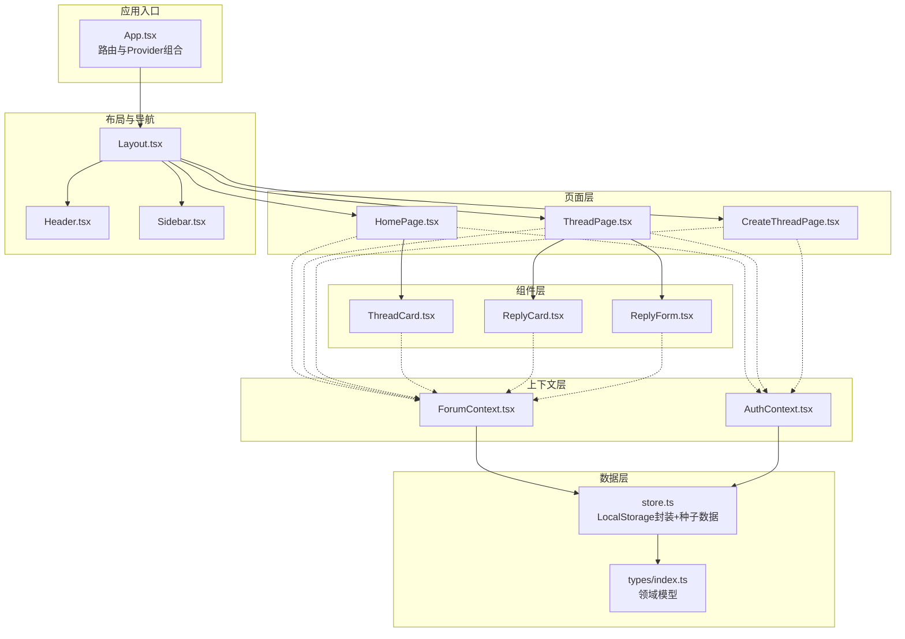
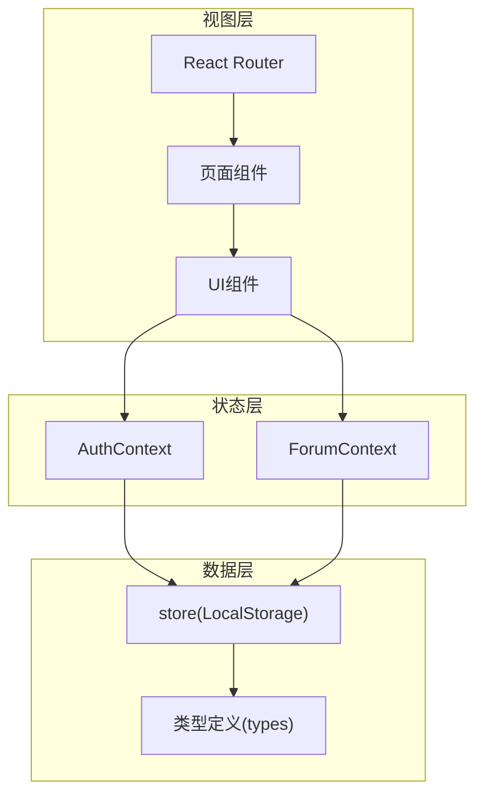
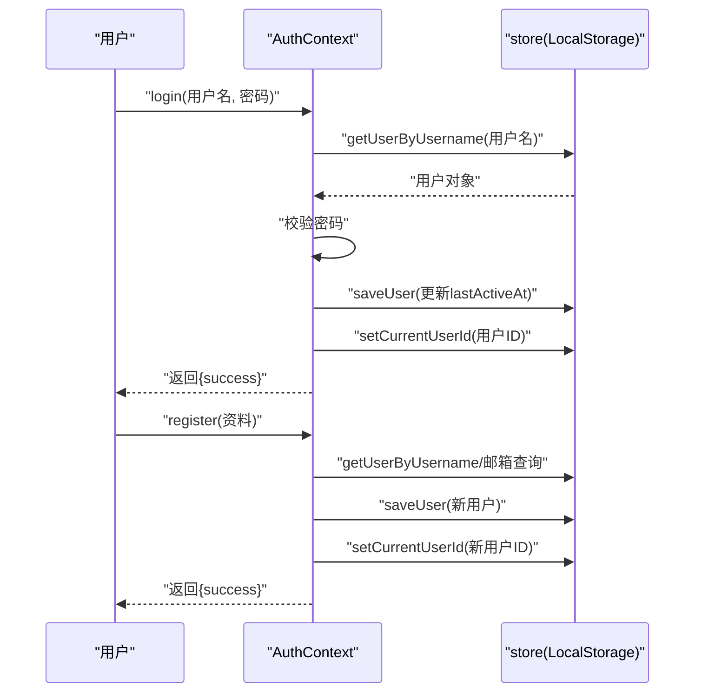
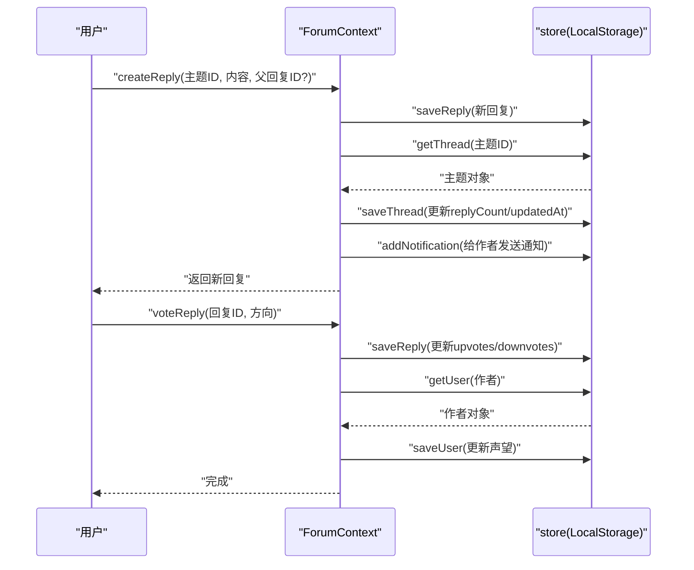
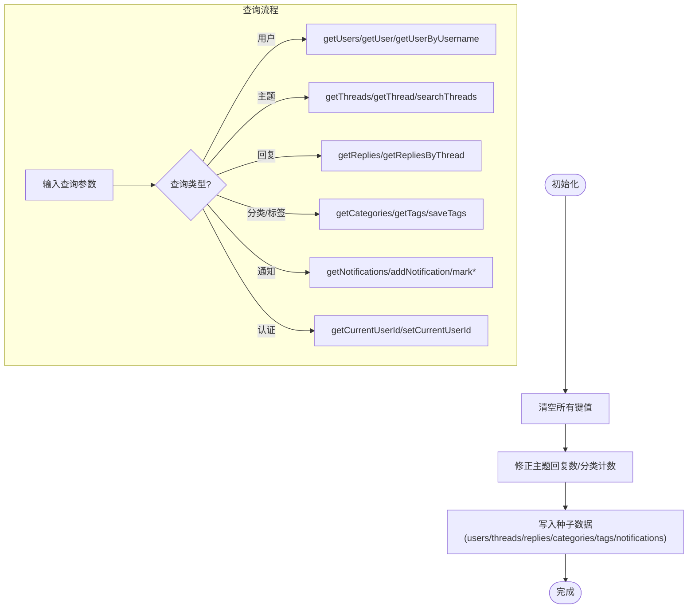
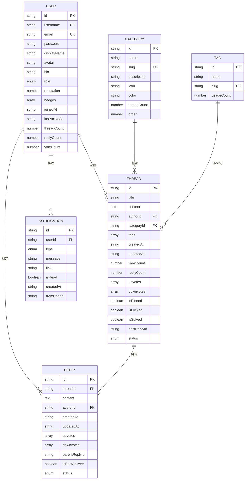

# 系统概览

<cite>
**本文引用的文件**
- [apps/forum/src/App.tsx](file://apps/forum/src/App.tsx)
- [apps/forum/package.json](file://apps/forum/package.json)
- [apps/forum/src/context/AuthContext.tsx](file://apps/forum/src/context/AuthContext.tsx)
- [apps/forum/src/context/ForumContext.tsx](file://apps/forum/src/context/ForumContext.tsx)
- [apps/forum/src/data/store.ts](file://apps/forum/src/data/store.ts)
- [apps/forum/src/types/index.ts](file://apps/forum/src/types/index.ts)
- [apps/forum/src/pages/HomePage.tsx](file://apps/forum/src/pages/HomePage.tsx)
- [apps/forum/src/components/layout/Header.tsx](file://apps/forum/src/components/layout/Header.tsx)
- [apps/forum/src/components/layout/Layout.tsx](file://apps/forum/src/components/layout/Layout.tsx)
- [apps/forum/src/pages/ThreadPage.tsx](file://apps/forum/src/pages/ThreadPage.tsx)
- [apps/forum/src/components/thread/ThreadCard.tsx](file://apps/forum/src/components/thread/ThreadCard.tsx)
- [apps/forum/src/components/reply/ReplyCard.tsx](file://apps/forum/src/components/reply/ReplyCard.tsx)
- [apps/forum/src/components/reply/ReplyForm.tsx](file://apps/forum/src/components/reply/ReplyForm.tsx)
- [apps/forum/src/components/layout/Sidebar.tsx](file://apps/forum/src/components/layout/Sidebar.tsx)
- [apps/forum/src/pages/CreateThreadPage.tsx](file://apps/forum/src/pages/CreateThreadPage.tsx)
</cite>

## 目录
1. [引言](#引言)
2. [项目结构](#项目结构)
3. [核心组件](#核心组件)
4. [架构总览](#架构总览)
5. [详细组件分析](#详细组件分析)
6. [依赖分析](#依赖分析)
7. [性能考量](#性能考量)
8. [故障排查指南](#故障排查指南)
9. [结论](#结论)
10. [附录](#附录)

## 引言
本概览面向初学者与开发者，系统性介绍社区论坛系统的设计理念、核心价值与技术架构。系统围绕“用户驱动的内容生产与互动”展开，提供用户管理、内容管理、交互功能（点赞、回复、最佳答案）、通知与权限控制等模块，并采用本地存储模拟数据持久化，便于演示与快速迭代。

## 项目结构
论坛应用位于 apps/forum，采用按功能域分层的组织方式：
- 页面层：HomePage、ThreadPage、CreateThreadPage 等
- 组件层：ThreadCard、ReplyCard、ReplyForm、Header、Sidebar 等
- 上下文层：AuthContext（认证）、ForumContext（论坛业务）
- 数据层：store（本地存储封装与种子数据）
- 类型定义：统一的领域模型（用户、主题、回复、分类、标签、通知等）

图表来源
- [apps/forum/src/App.tsx:1-49](file://apps/forum/src/App.tsx#L1-L49)
- [apps/forum/src/context/AuthContext.tsx:1-93](file://apps/forum/src/context/AuthContext.tsx#L1-L93)
- [apps/forum/src/context/ForumContext.tsx:1-313](file://apps/forum/src/context/ForumContext.tsx#L1-L313)
- [apps/forum/src/data/store.ts:1-399](file://apps/forum/src/data/store.ts#L1-L399)
- [apps/forum/src/types/index.ts:1-107](file://apps/forum/src/types/index.ts#L1-L107)
- [apps/forum/src/pages/HomePage.tsx:1-122](file://apps/forum/src/pages/HomePage.tsx#L1-L122)
- [apps/forum/src/pages/ThreadPage.tsx:1-272](file://apps/forum/src/pages/ThreadPage.tsx#L1-L272)
- [apps/forum/src/pages/CreateThreadPage.tsx:1-161](file://apps/forum/src/pages/CreateThreadPage.tsx#L1-L161)
- [apps/forum/src/components/layout/Layout.tsx:1-21](file://apps/forum/src/components/layout/Layout.tsx#L1-L21)
- [apps/forum/src/components/layout/Header.tsx:1-188](file://apps/forum/src/components/layout/Header.tsx#L1-L188)
- [apps/forum/src/components/layout/Sidebar.tsx:1-117](file://apps/forum/src/components/layout/Sidebar.tsx#L1-L117)
- [apps/forum/src/components/thread/ThreadCard.tsx:1-118](file://apps/forum/src/components/thread/ThreadCard.tsx#L1-L118)
- [apps/forum/src/components/reply/ReplyCard.tsx:1-118](file://apps/forum/src/components/reply/ReplyCard.tsx#L1-L118)
- [apps/forum/src/components/reply/ReplyForm.tsx:1-69](file://apps/forum/src/components/reply/ReplyForm.tsx#L1-L69)

章节来源
- [apps/forum/src/App.tsx:1-49](file://apps/forum/src/App.tsx#L1-L49)
- [apps/forum/package.json:1-36](file://apps/forum/package.json#L1-L36)

## 核心组件
- 认证上下文（AuthContext）：负责用户登录、注册、登出、资料更新；与本地存储交互，维护当前登录态。
- 论坛上下文（ForumContext）：封装主题与回复的增删改查、投票、最佳答案标记、通知管理、搜索与管理操作（置顶、锁定、隐藏）。
- 数据存储（store）：以 localStorage 为后端，提供 CRUD 与搜索方法；内置种子数据，初始化时重置并填充演示数据。
- 页面与组件：首页、主题详情页、发帖页；卡片与表单组件负责内容展示与交互。
- 类型系统：统一的领域模型，涵盖用户、主题、回复、分类、标签、通知与排序选项。

章节来源
- [apps/forum/src/context/AuthContext.tsx:1-93](file://apps/forum/src/context/AuthContext.tsx#L1-L93)
- [apps/forum/src/context/ForumContext.tsx:1-313](file://apps/forum/src/context/ForumContext.tsx#L1-L313)
- [apps/forum/src/data/store.ts:1-399](file://apps/forum/src/data/store.ts#L1-L399)
- [apps/forum/src/types/index.ts:1-107](file://apps/forum/src/types/index.ts#L1-L107)

## 架构总览
系统采用“上下文 + 本地存储”的轻量架构：
- 视图层通过 React Router 管理页面路由；
- 认证与论坛状态由 Context Provider 提供；
- 组件通过 Context API 读取与更新状态；
- 数据持久化通过 store 封装 localStorage；
- 类型定义集中于 types/index.ts，确保跨模块一致性。

图表来源
- [apps/forum/src/App.tsx:1-49](file://apps/forum/src/App.tsx#L1-L49)
- [apps/forum/src/context/AuthContext.tsx:1-93](file://apps/forum/src/context/AuthContext.tsx#L1-L93)
- [apps/forum/src/context/ForumContext.tsx:1-313](file://apps/forum/src/context/ForumContext.tsx#L1-L313)
- [apps/forum/src/data/store.ts:1-399](file://apps/forum/src/data/store.ts#L1-L399)
- [apps/forum/src/types/index.ts:1-107](file://apps/forum/src/types/index.ts#L1-L107)

## 详细组件分析

### 认证上下文（AuthContext）
职责
- 用户登录/注册/登出
- 当前用户状态维护
- 更新用户资料

实现要点
- 初始化时从 store 读取当前登录用户
- 登录校验用户名与密码，更新最后活跃时间
- 注册时去重用户名与邮箱，生成默认用户属性
- 更新资料直接保存至 store

图表来源
- [apps/forum/src/context/AuthContext.tsx:28-72](file://apps/forum/src/context/AuthContext.tsx#L28-L72)
- [apps/forum/src/data/store.ts:314-325](file://apps/forum/src/data/store.ts#L314-L325)
- [apps/forum/src/data/store.ts:383-388](file://apps/forum/src/data/store.ts#L383-L388)

章节来源
- [apps/forum/src/context/AuthContext.tsx:1-93](file://apps/forum/src/context/AuthContext.tsx#L1-L93)
- [apps/forum/src/data/store.ts:284-306](file://apps/forum/src/data/store.ts#L284-L306)

### 论坛上下文（ForumContext）
职责
- 主题与回复的创建、查询、删除
- 投票与最佳答案标记
- 通知的获取、标记已读、批量已读
- 搜索、管理操作（置顶、锁定、隐藏）

实现要点
- 通过 store 获取/保存主题、回复、通知
- 投票时自动清理重复投票并更新作者声望
- 创建回复后更新主题回复数与作者通知
- 最佳答案标记时清理旧最佳并奖励声望

图表来源
- [apps/forum/src/context/ForumContext.tsx:122-167](file://apps/forum/src/context/ForumContext.tsx#L122-L167)
- [apps/forum/src/context/ForumContext.tsx:169-190](file://apps/forum/src/context/ForumContext.tsx#L169-L190)
- [apps/forum/src/context/ForumContext.tsx:202-241](file://apps/forum/src/context/ForumContext.tsx#L202-L241)

章节来源
- [apps/forum/src/context/ForumContext.tsx:1-313](file://apps/forum/src/context/ForumContext.tsx#L1-L313)

### 数据存储（store）
职责
- 提供用户、主题、回复、分类、标签、通知的 CRUD
- 提供搜索与当前用户 ID 管理
- 初始化与重置种子数据

实现要点
- 使用 localStorage 作为唯一持久化介质
- 初始化时重置并写入种子数据，修正主题回复计数与分类计数
- 搜索线程时过滤状态为 active 的主题

图表来源
- [apps/forum/src/data/store.ts:284-306](file://apps/forum/src/data/store.ts#L284-L306)
- [apps/forum/src/data/store.ts:390-398](file://apps/forum/src/data/store.ts#L390-L398)

章节来源
- [apps/forum/src/data/store.ts:1-399](file://apps/forum/src/data/store.ts#L1-L399)

### 页面与组件交互

#### 首页（HomePage）
- 展示置顶优先的主题列表
- 支持按热度、最新、最高票、未回答排序
- 未登录用户显示引导按钮

章节来源
- [apps/forum/src/pages/HomePage.tsx:1-122](file://apps/forum/src/pages/HomePage.tsx#L1-L122)
- [apps/forum/src/components/thread/ThreadCard.tsx:1-118](file://apps/forum/src/components/thread/ThreadCard.tsx#L1-L118)

#### 主题详情（ThreadPage）
- 展示主题正文、作者、分类、标签、统计信息
- 支持移动端/桌面端投票按钮
- 回复列表支持按最高票/最新/最早排序
- 管理员/版主可置顶、锁定、隐藏主题；作者可删除

章节来源
- [apps/forum/src/pages/ThreadPage.tsx:1-272](file://apps/forum/src/pages/ThreadPage.tsx#L1-L272)
- [apps/forum/src/components/reply/ReplyCard.tsx:1-118](file://apps/forum/src/components/reply/ReplyCard.tsx#L1-L118)
- [apps/forum/src/components/reply/ReplyForm.tsx:1-69](file://apps/forum/src/components/reply/ReplyForm.tsx#L1-L69)

#### 发帖（CreateThreadPage）
- 标题、分类、标签、内容必填
- 标签最多选择5个
- 提交成功后跳转到新主题详情

章节来源
- [apps/forum/src/pages/CreateThreadPage.tsx:1-161](file://apps/forum/src/pages/CreateThreadPage.tsx#L1-L161)

#### 布局与导航（Layout/Header/Sidebar）
- Header 包含搜索、通知、用户菜单
- Sidebar 展示分类、热门标签与社区统计
- 移动端侧边栏抽屉式交互

章节来源
- [apps/forum/src/components/layout/Layout.tsx:1-21](file://apps/forum/src/components/layout/Layout.tsx#L1-L21)
- [apps/forum/src/components/layout/Header.tsx:1-188](file://apps/forum/src/components/layout/Header.tsx#L1-L188)
- [apps/forum/src/components/layout/Sidebar.tsx:1-117](file://apps/forum/src/components/layout/Sidebar.tsx#L1-L117)

## 依赖分析
- 技术栈
  - 前端：React 18、React Router 7、Tailwind CSS
  - 图标：Lucide React
  - UI 组件：@tao/ui
  - 构建：Vite、TypeScript
- 应用内依赖
  - @tao/shared：工具函数与格式化
  - @tao/ui：通用 UI 组件
- 项目内共享包
  - workspace:* 引用 monorepo 内部包

章节来源
- [apps/forum/package.json:1-36](file://apps/forum/package.json#L1-L36)

## 性能考量
- 本地存储限制
  - localStorage 为同步 API，适合小规模演示数据；大规模数据建议迁移到 IndexedDB 或服务端 API
  - 频繁读写需避免在渲染路径中触发大量重排
- 渲染优化
  - 使用 useMemo 缓存排序与筛选结果（如首页与主题页）
  - 列表项使用 key 保持稳定，减少重渲染
- 状态粒度
  - 将全局状态拆分为多个 Context，避免单一 Provider 造成大面积重渲染
- 资源加载
  - 图片懒加载、组件按需加载（路由级）可进一步优化首屏

## 故障排查指南
- 登录失败
  - 检查用户名是否存在与密码是否匹配
  - 确认 store 中当前用户 ID 是否正确设置
- 注册失败
  - 校验用户名与邮箱是否已被占用
- 投票无效
  - 确认用户已登录且未重复投票
  - 检查 store 中主题/回复的 upvotes/downvotes 是否更新
- 通知未显示
  - 确认当前用户存在且通知列表非空
  - 检查 markNotificationRead/markAllNotificationsRead 是否被调用
- 发帖/回复失败
  - 确认必填字段已填写
  - 检查 createThread/createReply 返回值与 toast 提示

章节来源
- [apps/forum/src/context/AuthContext.tsx:28-72](file://apps/forum/src/context/AuthContext.tsx#L28-L72)
- [apps/forum/src/context/ForumContext.tsx:122-167](file://apps/forum/src/context/ForumContext.tsx#L122-L167)
- [apps/forum/src/context/ForumContext.tsx:247-256](file://apps/forum/src/context/ForumContext.tsx#L247-L256)
- [apps/forum/src/data/store.ts:314-325](file://apps/forum/src/data/store.ts#L314-L325)

## 结论
本论坛系统以 React + Context + 本地存储为核心，实现了从用户认证到内容互动的闭环。其模块化设计与类型系统保证了可维护性，适合在演示阶段快速验证产品思路。随着业务演进，建议逐步引入服务端 API、IndexedDB、缓存与鉴权中间件，以提升性能与安全性。

## 附录

### 数据模型关系图

图表来源
- [apps/forum/src/types/index.ts:7-94](file://apps/forum/src/types/index.ts#L7-L94)
- [apps/forum/src/data/store.ts:10-130](file://apps/forum/src/data/store.ts#L10-L130)