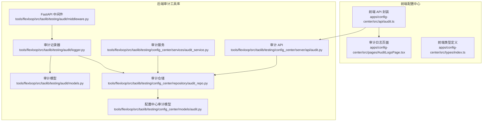
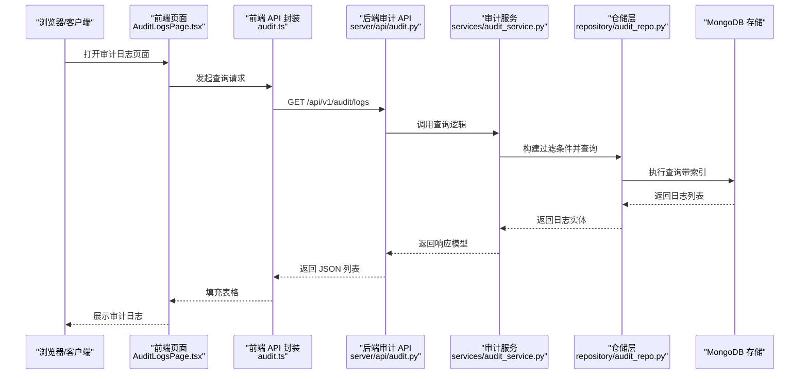
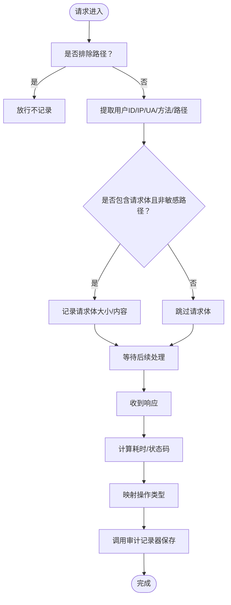
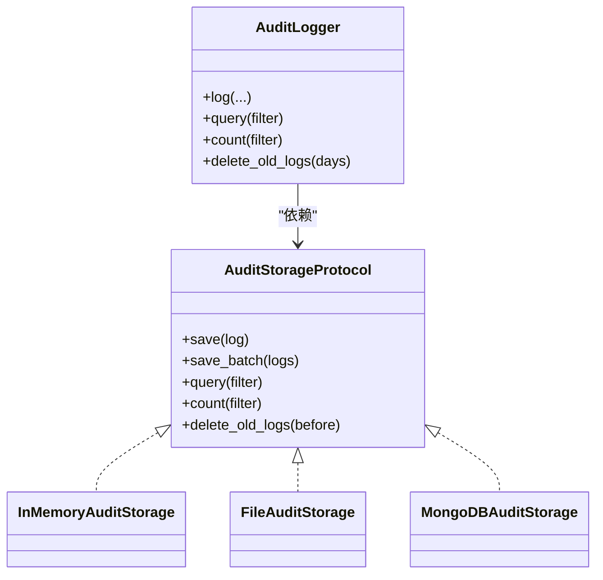
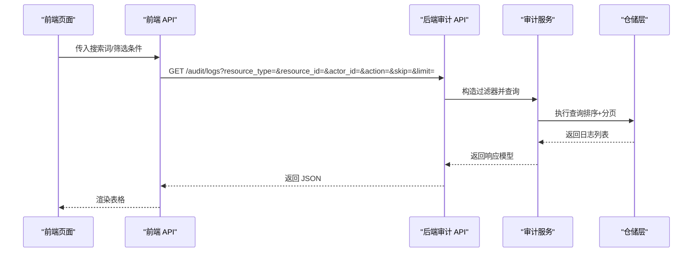
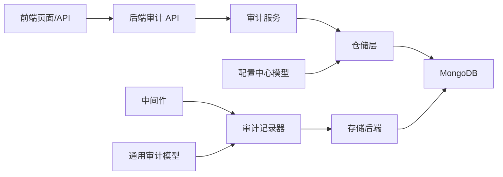

# 审计日志

<cite>
**本文引用的文件**
- [apps/config-center/src/api/audit.ts](file://apps/config-center/src/api/audit.ts)
- [apps/config-center/src/pages/AuditLogsPage.tsx](file://apps/config-center/src/pages/AuditLogsPage.tsx)
- [apps/config-center/src/types/index.ts](file://apps/config-center/src/types/index.ts)
- [tools/flexloop/src/taolib/testing/audit/models.py](file://tools/flexloop/src/taolib/testing/audit/models.py)
- [tools/flexloop/src/taolib/testing/audit/logger.py](file://tools/flexloop/src/taolib/testing/audit/logger.py)
- [tools/flexloop/src/taolib/testing/audit/middleware.py](file://tools/flexloop/src/taolib/testing/audit/middleware.py)
- [tools/flexloop/src/taolib/testing/config_center/models/audit.py](file://tools/flexloop/src/taolib/testing/config_center/models/audit.py)
- [tools/flexloop/src/taolib/testing/config_center/services/audit_service.py](file://tools/flexloop/src/taolib/testing/config_center/services/audit_service.py)
- [tools/flexloop/src/taolib/testing/config_center/server/api/audit.py](file://tools/flexloop/src/taolib/testing/config_center/server/api/audit.py)
- [tools/flexloop/src/taolib/testing/config_center/repository/audit_repo.py](file://tools/flexloop/src/taolib/testing/config_center/repository/audit_repo.py)
- [tools/flexloop/tests/testing/test_config_center/test_models_version_audit.py](file://tools/flexloop/tests/testing/test_config_center/test_models_version_audit.py)
</cite>

## 目录
1. [简介](#简介)
2. [项目结构](#项目结构)
3. [核心组件](#核心组件)
4. [架构总览](#架构总览)
5. [组件详解](#组件详解)
6. [依赖关系分析](#依赖关系分析)
7. [性能考量](#性能考量)
8. [故障排查指南](#故障排查指南)
9. [结论](#结论)
10. [附录](#附录)

## 简介
本文件为审计日志系统的详细技术文档，覆盖架构设计、实现原理、日志收集机制、存储策略、日志分类与事件类型、查询与导出能力、合规与隐私保护、以及分析与排障方法。系统同时包含前端可视化界面与后端 API、存储与中间件，形成从采集、记录、查询到归档的完整闭环。

## 项目结构
审计日志相关代码主要分布在两个层面：
- 前端配置中心应用：提供审计日志查询界面与基础类型定义
- 后端工具库（flexloop）：提供通用审计日志记录器、中间件、存储后端、服务层与 API

图表来源
- [apps/config-center/src/api/audit.ts:1-18](file://apps/config-center/src/api/audit.ts#L1-L18)
- [apps/config-center/src/pages/AuditLogsPage.tsx:1-162](file://apps/config-center/src/pages/AuditLogsPage.tsx#L1-L162)
- [tools/flexloop/src/taolib/testing/audit/middleware.py:1-275](file://tools/flexloop/src/taolib/testing/audit/middleware.py#L1-L275)
- [tools/flexloop/src/taolib/testing/audit/logger.py:470-747](file://tools/flexloop/src/taolib/testing/audit/logger.py#L470-L747)
- [tools/flexloop/src/taolib/testing/audit/models.py:1-199](file://tools/flexloop/src/taolib/testing/audit/models.py#L1-L199)
- [tools/flexloop/src/taolib/testing/config_center/services/audit_service.py:1-112](file://tools/flexloop/src/taolib/testing/config_center/services/audit_service.py#L1-L112)
- [tools/flexloop/src/taolib/testing/config_center/repository/audit_repo.py:1-103](file://tools/flexloop/src/taolib/testing/config_center/repository/audit_repo.py#L1-L103)
- [tools/flexloop/src/taolib/testing/config_center/server/api/audit.py:1-88](file://tools/flexloop/src/taolib/testing/config_center/server/api/audit.py#L1-L88)
- [tools/flexloop/src/taolib/testing/config_center/models/audit.py:1-85](file://tools/flexloop/src/taolib/testing/config_center/models/audit.py#L1-L85)

章节来源
- [apps/config-center/src/api/audit.ts:1-18](file://apps/config-center/src/api/audit.ts#L1-L18)
- [apps/config-center/src/pages/AuditLogsPage.tsx:1-162](file://apps/config-center/src/pages/AuditLogsPage.tsx#L1-L162)
- [apps/config-center/src/types/index.ts:75-91](file://apps/config-center/src/types/index.ts#L75-L91)
- [tools/flexloop/src/taolib/testing/audit/middleware.py:1-275](file://tools/flexloop/src/taolib/testing/audit/middleware.py#L1-L275)
- [tools/flexloop/src/taolib/testing/audit/logger.py:470-747](file://tools/flexloop/src/taolib/testing/audit/logger.py#L470-L747)
- [tools/flexloop/src/taolib/testing/audit/models.py:1-199](file://tools/flexloop/src/taolib/testing/audit/models.py#L1-L199)
- [tools/flexloop/src/taolib/testing/config_center/services/audit_service.py:1-112](file://tools/flexloop/src/taolib/testing/config_center/services/audit_service.py#L1-L112)
- [tools/flexloop/src/taolib/testing/config_center/server/api/audit.py:1-88](file://tools/flexloop/src/taolib/testing/config_center/server/api/audit.py#L1-L88)
- [tools/flexloop/src/taolib/testing/config_center/repository/audit_repo.py:1-103](file://tools/flexloop/src/taolib/testing/config_center/repository/audit_repo.py#L1-L103)
- [tools/flexloop/src/taolib/testing/config_center/models/audit.py:1-85](file://tools/flexloop/src/taolib/testing/config_center/models/audit.py#L1-L85)

## 核心组件
- 审计模型与枚举：统一定义操作类型、状态、日志条目、过滤器与响应模型
- 审计记录器：封装日志写入、批量写入、查询、计数与清理
- 存储后端：内存、文件、MongoDB 三种实现，满足不同环境需求
- FastAPI 中间件：自动采集请求上下文，生成 API 访问类审计日志
- 服务层与仓储层：面向配置中心的审计日志持久化与查询
- 前端 API 与页面：提供审计日志查询、筛选与详情展示

章节来源
- [tools/flexloop/src/taolib/testing/audit/models.py:14-199](file://tools/flexloop/src/taolib/testing/audit/models.py#L14-L199)
- [tools/flexloop/src/taolib/testing/audit/logger.py:470-747](file://tools/flexloop/src/taolib/testing/audit/logger.py#L470-L747)
- [tools/flexloop/src/taolib/testing/audit/middleware.py:101-275](file://tools/flexloop/src/taolib/testing/audit/middleware.py#L101-L275)
- [tools/flexloop/src/taolib/testing/config_center/models/audit.py:14-85](file://tools/flexloop/src/taolib/testing/config_center/models/audit.py#L14-L85)
- [tools/flexloop/src/taolib/testing/config_center/services/audit_service.py:13-112](file://tools/flexloop/src/taolib/testing/config_center/services/audit_service.py#L13-L112)
- [tools/flexloop/src/taolib/testing/config_center/server/api/audit.py:15-88](file://tools/flexloop/src/taolib/testing/config_center/server/api/audit.py#L15-L88)
- [apps/config-center/src/api/audit.ts:1-18](file://apps/config-center/src/api/audit.ts#L1-L18)
- [apps/config-center/src/pages/AuditLogsPage.tsx:11-162](file://apps/config-center/src/pages/AuditLogsPage.tsx#L11-L162)

## 架构总览
系统采用“中间件自动采集 + 业务侧显式记录”的双通道采集模式，统一通过审计记录器落库，并提供 REST API 与前端页面进行查询与展示。

图表来源
- [apps/config-center/src/pages/AuditLogsPage.tsx:18-31](file://apps/config-center/src/pages/AuditLogsPage.tsx#L18-L31)
- [apps/config-center/src/api/audit.ts:4-13](file://apps/config-center/src/api/audit.ts#L4-L13)
- [tools/flexloop/src/taolib/testing/config_center/server/api/audit.py:15-57](file://tools/flexloop/src/taolib/testing/config_center/server/api/audit.py#L15-L57)
- [tools/flexloop/src/taolib/testing/config_center/services/audit_service.py:73-109](file://tools/flexloop/src/taolib/testing/config_center/services/audit_service.py#L73-L109)
- [tools/flexloop/src/taolib/testing/config_center/repository/audit_repo.py:39-87](file://tools/flexloop/src/taolib/testing/config_center/repository/audit_repo.py#L39-L87)

## 组件详解

### 审计事件类型与分类规则
- 事件类型（后端通用模型）：创建、读取、更新、删除、登录、登出、登录失败、导出、导入、执行、访问
- 事件类型（配置中心专用）：配置创建、配置更新、配置删除、配置发布、配置回滚、用户登录、用户登出、角色分配
- 分类规则：
  - 用户操作日志：登录、登出、角色分配
  - 系统管理日志：配置创建、更新、删除、发布、回滚
  - 配置变更日志：配置更新（含旧值/新值对比）、发布、回滚
  - 安全事件日志：登录失败、访问异常

章节来源
- [tools/flexloop/src/taolib/testing/audit/models.py:14-28](file://tools/flexloop/src/taolib/testing/audit/models.py#L14-L28)
- [apps/config-center/src/types/index.ts:7-11](file://apps/config-center/src/types/index.ts#L7-L11)

### 日志记录内容字段
- 通用字段（后端模型）：唯一 ID、时间戳、用户 ID、操作类型、资源类型、资源 ID、详情、客户端 IP、User-Agent、状态、错误信息
- 配置中心字段：操作类型、资源类型、资源 ID、资源键、操作者 ID、操作者姓名、操作者 IP、旧值、新值、元数据、状态、时间戳
- 前端展示字段：操作、资源（键或 ID）、操作者、状态、时间；详情抽屉可查看旧值/新值

章节来源
- [tools/flexloop/src/taolib/testing/audit/models.py:37-68](file://tools/flexloop/src/taolib/testing/audit/models.py#L37-L68)
- [tools/flexloop/src/taolib/testing/config_center/models/audit.py:45-82](file://tools/flexloop/src/taolib/testing/config_center/models/audit.py#L45-L82)
- [apps/config-center/src/types/index.ts:77-91](file://apps/config-center/src/types/index.ts#L77-L91)
- [apps/config-center/src/pages/AuditLogsPage.tsx:37-76](file://apps/config-center/src/pages/AuditLogsPage.tsx#L37-L76)

### 日志收集机制
- 中间件自动采集：对 API 请求自动记录，提取用户 ID、IP、UA、方法、路径、状态码、耗时等，按方法映射为读取/创建/更新/删除/访问
- 业务侧显式记录：通过审计记录器在关键业务流程中调用，如配置变更、用户登录登出等

图表来源
- [tools/flexloop/src/taolib/testing/audit/middleware.py:178-247](file://tools/flexloop/src/taolib/testing/audit/middleware.py#L178-L247)
- [tools/flexloop/src/taolib/testing/audit/logger.py:498-553](file://tools/flexloop/src/taolib/testing/audit/logger.py#L498-L553)

章节来源
- [tools/flexloop/src/taolib/testing/audit/middleware.py:101-275](file://tools/flexloop/src/taolib/testing/audit/middleware.py#L101-L275)
- [tools/flexloop/src/taolib/testing/audit/logger.py:470-747](file://tools/flexloop/src/taolib/testing/audit/logger.py#L470-L747)

### 日志存储策略
- 内存存储：适用于开发/测试，有容量上限，超出则丢弃最旧
- 文件存储：以 JSON 数组持久化，支持上限裁剪
- MongoDB 存储：生产首选，支持索引与 TTL 自动清理，提供批量写入与查询

图表来源
- [tools/flexloop/src/taolib/testing/audit/logger.py:22-77](file://tools/flexloop/src/taolib/testing/audit/logger.py#L22-L77)
- [tools/flexloop/src/taolib/testing/audit/logger.py:79-184](file://tools/flexloop/src/taolib/testing/audit/logger.py#L79-L184)
- [tools/flexloop/src/taolib/testing/audit/logger.py:186-323](file://tools/flexloop/src/taolib/testing/audit/logger.py#L186-L323)
- [tools/flexloop/src/taolib/testing/audit/logger.py:325-468](file://tools/flexloop/src/taolib/testing/audit/logger.py#L325-L468)
- [tools/flexloop/src/taolib/testing/audit/logger.py:470-747](file://tools/flexloop/src/taolib/testing/audit/logger.py#L470-L747)

章节来源
- [tools/flexloop/src/taolib/testing/audit/logger.py:79-468](file://tools/flexloop/src/taolib/testing/audit/logger.py#L79-L468)

### 日志查询功能
- 前端查询：支持关键词搜索（资源名/键）、操作类型筛选、分页加载
- 后端查询：支持资源类型/ID、操作者 ID、操作类型、时间范围、分页参数
- 响应模型：统一包含 ID、时间戳、用户 ID、操作类型、资源类型/ID/键、详情、IP、UA、状态、错误信息（通用）或旧值/新值（配置中心）

图表来源
- [apps/config-center/src/pages/AuditLogsPage.tsx:18-31](file://apps/config-center/src/pages/AuditLogsPage.tsx#L18-L31)
- [apps/config-center/src/api/audit.ts:4-13](file://apps/config-center/src/api/audit.ts#L4-L13)
- [tools/flexloop/src/taolib/testing/config_center/server/api/audit.py:15-57](file://tools/flexloop/src/taolib/testing/config_center/server/api/audit.py#L15-L57)
- [tools/flexloop/src/taolib/testing/config_center/services/audit_service.py:73-109](file://tools/flexloop/src/taolib/testing/config_center/services/audit_service.py#L73-L109)
- [tools/flexloop/src/taolib/testing/config_center/repository/audit_repo.py:39-87](file://tools/flexloop/src/taolib/testing/config_center/repository/audit_repo.py#L39-L87)

章节来源
- [apps/config-center/src/pages/AuditLogsPage.tsx:11-162](file://apps/config-center/src/pages/AuditLogsPage.tsx#L11-L162)
- [apps/config-center/src/api/audit.ts:4-17](file://apps/config-center/src/api/audit.ts#L4-L17)
- [apps/config-center/src/types/index.ts:77-91](file://apps/config-center/src/types/index.ts#L77-L91)
- [tools/flexloop/src/taolib/testing/config_center/server/api/audit.py:15-88](file://tools/flexloop/src/taolib/testing/config_center/server/api/audit.py#L15-L88)
- [tools/flexloop/src/taolib/testing/config_center/services/audit_service.py:73-112](file://tools/flexloop/src/taolib/testing/config_center/services/audit_service.py#L73-L112)
- [tools/flexloop/src/taolib/testing/config_center/repository/audit_repo.py:39-103](file://tools/flexloop/src/taolib/testing/config_center/repository/audit_repo.py#L39-L103)

### 日志导出功能
- 前端当前能力：页面支持查看与详情抽屉，未见 CSV/PDF 导出按钮或下载接口
- 后端当前能力：未发现导出接口或批量下载实现
- 建议扩展：在后端审计 API 新增导出端点，支持 CSV/PDF；前端增加导出按钮与进度提示

章节来源
- [apps/config-center/src/pages/AuditLogsPage.tsx:11-162](file://apps/config-center/src/pages/AuditLogsPage.tsx#L11-L162)
- [tools/flexloop/src/taolib/testing/config_center/server/api/audit.py:15-88](file://tools/flexloop/src/taolib/testing/config_center/server/api/audit.py#L15-L88)

### 合规性要求与隐私保护
- 合规性：提供可追溯的操作记录，支持按时间、用户、资源、操作类型多维检索
- 隐私保护：中间件对敏感头（如授权、Cookie）进行脱敏；可配置是否记录请求体；TTL 自动清理历史数据
- 留存策略：仓储层默认 180 天自动过期清理；记录器支持按天数清理旧日志

章节来源
- [tools/flexloop/src/taolib/testing/audit/middleware.py:27-33](file://tools/flexloop/src/taolib/testing/audit/middleware.py#L27-L33)
- [tools/flexloop/src/taolib/testing/audit/middleware.py:86-98](file://tools/flexloop/src/taolib/testing/audit/middleware.py#L86-L98)
- [tools/flexloop/src/taolib/testing/config_center/repository/audit_repo.py:96-100](file://tools/flexloop/src/taolib/testing/config_center/repository/audit_repo.py#L96-L100)
- [tools/flexloop/src/taolib/testing/audit/logger.py:729-744](file://tools/flexloop/src/taolib/testing/audit/logger.py#L729-L744)

## 依赖关系分析
- 前端依赖后端 API，后端依赖服务层与仓储层，仓储层依赖 MongoDB
- 中间件依赖审计记录器；记录器依赖存储后端协议
- 配置中心模型与服务层解耦于通用审计模型，便于扩展其他领域

图表来源
- [apps/config-center/src/api/audit.ts:1-18](file://apps/config-center/src/api/audit.ts#L1-L18)
- [tools/flexloop/src/taolib/testing/config_center/server/api/audit.py:15-88](file://tools/flexloop/src/taolib/testing/config_center/server/api/audit.py#L15-L88)
- [tools/flexloop/src/taolib/testing/config_center/services/audit_service.py:13-112](file://tools/flexloop/src/taolib/testing/config_center/services/audit_service.py#L13-L112)
- [tools/flexloop/src/taolib/testing/config_center/repository/audit_repo.py:15-103](file://tools/flexloop/src/taolib/testing/config_center/repository/audit_repo.py#L15-L103)
- [tools/flexloop/src/taolib/testing/audit/middleware.py:101-275](file://tools/flexloop/src/taolib/testing/audit/middleware.py#L101-L275)
- [tools/flexloop/src/taolib/testing/audit/logger.py:470-747](file://tools/flexloop/src/taolib/testing/audit/logger.py#L470-L747)
- [tools/flexloop/src/taolib/testing/config_center/models/audit.py:14-85](file://tools/flexloop/src/taolib/testing/config_center/models/audit.py#L14-L85)
- [tools/flexloop/src/taolib/testing/audit/models.py:14-199](file://tools/flexloop/src/taolib/testing/audit/models.py#L14-L199)

章节来源
- [apps/config-center/src/api/audit.ts:1-18](file://apps/config-center/src/api/audit.ts#L1-L18)
- [tools/flexloop/src/taolib/testing/config_center/server/api/audit.py:15-88](file://tools/flexloop/src/taolib/testing/config_center/server/api/audit.py#L15-L88)
- [tools/flexloop/src/taolib/testing/config_center/services/audit_service.py:13-112](file://tools/flexloop/src/taolib/testing/config_center/services/audit_service.py#L13-L112)
- [tools/flexloop/src/taolib/testing/config_center/repository/audit_repo.py:15-103](file://tools/flexloop/src/taolib/testing/config_center/repository/audit_repo.py#L15-L103)
- [tools/flexloop/src/taolib/testing/audit/middleware.py:101-275](file://tools/flexloop/src/taolib/testing/audit/middleware.py#L101-L275)
- [tools/flexloop/src/taolib/testing/audit/logger.py:470-747](file://tools/flexloop/src/taolib/testing/audit/logger.py#L470-L747)
- [tools/flexloop/src/taolib/testing/config_center/models/audit.py:14-85](file://tools/flexloop/src/taolib/testing/config_center/models/audit.py#L14-L85)
- [tools/flexloop/src/taolib/testing/audit/models.py:14-199](file://tools/flexloop/src/taolib/testing/audit/models.py#L14-L199)

## 性能考量
- 查询性能：仓储层建立复合索引与 TTL 索引，支持按资源/时间快速检索
- 写入性能：支持批量写入（MongoDB），减少 IO 次数
- 存储成本：TTL 自动清理降低长期存储压力；内存/文件存储适合小规模场景
- 中间件开销：仅对非排除路径记录，敏感头脱敏，避免记录过大请求体

章节来源
- [tools/flexloop/src/taolib/testing/config_center/repository/audit_repo.py:89-100](file://tools/flexloop/src/taolib/testing/config_center/repository/audit_repo.py#L89-L100)
- [tools/flexloop/src/taolib/testing/audit/logger.py:367-384](file://tools/flexloop/src/taolib/testing/audit/logger.py#L367-L384)
- [tools/flexloop/src/taolib/testing/audit/middleware.py:17-33](file://tools/flexloop/src/taolib/testing/audit/middleware.py#L17-L33)
- [tools/flexloop/src/taolib/testing/audit/middleware.py:86-98](file://tools/flexloop/src/taolib/testing/audit/middleware.py#L86-L98)

## 故障排查指南
- 中间件异常：捕获记录异常并记录日志，不影响主请求链路
- 存储异常：MongoDB 存储在写入失败时抛出存储错误，需检查连接与权限
- 查询无结果：确认过滤条件（资源类型/ID、操作者、时间范围、分页参数）是否正确
- 数据缺失：检查是否被 TTL 自动清理；可通过调整保留天数或查询更早时间
- 前端报错：确认 API 返回结构与前端类型一致，检查网络与鉴权

章节来源
- [tools/flexloop/src/taolib/testing/audit/middleware.py:244-245](file://tools/flexloop/src/taolib/testing/audit/middleware.py#L244-L245)
- [tools/flexloop/src/taolib/testing/audit/logger.py:364-365](file://tools/flexloop/src/taolib/testing/audit/logger.py#L364-L365)
- [tools/flexloop/src/taolib/testing/config_center/server/api/audit.py:79-85](file://tools/flexloop/src/taolib/testing/config_center/server/api/audit.py#L79-L85)
- [tools/flexloop/src/taolib/testing/audit/logger.py:729-744](file://tools/flexloop/src/taolib/testing/audit/logger.py#L729-L744)
- [apps/config-center/src/api/audit.ts:15-17](file://apps/config-center/src/api/audit.ts#L15-L17)

## 结论
该审计日志系统具备完善的采集、记录、存储与查询能力，支持多环境部署与扩展。建议后续完善导出能力与更细粒度的权限控制，并持续优化索引与清理策略以平衡性能与合规。

## 附录
- 测试验证：包含审计日志响应模型与文档创建的单元测试，确保模型与序列化正确性

章节来源
- [tools/flexloop/tests/testing/test_config_center/test_models_version_audit.py:186-226](file://tools/flexloop/tests/testing/test_config_center/test_models_version_audit.py#L186-L226)