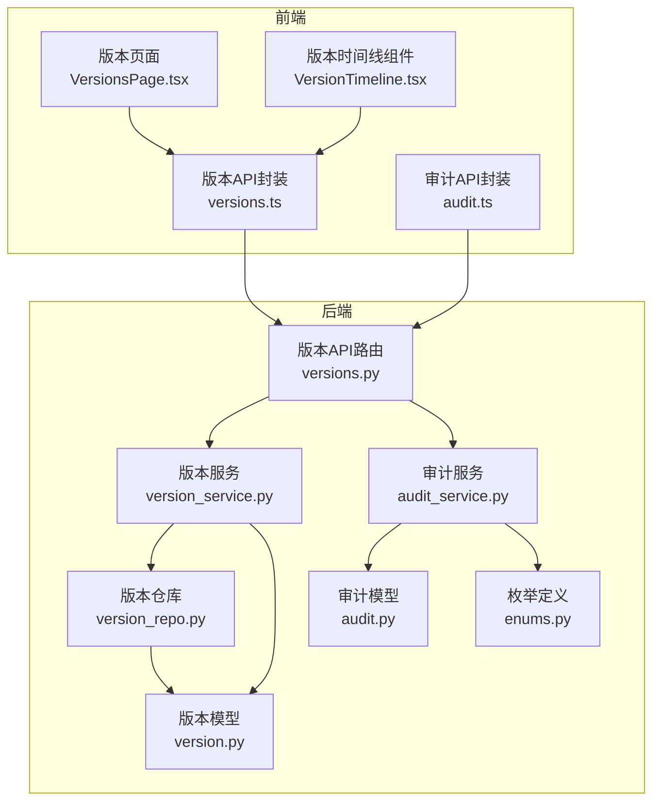
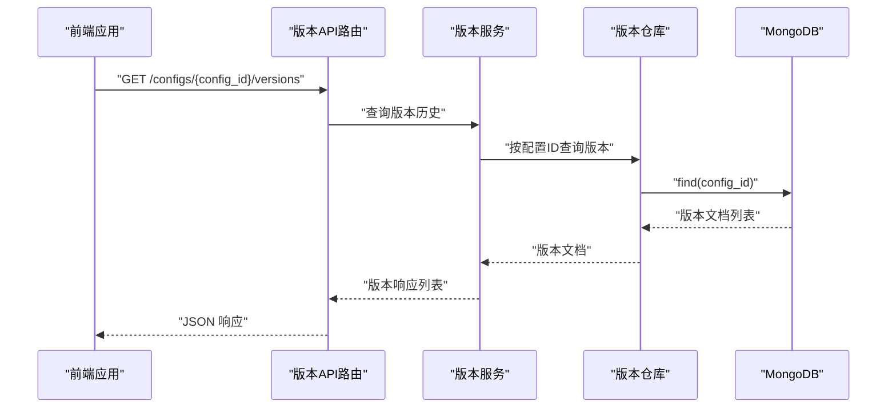
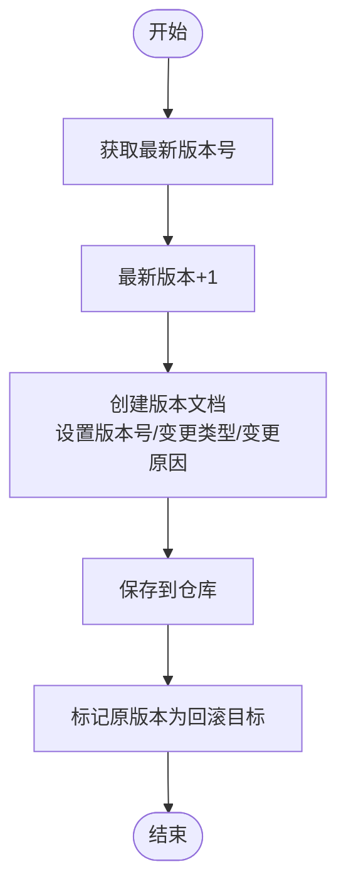
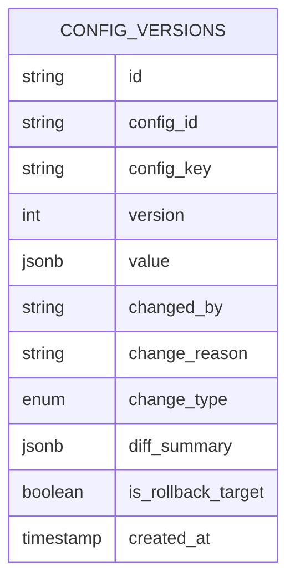
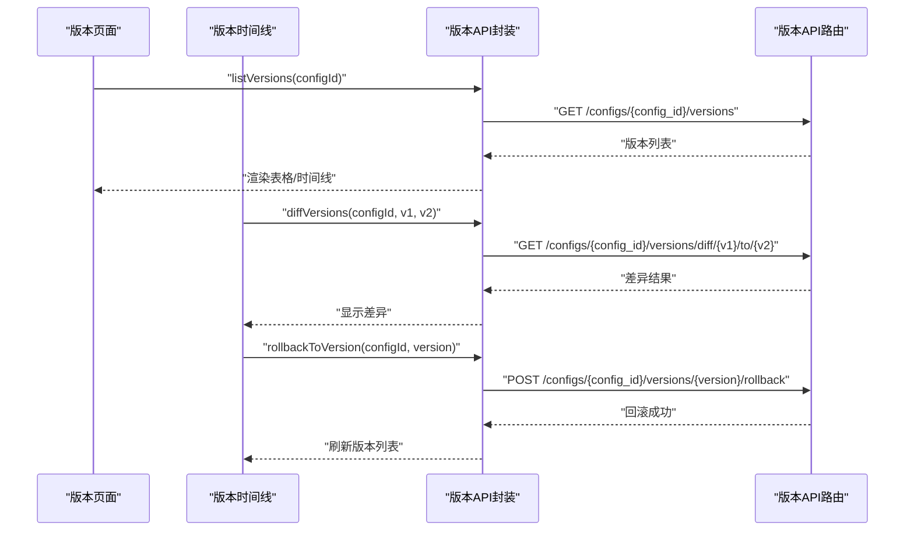
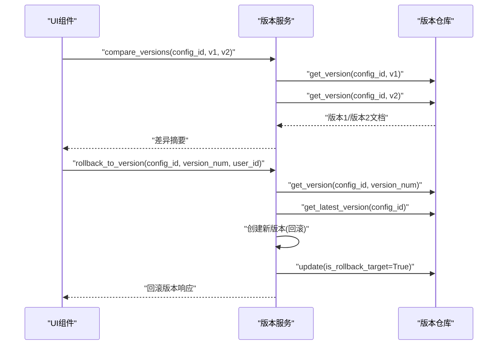
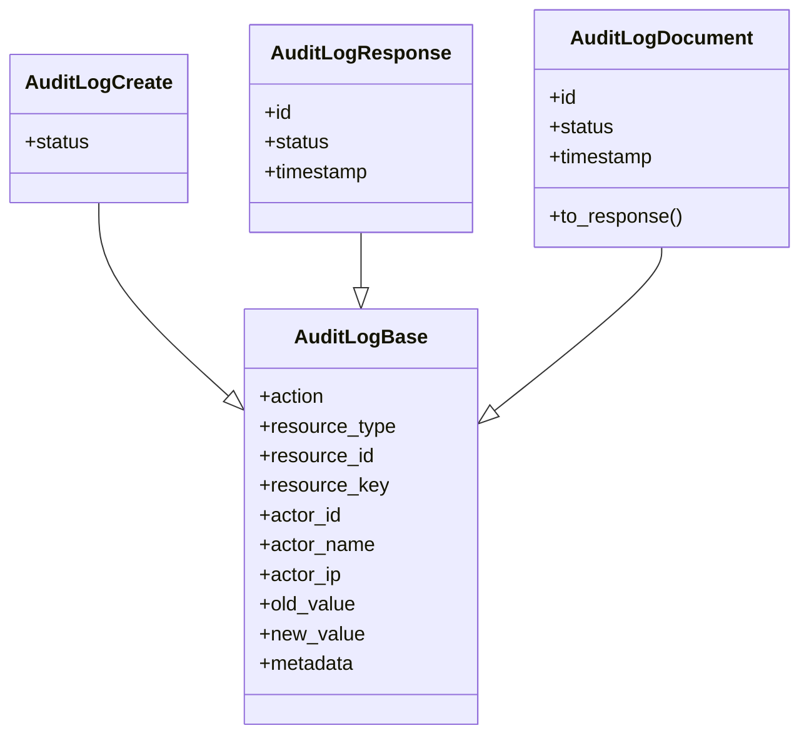
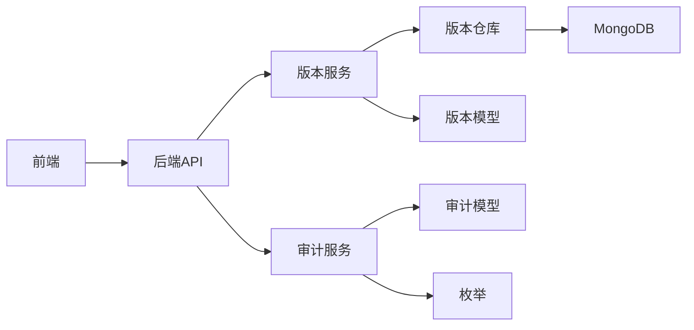

# 版本控制

<cite>
**本文引用的文件**
- [apps/config-center/src/api/versions.ts](file://apps/config-center/src/api/versions.ts)
- [apps/config-center/src/api/audit.ts](file://apps/config-center/src/api/audit.ts)
- [apps/config-center/src/components/version/VersionTimeline.tsx](file://apps/config-center/src/components/version/VersionTimeline.tsx)
- [apps/config-center/src/pages/VersionsPage.tsx](file://apps/config-center/src/pages/VersionsPage.tsx)
- [tools/flexloop/src/taolib/testing/config_center/models/version.py](file://tools/flexloop/src/taolib/testing/config_center/models/version.py)
- [tools/flexloop/src/taolib/testing/config_center/models/audit.py](file://tools/flexloop/src/taolib/testing/config_center/models/audit.py)
- [tools/flexloop/src/taolib/testing/config_center/models/enums.py](file://tools/flexloop/src/taolib/testing/config_center/models/enums.py)
- [tools/flexloop/src/taolib/testing/config_center/services/version_service.py](file://tools/flexloop/src/taolib/testing/config_center/services/version_service.py)
- [tools/flexloop/src/taolib/testing/config_center/services/audit_service.py](file://tools/flexloop/src/taolib/testing/config_center/services/audit_service.py)
- [tools/flexloop/src/taolib/testing/config_center/repository/version_repo.py](file://tools/flexloop/src/taolib/testing/config_center/repository/version_repo.py)
- [tools/flexloop/src/taolib/testing/config_center/server/api/versions.py](file://tools/flexloop/src/taolib/testing/config_center/server/api/versions.py)
- [tools/flexloop/src/taolib/testing/audit/logger.py](file://tools/flexloop/src/taolib/testing/audit/logger.py)
</cite>

## 目录
1. [简介](#简介)
2. [项目结构](#项目结构)
3. [核心组件](#核心组件)
4. [架构总览](#架构总览)
5. [组件详解](#组件详解)
6. [依赖关系分析](#依赖关系分析)
7. [性能考量](#性能考量)
8. [故障排查指南](#故障排查指南)
9. [结论](#结论)
10. [附录](#附录)

## 简介
本文件系统性阐述配置版本管理子系统的架构设计与实现原理，覆盖版本生成策略、版本号规则、版本存储机制；详细说明版本历史查看、版本差异对比、版本回滚流程；解释版本控制核心概念（创建触发条件、合并策略、冲突检测与解决）；提供完整的API接口规范（版本查询、版本比较、版本恢复）；介绍版本审计能力（变更记录、变更原因、责任人追踪）；并给出版本备份策略、版本清理机制与性能优化建议，以及最佳实践与常见问题解决方案。

## 项目结构
版本控制子系统由前端界面与后端服务两部分组成：
- 前端：提供版本历史查看、差异对比、回滚操作的交互界面与API封装
- 后端：提供REST API、版本服务、审计服务与MongoDB仓库层

图表来源
- [apps/config-center/src/pages/VersionsPage.tsx:1-136](file://apps/config-center/src/pages/VersionsPage.tsx#L1-L136)
- [apps/config-center/src/components/version/VersionTimeline.tsx:1-67](file://apps/config-center/src/components/version/VersionTimeline.tsx#L1-L67)
- [apps/config-center/src/api/versions.ts:1-29](file://apps/config-center/src/api/versions.ts#L1-L29)
- [apps/config-center/src/api/audit.ts:1-18](file://apps/config-center/src/api/audit.ts#L1-L18)
- [tools/flexloop/src/taolib/testing/config_center/server/api/versions.py:1-85](file://tools/flexloop/src/taolib/testing/config_center/server/api/versions.py#L1-L85)
- [tools/flexloop/src/taolib/testing/config_center/services/version_service.py:1-193](file://tools/flexloop/src/taolib/testing/config_center/services/version_service.py#L1-L193)
- [tools/flexloop/src/taolib/testing/config_center/services/audit_service.py:1-112](file://tools/flexloop/src/taolib/testing/config_center/services/audit_service.py#L1-L112)
- [tools/flexloop/src/taolib/testing/config_center/repository/version_repo.py:1-94](file://tools/flexloop/src/taolib/testing/config_center/repository/version_repo.py#L1-L94)
- [tools/flexloop/src/taolib/testing/config_center/models/version.py:1-79](file://tools/flexloop/src/taolib/testing/config_center/models/version.py#L1-L79)
- [tools/flexloop/src/taolib/testing/config_center/models/audit.py:1-85](file://tools/flexloop/src/taolib/testing/config_center/models/audit.py#L1-L85)
- [tools/flexloop/src/taolib/testing/config_center/models/enums.py:1-65](file://tools/flexloop/src/taolib/testing/config_center/models/enums.py#L1-L65)

章节来源
- [apps/config-center/src/pages/VersionsPage.tsx:1-136](file://apps/config-center/src/pages/VersionsPage.tsx#L1-L136)
- [apps/config-center/src/components/version/VersionTimeline.tsx:1-67](file://apps/config-center/src/components/version/VersionTimeline.tsx#L1-L67)
- [apps/config-center/src/api/versions.ts:1-29](file://apps/config-center/src/api/versions.ts#L1-L29)
- [apps/config-center/src/api/audit.ts:1-18](file://apps/config-center/src/api/audit.ts#L1-L18)
- [tools/flexloop/src/taolib/testing/config_center/server/api/versions.py:1-85](file://tools/flexloop/src/taolib/testing/config_center/server/api/versions.py#L1-L85)

## 核心组件
- 版本模型与响应：定义版本文档结构、创建与响应模型，包含版本号、变更类型、变更原因、差异摘要等字段
- 枚举体系：变更类型（创建/更新/删除/回滚）、审计动作与状态等
- 版本仓库：基于MongoDB的异步仓库，提供版本历史查询、指定版本获取、最新版本号查询与索引管理
- 版本服务：封装版本创建、历史查询、指定版本查询、版本回滚、版本差异比较等业务逻辑
- 审计模型与服务：定义审计日志结构与状态，提供日志记录与查询能力
- 前端API封装与UI组件：提供版本查询、差异对比、回滚调用的前端接口与可视化时间线
- 后端API路由：FastAPI路由，聚合版本与审计服务，暴露REST接口

章节来源
- [tools/flexloop/src/taolib/testing/config_center/models/version.py:1-79](file://tools/flexloop/src/taolib/testing/config_center/models/version.py#L1-L79)
- [tools/flexloop/src/taolib/testing/config_center/models/audit.py:1-85](file://tools/flexloop/src/taolib/testing/config_center/models/audit.py#L1-L85)
- [tools/flexloop/src/taolib/testing/config_center/models/enums.py:1-65](file://tools/flexloop/src/taolib/testing/config_center/models/enums.py#L1-L65)
- [tools/flexloop/src/taolib/testing/config_center/repository/version_repo.py:1-94](file://tools/flexloop/src/taolib/testing/config_center/repository/version_repo.py#L1-L94)
- [tools/flexloop/src/taolib/testing/config_center/services/version_service.py:1-193](file://tools/flexloop/src/taolib/testing/config_center/services/version_service.py#L1-L193)
- [tools/flexloop/src/taolib/testing/config_center/services/audit_service.py:1-112](file://tools/flexloop/src/taolib/testing/config_center/services/audit_service.py#L1-L112)
- [apps/config-center/src/api/versions.ts:1-29](file://apps/config-center/src/api/versions.ts#L1-L29)
- [apps/config-center/src/api/audit.ts:1-18](file://apps/config-center/src/api/audit.ts#L1-L18)

## 架构总览
版本控制采用分层架构：前端通过HTTP API与后端交互；后端以FastAPI路由为入口，调用版本服务与审计服务；版本服务通过版本仓库访问MongoDB；审计服务负责记录与查询审计日志。

图表来源
- [apps/config-center/src/api/versions.ts:1-29](file://apps/config-center/src/api/versions.ts#L1-L29)
- [tools/flexloop/src/taolib/testing/config_center/server/api/versions.py:1-85](file://tools/flexloop/src/taolib/testing/config_center/server/api/versions.py#L1-L85)
- [tools/flexloop/src/taolib/testing/config_center/services/version_service.py:1-193](file://tools/flexloop/src/taolib/testing/config_center/services/version_service.py#L1-L193)
- [tools/flexloop/src/taolib/testing/config_center/repository/version_repo.py:1-94](file://tools/flexloop/src/taolib/testing/config_center/repository/version_repo.py#L1-L94)

## 组件详解

### 版本生成策略与版本号规则
- 版本号生成：回滚流程会基于“最新版本+1”生成新版本号，确保版本号单调递增
- 变更类型：支持创建、更新、删除、回滚四种类型，用于区分版本来源与用途
- 差异摘要：可选字段，用于记录变更摘要，便于快速理解差异

图表来源
- [tools/flexloop/src/taolib/testing/config_center/services/version_service.py:116-157](file://tools/flexloop/src/taolib/testing/config_center/services/version_service.py#L116-L157)
- [tools/flexloop/src/taolib/testing/config_center/repository/version_repo.py:71-86](file://tools/flexloop/src/taolib/testing/config_center/repository/version_repo.py#L71-L86)

章节来源
- [tools/flexloop/src/taolib/testing/config_center/services/version_service.py:116-157](file://tools/flexloop/src/taolib/testing/config_center/services/version_service.py#L116-L157)
- [tools/flexloop/src/taolib/testing/config_center/models/enums.py:36-43](file://tools/flexloop/src/taolib/testing/config_center/models/enums.py#L36-L43)

### 版本存储机制
- 存储引擎：MongoDB
- 文档模型：包含配置ID、配置键、版本号、值、变更人、变更原因、变更类型、差异摘要、创建时间等
- 索引策略：复合索引（config_id, version）与单列索引（config_id），提升查询性能
- 数据一致性：通过服务层统一创建与更新，避免并发冲突导致的数据不一致

图表来源
- [tools/flexloop/src/taolib/testing/config_center/models/version.py:43-79](file://tools/flexloop/src/taolib/testing/config_center/models/version.py#L43-L79)
- [tools/flexloop/src/taolib/testing/config_center/repository/version_repo.py:88-92](file://tools/flexloop/src/taolib/testing/config_center/repository/version_repo.py#L88-L92)

章节来源
- [tools/flexloop/src/taolib/testing/config_center/repository/version_repo.py:1-94](file://tools/flexloop/src/taolib/testing/config_center/repository/version_repo.py#L1-L94)
- [tools/flexloop/src/taolib/testing/config_center/models/version.py:1-79](file://tools/flexloop/src/taolib/testing/config_center/models/version.py#L1-L79)

### 版本历史查看与UI交互
- 前端页面：提供配置选择、版本列表表格、搜索过滤
- 时间线组件：展示版本变更的时间轴，支持“与上一版本对比”“回滚到此版本”
- API封装：提供版本列表、指定版本详情、差异对比、回滚接口

图表来源
- [apps/config-center/src/pages/VersionsPage.tsx:1-136](file://apps/config-center/src/pages/VersionsPage.tsx#L1-L136)
- [apps/config-center/src/components/version/VersionTimeline.tsx:1-67](file://apps/config-center/src/components/version/VersionTimeline.tsx#L1-L67)
- [apps/config-center/src/api/versions.ts:1-29](file://apps/config-center/src/api/versions.ts#L1-L29)
- [tools/flexloop/src/taolib/testing/config_center/server/api/versions.py:1-85](file://tools/flexloop/src/taolib/testing/config_center/server/api/versions.py#L1-L85)

章节来源
- [apps/config-center/src/pages/VersionsPage.tsx:1-136](file://apps/config-center/src/pages/VersionsPage.tsx#L1-L136)
- [apps/config-center/src/components/version/VersionTimeline.tsx:1-67](file://apps/config-center/src/components/version/VersionTimeline.tsx#L1-L67)
- [apps/config-center/src/api/versions.ts:1-29](file://apps/config-center/src/api/versions.ts#L1-L29)

### 版本差异对比与回滚操作
- 差异对比：根据两个版本号查询对应版本，返回值与变更类型等关键信息
- 回滚流程：定位目标版本，计算新版本号，创建回滚版本，并标记原版本为“回滚目标”

图表来源
- [tools/flexloop/src/taolib/testing/config_center/services/version_service.py:159-191](file://tools/flexloop/src/taolib/testing/config_center/services/version_service.py#L159-L191)
- [tools/flexloop/src/taolib/testing/config_center/services/version_service.py:116-157](file://tools/flexloop/src/taolib/testing/config_center/services/version_service.py#L116-L157)
- [tools/flexloop/src/taolib/testing/config_center/repository/version_repo.py:46-86](file://tools/flexloop/src/taolib/testing/config_center/repository/version_repo.py#L46-L86)

章节来源
- [tools/flexloop/src/taolib/testing/config_center/services/version_service.py:159-191](file://tools/flexloop/src/taolib/testing/config_center/services/version_service.py#L159-L191)
- [tools/flexloop/src/taolib/testing/config_center/services/version_service.py:116-157](file://tools/flexloop/src/taolib/testing/config_center/services/version_service.py#L116-L157)

### 审计功能与责任人追踪
- 审计模型：包含操作类型、资源类型/ID/键、操作人ID/姓名/IP、变更前后值、元数据、状态与时间戳
- 审计服务：提供日志记录与查询接口，支持按资源、操作人、时间范围过滤
- 审计存储：提供内存与文件存储实现，便于测试与开发环境使用

图表来源
- [tools/flexloop/src/taolib/testing/config_center/models/audit.py:14-85](file://tools/flexloop/src/taolib/testing/config_center/models/audit.py#L14-L85)

章节来源
- [tools/flexloop/src/taolib/testing/config_center/models/audit.py:1-85](file://tools/flexloop/src/taolib/testing/config_center/models/audit.py#L1-L85)
- [tools/flexloop/src/taolib/testing/config_center/services/audit_service.py:1-112](file://tools/flexloop/src/taolib/testing/config_center/services/audit_service.py#L1-L112)
- [tools/flexloop/src/taolib/testing/audit/logger.py:79-294](file://tools/flexloop/src/taolib/testing/audit/logger.py#L79-L294)

### 版本控制核心概念
- 版本创建触发条件：配置创建、更新、删除、回滚均会产生新的版本
- 版本合并策略：当前实现为线性版本序列，未提供多分支合并；回滚通过创建新版本实现
- 冲突检测与解决：未内置自动冲突检测；可通过审计日志与差异对比进行人工判定与处理

章节来源
- [tools/flexloop/src/taolib/testing/config_center/models/enums.py:36-43](file://tools/flexloop/src/taolib/testing/config_center/models/enums.py#L36-L43)
- [tools/flexloop/src/taolib/testing/config_center/services/version_service.py:32-72](file://tools/flexloop/src/taolib/testing/config_center/services/version_service.py#L32-L72)

## 依赖关系分析
- 前端依赖后端API封装，后端路由依赖版本服务与审计服务
- 版本服务依赖版本仓库与审计服务
- 版本仓库依赖MongoDB集合与模型
- 审计服务依赖审计仓库与模型

图表来源
- [apps/config-center/src/api/versions.ts:1-29](file://apps/config-center/src/api/versions.ts#L1-L29)
- [apps/config-center/src/api/audit.ts:1-18](file://apps/config-center/src/api/audit.ts#L1-L18)
- [tools/flexloop/src/taolib/testing/config_center/server/api/versions.py:1-85](file://tools/flexloop/src/taolib/testing/config_center/server/api/versions.py#L1-L85)
- [tools/flexloop/src/taolib/testing/config_center/services/version_service.py:1-193](file://tools/flexloop/src/taolib/testing/config_center/services/version_service.py#L1-L193)
- [tools/flexloop/src/taolib/testing/config_center/services/audit_service.py:1-112](file://tools/flexloop/src/taolib/testing/config_center/services/audit_service.py#L1-L112)
- [tools/flexloop/src/taolib/testing/config_center/repository/version_repo.py:1-94](file://tools/flexloop/src/taolib/testing/config_center/repository/version_repo.py#L1-L94)
- [tools/flexloop/src/taolib/testing/config_center/models/version.py:1-79](file://tools/flexloop/src/taolib/testing/config_center/models/version.py#L1-L79)
- [tools/flexloop/src/taolib/testing/config_center/models/audit.py:1-85](file://tools/flexloop/src/taolib/testing/config_center/models/audit.py#L1-L85)
- [tools/flexloop/src/taolib/testing/config_center/models/enums.py:1-65](file://tools/flexloop/src/taolib/testing/config_center/models/enums.py#L1-L65)

章节来源
- [tools/flexloop/src/taolib/testing/config_center/server/api/versions.py:1-85](file://tools/flexloop/src/taolib/testing/config_center/server/api/versions.py#L1-L85)

## 性能考量
- 索引优化：版本仓库已建立（config_id, version）与（config_id）索引，建议在高并发场景下评估查询负载并监控慢查询
- 分页查询：后端API支持skip/limit参数，前端默认限制每页数量，避免一次性返回过多版本
- 缓存策略：后端依赖注入了缓存协议，可在生产环境中接入Redis等缓存以降低数据库压力
- 审计日志：内存与文件存储适合小规模测试，生产建议使用持久化存储并定期归档

章节来源
- [tools/flexloop/src/taolib/testing/config_center/repository/version_repo.py:88-92](file://tools/flexloop/src/taolib/testing/config_center/repository/version_repo.py#L88-L92)
- [apps/config-center/src/api/versions.ts:1-29](file://apps/config-center/src/api/versions.ts#L1-L29)
- [tools/flexloop/src/taolib/testing/audit/logger.py:79-294](file://tools/flexloop/src/taolib/testing/audit/logger.py#L79-L294)

## 故障排查指南
- 版本不存在：当查询指定版本或执行回滚时，若目标版本不存在，服务返回空；前端需提示用户并阻止无效操作
- 差异对比失败：任一版本缺失时返回空，需先确认版本号正确
- 审计日志查询：确认过滤参数（资源类型/ID、操作人、时间范围）是否正确
- 存储清理：审计日志提供删除旧日志方法，可用于定期清理过期日志释放空间

章节来源
- [tools/flexloop/src/taolib/testing/config_center/services/version_service.py:175-180](file://tools/flexloop/src/taolib/testing/config_center/services/version_service.py#L175-L180)
- [tools/flexloop/src/taolib/testing/config_center/services/audit_service.py:99-109](file://tools/flexloop/src/taolib/testing/config_center/services/audit_service.py#L99-L109)
- [tools/flexloop/src/taolib/testing/audit/logger.py:291-294](file://tools/flexloop/src/taolib/testing/audit/logger.py#L291-L294)

## 结论
该版本控制系统以清晰的分层架构实现了配置版本的历史管理、差异对比与回滚能力，并通过审计服务提供了完整的变更追踪。通过合理的索引与分页策略，系统具备良好的扩展性。建议在生产环境中引入缓存与持久化审计存储，并制定版本清理与备份策略以保障长期稳定运行。

## 附录

### API 接口规范

- 版本查询
  - 方法与路径：GET /api/v1/configs/{config_id}/versions
  - 查询参数：skip（跳过条数，默认0）、limit（限制条数，默认100）
  - 返回：版本数组（按版本号降序）

- 版本详情
  - 方法与路径：GET /api/v1/configs/{config_id}/versions/{version_num}
  - 返回：指定版本详情

- 版本差异对比
  - 方法与路径：GET /api/v1/configs/{config_id}/versions/diff/{v1}/to/{v2}
  - 返回：差异摘要（包含版本号、值、变更人、变更类型）

- 回滚到指定版本
  - 方法与路径：POST /api/v1/configs/{config_id}/versions/{version_num}/rollback
  - 返回：回滚结果（包含消息、配置ID、新版本号）

- 审计日志查询
  - 方法与路径：GET /api/v1/audit/logs
  - 查询参数：resource_type、resource_id、actor_id、action、skip、limit
  - 返回：审计日志数组

- 审计日志详情
  - 方法与路径：GET /api/v1/audit/logs/{log_id}
  - 返回：指定审计日志

章节来源
- [apps/config-center/src/api/versions.ts:1-29](file://apps/config-center/src/api/versions.ts#L1-L29)
- [apps/config-center/src/api/audit.ts:1-18](file://apps/config-center/src/api/audit.ts#L1-L18)
- [tools/flexloop/src/taolib/testing/config_center/server/api/versions.py:1-85](file://tools/flexloop/src/taolib/testing/config_center/server/api/versions.py#L1-L85)

### 版本备份策略与清理机制
- 备份策略：建议定期导出MongoDB集合或使用数据库快照工具进行全量/增量备份
- 清理机制：对审计日志定期删除过期日志，释放存储空间；版本历史可根据合规要求设定保留周期

章节来源
- [tools/flexloop/src/taolib/testing/audit/logger.py:67-76](file://tools/flexloop/src/taolib/testing/audit/logger.py#L67-L76)

### 最佳实践
- 强制填写变更原因：便于审计与追溯
- 使用回滚而非直接修改：保证历史可查
- 控制版本数量：通过limit与分页避免性能问题
- 审计日志分级：区分成功与失败状态，便于监控告警

章节来源
- [tools/flexloop/src/taolib/testing/config_center/models/version.py:22-24](file://tools/flexloop/src/taolib/testing/config_center/models/version.py#L22-L24)
- [tools/flexloop/src/taolib/testing/config_center/models/audit.py:32-40](file://tools/flexloop/src/taolib/testing/config_center/models/audit.py#L32-L40)