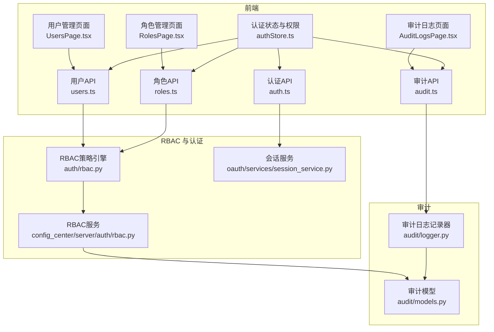
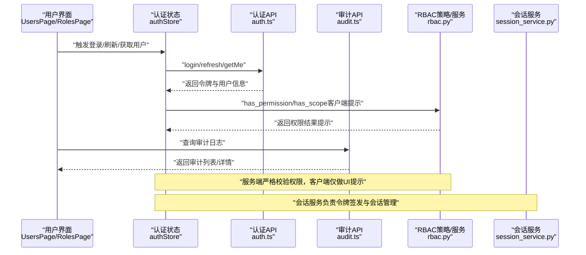
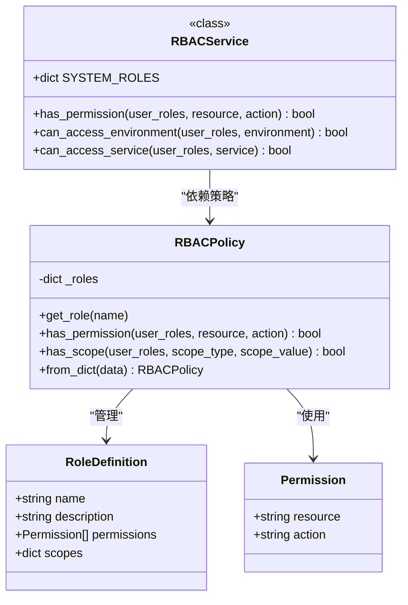
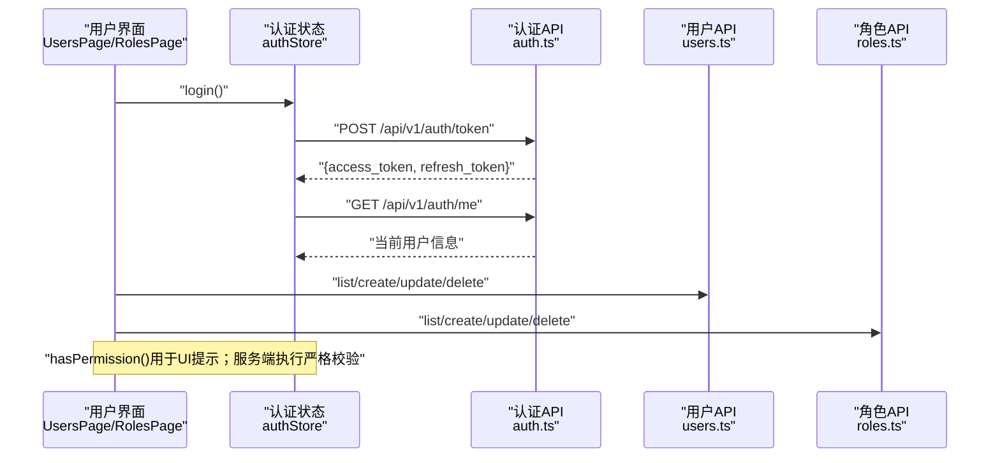
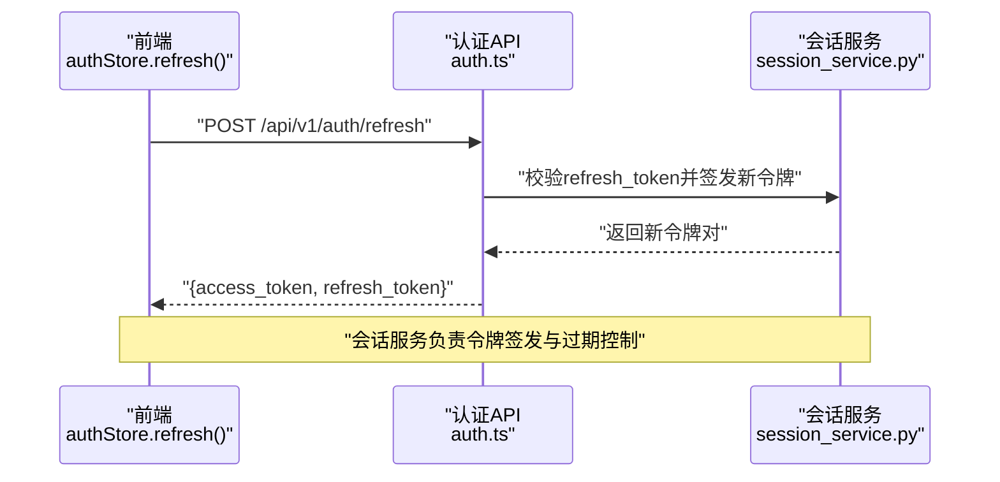
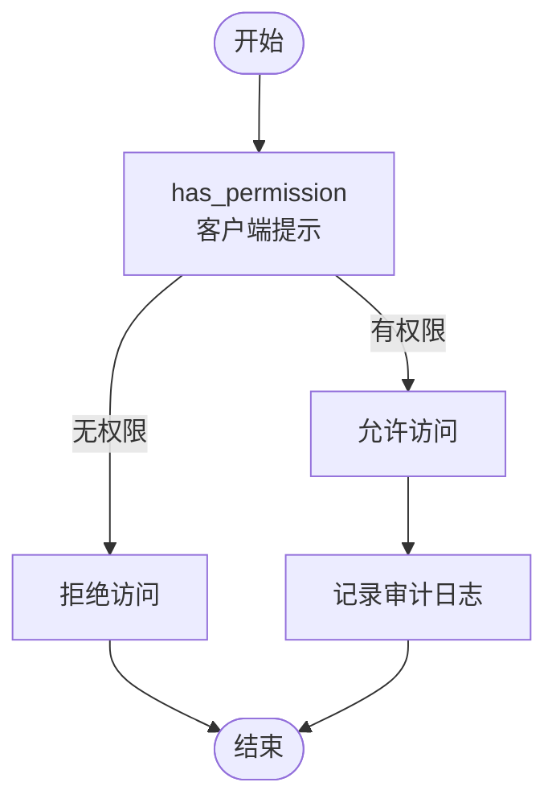
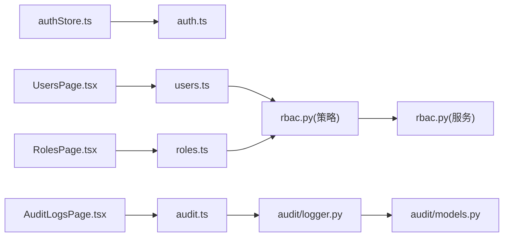

# 用户与角色管理

<cite>
**本文引用的文件**
- [rbac.py](file://tools/flexloop/src/taolib/testing/auth/rbac.py)
- [rbac.py](file://tools/flexloop/src/taolib/testing/config_center/server/auth/rbac.py)
- [rbac.py](file://tools/flexloop/tests/testing/test_auth/test_rbac.py)
- [rbac.py](file://tools/flexloop/tests/testing/test_config_center/test_auth.py)
- [auth.ts](file://apps/config-center/src/api/auth.ts)
- [users.ts](file://apps/config-center/src/api/users.ts)
- [roles.ts](file://apps/config-center/src/api/roles.ts)
- [authStore.ts](file://apps/config-center/src/store/authStore.ts)
- [UsersPage.tsx](file://apps/config-center/src/pages/UsersPage.tsx)
- [RolesPage.tsx](file://apps/config-center/src/pages/RolesPage.tsx)
- [audit.ts](file://apps/config-center/src/api/audit.ts)
- [AuditLogsPage.tsx](file://apps/config-center/src/pages/AuditLogsPage.tsx)
- [session_service.py](file://tools/flexloop/src/taolib/testing/oauth/services/session_service.py)
- [test_services.py](file://tools/flexloop/tests/testing/test_oauth/test_services/test_services.py)
- [models.py](file://tools/flexloop/src/taolib/testing/audit/models.py)
- [logger.py](file://tools/flexloop/src/taolib/testing/audit/logger.py)
- [AuthContext.tsx](file://apps/forum/src/context/AuthContext.tsx)
</cite>

## 目录
1. [简介](#简介)
2. [项目结构](#项目结构)
3. [核心组件](#核心组件)
4. [架构总览](#架构总览)
5. [详细组件分析](#详细组件分析)
6. [依赖关系分析](#依赖关系分析)
7. [性能考量](#性能考量)
8. [故障排除指南](#故障排除指南)
9. [结论](#结论)
10. [附录](#附录)

## 简介
本文件面向“用户与角色管理”功能，系统性阐述基于角色的访问控制（RBAC）模型在本仓库中的实现与应用，覆盖用户管理（注册、编辑、状态管理、密码重置）、角色管理（创建、权限分配、继承、动态调整）、认证与会话（登录、令牌刷新、会话管理）、细粒度权限控制与缓存策略、以及审计与高级功能（导入导出、批量操作、权限审计）。文档同时提供可视化图示与可追溯的来源标注，帮助读者快速理解与落地。

## 项目结构
围绕用户与角色管理的关键目录与文件如下：
- RBAC 核心与策略
  - 通用 RBAC 策略引擎：tools/flexloop/src/taolib/testing/auth/rbac.py
  - 配置中心 RBAC 服务：tools/flexloop/src/taolib/testing/config_center/server/auth/rbac.py
  - RBAC 测试：tools/flexloop/tests/testing/test_auth/test_rbac.py、tools/flexloop/tests/testing/test_config_center/test_auth.py
- 前端用户与角色管理界面
  - 用户 API：apps/config-center/src/api/users.ts
  - 角色 API：apps/config-center/src/api/roles.ts
  - 认证 API：apps/config-center/src/api/auth.ts
  - 认证状态与权限判断：apps/config-center/src/store/authStore.ts
  - 用户管理页面：apps/config-center/src/pages/UsersPage.tsx
  - 角色管理页面：apps/config-center/src/pages/RolesPage.tsx
  - 审计日志 API：apps/config-center/src/api/audit.ts
  - 审计日志页面：apps/config-center/src/pages/AuditLogsPage.tsx
- 会话与认证（后端示例）
  - OAuth 会话服务：tools/flexloop/src/taolib/testing/oauth/services/session_service.py
  - 会话服务测试：tools/flexloop/tests/testing/test_oauth/test_services/test_services.py
- 审计模型与日志记录
  - 审计模型：tools/flexloop/src/taolib/testing/audit/models.py
  - 审计日志记录器：tools/flexloop/src/taolib/testing/audit/logger.py
- 示例前端认证上下文
  - 论坛应用认证上下文：apps/forum/src/context/AuthContext.tsx

图表来源
- [UsersPage.tsx:1-164](file://apps/config-center/src/pages/UsersPage.tsx#L1-L164)
- [RolesPage.tsx:1-170](file://apps/config-center/src/pages/RolesPage.tsx#L1-L170)
- [authStore.ts:1-108](file://apps/config-center/src/store/authStore.ts#L1-L108)
- [users.ts:1-26](file://apps/config-center/src/api/users.ts#L1-L26)
- [roles.ts:1-26](file://apps/config-center/src/api/roles.ts#L1-L26)
- [auth.ts:1-15](file://apps/config-center/src/api/auth.ts#L1-L15)
- [audit.ts:1-18](file://apps/config-center/src/api/audit.ts#L1-L18)
- [rbac.py:1-160](file://tools/flexloop/src/taolib/testing/auth/rbac.py#L1-L160)
- [rbac.py:1-162](file://tools/flexloop/src/taolib/testing/config_center/server/auth/rbac.py#L1-L162)
- [session_service.py:83-126](file://tools/flexloop/src/taolib/testing/oauth/services/session_service.py#L83-L126)
- [models.py:1-56](file://tools/flexloop/src/taolib/testing/audit/models.py#L1-L56)
- [logger.py:514-558](file://tools/flexloop/src/taolib/testing/audit/logger.py#L514-L558)

章节来源
- [UsersPage.tsx:1-164](file://apps/config-center/src/pages/UsersPage.tsx#L1-L164)
- [RolesPage.tsx:1-170](file://apps/config-center/src/pages/RolesPage.tsx#L1-L170)
- [authStore.ts:1-108](file://apps/config-center/src/store/authStore.ts#L1-L108)
- [users.ts:1-26](file://apps/config-center/src/api/users.ts#L1-L26)
- [roles.ts:1-26](file://apps/config-center/src/api/roles.ts#L1-L26)
- [auth.ts:1-15](file://apps/config-center/src/api/auth.ts#L1-L15)
- [audit.ts:1-18](file://apps/config-center/src/api/audit.ts#L1-L18)
- [rbac.py:1-160](file://tools/flexloop/src/taolib/testing/auth/rbac.py#L1-L160)
- [rbac.py:1-162](file://tools/flexloop/src/taolib/testing/config_center/server/auth/rbac.py#L1-L162)
- [session_service.py:83-126](file://tools/flexloop/src/taolib/testing/oauth/services/session_service.py#L83-L126)
- [models.py:1-56](file://tools/flexloop/src/taolib/testing/audit/models.py#L1-L56)
- [logger.py:514-558](file://tools/flexloop/src/taolib/testing/audit/logger.py#L514-L558)

## 核心组件
- RBAC 策略引擎（通用）
  - 提供权限与作用域的判定能力，支持从字典构建策略，便于与系统角色定义对接。
- RBAC 服务（配置中心）
  - 维护系统角色集与默认权限矩阵，提供环境与服务维度的访问控制。
- 前端认证与权限
  - 认证状态持久化与令牌刷新；客户端侧权限提示（非安全边界）。
- 用户与角色 API
  - 提供用户与角色的增删改查接口，支撑管理界面。
- 会话服务（示例）
  - 生成访问令牌与刷新令牌，维护会话生命周期与活动状态。
- 审计日志
  - 记录关键操作与变更，支持查询与详情展示。

章节来源
- [rbac.py:41-158](file://tools/flexloop/src/taolib/testing/auth/rbac.py#L41-L158)
- [rbac.py:11-162](file://tools/flexloop/src/taolib/testing/config_center/server/auth/rbac.py#L11-L162)
- [authStore.ts:20-107](file://apps/config-center/src/store/authStore.ts#L20-L107)
- [users.ts:1-26](file://apps/config-center/src/api/users.ts#L1-L26)
- [roles.ts:1-26](file://apps/config-center/src/api/roles.ts#L1-L26)
- [session_service.py:83-126](file://tools/flexloop/src/taolib/testing/oauth/services/session_service.py#L83-L126)
- [models.py:37-56](file://tools/flexloop/src/taolib/testing/audit/models.py#L37-L56)

## 架构总览
下图展示了从前端到后端的用户与角色管理调用链路，以及 RBAC 权限检查与审计日志的交互。

图表来源
- [authStore.ts:29-95](file://apps/config-center/src/store/authStore.ts#L29-L95)
- [auth.ts:4-14](file://apps/config-center/src/api/auth.ts#L4-L14)
- [audit.ts:4-17](file://apps/config-center/src/api/audit.ts#L4-L17)
- [rbac.py:64-115](file://tools/flexloop/src/taolib/testing/auth/rbac.py#L64-L115)
- [session_service.py:99-125](file://tools/flexloop/src/taolib/testing/oauth/services/session_service.py#L99-L125)

## 详细组件分析

### RBAC 策略引擎与服务
- 设计要点
  - 权限与作用域解耦：通过 Permission 与 RoleDefinition 抽象角色与权限集合。
  - 字典构建：from_dict 支持从系统角色数据结构直接构建策略，兼容现有配置中心角色定义。
  - 多角色合并：has_permission 与 has_scope 对用户所拥有的多个角色进行合并判断。
- 关键方法
  - has_permission(user_roles, resource, action)：判断是否具备某资源的某操作权限。
  - has_scope(user_roles, scope_type, scope_value)：判断是否在指定作用域内。
  - from_dict(data)：从字典构建策略，自动解析作用域字段。
- 配置中心服务扩展
  - 提供 SYSTEM_ROLES 常量，内置超管、配置管理员、编辑、查看、审计等角色。
  - has_permission、can_access_environment、can_access_service 用于环境与服务维度的访问控制。

图表来源
- [rbac.py:10-158](file://tools/flexloop/src/taolib/testing/auth/rbac.py#L10-L158)
- [rbac.py:11-162](file://tools/flexloop/src/taolib/testing/config_center/server/auth/rbac.py#L11-L162)

章节来源
- [rbac.py:41-158](file://tools/flexloop/src/taolib/testing/auth/rbac.py#L41-L158)
- [rbac.py:11-162](file://tools/flexloop/src/taolib/testing/config_center/server/auth/rbac.py#L11-L162)
- [rbac.py:34-184](file://tools/flexloop/tests/testing/test_auth/test_rbac.py#L34-L184)
- [rbac.py:177-283](file://tools/flexloop/tests/testing/test_config_center/test_auth.py#L177-L283)

### 前端认证与权限控制
- 登录与令牌刷新
  - 使用 API 登录获取 access_token 与 refresh_token，并持久化存储。
  - 刷新令牌失败时自动登出，确保状态一致性。
- 权限提示（客户端）
  - 若用户包含“超级管理员”角色，则前端默认放行相关 UI 操作（仅提示，非安全边界）。
  - 非超级管理员时，默认放行以避免 UI 阻断，实际权限由服务端强制校验。
- 用户与角色管理界面
  - 用户列表、搜索、创建、编辑、删除；角色列表、搜索、创建、编辑、删除。
  - 通过 API 层调用后端接口完成数据操作。

图表来源
- [authStore.ts:29-95](file://apps/config-center/src/store/authStore.ts#L29-L95)
- [auth.ts:4-14](file://apps/config-center/src/api/auth.ts#L4-L14)
- [users.ts:4-25](file://apps/config-center/src/api/users.ts#L4-L25)
- [roles.ts:4-25](file://apps/config-center/src/api/roles.ts#L4-L25)
- [UsersPage.tsx:19-75](file://apps/config-center/src/pages/UsersPage.tsx#L19-L75)
- [RolesPage.tsx:19-75](file://apps/config-center/src/pages/RolesPage.tsx#L19-L75)

章节来源
- [authStore.ts:20-107](file://apps/config-center/src/store/authStore.ts#L20-L107)
- [auth.ts:1-15](file://apps/config-center/src/api/auth.ts#L1-L15)
- [users.ts:1-26](file://apps/config-center/src/api/users.ts#L1-L26)
- [roles.ts:1-26](file://apps/config-center/src/api/roles.ts#L1-L26)
- [UsersPage.tsx:1-164](file://apps/config-center/src/pages/UsersPage.tsx#L1-L164)
- [RolesPage.tsx:1-170](file://apps/config-center/src/pages/RolesPage.tsx#L1-L170)

### 会话管理与令牌刷新
- 令牌生成
  - 会话服务根据用户身份与角色生成访问令牌与刷新令牌，并设置过期时间。
- 会话验证与撤销
  - 支持验证会话有效性、撤销单个会话、撤销用户所有会话、列出活跃会话。
- 与前端刷新流程衔接
  - 前端通过 refresh 接口传入 refresh_token 获取新的 access_token 与 refresh_token。

图表来源
- [authStore.ts:57-73](file://apps/config-center/src/store/authStore.ts#L57-L73)
- [auth.ts:8-10](file://apps/config-center/src/api/auth.ts#L8-L10)
- [session_service.py:99-125](file://tools/flexloop/src/taolib/testing/oauth/services/session_service.py#L99-L125)
- [test_services.py:208-248](file://tools/flexloop/tests/testing/test_oauth/test_services/test_services.py#L208-L248)

章节来源
- [session_service.py:83-126](file://tools/flexloop/src/taolib/testing/oauth/services/session_service.py#L83-L126)
- [test_services.py:208-248](file://tools/flexloop/tests/testing/test_oauth/test_services/test_services.py#L208-L248)
- [authStore.ts:57-73](file://apps/config-center/src/store/authStore.ts#L57-L73)
- [auth.ts:8-10](file://apps/config-center/src/api/auth.ts#L8-L10)

### 权限控制与审计
- 权限检查机制
  - 客户端 has_permission 作为 UI 提示；服务端严格校验（RBAC 策略引擎与服务）。
  - 支持按资源与动作的细粒度权限控制，以及按环境与服务的作用域控制。
- 审计日志
  - 审计模型定义了操作类型、状态、资源等字段；日志记录器负责持久化与异常处理。
  - 前端提供审计日志查询与详情展示页面，支持按操作类型过滤与关键词搜索。

图表来源
- [rbac.py:64-87](file://tools/flexloop/src/taolib/testing/auth/rbac.py#L64-L87)
- [models.py:37-56](file://tools/flexloop/src/taolib/testing/audit/models.py#L37-L56)
- [logger.py:526-553](file://tools/flexloop/src/taolib/testing/audit/logger.py#L526-L553)

章节来源
- [rbac.py:64-115](file://tools/flexloop/src/taolib/testing/auth/rbac.py#L64-L115)
- [audit.ts:4-17](file://apps/config-center/src/api/audit.ts#L4-L17)
- [AuditLogsPage.tsx:18-35](file://apps/config-center/src/pages/AuditLogsPage.tsx#L18-L35)
- [models.py:14-56](file://tools/flexloop/src/taolib/testing/audit/models.py#L14-L56)
- [logger.py:514-558](file://tools/flexloop/src/taolib/testing/audit/logger.py#L514-L558)

### 用户与角色管理界面
- 用户管理
  - 支持分页查询、搜索、创建、编辑、删除；展示状态、最后登录时间等信息。
- 角色管理
  - 支持分页查询、搜索、创建、编辑、删除；系统角色不可编辑或删除。
- 审计日志
  - 支持按资源、操作类型、时间范围查询；详情抽屉展示旧值与新值对比。

章节来源
- [UsersPage.tsx:11-163](file://apps/config-center/src/pages/UsersPage.tsx#L11-L163)
- [RolesPage.tsx:11-169](file://apps/config-center/src/pages/RolesPage.tsx#L11-L169)
- [audit.ts:1-18](file://apps/config-center/src/api/audit.ts#L1-L18)
- [AuditLogsPage.tsx:1-162](file://apps/config-center/src/pages/AuditLogsPage.tsx#L1-L162)

### 密码重置流程（概念说明）
- 前端交互
  - 在登录页或设置页触发“忘记密码”，进入重置流程。
- 后端流程（示意）
  - 校验用户存在性与安全问题回答（如有）。
  - 发送重置邮件/短信，生成一次性令牌。
  - 使用令牌更新用户密码，失效令牌。
- 安全建议
  - 令牌时效短、单次有效；记录重置审计事件；重置后强制退出其他会话。

（本节为概念性说明，不直接分析具体文件）

## 依赖关系分析
- 组件耦合
  - 前端 authStore 依赖认证 API；用户与角色页面依赖对应 API；审计页面依赖审计 API。
  - RBAC 策略引擎与服务相互协作，RBAC 服务依赖策略引擎的判定能力。
  - 审计日志记录器依赖审计模型，前端审计页面依赖审计 API。
- 外部依赖
  - 前端使用 zustand/persist 进行状态持久化；使用 UI 组件库与工具库。
  - 后端会话服务使用 JWT 生成与过期控制。

图表来源
- [authStore.ts:4-16](file://apps/config-center/src/store/authStore.ts#L4-L16)
- [auth.ts:1-15](file://apps/config-center/src/api/auth.ts#L1-L15)
- [users.ts:1-26](file://apps/config-center/src/api/users.ts#L1-L26)
- [roles.ts:1-26](file://apps/config-center/src/api/roles.ts#L1-L26)
- [audit.ts:1-18](file://apps/config-center/src/api/audit.ts#L1-L18)
- [rbac.py:41-158](file://tools/flexloop/src/taolib/testing/auth/rbac.py#L41-L158)
- [rbac.py:11-162](file://tools/flexloop/src/taolib/testing/config_center/server/auth/rbac.py#L11-L162)
- [logger.py:514-558](file://tools/flexloop/src/taolib/testing/audit/logger.py#L514-L558)
- [models.py:37-56](file://tools/flexloop/src/taolib/testing/audit/models.py#L37-L56)

章节来源
- [authStore.ts:1-108](file://apps/config-center/src/store/authStore.ts#L1-L108)
- [users.ts:1-26](file://apps/config-center/src/api/users.ts#L1-L26)
- [roles.ts:1-26](file://apps/config-center/src/api/roles.ts#L1-L26)
- [audit.ts:1-18](file://apps/config-center/src/api/audit.ts#L1-L18)
- [rbac.py:1-160](file://tools/flexloop/src/taolib/testing/auth/rbac.py#L1-L160)
- [rbac.py:1-162](file://tools/flexloop/src/taolib/testing/config_center/server/auth/rbac.py#L1-L162)
- [logger.py:514-558](file://tools/flexloop/src/taolib/testing/audit/logger.py#L514-L558)
- [models.py:1-56](file://tools/flexloop/src/taolib/testing/audit/models.py#L1-L56)

## 性能考量
- 权限检查复杂度
  - has_permission 与 has_scope 对用户角色列表进行线性扫描，时间复杂度 O(R×P)，其中 R 为角色数，P 为角色权限数。可通过缓存角色权限与作用域降低重复计算。
- 会话管理
  - 令牌签发与校验为轻量操作；建议对频繁查询的活跃会话进行内存缓存。
- 前端状态
  - 使用持久化状态减少重复请求；对高频权限判断可做本地缓存（注意与服务端同步）。

（本节提供一般性指导，不直接分析具体文件）

## 故障排除指南
- 登录失败
  - 检查用户名/密码是否正确；确认网络请求返回的错误信息；查看认证 API 返回状态。
- 令牌过期
  - 调用刷新接口获取新令牌；若刷新失败，前端将自动登出，需重新登录。
- 权限不足
  - 确认用户角色是否包含所需权限；检查 RBAC 服务的角色定义与作用域配置。
- 会话异常
  - 校验会话是否被撤销或过期；尝试撤销当前会话后重新登录；检查会话服务的令牌签发与过期设置。
- 审计日志为空
  - 确认审计 API 查询参数与权限；检查审计日志记录器是否正常保存。

章节来源
- [authStore.ts:32-45](file://apps/config-center/src/store/authStore.ts#L32-L45)
- [authStore.ts:63-72](file://apps/config-center/src/store/authStore.ts#L63-L72)
- [rbac.py:56-62](file://tools/flexloop/tests/testing/test_auth/test_rbac.py#L56-L62)
- [rbac.py:177-201](file://tools/flexloop/tests/testing/test_config_center/test_auth.py#L177-L201)
- [test_services.py:215-232](file://tools/flexloop/tests/testing/test_oauth/test_services/test_services.py#L215-L232)
- [audit.ts:4-17](file://apps/config-center/src/api/audit.ts#L4-L17)

## 结论
本仓库在前端提供了完善的用户与角色管理界面，在后端实现了可扩展的 RBAC 策略引擎与服务，并结合会话管理与审计能力，形成一套从 UI 到服务端的完整权限治理方案。通过客户端权限提示与服务端严格校验相结合，既保证了用户体验，也确保了安全性。建议在生产环境中进一步完善权限缓存、会话监控与审计策略，持续提升系统的可观测性与可维护性。

## 附录
- 最佳实践
  - 使用“超级管理员”角色最小化原则；尽量通过角色与权限矩阵精细化授权。
  - 对高敏感操作增加二次确认与审计日志。
  - 定期审查角色与权限，清理无效角色与冗余权限。
  - 强制要求令牌短期有效，定期轮换；对异常登录行为启用风控。
- 高级功能指引
  - 批量操作：在用户与角色管理界面支持搜索与筛选，结合后端分页参数实现高效批量处理。
  - 权限审计：通过审计日志页面查询与导出审计记录，配合告警策略实现风险监控。

（本节为概念性总结，不直接分析具体文件）