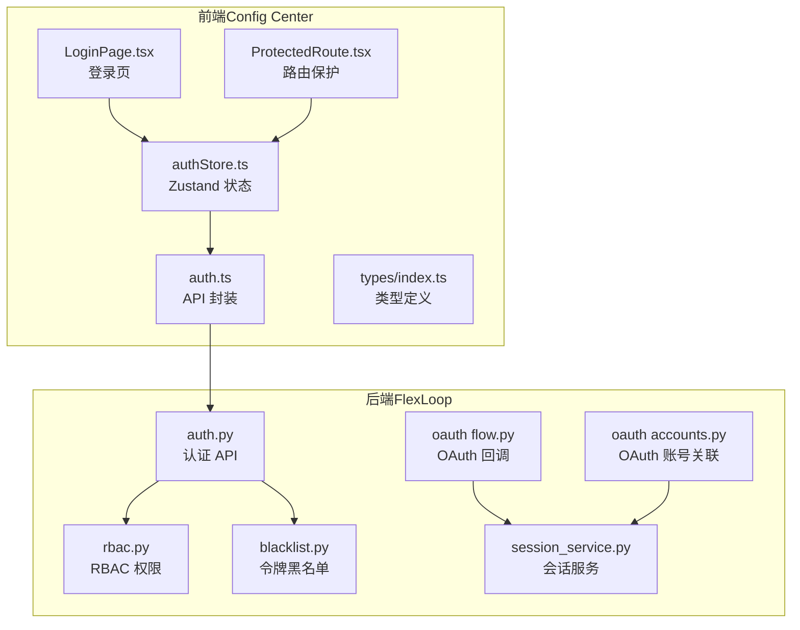
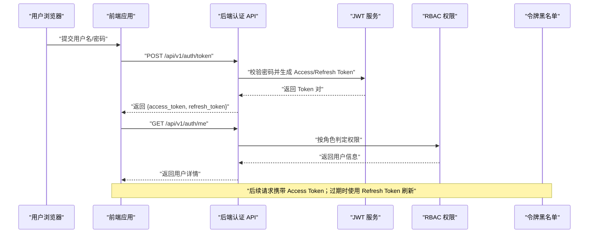
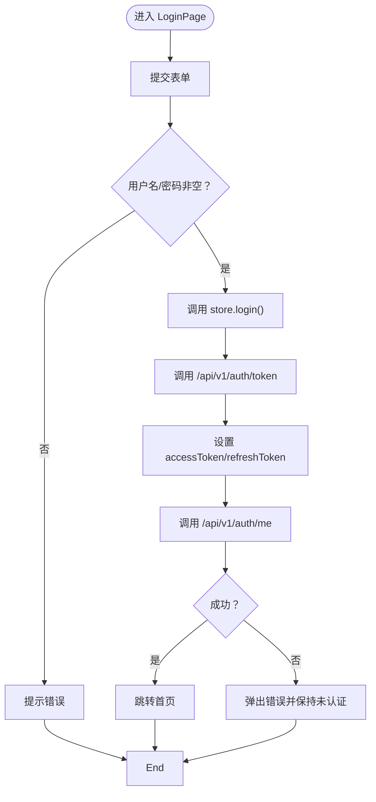
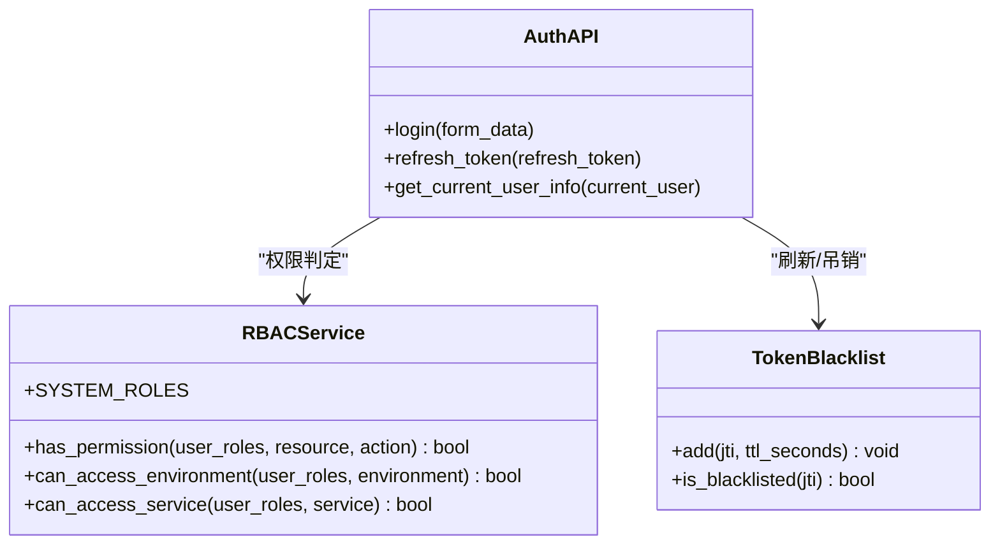
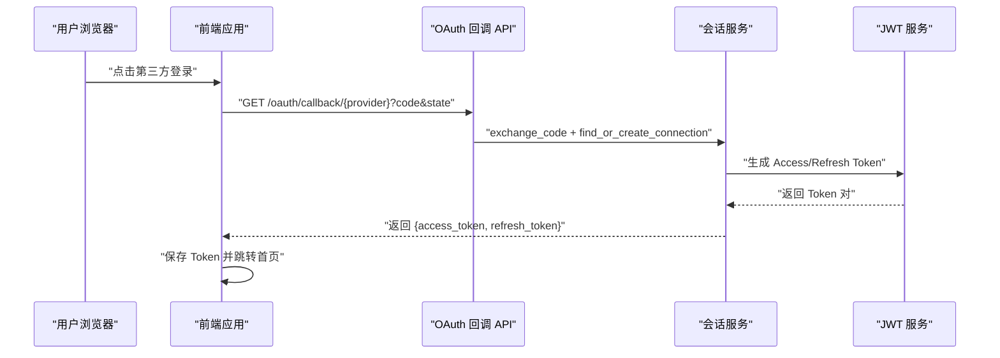
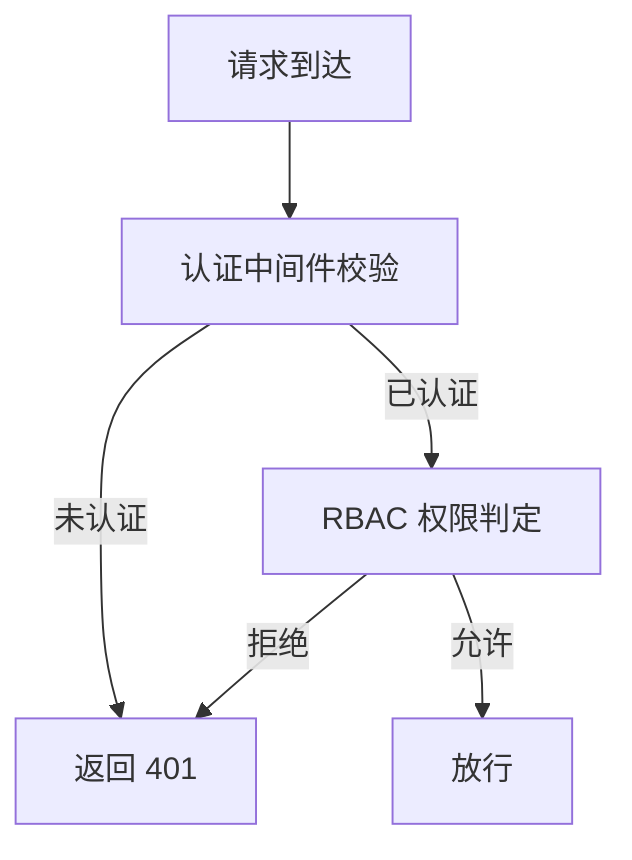
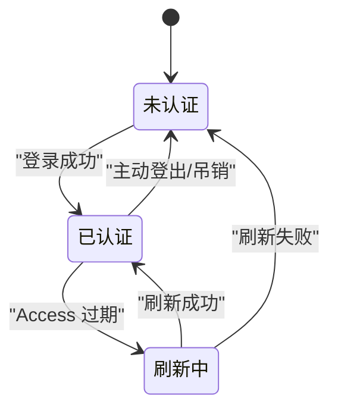
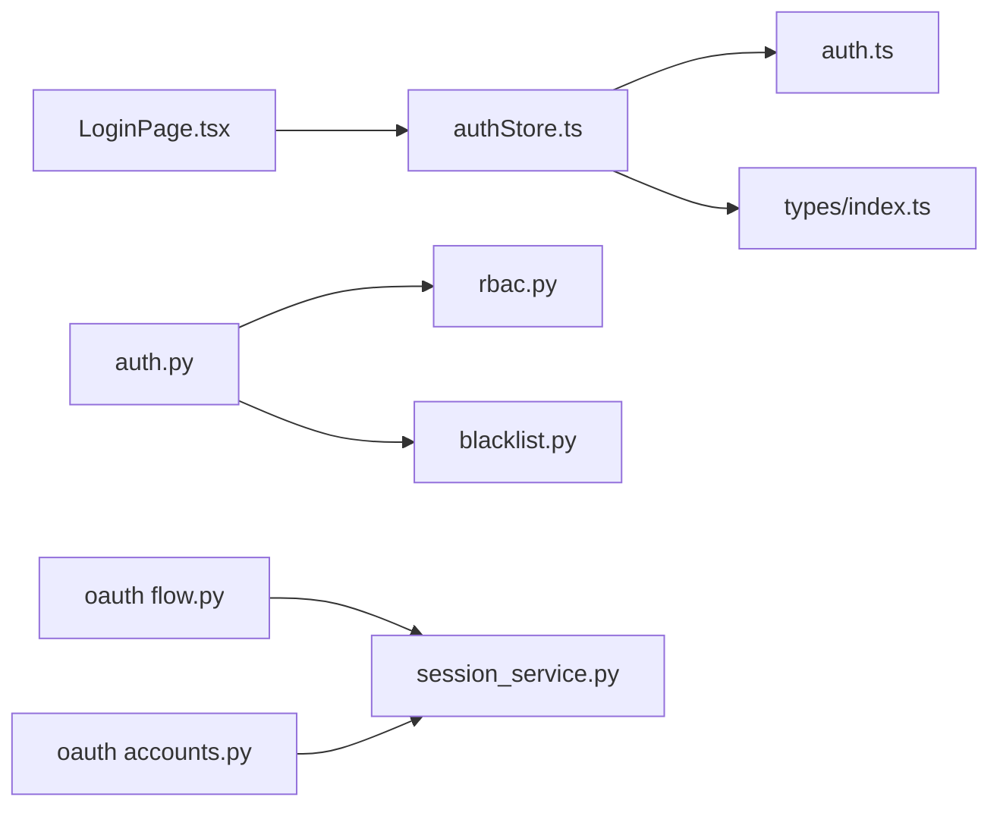

# 认证与授权

<cite>
**本文引用的文件**
- [apps/config-center/src/pages/LoginPage.tsx](file://apps/config-center/src/pages/LoginPage.tsx)
- [apps/config-center/src/store/authStore.ts](file://apps/config-center/src/store/authStore.ts)
- [apps/config-center/src/api/auth.ts](file://apps/config-center/src/api/auth.ts)
- [apps/config-center/src/components/ProtectedRoute.tsx](file://apps/config-center/src/components/ProtectedRoute.tsx)
- [apps/config-center/src/types/index.ts](file://apps/config-center/src/types/index.ts)
- [apps/config-center/src/store/authStore.test.ts](file://apps/config-center/src/store/authStore.test.ts)
- [tools/flexloop/src/taolib/testing/config_center/server/api/auth.py](file://tools/flexloop/src/taolib/testing/config_center/server/api/auth.py)
- [tools/flexloop/src/taolib/testing/config_center/server/auth/rbac.py](file://tools/flexloop/src/taolib/testing/config_center/server/auth/rbac.py)
- [tools/flexloop/src/taolib/testing/auth/blacklist.py](file://tools/flexloop/src/taolib/testing/auth/blacklist.py)
- [tools/flexloop/src/taolib/testing/oauth/server/api/flow.py](file://tools/flexloop/src/taolib/testing/oauth/server/api/flow.py)
- [tools/flexloop/src/taolib/testing/oauth/server/api/accounts.py](file://tools/flexloop/src/taolib/testing/oauth/server/api/accounts.py)
- [tools/flexloop/src/taolib/testing/oauth/services/session_service.py](file://tools/flexloop/src/taolib/testing/oauth/services/session_service.py)
- [tools/flexloop/tests/testing/test_auth/test_tokens.py](file://tools/flexloop/tests/testing/test_auth/test_tokens.py)
- [tools/flexloop/tests/testing/test_auth/test_fastapi/test_dependencies.py](file://tools/flexloop/tests/testing/test_auth/test_fastapi/test_dependencies.py)
- [tools/flexloop/tests/testing/test_auth/test_fastapi/test_middleware.py](file://tools/flexloop/tests/testing/test_auth/test_fastapi/test_middleware.py)
- [tools/flexloop/tests/testing/test_auth/test_blacklist.py](file://tools/flexloop/tests/testing/test_auth/test_blacklist.py)
- [tools/flexloop/tests/testing/test_auth/test_rbac.py](file://tools/flexloop/tests/testing/test_auth/test_rbac.py)
</cite>

## 目录
1. [简介](#简介)
2. [项目结构](#项目结构)
3. [核心组件](#核心组件)
4. [架构总览](#架构总览)
5. [组件详解](#组件详解)
6. [依赖关系分析](#依赖关系分析)
7. [性能考量](#性能考量)
8. [故障排查指南](#故障排查指南)
9. [结论](#结论)
10. [附录](#附录)

## 简介
本文件面向认证与授权系统，系统采用前后端分离架构，前端使用 React + Zustand 管理认证状态，后端基于 FastAPI 实现 JWT 令牌签发与校验，并结合 RBAC 权限控制与令牌黑名单实现安全的会话管理。文档覆盖以下主题：
- 安全架构设计：认证机制、授权策略、会话管理
- 用户登录流程：用户名密码验证、第三方登录集成
- JWT 令牌：生成、验证、刷新、过期与撤销
- 权限控制：路由级、组件级、API 级保护
- 会话管理：登录状态保持、自动登出、并发会话控制
- 安全策略：密码策略、账户锁定、异常登录检测
- 最佳实践：HTTPS、CSRF、XSS 防护
- 错误处理与安全事件响应

## 项目结构
认证与授权相关代码主要分布在两个区域：
- 前端应用（Config Center）：负责登录界面、认证状态管理、路由保护与 API 调用
- 后端服务（FlexLoop）：负责用户认证、令牌签发与校验、RBAC 权限控制、OAuth 第三方登录、令牌黑名单

图表来源
- [apps/config-center/src/pages/LoginPage.tsx:1-77](file://apps/config-center/src/pages/LoginPage.tsx#L1-L77)
- [apps/config-center/src/store/authStore.ts:1-108](file://apps/config-center/src/store/authStore.ts#L1-L108)
- [apps/config-center/src/api/auth.ts:1-15](file://apps/config-center/src/api/auth.ts#L1-L15)
- [apps/config-center/src/components/ProtectedRoute.tsx:1-13](file://apps/config-center/src/components/ProtectedRoute.tsx#L1-L13)
- [apps/config-center/src/types/index.ts:99-162](file://apps/config-center/src/types/index.ts#L99-L162)
- [tools/flexloop/src/taolib/testing/config_center/server/api/auth.py:1-270](file://tools/flexloop/src/taolib/testing/config_center/server/api/auth.py#L1-L270)
- [tools/flexloop/src/taolib/testing/config_center/server/auth/rbac.py:1-162](file://tools/flexloop/src/taolib/testing/config_center/server/auth/rbac.py#L1-L162)
- [tools/flexloop/src/taolib/testing/auth/blacklist.py:1-113](file://tools/flexloop/src/taolib/testing/auth/blacklist.py#L1-L113)
- [tools/flexloop/src/taolib/testing/oauth/server/api/flow.py:173-267](file://tools/flexloop/src/taolib/testing/oauth/server/api/flow.py#L173-L267)
- [tools/flexloop/src/taolib/testing/oauth/server/api/accounts.py:41-124](file://tools/flexloop/src/taolib/testing/oauth/server/api/accounts.py#L41-L124)
- [tools/flexloop/src/taolib/testing/oauth/services/session_service.py:83-126](file://tools/flexloop/src/taolib/testing/oauth/services/session_service.py#L83-L126)

章节来源
- [apps/config-center/src/pages/LoginPage.tsx:1-77](file://apps/config-center/src/pages/LoginPage.tsx#L1-L77)
- [apps/config-center/src/store/authStore.ts:1-108](file://apps/config-center/src/store/authStore.ts#L1-L108)
- [apps/config-center/src/api/auth.ts:1-15](file://apps/config-center/src/api/auth.ts#L1-L15)
- [apps/config-center/src/components/ProtectedRoute.tsx:1-13](file://apps/config-center/src/components/ProtectedRoute.tsx#L1-L13)
- [apps/config-center/src/types/index.ts:99-162](file://apps/config-center/src/types/index.ts#L99-L162)
- [tools/flexloop/src/taolib/testing/config_center/server/api/auth.py:1-270](file://tools/flexloop/src/taolib/testing/config_center/server/api/auth.py#L1-L270)
- [tools/flexloop/src/taolib/testing/config_center/server/auth/rbac.py:1-162](file://tools/flexloop/src/taolib/testing/config_center/server/auth/rbac.py#L1-L162)
- [tools/flexloop/src/taolib/testing/auth/blacklist.py:1-113](file://tools/flexloop/src/taolib/testing/auth/blacklist.py#L1-L113)
- [tools/flexloop/src/taolib/testing/oauth/server/api/flow.py:173-267](file://tools/flexloop/src/taolib/testing/oauth/server/api/flow.py#L173-L267)
- [tools/flexloop/src/taolib/testing/oauth/server/api/accounts.py:41-124](file://tools/flexloop/src/taolib/testing/oauth/server/api/accounts.py#L41-L124)
- [tools/flexloop/src/taolib/testing/oauth/services/session_service.py:83-126](file://tools/flexloop/src/taolib/testing/oauth/services/session_service.py#L83-L126)

## 核心组件
- 前端登录与状态管理
  - 登录页负责收集用户名与密码，触发登录流程
  - Zustand Store 统一管理 accessToken、refreshToken、用户信息与认证状态
  - API 层封装 /api/v1/auth/token、/api/v1/auth/refresh、/api/v1/auth/me
  - 路由保护组件在未认证时重定向至登录页
- 后端认证与授权
  - FastAPI 认证 API：用户名密码登录、刷新令牌、获取当前用户
  - JWT 服务：生成与校验 Access/Refresh Token，支持 jti 黑名单
  - RBAC 权限：内置系统角色与权限矩阵，支持环境与服务范围
  - OAuth：提供第三方登录授权回调、账号关联与会话创建
  - 令牌黑名单：支持 Redis/内存/空实现，实现令牌撤销与过期同步

章节来源
- [apps/config-center/src/pages/LoginPage.tsx:1-77](file://apps/config-center/src/pages/LoginPage.tsx#L1-L77)
- [apps/config-center/src/store/authStore.ts:1-108](file://apps/config-center/src/store/authStore.ts#L1-L108)
- [apps/config-center/src/api/auth.ts:1-15](file://apps/config-center/src/api/auth.ts#L1-L15)
- [apps/config-center/src/components/ProtectedRoute.tsx:1-13](file://apps/config-center/src/components/ProtectedRoute.tsx#L1-L13)
- [tools/flexloop/src/taolib/testing/config_center/server/api/auth.py:1-270](file://tools/flexloop/src/taolib/testing/config_center/server/api/auth.py#L1-L270)
- [tools/flexloop/src/taolib/testing/config_center/server/auth/rbac.py:1-162](file://tools/flexloop/src/taolib/testing/config_center/server/auth/rbac.py#L1-L162)
- [tools/flexloop/src/taolib/testing/auth/blacklist.py:1-113](file://tools/flexloop/src/taolib/testing/auth/blacklist.py#L1-L113)
- [tools/flexloop/src/taolib/testing/oauth/server/api/flow.py:173-267](file://tools/flexloop/src/taolib/testing/oauth/server/api/flow.py#L173-L267)
- [tools/flexloop/src/taolib/testing/oauth/server/api/accounts.py:41-124](file://tools/flexloop/src/taolib/testing/oauth/server/api/accounts.py#L41-L124)

## 架构总览
系统采用“前端无状态 + 后端强认证”的设计，前端仅保存短期访问令牌与用户信息，后端负责：
- 用户凭证校验与角色加载
- JWT 签发与校验（含黑名单）
- RBAC 权限判定与范围控制
- OAuth 授权与会话建立

图表来源
- [apps/config-center/src/pages/LoginPage.tsx:15-29](file://apps/config-center/src/pages/LoginPage.tsx#L15-L29)
- [apps/config-center/src/store/authStore.ts:29-46](file://apps/config-center/src/store/authStore.ts#L29-L46)
- [apps/config-center/src/api/auth.ts:4-14](file://apps/config-center/src/api/auth.ts#L4-L14)
- [tools/flexloop/src/taolib/testing/config_center/server/api/auth.py:92-122](file://tools/flexloop/src/taolib/testing/config_center/server/api/auth.py#L92-L122)
- [tools/flexloop/src/taolib/testing/config_center/server/auth/rbac.py:91-115](file://tools/flexloop/src/taolib/testing/config_center/server/auth/rbac.py#L91-L115)

## 组件详解

### 前端登录与状态管理
- 登录页
  - 校验输入非空，调用 store.login(username, password)
  - 成功后提示并导航至首页，失败弹出错误提示
- Zustand Store
  - login：调用后端 /api/v1/auth/token，设置 accessToken/refreshToken/isAuthenticated，并拉取 /api/v1/auth/me
  - refresh：当存在 refreshToken 时调用 /api/v1/auth/refresh 替换 access_token
  - fetchUser：拉取当前用户信息，失败则 logout
  - hasPermission：超级管理员直接放行，其他角色客户端仅作 UI 提示，最终以服务端为准
  - 持久化：仅持久化 token 与用户基本信息，避免敏感数据泄露
- 路由保护
  - 未认证时重定向至 /login 并保留来源地址

图表来源
- [apps/config-center/src/pages/LoginPage.tsx:15-29](file://apps/config-center/src/pages/LoginPage.tsx#L15-L29)
- [apps/config-center/src/store/authStore.ts:29-46](file://apps/config-center/src/store/authStore.ts#L29-L46)
- [apps/config-center/src/api/auth.ts:4-14](file://apps/config-center/src/api/auth.ts#L4-L14)

章节来源
- [apps/config-center/src/pages/LoginPage.tsx:1-77](file://apps/config-center/src/pages/LoginPage.tsx#L1-L77)
- [apps/config-center/src/store/authStore.ts:1-108](file://apps/config-center/src/store/authStore.ts#L1-L108)
- [apps/config-center/src/api/auth.ts:1-15](file://apps/config-center/src/api/auth.ts#L1-L15)
- [apps/config-center/src/components/ProtectedRoute.tsx:1-13](file://apps/config-center/src/components/ProtectedRoute.tsx#L1-L13)
- [apps/config-center/src/store/authStore.test.ts:42-80](file://apps/config-center/src/store/authStore.test.ts#L42-L80)

### 后端认证与令牌管理
- 认证 API
  - /api/v1/auth/token：用户名密码校验，bcrypt 验证，签发 Access/Refresh Token
  - /api/v1/auth/refresh：校验 Refresh Token 类型与主体，重新签发 Access Token
  - /api/v1/auth/me：返回当前用户信息（依赖认证中间件）
- JWT 服务
  - Access Token：短时（15 分钟），用于 API 认证
  - Refresh Token：长时（7 天），用于刷新 Access Token
  - 支持 jti 唯一性与黑名单，过期即失效
- RBAC 权限
  - 内置系统角色与权限矩阵，支持环境与服务范围限制
  - has_permission、can_access_environment、can_access_service 三类判定
- 令牌黑名单
  - 支持 Redis/内存/空实现，add 时写入 TTL，is_blacklisted 时自动清理过期项

图表来源
- [tools/flexloop/src/taolib/testing/config_center/server/api/auth.py:92-267](file://tools/flexloop/src/taolib/testing/config_center/server/api/auth.py#L92-L267)
- [tools/flexloop/src/taolib/testing/config_center/server/auth/rbac.py:91-160](file://tools/flexloop/src/taolib/testing/config_center/server/auth/rbac.py#L91-L160)
- [tools/flexloop/src/taolib/testing/auth/blacklist.py:17-110](file://tools/flexloop/src/taolib/testing/auth/blacklist.py#L17-L110)

章节来源
- [tools/flexloop/src/taolib/testing/config_center/server/api/auth.py:1-270](file://tools/flexloop/src/taolib/testing/config_center/server/api/auth.py#L1-L270)
- [tools/flexloop/src/taolib/testing/config_center/server/auth/rbac.py:1-162](file://tools/flexloop/src/taolib/testing/config_center/server/auth/rbac.py#L1-L162)
- [tools/flexloop/src/taolib/testing/auth/blacklist.py:1-113](file://tools/flexloop/src/taolib/testing/auth/blacklist.py#L1-L113)

### 第三方登录（OAuth）与会话管理
- OAuth 授权流程
  - /oauth/callback/{provider}：处理授权回调，校验 state，交换令牌，查找或创建连接，返回认证结果或引导信息
  - /oauth/link/{provider}/complete：将第三方提供商关联到当前用户
- 会话服务
  - 生成 Access/Refresh Token，记录会话元数据（IP、UA、过期时间、最后活跃）
  - 支持会话 TTL 控制，便于并发会话管理与自动登出

图表来源
- [tools/flexloop/src/taolib/testing/oauth/server/api/flow.py:236-267](file://tools/flexloop/src/taolib/testing/oauth/server/api/flow.py#L236-L267)
- [tools/flexloop/src/taolib/testing/oauth/server/api/accounts.py:71-124](file://tools/flexloop/src/taolib/testing/oauth/server/api/accounts.py#L71-L124)
- [tools/flexloop/src/taolib/testing/oauth/services/session_service.py:96-126](file://tools/flexloop/src/taolib/testing/oauth/services/session_service.py#L96-L126)

章节来源
- [tools/flexloop/src/taolib/testing/oauth/server/api/flow.py:173-267](file://tools/flexloop/src/taolib/testing/oauth/server/api/flow.py#L173-L267)
- [tools/flexloop/src/taolib/testing/oauth/server/api/accounts.py:41-124](file://tools/flexloop/src/taolib/testing/oauth/server/api/accounts.py#L41-L124)
- [tools/flexloop/src/taolib/testing/oauth/services/session_service.py:83-126](file://tools/flexloop/src/taolib/testing/oauth/services/session_service.py#L83-L126)

### 权限控制实现
- 路由级保护：ProtectedRoute 在未认证时重定向
- 组件级保护：UI 层通过 hasPermission 做可见性控制（客户端提示，非安全边界）
- API 级保护：依赖认证中间件与 RBAC 服务，按资源与动作判定权限

图表来源
- [apps/config-center/src/components/ProtectedRoute.tsx:4-12](file://apps/config-center/src/components/ProtectedRoute.tsx#L4-L12)
- [apps/config-center/src/store/authStore.ts:84-95](file://apps/config-center/src/store/authStore.ts#L84-L95)
- [tools/flexloop/src/taolib/testing/config_center/server/auth/rbac.py:91-160](file://tools/flexloop/src/taolib/testing/config_center/server/auth/rbac.py#L91-L160)

章节来源
- [apps/config-center/src/components/ProtectedRoute.tsx:1-13](file://apps/config-center/src/components/ProtectedRoute.tsx#L1-L13)
- [apps/config-center/src/store/authStore.ts:84-95](file://apps/config-center/src/store/authStore.ts#L84-L95)
- [tools/flexloop/src/taolib/testing/config_center/server/auth/rbac.py:1-162](file://tools/flexloop/src/taolib/testing/config_center/server/auth/rbac.py#L1-L162)

### 会话管理与令牌生命周期
- 登录状态保持：前端持久化 accessToken/refreshToken 与用户信息
- 自动登出：刷新失败或获取用户信息失败时触发 logout
- 并发会话控制：会话服务记录会话元数据与 TTL，可在上层策略中实现并发控制
- 令牌撤销：通过黑名单实现即时吊销，TTL 与实际过期时间对齐

图表来源
- [apps/config-center/src/store/authStore.ts:48-82](file://apps/config-center/src/store/authStore.ts#L48-L82)
- [tools/flexloop/src/taolib/testing/auth/blacklist.py:54-95](file://tools/flexloop/src/taolib/testing/auth/blacklist.py#L54-L95)
- [tools/flexloop/src/taolib/testing/oauth/services/session_service.py:96-126](file://tools/flexloop/src/taolib/testing/oauth/services/session_service.py#L96-L126)

章节来源
- [apps/config-center/src/store/authStore.ts:1-108](file://apps/config-center/src/store/authStore.ts#L1-L108)
- [tools/flexloop/src/taolib/testing/auth/blacklist.py:1-113](file://tools/flexloop/src/taolib/testing/auth/blacklist.py#L1-L113)
- [tools/flexloop/src/taolib/testing/oauth/services/session_service.py:83-126](file://tools/flexloop/src/taolib/testing/oauth/services/session_service.py#L83-L126)

## 依赖关系分析
- 前端依赖
  - LoginPage 依赖 useAuthStore
  - authStore 依赖 api/auth 与 types/index
  - ProtectedRoute 依赖 useAuthStore
- 后端依赖
  - 认证 API 依赖 JWT 服务、RBAC 与用户仓库
  - OAuth 回调依赖会话服务与账户服务
  - 令牌黑名单可插拔，支持不同存储后端

图表来源
- [apps/config-center/src/pages/LoginPage.tsx:1-77](file://apps/config-center/src/pages/LoginPage.tsx#L1-L77)
- [apps/config-center/src/store/authStore.ts:1-108](file://apps/config-center/src/store/authStore.ts#L1-L108)
- [apps/config-center/src/api/auth.ts:1-15](file://apps/config-center/src/api/auth.ts#L1-L15)
- [apps/config-center/src/types/index.ts:99-162](file://apps/config-center/src/types/index.ts#L99-L162)
- [tools/flexloop/src/taolib/testing/config_center/server/api/auth.py:1-270](file://tools/flexloop/src/taolib/testing/config_center/server/api/auth.py#L1-L270)
- [tools/flexloop/src/taolib/testing/config_center/server/auth/rbac.py:1-162](file://tools/flexloop/src/taolib/testing/config_center/server/auth/rbac.py#L1-L162)
- [tools/flexloop/src/taolib/testing/auth/blacklist.py:1-113](file://tools/flexloop/src/taolib/testing/auth/blacklist.py#L1-L113)
- [tools/flexloop/src/taolib/testing/oauth/server/api/flow.py:173-267](file://tools/flexloop/src/taolib/testing/oauth/server/api/flow.py#L173-L267)
- [tools/flexloop/src/taolib/testing/oauth/server/api/accounts.py:41-124](file://tools/flexloop/src/taolib/testing/oauth/server/api/accounts.py#L41-L124)
- [tools/flexloop/src/taolib/testing/oauth/services/session_service.py:83-126](file://tools/flexloop/src/taolib/testing/oauth/services/session_service.py#L83-L126)

章节来源
- [apps/config-center/src/store/authStore.ts:1-108](file://apps/config-center/src/store/authStore.ts#L1-L108)
- [apps/config-center/src/api/auth.ts:1-15](file://apps/config-center/src/api/auth.ts#L1-L15)
- [apps/config-center/src/components/ProtectedRoute.tsx:1-13](file://apps/config-center/src/components/ProtectedRoute.tsx#L1-L13)
- [apps/config-center/src/types/index.ts:99-162](file://apps/config-center/src/types/index.ts#L99-L162)
- [tools/flexloop/src/taolib/testing/config_center/server/api/auth.py:1-270](file://tools/flexloop/src/taolib/testing/config_center/server/api/auth.py#L1-L270)
- [tools/flexloop/src/taolib/testing/config_center/server/auth/rbac.py:1-162](file://tools/flexloop/src/taolib/testing/config_center/server/auth/rbac.py#L1-L162)
- [tools/flexloop/src/taolib/testing/auth/blacklist.py:1-113](file://tools/flexloop/src/taolib/testing/auth/blacklist.py#L1-L113)
- [tools/flexloop/src/taolib/testing/oauth/server/api/flow.py:173-267](file://tools/flexloop/src/taolib/testing/oauth/server/api/flow.py#L173-L267)
- [tools/flexloop/src/taolib/testing/oauth/server/api/accounts.py:41-124](file://tools/flexloop/src/taolib/testing/oauth/server/api/accounts.py#L41-L124)
- [tools/flexloop/src/taolib/testing/oauth/services/session_service.py:83-126](file://tools/flexloop/src/taolib/testing/oauth/services/session_service.py#L83-L126)

## 性能考量
- 令牌短时化：Access Token 15 分钟，降低泄露风险与服务器压力
- 刷新策略：仅在必要时刷新，减少频繁网络往返
- 黑名单 TTL 对齐：避免过期条目长期占用存储
- RBAC 缓存：可引入角色缓存减少重复查询（当前实现为内存字典）
- OAuth 令牌加密：第三方令牌加密存储，降低泄露影响面

## 故障排查指南
- 登录失败
  - 检查用户名/密码是否正确，确认后端 bcrypt 校验逻辑
  - 查看前端错误提示与后端 401 响应
- 令牌过期
  - 触发 store.refresh，若失败则自动登出
  - 核对 JWT 过期时间与黑名单状态
- 权限不足
  - 确认用户角色与权限矩阵，检查环境/服务范围
  - 客户端 hasPermission 仅为 UI 提示，最终以服务端判定为准
- OAuth 回调异常
  - 校验 state 参数与授权码交换流程
  - 检查第三方提供商返回的用户信息与令牌数据

章节来源
- [apps/config-center/src/store/authStore.ts:57-82](file://apps/config-center/src/store/authStore.ts#L57-L82)
- [tools/flexloop/src/taolib/testing/config_center/server/api/auth.py:92-216](file://tools/flexloop/src/taolib/testing/config_center/server/api/auth.py#L92-L216)
- [tools/flexloop/src/taolib/testing/config_center/server/auth/rbac.py:91-160](file://tools/flexloop/src/taolib/testing/config_center/server/auth/rbac.py#L91-L160)
- [tools/flexloop/src/taolib/testing/oauth/server/api/flow.py:236-267](file://tools/flexloop/src/taolib/testing/oauth/server/api/flow.py#L236-L267)

## 结论
本认证与授权系统通过前后端协作实现了安全、可扩展的身份认证与权限控制：
- 前端负责用户体验与状态管理，后端承担安全边界
- JWT 令牌短时化与黑名单机制保障了会话安全
- RBAC 提供细粒度的权限控制与范围约束
- OAuth 集成支持第三方登录与账号关联
建议在生产环境中进一步完善密码策略、账户锁定与异常登录检测，并持续优化令牌黑名单与 RBAC 缓存策略。

## 附录
- 安全最佳实践
  - HTTPS：强制 TLS，禁用弱密码套件
  - CSRF：在表单与 AJAX 中使用 SameSite Cookie 与 Anti-CSRF Token
  - XSS：严格内容安全策略（CSP）、输入过滤与输出编码
  - 密码策略：长度、复杂度、定期轮换、禁止历史密码
  - 账户锁定：失败尝试阈值与临时锁定
  - 异常登录检测：IP/UA 变化、地理位置异常、多设备登录
- 错误处理与事件响应
  - 统一错误码与消息格式
  - 记录认证日志与安全事件，支持审计与追踪
  - 对敏感操作（登出、撤销、修改权限）进行二次确认与审计