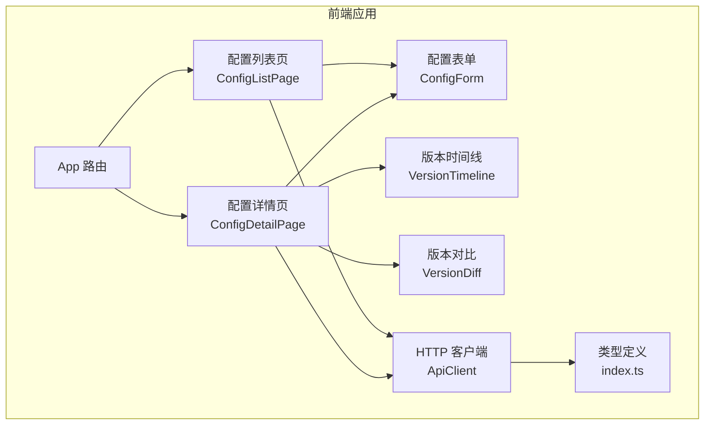
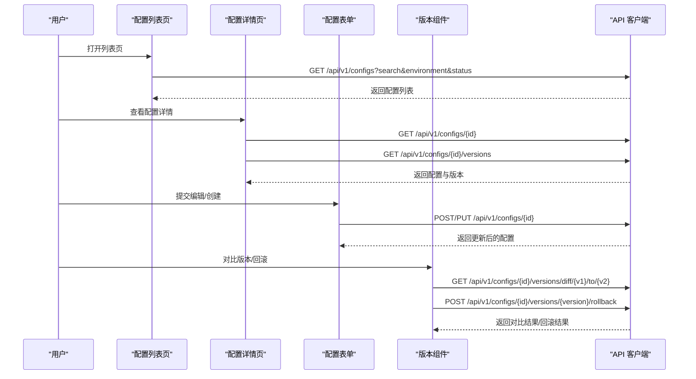
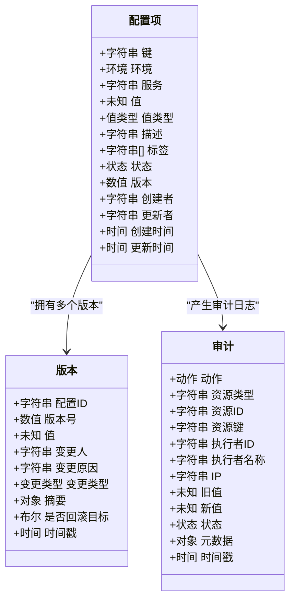
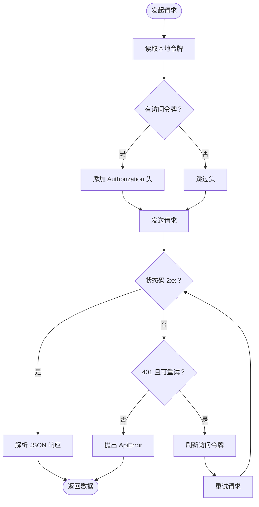
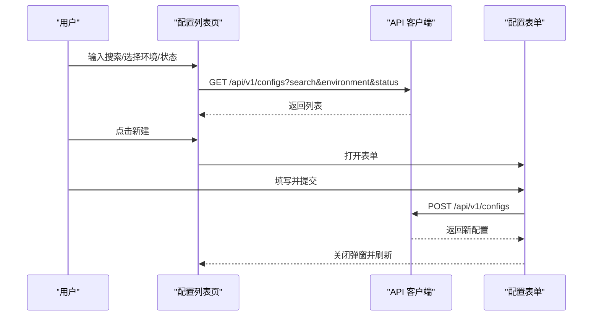
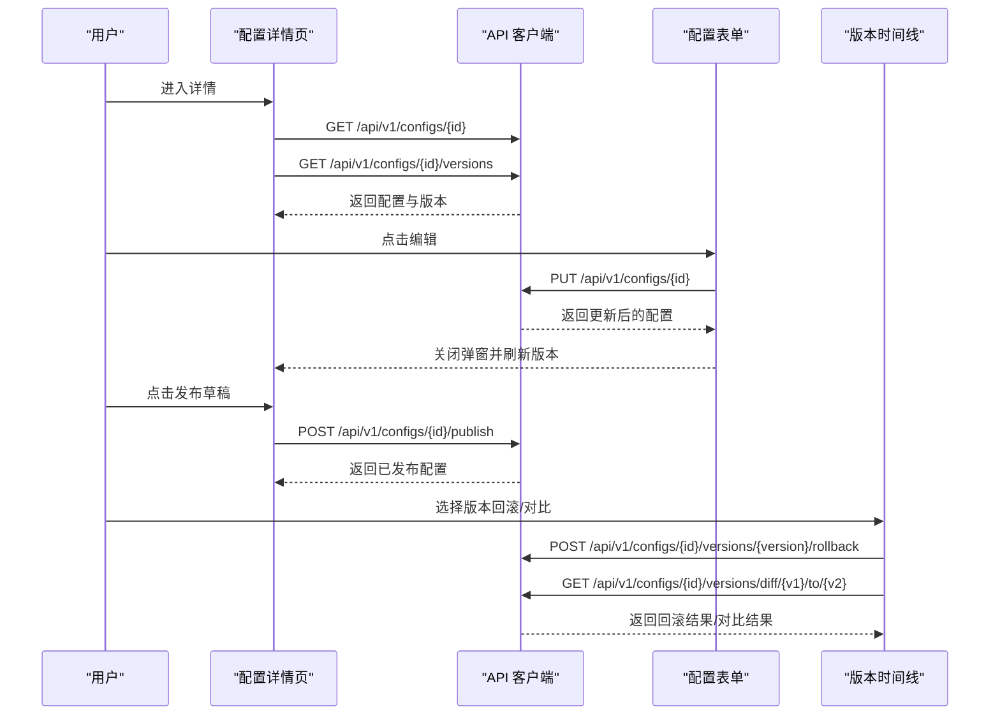
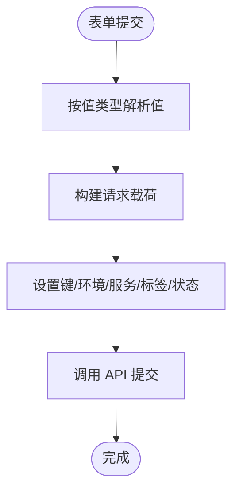
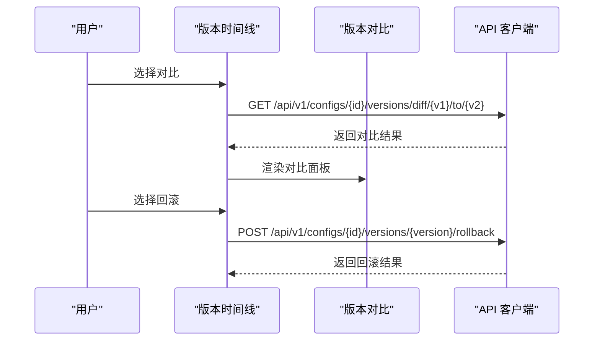
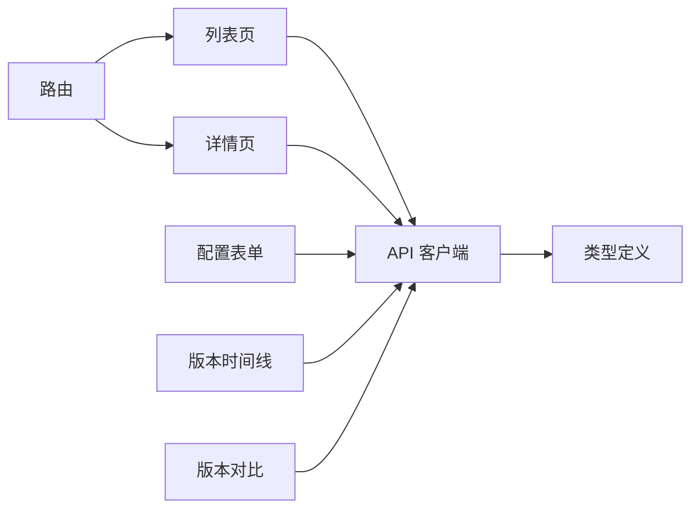

# 配置管理

<cite>
**本文引用的文件**
- [apps/config-center/src/api/configs.ts](file://apps/config-center/src/api/configs.ts)
- [apps/config-center/src/api/versions.ts](file://apps/config-center/src/api/versions.ts)
- [apps/config-center/src/api/client.ts](file://apps/config-center/src/api/client.ts)
- [apps/config-center/src/types/index.ts](file://apps/config-center/src/types/index.ts)
- [apps/config-center/src/pages/ConfigListPage.tsx](file://apps/config-center/src/pages/ConfigListPage.tsx)
- [apps/config-center/src/pages/ConfigDetailPage.tsx](file://apps/config-center/src/pages/ConfigDetailPage.tsx)
- [apps/config-center/src/components/config/ConfigForm.tsx](file://apps/config-center/src/components/config/ConfigForm.tsx)
- [apps/config-center/src/components/version/VersionTimeline.tsx](file://apps/config-center/src/components/version/VersionTimeline.tsx)
- [apps/config-center/src/components/version/VersionDiff.tsx](file://apps/config-center/src/components/version/VersionDiff.tsx)
- [apps/config-center/src/App.tsx](file://apps/config-center/src/App.tsx)
- [apps/config-center/src/store/uiStore.ts](file://apps/config-center/src/store/uiStore.ts)
</cite>

## 目录
1. [简介](#简介)
2. [项目结构](#项目结构)
3. [核心组件](#核心组件)
4. [架构总览](#架构总览)
5. [详细组件分析](#详细组件分析)
6. [依赖关系分析](#依赖关系分析)
7. [性能考量](#性能考量)
8. [故障排查指南](#故障排查指南)
9. [结论](#结论)
10. [附录](#附录)

## 简介
本文件系统性阐述配置中心（Config Center）的动态配置管理能力，覆盖数据模型、存储结构、版本控制、表单校验、编辑/删除/发布流程、草稿与预览、冲突处理、API 接口定义、分类与搜索、批量操作等主题，并提供实际配置示例与最佳实践建议。该系统采用前端 React 应用与后端 API 协同工作，支持多环境、多服务、多类型的配置项管理，并内置版本历史、差异对比与回滚能力。

## 项目结构
配置中心前端位于 apps/config-center，核心由页面、API 客户端、类型定义、组件与路由组成。页面负责用户交互与业务编排；API 层封装 HTTP 请求与鉴权刷新；类型定义统一前后端契约；组件拆分配置表单、版本时间线与差异展示；路由在受保护的布局下组织各页面。

图表来源
- [apps/config-center/src/App.tsx:14-38](file://apps/config-center/src/App.tsx#L14-L38)
- [apps/config-center/src/pages/ConfigListPage.tsx:13-177](file://apps/config-center/src/pages/ConfigListPage.tsx#L13-L177)
- [apps/config-center/src/pages/ConfigDetailPage.tsx:16-238](file://apps/config-center/src/pages/ConfigDetailPage.tsx#L16-L238)
- [apps/config-center/src/components/config/ConfigForm.tsx:13-125](file://apps/config-center/src/components/config/ConfigForm.tsx#L13-L125)
- [apps/config-center/src/components/version/VersionTimeline.tsx:13-66](file://apps/config-center/src/components/version/VersionTimeline.tsx#L13-L66)
- [apps/config-center/src/components/version/VersionDiff.tsx:8-39](file://apps/config-center/src/components/version/VersionDiff.tsx#L8-L39)
- [apps/config-center/src/api/client.ts:14-171](file://apps/config-center/src/api/client.ts#L14-L171)
- [apps/config-center/src/types/index.ts:1-163](file://apps/config-center/src/types/index.ts#L1-L163)

章节来源
- [apps/config-center/src/App.tsx:14-38](file://apps/config-center/src/App.tsx#L14-L38)

## 核心组件
- 数据模型与枚举：通过统一的类型定义描述配置项、版本、审计日志、角色与用户等实体及取值范围，确保前后端一致。
- API 客户端：封装鉴权令牌读取与刷新、重试与错误处理、GET/POST/PUT/DELETE 方法与查询参数拼接。
- 页面与表单：配置列表页支持搜索与筛选；配置详情页支持编辑、发布、版本历史、差异对比与回滚。
- 版本管理组件：版本时间线展示变更轨迹，支持版本对比与回滚操作。

章节来源
- [apps/config-center/src/types/index.ts:1-163](file://apps/config-center/src/types/index.ts#L1-L163)
- [apps/config-center/src/api/client.ts:14-171](file://apps/config-center/src/api/client.ts#L14-L171)
- [apps/config-center/src/pages/ConfigListPage.tsx:13-177](file://apps/config-center/src/pages/ConfigListPage.tsx#L13-L177)
- [apps/config-center/src/pages/ConfigDetailPage.tsx:16-238](file://apps/config-center/src/pages/ConfigDetailPage.tsx#L16-L238)
- [apps/config-center/src/components/config/ConfigForm.tsx:13-125](file://apps/config-center/src/components/config/ConfigForm.tsx#L13-L125)
- [apps/config-center/src/components/version/VersionTimeline.tsx:13-66](file://apps/config-center/src/components/version/VersionTimeline.tsx#L13-L66)
- [apps/config-center/src/components/version/VersionDiff.tsx:8-39](file://apps/config-center/src/components/version/VersionDiff.tsx#L8-L39)

## 架构总览
配置中心采用“页面-组件-API 客户端-类型定义”的分层架构。页面负责交互与状态管理，组件负责渲染与事件回调，API 客户端负责网络请求与鉴权，类型定义贯穿全链路保证契约一致。

图表来源
- [apps/config-center/src/pages/ConfigListPage.tsx:23-41](file://apps/config-center/src/pages/ConfigListPage.tsx#L23-L41)
- [apps/config-center/src/pages/ConfigDetailPage.tsx:28-46](file://apps/config-center/src/pages/ConfigDetailPage.tsx#L28-L46)
- [apps/config-center/src/components/config/ConfigForm.tsx:29-55](file://apps/config-center/src/components/config/ConfigForm.tsx#L29-L55)
- [apps/config-center/src/components/version/VersionTimeline.tsx:15-28](file://apps/config-center/src/components/version/VersionTimeline.tsx#L15-L28)
- [apps/config-center/src/api/client.ts:131-171](file://apps/config-center/src/api/client.ts#L131-L171)

## 详细组件分析

### 数据模型与类型定义
- 配置项关键字段：标识、键、环境、服务、值、值类型、描述、标签、状态、版本、创建/更新信息。
- 值类型：字符串、数字、布尔、JSON、密钥（secret）。
- 状态：草稿、活跃、已废弃。
- 版本：包含变更类型、变更原因、是否回滚目标、变更摘要等。
- 审计：动作、资源、执行者、IP、旧值/新值、状态与元数据。
- 用户与角色：用户名、邮箱、显示名、角色权限集合与作用域。

图表来源
- [apps/config-center/src/types/index.ts:15-50](file://apps/config-center/src/types/index.ts#L15-L50)
- [apps/config-center/src/types/index.ts:54-73](file://apps/config-center/src/types/index.ts#L54-L73)
- [apps/config-center/src/types/index.ts:77-91](file://apps/config-center/src/types/index.ts#L77-L91)

章节来源
- [apps/config-center/src/types/index.ts:1-163](file://apps/config-center/src/types/index.ts#L1-L163)

### API 客户端与鉴权刷新
- 鉴权：从本地存储读取访问令牌与刷新令牌；请求头携带 Bearer 令牌。
- 刷新：当 401 且存在刷新令牌时自动刷新访问令牌并重试；失败则跳转登录。
- 错误：捕获非 2xx 响应，解析错误体或使用状态文本作为消息。
- 方法：封装 GET/POST/PUT/DELETE；支持查询参数与表单提交。

图表来源
- [apps/config-center/src/api/client.ts:85-129](file://apps/config-center/src/api/client.ts#L85-L129)

章节来源
- [apps/config-center/src/api/client.ts:1-171](file://apps/config-center/src/api/client.ts#L1-L171)

### 配置列表页（搜索/筛选/创建）
- 支持按键名、环境、状态进行过滤；支持空状态与加载态。
- 新建配置弹窗内嵌配置表单，提交后刷新列表并提示成功/失败。
- 行点击进入详情页，删除确认对话框。

图表来源
- [apps/config-center/src/pages/ConfigListPage.tsx:23-41](file://apps/config-center/src/pages/ConfigListPage.tsx#L23-L41)
- [apps/config-center/src/components/config/ConfigForm.tsx:29-55](file://apps/config-center/src/components/config/ConfigForm.tsx#L29-L55)
- [apps/config-center/src/api/configs.ts:18-20](file://apps/config-center/src/api/configs.ts#L18-L20)

章节来源
- [apps/config-center/src/pages/ConfigListPage.tsx:13-177](file://apps/config-center/src/pages/ConfigListPage.tsx#L13-L177)
- [apps/config-center/src/api/configs.ts:4-12](file://apps/config-center/src/api/configs.ts#L4-L12)

### 配置详情页（编辑/发布/版本历史）
- 并行加载配置与版本；详情页展示值、类型、版本、元信息与标签。
- 编辑弹窗基于当前配置初始值，提交后刷新版本列表。
- 发布仅对草稿开放；回滚与对比由版本组件触发。

图表来源
- [apps/config-center/src/pages/ConfigDetailPage.tsx:28-46](file://apps/config-center/src/pages/ConfigDetailPage.tsx#L28-L46)
- [apps/config-center/src/components/config/ConfigForm.tsx:29-55](file://apps/config-center/src/components/config/ConfigForm.tsx#L29-L55)
- [apps/config-center/src/api/configs.ts:22-32](file://apps/config-center/src/api/configs.ts#L22-L32)
- [apps/config-center/src/api/versions.ts:15-28](file://apps/config-center/src/api/versions.ts#L15-L28)

章节来源
- [apps/config-center/src/pages/ConfigDetailPage.tsx:16-238](file://apps/config-center/src/pages/ConfigDetailPage.tsx#L16-L238)
- [apps/config-center/src/api/configs.ts:14-32](file://apps/config-center/src/api/configs.ts#L14-L32)
- [apps/config-center/src/api/versions.ts:4-28](file://apps/config-center/src/api/versions.ts#L4-L28)

### 配置表单（校验与序列化）
- 值类型转换：JSON 解析、数字转换、布尔映射；非 JSON 类型保持字符串。
- 标签解析：逗号分隔转数组并去空白；空值不提交。
- 必填项：创建模式下键、环境、服务必填；编辑模式仅提交变更字段。
- 提交：构造 payload 后调用对应 API。

图表来源
- [apps/config-center/src/components/config/ConfigForm.tsx:29-55](file://apps/config-center/src/components/config/ConfigForm.tsx#L29-L55)

章节来源
- [apps/config-center/src/components/config/ConfigForm.tsx:13-125](file://apps/config-center/src/components/config/ConfigForm.tsx#L13-L125)

### 版本时间线与差异对比
- 时间线：展示版本号、变更类型、变更人与时间、变更原因；支持“与上一版本对比”“回滚到此版本”。
- 差异：以左右两列展示两个版本的值，无差异时提示相同。

图表来源
- [apps/config-center/src/components/version/VersionTimeline.tsx:15-60](file://apps/config-center/src/components/version/VersionTimeline.tsx#L15-L60)
- [apps/config-center/src/components/version/VersionDiff.tsx:8-39](file://apps/config-center/src/components/version/VersionDiff.tsx#L8-L39)
- [apps/config-center/src/api/versions.ts:15-28](file://apps/config-center/src/api/versions.ts#L15-L28)

章节来源
- [apps/config-center/src/components/version/VersionTimeline.tsx:13-66](file://apps/config-center/src/components/version/VersionTimeline.tsx#L13-L66)
- [apps/config-center/src/components/version/VersionDiff.tsx:8-39](file://apps/config-center/src/components/version/VersionDiff.tsx#L8-L39)
- [apps/config-center/src/api/versions.ts:1-29](file://apps/config-center/src/api/versions.ts#L1-L29)

## 依赖关系分析
- 页面依赖 API 客户端与类型定义；组件依赖页面状态与 API 客户端。
- API 客户端依赖本地存储与后端接口；类型定义被所有模块共享。
- 路由在受保护布局中加载页面，确保访问控制。

图表来源
- [apps/config-center/src/App.tsx:14-38](file://apps/config-center/src/App.tsx#L14-L38)
- [apps/config-center/src/pages/ConfigListPage.tsx:13-177](file://apps/config-center/src/pages/ConfigListPage.tsx#L13-L177)
- [apps/config-center/src/pages/ConfigDetailPage.tsx:16-238](file://apps/config-center/src/pages/ConfigDetailPage.tsx#L16-L238)
- [apps/config-center/src/components/config/ConfigForm.tsx:13-125](file://apps/config-center/src/components/config/ConfigForm.tsx#L13-L125)
- [apps/config-center/src/components/version/VersionTimeline.tsx:13-66](file://apps/config-center/src/components/version/VersionTimeline.tsx#L13-L66)
- [apps/config-center/src/components/version/VersionDiff.tsx:8-39](file://apps/config-center/src/components/version/VersionDiff.tsx#L8-L39)
- [apps/config-center/src/api/client.ts:14-171](file://apps/config-center/src/api/client.ts#L14-L171)
- [apps/config-center/src/types/index.ts:1-163](file://apps/config-center/src/types/index.ts#L1-L163)

章节来源
- [apps/config-center/src/App.tsx:14-38](file://apps/config-center/src/App.tsx#L14-L38)

## 性能考量
- 并发加载：详情页同时拉取配置与版本，减少往返次数。
- 懒加载与骨架屏：详情页加载时使用骨架屏提升感知性能。
- 本地存储：鉴权令牌持久化，避免重复登录。
- 分页参数：列表与版本接口支持 skip/limit，便于大数据量场景扩展。

章节来源
- [apps/config-center/src/pages/ConfigDetailPage.tsx:33-36](file://apps/config-center/src/pages/ConfigDetailPage.tsx#L33-L36)
- [apps/config-center/src/api/configs.ts:4-12](file://apps/config-center/src/api/configs.ts#L4-L12)
- [apps/config-center/src/api/versions.ts:4-9](file://apps/config-center/src/api/versions.ts#L4-L9)
- [apps/config-center/src/api/client.ts:21-45](file://apps/config-center/src/api/client.ts#L21-L45)

## 故障排查指南
- 401 未授权：检查本地存储中的令牌是否存在与有效；若触发刷新失败将自动跳转登录。
- 请求失败：查看 ApiError 的状态码与消息；必要时检查后端接口可用性与网络连通性。
- 表单提交失败：确认值类型与格式（JSON/数字/布尔）；检查必填字段是否完整。
- 版本对比/回滚异常：确认版本号正确且存在；检查变更原因与回滚目标标记。

章节来源
- [apps/config-center/src/api/client.ts:85-129](file://apps/config-center/src/api/client.ts#L85-L129)
- [apps/config-center/src/components/config/ConfigForm.tsx:29-55](file://apps/config-center/src/components/config/ConfigForm.tsx#L29-L55)
- [apps/config-center/src/api/versions.ts:15-28](file://apps/config-center/src/api/versions.ts#L15-L28)

## 结论
配置中心通过清晰的类型定义、健壮的 API 客户端与直观的页面/组件设计，实现了从创建、编辑、发布到版本管理与审计的全生命周期配置治理。其模块化与分层架构便于扩展与维护，适合在多环境、多服务场景下稳定运行。

## 附录

### API 接口文档

- 获取配置列表
  - 方法与路径：GET /api/v1/configs
  - 查询参数：
    - environment: 环境（可选）
    - service: 服务（可选）
    - status: 状态（可选）
    - skip: 跳过条数（可选）
    - limit: 条数限制（可选）
  - 成功响应：配置数组
  - 错误：401（鉴权失败）、403（权限不足）、500（服务器错误）

- 获取单个配置
  - 方法与路径：GET /api/v1/configs/{id}
  - 成功响应：配置对象
  - 错误：404（配置不存在）、401/500

- 创建配置
  - 方法与路径：POST /api/v1/configs
  - 请求体：创建配置所需字段（键、环境、服务、值、值类型、描述、标签、状态等）
  - 成功响应：新配置对象
  - 错误：400（参数校验失败）、401/403/500

- 更新配置
  - 方法与路径：PUT /api/v1/configs/{id}
  - 请求体：可选字段（值、值类型、描述、标签、状态等）
  - 成功响应：更新后的配置对象
  - 错误：400/404/401/500

- 删除配置
  - 方法与路径：DELETE /api/v1/configs/{id}
  - 成功响应：无内容（204）
  - 错误：404/401/500

- 发布配置
  - 方法与路径：POST /api/v1/configs/{id}/publish
  - 成功响应：发布后的配置对象
  - 错误：400/404/401/500

- 获取版本列表
  - 方法与路径：GET /api/v1/configs/{id}/versions
  - 查询参数：skip、limit（可选）
  - 成功响应：版本数组
  - 错误：404/401/500

- 获取指定版本
  - 方法与路径：GET /api/v1/configs/{id}/versions/{version}
  - 成功响应：版本对象
  - 错误：404/401/500

- 版本差异对比
  - 方法与路径：GET /api/v1/configs/{id}/versions/diff/{v1}/to/{v2}
  - 成功响应：包含 v1/v2 值与变更标记的对象
  - 错误：404/400/401/500

- 回滚到指定版本
  - 方法与路径：POST /api/v1/configs/{id}/versions/{version}/rollback
  - 成功响应：包含消息、配置ID与新版本号的对象
  - 错误：400/404/401/500

章节来源
- [apps/config-center/src/api/configs.ts:4-32](file://apps/config-center/src/api/configs.ts#L4-L32)
- [apps/config-center/src/api/versions.ts:4-28](file://apps/config-center/src/api/versions.ts#L4-L28)
- [apps/config-center/src/api/client.ts:131-171](file://apps/config-center/src/api/client.ts#L131-L171)

### 配置项数据模型与字段规范
- 字段清单与约束
  - 键：字符串，唯一标识配置项
  - 环境：枚举（开发/预发/生产等）
  - 服务：字符串，归属服务名
  - 值：任意类型，受值类型约束
  - 值类型：字符串/数字/布尔/JSON/密钥
  - 描述：可选字符串
  - 标签：可选字符串数组
  - 状态：草稿/活跃/已废弃
  - 版本：数值，递增
  - 创建者/更新者：字符串
  - 创建时间/更新时间：时间戳
- 数据格式
  - JSON 值需合法；布尔值使用字符串“true/false”转换；数字直接转换为数值
  - 标签以逗号分隔，提交前去除空白并过滤空值

章节来源
- [apps/config-center/src/types/index.ts:15-50](file://apps/config-center/src/types/index.ts#L15-L50)
- [apps/config-center/src/components/config/ConfigForm.tsx:29-55](file://apps/config-center/src/components/config/ConfigForm.tsx#L29-L55)

### 配置项创建流程与表单验证
- 创建流程
  - 打开新建弹窗 → 填写键/环境/服务/值/值类型/描述/标签/状态 → 提交 → 成功提示 → 刷新列表
- 表单验证
  - 创建模式：键、环境、服务必填；值类型必选；值必填（按类型校验）
  - 编辑模式：仅提交变更字段
  - 标签：逗号分隔转数组，空值过滤

章节来源
- [apps/config-center/src/pages/ConfigListPage.tsx:43-55](file://apps/config-center/src/pages/ConfigListPage.tsx#L43-L55)
- [apps/config-center/src/components/config/ConfigForm.tsx:29-55](file://apps/config-center/src/components/config/ConfigForm.tsx#L29-L55)

### 编辑、删除、发布流程
- 编辑：打开详情页 → 点击编辑 → 弹窗表单初始化 → 提交 → 刷新版本
- 删除：列表行点击删除 → 确认对话框 → 删除 → 列表刷新
- 发布：详情页草稿状态下点击发布 → 成功提示

章节来源
- [apps/config-center/src/pages/ConfigDetailPage.tsx:48-74](file://apps/config-center/src/pages/ConfigDetailPage.tsx#L48-L74)
- [apps/config-center/src/pages/ConfigListPage.tsx:57-66](file://apps/config-center/src/pages/ConfigListPage.tsx#L57-L66)
- [apps/config-center/src/api/configs.ts:30-32](file://apps/config-center/src/api/configs.ts#L30-L32)

### 草稿保存、预览与冲突解决
- 草稿保存：编辑时即时保存为草稿（状态为 draft），可在详情页发布
- 预览：详情页展示当前值与元信息，支持切换标签页查看版本历史
- 冲突解决：版本对比展示差异；回滚到历史版本；变更原因字段用于审计追踪

章节来源
- [apps/config-center/src/pages/ConfigDetailPage.tsx:91-100](file://apps/config-center/src/pages/ConfigDetailPage.tsx#L91-L100)
- [apps/config-center/src/components/version/VersionTimeline.tsx:44-59](file://apps/config-center/src/components/version/VersionTimeline.tsx#L44-L59)
- [apps/config-center/src/types/index.ts:54-73](file://apps/config-center/src/types/index.ts#L54-L73)

### 配置项分类管理、搜索过滤与批量操作
- 分类管理：通过环境、服务、状态进行分类与筛选
- 搜索过滤：支持按键名模糊搜索与多维筛选
- 批量操作：当前实现以单条为主；可通过扩展在列表页增加批量勾选与批量删除/状态变更

章节来源
- [apps/config-center/src/pages/ConfigListPage.tsx:129-154](file://apps/config-center/src/pages/ConfigListPage.tsx#L129-L154)

### 实际配置示例与最佳实践
- 示例
  - 数据库连接：键 database.host，值类型字符串，值为主机地址，标签 db, core
  - 计费开关：键 billing.enabled，值类型布尔，值 true/false
  - 微服务网关：键 gateway.config，值类型 JSON，值为对象
- 最佳实践
  - 使用环境区分配置（开发/预发/生产），避免跨环境混用
  - 为关键配置添加描述与标签，便于检索与归档
  - 重要变更填写变更原因，配合审计日志追踪
  - 发布前先对比版本差异，确认无误后再发布
  - 对敏感配置使用密钥类型并在传输与存储中加密