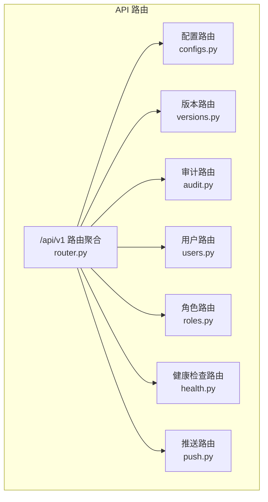
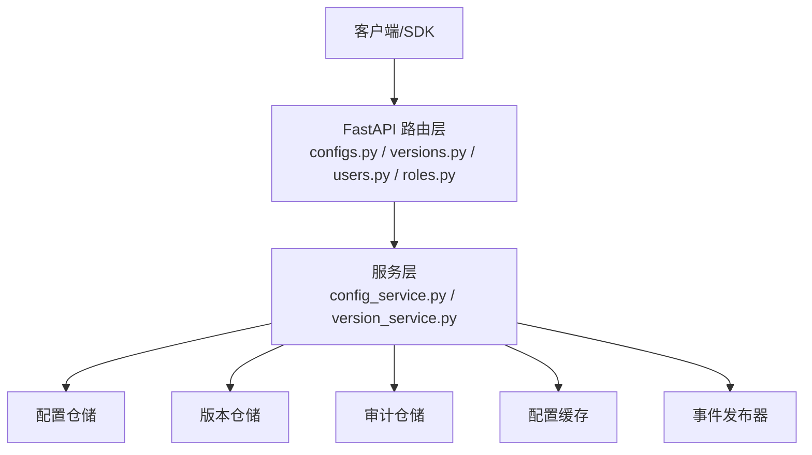
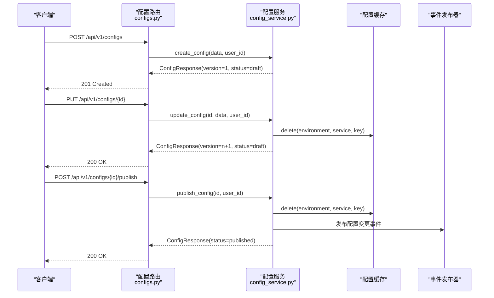
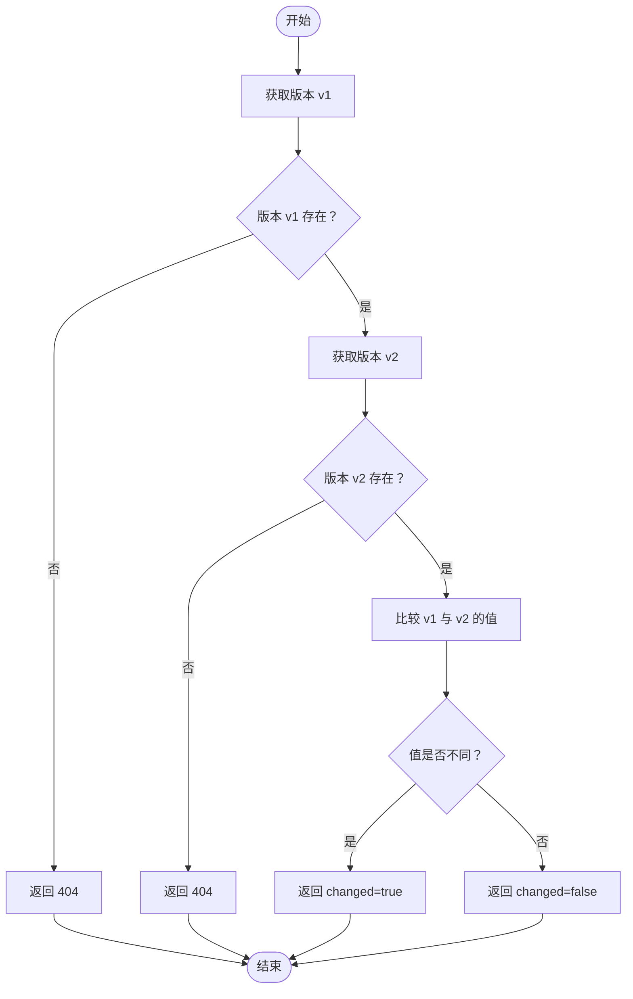
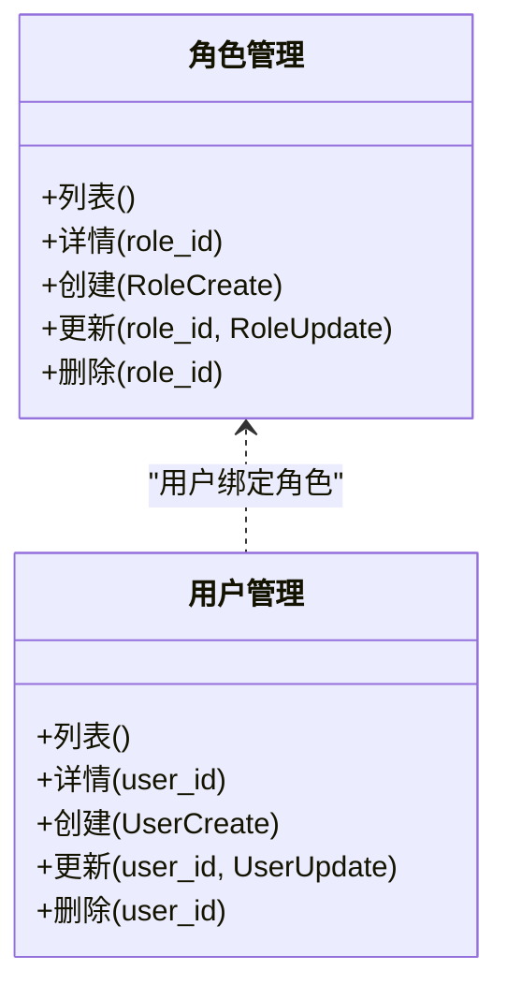
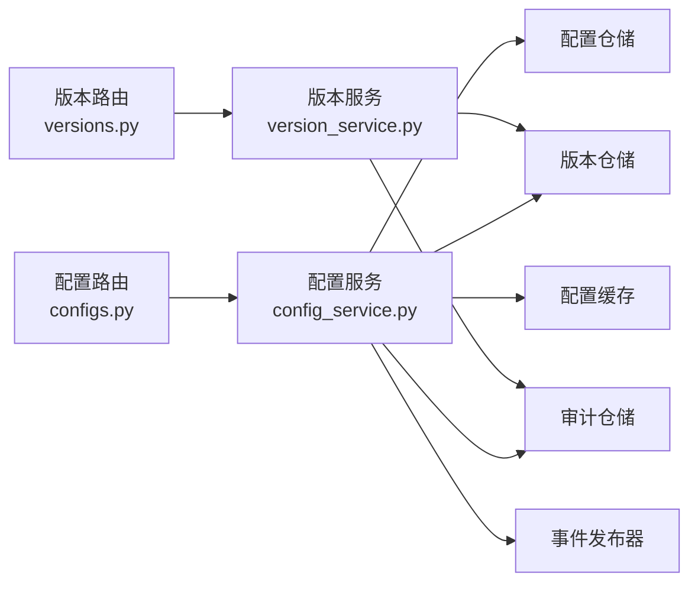

# 配置管理中心

<cite>
**本文引用的文件**
- [router.py](file://tools/flexloop/src/taolib/testing/config_center/server/api/router.py)
- [configs.py](file://tools/flexloop/src/taolib/testing/config_center/server/api/configs.py)
- [versions.py](file://tools/flexloop/src/taolib/testing/config_center/server/api/versions.py)
- [roles.py](file://tools/flexloop/src/taolib/testing/config_center/server/api/roles.py)
- [users.py](file://tools/flexloop/src/taolib/testing/config_center/server/api/users.py)
- [test_api_integration.py](file://tools/flexloop/tests/testing/test_config_center/test_api_integration.py)
- [test_client.py](file://tools/flexloop/tests/testing/test_config_center/test_client.py)
- [verify_tests.py](file://tools/flexloop/tests/testing/test_config_center/verify_tests.py)
- [config_service.py](file://tools/flexloop/src/taolib/testing/config_center/services/config_service.py)
- [version_service.py](file://tools/flexloop/src/taolib/testing/config_center/services/version_service.py)
</cite>

## 目录
1. [简介](#简介)
2. [项目结构](#项目结构)
3. [核心组件](#核心组件)
4. [架构总览](#架构总览)
5. [详细组件分析](#详细组件分析)
6. [依赖关系分析](#依赖关系分析)
7. [性能与可用性](#性能与可用性)
8. [故障排查指南](#故障排查指南)
9. [结论](#结论)
10. [附录](#附录)

## 简介
配置管理中心是一个基于 FastAPI 的动态配置管理系统，提供配置项的全生命周期管理（创建、查询、更新、删除、发布）、版本控制与回滚、审计日志、RBAC 权限控制、以及面向客户端的实时推送能力。系统采用分层架构，围绕“配置服务”“版本服务”“审计服务”“缓存”“事件发布器”等核心模块协作，确保配置变更的安全、可追溯与高可用。

## 项目结构
配置管理中心位于工具包 flexloop 的测试样例中，核心 API 聚合于统一路由器，并按功能拆分为配置、版本、审计、用户、角色、健康检查、推送等子路由。测试用例覆盖端到端 API 行为与客户端缓存行为。

图表来源
- [router.py:1-30](file://tools/flexloop/src/taolib/testing/config_center/server/api/router.py#L1-L30)

章节来源
- [router.py:1-30](file://tools/flexloop/src/taolib/testing/config_center/server/api/router.py#L1-L30)

## 核心组件
- 配置管理 API：提供配置的 CRUD、发布、列表查询等端点，内置环境隔离与版本控制。
- 版本管理 API：提供版本历史查询、指定版本详情、版本回滚、版本差异比较。
- RBAC 权限管理：角色与用户管理，支持权限与环境访问控制。
- 审计日志：对配置变更、发布、删除、回滚等关键动作进行审计记录。
- 缓存与事件：配置变更后清理缓存并触发事件推送（WebSocket），保障客户端实时感知。
- 测试验证：集成测试覆盖配置 CRUD、版本回滚、差异比较等关键流程；客户端缓存行为测试覆盖缓存命中与失效。

章节来源
- [configs.py:1-385](file://tools/flexloop/src/taolib/testing/config_center/server/api/configs.py#L1-L385)
- [versions.py:1-190](file://tools/flexloop/src/taolib/testing/config_center/server/api/versions.py#L1-L190)
- [roles.py:1-172](file://tools/flexloop/src/taolib/testing/config_center/server/api/roles.py#L1-L172)
- [users.py:1-272](file://tools/flexloop/src/taolib/testing/config_center/server/api/users.py#L1-L272)
- [config_service.py:39-331](file://tools/flexloop/src/taolib/testing/config_center/services/config_service.py#L39-L331)
- [version_service.py:47-92](file://tools/flexloop/src/taolib/testing/config_center/services/version_service.py#L47-L92)
- [test_api_integration.py:1-353](file://tools/flexloop/tests/testing/test_config_center/test_api_integration.py#L1-L353)
- [test_client.py:75-107](file://tools/flexloop/tests/testing/test_config_center/test_client.py#L75-L107)
- [verify_tests.py:101-145](file://tools/flexloop/tests/testing/test_config_center/verify_tests.py#L101-L145)

## 架构总览
系统采用“路由层-服务层-仓储层-缓存/事件/审计”的分层设计。路由层负责请求解析与鉴权；服务层编排业务逻辑（创建/更新/发布/回滚/审计/缓存清理/事件发布）；仓储层负责持久化；缓存与事件分别用于性能优化与客户端实时推送。

图表来源
- [configs.py:18-61](file://tools/flexloop/src/taolib/testing/config_center/server/api/configs.py#L18-L61)
- [versions.py:27-36](file://tools/flexloop/src/taolib/testing/config_center/server/api/versions.py#L27-L36)
- [config_service.py:39-46](file://tools/flexloop/src/taolib/testing/config_center/services/config_service.py#L39-L46)
- [version_service.py:58-72](file://tools/flexloop/src/taolib/testing/config_center/services/version_service.py#L58-L72)

## 详细组件分析

### 配置管理 API 组件
- 能力概览
  - 支持按环境与服务过滤的配置列表查询
  - 单条配置详情查询
  - 创建配置（自动生成版本 1，初始状态 draft）
  - 更新配置（自动创建新版本，已发布配置更新后状态变更为 draft）
  - 删除配置（不可恢复，删除后推送删除事件）
  - 发布配置（draft → published，清理缓存并记录审计日志）

图表来源
- [configs.py:218-382](file://tools/flexloop/src/taolib/testing/config_center/server/api/configs.py#L218-L382)
- [config_service.py:48-319](file://tools/flexloop/src/taolib/testing/config_center/services/config_service.py#L48-L319)

章节来源
- [configs.py:64-382](file://tools/flexloop/src/taolib/testing/config_center/server/api/configs.py#L64-L382)
- [config_service.py:48-319](file://tools/flexloop/src/taolib/testing/config_center/services/config_service.py#L48-L319)

### 版本管理 API 组件
- 能力概览
  - 查询配置版本历史（分页）
  - 获取指定版本详情
  - 回滚到指定版本（创建回滚版本记录、更新配置值、清除缓存、记录审计日志）
  - 比较两个版本差异（返回变更标记与版本值）

图表来源
- [versions.py:139-187](file://tools/flexloop/src/taolib/testing/config_center/server/api/versions.py#L139-L187)

章节来源
- [versions.py:39-187](file://tools/flexloop/src/taolib/testing/config_center/server/api/versions.py#L39-L187)
- [version_service.py:74-92](file://tools/flexloop/src/taolib/testing/config_center/services/version_service.py#L74-L92)

### RBAC 权限管理组件
- 角色管理
  - 角色列表、详情、创建、更新、删除
  - 系统角色禁止修改/删除
  - 角色名唯一性校验
- 用户管理
  - 用户列表、详情、创建、更新、删除
  - 用户名唯一性与密码强度校验
  - 禁止删除自身

图表来源
- [roles.py:15-170](file://tools/flexloop/src/taolib/testing/config_center/server/api/roles.py#L15-L170)
- [users.py:65-270](file://tools/flexloop/src/taolib/testing/config_center/server/api/users.py#L65-L270)

章节来源
- [roles.py:15-170](file://tools/flexloop/src/taolib/testing/config_center/server/api/roles.py#L15-L170)
- [users.py:65-270](file://tools/flexloop/src/taolib/testing/config_center/server/api/users.py#L65-L270)

### 审计日志与合规
- 审计范围
  - 配置创建、更新、删除、发布、回滚等关键操作均记录审计日志
  - 日志包含操作者、资源类型/ID/键、旧值/新值、状态与时间戳
- 合规要点
  - 审计日志作为合规证据链的一部分，需长期保存与可检索
  - 对敏感配置（如数据库凭据）的变更应触发更高权限审批与双因子审计

章节来源
- [config_service.py:250-262](file://tools/flexloop/src/taolib/testing/config_center/services/config_service.py#L250-L262)
- [config_service.py:295-305](file://tools/flexloop/src/taolib/testing/config_center/services/config_service.py#L295-L305)

### 客户端缓存与实时推送
- 缓存策略
  - 配置发布或删除后主动清理缓存，确保后续读取到最新值
  - 客户端 SDK 支持本地缓存，提升读取性能与离线容错
- 实时推送
  - 配置发布后通过事件发布器推送变更，客户端订阅后即时刷新

章节来源
- [test_client.py:79-100](file://tools/flexloop/tests/testing/test_config_center/test_client.py#L79-L100)
- [config_service.py:290-294](file://tools/flexloop/src/taolib/testing/config_center/services/config_service.py#L290-L294)

## 依赖关系分析
- 路由依赖注入
  - 配置路由通过依赖工厂注入配置仓储、版本仓储、审计仓储、缓存与事件发布器
  - 版本路由同样注入仓储与缓存，执行回滚与差异比较
- 服务层耦合
  - 配置服务依赖版本服务与审计服务，形成“配置变更 → 版本记录 → 审计日志”的闭环
  - 版本服务负责版本文档创建与查询，支撑回滚与差异比较

图表来源
- [configs.py:18-61](file://tools/flexloop/src/taolib/testing/config_center/server/api/configs.py#L18-L61)
- [versions.py:27-36](file://tools/flexloop/src/taolib/testing/config_center/server/api/versions.py#L27-L36)
- [config_service.py:39-46](file://tools/flexloop/src/taolib/testing/config_center/services/config_service.py#L39-L46)
- [version_service.py:58-72](file://tools/flexloop/src/taolib/testing/config_center/services/version_service.py#L58-L72)

章节来源
- [configs.py:18-61](file://tools/flexloop/src/taolib/testing/config_center/server/api/configs.py#L18-L61)
- [versions.py:27-36](file://tools/flexloop/src/taolib/testing/config_center/server/api/versions.py#L27-L36)
- [config_service.py:39-46](file://tools/flexloop/src/taolib/testing/config_center/services/config_service.py#L39-L46)
- [version_service.py:58-72](file://tools/flexloop/src/taolib/testing/config_center/services/version_service.py#L58-L72)

## 性能与可用性
- 缓存命中率
  - 客户端 SDK 支持本地缓存，减少重复网络请求
  - 发布/删除后主动清理缓存，避免脏读
- 并发与一致性
  - 版本号递增与回滚生成新版本，保证变更顺序可追踪
- 可观测性
  - 路由层提供健康检查端点，便于运维监控
  - 审计日志提供操作轨迹，便于问题定位与合规审计

章节来源
- [test_client.py:82-83](file://tools/flexloop/tests/testing/test_config_center/test_client.py#L82-L83)
- [config_service.py:290-294](file://tools/flexloop/src/taolib/testing/config_center/services/config_service.py#L290-L294)

## 故障排查指南
- 常见错误与处理
  - 404 未找到：配置/版本不存在或 ID 错误
  - 400 参数错误：请求体不合法、配置键冲突、版本号非法
  - 401 未授权：缺少或无效的认证令牌
  - 403 权限不足：缺少所需权限（如 config:publish、user:delete）
- 定位步骤
  - 查看路由层响应描述与状态码
  - 检查服务层日志与审计记录
  - 核对缓存是否已清理，确认客户端是否命中缓存
- 测试验证
  - 使用集成测试验证 CRUD、发布、回滚、差异比较等端点行为
  - 使用客户端缓存测试验证缓存命中与失效

章节来源
- [configs.py:95-116](file://tools/flexloop/src/taolib/testing/config_center/server/api/configs.py#L95-L116)
- [configs.py:257-263](file://tools/flexloop/src/taolib/testing/config_center/server/api/configs.py#L257-L263)
- [versions.py:86-92](file://tools/flexloop/src/taolib/testing/config_center/server/api/versions.py#L86-L92)
- [users.py:258-270](file://tools/flexloop/src/taolib/testing/config_center/server/api/users.py#L258-L270)
- [test_api_integration.py:96-162](file://tools/flexloop/tests/testing/test_config_center/test_api_integration.py#L96-L162)
- [test_api_integration.py:250-294](file://tools/flexloop/tests/testing/test_config_center/test_api_integration.py#L250-L294)
- [test_client.py:79-100](file://tools/flexloop/tests/testing/test_config_center/test_client.py#L79-L100)

## 结论
配置管理中心以清晰的分层架构与完善的权限、审计、版本与缓存机制，实现了动态配置的全生命周期管理。通过统一的 API 路由与服务编排，系统在保证安全性与可追溯性的同时，兼顾性能与可观测性。建议在生产环境中结合健康检查、事件推送与严格的 RBAC 策略，持续完善合规与安全基线。

## 附录

### API 接口总览（按模块）
- 配置管理（/api/v1/configs）
  - GET /api/v1/configs：获取配置列表（支持环境/服务过滤）
  - GET /api/v1/configs/{config_id}：获取配置详情
  - POST /api/v1/configs：创建配置（版本 1，状态 draft）
  - PUT /api/v1/configs/{config_id}：更新配置（自动创建新版本）
  - DELETE /api/v1/configs/{config_id}：删除配置
  - POST /api/v1/configs/{config_id}/publish：发布配置（draft → published）
- 版本管理（/api/v1/configs/{config_id}/versions）
  - GET /api/v1/configs/{config_id}/versions：获取版本历史
  - GET /api/v1/configs/{config_id}/versions/{version_num}：获取指定版本
  - POST /api/v1/configs/{config_id}/versions/{version_num}/rollback：回滚到指定版本
  - GET /api/v1/configs/{config_id}/versions/diff/{v1}/to/{v2}：比较两个版本差异
- 用户管理（/api/v1/users）
  - GET /api/v1/users：获取用户列表
  - GET /api/v1/users/{user_id}：获取用户详情
  - POST /api/v1/users：创建用户
  - PUT /api/v1/users/{user_id}：更新用户
  - DELETE /api/v1/users/{user_id}：删除用户
- 角色管理（/api/v1/roles）
  - GET /api/v1/roles：获取角色列表
  - GET /api/v1/roles/{role_id}：获取角色详情
  - POST /api/v1/roles：创建角色
  - PUT /api/v1/roles/{role_id}：更新角色
  - DELETE /api/v1/roles/{role_id}：删除角色

章节来源
- [configs.py:64-382](file://tools/flexloop/src/taolib/testing/config_center/server/api/configs.py#L64-L382)
- [versions.py:39-187](file://tools/flexloop/src/taolib/testing/config_center/server/api/versions.py#L39-L187)
- [users.py:65-270](file://tools/flexloop/src/taolib/testing/config_center/server/api/users.py#L65-L270)
- [roles.py:15-170](file://tools/flexloop/src/taolib/testing/config_center/server/api/roles.py#L15-L170)

### 认证与权限
- 认证方式
  - JWT 认证（所有端点默认需要）
- 权限模型
  - 配置：config:read、config:write、config:delete、config:publish
  - 用户：user:read、user:write、user:delete
  - 角色：role:read、role:write、role:delete
- 环境访问控制
  - 角色可配置环境访问列表，限制跨环境操作

章节来源
- [configs.py:39-46](file://tools/flexloop/src/taolib/testing/config_center/server/api/configs.py#L39-L46)
- [users.py:17-22](file://tools/flexloop/src/taolib/testing/config_center/server/api/users.py#L17-L22)
- [roles.py:53-69](file://tools/flexloop/src/taolib/testing/config_center/server/api/roles.py#L53-L69)

### 运维与部署建议
- 环境变量与配置
  - 数据库连接、Redis 缓存、事件发布器地址、JWT 密钥等建议通过环境变量注入
- 缓存与持久化
  - 生产环境建议使用分布式缓存（如 Redis）替代内存缓存
- 监控与告警
  - 开启健康检查端点与审计日志轮转
  - 对高风险操作（发布、回滚、删除）设置二次确认与告警
- 安全策略
  - 强制 HTTPS 传输
  - 限制速率与频率，防止暴力尝试
  - 审计日志保留期限与合规备份

章节来源
- [router.py:17-28](file://tools/flexloop/src/taolib/testing/config_center/server/api/router.py#L17-L28)
- [test_client.py:106-107](file://tools/flexloop/tests/testing/test_config_center/test_client.py#L106-L107)

### 使用案例与最佳实践
- 新增配置
  - 先创建 draft 配置，测试通过后再发布
  - 为敏感配置设置最小权限访问与审计
- 版本回滚
  - 回滚前先比较差异，确认影响范围
  - 回滚后通知相关团队并观察指标
- 权限治理
  - 将角色权限与最小权限原则结合，定期审查
  - 对关键角色与高危操作进行双人复核

章节来源
- [test_api_integration.py:178-187](file://tools/flexloop/tests/testing/test_config_center/test_api_integration.py#L178-L187)
- [test_api_integration.py:250-278](file://tools/flexloop/tests/testing/test_config_center/test_api_integration.py#L250-L278)
- [verify_tests.py:101-115](file://tools/flexloop/tests/testing/test_config_center/verify_tests.py#L101-L115)