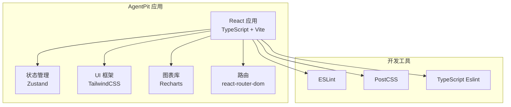
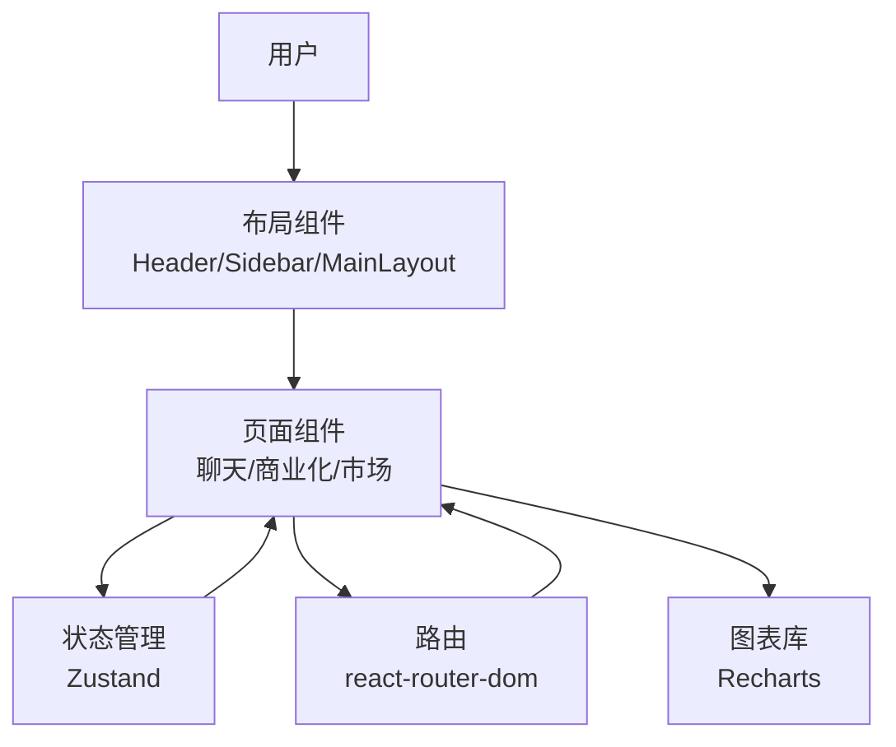
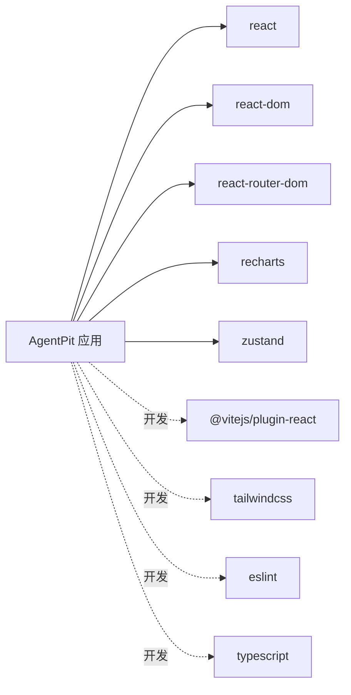

# AI代理交互机制

<cite>
**本文档引用的文件**
- [apps/AgentPit/README.md](file://apps/AgentPit/README.md)
- [apps/AgentPit/package.json](file://apps/AgentPit/package.json)
- [apps/DaoMind/README.md](file://apps/DaoMind/README.md)
- [tools/DeepResearch/README.md](file://tools/DeepResearch/README.md)
- [tools/flexloop/README.md](file://tools/flexloop/README.md)
</cite>

## 目录
1. [简介](#简介)
2. [项目结构](#项目结构)
3. [核心组件](#核心组件)
4. [架构总览](#架构总览)
5. [详细组件分析](#详细组件分析)
6. [依赖分析](#依赖分析)
7. [性能考虑](#性能考虑)
8. [故障排除指南](#故障排除指南)
9. [结论](#结论)

## 简介
本文件旨在为AgentPit AI代理交互机制提供系统化技术文档。根据当前仓库可见信息，AgentPit应用采用React + TypeScript + Vite技术栈，结合Zustand状态管理与Recharts图表库，构建面向AI代理交互的前端界面。同时，项目与DaoMind多包生态、DeepResearch研究工具以及flexloop多智能体框架存在潜在集成关系，为AI代理的初始化、对话管理、响应处理、商业化与市场功能提供基础支撑。

## 项目结构
AgentPit应用位于apps/AgentPit目录，其核心特性包括：
- 前端技术栈：React 19、TypeScript、Vite
- UI与状态：TailwindCSS、Zustand
- 图表可视化：Recharts
- 路由：react-router-dom
- 开发工具链：ESLint、PostCSS、TypeScript Eslint等

该结构为AI代理交互提供了现代化的前端基础设施，便于后续扩展商业化页面（如付费机制）、市场页面（如代理交易与评价）以及性能监控模块。

**章节来源**
- [apps/AgentPit/package.json:12-35](file://apps/AgentPit/package.json#L12-L35)
- [apps/AgentPit/README.md:1-74](file://apps/AgentPit/README.md#L1-L74)

## 核心组件
基于现有文件，AgentPit的核心组件可归纳为以下方面：
- 应用入口与主组件：负责应用初始化与根组件渲染
- 布局组件：Header、Sidebar、MainLayout等，提供统一导航与内容区域
- 页面组件：聊天页面、商业化页面、市场页面等（具体实现需在源码中确认）
- 状态管理：使用Zustand进行全局状态存储与共享
- 图表与可视化：Recharts用于展示性能指标或统计数据
- 路由系统：react-router-dom负责页面跳转与参数传递

这些组件共同构成AI代理交互的基础界面层，为后续接入后端服务与AI模型提供前端支撑。

**章节来源**
- [apps/AgentPit/package.json:12-35](file://apps/AgentPit/package.json#L12-L35)

## 架构总览
AgentPit前端架构围绕“布局-页面-状态-路由”展开，并通过Recharts实现数据可视化。下图展示了典型交互流程：用户在聊天页面发起请求，前端通过状态管理协调UI更新，最终将请求传递至后端或AI服务。

## 详细组件分析
由于当前仓库未包含AgentPit的完整源码结构，无法对具体组件进行逐项代码级分析。但基于现有配置文件，可以推断以下关键点：
- 初始化流程：应用启动时加载路由、状态与UI样式，随后进入页面渲染阶段
- 对话管理：聊天页面通过状态管理维护消息列表、输入框状态与发送按钮行为
- 响应处理：消息发送后，前端等待后端响应并更新UI；若涉及流式输出，可结合WebSocket或Server-Sent Events实现
- 商业化页面：付费机制、资源分配与收益分成需结合后端API与支付网关实现
- 市场页面：代理交易、评价系统与信誉管理需建立在用户认证与权限控制之上

为获得更精确的实现细节，建议补充AgentPit的src目录结构与关键页面组件代码。

## 依赖分析
AgentPit应用的依赖关系如下：
- 运行时依赖：react、react-dom、react-router-dom、recharts、zustand
- 开发依赖：@vitejs/plugin-react、tailwindcss、eslint、typescript等

**图表来源**
- [apps/AgentPit/package.json:12-35](file://apps/AgentPit/package.json#L12-L35)

**章节来源**
- [apps/AgentPit/package.json:12-35](file://apps/AgentPit/package.json#L12-L35)

## 性能考虑
- 前端性能优化：利用Vite的快速冷启动与热更新能力；合理拆分路由与组件，启用懒加载减少首屏体积
- 状态管理：Zustand轻量高效，建议按域划分store，避免全局状态污染
- 图表渲染：Recharts按需渲染，避免大数据量时的重绘开销
- 资源加载：TailwindCSS按需引入，减少CSS体积；图片与静态资源使用CDN加速
- 缓存策略：浏览器缓存与HTTP缓存结合，提升重复访问性能

## 故障排除指南
- 构建失败：检查TypeScript配置与ESLint规则是否冲突；确保项目依赖版本兼容
- 路由问题：确认react-router-dom版本与路由配置一致；检查路径与参数传递
- 状态异常：排查Zustand store的订阅与更新逻辑，避免竞态条件
- 图表显示异常：验证数据格式与图表配置，确保数据类型一致
- 性能瓶颈：使用浏览器开发者工具分析内存与CPU占用，定位渲染热点

## 结论
AgentPit应用以现代前端技术栈为基础，具备良好的扩展性与可维护性。结合DaoMind生态与相关工具链，可在聊天交互、商业化与市场功能上实现深度集成。建议尽快完善AgentPit的源码结构与关键页面实现，以便进一步细化AI代理交互机制的技术文档。