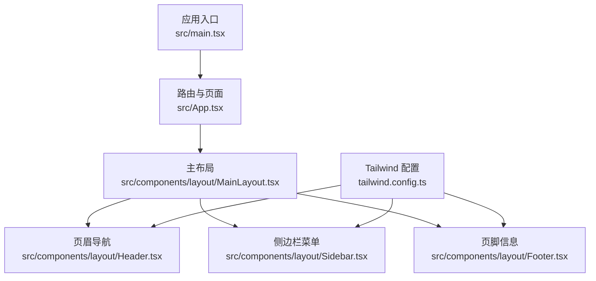
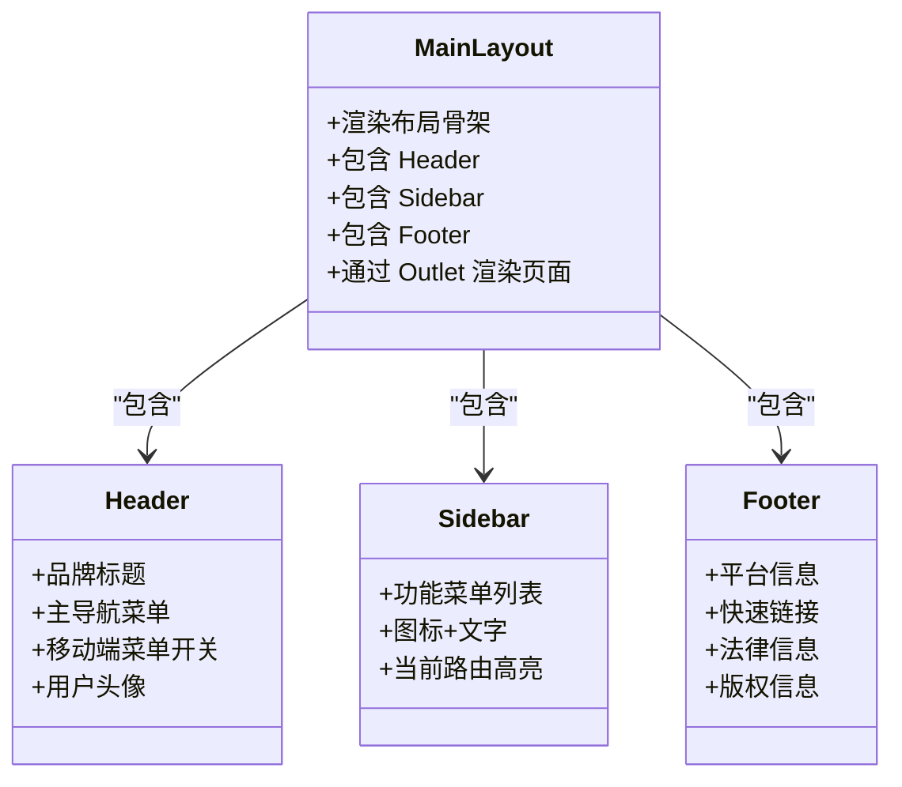
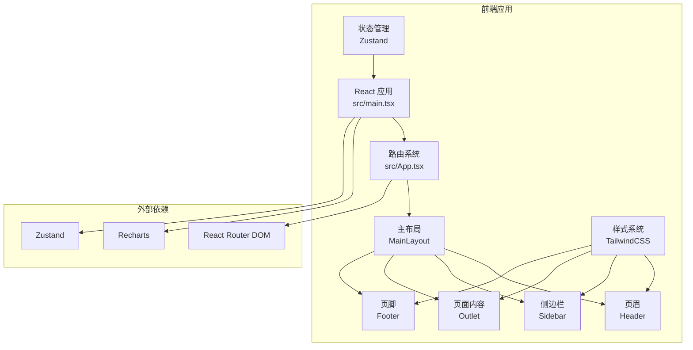
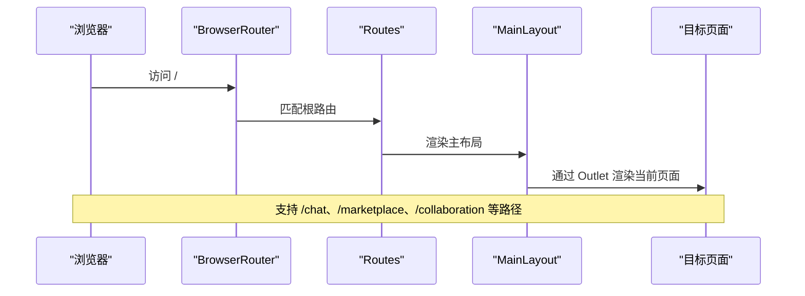
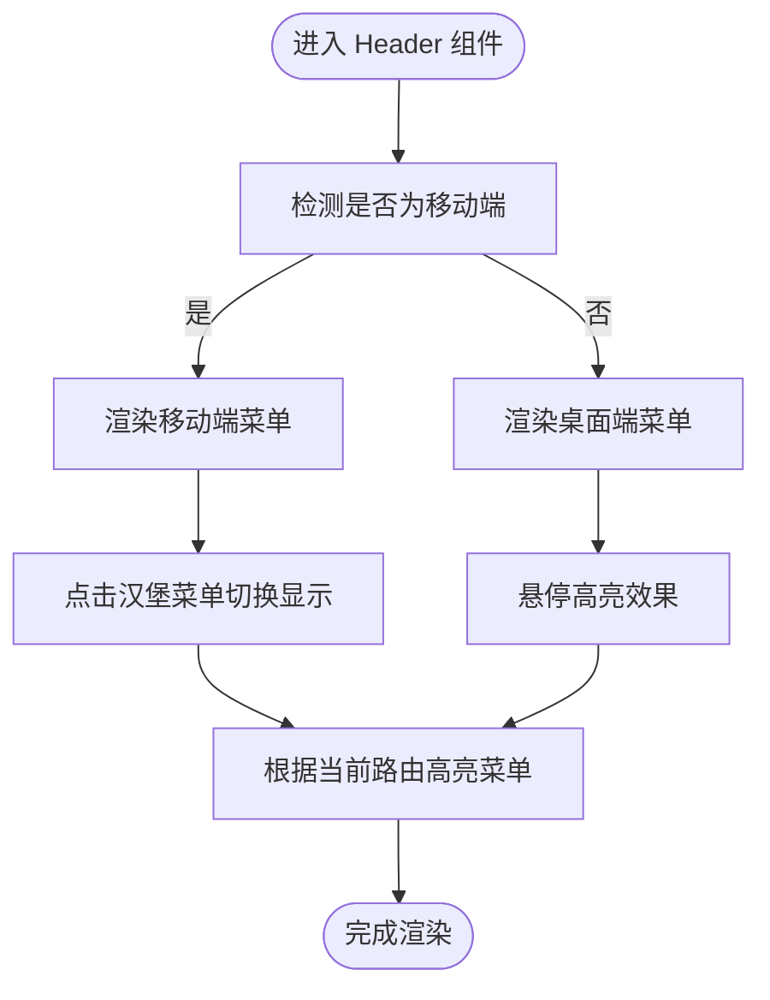
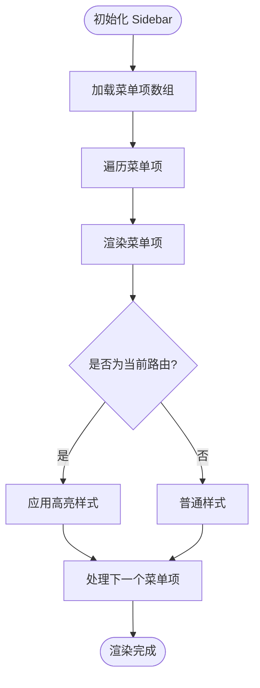
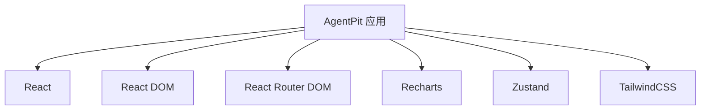

# AgentPit AI代理平台

<cite>
**本文档引用的文件**
- [README.md](file://apps/AgentPit/README.md)
- [package.json](file://apps/AgentPit/package.json)
- [src/App.tsx](file://apps/AgentPit/src/App.tsx)
- [src/main.tsx](file://apps/AgentPit/src/main.tsx)
- [src/components/layout/MainLayout.tsx](file://apps/AgentPit/src/components/layout/MainLayout.tsx)
- [src/components/layout/Header.tsx](file://apps/AgentPit/src/components/layout/Header.tsx)
- [src/components/layout/Footer.tsx](file://apps/AgentPit/src/components/layout/Footer.tsx)
- [src/components/layout/Sidebar.tsx](file://apps/AgentPit/src/components/layout/Sidebar.tsx)
- [tailwind.config.ts](file://apps/AgentPit/tailwind.config.ts)
</cite>

## 目录
1. [简介](#简介)
2. [项目结构](#项目结构)
3. [核心组件](#核心组件)
4. [架构总览](#架构总览)
5. [详细组件分析](#详细组件分析)
6. [依赖关系分析](#依赖关系分析)
7. [性能考虑](#性能考虑)
8. [故障排除指南](#故障排除指南)
9. [结论](#结论)
10. [附录](#附录)

## 简介
AgentPit 是一个基于 React + TypeScript + Vite 构建的 AI 代理协作平台前端应用，采用 TailwindCSS 进行样式设计，并通过 Zustand 实现轻量级状态管理。该平台围绕 AI 代理管理、智能对话、商业化变现、市场交易与协作等功能模块展开，提供完整的主布局、页眉导航、侧边栏菜单与页脚信息的用户界面。

平台的核心特性包括：
- AI 代理管理：支持代理的创建、配置与生命周期管理
- 智能对话：提供与代理进行自然语言交互的聊天界面
- 商业化模式：内置自动变现与收益管理能力
- 市场交易：构建代理相关的交易与资源市场
- 协作功能：多智能体协同工作与任务编排
- 存储记忆：持久化代理与用户的交互记忆
- 定制智能体：按需定制代理行为与参数
- 生活服务：集成日常生活的辅助工具与服务
- 系统设置：统一的平台配置与个性化设置

## 项目结构
AgentPit 应用采用清晰的分层组织方式：
- 根目录包含应用入口、路由配置与布局组件
- 组件层分为布局组件（Header、Sidebar、Footer、MainLayout）
- 页面层包含各功能页面（如聊天、市场、协作等）
- 样式层通过 TailwindCSS 配置主题色与响应式布局
- 状态管理采用 Zustand 轻量方案

**图表来源**
- [src/main.tsx:1-11](file://apps/AgentPit/src/main.tsx#L1-L11)
- [src/App.tsx:1-38](file://apps/AgentPit/src/App.tsx#L1-L38)
- [src/components/layout/MainLayout.tsx:1-22](file://apps/AgentPit/src/components/layout/MainLayout.tsx#L1-L22)
- [src/components/layout/Header.tsx:1-99](file://apps/AgentPit/src/components/layout/Header.tsx#L1-L99)
- [src/components/layout/Sidebar.tsx:1-137](file://apps/AgentPit/src/components/layout/Sidebar.tsx#L1-L137)
- [src/components/layout/Footer.tsx:1-46](file://apps/AgentPit/src/components/layout/Footer.tsx#L1-L46)
- [tailwind.config.ts:1-30](file://apps/AgentPit/tailwind.config.ts#L1-L30)

**章节来源**
- [src/main.tsx:1-11](file://apps/AgentPit/src/main.tsx#L1-L11)
- [src/App.tsx:1-38](file://apps/AgentPit/src/App.tsx#L1-L38)
- [tailwind.config.ts:1-30](file://apps/AgentPit/tailwind.config.ts#L1-L30)

## 核心组件
本节深入分析 AgentPit 的核心组件及其职责与交互关系。

- 主布局组件 MainLayout：负责整体页面骨架，包含 Header、Sidebar 与 Footer，并通过 Outlet 渲染当前路由页面内容。
- 页眉组件 Header：提供品牌标识、主导航菜单、移动端汉堡菜单与用户头像区域。
- 侧边栏组件 Sidebar：提供功能菜单导航，支持图标与文字标签，高亮当前选中项。
- 页脚组件 Footer：展示平台信息、快速链接与法律信息，底部版权信息。

**图表来源**
- [src/components/layout/MainLayout.tsx:1-22](file://apps/AgentPit/src/components/layout/MainLayout.tsx#L1-L22)
- [src/components/layout/Header.tsx:1-99](file://apps/AgentPit/src/components/layout/Header.tsx#L1-L99)
- [src/components/layout/Sidebar.tsx:1-137](file://apps/AgentPit/src/components/layout/Sidebar.tsx#L1-L137)
- [src/components/layout/Footer.tsx:1-46](file://apps/AgentPit/src/components/layout/Footer.tsx#L1-L46)

**章节来源**
- [src/components/layout/MainLayout.tsx:1-22](file://apps/AgentPit/src/components/layout/MainLayout.tsx#L1-L22)
- [src/components/layout/Header.tsx:1-99](file://apps/AgentPit/src/components/layout/Header.tsx#L1-L99)
- [src/components/layout/Sidebar.tsx:1-137](file://apps/AgentPit/src/components/layout/Sidebar.tsx#L1-L137)
- [src/components/layout/Footer.tsx:1-46](file://apps/AgentPit/src/components/layout/Footer.tsx#L1-L46)

## 架构总览
AgentPit 采用前端单页应用（SPA）架构，基于 React Router v6 进行路由管理，Zustand 提供轻量状态管理，TailwindCSS 实现响应式 UI 设计。

**图表来源**
- [src/main.tsx:1-11](file://apps/AgentPit/src/main.tsx#L1-L11)
- [src/App.tsx:1-38](file://apps/AgentPit/src/App.tsx#L1-L38)
- [package.json:12-18](file://apps/AgentPit/package.json#L12-L18)
- [tailwind.config.ts:1-30](file://apps/AgentPit/tailwind.config.ts#L1-L30)

**章节来源**
- [src/App.tsx:1-38](file://apps/AgentPit/src/App.tsx#L1-L38)
- [package.json:12-18](file://apps/AgentPit/package.json#L12-L18)
- [tailwind.config.ts:1-30](file://apps/AgentPit/tailwind.config.ts#L1-L30)

## 详细组件分析

### 路由系统与页面映射
AgentPit 使用 React Router v6 的嵌套路由结构，根路由下挂载多个功能页面。每个页面对应一个独立的功能模块，便于后续扩展与维护。

**图表来源**
- [src/App.tsx:15-35](file://apps/AgentPit/src/App.tsx#L15-L35)
- [src/components/layout/MainLayout.tsx:6-19](file://apps/AgentPit/src/components/layout/MainLayout.tsx#L6-L19)

**章节来源**
- [src/App.tsx:1-38](file://apps/AgentPit/src/App.tsx#L1-L38)

### 页眉导航与移动端适配
Header 组件提供桌面端与移动端两种导航体验。桌面端以水平导航为主，移动端通过汉堡菜单切换显示。组件根据当前路由高亮对应菜单项，提升用户体验。

**图表来源**
- [src/components/layout/Header.tsx:4-98](file://apps/AgentPit/src/components/layout/Header.tsx#L4-L98)

**章节来源**
- [src/components/layout/Header.tsx:1-99](file://apps/AgentPit/src/components/layout/Header.tsx#L1-L99)

### 侧边栏导航与图标菜单
Sidebar 提供左侧功能导航，包含 11 个功能模块的图标与文字标签。当前路由会高亮对应菜单项，确保用户明确当前位置。

**图表来源**
- [src/components/layout/Sidebar.tsx:3-136](file://apps/AgentPit/src/components/layout/Sidebar.tsx#L3-L136)

**章节来源**
- [src/components/layout/Sidebar.tsx:1-137](file://apps/AgentPit/src/components/layout/Sidebar.tsx#L1-L137)

### 页面功能说明与使用示例
以下为 AgentPit 平台各页面的功能概览与使用建议：

- 首页（/）：平台入口页面，展示核心功能概览与快捷入口
- 自动变现（/monetization）：配置与管理 AI 代理的商业化策略
- Sphinx 建站（/sphinx）：基于 AI 的网站搭建与内容生成
- 智能体对话（/chat）：与代理进行实时对话交互
- 社交连接（/social）：与其他用户或代理建立社交关系
- 交易市场（/marketplace）：浏览与购买代理相关的产品与服务
- 多智能体协作（/collaboration）：编排多个代理共同完成复杂任务
- 存储记忆（/memory）：查看与管理代理的历史交互记录
- 定制智能体（/customize）：调整代理的行为参数与能力配置
- 生活服务（/lifestyle）：提供日常生活的辅助工具与服务
- 系统设置（/settings）：统一的平台配置与个性化设置

使用示例：
- 在侧边栏点击任意功能菜单，即可跳转至对应页面
- 在移动端设备上，点击汉堡菜单展开导航菜单
- 在聊天页面中，输入消息并与代理进行对话

**章节来源**
- [src/components/layout/Sidebar.tsx:6-108](file://apps/AgentPit/src/components/layout/Sidebar.tsx#L6-L108)
- [src/components/layout/Header.tsx:8-20](file://apps/AgentPit/src/components/layout/Header.tsx#L8-L20)

### 数据流设计与状态管理
AgentPit 采用 Zustand 作为状态管理方案，适合中小型应用的状态管理需求。推荐在以下场景使用 Zustand：
- 用户登录状态与权限信息
- 当前选中的功能模块
- 聊天消息的临时状态
- 页面配置与主题偏好

状态设计建议：
- 将全局共享状态拆分为多个 Store，避免单一 Store 过大
- 对于复杂对象，使用不可变更新策略
- 为状态添加类型定义，提升开发体验与可维护性

**章节来源**
- [package.json:17](file://apps/AgentPit/package.json#L17)

## 依赖关系分析
AgentPit 的依赖关系清晰且集中，核心依赖如下：
- React 与 React DOM：提供组件化 UI 构建能力
- React Router DOM：提供路由与导航能力
- Recharts：提供图表可视化能力
- Zustand：提供轻量级状态管理
- TailwindCSS：提供样式与响应式布局

**图表来源**
- [package.json:12-18](file://apps/AgentPit/package.json#L12-L18)

**章节来源**
- [package.json:12-18](file://apps/AgentPit/package.json#L12-L18)

## 性能考虑
为确保 AgentPit 在不同设备上的流畅体验，建议关注以下性能优化点：
- 路由懒加载：对大型页面组件启用懒加载，减少首屏加载时间
- 图标与图片优化：压缩与懒加载图片资源，使用合适的格式
- TailwindCSS：仅引入需要的样式类，避免无用样式
- 状态管理：合理拆分 Store，避免不必要的重渲染
- 移动端适配：针对小屏设备优化交互与布局

[本节为通用性能指导，无需特定文件引用]

## 故障排除指南
常见问题与解决方法：
- 路由不生效：检查路由配置与路径拼写，确认 BrowserRouter 包裹了整个应用
- 样式异常：确认 TailwindCSS 配置正确，检查类名拼写与冲突
- 移动端菜单无法展开：检查事件绑定与状态切换逻辑
- 状态更新无效：确认 Zustand Store 的订阅与更新方式

**章节来源**
- [src/App.tsx:15-35](file://apps/AgentPit/src/App.tsx#L15-L35)
- [src/components/layout/Header.tsx:59-70](file://apps/AgentPit/src/components/layout/Header.tsx#L59-L70)

## 结论
AgentPit AI 代理平台通过清晰的组件化架构与简洁的路由设计，为用户提供了一个功能完备的 AI 代理协作入口。其基于 React + TypeScript + Vite 的技术栈保证了开发效率与运行性能，配合 TailwindCSS 的响应式设计与 Zustand 的轻量状态管理，形成了易于扩展与维护的前端框架。未来可在路由懒加载、状态模块化与移动端交互优化等方面进一步完善。

[本节为总结性内容，无需特定文件引用]

## 附录

### 配置选项与环境变量
- TailwindCSS 主题色配置：primary 色系用于高亮与强调
- 路由路径：所有功能页面均通过相对路径注册在根路由下
- 组件样式：统一使用 TailwindCSS 类名，确保一致的视觉风格

**章节来源**
- [tailwind.config.ts:8-24](file://apps/AgentPit/tailwind.config.ts#L8-L24)
- [src/App.tsx:18-31](file://apps/AgentPit/src/App.tsx#L18-L31)