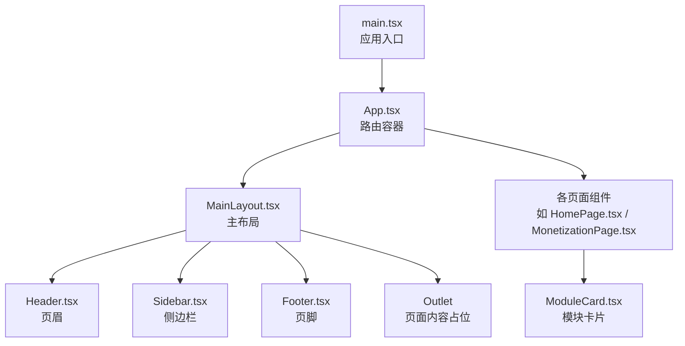
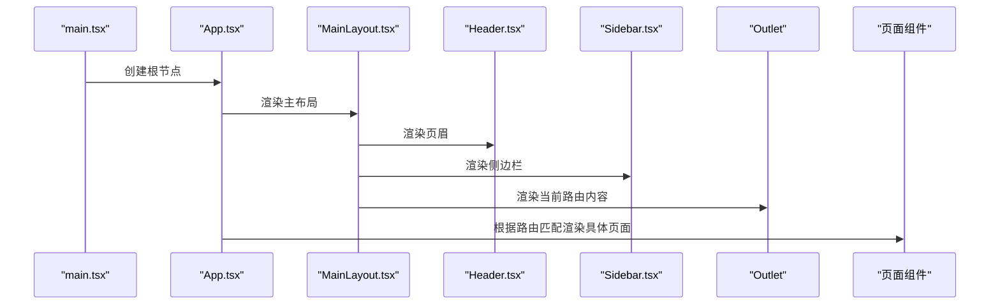
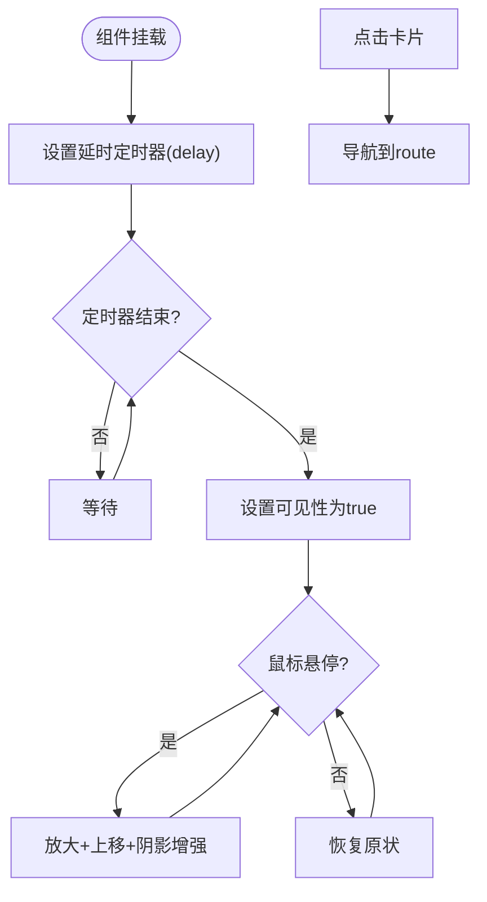
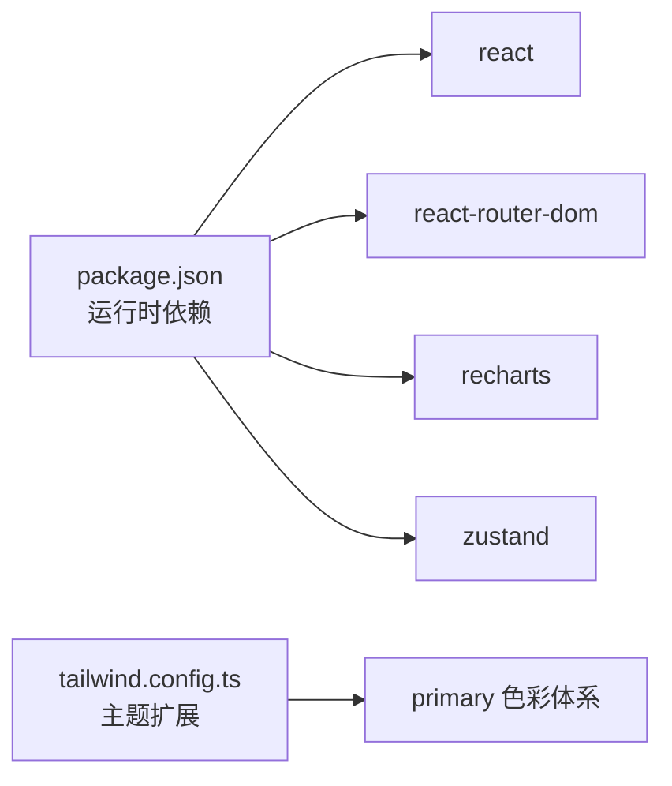

# 布局组件系统

<cite>
**本文引用的文件**
- [MainLayout.tsx](file://apps/AgentPit/src/components/layout/MainLayout.tsx)
- [Header.tsx](file://apps/AgentPit/src/components/layout/Header.tsx)
- [Footer.tsx](file://apps/AgentPit/src/components/layout/Footer.tsx)
- [Sidebar.tsx](file://apps/AgentPit/src/components/layout/Sidebar.tsx)
- [App.tsx](file://apps/AgentPit/src/App.tsx)
- [main.tsx](file://apps/AgentPit/src/main.tsx)
- [ModuleCard.tsx](file://apps/AgentPit/src/components/home/ModuleCard.tsx)
- [HomePage.tsx](file://apps/AgentPit/src/pages/HomePage.tsx)
- [MonetizationPage.tsx](file://apps/AgentPit/src/pages/MonetizationPage.tsx)
- [package.json](file://apps/AgentPit/package.json)
- [tailwind.config.ts](file://apps/AgentPit/tailwind.config.ts)
</cite>

## 目录
1. [引言](#引言)
2. [项目结构](#项目结构)
3. [核心组件](#核心组件)
4. [架构总览](#架构总览)
5. [详细组件分析](#详细组件分析)
6. [依赖关系分析](#依赖关系分析)
7. [性能考量](#性能考量)
8. [故障排查指南](#故障排查指南)
9. [结论](#结论)
10. [附录](#附录)

## 引言
本文件面向 AgentPit AI 代理平台的布局组件系统，系统性阐述主布局、页眉、页脚与侧边栏的设计理念与实现方式；同时深入解析模块卡片组件的渲染逻辑、交互行为与可配置参数；最后覆盖组件间通信机制、事件传递与数据流向，并提供样式定制、动画效果与无障碍访问支持建议，以及可扩展性设计与最佳实践。

## 项目结构
AgentPit 应用采用基于路由的布局组织：顶层路由容器负责嵌套主布局，主布局再组合页眉、侧边栏与页脚，页面内容由 Outlet 渲染。模块卡片组件在首页中以网格形式呈现，承载导航与视觉反馈。

图表来源
- [main.tsx:1-11](file://apps/AgentPit/src/main.tsx#L1-L11)
- [App.tsx:1-38](file://apps/AgentPit/src/App.tsx#L1-L38)
- [MainLayout.tsx:1-22](file://apps/AgentPit/src/components/layout/MainLayout.tsx#L1-L22)
- [Header.tsx:1-99](file://apps/AgentPit/src/components/layout/Header.tsx#L1-L99)
- [Sidebar.tsx:1-137](file://apps/AgentPit/src/components/layout/Sidebar.tsx#L1-L137)
- [Footer.tsx:1-46](file://apps/AgentPit/src/components/layout/Footer.tsx#L1-L46)
- [HomePage.tsx:1-192](file://apps/AgentPit/src/pages/HomePage.tsx#L1-L192)
- [ModuleCard.tsx:1-98](file://apps/AgentPit/src/components/home/ModuleCard.tsx#L1-L98)

章节来源
- [main.tsx:1-11](file://apps/AgentPit/src/main.tsx#L1-L11)
- [App.tsx:1-38](file://apps/AgentPit/src/App.tsx#L1-L38)

## 核心组件
- 主布局（MainLayout）
  - 负责整体骨架：顶部页眉、中部主体区域（左侧侧边栏、右侧内容区）、底部页脚。
  - 内容区通过 Outlet 渲染当前路由对应的页面组件。
  - 使用 Flex 布局与最小高度约束，确保页脚始终位于可视底部。
- 页眉（Header）
  - 包含品牌标识、桌面端导航菜单、移动端汉堡菜单、搜索按钮与用户头像。
  - 使用路由位置高亮当前导航项，移动端菜单通过本地状态控制显示/隐藏。
- 侧边栏（Sidebar）
  - 提供功能入口列表，每个条目包含图标、路径与标签。
  - 高亮当前激活路径，桌面端默认展示，移动端隐藏。
- 页脚（Footer）
  - 展示平台简介、快速链接与法律信息三列布局，支持响应式网格。
- 模块卡片（ModuleCard）
  - 可点击的卡片组件，支持渐入动画、悬停缩放与阴影变化。
  - 接收标题、副标题、图标、路由、渐变色与延迟等参数。

章节来源
- [MainLayout.tsx:1-22](file://apps/AgentPit/src/components/layout/MainLayout.tsx#L1-L22)
- [Header.tsx:1-99](file://apps/AgentPit/src/components/layout/Header.tsx#L1-L99)
- [Sidebar.tsx:1-137](file://apps/AgentPit/src/components/layout/Sidebar.tsx#L1-L137)
- [Footer.tsx:1-46](file://apps/AgentPit/src/components/layout/Footer.tsx#L1-L46)
- [ModuleCard.tsx:1-98](file://apps/AgentPit/src/components/home/ModuleCard.tsx#L1-L98)

## 架构总览
下图展示了从应用入口到页面渲染的完整流程，以及布局与页面之间的嵌套关系。

图表来源
- [main.tsx:1-11](file://apps/AgentPit/src/main.tsx#L1-L11)
- [App.tsx:1-38](file://apps/AgentPit/src/App.tsx#L1-L38)
- [MainLayout.tsx:1-22](file://apps/AgentPit/src/components/layout/MainLayout.tsx#L1-L22)

## 详细组件分析

### 主布局组件（MainLayout）
- 结构职责
  - 定义全局容器与 Flex 布局，保证内容区自适应填充剩余空间。
  - 将 Header、Sidebar、Footer 与 Outlet 组合，形成稳定骨架。
- 关键点
  - 外层容器使用最小高度与背景色，确保页脚不被内容挤出视窗。
  - 主体区域采用 Flex 与溢出滚动，避免固定高度导致的布局问题。
- 可扩展性
  - 可在内容区外层包裹加载态、错误态或全局提示容器。
  - 可引入主题上下文，在此组件内统一注入主题类名或样式变量。

章节来源
- [MainLayout.tsx:1-22](file://apps/AgentPit/src/components/layout/MainLayout.tsx#L1-L22)

### 页眉组件（Header）
- 导航与高亮
  - 导航项数组集中定义，便于维护与扩展。
  - 使用路由位置判断当前高亮项，提升用户体验。
- 移动端适配
  - 汉堡菜单通过本地状态控制展开/收起，点击移动端导航项后自动收起。
- 交互细节
  - 搜索按钮与用户头像采用图标与占位头像，预留扩展空间。
- 可扩展性
  - 可接入用户登录态、消息通知、主题切换等控制面板。
  - 可增加面包屑导航或快捷操作按钮。

章节来源
- [Header.tsx:1-99](file://apps/AgentPit/src/components/layout/Header.tsx#L1-L99)

### 侧边栏组件（Sidebar）
- 菜单结构
  - 每个菜单项包含图标、路径与标签，图标采用 SVG，保持矢量清晰度。
  - 高亮逻辑与页眉一致，增强导航一致性。
- 响应式策略
  - 默认仅桌面端展示，移动端通过路由跳转或抽屉式菜单实现。
- 可扩展性
  - 可按模块分组添加分隔线或分组标题。
  - 可接入权限控制，动态过滤菜单项。

章节来源
- [Sidebar.tsx:1-137](file://apps/AgentPit/src/components/layout/Sidebar.tsx#L1-L137)

### 页脚组件（Footer）
- 结构与内容
  - 三列布局展示平台信息、快速链接与法律信息，支持移动端堆叠。
  - 年份动态生成，减少维护成本。
- 可扩展性
  - 可增加社交媒体图标、订阅表单或站点地图链接。
  - 可接入无障碍访问的版权与隐私声明链接。

章节来源
- [Footer.tsx:1-46](file://apps/AgentPit/src/components/layout/Footer.tsx#L1-L46)

### 模块卡片组件（ModuleCard）
- Props 接口
  - title: 标题文本
  - subtitle: 副标题文本
  - icon: 图标元素（ReactNode）
  - route: 导航目标路径
  - gradientFrom / gradientTo: 渐变色类名
  - delay?: 动画延迟（毫秒）
- 状态与行为
  - 本地状态：可见性（动画触发）、悬停状态（缩放与阴影）。
  - 动画：进入时的淡入与位移，悬停时的缩放与位移。
  - 交互：点击导航至指定路由。
- 渲染逻辑
  - 使用条件类名控制可见性与悬停效果，结合过渡动画实现流畅体验。
  - 背景使用渐变与模糊效果，营造现代感。
- 可配置参数
  - 可通过外部传入不同图标、颜色与延迟，适配不同模块风格。
- 可扩展性
  - 可增加“新”、“推荐”徽标，或评分、收藏等交互。
  - 可接入埋点统计与 A/B 实验参数。

图表来源
- [ModuleCard.tsx:1-98](file://apps/AgentPit/src/components/home/ModuleCard.tsx#L1-L98)

章节来源
- [ModuleCard.tsx:1-98](file://apps/AgentPit/src/components/home/ModuleCard.tsx#L1-L98)
- [HomePage.tsx:1-192](file://apps/AgentPit/src/pages/HomePage.tsx#L1-L192)

### 页面与布局的通信机制
- 路由驱动的数据流
  - App.tsx 中的路由配置决定当前渲染的页面组件。
  - MainLayout.tsx 的 Outlet 根据当前路由渲染对应页面。
- 导航联动
  - Header 与 Sidebar 通过路由位置高亮当前页面，实现导航与内容的联动。
- 事件传递
  - ModuleCard 通过导航钩子触发路由跳转，实现从卡片到页面的事件传递。
- 数据流向
  - 从入口文件 main.tsx -> App.tsx -> MainLayout.tsx -> Outlet -> 具体页面组件。
  - 交互事件从页面组件或卡片组件触发，经路由与状态更新回流到 UI。

章节来源
- [App.tsx:1-38](file://apps/AgentPit/src/App.tsx#L1-L38)
- [MainLayout.tsx:1-22](file://apps/AgentPit/src/components/layout/MainLayout.tsx#L1-L22)
- [Header.tsx:1-99](file://apps/AgentPit/src/components/layout/Header.tsx#L1-L99)
- [Sidebar.tsx:1-137](file://apps/AgentPit/src/components/layout/Sidebar.tsx#L1-L137)
- [ModuleCard.tsx:1-98](file://apps/AgentPit/src/components/home/ModuleCard.tsx#L1-L98)

## 依赖关系分析
- 运行时依赖
  - React 与 React Router DOM：提供组件框架与路由能力。
  - Recharts：用于图表展示（页面中可能使用）。
  - Zustand：状态管理库（页面中未直接使用，但可作为扩展方案）。
- 开发时依赖
  - TailwindCSS、PostCSS、TypeScript、ESLint、Vite 等工具链。
- 主题与样式
  - Tailwind 配置中扩展了 primary 色彩体系，用于页眉高亮与卡片渐变。

图表来源
- [package.json:1-37](file://apps/AgentPit/package.json#L1-L37)
- [tailwind.config.ts:1-30](file://apps/AgentPit/tailwind.config.ts#L1-L30)

章节来源
- [package.json:1-37](file://apps/AgentPit/package.json#L1-L37)
- [tailwind.config.ts:1-30](file://apps/AgentPit/tailwind.config.ts#L1-L30)

## 性能考量
- 渲染优化
  - 使用局部状态控制移动端菜单与卡片动画，避免全局重渲染。
  - 卡片使用延迟动画，减少首屏压力。
- 路由与懒加载
  - 可将页面组件改为动态导入，配合 Suspense 实现路由级懒加载。
- 样式体积
  - Tailwind 按需引入与摇树优化，避免无用样式。
- 图标与资源
  - SVG 图标内联，减少请求；大图资源按需加载。

## 故障排查指南
- 页脚“顶到内容”
  - 检查主布局容器是否设置了最小高度与 Flex 布局，确保页脚始终在底部。
- 导航高亮异常
  - 确认当前路由与菜单项路径一致，检查高亮判断逻辑。
- 移动端菜单无法关闭
  - 检查移动端菜单状态绑定与点击回调是否正确。
- 卡片点击无反应
  - 确认路由配置与导航钩子使用正确，检查路径是否存在。
- 样式主题不生效
  - 检查 Tailwind 配置与颜色类名拼写，确认主题扩展是否正确引入。

章节来源
- [MainLayout.tsx:1-22](file://apps/AgentPit/src/components/layout/MainLayout.tsx#L1-L22)
- [Header.tsx:1-99](file://apps/AgentPit/src/components/layout/Header.tsx#L1-L99)
- [Sidebar.tsx:1-137](file://apps/AgentPit/src/components/layout/Sidebar.tsx#L1-L137)
- [ModuleCard.tsx:1-98](file://apps/AgentPit/src/components/home/ModuleCard.tsx#L1-L98)
- [tailwind.config.ts:1-30](file://apps/AgentPit/tailwind.config.ts#L1-L30)

## 结论
AgentPit 的布局组件系统以简洁的结构与明确的职责划分实现了良好的可维护性与可扩展性。主布局、页眉、侧边栏与页脚协同工作，配合模块卡片的交互与动画，为用户提供了直观且富有表现力的操作界面。通过路由驱动的数据流与本地状态管理，系统在保持轻量的同时具备了进一步扩展的能力。

## 附录
- 响应式设计要点
  - 使用 Tailwind 断点类控制桌面与移动端布局差异。
  - 页眉与侧边栏采用隐藏/显示策略，移动端通过路由或抽屉实现替代导航。
- 主题切换建议
  - 在主布局容器上切换主题类名，或通过 CSS 变量与 Tailwind 扩展实现动态主题。
- 无障碍访问支持
  - 为图标与按钮提供可读性描述（aria-label），确保键盘可访问性。
  - 为导航项提供当前状态提示（aria-current），提升屏幕阅读器体验。
- 最佳实践
  - 将导航项与页面路由集中管理，便于维护与扩展。
  - 对于复杂交互，优先使用本地状态与受控组件，避免过度依赖全局状态。
  - 对关键组件进行性能测试，必要时引入懒加载与虚拟化技术。