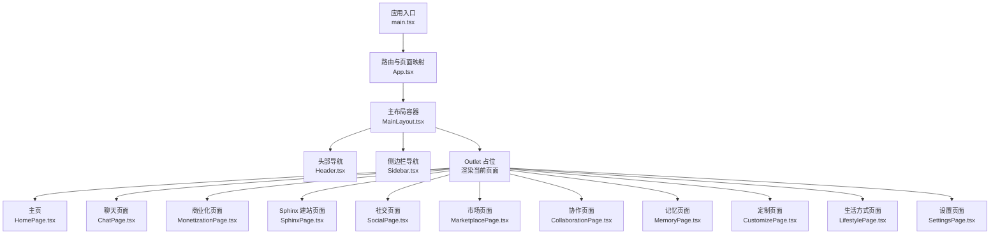
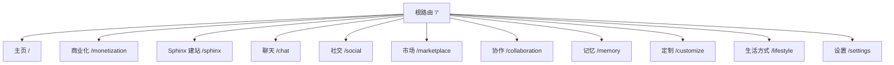
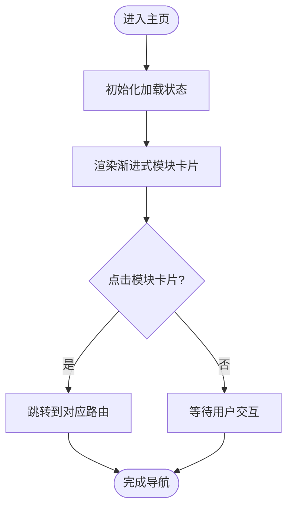
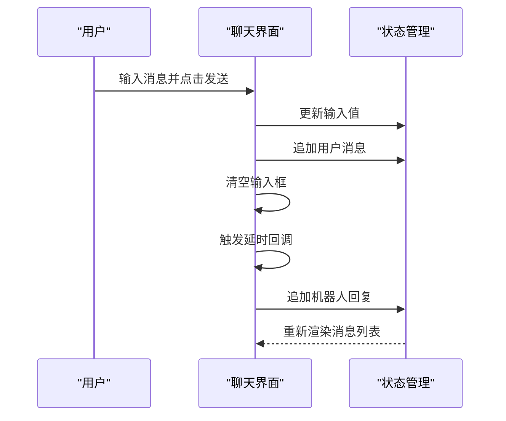
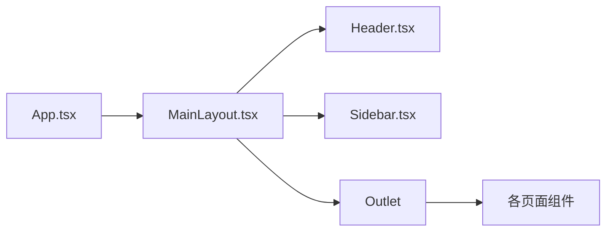

# 核心页面功能

<cite>
**本文引用的文件**
- [apps/AgentPit/src/App.tsx](file://apps/AgentPit/src/App.tsx)
- [apps/AgentPit/src/main.tsx](file://apps/AgentPit/src/main.tsx)
- [apps/AgentPit/src/components/layout/MainLayout.tsx](file://apps/AgentPit/src/components/layout/MainLayout.tsx)
- [apps/AgentPit/src/components/layout/Header.tsx](file://apps/AgentPit/src/components/layout/Header.tsx)
- [apps/AgentPit/src/components/layout/Sidebar.tsx](file://apps/AgentPit/src/components/layout/Sidebar.tsx)
- [apps/AgentPit/src/pages/HomePage.tsx](file://apps/AgentPit/src/pages/HomePage.tsx)
- [apps/AgentPit/src/pages/ChatPage.tsx](file://apps/AgentPit/src/pages/ChatPage.tsx)
- [apps/AgentPit/src/pages/MonetizationPage.tsx](file://apps/AgentPit/src/pages/MonetizationPage.tsx)
- [apps/AgentPit/src/pages/SphinxPage.tsx](file://apps/AgentPit/src/pages/SphinxPage.tsx)
- [apps/AgentPit/src/pages/SocialPage.tsx](file://apps/AgentPit/src/pages/SocialPage.tsx)
- [apps/AgentPit/src/pages/MarketplacePage.tsx](file://apps/AgentPit/src/pages/MarketplacePage.tsx)
- [apps/AgentPit/src/pages/CollaborationPage.tsx](file://apps/AgentPit/src/pages/CollaborationPage.tsx)
- [apps/AgentPit/src/pages/MemoryPage.tsx](file://apps/AgentPit/src/pages/MemoryPage.tsx)
- [apps/AgentPit/src/pages/CustomizePage.tsx](file://apps/AgentPit/src/pages/CustomizePage.tsx)
- [apps/AgentPit/src/pages/LifestylePage.tsx](file://apps/AgentPit/src/pages/LifestylePage.tsx)
- [apps/AgentPit/src/pages/SettingsPage.tsx](file://apps/AgentPit/src/pages/SettingsPage.tsx)
</cite>

## 目录
1. [简介](#简介)
2. [项目结构](#项目结构)
3. [核心组件](#核心组件)
4. [架构总览](#架构总览)
5. [详细组件分析](#详细组件分析)
6. [依赖分析](#依赖分析)
7. [性能考虑](#性能考虑)
8. [故障排查指南](#故障排查指南)
9. [结论](#结论)

## 简介
本文件面向 AgentPit AI 代理平台的核心页面功能，系统性梳理主页、聊天页面、商业化页面、市场页面、协作页面、记忆页面、定制页面、生活方式页面、社交页面与设置页面的组件结构、状态管理、用户交互流程与数据处理逻辑，并给出页面间导航关系、路由配置与用户体验设计要点。文档同时覆盖页面特定的配置项、API 调用与错误处理机制的建议实践，帮助开发者快速理解并扩展各页面的业务逻辑与技术实现。

## 项目结构
AgentPit 应用采用 React + react-router-dom 的前端单页应用（SPA）架构，页面通过主布局容器统一承载，侧边栏与头部提供导航与品牌信息，页面路由在应用入口集中声明。

图表来源
- [apps/AgentPit/src/main.tsx:1-11](file://apps/AgentPit/src/main.tsx#L1-L11)
- [apps/AgentPit/src/App.tsx:15-35](file://apps/AgentPit/src/App.tsx#L15-L35)
- [apps/AgentPit/src/components/layout/MainLayout.tsx:6-19](file://apps/AgentPit/src/components/layout/MainLayout.tsx#L6-L19)

章节来源
- [apps/AgentPit/src/App.tsx:15-35](file://apps/AgentPit/src/App.tsx#L15-L35)
- [apps/AgentPit/src/main.tsx:1-11](file://apps/AgentPit/src/main.tsx#L1-L11)

## 核心组件
- 主布局容器：负责整体页面骨架、响应式布局与 Outlet 渲染占位。
- 头部导航：提供桌面端与移动端导航菜单、高亮当前路径、用户入口。
- 侧边栏导航：提供固定快捷入口，按路径高亮当前选中项。
- 页面组件：各功能页面以独立组件形式存在，部分页面通过子组件复用（如 Sphinx 建站、协作工作区等）。

章节来源
- [apps/AgentPit/src/components/layout/MainLayout.tsx:6-19](file://apps/AgentPit/src/components/layout/MainLayout.tsx#L6-L19)
- [apps/AgentPit/src/components/layout/Header.tsx:4-96](file://apps/AgentPit/src/components/layout/Header.tsx#L4-L96)
- [apps/AgentPit/src/components/layout/Sidebar.tsx:3-134](file://apps/AgentPit/src/components/layout/Sidebar.tsx#L3-L134)

## 架构总览
路由与页面映射如下：

图表来源
- [apps/AgentPit/src/App.tsx:18-31](file://apps/AgentPit/src/App.tsx#L18-L31)

章节来源
- [apps/AgentPit/src/App.tsx:15-35](file://apps/AgentPit/src/App.tsx#L15-L35)

## 详细组件分析

### 主页（HomePage）
- 组件职责：展示平台核心模块卡片、渐进式动画加载、引导用户进入各功能模块。
- 状态管理：使用本地状态控制首屏加载动画；模块数据以静态数组形式注入。
- 用户交互：点击模块卡片跳转至对应路由；模块按入场动画顺序呈现。
- 数据处理：模块数据结构包含标题、副标题、图标、路由与渐变色配置；额外模块用于扩展展示。
- 性能特性：首屏动画通过过渡类实现，避免复杂计算；模块列表渲染使用 map。

图表来源
- [apps/AgentPit/src/pages/HomePage.tsx:4-192](file://apps/AgentPit/src/pages/HomePage.tsx#L4-L192)

章节来源
- [apps/AgentPit/src/pages/HomePage.tsx:4-192](file://apps/AgentPit/src/pages/HomePage.tsx#L4-L192)

### 聊天页面（ChatPage）
- 组件职责：提供与智能体的实时对话界面。
- 状态管理：维护消息列表与输入框值；发送消息后清空输入框；模拟机器人回复延时。
- 用户交互：支持回车发送与按钮发送；消息按发送者与机器人区分样式。
- 数据处理：消息对象包含 id、类型与内容；发送后追加用户消息，稍后追加机器人回复。
- 错误处理：输入为空时阻止发送；延时回复模拟网络延迟。

图表来源
- [apps/AgentPit/src/pages/ChatPage.tsx:3-73](file://apps/AgentPit/src/pages/ChatPage.tsx#L3-L73)

章节来源
- [apps/AgentPit/src/pages/ChatPage.tsx:3-73](file://apps/AgentPit/src/pages/ChatPage.tsx#L3-L73)

### 商业化页面（MonetizationPage）
- 组件职责：展示智能体收益概览与变现渠道。
- 状态管理：无本地状态，纯展示型页面。
- 用户交互：点击渠道项可进一步操作（当前为占位展示）。
- 数据处理：收益数据与渠道列表为静态展示；支持货币格式化显示。

章节来源
- [apps/AgentPit/src/pages/MonetizationPage.tsx:1-58](file://apps/AgentPit/src/pages/MonetizationPage.tsx#L1-L58)

### Sphinx 建站页面（SphinxPage）
- 组件职责：集成站点向导组件，引导用户完成建站流程。
- 状态管理：由子组件 SiteWizard 内部管理表单与步骤状态。
- 用户交互：向导式流程，分步填写与确认。
- 集成点：页面仅作为容器，实际逻辑在子组件中实现。

章节来源
- [apps/AgentPit/src/pages/SphinxPage.tsx:1-8](file://apps/AgentPit/src/pages/SphinxPage.tsx#L1-L8)

### 社交页面（SocialPage）
- 组件职责：展示社交连接能力与动态消息。
- 状态管理：无本地状态，纯展示型页面。
- 用户交互：卡片式入口，支持查看更多（当前为占位）。
- 数据处理：好友、群组、视频通话等入口以卡片形式展示；动态消息列表为静态示例。

章节来源
- [apps/AgentPit/src/pages/SocialPage.tsx:1-77](file://apps/AgentPit/src/pages/SocialPage.tsx#L1-L77)

### 市场页面（MarketplacePage）
- 组件职责：展示智能体服务市场，支持搜索与分类筛选。
- 状态管理：无本地状态，纯展示型页面。
- 用户交互：输入框与下拉选择框用于过滤；卡片点击“了解详情”占位。
- 数据处理：服务列表为静态数据；评分与价格字段用于展示。

章节来源
- [apps/AgentPit/src/pages/MarketplacePage.tsx:1-58](file://apps/AgentPit/src/pages/MarketplacePage.tsx#L1-L58)

### 协作页面（CollaborationPage）
- 组件职责：集成协作工作区组件，支持多智能体协同场景。
- 状态管理：由子组件 AgentWorkspace 内部管理协作状态。
- 用户交互：工作区内操作（如任务分配、进度查看等）由子组件处理。
- 集成点：页面仅作为容器，实际逻辑在子组件中实现。

章节来源
- [apps/AgentPit/src/pages/CollaborationPage.tsx:1-8](file://apps/AgentPit/src/pages/CollaborationPage.tsx#L1-L8)

### 记忆页面（MemoryPage）
- 组件职责：展示智能体记忆数据统计、分类与最近活动。
- 状态管理：无本地状态，纯展示型页面。
- 用户交互：记忆分类卡片点击占位；支持查看更多（当前为占位）。
- 数据处理：统计指标与分类计数为静态数据；活动类型通过颜色标识。

章节来源
- [apps/AgentPit/src/pages/MemoryPage.tsx:1-81](file://apps/AgentPit/src/pages/MemoryPage.tsx#L1-L81)

### 定制页面（CustomizePage）
- 组件职责：提供智能体定制配置界面，包括基础配置与高级设置。
- 状态管理：无本地状态，纯表单展示型页面。
- 用户交互：基础配置（名称、描述、能力领域）与高级设置（响应风格、创造力级别、语言模型）通过表单控件操作。
- 数据处理：表单字段为静态默认值；提交按钮占位。

章节来源
- [apps/AgentPit/src/pages/CustomizePage.tsx:1-88](file://apps/AgentPit/src/pages/CustomizePage.tsx#L1-L88)

### 生活方式页面（LifestylePage）
- 组件职责：展示面向日常生活的智能体服务入口与今日推荐。
- 状态管理：无本地状态，纯展示型页面。
- 用户交互：服务卡片点击“立即体验”占位；推荐信息为静态展示。
- 数据处理：服务列表与推荐内容为静态数据。

章节来源
- [apps/AgentPit/src/pages/LifestylePage.tsx:1-79](file://apps/AgentPit/src/pages/LifestylePage.tsx#L1-L79)

### 设置页面（SettingsPage）
- 组件职责：提供账户与系统配置管理，包括个人资料、通知设置、安全设置与账户统计。
- 状态管理：无本地状态，纯表单与展示型页面。
- 用户交互：头像更换、输入框编辑、开关切换、按钮点击（修改密码、双因素认证、注销账户、保存设置等）。
- 数据处理：个人信息默认值为静态；通知与安全设置为可切换项；统计信息为静态展示。

章节来源
- [apps/AgentPit/src/pages/SettingsPage.tsx:1-129](file://apps/AgentPit/src/pages/SettingsPage.tsx#L1-L129)

## 依赖分析
- 路由依赖：所有页面均通过主布局容器内的 Outlet 渲染，共享头部与侧边栏。
- 组件耦合：页面组件之间低耦合，主要通过路由跳转连接；部分页面通过子组件复用能力。
- 外部依赖：使用 react-router-dom 提供路由与导航；Tailwind CSS 提供样式基础。

图表来源
- [apps/AgentPit/src/App.tsx:15-35](file://apps/AgentPit/src/App.tsx#L15-L35)
- [apps/AgentPit/src/components/layout/MainLayout.tsx:6-19](file://apps/AgentPit/src/components/layout/MainLayout.tsx#L6-L19)

章节来源
- [apps/AgentPit/src/App.tsx:15-35](file://apps/AgentPit/src/App.tsx#L15-L35)
- [apps/AgentPit/src/components/layout/MainLayout.tsx:6-19](file://apps/AgentPit/src/components/layout/MainLayout.tsx#L6-L19)

## 性能考虑
- 首屏渲染：主页使用渐进式动画，避免一次性渲染大量元素导致卡顿。
- 列表渲染：各页面使用 map 渲染列表，建议为列表项提供稳定 key，减少重排。
- 路由切换：采用 SPA 路由，页面切换不刷新全局状态，提升交互流畅度。
- 样式优化：使用 Tailwind 类名组合，避免运行时样式计算开销。

## 故障排查指南
- 路由不生效：检查路由路径是否与页面组件注册一致；确认主布局容器包含 Outlet。
- 导航高亮异常：检查头部与侧边栏的路径匹配逻辑与当前路径一致性。
- 聊天消息不显示：确认消息状态更新链路与渲染条件；检查输入为空判断与延时回调。
- 页面空白：确认页面组件正确导出且被路由引用；检查主入口挂载点是否存在。

章节来源
- [apps/AgentPit/src/App.tsx:15-35](file://apps/AgentPit/src/App.tsx#L15-L35)
- [apps/AgentPit/src/pages/ChatPage.tsx:3-73](file://apps/AgentPit/src/pages/ChatPage.tsx#L3-L73)

## 结论
AgentPit 核心页面围绕统一布局与清晰路由组织，采用轻量状态与静态数据驱动的展示型页面，辅以少量交互逻辑（如聊天页面的消息流）。页面间通过路由自然衔接，头部与侧边栏提供一致的导航体验。后续可在各页面引入状态管理与 API 调用，完善数据层与错误处理机制，以支撑更复杂的业务场景。