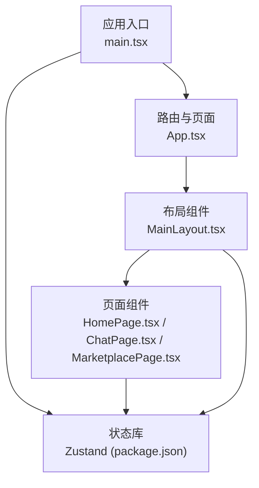
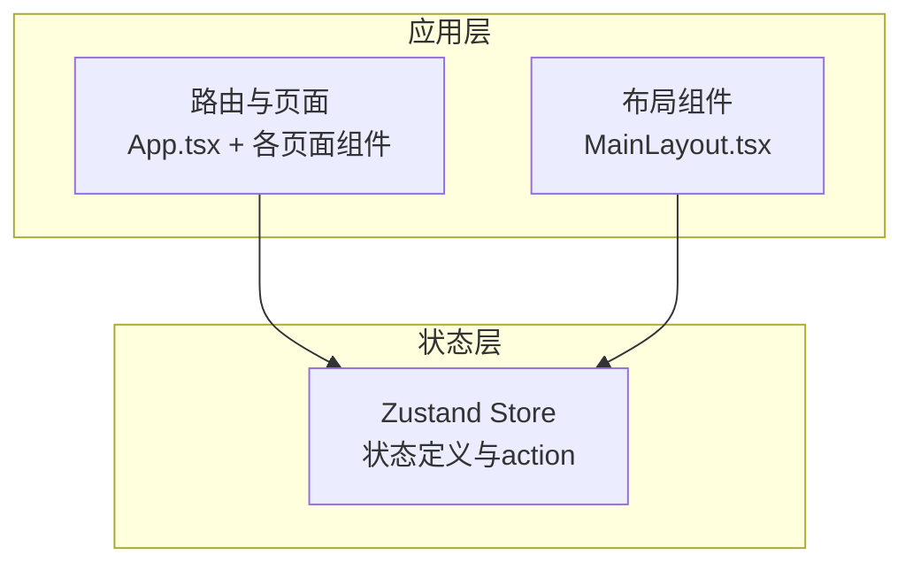
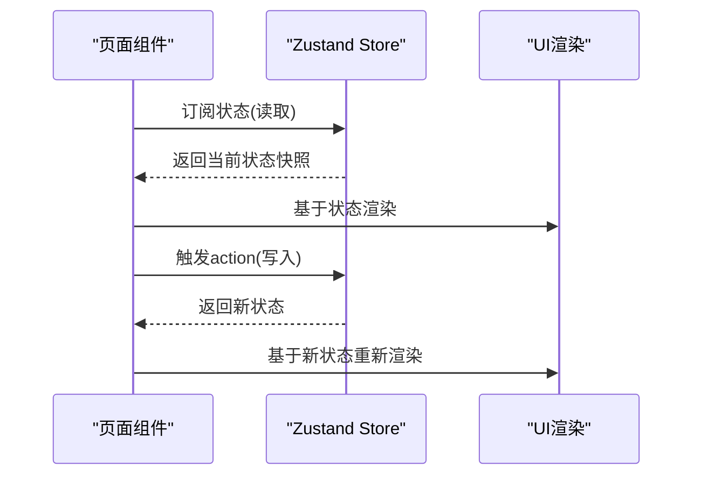
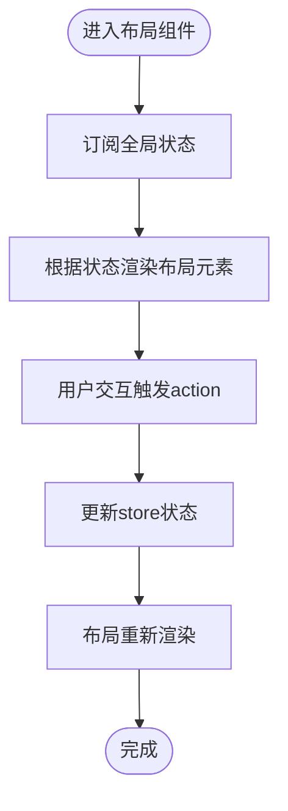
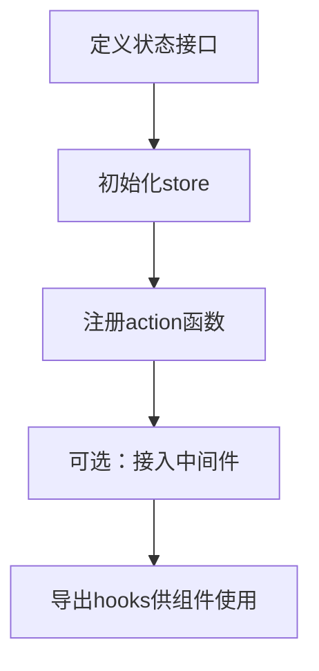
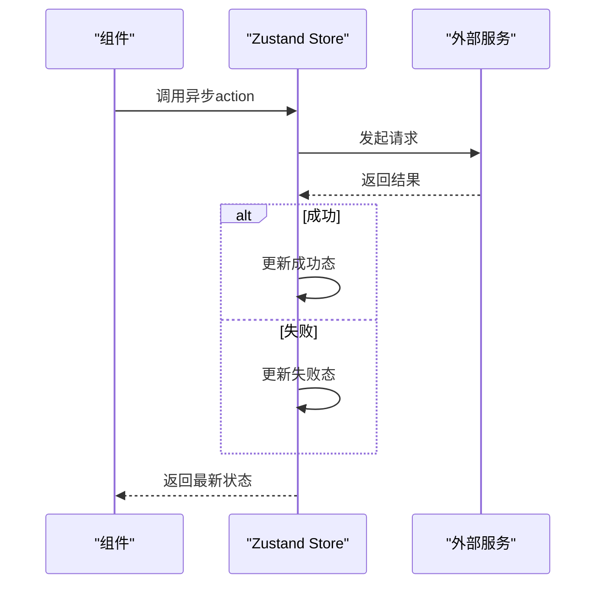
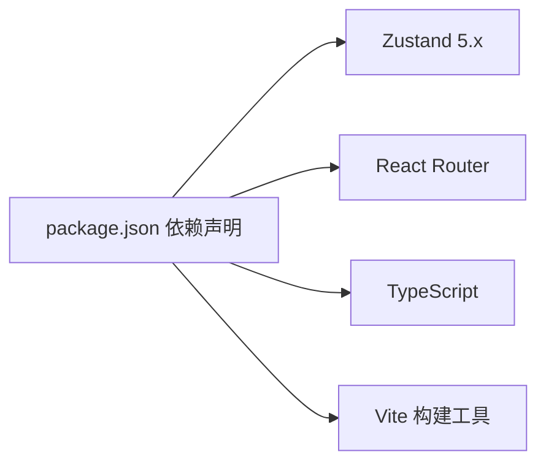

# 状态管理架构

<cite>
**本文引用的文件**
- [apps/AgentPit/package.json](file://apps/AgentPit/package.json)
- [apps/AgentPit/src/App.tsx](file://apps/AgentPit/src/App.tsx)
- [apps/AgentPit/src/main.tsx](file://apps/AgentPit/src/main.tsx)
- [apps/AgentPit/src/components/layout/MainLayout.tsx](file://apps/AgentPit/src/components/layout/MainLayout.tsx)
- [apps/AgentPit/src/pages/HomePage.tsx](file://apps/AgentPit/src/pages/HomePage.tsx)
- [apps/AgentPit/src/pages/ChatPage.tsx](file://apps/AgentPit/src/pages/ChatPage.tsx)
- [apps/AgentPit/src/pages/MarketplacePage.tsx](file://apps/AgentPit/src/pages/MarketplacePage.tsx)
- [apps/AgentPit/src/types/index.ts](file://apps/AgentPit/src/types/index.ts)
</cite>

## 目录
1. [简介](#简介)
2. [项目结构](#项目结构)
3. [核心组件](#核心组件)
4. [架构总览](#架构总览)
5. [详细组件分析](#详细组件分析)
6. [依赖分析](#依赖分析)
7. [性能考虑](#性能考虑)
8. [故障排查指南](#故障排查指南)
9. [结论](#结论)
10. [附录](#附录)

## 简介
本文件面向AgentPit AI代理平台的前端工程，系统性梳理基于Zustand的状态管理架构与实现要点。文档聚焦以下主题：Zustand在本项目中的使用方式、store设计模式与订阅机制；应用状态的数据结构、action函数与中间件配置；状态持久化、状态同步与性能优化策略；最佳实践、调试技巧与错误处理方案；以及状态与组件的绑定方式、异步状态更新与状态重置机制。目标是帮助开发者理解并维护复杂的状态管理逻辑。

## 项目结构
AgentPit应用采用React + Vite技术栈，Zustand作为状态管理库。项目入口通过Vite构建，路由由React Router负责，页面组件按功能模块组织，布局组件统一承载导航与内容区域。

图表来源
- [apps/AgentPit/src/main.tsx](file://apps/AgentPit/src/main.tsx)
- [apps/AgentPit/src/App.tsx](file://apps/AgentPit/src/App.tsx)
- [apps/AgentPit/src/components/layout/MainLayout.tsx](file://apps/AgentPit/src/components/layout/MainLayout.tsx)
- [apps/AgentPit/src/pages/HomePage.tsx](file://apps/AgentPit/src/pages/HomePage.tsx)
- [apps/AgentPit/src/pages/ChatPage.tsx](file://apps/AgentPit/src/pages/ChatPage.tsx)
- [apps/AgentPit/src/pages/MarketplacePage.tsx](file://apps/AgentPit/src/pages/MarketplacePage.tsx)
- [apps/AgentPit/package.json](file://apps/AgentPit/package.json)

章节来源
- [apps/AgentPit/src/App.tsx:1-41](file://apps/AgentPit/src/App.tsx#L1-L41)
- [apps/AgentPit/package.json:12-18](file://apps/AgentPit/package.json#L12-L18)

## 核心组件
- Zustand库版本与依赖声明：项目在依赖中明确引入Zustand，用于集中式状态管理。
- 应用入口与渲染：通过Vite启动，React应用挂载到DOM根节点。
- 路由与页面：App组件定义多级路由，页面组件承载具体业务视图。
- 布局与通用UI：MainLayout作为容器，承载导航、侧边栏与主内容区。
- 类型定义：类型文件提供全局类型约束，确保状态结构与组件交互的类型安全。

章节来源
- [apps/AgentPit/package.json:12-18](file://apps/AgentPit/package.json#L12-L18)
- [apps/AgentPit/src/App.tsx:15-41](file://apps/AgentPit/src/App.tsx#L15-L41)
- [apps/AgentPit/src/main.tsx](file://apps/AgentPit/src/main.tsx)
- [apps/AgentPit/src/types/index.ts](file://apps/AgentPit/src/types/index.ts)

## 架构总览
下图展示Zustand在AgentPit中的角色定位：作为状态中心，被页面与布局组件以useStore订阅方式消费；应用通过路由组织页面，页面通过状态驱动UI与业务逻辑。

图表来源
- [apps/AgentPit/src/App.tsx:15-41](file://apps/AgentPit/src/App.tsx#L15-L41)
- [apps/AgentPit/src/components/layout/MainLayout.tsx](file://apps/AgentPit/src/components/layout/MainLayout.tsx)
- [apps/AgentPit/package.json:17](file://apps/AgentPit/package.json#L17)

## 详细组件分析

### 页面组件与状态订阅
- 页面组件通过useStore订阅状态，读取当前状态值并触发UI更新。
- 组件内部可调用store的action函数进行状态变更，实现响应式更新。
- 典型页面包括首页、聊天页、市场页等，均遵循相同的订阅与更新模式。

图表来源
- [apps/AgentPit/src/pages/HomePage.tsx](file://apps/AgentPit/src/pages/HomePage.tsx)
- [apps/AgentPit/src/pages/ChatPage.tsx](file://apps/AgentPit/src/pages/ChatPage.tsx)
- [apps/AgentPit/src/pages/MarketplacePage.tsx](file://apps/AgentPit/src/pages/MarketplacePage.tsx)

章节来源
- [apps/AgentPit/src/pages/HomePage.tsx](file://apps/AgentPit/src/pages/HomePage.tsx)
- [apps/AgentPit/src/pages/ChatPage.tsx](file://apps/AgentPit/src/pages/ChatPage.tsx)
- [apps/AgentPit/src/pages/MarketplacePage.tsx](file://apps/AgentPit/src/pages/MarketplacePage.tsx)

### 布局组件与状态集成
- 布局组件MainLayout作为全局容器，可订阅与共享跨页面的状态（如侧边栏展开/收起、主题设置等）。
- 通过统一的状态入口，避免在多个页面重复定义相似状态，提升一致性与可维护性。

图表来源
- [apps/AgentPit/src/components/layout/MainLayout.tsx](file://apps/AgentPit/src/components/layout/MainLayout.tsx)

章节来源
- [apps/AgentPit/src/components/layout/MainLayout.tsx](file://apps/AgentPit/src/components/layout/MainLayout.tsx)

### 数据结构与Action函数
- 状态数据结构：建议以模块化方式组织状态，例如用户信息、UI偏好、会话上下文等，分别定义独立的store模块，便于扩展与测试。
- Action函数：提供同步与异步两类action，支持状态原子性更新与副作用处理（如网络请求、本地存储）。
- 中间件配置：可选地引入中间件（如日志、持久化、调试），在store创建时注入，增强可观测性与可恢复能力。

图表来源
- [apps/AgentPit/src/types/index.ts](file://apps/AgentPit/src/types/index.ts)

章节来源
- [apps/AgentPit/src/types/index.ts](file://apps/AgentPit/src/types/index.ts)

### 异步状态更新与状态重置
- 异步更新：通过action封装异步流程（如fetch、缓存），在成功/失败分支分别更新状态，保证UI与数据一致。
- 状态重置：提供reset或initialize action，用于清理状态、恢复默认值，常用于登录登出、切换环境等场景。

图表来源
- [apps/AgentPit/src/pages/ChatPage.tsx](file://apps/AgentPit/src/pages/ChatPage.tsx)

章节来源
- [apps/AgentPit/src/pages/ChatPage.tsx](file://apps/AgentPit/src/pages/ChatPage.tsx)

## 依赖分析
- Zustand版本：项目依赖Zustand 5.x，具备更小体积与更好的TypeScript支持。
- React生态：与React Router协同，实现页面级状态隔离与全局状态共享。
- 开发工具：Vite提供快速热更新与打包能力，Tailwind CSS与TypeScript提升开发效率与类型安全。

图表来源
- [apps/AgentPit/package.json:12-18](file://apps/AgentPit/package.json#L12-L18)

章节来源
- [apps/AgentPit/package.json:12-18](file://apps/AgentPit/package.json#L12-L18)

## 性能考虑
- 状态分片：将大对象拆分为细粒度状态，减少不必要的重渲染。
- 订阅范围：仅订阅组件实际需要的状态字段，避免过度订阅导致的频繁重渲染。
- 中间件优化：对日志与持久化中间件进行条件启用，降低运行时开销。
- 异步批处理：合并多次异步操作，减少状态抖动与UI闪烁。
- 缓存策略：结合本地存储与内存缓存，平衡加载速度与数据新鲜度。

## 故障排查指南
- 订阅无效：确认组件是否正确使用useStore订阅，且store实例一致。
- 状态不更新：检查action是否返回新状态引用，避免浅比较未触发重渲染。
- 内存泄漏：确保在组件卸载时清理定时器与事件监听，必要时提供reset action。
- 持久化异常：核对持久化中间件配置与键名，确保序列化/反序列化正确。
- 调试技巧：利用中间件输出action日志，定位状态变更轨迹；使用React DevTools追踪组件重渲染。

## 结论
AgentPit采用Zustand实现轻量、直观且高性能的状态管理。通过模块化store设计、严格的类型约束与合理的中间件配置，可在保持代码简洁的同时满足复杂业务需求。建议持续完善状态分片、异步更新与持久化策略，并建立完善的调试与监控体系，以保障长期演进与稳定性。

## 附录
- 最佳实践清单
  - 将状态按领域拆分，每个模块自包含状态与action。
  - 使用immer或不可变更新策略，确保状态更新可预测。
  - 对关键action添加中间件日志，便于问题定位。
  - 在组件卸载时清理副作用，防止内存泄漏。
  - 提供reset action与默认状态，简化测试与回滚。
- 调试与监控
  - 使用Redux DevTools或自定义中间件记录action与状态变化。
  - 对异步action增加超时与重试机制，提升鲁棒性。
  - 定期审查状态使用情况，移除未使用的字段与action。