# 前端应用

<cite>
**本文引用的文件**
- [apps/AgentPit/README.md](file://apps/AgentPit/README.md)
- [apps/AgentPit/src/App.tsx](file://apps/AgentPit/src/App.tsx)
- [apps/AgentPit/src/main.tsx](file://apps/AgentPit/src/main.tsx)
- [apps/AgentPit/src/components/layout/MainLayout.tsx](file://apps/AgentPit/src/components/layout/MainLayout.tsx)
- [apps/AgentPit/src/components/layout/Header.tsx](file://apps/AgentPit/src/components/layout/Header.tsx)
- [apps/AgentPit/src/components/layout/Footer.tsx](file://apps/AgentPit/src/components/layout/Footer.tsx)
- [apps/AgentPit/src/components/layout/Sidebar.tsx](file://apps/AgentPit/src/components/layout/Sidebar.tsx)
- [apps/AgentPit/package.json](file://apps/AgentPit/package.json)
- [apps/AgentPit/vite.config.ts](file://apps/AgentPit/vite.config.ts)
- [apps/AgentPit/tailwind.config.ts](file://apps/AgentPit/tailwind.config.ts)
- [apps/AgentPit/tsconfig.app.json](file://apps/AgentPit/tsconfig.app.json)
- [apps/AgentPit/tsconfig.node.json](file://apps/AgentPit/tsconfig.node.json)
- [apps/AgentPit/eslint.config.js](file://apps/AgentPit/eslint.config.js)
- [apps/AgentPit/src/pages/](file://apps/AgentPit/src/pages/)
- [apps/AgentPit/src/store/](file://apps/AgentPit/src/store/)
- [apps/config-center/src/App.tsx](file://apps/config-center/src/App.tsx)
- [apps/config-center/src/main.tsx](file://apps/config-center/src/main.tsx)
- [apps/config-center/src/components/layout/Layout.tsx](file://apps/config-center/src/components/layout/Layout.tsx)
- [apps/config-center/src/components/layout/Header.tsx](file://apps/config-center/src/components/layout/Header.tsx)
- [apps/config-center/src/components/layout/Sidebar.tsx](file://apps/config-center/src/components/layout/Sidebar.tsx)
- [apps/config-center/src/components/ProtectedRoute.tsx](file://apps/config-center/src/components/ProtectedRoute.tsx)
- [apps/config-center/src/store/authStore.ts](file://apps/config-center/src/store/authStore.ts)
- [apps/config-center/src/store/uiStore.ts](file://apps/config-center/src/store/uiStore.ts)
- [apps/config-center/src/pages/DashboardPage.tsx](file://apps/config-center/src/pages/DashboardPage.tsx)
- [apps/config-center/src/pages/LoginPage.tsx](file://apps/config-center/src/pages/LoginPage.tsx)
- [apps/config-center/src/pages/UsersPage.tsx](file://apps/config-center/src/pages/UsersPage.tsx)
- [apps/config-center/src/pages/RolesPage.tsx](file://apps/config-center/src/pages/RolesPage.tsx)
- [apps/config-center/src/pages/VersionsPage.tsx](file://apps/config-center/src/pages/VersionsPage.tsx)
- [apps/config-center/src/pages/AuditLogsPage.tsx](file://apps/config-center/src/pages/AuditLogsPage.tsx)
- [apps/config-center/src/pages/ConfigListPage.tsx](file://apps/config-center/src/pages/ConfigListPage.tsx)
- [apps/config-center/src/pages/ConfigDetailPage.tsx](file://apps/config-center/src/pages/ConfigDetailPage.tsx)
- [apps/config-center/src/types/index.ts](file://apps/config-center/src/types/index.ts)
- [apps/config-center/package.json](file://apps/config-center/package.json)
- [apps/daoNexus/src/App.tsx](file://apps/daoNexus/src/App.tsx)
- [apps/daoNexus/src/main.tsx](file://apps/daoNexus/src/main.tsx)
- [apps/daoNexus/src/components/Header.tsx](file://apps/daoNexus/src/components/Header.tsx)
- [apps/daoNexus/src/components/HeroSection.tsx](file://apps/daoNexus/src/components/HeroSection.tsx)
- [apps/daoNexus/src/components/AppCard.tsx](file://apps/daoNexus/src/components/AppCard.tsx)
- [apps/daoNexus/src/components/CategorySection.tsx](file://apps/daoNexus/src/components/CategorySection.tsx)
- [apps/daoNexus/src/data/apps.ts](file://apps/daoNexus/src/data/apps.ts)
- [apps/daoNexus/src/types/app.ts](file://apps/daoNexus/src/types/app.ts)
- [apps/forum/src/App.tsx](file://apps/forum/src/App.tsx)
- [apps/forum/src/main.tsx](file://apps/forum/src/main.tsx)
- [apps/forum/src/context/AuthContext.tsx](file://apps/forum/src/context/AuthContext.tsx)
- [apps/forum/src/context/ForumContext.tsx](file://apps/forum/src/context/ForumContext.tsx)
- [apps/forum/src/components/layout/Header.tsx](file://apps/forum/src/components/layout/Header.tsx)
- [apps/forum/src/components/layout/Layout.tsx](file://apps/forum/src/components/layout/Layout.tsx)
- [apps/forum/src/components/layout/Sidebar.tsx](file://apps/forum/src/components/layout/Sidebar.tsx)
- [apps/forum/src/components/thread/ThreadCard.tsx](file://apps/forum/src/components/thread/ThreadCard.tsx)
- [apps/forum/src/components/thread/VoteButton.tsx](file://apps/forum/src/components/thread/VoteButton.tsx)
- [apps/forum/src/components/reply/ReplyCard.tsx](file://apps/forum/src/components/reply/ReplyCard.tsx)
- [apps/forum/src/components/reply/ReplyForm.tsx](file://apps/forum/src/components/reply/ReplyForm.tsx)
- [apps/forum/src/pages/HomePage.tsx](file://apps/forum/src/pages/HomePage.tsx)
- [apps/forum/src/pages/CategoryPage.tsx](file://apps/forum/src/pages/CategoryPage.tsx)
- [apps/forum/src/pages/CreateThreadPage.tsx](file://apps/forum/src/pages/CreateThreadPage.tsx)
- [apps/forum/src/pages/ThreadPage.tsx](file://apps/forum/src/pages/ThreadPage.tsx)
- [apps/forum/src/pages/AdminPage.tsx](file://apps/forum/src/pages/AdminPage.tsx)
- [apps/forum/src/pages/SearchPage.tsx](file://apps/forum/src/pages/SearchPage.tsx)
- [apps/forum/src/pages/LoginPage.tsx](file://apps/forum/src/pages/LoginPage.tsx)
- [apps/forum/src/pages/RegisterPage.tsx](file://apps/forum/src/pages/RegisterPage.tsx)
- [apps/forum/src/pages/SettingsPage.tsx](file://apps/forum/src/pages/SettingsPage.tsx)
- [apps/forum/src/pages/ProfilePage.tsx](file://apps/forum/src/pages/ProfilePage.tsx)
- [apps/forum/src/types/index.ts](file://apps/forum/src/types/index.ts)
- [apps/forum/src/data/store.ts](file://apps/forum/src/data/store.ts)
- [apps/growth-tracker/src/App.tsx](file://apps/growth-tracker/src/App.tsx)
- [apps/growth-tracker/src/main.tsx](file://apps/growth-tracker/src/main.tsx)
- [apps/growth-tracker/src/context/AppContext.tsx](file://apps/growth-tracker/src/context/AppContext.tsx)
- [apps/growth-tracker/src/components/ui/circular-progress.tsx](file://apps/growth-tracker/src/components/ui/circular-progress.tsx)
- [apps/growth-tracker/src/components/ui/modal.tsx](file://apps/growth-tracker/src/components/ui/modal.tsx)
- [apps/growth-tracker/src/components/ui/progress-bar.tsx](file://apps/growth-tracker/src/components/ui/progress-bar.tsx)
- [apps/growth-tracker/src/components/ui/toaster.tsx](file://apps/growth-tracker/src/components/ui/toaster.tsx)
- [apps/growth-tracker/src/pages/DashboardPage.tsx](file://apps/growth-tracker/src/pages/DashboardPage.tsx)
- [apps/growth-tracker/src/pages/GoalsPage.tsx](file://apps/growth-tracker/src/pages/GoalsPage.tsx)
- [apps/growth-tracker/src/pages/AnalyticsPage.tsx](file://apps/growth-tracker/src/pages/AnalyticsPage.tsx)
- [apps/growth-tracker/src/pages/AchievementsPage.tsx](file://apps/growth-tracker/src/pages/AchievementsPage.tsx)
- [apps/growth-tracker/src/pages/ReportPage.tsx](file://apps/growth-tracker/src/pages/ReportPage.tsx)
- [apps/growth-tracker/src/pages/SettingsPage.tsx](file://apps/growth-tracker/src/pages/SettingsPage.tsx)
- [apps/habit-tracker/src/App.tsx](file://apps/habit-tracker/src/App.tsx)
- [apps/habit-tracker/src/main.tsx](file://apps/habit-tracker/src/main.tsx)
- [apps/habit-tracker/src/store/habitStore.ts](file://apps/habit-tracker/src/store/habitStore.ts)
- [apps/habit-tracker/src/components/layout/AppLayout.tsx](file://apps/habit-tracker/src/components/layout/AppLayout.tsx)
- [apps/habit-tracker/src/components/layout/Sidebar.tsx](file://apps/habit-tracker/src/components/layout/Sidebar.tsx)
- [apps/habit-tracker/src/components/layout/MobileNav.tsx](file://apps/habit-tracker/src/components/layout/MobileNav.tsx)
- [apps/habit-tracker/src/components/shared/HabitCard.tsx](file://apps/habit-tracker/src/components/shared/HabitCard.tsx)
- [apps/habit-tracker/src/components/shared/ProgressRing.tsx](file://apps/habit-tracker/src/components/shared/ProgressRing.tsx)
- [apps/habit-tracker/src/pages/DashboardPage.tsx](file://apps/habit-tracker/src/pages/DashboardPage.tsx)
- [apps/habit-tracker/src/pages/HabitsPage.tsx](file://apps/habit-tracker/src/pages/HabitsPage.tsx)
- [apps/habit-tracker/src/pages/CalendarPage.tsx](file://apps/habit-tracker/src/pages/CalendarPage.tsx)
- [apps/habit-tracker/src/pages/AchievementsPage.tsx](file://apps/habit-tracker/src/pages/AchievementsPage.tsx)
- [apps/habit-tracker/src/pages/AnalyticsPage.tsx](file://apps/habit-tracker/src/pages/AnalyticsPage.tsx)
- [apps/habit-tracker/src/pages/SettingsPage.tsx](file://apps/habit-tracker/src/pages/SettingsPage.tsx)
- [apps/moodflow/src/App.tsx](file://apps/moodflow/src/App.tsx)
- [apps/moodflow/src/main.tsx](file://apps/moodflow/src/main.tsx)
- [apps/moodflow/src/contexts/AppContext.tsx](file://apps/moodflow/src/contexts/AppContext.tsx)
- [apps/moodflow/src/components/layout/Sidebar.tsx](file://apps/moodflow/src/components/layout/Sidebar.tsx)
- [apps/moodflow/src/components/mood/MoodCheckinModal.tsx](file://apps/moodflow/src/components/mood/MoodCheckinModal.tsx)
- [apps/moodflow/src/pages/DashboardPage.tsx](file://apps/moodflow/src/pages/DashboardPage.tsx)
- [apps/moodflow/src/pages/CalendarPage.tsx](file://apps/moodflow/src/pages/CalendarPage.tsx)
- [apps/moodflow/src/pages/InsightsPage.tsx](file://apps/moodflow/src/pages/InsightsPage.tsx)
- [apps/moodflow/src/pages/JournalPage.tsx](file://apps/moodflow/src/pages/JournalPage.tsx)
- [apps/moodflow/src/pages/SettingsPage.tsx](file://apps/moodflow/src/pages/SettingsPage.tsx)
- [apps/time-capsule/src/App.tsx](file://apps/time-capsule/src/App.tsx)
- [apps/time-capsule/src/main.tsx](file://apps/time-capsule/src/main.tsx)
- [apps/time-capsule/src/context/CapsuleContext.tsx](file://apps/time-capsule/src/context/CapsuleContext.tsx)
- [apps/time-capsule/src/components/layout/Layout.tsx](file://apps/time-capsule/src/components/layout/Layout.tsx)
- [apps/time-capsule/src/components/layout/Navbar.tsx](file://apps/time-capsule/src/components/layout/Navbar.tsx)
- [apps/time-capsule/src/components/capsule/CapsuleCard.tsx](file://apps/time-capsule/src/components/capsule/CapsuleCard.tsx)
- [apps/time-capsule/src/pages/HomePage.tsx](file://apps/time-capsule/src/pages/HomePage.tsx)
- [apps/time-capsule/src/pages/CapsuleListPage.tsx](file://apps/time-capsule/src/pages/CapsuleListPage.tsx)
- [apps/time-capsule/src/pages/CapsuleDetailPage.tsx](file://apps/time-capsule/src/pages/CapsuleDetailPage.tsx)
- [apps/time-capsule/src/pages/CreateCapsulePage.tsx](file://apps/time-capsule/src/pages/CreateCapsulePage.tsx)
- [apps/time-capsule/src/pages/SettingsPage.tsx](file://apps/time-capsule/src/pages/SettingsPage.tsx)
- [apps/xinyu/src/App.tsx](file://apps/xinyu/src/App.tsx)
- [apps/xinyu/src/main.tsx](file://apps/xinyu/src/main.tsx)
- [apps/xinyu/src/components/sections/Footer.tsx](file://apps/xinyu/src/components/sections/Footer.tsx)
- [apps/xinyu/src/components/sections/GameSection.tsx](file://apps/xinyu/src/components/sections/GameSection.tsx)
- [apps/xinyu/src/components/sections/HeroSection.tsx](file://apps/xinyu/src/components/sections/HeroSection.tsx)
- [apps/xinyu/src/components/sections/Navbar.tsx](file://apps/xinyu/src/components/sections/Navbar.tsx)
- [apps/xinyu/src/components/sections/ResponseGuideSection.tsx](file://apps/xinyu/src/components/sections/ResponseGuideSection.tsx)
- [apps/xinyu/src/components/sections/SharingSection.tsx](file://apps/xinyu/src/components/sections/SharingSection.tsx)
- [apps/xinyu/src/components/sections/SurpriseSection.tsx](file://apps/xinyu/src/components/sections/SurpriseSection.tsx)
- [apps/xinyu/src/components/sections/TopicSection.tsx](file://apps/xinyu/src/components/sections/TopicSection.tsx)
- [apps/oauth-admin/src/App.tsx](file://apps/oauth-admin/src/App.tsx)
- [apps/oauth-admin/src/main.tsx](file://apps/oauth-admin/src/main.tsx)
- [apps/oauth-admin/src/components/layout/Sidebar.tsx](file://apps/oauth-admin/src/components/layout/Sidebar.tsx)
- [apps/oauth-admin/src/pages/DashboardPage.tsx](file://apps/oauth-admin/src/pages/DashboardPage.tsx)
- [apps/oauth-admin/src/pages/ProvidersPage.tsx](file://apps/oauth-admin/src/pages/ProvidersPage.tsx)
- [apps/oauth-admin/src/pages/ConnectionsPage.tsx](file://apps/oauth-admin/src/pages/ConnectionsPage.tsx)
- [apps/oauth-admin/src/pages/ActivityPage.tsx](file://apps/oauth-admin/src/pages/ActivityPage.tsx)
- [apps/DaoMind/README.md](file://apps/DaoMind/README.md)
</cite>

## 目录
1. [引言](#引言)
2. [项目结构](#项目结构)
3. [核心组件](#核心组件)
4. [架构总览](#架构总览)
5. [详细组件分析](#详细组件分析)
6. [依赖分析](#依赖分析)
7. [性能考虑](#性能考虑)
8. [故障排查指南](#故障排查指南)
9. [结论](#结论)
10. [附录](#附录)

## 引言
本文件面向 DAO Collective 前端应用生态，系统梳理并解读以下前端应用的功能特性与使用场景：
- AgentPit：AI 代理平台，提供代理生命周期管理、可视化交互与工作流编排能力
- 配置管理中心：面向多应用的集中配置管理、用户与角色管理、版本审计与差异对比
- 应用聚合器（daoNexus）：应用入口聚合与导航，按类别展示子应用卡片
- 社区论坛：话题与回复的讨论系统，支持登录、权限控制、投票与搜索
- 成长追踪（growth-tracker）、习惯追踪（habit-tracker）、情绪流（moodflow）、时光胶囊（time-capsule）、心语（xinyu）、OAuth 管理（oauth-admin）：围绕个人成长、行为习惯、情绪记录、时间记忆与社交分享的多样化前端应用

文档同时阐述 React 组件设计模式、状态管理策略与路由系统实现；解释 UI 组件库的设计理念与使用方法；给出每个应用的使用示例与配置选项；并提供响应式设计指南、无障碍访问支持与跨浏览器兼容性建议；最后总结性能优化与调试技巧。

## 项目结构
DAO Collective 前端采用多应用单仓库（monorepo）布局，各应用独立构建与部署，共享工具链与样式配置。核心应用分布如下：
- apps/AgentPit：AI 代理平台
- apps/config-center：配置管理中心
- apps/daoNexus：应用聚合器
- apps/forum：社区论坛
- apps/growth-tracker：成长追踪
- apps/habit-tracker：习惯追踪
- apps/moodflow：情绪流
- apps/time-capsule：时光胶囊
- apps/xinyu：心语
- apps/oauth-admin：OAuth 管理
- apps/DaoMind：道家哲学与组件库背景说明（非前端应用，但提供整体架构参考）

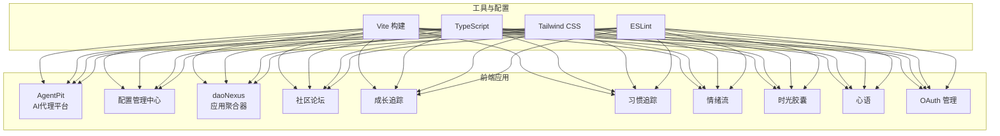

图表来源
- [apps/AgentPit/vite.config.ts](file://apps/AgentPit/vite.config.ts)
- [apps/AgentPit/tailwind.config.ts](file://apps/AgentPit/tailwind.config.ts)
- [apps/AgentPit/eslint.config.js](file://apps/AgentPit/eslint.config.js)
- [apps/config-center/package.json](file://apps/config-center/package.json)
- [apps/daoNexus/src/App.tsx](file://apps/daoNexus/src/App.tsx)
- [apps/forum/src/App.tsx](file://apps/forum/src/App.tsx)
- [apps/growth-tracker/src/App.tsx](file://apps/growth-tracker/src/App.tsx)
- [apps/habit-tracker/src/App.tsx](file://apps/habit-tracker/src/App.tsx)
- [apps/moodflow/src/App.tsx](file://apps/moodflow/src/App.tsx)
- [apps/time-capsule/src/App.tsx](file://apps/time-capsule/src/App.tsx)
- [apps/xinyu/src/App.tsx](file://apps/xinyu/src/App.tsx)
- [apps/oauth-admin/src/App.tsx](file://apps/oauth-admin/src/App.tsx)

章节来源
- [apps/AgentPit/README.md](file://apps/AgentPit/README.md)
- [apps/DaoMind/README.md](file://apps/DaoMind/README.md)

## 核心组件
本节从组件设计模式、状态管理与路由系统三个维度，总结 DAO Collective 前端应用的共性与差异。

- 组件设计模式
  - 布局组件化：各应用普遍采用 Header、Sidebar、MainLayout/Footer 的布局组合，保证一致的导航与内容区域划分
  - 页面级组件：以页面为单位组织功能，如首页、详情页、列表页、表单页等
  - 可复用 UI 组件：如进度条、圆形进度、模态框、Toast 提示等，封装为独立组件并在多页面复用
  - 权限保护：配置管理中心提供受保护路由组件，结合认证状态控制页面访问

- 状态管理策略
  - 轻量应用：如 daoNexus、forum、moodflow、time-capsule、xinyu 等，采用 React Context 或本地状态管理，满足简单数据流需求
  - 中等复杂度：如 growth-tracker、habit-tracker，分别提供上下文与专用 store，集中管理业务状态
  - 集中认证：配置管理中心提供 authStore 与 uiStore，统一处理登录、角色与界面状态

- 路由系统实现
  - 多数应用采用单页应用（SPA）模式，通过页面组件渲染不同视图
  - 配置管理中心提供受保护路由，结合认证状态决定页面渲染与跳转
  - 社区论坛提供多种页面（首页、分类页、主题页、搜索页、设置页等），体现路由与页面的对应关系

章节来源
- [apps/AgentPit/src/components/layout/MainLayout.tsx](file://apps/AgentPit/src/components/layout/MainLayout.tsx)
- [apps/AgentPit/src/components/layout/Header.tsx](file://apps/AgentPit/src/components/layout/Header.tsx)
- [apps/AgentPit/src/components/layout/Footer.tsx](file://apps/AgentPit/src/components/layout/Footer.tsx)
- [apps/AgentPit/src/components/layout/Sidebar.tsx](file://apps/AgentPit/src/components/layout/Sidebar.tsx)
- [apps/config-center/src/components/ProtectedRoute.tsx](file://apps/config-center/src/components/ProtectedRoute.tsx)
- [apps/config-center/src/store/authStore.ts](file://apps/config-center/src/store/authStore.ts)
- [apps/config-center/src/store/uiStore.ts](file://apps/config-center/src/store/uiStore.ts)
- [apps/growth-tracker/src/context/AppContext.tsx](file://apps/growth-tracker/src/context/AppContext.tsx)
- [apps/habit-tracker/src/store/habitStore.ts](file://apps/habit-tracker/src/store/habitStore.ts)
- [apps/forum/src/context/AuthContext.tsx](file://apps/forum/src/context/AuthContext.tsx)
- [apps/forum/src/context/ForumContext.tsx](file://apps/forum/src/context/ForumContext.tsx)

## 架构总览
下图展示 DAO Collective 前端应用的整体架构：各应用独立构建，共享工具链（Vite、TypeScript、Tailwind、ESLint），部分应用采用 React Context 或专用 store 管理状态，配置管理中心提供统一认证与受保护路由。

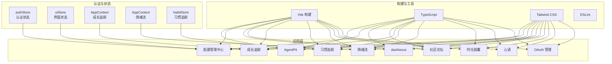

图表来源
- [apps/AgentPit/vite.config.ts](file://apps/AgentPit/vite.config.ts)
- [apps/AgentPit/tailwind.config.ts](file://apps/AgentPit/tailwind.config.ts)
- [apps/AgentPit/eslint.config.js](file://apps/AgentPit/eslint.config.js)
- [apps/config-center/src/store/authStore.ts](file://apps/config-center/src/store/authStore.ts)
- [apps/config-center/src/store/uiStore.ts](file://apps/config-center/src/store/uiStore.ts)
- [apps/growth-tracker/src/context/AppContext.tsx](file://apps/growth-tracker/src/context/AppContext.tsx)
- [apps/moodflow/src/contexts/AppContext.tsx](file://apps/moodflow/src/contexts/AppContext.tsx)
- [apps/habit-tracker/src/store/habitStore.ts](file://apps/habit-tracker/src/store/habitStore.ts)

## 详细组件分析

### AgentPit：AI 代理平台
- 功能特性
  - 代理生命周期管理：创建、初始化、激活、执行动作、休眠与终止
  - 工作流编排：通过消息总线与四通道（天/地/人/冲）进行系统内通信
  - 可视化交互：主布局、头部、侧边栏与页脚构成统一界面
- 设计模式
  - 布局组件化：MainLayout/Header/Sidebar/Footer
  - 页面级组件：根据功能拆分页面
  - 状态管理：可选 React Context 或轻量 store
- 使用示例
  - 代理创建与执行：参考代理管理示例
  - 模块注册与激活：参考模块管理示例
  - 消息总线与通道：参考 DaoQi 消息传递示例
- 配置选项
  - 构建与开发：Vite、TypeScript、Tailwind、ESLint
  - 插件选择：React Oxc 或 SWC
  - React 编译器：出于性能考虑默认关闭

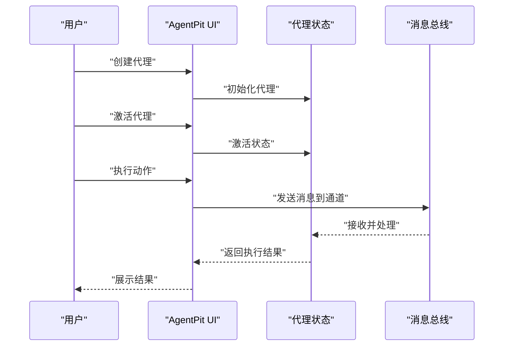

图表来源
- [apps/AgentPit/src/App.tsx](file://apps/AgentPit/src/App.tsx)
- [apps/AgentPit/src/main.tsx](file://apps/AgentPit/src/main.tsx)
- [apps/AgentPit/src/components/layout/MainLayout.tsx](file://apps/AgentPit/src/components/layout/MainLayout.tsx)
- [apps/AgentPit/src/components/layout/Header.tsx](file://apps/AgentPit/src/components/layout/Header.tsx)
- [apps/AgentPit/src/components/layout/Footer.tsx](file://apps/AgentPit/src/components/layout/Footer.tsx)
- [apps/AgentPit/src/components/layout/Sidebar.tsx](file://apps/AgentPit/src/components/layout/Sidebar.tsx)

章节来源
- [apps/AgentPit/README.md](file://apps/AgentPit/README.md)
- [apps/AgentPit/src/App.tsx](file://apps/AgentPit/src/App.tsx)
- [apps/AgentPit/src/main.tsx](file://apps/AgentPit/src/main.tsx)
- [apps/AgentPit/src/components/layout/MainLayout.tsx](file://apps/AgentPit/src/components/layout/MainLayout.tsx)
- [apps/AgentPit/src/components/layout/Header.tsx](file://apps/AgentPit/src/components/layout/Header.tsx)
- [apps/AgentPit/src/components/layout/Footer.tsx](file://apps/AgentPit/src/components/layout/Footer.tsx)
- [apps/AgentPit/src/components/layout/Sidebar.tsx](file://apps/AgentPit/src/components/layout/Sidebar.tsx)

### 配置管理中心
- 功能特性
  - 用户与角色管理：用户增删改查、角色分配与权限控制
  - 配置管理：配置列表、详情、版本审计与差异对比
  - 审计日志：记录变更历史
  - 登录与受保护路由：认证后方可访问受保护页面
- 设计模式
  - 受保护路由：ProtectedRoute 结合认证状态
  - 状态管理：authStore（认证）、uiStore（界面）
  - 页面组织：Dashboard、Users、Roles、Versions、AuditLogs、ConfigList、ConfigDetail
- 使用示例
  - 登录后进入仪表盘
  - 查看用户列表与详情
  - 查看配置版本与差异
  - 查看审计日志
- 配置选项
  - 构建与开发：Vite、TypeScript、Tailwind、ESLint
  - 测试：Jest（参考 DaoMind README 的测试说明）

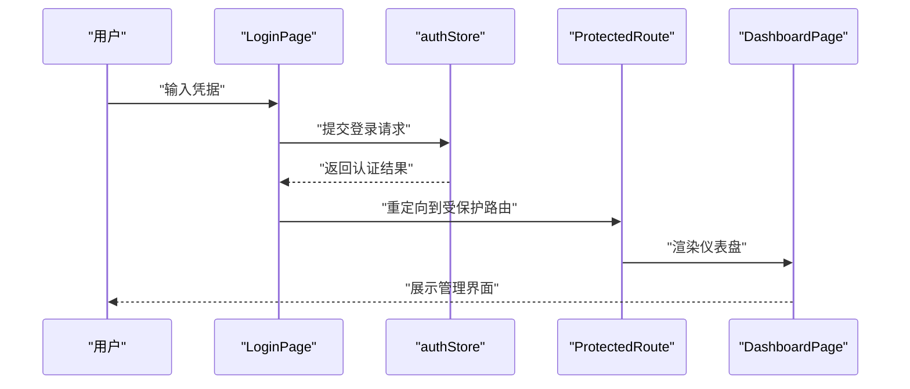

图表来源
- [apps/config-center/src/pages/LoginPage.tsx](file://apps/config-center/src/pages/LoginPage.tsx)
- [apps/config-center/src/components/ProtectedRoute.tsx](file://apps/config-center/src/components/ProtectedRoute.tsx)
- [apps/config-center/src/store/authStore.ts](file://apps/config-center/src/store/authStore.ts)
- [apps/config-center/src/pages/DashboardPage.tsx](file://apps/config-center/src/pages/DashboardPage.tsx)

章节来源
- [apps/config-center/src/App.tsx](file://apps/config-center/src/App.tsx)
- [apps/config-center/src/main.tsx](file://apps/config-center/src/main.tsx)
- [apps/config-center/src/components/layout/Layout.tsx](file://apps/config-center/src/components/layout/Layout.tsx)
- [apps/config-center/src/components/layout/Header.tsx](file://apps/config-center/src/components/layout/Header.tsx)
- [apps/config-center/src/components/layout/Sidebar.tsx](file://apps/config-center/src/components/layout/Sidebar.tsx)
- [apps/config-center/src/components/ProtectedRoute.tsx](file://apps/config-center/src/components/ProtectedRoute.tsx)
- [apps/config-center/src/store/authStore.ts](file://apps/config-center/src/store/authStore.ts)
- [apps/config-center/src/store/uiStore.ts](file://apps/config-center/src/store/uiStore.ts)
- [apps/config-center/src/pages/DashboardPage.tsx](file://apps/config-center/src/pages/DashboardPage.tsx)
- [apps/config-center/src/pages/LoginPage.tsx](file://apps/config-center/src/pages/LoginPage.tsx)
- [apps/config-center/src/pages/UsersPage.tsx](file://apps/config-center/src/pages/UsersPage.tsx)
- [apps/config-center/src/pages/RolesPage.tsx](file://apps/config-center/src/pages/RolesPage.tsx)
- [apps/config-center/src/pages/VersionsPage.tsx](file://apps/config-center/src/pages/VersionsPage.tsx)
- [apps/config-center/src/pages/AuditLogsPage.tsx](file://apps/config-center/src/pages/AuditLogsPage.tsx)
- [apps/config-center/src/pages/ConfigListPage.tsx](file://apps/config-center/src/pages/ConfigListPage.tsx)
- [apps/config-center/src/pages/ConfigDetailPage.tsx](file://apps/config-center/src/pages/ConfigDetailPage.tsx)
- [apps/config-center/src/types/index.ts](file://apps/config-center/src/types/index.ts)

### 应用聚合器（daoNexus）
- 功能特性
  - 应用入口聚合：按类别展示应用卡片，提供导航入口
  - 数据驱动：应用列表与分类来源于数据文件与类型定义
- 设计模式
  - 组件化：Header、HeroSection、AppCard、CategorySection
  - 数据与类型：apps.ts 与 app.ts
- 使用示例
  - 展示首页英雄区与应用卡片
  - 按类别筛选与浏览应用
- 配置选项
  - 构建与开发：Vite、TypeScript、Tailwind、ESLint

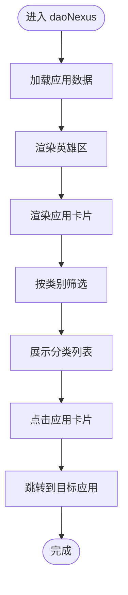

图表来源
- [apps/daoNexus/src/App.tsx](file://apps/daoNexus/src/App.tsx)
- [apps/daoNexus/src/main.tsx](file://apps/daoNexus/src/main.tsx)
- [apps/daoNexus/src/components/Header.tsx](file://apps/daoNexus/src/components/Header.tsx)
- [apps/daoNexus/src/components/HeroSection.tsx](file://apps/daoNexus/src/components/HeroSection.tsx)
- [apps/daoNexus/src/components/AppCard.tsx](file://apps/daoNexus/src/components/AppCard.tsx)
- [apps/daoNexus/src/components/CategorySection.tsx](file://apps/daoNexus/src/components/CategorySection.tsx)
- [apps/daoNexus/src/data/apps.ts](file://apps/daoNexus/src/data/apps.ts)
- [apps/daoNexus/src/types/app.ts](file://apps/daoNexus/src/types/app.ts)

章节来源
- [apps/daoNexus/src/App.tsx](file://apps/daoNexus/src/App.tsx)
- [apps/daoNexus/src/main.tsx](file://apps/daoNexus/src/main.tsx)
- [apps/daoNexus/src/components/Header.tsx](file://apps/daoNexus/src/components/Header.tsx)
- [apps/daoNexus/src/components/HeroSection.tsx](file://apps/daoNexus/src/components/HeroSection.tsx)
- [apps/daoNexus/src/components/AppCard.tsx](file://apps/daoNexus/src/components/AppCard.tsx)
- [apps/daoNexus/src/components/CategorySection.tsx](file://apps/daoNexus/src/components/CategorySection.tsx)
- [apps/daoNexus/src/data/apps.ts](file://apps/daoNexus/src/data/apps.ts)
- [apps/daoNexus/src/types/app.ts](file://apps/daoNexus/src/types/app.ts)

### 社区论坛
- 功能特性
  - 讨论系统：话题列表、详情页、回复与投票
  - 用户系统：登录、注册、个人资料、设置
  - 权限控制：管理员页面与登录态控制
  - 搜索与分类：支持按分类与关键词搜索
- 设计模式
  - 上下文：AuthContext、ForumContext
  - 页面组织：Home、Category、Thread、CreateThread、Search、Admin、Login、Register、Settings、Profile
  - UI 组件：ThreadCard、VoteButton、ReplyCard、ReplyForm
- 使用示例
  - 登录后创建主题
  - 在主题中回复并参与投票
  - 管理员审核与处理
- 配置选项
  - 构建与开发：Vite、TypeScript、Tailwind、ESLint

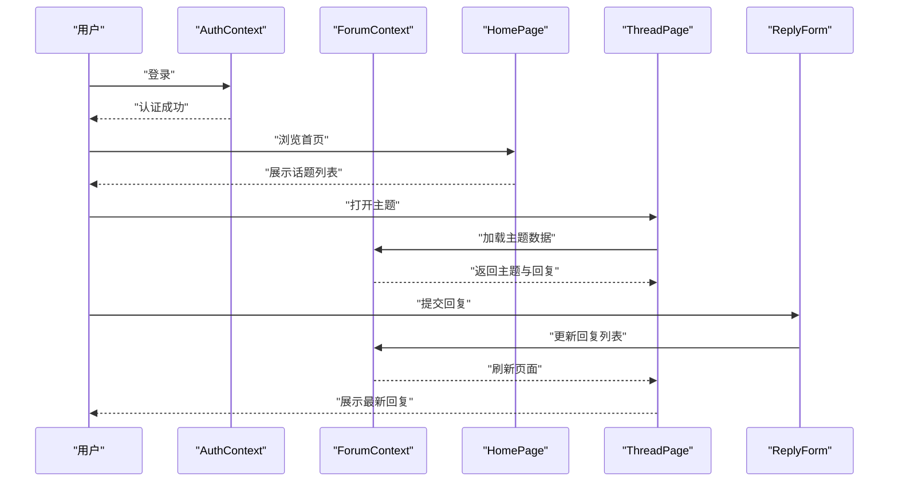

图表来源
- [apps/forum/src/context/AuthContext.tsx](file://apps/forum/src/context/AuthContext.tsx)
- [apps/forum/src/context/ForumContext.tsx](file://apps/forum/src/context/ForumContext.tsx)
- [apps/forum/src/pages/HomePage.tsx](file://apps/forum/src/pages/HomePage.tsx)
- [apps/forum/src/pages/ThreadPage.tsx](file://apps/forum/src/pages/ThreadPage.tsx)
- [apps/forum/src/components/reply/ReplyForm.tsx](file://apps/forum/src/components/reply/ReplyForm.tsx)
- [apps/forum/src/components/thread/VoteButton.tsx](file://apps/forum/src/components/thread/VoteButton.tsx)

章节来源
- [apps/forum/src/App.tsx](file://apps/forum/src/App.tsx)
- [apps/forum/src/main.tsx](file://apps/forum/src/main.tsx)
- [apps/forum/src/context/AuthContext.tsx](file://apps/forum/src/context/AuthContext.tsx)
- [apps/forum/src/context/ForumContext.tsx](file://apps/forum/src/context/ForumContext.tsx)
- [apps/forum/src/components/layout/Header.tsx](file://apps/forum/src/components/layout/Header.tsx)
- [apps/forum/src/components/layout/Layout.tsx](file://apps/forum/src/components/layout/Layout.tsx)
- [apps/forum/src/components/layout/Sidebar.tsx](file://apps/forum/src/components/layout/Sidebar.tsx)
- [apps/forum/src/components/thread/ThreadCard.tsx](file://apps/forum/src/components/thread/ThreadCard.tsx)
- [apps/forum/src/components/thread/VoteButton.tsx](file://apps/forum/src/components/thread/VoteButton.tsx)
- [apps/forum/src/components/reply/ReplyCard.tsx](file://apps/forum/src/components/reply/ReplyCard.tsx)
- [apps/forum/src/components/reply/ReplyForm.tsx](file://apps/forum/src/components/reply/ReplyForm.tsx)
- [apps/forum/src/pages/HomePage.tsx](file://apps/forum/src/pages/HomePage.tsx)
- [apps/forum/src/pages/CategoryPage.tsx](file://apps/forum/src/pages/CategoryPage.tsx)
- [apps/forum/src/pages/CreateThreadPage.tsx](file://apps/forum/src/pages/CreateThreadPage.tsx)
- [apps/forum/src/pages/ThreadPage.tsx](file://apps/forum/src/pages/ThreadPage.tsx)
- [apps/forum/src/pages/AdminPage.tsx](file://apps/forum/src/pages/AdminPage.tsx)
- [apps/forum/src/pages/SearchPage.tsx](file://apps/forum/src/pages/SearchPage.tsx)
- [apps/forum/src/pages/LoginPage.tsx](file://apps/forum/src/pages/LoginPage.tsx)
- [apps/forum/src/pages/RegisterPage.tsx](file://apps/forum/src/pages/RegisterPage.tsx)
- [apps/forum/src/pages/SettingsPage.tsx](file://apps/forum/src/pages/SettingsPage.tsx)
- [apps/forum/src/pages/ProfilePage.tsx](file://apps/forum/src/pages/ProfilePage.tsx)
- [apps/forum/src/types/index.ts](file://apps/forum/src/types/index.ts)
- [apps/forum/src/data/store.ts](file://apps/forum/src/data/store.ts)

### 成长追踪（growth-tracker）
- 功能特性
  - 目标设定与达成：Goals、Achievements
  - 数据可视化：Analytics
  - 报告与导出：Report
  - 设置与偏好：Settings
- 设计模式
  - 上下文：AppContext
  - UI 组件：circular-progress、modal、progress-bar、toaster
  - 页面组织：Dashboard、Goals、Analytics、Achievements、Report、Settings
- 使用示例
  - 设定目标并跟踪进度
  - 查看达成情况与趋势
  - 生成报告并导出
- 配置选项
  - 构建与开发：Vite、TypeScript、Tailwind、ESLint

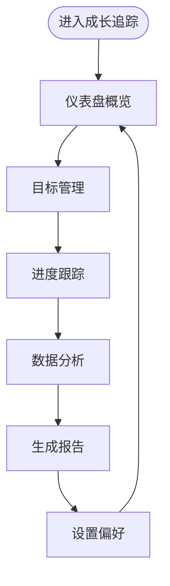

图表来源
- [apps/growth-tracker/src/App.tsx](file://apps/growth-tracker/src/App.tsx)
- [apps/growth-tracker/src/main.tsx](file://apps/growth-tracker/src/main.tsx)
- [apps/growth-tracker/src/context/AppContext.tsx](file://apps/growth-tracker/src/context/AppContext.tsx)
- [apps/growth-tracker/src/components/ui/circular-progress.tsx](file://apps/growth-tracker/src/components/ui/circular-progress.tsx)
- [apps/growth-tracker/src/components/ui/modal.tsx](file://apps/growth-tracker/src/components/ui/modal.tsx)
- [apps/growth-tracker/src/components/ui/progress-bar.tsx](file://apps/growth-tracker/src/components/ui/progress-bar.tsx)
- [apps/growth-tracker/src/components/ui/toaster.tsx](file://apps/growth-tracker/src/components/ui/toaster.tsx)
- [apps/growth-tracker/src/pages/DashboardPage.tsx](file://apps/growth-tracker/src/pages/DashboardPage.tsx)
- [apps/growth-tracker/src/pages/GoalsPage.tsx](file://apps/growth-tracker/src/pages/GoalsPage.tsx)
- [apps/growth-tracker/src/pages/AnalyticsPage.tsx](file://apps/growth-tracker/src/pages/AnalyticsPage.tsx)
- [apps/growth-tracker/src/pages/AchievementsPage.tsx](file://apps/growth-tracker/src/pages/AchievementsPage.tsx)
- [apps/growth-tracker/src/pages/ReportPage.tsx](file://apps/growth-tracker/src/pages/ReportPage.tsx)
- [apps/growth-tracker/src/pages/SettingsPage.tsx](file://apps/growth-tracker/src/pages/SettingsPage.tsx)

章节来源
- [apps/growth-tracker/src/App.tsx](file://apps/growth-tracker/src/App.tsx)
- [apps/growth-tracker/src/main.tsx](file://apps/growth-tracker/src/main.tsx)
- [apps/growth-tracker/src/context/AppContext.tsx](file://apps/growth-tracker/src/context/AppContext.tsx)
- [apps/growth-tracker/src/components/ui/circular-progress.tsx](file://apps/growth-tracker/src/components/ui/circular-progress.tsx)
- [apps/growth-tracker/src/components/ui/modal.tsx](file://apps/growth-tracker/src/components/ui/modal.tsx)
- [apps/growth-tracker/src/components/ui/progress-bar.tsx](file://apps/growth-tracker/src/components/ui/progress-bar.tsx)
- [apps/growth-tracker/src/components/ui/toaster.tsx](file://apps/growth-tracker/src/components/ui/toaster.tsx)
- [apps/growth-tracker/src/pages/DashboardPage.tsx](file://apps/growth-tracker/src/pages/DashboardPage.tsx)
- [apps/growth-tracker/src/pages/GoalsPage.tsx](file://apps/growth-tracker/src/pages/GoalsPage.tsx)
- [apps/growth-tracker/src/pages/AnalyticsPage.tsx](file://apps/growth-tracker/src/pages/AnalyticsPage.tsx)
- [apps/growth-tracker/src/pages/AchievementsPage.tsx](file://apps/growth-tracker/src/pages/AchievementsPage.tsx)
- [apps/growth-tracker/src/pages/ReportPage.tsx](file://apps/growth-tracker/src/pages/ReportPage.tsx)
- [apps/growth-tracker/src/pages/SettingsPage.tsx](file://apps/growth-tracker/src/pages/SettingsPage.tsx)

### 习惯追踪（habit-tracker）
- 功能特性
  - 习惯管理：Habits、Dashboard、Calendar
  - 成就与分析：Achievements、Analytics
  - 设置与偏好：Settings
- 设计模式
  - 专用 store：habitStore
  - 布局组件：AppLayout、Sidebar、MobileNav
  - 共享组件：HabitCard、ProgressRing
  - 页面组织：Dashboard、Habits、Calendar、Achievements、Analytics、Settings
- 使用示例
  - 新增习惯并记录完成情况
  - 查看月度日历与完成率
  - 查看成就与趋势分析
- 配置选项
  - 构建与开发：Vite、TypeScript、Tailwind、ESLint

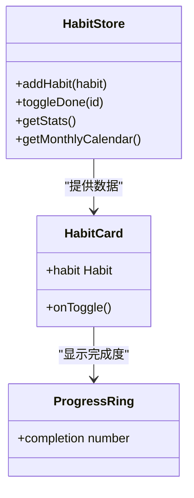

图表来源
- [apps/habit-tracker/src/store/habitStore.ts](file://apps/habit-tracker/src/store/habitStore.ts)
- [apps/habit-tracker/src/components/shared/HabitCard.tsx](file://apps/habit-tracker/src/components/shared/HabitCard.tsx)
- [apps/habit-tracker/src/components/shared/ProgressRing.tsx](file://apps/habit-tracker/src/components/shared/ProgressRing.tsx)
- [apps/habit-tracker/src/components/layout/AppLayout.tsx](file://apps/habit-tracker/src/components/layout/AppLayout.tsx)
- [apps/habit-tracker/src/components/layout/Sidebar.tsx](file://apps/habit-tracker/src/components/layout/Sidebar.tsx)
- [apps/habit-tracker/src/components/layout/MobileNav.tsx](file://apps/habit-tracker/src/components/layout/MobileNav.tsx)
- [apps/habit-tracker/src/pages/DashboardPage.tsx](file://apps/habit-tracker/src/pages/DashboardPage.tsx)
- [apps/habit-tracker/src/pages/HabitsPage.tsx](file://apps/habit-tracker/src/pages/HabitsPage.tsx)
- [apps/habit-tracker/src/pages/CalendarPage.tsx](file://apps/habit-tracker/src/pages/CalendarPage.tsx)
- [apps/habit-tracker/src/pages/AchievementsPage.tsx](file://apps/habit-tracker/src/pages/AchievementsPage.tsx)
- [apps/habit-tracker/src/pages/AnalyticsPage.tsx](file://apps/habit-tracker/src/pages/AnalyticsPage.tsx)
- [apps/habit-tracker/src/pages/SettingsPage.tsx](file://apps/habit-tracker/src/pages/SettingsPage.tsx)

章节来源
- [apps/habit-tracker/src/App.tsx](file://apps/habit-tracker/src/App.tsx)
- [apps/habit-tracker/src/main.tsx](file://apps/habit-tracker/src/main.tsx)
- [apps/habit-tracker/src/store/habitStore.ts](file://apps/habit-tracker/src/store/habitStore.ts)
- [apps/habit-tracker/src/components/layout/AppLayout.tsx](file://apps/habit-tracker/src/components/layout/AppLayout.tsx)
- [apps/habit-tracker/src/components/layout/Sidebar.tsx](file://apps/habit-tracker/src/components/layout/Sidebar.tsx)
- [apps/habit-tracker/src/components/layout/MobileNav.tsx](file://apps/habit-tracker/src/components/layout/MobileNav.tsx)
- [apps/habit-tracker/src/components/shared/HabitCard.tsx](file://apps/habit-tracker/src/components/shared/HabitCard.tsx)
- [apps/habit-tracker/src/components/shared/ProgressRing.tsx](file://apps/habit-tracker/src/components/shared/ProgressRing.tsx)
- [apps/habit-tracker/src/pages/DashboardPage.tsx](file://apps/habit-tracker/src/pages/DashboardPage.tsx)
- [apps/habit-tracker/src/pages/HabitsPage.tsx](file://apps/habit-tracker/src/pages/HabitsPage.tsx)
- [apps/habit-tracker/src/pages/CalendarPage.tsx](file://apps/habit-tracker/src/pages/CalendarPage.tsx)
- [apps/habit-tracker/src/pages/AchievementsPage.tsx](file://apps/habit-tracker/src/pages/AchievementsPage.tsx)
- [apps/habit-tracker/src/pages/AnalyticsPage.tsx](file://apps/habit-tracker/src/pages/AnalyticsPage.tsx)
- [apps/habit-tracker/src/pages/SettingsPage.tsx](file://apps/habit-tracker/src/pages/SettingsPage.tsx)

### 情绪流（moodflow）
- 功能特性
  - 日常情绪记录：MoodCheckinModal
  - 仪表盘与日历：Dashboard、Calendar
  - 情绪洞察：Insights
  - 日志与设置：Journal、Settings
- 设计模式
  - 上下文：AppContext
  - 布局组件：Sidebar
  - 页面组织：Dashboard、Calendar、Insights、Journal、Settings
- 使用示例
  - 每日情绪打卡
  - 查看情绪趋势与洞察
  - 导入导出情绪日志
- 配置选项
  - 构建与开发：Vite、TypeScript、Tailwind、ESLint

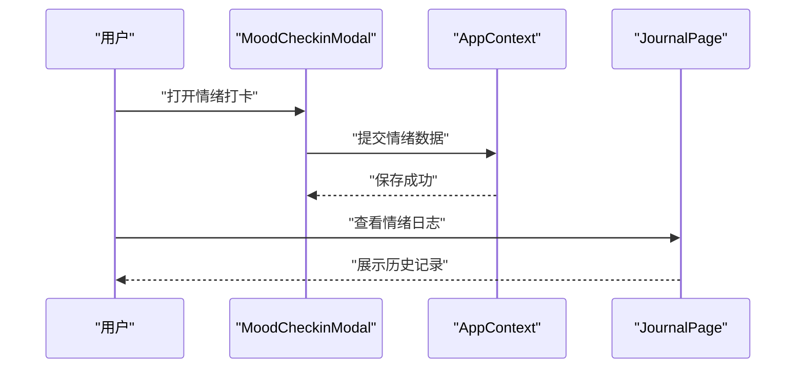

图表来源
- [apps/moodflow/src/App.tsx](file://apps/moodflow/src/App.tsx)
- [apps/moodflow/src/main.tsx](file://apps/moodflow/src/main.tsx)
- [apps/moodflow/src/contexts/AppContext.tsx](file://apps/moodflow/src/contexts/AppContext.tsx)
- [apps/moodflow/src/components/mood/MoodCheckinModal.tsx](file://apps/moodflow/src/components/mood/MoodCheckinModal.tsx)
- [apps/moodflow/src/pages/DashboardPage.tsx](file://apps/moodflow/src/pages/DashboardPage.tsx)
- [apps/moodflow/src/pages/CalendarPage.tsx](file://apps/moodflow/src/pages/CalendarPage.tsx)
- [apps/moodflow/src/pages/InsightsPage.tsx](file://apps/moodflow/src/pages/InsightsPage.tsx)
- [apps/moodflow/src/pages/JournalPage.tsx](file://apps/moodflow/src/pages/JournalPage.tsx)
- [apps/moodflow/src/pages/SettingsPage.tsx](file://apps/moodflow/src/pages/SettingsPage.tsx)

章节来源
- [apps/moodflow/src/App.tsx](file://apps/moodflow/src/App.tsx)
- [apps/moodflow/src/main.tsx](file://apps/moodflow/src/main.tsx)
- [apps/moodflow/src/contexts/AppContext.tsx](file://apps/moodflow/src/contexts/AppContext.tsx)
- [apps/moodflow/src/components/layout/Sidebar.tsx](file://apps/moodflow/src/components/layout/Sidebar.tsx)
- [apps/moodflow/src/components/mood/MoodCheckinModal.tsx](file://apps/moodflow/src/components/mood/MoodCheckinModal.tsx)
- [apps/moodflow/src/pages/DashboardPage.tsx](file://apps/moodflow/src/pages/DashboardPage.tsx)
- [apps/moodflow/src/pages/CalendarPage.tsx](file://apps/moodflow/src/pages/CalendarPage.tsx)
- [apps/moodflow/src/pages/InsightsPage.tsx](file://apps/moodflow/src/pages/InsightsPage.tsx)
- [apps/moodflow/src/pages/JournalPage.tsx](file://apps/moodflow/src/pages/JournalPage.tsx)
- [apps/moodflow/src/pages/SettingsPage.tsx](file://apps/moodflow/src/pages/SettingsPage.tsx)

### 时光胶囊（time-capsule）
- 功能特性
  - 胶囊管理：列表、详情、创建
  - 导航与布局：Layout、Navbar
  - 设置与偏好：Settings
- 设计模式
  - 上下文：CapsuleContext
  - 布局组件：Layout、Navbar
  - 页面组织：Home、CapsuleList、CapsuleDetail、CreateCapsule、Settings
- 使用示例
  - 创建新的时光胶囊
  - 查看与编辑胶囊内容
  - 管理胶囊设置
- 配置选项
  - 构建与开发：Vite、TypeScript、Tailwind、ESLint

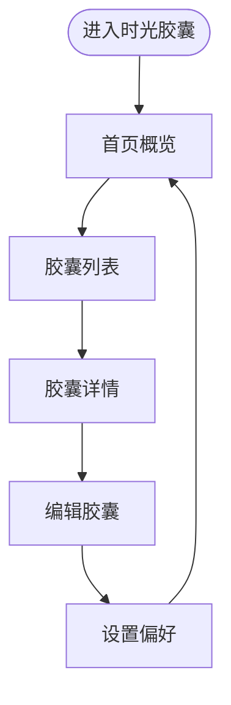

图表来源
- [apps/time-capsule/src/App.tsx](file://apps/time-capsule/src/App.tsx)
- [apps/time-capsule/src/main.tsx](file://apps/time-capsule/src/main.tsx)
- [apps/time-capsule/src/context/CapsuleContext.tsx](file://apps/time-capsule/src/context/CapsuleContext.tsx)
- [apps/time-capsule/src/components/layout/Layout.tsx](file://apps/time-capsule/src/components/layout/Layout.tsx)
- [apps/time-capsule/src/components/layout/Navbar.tsx](file://apps/time-capsule/src/components/layout/Navbar.tsx)
- [apps/time-capsule/src/components/capsule/CapsuleCard.tsx](file://apps/time-capsule/src/components/capsule/CapsuleCard.tsx)
- [apps/time-capsule/src/pages/HomePage.tsx](file://apps/time-capsule/src/pages/HomePage.tsx)
- [apps/time-capsule/src/pages/CapsuleListPage.tsx](file://apps/time-capsule/src/pages/CapsuleListPage.tsx)
- [apps/time-capsule/src/pages/CapsuleDetailPage.tsx](file://apps/time-capsule/src/pages/CapsuleDetailPage.tsx)
- [apps/time-capsule/src/pages/CreateCapsulePage.tsx](file://apps/time-capsule/src/pages/CreateCapsulePage.tsx)
- [apps/time-capsule/src/pages/SettingsPage.tsx](file://apps/time-capsule/src/pages/SettingsPage.tsx)

章节来源
- [apps/time-capsule/src/App.tsx](file://apps/time-capsule/src/App.tsx)
- [apps/time-capsule/src/main.tsx](file://apps/time-capsule/src/main.tsx)
- [apps/time-capsule/src/context/CapsuleContext.tsx](file://apps/time-capsule/src/context/CapsuleContext.tsx)
- [apps/time-capsule/src/components/layout/Layout.tsx](file://apps/time-capsule/src/components/layout/Layout.tsx)
- [apps/time-capsule/src/components/layout/Navbar.tsx](file://apps/time-capsule/src/components/layout/Navbar.tsx)
- [apps/time-capsule/src/components/capsule/CapsuleCard.tsx](file://apps/time-capsule/src/components/capsule/CapsuleCard.tsx)
- [apps/time-capsule/src/pages/HomePage.tsx](file://apps/time-capsule/src/pages/HomePage.tsx)
- [apps/time-capsule/src/pages/CapsuleListPage.tsx](file://apps/time-capsule/src/pages/CapsuleListPage.tsx)
- [apps/time-capsule/src/pages/CapsuleDetailPage.tsx](file://apps/time-capsule/src/pages/CapsuleDetailPage.tsx)
- [apps/time-capsule/src/pages/CreateCapsulePage.tsx](file://apps/time-capsule/src/pages/CreateCapsulePage.tsx)
- [apps/time-capsule/src/pages/SettingsPage.tsx](file://apps/time-capsule/src/pages/SettingsPage.tsx)

### 心语（xinyu）
- 功能特性
  - 展示与互动：Hero、Game、ResponseGuide、Sharing、Surprise、Topic、Footer
  - 导航与布局：Navbar
- 设计模式
  - 页面组件：Sections 组织
  - 布局组件：Navbar、Footer
  - 页面组织：App 主入口
- 使用示例
  - 浏览首页与互动板块
  - 查看响应指南与分享内容
- 配置选项
  - 构建与开发：Vite、TypeScript、Tailwind、ESLint

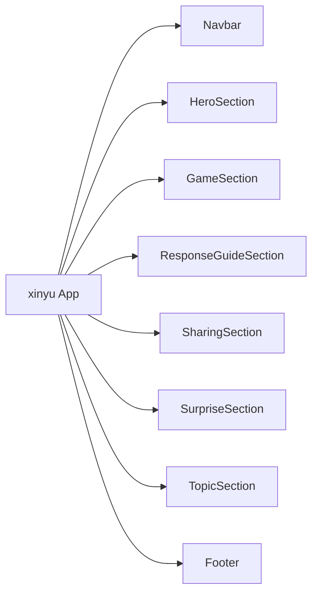

图表来源
- [apps/xinyu/src/App.tsx](file://apps/xinyu/src/App.tsx)
- [apps/xinyu/src/main.tsx](file://apps/xinyu/src/main.tsx)
- [apps/xinyu/src/components/sections/Navbar.tsx](file://apps/xinyu/src/components/sections/Navbar.tsx)
- [apps/xinyu/src/components/sections/HeroSection.tsx](file://apps/xinyu/src/components/sections/HeroSection.tsx)
- [apps/xinyu/src/components/sections/GameSection.tsx](file://apps/xinyu/src/components/sections/GameSection.tsx)
- [apps/xinyu/src/components/sections/ResponseGuideSection.tsx](file://apps/xinyu/src/components/sections/ResponseGuideSection.tsx)
- [apps/xinyu/src/components/sections/SharingSection.tsx](file://apps/xinyu/src/components/sections/SharingSection.tsx)
- [apps/xinyu/src/components/sections/SurpriseSection.tsx](file://apps/xinyu/src/components/sections/SurpriseSection.tsx)
- [apps/xinyu/src/components/sections/TopicSection.tsx](file://apps/xinyu/src/components/sections/TopicSection.tsx)
- [apps/xinyu/src/components/sections/Footer.tsx](file://apps/xinyu/src/components/sections/Footer.tsx)

章节来源
- [apps/xinyu/src/App.tsx](file://apps/xinyu/src/App.tsx)
- [apps/xinyu/src/main.tsx](file://apps/xinyu/src/main.tsx)
- [apps/xinyu/src/components/sections/Footer.tsx](file://apps/xinyu/src/components/sections/Footer.tsx)
- [apps/xinyu/src/components/sections/GameSection.tsx](file://apps/xinyu/src/components/sections/GameSection.tsx)
- [apps/xinyu/src/components/sections/HeroSection.tsx](file://apps/xinyu/src/components/sections/HeroSection.tsx)
- [apps/xinyu/src/components/sections/Navbar.tsx](file://apps/xinyu/src/components/sections/Navbar.tsx)
- [apps/xinyu/src/components/sections/ResponseGuideSection.tsx](file://apps/xinyu/src/components/sections/ResponseGuideSection.tsx)
- [apps/xinyu/src/components/sections/SharingSection.tsx](file://apps/xinyu/src/components/sections/SharingSection.tsx)
- [apps/xinyu/src/components/sections/SurpriseSection.tsx](file://apps/xinyu/src/components/sections/SurpriseSection.tsx)
- [apps/xinyu/src/components/sections/TopicSection.tsx](file://apps/xinyu/src/components/sections/TopicSection.tsx)

### OAuth 管理（oauth-admin）
- 功能特性
  - 仪表盘：系统概览
  - 提供商管理：OAuth 提供商配置
  - 连接管理：用户与提供商的连接
  - 活动日志：操作活动记录
- 设计模式
  - 布局组件：Sidebar
  - 页面组织：Dashboard、Providers、Connections、Activity
- 使用示例
  - 查看系统活动
  - 管理 OAuth 提供商
  - 查看用户连接状态
- 配置选项
  - 构建与开发：Vite、TypeScript、Tailwind、ESLint

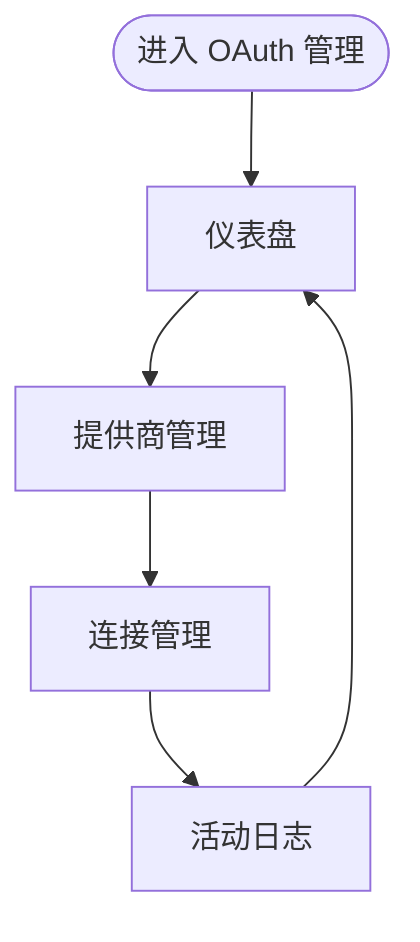

图表来源
- [apps/oauth-admin/src/App.tsx](file://apps/oauth-admin/src/App.tsx)
- [apps/oauth-admin/src/main.tsx](file://apps/oauth-admin/src/main.tsx)
- [apps/oauth-admin/src/components/layout/Sidebar.tsx](file://apps/oauth-admin/src/components/layout/Sidebar.tsx)
- [apps/oauth-admin/src/pages/DashboardPage.tsx](file://apps/oauth-admin/src/pages/DashboardPage.tsx)
- [apps/oauth-admin/src/pages/ProvidersPage.tsx](file://apps/oauth-admin/src/pages/ProvidersPage.tsx)
- [apps/oauth-admin/src/pages/ConnectionsPage.tsx](file://apps/oauth-admin/src/pages/ConnectionsPage.tsx)
- [apps/oauth-admin/src/pages/ActivityPage.tsx](file://apps/oauth-admin/src/pages/ActivityPage.tsx)

章节来源
- [apps/oauth-admin/src/App.tsx](file://apps/oauth-admin/src/App.tsx)
- [apps/oauth-admin/src/main.tsx](file://apps/oauth-admin/src/main.tsx)
- [apps/oauth-admin/src/components/layout/Sidebar.tsx](file://apps/oauth-admin/src/components/layout/Sidebar.tsx)
- [apps/oauth-admin/src/pages/DashboardPage.tsx](file://apps/oauth-admin/src/pages/DashboardPage.tsx)
- [apps/oauth-admin/src/pages/ProvidersPage.tsx](file://apps/oauth-admin/src/pages/ProvidersPage.tsx)
- [apps/oauth-admin/src/pages/ConnectionsPage.tsx](file://apps/oauth-admin/src/pages/ConnectionsPage.tsx)
- [apps/oauth-admin/src/pages/ActivityPage.tsx](file://apps/oauth-admin/src/pages/ActivityPage.tsx)

## 依赖分析
- 构建工具链
  - Vite：统一构建与开发服务器
  - TypeScript：类型安全与更好的开发体验
  - Tailwind CSS：实用优先的样式框架
  - ESLint：代码质量与风格规范
- 应用间依赖
  - 各应用相互独立，无直接运行时依赖
  - 配置管理中心提供认证与受保护路由，其他应用可按需集成
- 第三方库与插件
  - React Oxc 与 SWC：两种 React 插件选择
  - React 编译器：出于性能考虑默认关闭

章节来源
- [apps/AgentPit/vite.config.ts](file://apps/AgentPit/vite.config.ts)
- [apps/AgentPit/tailwind.config.ts](file://apps/AgentPit/tailwind.config.ts)
- [apps/AgentPit/eslint.config.js](file://apps/AgentPit/eslint.config.js)
- [apps/AgentPit/package.json](file://apps/AgentPit/package.json)
- [apps/config-center/package.json](file://apps/config-center/package.json)
- [apps/DaoMind/README.md](file://apps/DaoMind/README.md)

## 性能考虑
- 构建与打包
  - 使用 Vite 的快速冷启动与热更新
  - 合理拆分代码与懒加载页面，减少首屏体积
  - Tailwind CSS 按需引入与 Purge 配置，避免冗余样式
- 运行时性能
  - React 组件按需渲染，避免不必要的重渲染
  - 使用 React Context 或轻量 store，避免过度状态提升
  - 对高频交互组件（如进度环、投票按钮）进行防抖与节流
- 监控与基准
  - 参考 DaoMind 的监控与基准测试思路，建立性能基线与告警

## 故障排查指南
- 安装与依赖
  - 确认 Node.js、pnpm 版本满足要求
  - 清理缓存后重新安装依赖
- 构建与开发
  - 运行类型检查，修复类型错误
  - 检查 Vite、ESLint、Tailwind 配置是否正确
- 认证与路由
  - 配置管理中心：检查登录状态与受保护路由逻辑
  - 社区论坛：确认上下文提供者包裹范围与权限判断
- 性能问题
  - 使用基准测试定位瓶颈
  - 分析消息总线与通道的吞吐与延迟

章节来源
- [apps/DaoMind/README.md](file://apps/DaoMind/README.md)
- [apps/config-center/src/components/ProtectedRoute.tsx](file://apps/config-center/src/components/ProtectedRoute.tsx)
- [apps/forum/src/context/AuthContext.tsx](file://apps/forum/src/context/AuthContext.tsx)
- [apps/forum/src/context/ForumContext.tsx](file://apps/forum/src/context/ForumContext.tsx)

## 结论
DAO Collective 前端应用以模块化与组件化为核心设计思想，结合统一的工具链与状态管理模式，实现了从个人成长到社区协作的多样化场景覆盖。通过合理的布局组件、页面组织与上下文/状态管理，各应用在保持一致性的同时具备良好的扩展性。建议在后续迭代中持续完善性能监控与用户体验，并加强无障碍访问与跨浏览器兼容性的测试。

## 附录
- 响应式设计指南
  - 使用 Tailwind 的断点系统适配移动端与桌面端
  - 为触摸设备优化交互元素尺寸与间距
  - 为高对比度与色盲用户提供替代方案
- 无障碍访问支持
  - 为交互元素提供语义化标签与键盘导航
  - 为图片与图标提供替代文本
  - 确保颜色对比度满足 WCAG 要求
- 跨浏览器兼容性
  - 使用 Autoprefixer 与目标浏览器配置
  - 对不支持的特性提供降级方案或 polyfill
  - 在主流浏览器中进行回归测试