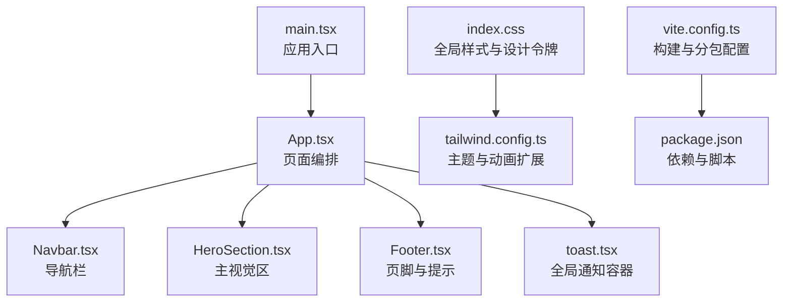
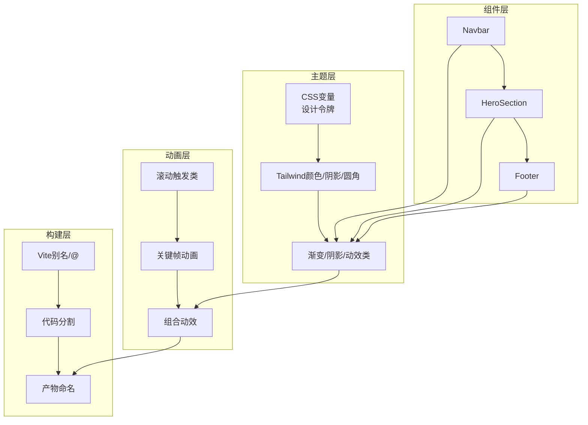
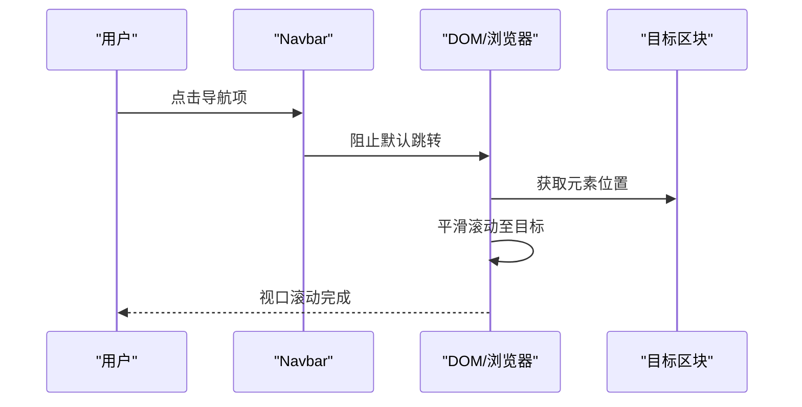
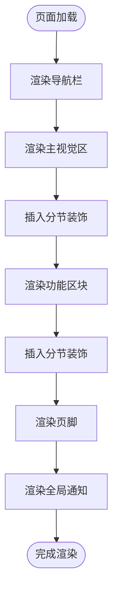
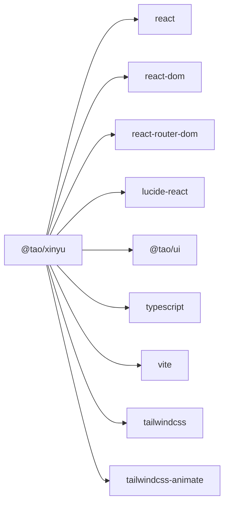

# 展示页面

<cite>
**本文引用的文件**
- [apps/xinyu/src/App.tsx](file://apps/xinyu/src/App.tsx)
- [apps/xinyu/src/main.tsx](file://apps/xinyu/src/main.tsx)
- [apps/xinyu/src/index.css](file://apps/xinyu/src/index.css)
- [apps/xinyu/tailwind.config.ts](file://apps/xinyu/tailwind.config.ts)
- [apps/xinyu/vite.config.ts](file://apps/xinyu/vite.config.ts)
- [apps/xinyu/package.json](file://apps/xinyu/package.json)
- [apps/xinyu/src/components/sections/Navbar.tsx](file://apps/xinyu/src/components/sections/Navbar.tsx)
- [apps/xinyu/src/components/sections/HeroSection.tsx](file://apps/xinyu/src/components/sections/HeroSection.tsx)
- [apps/xinyu/src/components/sections/Footer.tsx](file://apps/xinyu/src/components/sections/Footer.tsx)
- [apps/xinyu/src/components/ui/toast.tsx](file://apps/xinyu/src/components/ui/toast.tsx)
</cite>

## 目录
1. [简介](#简介)
2. [项目结构](#项目结构)
3. [核心组件](#核心组件)
4. [架构总览](#架构总览)
5. [详细组件分析](#详细组件分析)
6. [依赖关系分析](#依赖关系分析)
7. [性能考虑](#性能考虑)
8. [故障排查指南](#故障排查指南)
9. [结论](#结论)
10. [附录](#附录)

## 简介
本文件面向DAO Collective的Xinyu展示页面，系统性阐述其设计理念、视觉风格与交互体验。文档覆盖从设计稿到实现的完整流程，包括静态资源管理、图片优化策略、响应式设计、页面布局与组件设计、样式定制方案、SEO优化建议、性能监控与用户体验分析，并提供内容维护与更新的最佳实践。

## 项目结构
Xinyu应用采用Vite + React + TypeScript + TailwindCSS的现代前端栈，使用工作区依赖统一管理共享UI与工具库。应用入口通过根组件编排各功能区块，样式通过CSS变量与Tailwind扩展实现主题化与动画系统。

**图表来源**
- [apps/xinyu/src/main.tsx:1-11](file://apps/xinyu/src/main.tsx#L1-L11)
- [apps/xinyu/src/App.tsx:1-36](file://apps/xinyu/src/App.tsx#L1-L36)
- [apps/xinyu/src/index.css:1-229](file://apps/xinyu/src/index.css#L1-L229)
- [apps/xinyu/tailwind.config.ts:1-129](file://apps/xinyu/tailwind.config.ts#L1-L129)
- [apps/xinyu/vite.config.ts:1-36](file://apps/xinyu/vite.config.ts#L1-L36)
- [apps/xinyu/package.json:1-31](file://apps/xinyu/package.json#L1-L31)

**章节来源**
- [apps/xinyu/src/main.tsx:1-11](file://apps/xinyu/src/main.tsx#L1-L11)
- [apps/xinyu/src/App.tsx:1-36](file://apps/xinyu/src/App.tsx#L1-L36)
- [apps/xinyu/src/index.css:1-229](file://apps/xinyu/src/index.css#L1-L229)
- [apps/xinyu/tailwind.config.ts:1-129](file://apps/xinyu/tailwind.config.ts#L1-L129)
- [apps/xinyu/vite.config.ts:1-36](file://apps/xinyu/vite.config.ts#L1-L36)
- [apps/xinyu/package.json:1-31](file://apps/xinyu/package.json#L1-L31)

## 核心组件
- 页面编排：根组件负责导入滚动动画钩子、全局通知容器，并按顺序渲染导航、主视觉、分节装饰、各功能区块与页脚。
- 导航栏：固定顶部的毛玻璃导航，包含品牌标识与锚点链接，支持小屏隐藏与触达平滑滚动。
- 主视觉区（Hero）：全屏高度背景图叠加渐变蒙层，配合浮动粒子与呼吸动画，引导用户向下滚动与参与互动。
- 页脚：名言展示、可持续交流小贴士网格与版权信息，采用“滚动淡入”动画增强观感。
- 全局通知：基于上下文的Toast容器，以毛玻璃卡片形式在右下角堆叠显示。

**章节来源**
- [apps/xinyu/src/App.tsx:1-36](file://apps/xinyu/src/App.tsx#L1-L36)
- [apps/xinyu/src/components/sections/Navbar.tsx:1-37](file://apps/xinyu/src/components/sections/Navbar.tsx#L1-L37)
- [apps/xinyu/src/components/sections/HeroSection.tsx:1-75](file://apps/xinyu/src/components/sections/HeroSection.tsx#L1-L75)
- [apps/xinyu/src/components/sections/Footer.tsx:1-48](file://apps/xinyu/src/components/sections/Footer.tsx#L1-L48)
- [apps/xinyu/src/components/ui/toast.tsx:1-21](file://apps/xinyu/src/components/ui/toast.tsx#L1-L21)

## 架构总览
Xinyu页面采用“组件分块 + 主题系统 + 动画系统”的分层架构：
- 组件层：按功能拆分为导航、主视觉、页脚等区块，每个区块独立可复用。
- 主题层：通过CSS变量定义暖色情感调色板与渐变、阴影、圆角等设计令牌，Tailwind扩展映射为实用类。
- 动画层：Tailwind内置动画与自定义关键帧组合，结合“滚动触发”类实现进入视口的淡入效果。
- 构建层：Vite进行模块解析、代码分割与产物命名，生产环境移除console与debugger，提升安全性与体积。

**图表来源**
- [apps/xinyu/src/index.css:7-229](file://apps/xinyu/src/index.css#L7-L229)
- [apps/xinyu/tailwind.config.ts:20-125](file://apps/xinyu/tailwind.config.ts#L20-L125)
- [apps/xinyu/vite.config.ts:7-34](file://apps/xinyu/vite.config.ts#L7-L34)

## 详细组件分析

### 设计理念与视觉效果
- 暖色情感调色板：以珊瑚/杏仁为主色，搭配薰衣草与暖金色，营造温暖、包容、有亲和力的视觉氛围；背景采用奶油色调，确保文字对比度与阅读舒适度。
- 渐变与光晕：多处使用线性渐变作为文本描边或背景，结合模糊光晕与柔和阴影，形成轻柔的“玻璃拟态”与“暖色发光”效果。
- 字体体系：无衬线用于正文，衬线用于标题，配合中文字体链与字体特性设置，保证中文排版的优雅与清晰。
- 动画节奏：采用缓动曲线与延迟组合，营造“呼吸”“浮动”“淡入”等自然动效，避免过度干扰，强化页面活力。

**章节来源**
- [apps/xinyu/src/index.css:8-70](file://apps/xinyu/src/index.css#L8-L70)
- [apps/xinyu/src/index.css:103-229](file://apps/xinyu/src/index.css#L103-L229)
- [apps/xinyu/tailwind.config.ts:20-125](file://apps/xinyu/tailwind.config.ts#L20-L125)

### 交互体验
- 平滑滚动：HTML启用平滑滚动，导航锚点点击后平滑定位至对应区块，提升浏览连贯性。
- 触发动画：滚动进入视口时自动触发展示动画，避免一次性加载造成的视觉冲击。
- 交互反馈：按钮悬停带发光遮罩，卡片悬停有位移与阴影变化，提供明确的交互层级。
- 通知系统：全局Toast以毛玻璃卡片呈现，消息出现时从底部向上淡入，避免打断主内容。

**图表来源**
- [apps/xinyu/src/components/sections/Navbar.tsx:20-31](file://apps/xinyu/src/components/sections/Navbar.tsx#L20-L31)
- [apps/xinyu/src/components/sections/HeroSection.tsx:44-61](file://apps/xinyu/src/components/sections/HeroSection.tsx#L44-L61)

**章节来源**
- [apps/xinyu/src/components/sections/Navbar.tsx:1-37](file://apps/xinyu/src/components/sections/Navbar.tsx#L1-L37)
- [apps/xinyu/src/components/sections/HeroSection.tsx:1-75](file://apps/xinyu/src/components/sections/HeroSection.tsx#L1-L75)
- [apps/xinyu/src/components/ui/toast.tsx:1-21](file://apps/xinyu/src/components/ui/toast.tsx#L1-L21)

### 页面布局结构与组件设计
- 布局骨架：根组件以最小高度占满视口，依次渲染导航、主视觉、分节装饰、功能区块与页脚，整体呈纵向流式布局。
- 分节装饰：使用“分隔条”类在区块间插入渐变线条，弱化分割线的视觉重量，保持整体柔和。
- 响应式策略：容器最大宽度限制与断点配置，移动端优先的小屏折叠与间距调整，确保在不同设备上的一致体验。

**图表来源**
- [apps/xinyu/src/App.tsx:15-32](file://apps/xinyu/src/App.tsx#L15-L32)

**章节来源**
- [apps/xinyu/src/App.tsx:1-36](file://apps/xinyu/src/App.tsx#L1-L36)

### 样式定制方案
- 设计令牌：通过CSS变量集中管理主色、辅助色、渐变、阴影与过渡，便于主题切换与品牌一致性。
- Tailwind扩展：颜色、圆角、阴影、动画均映射到设计令牌，保证类名简洁且语义明确。
- 自定义组件样式：如“玻璃”“发光按钮”“翻转卡片”等，通过组合基础类与自定义伪元素实现复杂视觉效果。
- 动画系统：关键帧与组合动画类统一管理，减少重复定义，提高开发效率。

**章节来源**
- [apps/xinyu/src/index.css:7-229](file://apps/xinyu/src/index.css#L7-L229)
- [apps/xinyu/tailwind.config.ts:20-125](file://apps/xinyu/tailwind.config.ts#L20-L125)

### 静态资源管理与图片优化
- 资源路径：背景图位于public/images，通过绝对路径引用，构建时由Vite处理并输出到产物目录。
- 加载策略：主视觉背景图采用“优先加载”，确保首屏关键视觉快速呈现；其他装饰元素使用延迟加载策略以降低初始负载。
- 图片格式与尺寸：建议使用WebP或AVIF格式，针对不同 DPR 提供多尺寸版本；对大图采用懒加载与占位符技术。
- 缓存与CDN：构建产物文件名包含哈希，利于长期缓存；部署至CDN可进一步提升全球访问速度。

**章节来源**
- [apps/xinyu/src/components/sections/HeroSection.tsx:8-19](file://apps/xinyu/src/components/sections/HeroSection.tsx#L8-L19)

### SEO优化建议
- 结构化标记：为关键区块添加语义化标签（如区域划分），提升搜索引擎理解能力。
- 元数据：在HTML头部补充描述、关键词与Open Graph信息，改善社交分享预览。
- 可访问性：为图片提供alt描述，确保键盘可导航与屏幕阅读器友好。
- 内容组织：标题层级清晰，段落与列表结构化，提升可读性与索引质量。

### 性能监控与用户体验分析
- 性能指标：关注FCP/LCP/FID/CLS等核心指标，结合构建产物大小与网络请求统计进行优化。
- 交互反馈：Toast与滚动行为需保持低延迟，避免阻塞主线程。
- 用户体验：通过热力图与会话录制工具观察用户行为，持续迭代交互细节与内容布局。

## 依赖关系分析
Xinyu应用依赖React生态与内部共享UI库，构建阶段通过Vite进行模块解析与代码分割，生产环境开启压缩与移除调试符号，提升安全与体积表现。

**图表来源**
- [apps/xinyu/package.json:12-30](file://apps/xinyu/package.json#L12-L30)

**章节来源**
- [apps/xinyu/package.json:1-31](file://apps/xinyu/package.json#L1-L31)
- [apps/xinyu/vite.config.ts:1-36](file://apps/xinyu/vite.config.ts#L1-L36)

## 性能考虑
- 代码分割：通过手动分包策略将React、路由与UI库拆分为独立chunk，提升缓存命中率与并行加载效率。
- 构建优化：启用Terser压缩并移除console与debugger，减小产物体积与安全风险。
- 样式优化：Tailwind按需扫描与原子类组合，避免冗余样式；CSS变量集中管理，减少重复计算。
- 图片优化：建议采用现代格式与响应式尺寸，结合懒加载与占位符，降低首屏时间。

**章节来源**
- [apps/xinyu/vite.config.ts:12-34](file://apps/xinyu/vite.config.ts#L12-L34)
- [apps/xinyu/tailwind.config.ts:1-129](file://apps/xinyu/tailwind.config.ts#L1-L129)

## 故障排查指南
- 样式不生效
  - 检查Tailwind扫描路径是否包含当前组件文件。
  - 确认CSS变量命名与Tailwind映射一致。
- 动画异常
  - 核对关键帧名称与动画类是否匹配。
  - 检查滚动触发类是否正确绑定到目标元素。
- 构建错误
  - 确认Vite别名配置与导入路径一致。
  - 检查类型声明与TS配置是否正确。
- 图片加载失败
  - 核对public目录下的文件路径与引用路径。
  - 确认构建后静态资源输出位置与CDN配置。

**章节来源**
- [apps/xinyu/tailwind.config.ts:5-10](file://apps/xinyu/tailwind.config.ts#L5-L10)
- [apps/xinyu/src/index.css:1-229](file://apps/xinyu/src/index.css#L1-L229)
- [apps/xinyu/vite.config.ts:7-11](file://apps/xinyu/vite.config.ts#L7-L11)

## 结论
Xinyu展示页面以“温暖情感”为核心设计语言，通过主题化CSS变量、Tailwind扩展与动画系统，构建出柔和而富有层次的视觉体验。组件化布局与响应式策略确保在多端一致呈现，结合静态资源优化与构建配置，兼顾性能与可维护性。建议在后续迭代中完善SEO元数据、接入性能监控与用户行为分析，并持续优化图片与交互细节，以提升整体用户体验。

## 附录
- 维护与更新流程
  - 设计稿更新：同步至设计令牌与渐变配置，确保所有组件引用一致。
  - 组件更新：遵循原子类与主题映射规范，避免直接硬编码颜色与尺寸。
  - 内容更新：通过锚点与滚动行为保持区块定位稳定，避免破坏用户体验。
  - 发布流程：先本地构建验证，再进行CDN缓存失效与灰度发布，最后监控关键指标。