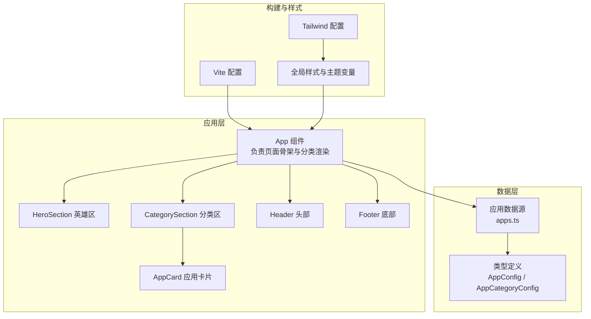
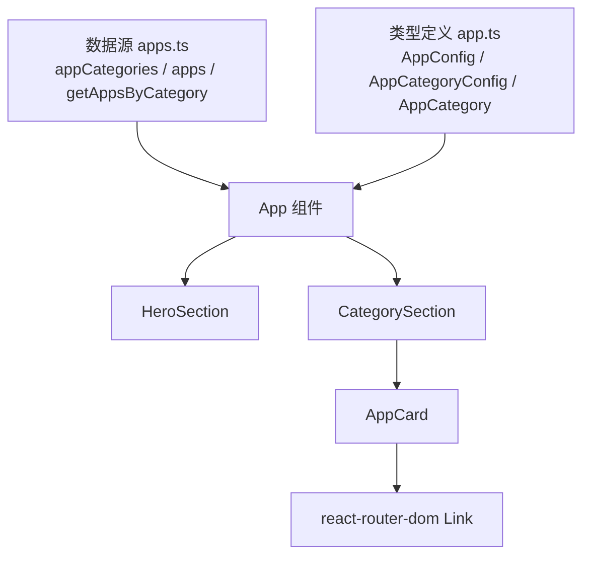
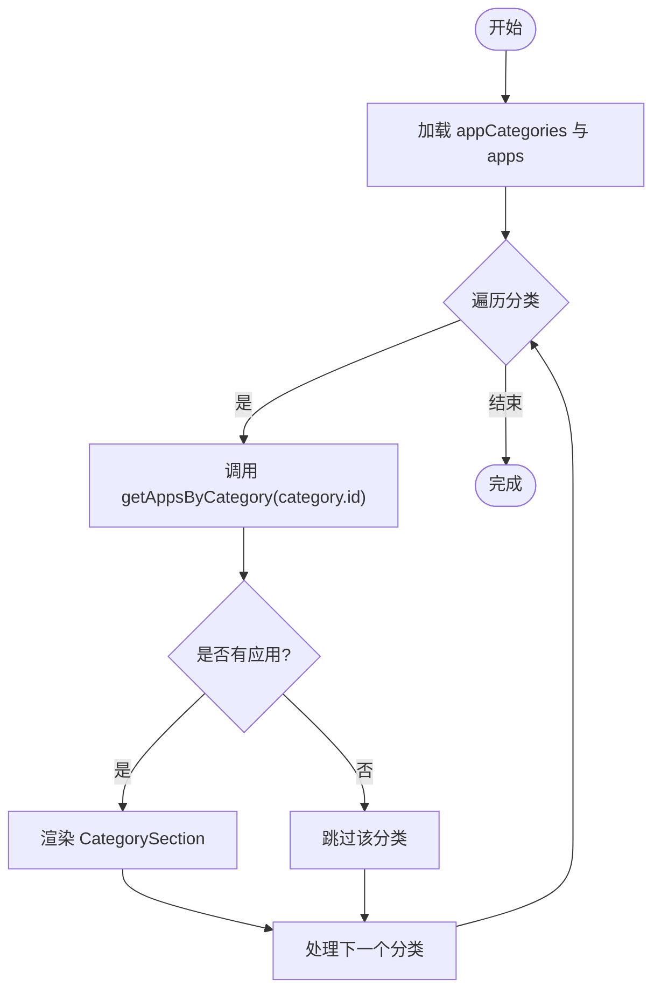
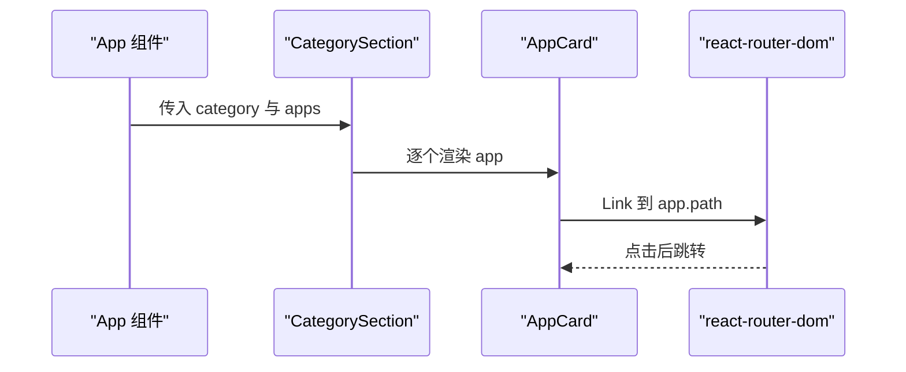
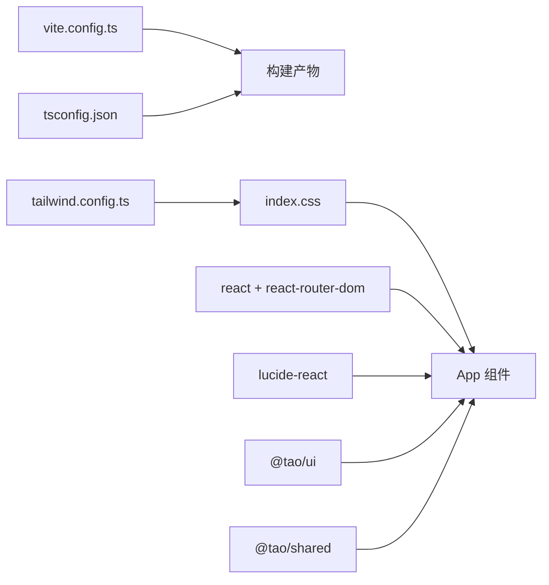

# 应用聚合器（daoNexus）

<cite>
**本文引用的文件**
- [apps/daoNexus/src/App.tsx](file://apps/daoNexus/src/App.tsx)
- [apps/daoNexus/src/data/apps.ts](file://apps/daoNexus/src/data/apps.ts)
- [apps/daoNexus/src/types/app.ts](file://apps/daoNexus/src/types/app.ts)
- [apps/daoNexus/src/components/index.ts](file://apps/daoNexus/src/components/index.ts)
- [apps/daoNexus/src/components/HeroSection.tsx](file://apps/daoNexus/src/components/HeroSection.tsx)
- [apps/daoNexus/src/components/CategorySection.tsx](file://apps/daoNexus/src/components/CategorySection.tsx)
- [apps/daoNexus/src/components/AppCard.tsx](file://apps/daoNexus/src/components/AppCard.tsx)
- [apps/daoNexus/src/components/Header.tsx](file://apps/daoNexus/src/components/Header.tsx)
- [apps/daoNexus/src/components/Footer.tsx](file://apps/daoNexus/src/components/Footer.tsx)
- [apps/daoNexus/package.json](file://apps/daoNexus/package.json)
- [apps/daoNexus/vite.config.ts](file://apps/daoNexus/vite.config.ts)
- [apps/daoNexus/tailwind.config.ts](file://apps/daoNexus/tailwind.config.ts)
- [apps/daoNexus/tsconfig.json](file://apps/daoNexus/tsconfig.json)
- [apps/daoNexus/src/main.tsx](file://apps/daoNexus/src/main.tsx)
- [apps/daoNexus/src/index.css](file://apps/daoNexus/src/index.css)
</cite>

## 目录
1. [简介](#简介)
2. [项目结构](#项目结构)
3. [核心组件](#核心组件)
4. [架构总览](#架构总览)
5. [详细组件分析](#详细组件分析)
6. [依赖关系分析](#依赖关系分析)
7. [性能考虑](#性能考虑)
8. [故障排查指南](#故障排查指南)
9. [结论](#结论)
10. [附录](#附录)

## 简介
本文件为 daoNexus 应用聚合器的完整技术文档，聚焦于应用卡片展示、分类筛选、英雄区域设计等核心功能；深入解析应用数据模型、类型定义与状态管理；阐述组件架构设计、响应式布局实现与用户体验优化；并提供应用接入示例、数据格式规范与集成指引，覆盖从应用接入到用户使用的完整流程。

## 项目结构
daoNexus 是一个基于 React 的前端应用，采用 Vite 构建，TailwindCSS 提供原子化样式与主题变量，使用 lucide-react 图标库与 react-router-dom 实现导航跳转。应用通过集中式数据源管理应用清单与分类，按类别渲染卡片网格，形成统一的应用入口门户。



图表来源
- [apps/daoNexus/src/App.tsx:1-33](file://apps/daoNexus/src/App.tsx#L1-L33)
- [apps/daoNexus/src/components/HeroSection.tsx:1-41](file://apps/daoNexus/src/components/HeroSection.tsx#L1-L41)
- [apps/daoNexus/src/components/CategorySection.tsx:1-28](file://apps/daoNexus/src/components/CategorySection.tsx#L1-L28)
- [apps/daoNexus/src/components/AppCard.tsx:1-48](file://apps/daoNexus/src/components/AppCard.tsx#L1-L48)
- [apps/daoNexus/src/components/Header.tsx:1-39](file://apps/daoNexus/src/components/Header.tsx#L1-L39)
- [apps/daoNexus/src/components/Footer.tsx:1-34](file://apps/daoNexus/src/components/Footer.tsx#L1-L34)
- [apps/daoNexus/src/data/apps.ts:1-137](file://apps/daoNexus/src/data/apps.ts#L1-L137)
- [apps/daoNexus/src/types/app.ts:1-22](file://apps/daoNexus/src/types/app.ts#L1-L22)
- [apps/daoNexus/vite.config.ts:1-36](file://apps/daoNexus/vite.config.ts#L1-L36)
- [apps/daoNexus/tailwind.config.ts:1-156](file://apps/daoNexus/tailwind.config.ts#L1-L156)
- [apps/daoNexus/src/index.css:1-178](file://apps/daoNexus/src/index.css#L1-L178)

章节来源
- [apps/daoNexus/src/App.tsx:1-33](file://apps/daoNexus/src/App.tsx#L1-L33)
- [apps/daoNexus/src/data/apps.ts:1-137](file://apps/daoNexus/src/data/apps.ts#L1-L137)
- [apps/daoNexus/src/types/app.ts:1-22](file://apps/daoNexus/src/types/app.ts#L1-L22)
- [apps/daoNexus/src/components/index.ts:1-6](file://apps/daoNexus/src/components/index.ts#L1-L6)
- [apps/daoNexus/vite.config.ts:1-36](file://apps/daoNexus/vite.config.ts#L1-L36)
- [apps/daoNexus/tailwind.config.ts:1-156](file://apps/daoNexus/tailwind.config.ts#L1-L156)
- [apps/daoNexus/src/index.css:1-178](file://apps/daoNexus/src/index.css#L1-L178)

## 核心组件
- 页面骨架与路由：App 组件负责组织头部、英雄区、分类区与底部，并根据分类动态渲染应用卡片网格。
- 英雄区：HeroSection 展示品牌标语、简述与统计信息，配合背景渐变与浮动光球动画营造沉浸感。
- 分类区：CategorySection 接收分类配置与应用列表，以响应式网格布局呈现卡片。
- 应用卡片：AppCard 基于 AppConfig 渲染带图标、描述与颜色渐变的可点击卡片，支持悬停高亮与进入动效。
- 导航与页脚：Header 提供品牌标识、导航链接与运行状态指示；Footer 显示版权与外部链接。

章节来源
- [apps/daoNexus/src/App.tsx:7-30](file://apps/daoNexus/src/App.tsx#L7-L30)
- [apps/daoNexus/src/components/HeroSection.tsx:1-41](file://apps/daoNexus/src/components/HeroSection.tsx#L1-L41)
- [apps/daoNexus/src/components/CategorySection.tsx:9-27](file://apps/daoNexus/src/components/CategorySection.tsx#L9-L27)
- [apps/daoNexus/src/components/AppCard.tsx:9-47](file://apps/daoNexus/src/components/AppCard.tsx#L9-L47)
- [apps/daoNexus/src/components/Header.tsx:1-39](file://apps/daoNexus/src/components/Header.tsx#L1-L39)
- [apps/daoNexus/src/components/Footer.tsx:1-34](file://apps/daoNexus/src/components/Footer.tsx#L1-L34)

## 架构总览
应用采用“数据驱动 + 组件化”的架构模式：
- 数据层：集中维护应用清单与分类配置，提供按分类筛选的查询函数。
- 视图层：组件通过 props 接收数据，无内部状态管理，保持纯函数式渲染。
- 路由层：卡片通过 react-router-dom 的 Link 组件进行页面跳转，路径来自应用配置。
- 主题层：Tailwind 扩展主题变量与动画，全局样式统一视觉风格。



图表来源
- [apps/daoNexus/src/data/apps.ts:14-137](file://apps/daoNexus/src/data/apps.ts#L14-L137)
- [apps/daoNexus/src/types/app.ts:3-21](file://apps/daoNexus/src/types/app.ts#L3-L21)
- [apps/daoNexus/src/App.tsx:14-24](file://apps/daoNexus/src/App.tsx#L14-L24)
- [apps/daoNexus/src/components/CategorySection.tsx:20-24](file://apps/daoNexus/src/components/CategorySection.tsx#L20-L24)
- [apps/daoNexus/src/components/AppCard.tsx:13-16](file://apps/daoNexus/src/components/AppCard.tsx#L13-L16)

## 详细组件分析

### 应用数据模型与类型定义
- AppConfig：描述单个应用的元数据，包括唯一标识、中英文名称、描述、图标组件、路由路径、卡片渐变色与所属分类。
- AppCategoryConfig：描述分类维度，包含分类标识、英文名、中文名与描述。
- AppCategory：联合类型，限定可用分类枚举值。

```mermaid
classDiagram
class AppConfig {
+string id
+string name
+string nameZh
+string description
+LucideIcon icon
+string path
+string color
+AppCategory category
}
class AppCategoryConfig {
+AppCategory id
+string name
+string nameZh
+string description
}
class AppCategory {
<<enumeration>>
"community"
"productivity"
"tools"
"admin"
}
AppConfig --> AppCategory : "使用"
AppCategoryConfig --> AppCategory : "定义"
```

图表来源
- [apps/daoNexus/src/types/app.ts:3-21](file://apps/daoNexus/src/types/app.ts#L3-L21)

章节来源
- [apps/daoNexus/src/types/app.ts:1-22](file://apps/daoNexus/src/types/app.ts#L1-L22)

### 应用数据源与分类筛选
- appCategories：预定义四类分类，用于页面顶部导航与分组标题展示。
- apps：集中式应用清单，包含各应用的图标、路径、颜色与分类标签。
- getAppsByCategory：按分类筛选应用，返回对应数组，供 CategorySection 使用。



图表来源
- [apps/daoNexus/src/App.tsx:14-24](file://apps/daoNexus/src/App.tsx#L14-L24)
- [apps/daoNexus/src/data/apps.ts:14-137](file://apps/daoNexus/src/data/apps.ts#L14-L137)

章节来源
- [apps/daoNexus/src/data/apps.ts:14-137](file://apps/daoNexus/src/data/apps.ts#L14-L137)
- [apps/daoNexus/src/App.tsx:14-24](file://apps/daoNexus/src/App.tsx#L14-L24)

### 英雄区域设计与交互
- 背景渐变与浮动光球：通过 Tailwind 自定义背景与动画类实现视觉层次。
- 统计信息：展示“应用集成数”“功能分类数”“无限可能”，强化品牌价值。
- 内容居中与响应式排版：在不同屏幕尺寸下保持良好的可读性与间距。

章节来源
- [apps/daoNexus/src/components/HeroSection.tsx:1-41](file://apps/daoNexus/src/components/HeroSection.tsx#L1-L41)
- [apps/daoNexus/tailwind.config.ts:95-149](file://apps/daoNexus/tailwind.config.ts#L95-L149)
- [apps/daoNexus/src/index.css:103-177](file://apps/daoNexus/src/index.css#L103-L177)

### 分类区与应用卡片
- 分类区：接收分类配置与应用数组，使用响应式网格（sm:2列、lg:3列、xl:4列）自适应布局。
- 应用卡片：基于 AppConfig 动态渲染图标、名称、描述与渐变色背景；支持悬停高亮与进入动画延迟，增强交互体验。



图表来源
- [apps/daoNexus/src/App.tsx:18-22](file://apps/daoNexus/src/App.tsx#L18-L22)
- [apps/daoNexus/src/components/CategorySection.tsx:20-24](file://apps/daoNexus/src/components/CategorySection.tsx#L20-L24)
- [apps/daoNexus/src/components/AppCard.tsx:13-16](file://apps/daoNexus/src/components/AppCard.tsx#L13-L16)

章节来源
- [apps/daoNexus/src/components/CategorySection.tsx:1-28](file://apps/daoNexus/src/components/CategorySection.tsx#L1-L28)
- [apps/daoNexus/src/components/AppCard.tsx:1-48](file://apps/daoNexus/src/components/AppCard.tsx#L1-L48)

### 组件导出与模块化
- components/index.ts 暴露 AppCard、CategorySection、Header、HeroSection、Footer，便于统一导入与复用。

章节来源
- [apps/daoNexus/src/components/index.ts:1-6](file://apps/daoNexus/src/components/index.ts#L1-L6)

## 依赖关系分析
- 构建与打包：Vite 配置启用 React 插件与别名，拆分 vendor chunk，压缩 console 与 debugger，输出带哈希的静态资源。
- 样式体系：Tailwind 配置扩展颜色、圆角、字体、阴影与动画，全局样式注入 CSS 变量与工具类。
- 运行时依赖：React、react-router-dom、lucide-react、@tao/ui 与 @tao/shared，确保组件生态与图标库稳定。



图表来源
- [apps/daoNexus/vite.config.ts:5-35](file://apps/daoNexus/vite.config.ts#L5-L35)
- [apps/daoNexus/tailwind.config.ts:1-156](file://apps/daoNexus/tailwind.config.ts#L1-L156)
- [apps/daoNexus/src/index.css:1-178](file://apps/daoNexus/src/index.css#L1-L178)
- [apps/daoNexus/package.json:13-32](file://apps/daoNexus/package.json#L13-L32)

章节来源
- [apps/daoNexus/package.json:1-34](file://apps/daoNexus/package.json#L1-L34)
- [apps/daoNexus/vite.config.ts:1-36](file://apps/daoNexus/vite.config.ts#L1-L36)
- [apps/daoNexus/tailwind.config.ts:1-156](file://apps/daoNexus/tailwind.config.ts#L1-L156)
- [apps/daoNexus/tsconfig.json:1-7](file://apps/daoNexus/tsconfig.json#L1-L7)

## 性能考虑
- 代码分割：Vite 将 react、react-router-dom 与 @tao/ui 独立拆包，减少首屏体积并提升缓存命中率。
- 构建优化：开启 Terser 压缩，移除 console 与 debugger，关闭 SourceMap，缩短构建时间并减小产物体积。
- 渲染优化：AppCard 使用动画延迟与渐变过渡，避免大量元素同时入场造成抖动；CategorySection 采用响应式网格，降低移动端重排成本。
- 样式优化：Tailwind 工具类与 CSS 变量统一管理，减少重复样式与运行时计算。

章节来源
- [apps/daoNexus/vite.config.ts:21-31](file://apps/daoNexus/vite.config.ts#L21-L31)
- [apps/daoNexus/src/components/AppCard.tsx:15-16](file://apps/daoNexus/src/components/AppCard.tsx#L15-L16)
- [apps/daoNexus/src/components/CategorySection.tsx:20](file://apps/daoNexus/src/components/CategorySection.tsx#L20)

## 故障排查指南
- 应用无法渲染或空白页
  - 检查根节点挂载是否正确，确认 main.tsx 中的 DOM 元素存在且未被其他脚本覆盖。
  - 章节来源: [apps/daoNexus/src/main.tsx:6-10](file://apps/daoNexus/src/main.tsx#L6-L10)
- 卡片不显示或分类为空
  - 确认 appCategories 与 apps 的 id 对齐，getAppsByCategory 返回非空数组。
  - 章节来源: [apps/daoNexus/src/data/apps.ts:14-137](file://apps/daoNexus/src/data/apps.ts#L14-L137)
- 图标不显示或样式异常
  - 检查 lucide-react 是否安装，Tailwind 配置是否包含图标组件的渲染环境。
  - 章节来源: [apps/daoNexus/package.json:16](file://apps/daoNexus/package.json#L16)
- 路由跳转无效
  - 确认 AppCard 的 Link to 字段与目标应用路由一致，react-router-dom 版本兼容。
  - 章节来源: [apps/daoNexus/src/components/AppCard.tsx:14](file://apps/daoNexus/src/components/AppCard.tsx#L14)
- 样式未生效或主题异常
  - 检查 Tailwind 配置 content 路径与 index.css 引入顺序，确认 CSS 变量与工具类已编译。
  - 章节来源: [apps/daoNexus/tailwind.config.ts:5-10](file://apps/daoNexus/tailwind.config.ts#L5-L10), [apps/daoNexus/src/index.css:3-5](file://apps/daoNexus/src/index.css#L3-L5)

## 结论
daoNexus 通过清晰的数据模型与组件化架构，实现了从应用发现、分类筛选到卡片导航的一体化体验。借助 Tailwind 主题系统与 Vite 构建优化，兼顾了开发效率与运行性能。未来可在现有基础上扩展个性化推荐、搜索过滤与多语言国际化能力，进一步完善用户旅程。

## 附录

### 应用接入与数据格式规范
- 新增应用步骤
  1) 在应用清单中添加一条 AppConfig 记录，填写 id、name、nameZh、description、icon、path、color、category。
  2) 在分类配置中选择合适的分类 id，确保与 AppConfig 的 category 对齐。
  3) 如需新增分类，扩展 AppCategoryConfig 并更新类型定义。
- 数据字段说明
  - id: 应用唯一标识，建议使用短横线命名。
  - name/nameZh: 英文与中文名称，用于标题与搜索。
  - description: 应用描述，建议简洁明了。
  - icon: 来自 lucide-react 的图标组件。
  - path: 应用路由路径，需与目标页面路由一致。
  - color: 卡片渐变色，使用 Tailwind 渐变语法。
  - category: 分类标识，必须为已定义的枚举值之一。

章节来源
- [apps/daoNexus/src/types/app.ts:3-12](file://apps/daoNexus/src/types/app.ts#L3-L12)
- [apps/daoNexus/src/data/apps.ts:41-132](file://apps/daoNexus/src/data/apps.ts#L41-L132)

### API 接口与集成指引
- 当前实现为前端静态数据与组件渲染，无需后端 API。
- 若需对接后端：
  - 定义统一的 AppConfig 接口契约，确保字段与现有类型一致。
  - 提供 GET /apps 获取应用清单，GET /categories 获取分类配置。
  - 在 App 组件中替换本地数据源为远程请求结果，并增加加载态与错误态处理。

[本节为概念性说明，不直接映射具体源码文件]