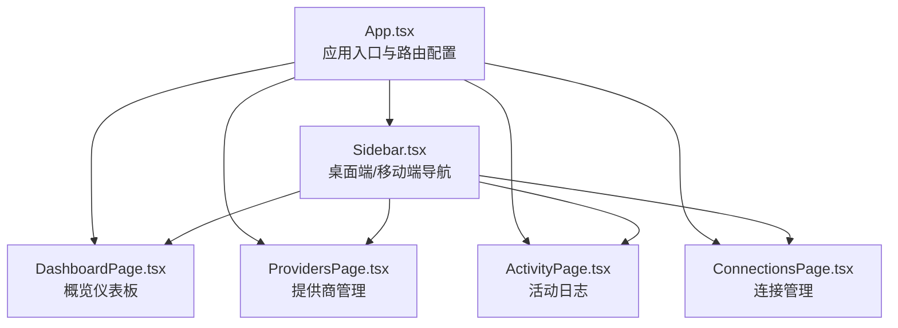
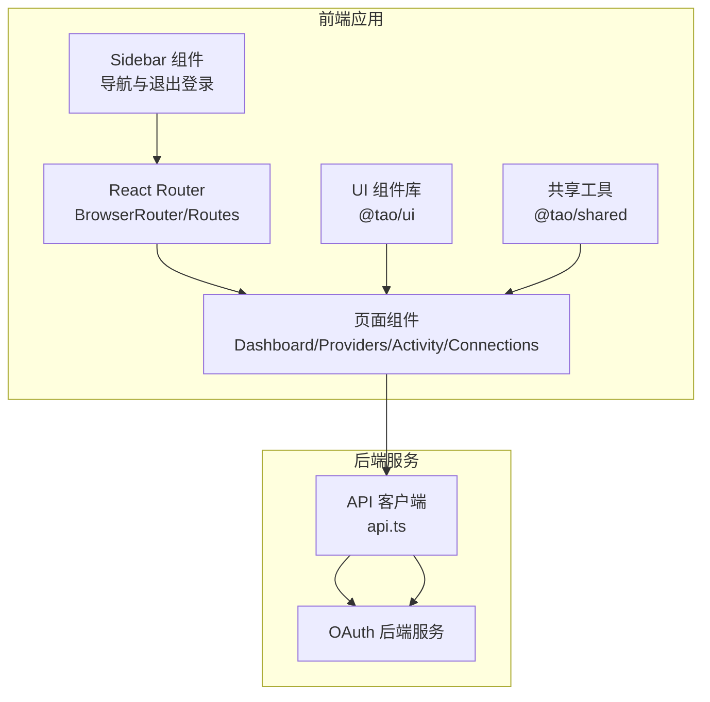
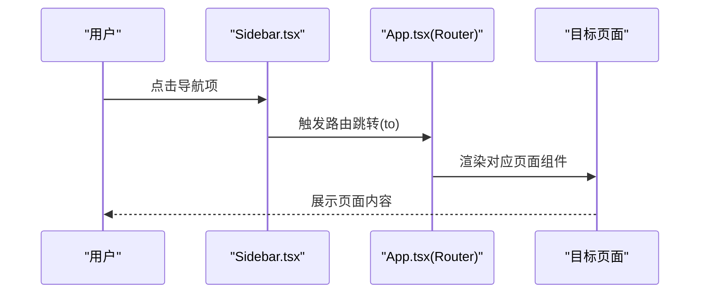
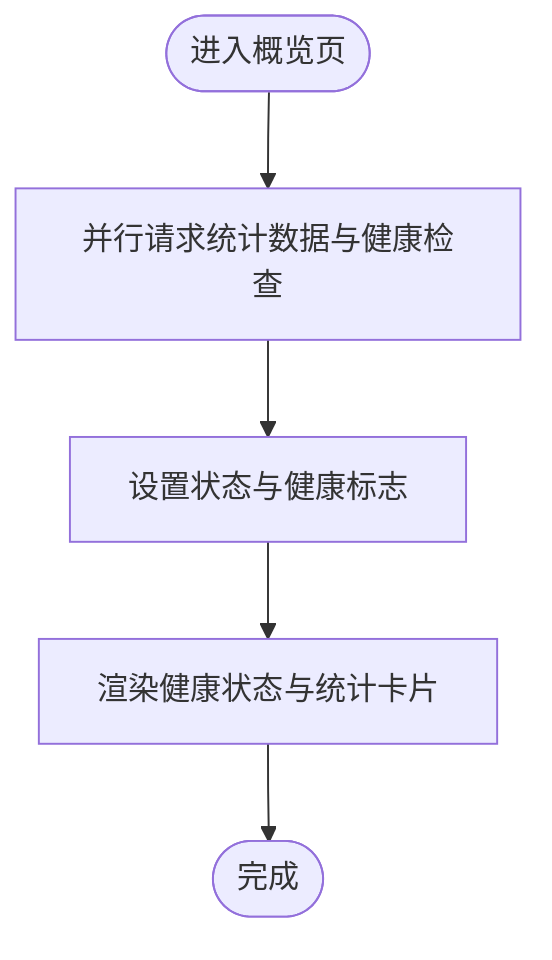
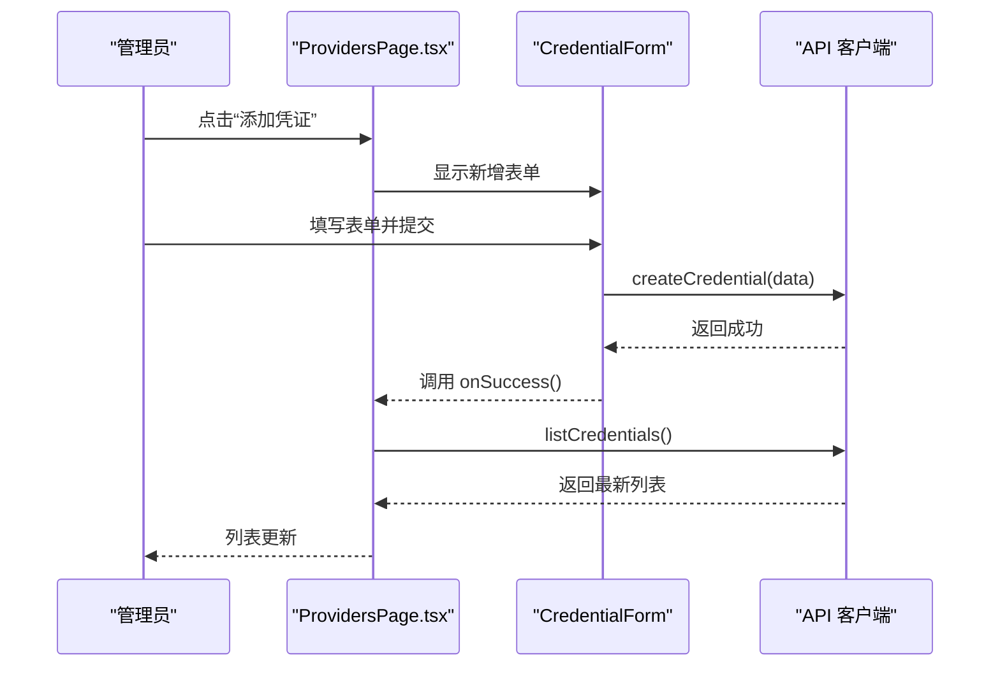
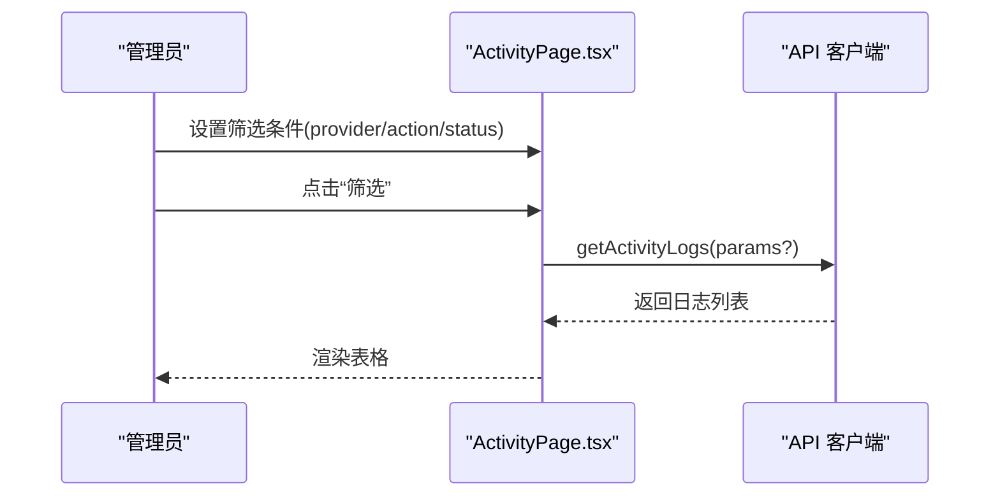
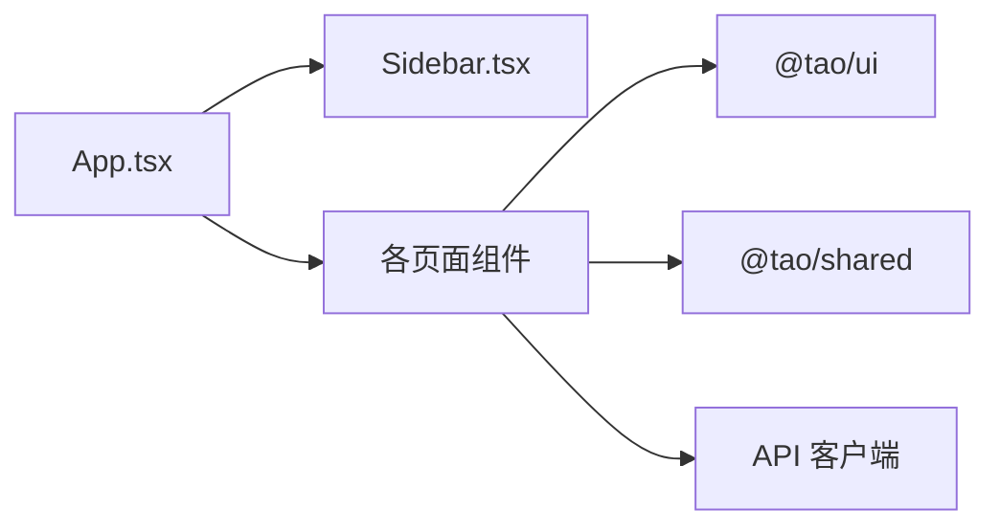

# OAuth管理

<cite>
**本文引用的文件**
- [apps/oauth-admin/src/App.tsx](file://apps/oauth-admin/src/App.tsx)
- [apps/oauth-admin/src/components/layout/Sidebar.tsx](file://apps/oauth-admin/src/components/layout/Sidebar.tsx)
- [apps/oauth-admin/src/pages/DashboardPage.tsx](file://apps/oauth-admin/src/pages/DashboardPage.tsx)
- [apps/oauth-admin/src/pages/ProvidersPage.tsx](file://apps/oauth-admin/src/pages/ProvidersPage.tsx)
- [apps/oauth-admin/src/pages/ActivityPage.tsx](file://apps/oauth-admin/src/pages/ActivityPage.tsx)
- [apps/oauth-admin/src/pages/ConnectionsPage.tsx](file://apps/oauth-admin/src/pages/ConnectionsPage.tsx)
</cite>

## 目录
1. [简介](#简介)
2. [项目结构](#项目结构)
3. [核心组件](#核心组件)
4. [架构总览](#架构总览)
5. [详细组件分析](#详细组件分析)
6. [依赖分析](#依赖分析)
7. [性能考虑](#性能考虑)
8. [故障排除指南](#故障排除指南)
9. [结论](#结论)
10. [附录](#附录)

## 简介
本文件面向管理员与开发者，系统性阐述 OAuth 管理应用的功能与实现，包括第三方连接管理、活动监控、提供商配置与会话管理等模块。文档覆盖仪表板设计、连接列表展示与活动日志分析，解释侧边栏导航、页面路由与状态管理机制，并提供 OAuth 提供商集成、安全认证流程与权限控制策略的说明。最后给出连接配置向导、活动审计与故障排除的使用指南，帮助管理员高效管理用户身份认证与第三方服务集成。

## 项目结构
OAuth 管理应用采用前端单页应用（SPA）架构，基于 React Router 实现页面路由，使用共享 UI 组件库与工具函数进行统一风格与交互。应用通过路由分发到四个核心页面：概览、提供商管理、活动日志与连接管理；侧边栏提供导航与移动端底部导航；页面内通过 API 客户端拉取统计数据、凭证列表与活动日志。

图表来源
- [apps/oauth-admin/src/App.tsx:1-26](file://apps/oauth-admin/src/App.tsx#L1-L26)
- [apps/oauth-admin/src/components/layout/Sidebar.tsx:1-77](file://apps/oauth-admin/src/components/layout/Sidebar.tsx#L1-L77)
- [apps/oauth-admin/src/pages/DashboardPage.tsx:1-98](file://apps/oauth-admin/src/pages/DashboardPage.tsx#L1-L98)
- [apps/oauth-admin/src/pages/ProvidersPage.tsx:1-293](file://apps/oauth-admin/src/pages/ProvidersPage.tsx#L1-L293)
- [apps/oauth-admin/src/pages/ActivityPage.tsx:1-160](file://apps/oauth-admin/src/pages/ActivityPage.tsx#L1-L160)
- [apps/oauth-admin/src/pages/ConnectionsPage.tsx:1-32](file://apps/oauth-admin/src/pages/ConnectionsPage.tsx#L1-L32)

章节来源
- [apps/oauth-admin/src/App.tsx:1-26](file://apps/oauth-admin/src/App.tsx#L1-L26)
- [apps/oauth-admin/src/components/layout/Sidebar.tsx:1-77](file://apps/oauth-admin/src/components/layout/Sidebar.tsx#L1-L77)

## 核心组件
- 应用入口与路由
  - 使用浏览器路由，定义根路径与四个页面路由，主内容区域承载页面组件，侧边栏固定在左侧，移动端使用底部导航。
- 侧边栏导航
  - 桌面端：固定宽度侧边栏，包含“概览”“提供商”“活动日志”“连接管理”四项导航，当前路由高亮。
  - 移动端：底部固定导航条，图标+文字，响应式适配。
  - 提供退出登录功能，清除本地令牌并刷新页面。
- 页面组件
  - 概览：加载服务健康状态与统计指标，展示连接总数、活跃连接、提供商数量与服务状态。
  - 提供商：列出已配置的 OAuth 凭证，支持启用/禁用、删除与新增表单；表单支持提供商选择、Client ID/Secret、回调 URI、Scopes 等字段。
  - 活动日志：按提供商、操作类型、状态筛选，展示时间、操作、状态、提供商、用户标识与 IP 等信息。
  - 连接管理：说明连接管理职责与 API 端点，指导管理员查看与处理异常连接。

章节来源
- [apps/oauth-admin/src/App.tsx:8-25](file://apps/oauth-admin/src/App.tsx#L8-L25)
- [apps/oauth-admin/src/components/layout/Sidebar.tsx:12-53](file://apps/oauth-admin/src/components/layout/Sidebar.tsx#L12-L53)
- [apps/oauth-admin/src/pages/DashboardPage.tsx:6-71](file://apps/oauth-admin/src/pages/DashboardPage.tsx#L6-L71)
- [apps/oauth-admin/src/pages/ProvidersPage.tsx:8-147](file://apps/oauth-admin/src/pages/ProvidersPage.tsx#L8-L147)
- [apps/oauth-admin/src/pages/ActivityPage.tsx:22-159](file://apps/oauth-admin/src/pages/ActivityPage.tsx#L22-L159)
- [apps/oauth-admin/src/pages/ConnectionsPage.tsx:4-31](file://apps/oauth-admin/src/pages/ConnectionsPage.tsx#L4-L31)

## 架构总览
应用采用“路由驱动 + 组件化页面 + API 客户端”的前端架构。路由负责页面切换，页面组件负责数据获取与渲染，侧边栏提供全局导航与会话控制。页面间通过统一的 API 客户端访问后端服务，实现数据的读取与写入。

图表来源
- [apps/oauth-admin/src/App.tsx:1-26](file://apps/oauth-admin/src/App.tsx#L1-L26)
- [apps/oauth-admin/src/components/layout/Sidebar.tsx:1-77](file://apps/oauth-admin/src/components/layout/Sidebar.tsx#L1-L77)
- [apps/oauth-admin/src/pages/DashboardPage.tsx:1-98](file://apps/oauth-admin/src/pages/DashboardPage.tsx#L1-L98)
- [apps/oauth-admin/src/pages/ProvidersPage.tsx:1-293](file://apps/oauth-admin/src/pages/ProvidersPage.tsx#L1-L293)
- [apps/oauth-admin/src/pages/ActivityPage.tsx:1-160](file://apps/oauth-admin/src/pages/ActivityPage.tsx#L1-L160)
- [apps/oauth-admin/src/pages/ConnectionsPage.tsx:1-32](file://apps/oauth-admin/src/pages/ConnectionsPage.tsx#L1-L32)

## 详细组件分析

### 路由与导航
- 路由配置
  - 根路径“/”指向概览页；“/providers”指向提供商管理；“/activity”指向活动日志；“/connections”指向连接管理。
  - 主内容区包裹在路由容器中，确保页面切换时保持布局一致。
- 导航行为
  - 桌面端侧边栏使用链接高亮表示当前路由；移动端底部导航以图标与文字呈现，便于移动设备操作。
  - 退出登录按钮移除本地令牌并刷新页面，确保会话清理。

图表来源
- [apps/oauth-admin/src/App.tsx:14-19](file://apps/oauth-admin/src/App.tsx#L14-L19)
- [apps/oauth-admin/src/components/layout/Sidebar.tsx:20-39](file://apps/oauth-admin/src/components/layout/Sidebar.tsx#L20-L39)

章节来源
- [apps/oauth-admin/src/App.tsx:14-19](file://apps/oauth-admin/src/App.tsx#L14-L19)
- [apps/oauth-admin/src/components/layout/Sidebar.tsx:20-50](file://apps/oauth-admin/src/components/layout/Sidebar.tsx#L20-L50)

### 概览仪表板
- 数据加载
  - 首次挂载时并行请求统计数据与健康检查，完成后设置状态并停止加载。
- 健康状态
  - 通过健康检查结果展示服务状态（正常/异常），并以颜色与文案提示。
- 统计卡片
  - 展示总连接数、活跃连接、提供商数量与服务状态，使用图标与数值增强可读性。
- 动画与布局
  - 使用淡入动画提升用户体验，网格布局自适应不同屏幕尺寸。

图表来源
- [apps/oauth-admin/src/pages/DashboardPage.tsx:11-20](file://apps/oauth-admin/src/pages/DashboardPage.tsx#L11-L20)
- [apps/oauth-admin/src/pages/DashboardPage.tsx:37-68](file://apps/oauth-admin/src/pages/DashboardPage.tsx#L37-L68)

章节来源
- [apps/oauth-admin/src/pages/DashboardPage.tsx:6-71](file://apps/oauth-admin/src/pages/DashboardPage.tsx#L6-L71)

### 提供商管理
- 列表展示
  - 加载凭证列表，若为空则提示“暂无凭证”，否则逐条展示提供商图标、显示名称、启用状态、Client ID 片段、更新时间与允许的 Scopes。
- 操作能力
  - 启用/禁用：切换凭证状态，调用更新接口后重新拉取列表。
  - 删除：二次确认后调用删除接口，失败时显示错误消息。
- 新增凭证
  - 表单包含提供商选择、显示名称、Client ID、Client Secret、回调 URI、Scopes（逗号分隔）、默认启用状态。
  - 提交前将 Scopes 字符串解析为数组，捕获错误并反馈。
- 错误处理
  - 统一使用错误提示块显示错误消息，支持关闭按钮清除。

图表来源
- [apps/oauth-admin/src/pages/ProvidersPage.tsx:14-25](file://apps/oauth-admin/src/pages/ProvidersPage.tsx#L14-L25)
- [apps/oauth-admin/src/pages/ProvidersPage.tsx:27-44](file://apps/oauth-admin/src/pages/ProvidersPage.tsx#L27-L44)
- [apps/oauth-admin/src/pages/ProvidersPage.tsx:163-292](file://apps/oauth-admin/src/pages/ProvidersPage.tsx#L163-L292)

章节来源
- [apps/oauth-admin/src/pages/ProvidersPage.tsx:8-147](file://apps/oauth-admin/src/pages/ProvidersPage.tsx#L8-L147)

### 活动日志
- 数据加载与筛选
  - 支持按提供商、操作类型、状态三类条件筛选；筛选条件作为查询参数传递给接口。
- 日志表格
  - 展示时间、操作（带中文标签映射）、状态徽标、提供商、用户 ID（截断显示）、IP 地址。
- 用户体验
  - 加载中显示占位文本；无记录时提示“暂无活动记录”。

图表来源
- [apps/oauth-admin/src/pages/ActivityPage.tsx:22-48](file://apps/oauth-admin/src/pages/ActivityPage.tsx#L22-L48)
- [apps/oauth-admin/src/pages/ActivityPage.tsx:50-52](file://apps/oauth-admin/src/pages/ActivityPage.tsx#L50-L52)
- [apps/oauth-admin/src/pages/ActivityPage.tsx:116-156](file://apps/oauth-admin/src/pages/ActivityPage.tsx#L116-L156)

章节来源
- [apps/oauth-admin/src/pages/ActivityPage.tsx:22-159](file://apps/oauth-admin/src/pages/ActivityPage.tsx#L22-L159)

### 连接管理
- 页面职责
  - 说明连接管理的目标：查看与管理用户与 OAuth 提供商之间的连接关系。
  - 提示连接数据可通过特定 API 端点访问，便于与后端对接。
- 管理建议
  - 指导管理员查看连接状态、解除异常连接与监控连接活动，保障服务稳定性。

章节来源
- [apps/oauth-admin/src/pages/ConnectionsPage.tsx:4-31](file://apps/oauth-admin/src/pages/ConnectionsPage.tsx#L4-L31)

## 依赖分析
- 组件耦合
  - App 负责路由与布局，不直接依赖页面业务逻辑，降低耦合度。
  - 侧边栏仅依赖路由与样式工具，职责单一。
  - 页面组件通过 API 客户端与后端交互，避免直接引入后端细节。
- 外部依赖
  - 路由：react-router-dom
  - UI：@tao/ui
  - 工具：@tao/shared（格式化等）
- 状态管理
  - 页面内部使用 React 状态管理（useState/useEffect），简单直观，适合当前规模。

图表来源
- [apps/oauth-admin/src/App.tsx:1-26](file://apps/oauth-admin/src/App.tsx#L1-L26)
- [apps/oauth-admin/src/components/layout/Sidebar.tsx:1-77](file://apps/oauth-admin/src/components/layout/Sidebar.tsx#L1-L77)
- [apps/oauth-admin/src/pages/DashboardPage.tsx:1-98](file://apps/oauth-admin/src/pages/DashboardPage.tsx#L1-L98)
- [apps/oauth-admin/src/pages/ProvidersPage.tsx:1-293](file://apps/oauth-admin/src/pages/ProvidersPage.tsx#L1-L293)
- [apps/oauth-admin/src/pages/ActivityPage.tsx:1-160](file://apps/oauth-admin/src/pages/ActivityPage.tsx#L1-L160)
- [apps/oauth-admin/src/pages/ConnectionsPage.tsx:1-32](file://apps/oauth-admin/src/pages/ConnectionsPage.tsx#L1-L32)

## 性能考虑
- 并行加载
  - 概览页对统计数据与健康检查采用并行请求，缩短首屏等待时间。
- 虚拟滚动与分页
  - 活动日志当前为全量表格展示，建议在数据量增大时引入虚拟滚动或分页以优化渲染性能。
- 图标与资源
  - 提供商图标采用简短字符串生成背景色，减少外部图片请求，提升加载速度。
- 缓存策略
  - 对频繁访问的列表（如凭证列表）可在客户端增加缓存与失效策略，减少重复请求。

## 故障排除指南
- 无法加载数据
  - 检查网络连通性与后端服务状态；查看页面错误提示，确认是否为权限不足或接口异常。
- 提供商凭证问题
  - 确认 Client ID/Secret 是否正确；回调 URI 是否与后端配置一致；Scopes 是否满足提供商要求。
- 活动日志为空
  - 检查筛选条件是否过于严格；尝试清空筛选重试；确认后端是否已产生相应日志。
- 退出登录无效
  - 确认本地存储令牌是否存在；手动清除令牌后刷新页面；检查浏览器隐私设置是否阻止本地存储。
- 移动端导航不可用
  - 确认底部导航是否被其他元素遮挡；尝试调整窗口大小或使用桌面端导航。

## 结论
OAuth 管理应用以清晰的路由与组件划分实现了对第三方连接、提供商配置与活动日志的集中管理。通过统一的 UI 组件与工具库，提升了开发效率与一致性。建议后续在活动日志等大数据场景引入分页或虚拟滚动，在凭证管理中增加更细粒度的权限控制与审计追踪，以进一步完善安全与性能。

## 附录
- 使用指南
  - 连接配置向导
    - 在“提供商”页面点击“添加凭证”，填写提供商、显示名称、Client ID/Secret、回调 URI 与 Scopes，提交后立即生效。
    - 如需临时停用某提供商，可在列表中切换启用/禁用。
  - 活动审计
    - 在“活动日志”页面按提供商、操作类型、状态筛选，核对登录、关联、解除关联、Token 刷新等关键事件。
  - 故障排除
    - 若出现异常连接，前往“连接管理”页面查看具体状态与相关日志，必要时解除异常连接并重新引导用户完成授权流程。