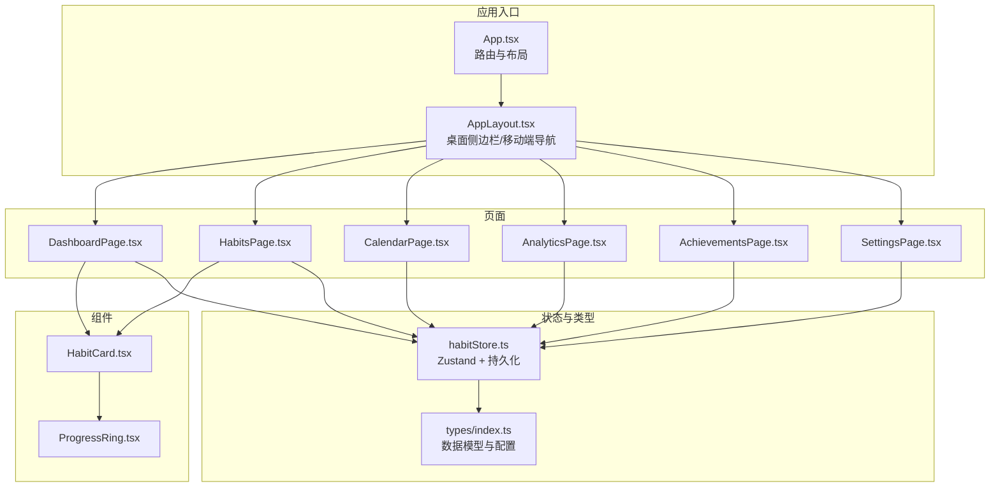
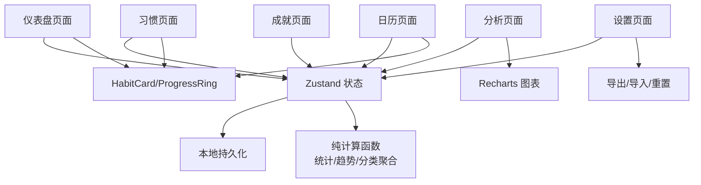
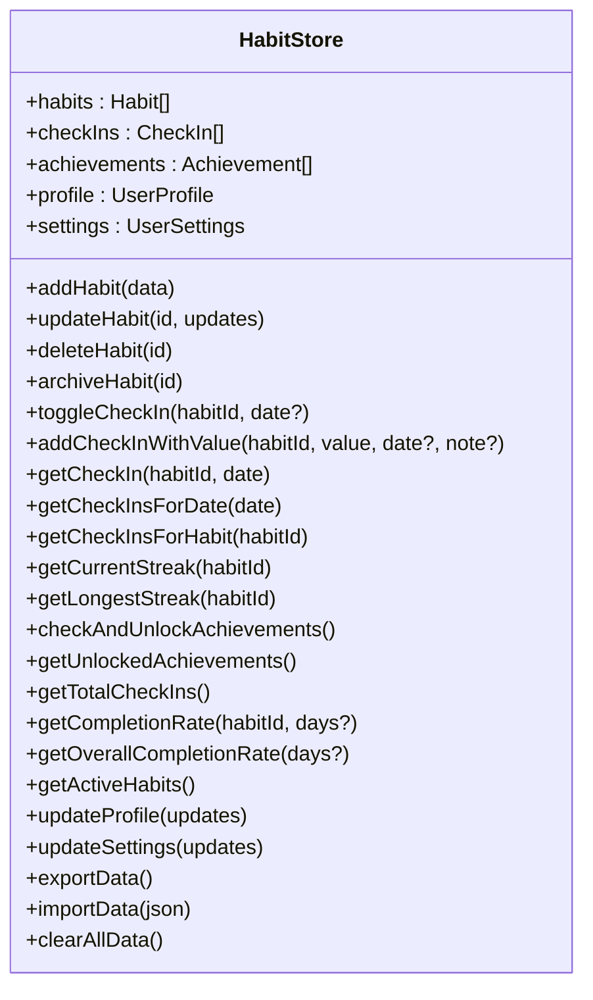
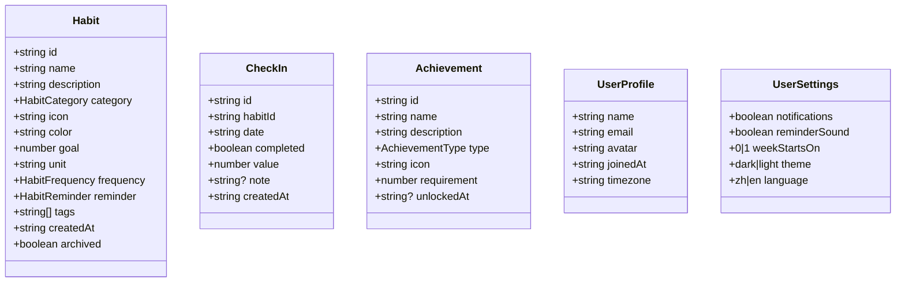
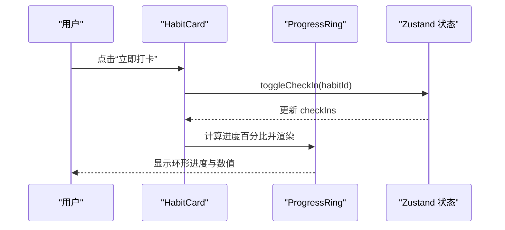
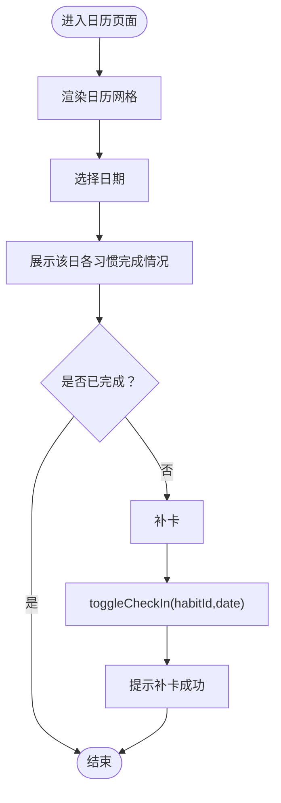
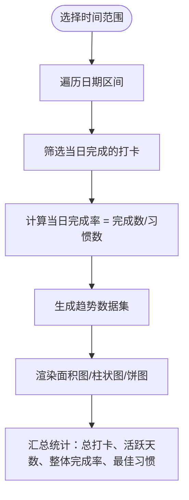
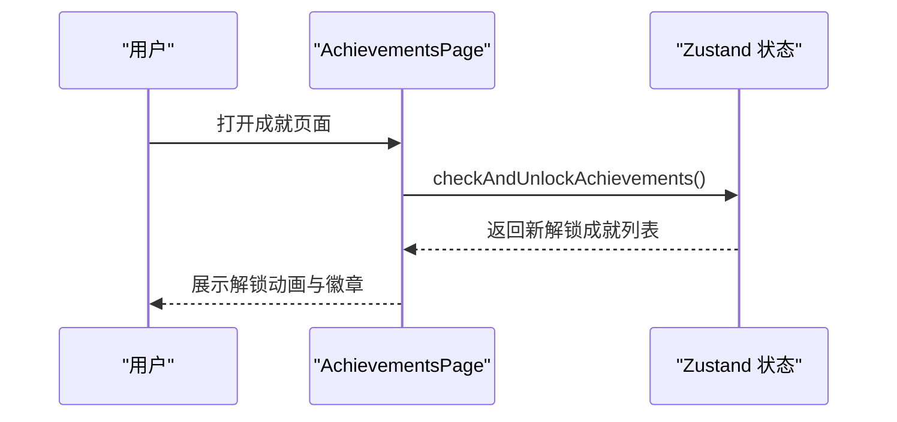
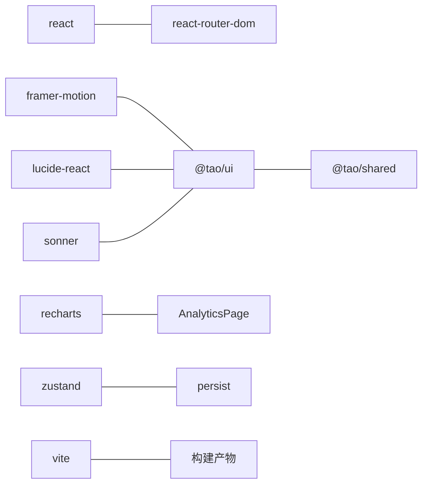

# 习惯追踪器

<cite>
**本文引用的文件**
- [apps/habit-tracker/src/App.tsx](file://apps/habit-tracker/src/App.tsx)
- [apps/habit-tracker/src/store/habitStore.ts](file://apps/habit-tracker/src/store/habitStore.ts)
- [apps/habit-tracker/src/types/index.ts](file://apps/habit-tracker/src/types/index.ts)
- [apps/habit-tracker/src/components/shared/HabitCard.tsx](file://apps/habit-tracker/src/components/shared/HabitCard.tsx)
- [apps/habit-tracker/src/components/shared/ProgressRing.tsx](file://apps/habit-tracker/src/components/shared/ProgressRing.tsx)
- [apps/habit-tracker/src/pages/DashboardPage.tsx](file://apps/habit-tracker/src/pages/DashboardPage.tsx)
- [apps/habit-tracker/src/pages/CalendarPage.tsx](file://apps/habit-tracker/src/pages/CalendarPage.tsx)
- [apps/habit-tracker/src/pages/AnalyticsPage.tsx](file://apps/habit-tracker/src/pages/AnalyticsPage.tsx)
- [apps/habit-tracker/src/pages/AchievementsPage.tsx](file://apps/habit-tracker/src/pages/AchievementsPage.tsx)
- [apps/habit-tracker/src/pages/HabitsPage.tsx](file://apps/habit-tracker/src/pages/HabitsPage.tsx)
- [apps/habit-tracker/src/pages/SettingsPage.tsx](file://apps/habit-tracker/src/pages/SettingsPage.tsx)
- [apps/habit-tracker/src/components/layout/AppLayout.tsx](file://apps/habit-tracker/src/components/layout/AppLayout.tsx)
- [apps/habit-tracker/package.json](file://apps/habit-tracker/package.json)
- [apps/habit-tracker/vite.config.ts](file://apps/habit-tracker/vite.config.ts)
</cite>

## 目录
1. [简介](#简介)
2. [项目结构](#项目结构)
3. [核心组件](#核心组件)
4. [架构总览](#架构总览)
5. [详细组件分析](#详细组件分析)
6. [依赖关系分析](#依赖关系分析)
7. [性能考量](#性能考量)
8. [故障排查指南](#故障排查指南)
9. [结论](#结论)
10. [附录](#附录)

## 简介
本项目是一个基于 React 的“习惯追踪器”应用，围绕“习惯养成追踪、每日打卡、周月度统计与成就激励”构建。系统通过本地状态管理与持久化，提供直观的可视化卡片、环形进度图、日历热力图与多维度数据分析，帮助用户建立并持续改进有效的习惯养成体系。

## 项目结构
应用采用按页面与功能模块划分的组织方式，核心目录包括：
- 页面层：Dashboard、Habits、Calendar、Analytics、Achievements、Settings
- 组件层：共享的 HabitCard、ProgressRing 以及布局组件
- 状态层：使用 Zustand 管理习惯、打卡、成就、用户资料与设置，并通过持久化中间件实现本地存储
- 类型定义：统一的 Habit、CheckIn、Achievement、UserProfile、UserSettings 等类型与分类、成就定义
- 构建与依赖：React 18、React Router、TailwindCSS、Recharts、Framer Motion、Sonner 等

图表来源
- [apps/habit-tracker/src/App.tsx:1-30](file://apps/habit-tracker/src/App.tsx#L1-L30)
- [apps/habit-tracker/src/components/layout/AppLayout.tsx:1-27](file://apps/habit-tracker/src/components/layout/AppLayout.tsx#L1-L27)
- [apps/habit-tracker/src/pages/DashboardPage.tsx:1-283](file://apps/habit-tracker/src/pages/DashboardPage.tsx#L1-L283)
- [apps/habit-tracker/src/pages/HabitsPage.tsx:1-535](file://apps/habit-tracker/src/pages/HabitsPage.tsx#L1-L535)
- [apps/habit-tracker/src/pages/CalendarPage.tsx:1-289](file://apps/habit-tracker/src/pages/CalendarPage.tsx#L1-L289)
- [apps/habit-tracker/src/pages/AnalyticsPage.tsx:1-425](file://apps/habit-tracker/src/pages/AnalyticsPage.tsx#L1-L425)
- [apps/habit-tracker/src/pages/AchievementsPage.tsx:1-212](file://apps/habit-tracker/src/pages/AchievementsPage.tsx#L1-L212)
- [apps/habit-tracker/src/pages/SettingsPage.tsx:1-306](file://apps/habit-tracker/src/pages/SettingsPage.tsx#L1-L306)
- [apps/habit-tracker/src/components/shared/HabitCard.tsx:1-217](file://apps/habit-tracker/src/components/shared/HabitCard.tsx#L1-L217)
- [apps/habit-tracker/src/components/shared/ProgressRing.tsx:1-64](file://apps/habit-tracker/src/components/shared/ProgressRing.tsx#L1-L64)
- [apps/habit-tracker/src/store/habitStore.ts:1-545](file://apps/habit-tracker/src/store/habitStore.ts#L1-L545)
- [apps/habit-tracker/src/types/index.ts:1-113](file://apps/habit-tracker/src/types/index.ts#L1-L113)

章节来源
- [apps/habit-tracker/src/App.tsx:1-30](file://apps/habit-tracker/src/App.tsx#L1-L30)
- [apps/habit-tracker/src/components/layout/AppLayout.tsx:1-27](file://apps/habit-tracker/src/components/layout/AppLayout.tsx#L1-L27)
- [apps/habit-tracker/package.json:1-35](file://apps/habit-tracker/package.json#L1-L35)

## 核心组件
- 状态管理与持久化：Zustand + persist，集中管理习惯、打卡、成就、用户资料与设置，自动持久化到本地存储
- 数据模型与配置：Habit、CheckIn、Achievement、UserProfile、UserSettings；分类与成就常量定义
- 可视化组件：HabitCard（含进度环形图）、ProgressRing（SVG 环形进度）
- 页面功能：仪表盘、习惯管理、日历视图、数据分析、成就墙、设置

章节来源
- [apps/habit-tracker/src/store/habitStore.ts:1-545](file://apps/habit-tracker/src/store/habitStore.ts#L1-L545)
- [apps/habit-tracker/src/types/index.ts:1-113](file://apps/habit-tracker/src/types/index.ts#L1-L113)
- [apps/habit-tracker/src/components/shared/HabitCard.tsx:1-217](file://apps/habit-tracker/src/components/shared/HabitCard.tsx#L1-L217)
- [apps/habit-tracker/src/components/shared/ProgressRing.tsx:1-64](file://apps/habit-tracker/src/components/shared/ProgressRing.tsx#L1-L64)

## 架构总览
应用采用前端单页应用架构，页面通过路由组织，组件通过状态驱动渲染。状态层负责数据一致性与持久化，类型层确保数据结构稳定，UI 层通过动画与图表提升交互体验。

图表来源
- [apps/habit-tracker/src/pages/DashboardPage.tsx:1-283](file://apps/habit-tracker/src/pages/DashboardPage.tsx#L1-L283)
- [apps/habit-tracker/src/pages/HabitsPage.tsx:1-535](file://apps/habit-tracker/src/pages/HabitsPage.tsx#L1-L535)
- [apps/habit-tracker/src/pages/CalendarPage.tsx:1-289](file://apps/habit-tracker/src/pages/CalendarPage.tsx#L1-L289)
- [apps/habit-tracker/src/pages/AnalyticsPage.tsx:1-425](file://apps/habit-tracker/src/pages/AnalyticsPage.tsx#L1-L425)
- [apps/habit-tracker/src/pages/AchievementsPage.tsx:1-212](file://apps/habit-tracker/src/pages/AchievementsPage.tsx#L1-L212)
- [apps/habit-tracker/src/pages/SettingsPage.tsx:1-306](file://apps/habit-tracker/src/pages/SettingsPage.tsx#L1-L306)
- [apps/habit-tracker/src/store/habitStore.ts:1-545](file://apps/habit-tracker/src/store/habitStore.ts#L1-L545)

## 详细组件分析

### 状态管理与持久化（Zustand）
- 数据域：habits、checkIns、achievements、profile、settings
- 关键能力：
  - 习惯 CRUD、归档
  - 打卡切换与补卡、按日期/习惯查询
  - 连续天数与最长连续天数计算
  - 成就解锁判定与查询
  - 总打卡次数、完成率、整体完成率、活跃习惯
  - 用户资料与设置更新
  - 数据导出/导入/重置
- 持久化：使用 persist 中间件，以“habit-tracker-storage”为键名持久化

图表来源
- [apps/habit-tracker/src/store/habitStore.ts:14-57](file://apps/habit-tracker/src/store/habitStore.ts#L14-L57)

章节来源
- [apps/habit-tracker/src/store/habitStore.ts:1-545](file://apps/habit-tracker/src/store/habitStore.ts#L1-L545)

### 数据模型与配置
- Habit：名称、描述、分类、图标、颜色、目标值与单位、频率、提醒、标签、创建时间、归档状态
- CheckIn：习惯 ID、日期、完成状态、数值、备注、创建时间
- Achievement：成就类型、名称、描述、图标、要求、解锁时间
- UserProfile：姓名、邮箱、头像、加入时间、时区
- UserSettings：通知开关、提醒音效、周起始日、主题、语言
- 分类配置与成就定义：提供分类标签、图标与 CSS 变量映射，以及各类成就的阈值与描述

图表来源
- [apps/habit-tracker/src/types/index.ts:1-113](file://apps/habit-tracker/src/types/index.ts#L1-L113)

章节来源
- [apps/habit-tracker/src/types/index.ts:1-113](file://apps/habit-tracker/src/types/index.ts#L1-L113)

### 习惯卡片与进度环形图
- HabitCard：展示习惯名称、分类标签、当日完成状态、当前进度百分比、当前连续天数、一键打卡按钮；紧凑模式用于列表快速浏览
- ProgressRing：基于 SVG 的环形进度条，支持尺寸、线宽、颜色与中心内容定制

图表来源
- [apps/habit-tracker/src/components/shared/HabitCard.tsx:1-217](file://apps/habit-tracker/src/components/shared/HabitCard.tsx#L1-L217)
- [apps/habit-tracker/src/components/shared/ProgressRing.tsx:1-64](file://apps/habit-tracker/src/components/shared/ProgressRing.tsx#L1-L64)
- [apps/habit-tracker/src/store/habitStore.ts:237-268](file://apps/habit-tracker/src/store/habitStore.ts#L237-L268)

章节来源
- [apps/habit-tracker/src/components/shared/HabitCard.tsx:1-217](file://apps/habit-tracker/src/components/shared/HabitCard.tsx#L1-L217)
- [apps/habit-tracker/src/components/shared/ProgressRing.tsx:1-64](file://apps/habit-tracker/src/components/shared/ProgressRing.tsx#L1-L64)

### 日历视图与补卡流程
- 日历网格：按月生成 42 格日历，标注当月/非当月、今日、选中日期
- 热力等级：按当日所有习惯完成比例映射等级，显示完成密度
- 补卡：对未完成的某天进行补卡，触发状态更新与提示

图表来源
- [apps/habit-tracker/src/pages/CalendarPage.tsx:1-289](file://apps/habit-tracker/src/pages/CalendarPage.tsx#L1-L289)
- [apps/habit-tracker/src/store/habitStore.ts:237-268](file://apps/habit-tracker/src/store/habitStore.ts#L237-L268)

章节来源
- [apps/habit-tracker/src/pages/CalendarPage.tsx:1-289](file://apps/habit-tracker/src/pages/CalendarPage.tsx#L1-L289)

### 数据分析与统计算法
- 完成率趋势：按所选时间范围（7/30/90/365 天）计算每日完成率与打卡数量
- 习惯对比：按当前/最长连续天数与完成率进行横向比较
- 分类分布：统计各分类习惯数量并绘制饼图
- 纯计算函数：不直接访问状态，便于复用与测试

图表来源
- [apps/habit-tracker/src/pages/AnalyticsPage.tsx:1-425](file://apps/habit-tracker/src/pages/AnalyticsPage.tsx#L1-L425)

章节来源
- [apps/habit-tracker/src/pages/AnalyticsPage.tsx:1-425](file://apps/habit-tracker/src/pages/AnalyticsPage.tsx#L1-L425)

### 成就系统与解锁流程
- 成就类型：连续天数、里程碑、完美、探索、复出
- 解锁条件：跨习惯/跨天/跨类别等规则
- 界面：按类型过滤、进度条、徽章动画与解锁反馈

图表来源
- [apps/habit-tracker/src/pages/AchievementsPage.tsx:1-212](file://apps/habit-tracker/src/pages/AchievementsPage.tsx#L1-L212)
- [apps/habit-tracker/src/store/habitStore.ts:371-450](file://apps/habit-tracker/src/store/habitStore.ts#L371-L450)

章节来源
- [apps/habit-tracker/src/pages/AchievementsPage.tsx:1-212](file://apps/habit-tracker/src/pages/AchievementsPage.tsx#L1-L212)
- [apps/habit-tracker/src/store/habitStore.ts:371-450](file://apps/habit-tracker/src/store/habitStore.ts#L371-L450)

### 习惯管理与配置
- 支持新增/编辑/删除/归档习惯
- 配置项：分类、图标、颜色、目标值与单位、频率、提醒、标签
- 表单校验与提交逻辑，集成 Toast 提示

章节来源
- [apps/habit-tracker/src/pages/HabitsPage.tsx:1-535](file://apps/habit-tracker/src/pages/HabitsPage.tsx#L1-L535)

### 设置与数据管理
- 个人资料：昵称、邮箱、加入时间与时区
- 通知与偏好：通知开关、提醒音效、每周起始日、语言
- 数据管理：导出 JSON 备份、导入 JSON 恢复、一键重置

章节来源
- [apps/habit-tracker/src/pages/SettingsPage.tsx:1-306](file://apps/habit-tracker/src/pages/SettingsPage.tsx#L1-L306)

## 依赖关系分析
- 前端框架与工具链：React 18、React Router、TailwindCSS、Framer Motion、Lucide Icons
- 图表库：Recharts
- 状态管理：Zustand（含持久化）
- 通知：Sonner
- 构建：Vite，按 vendor 分包优化

图表来源
- [apps/habit-tracker/package.json:12-24](file://apps/habit-tracker/package.json#L12-L24)
- [apps/habit-tracker/vite.config.ts:1-36](file://apps/habit-tracker/vite.config.ts#L1-L36)

章节来源
- [apps/habit-tracker/package.json:1-35](file://apps/habit-tracker/package.json#L1-L35)
- [apps/habit-tracker/vite.config.ts:1-36](file://apps/habit-tracker/vite.config.ts#L1-L36)

## 性能考量
- 状态粒度：将计算逻辑拆分为纯函数，避免在组件中重复计算
- 渲染优化：使用 Framer Motion 的 layout 动画与批量渲染，减少重排
- 图表性能：Recharts 在大数据集上建议分段聚合（如 90/365 天自动聚合），已在趋势计算中实现
- 构建优化：Vite 按 vendor 分包，减小首屏体积与缓存命中率

## 故障排查指南
- 打卡无响应
  - 检查 toggleCheckIn 是否正确调用，确认 habitId 与日期参数
  - 章节来源
    - [apps/habit-tracker/src/store/habitStore.ts:237-268](file://apps/habit-tracker/src/store/habitStore.ts#L237-L268)
- 成就未解锁
  - 确认 checkAndUnlockAchievements 是否被触发，核对解锁条件与阈值
  - 章节来源
    - [apps/habit-tracker/src/store/habitStore.ts:371-450](file://apps/habit-tracker/src/store/habitStore.ts#L371-L450)
- 日历补卡无效
  - 确认 handleBackfill 调用 toggleCheckIn 并返回成功提示
  - 章节来源
    - [apps/habit-tracker/src/pages/CalendarPage.tsx:97-100](file://apps/habit-tracker/src/pages/CalendarPage.tsx#L97-L100)
- 数据导入失败
  - 检查 JSON 结构是否包含 habits 与 checkIns 字段，或捕获异常返回 false
  - 章节来源
    - [apps/habit-tracker/src/store/habitStore.ts:509-526](file://apps/habit-tracker/src/store/habitStore.ts#L509-L526)
- 本地存储异常
  - 检查 persist 键名“habit-tracker-storage”，确认浏览器允许本地存储
  - 章节来源
    - [apps/habit-tracker/src/store/habitStore.ts:540-543](file://apps/habit-tracker/src/store/habitStore.ts#L540-L543)

## 结论
本应用通过清晰的状态模型、可扩展的数据类型与丰富的可视化组件，为用户提供从“习惯创建—每日打卡—数据分析—成就激励”的完整闭环。借助本地持久化与灵活的配置选项，用户可以建立并持续优化自己的习惯养成体系。

## 附录
- 使用建议
  - 从“习惯管理”创建目标明确、可量化的习惯
  - 利用“日历视图”进行补卡与回顾
  - 通过“数据分析”观察趋势，调整目标与频率
  - 保持“成就墙”解锁节奏，获得正向反馈
- 配置指南
  - 分类与图标：根据习惯性质选择合适分类与视觉标识
  - 频率与提醒：合理设置频率与提醒时间，提高执行概率
  - 主题与语言：在设置中切换主题与语言，提升使用体验
- 数据安全
  - 定期导出备份，避免浏览器数据清理导致丢失
  - 导入前确认 JSON 格式与字段完整性