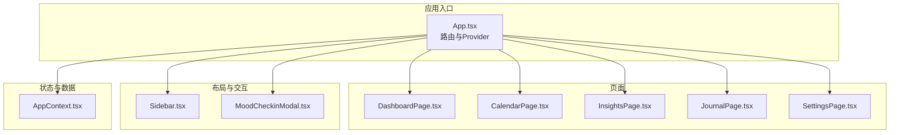
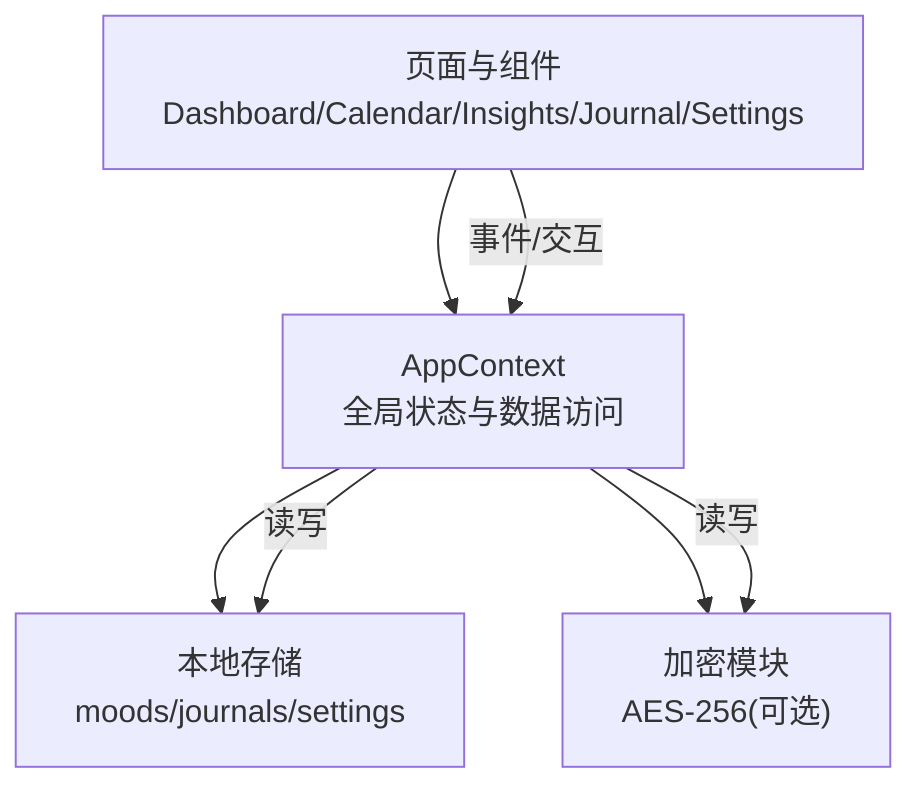
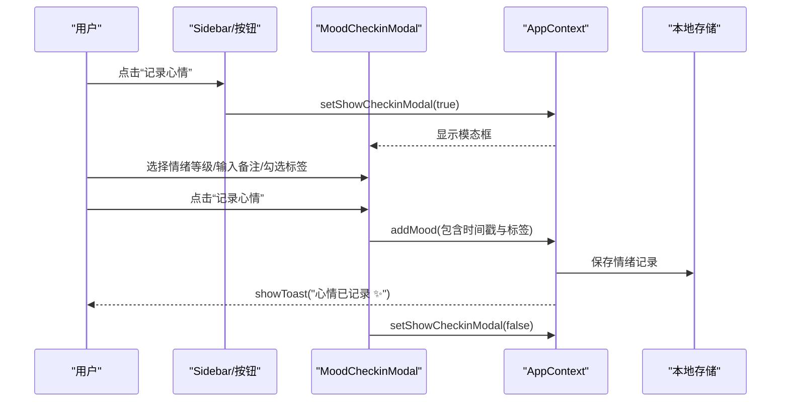
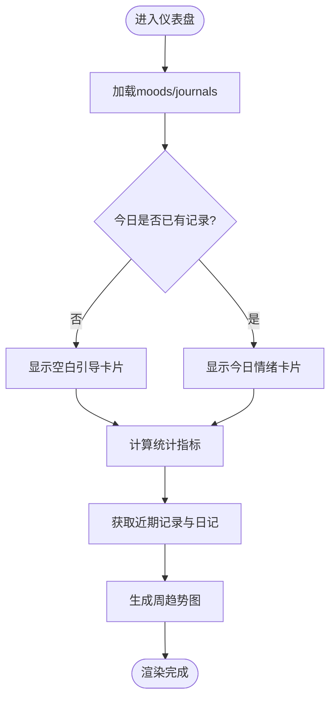
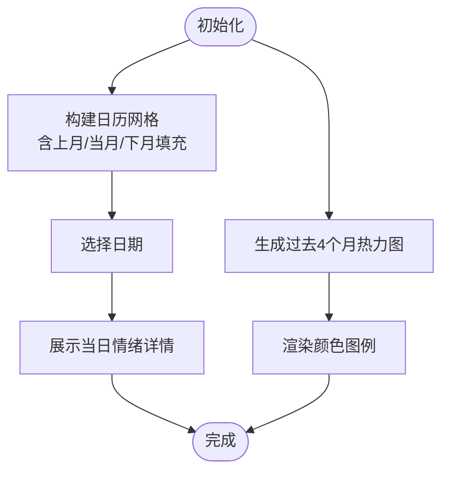
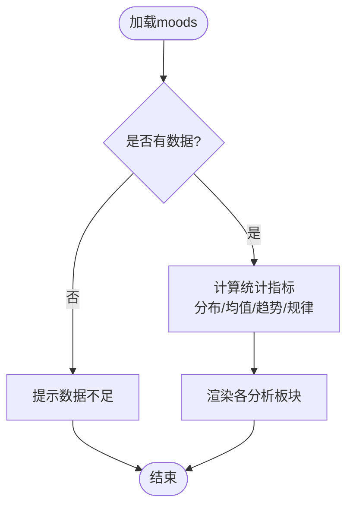
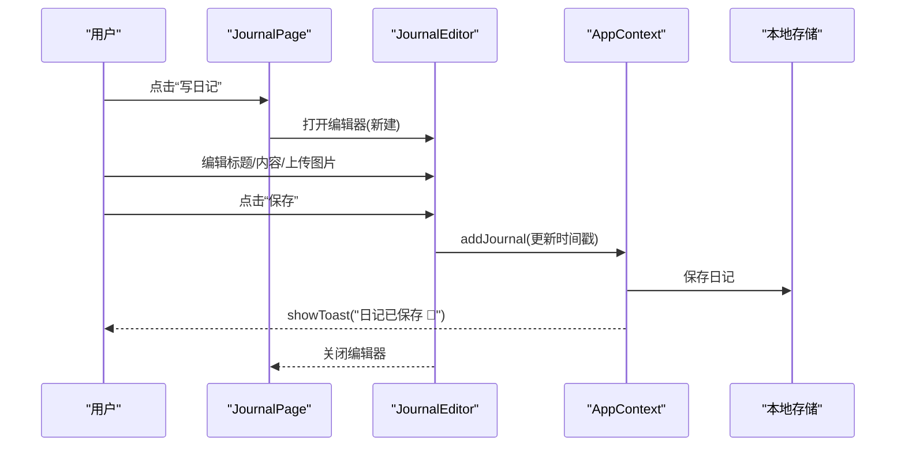
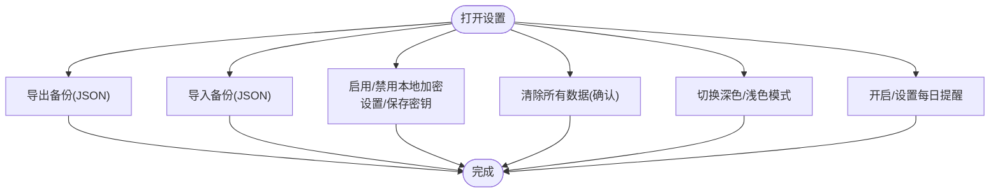
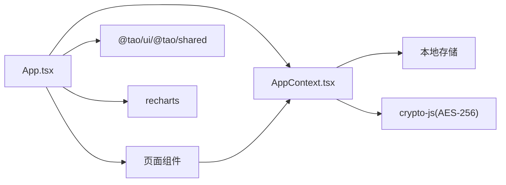

# 情绪追踪器

<cite>
**本文档引用的文件**
- [apps/moodflow/src/App.tsx](file://apps/moodflow/src/App.tsx)
- [apps/moodflow/package.json](file://apps/moodflow/package.json)
- [apps/moodflow/src/components/mood/MoodCheckinModal.tsx](file://apps/moodflow/src/components/mood/MoodCheckinModal.tsx)
- [apps/moodflow/src/pages/DashboardPage.tsx](file://apps/moodflow/src/pages/DashboardPage.tsx)
- [apps/moodflow/src/pages/CalendarPage.tsx](file://apps/moodflow/src/pages/CalendarPage.tsx)
- [apps/moodflow/src/pages/InsightsPage.tsx](file://apps/moodflow/src/pages/InsightsPage.tsx)
- [apps/moodflow/src/pages/JournalPage.tsx](file://apps/moodflow/src/pages/JournalPage.tsx)
- [apps/moodflow/src/pages/SettingsPage.tsx](file://apps/moodflow/src/pages/SettingsPage.tsx)
- [apps/moodflow/src/components/layout/Sidebar.tsx](file://apps/moodflow/src/components/layout/Sidebar.tsx)
- [apps/moodflow/src/contexts/AppContext.tsx](file://apps/moodflow/src/contexts/AppContext.tsx)
</cite>

## 目录
1. [简介](#简介)
2. [项目结构](#项目结构)
3. [核心组件](#核心组件)
4. [架构总览](#架构总览)
5. [详细组件分析](#详细组件分析)
6. [依赖关系分析](#依赖关系分析)
7. [性能考虑](#性能考虑)
8. [故障排除指南](#故障排除指南)
9. [结论](#结论)
10. [附录](#附录)

## 简介
本项目是情绪追踪器（MoodFlow），旨在帮助用户记录日常情绪、管理日记、查看情绪日历并进行洞察分析。应用采用 React + TypeScript 构建，使用 TailwindCSS 进行样式设计，并通过本地存储实现数据持久化与隐私保护。核心功能包括：
- 情绪记录：通过“情绪签入”模态框快速记录当日情绪、备注与触发因素标签
- 日记管理：支持富文本编辑、图片附件、标题与内容管理
- 情绪日历：月度日历视图与热力图，可视化情绪分布与趋势
- 洞察分析：情绪分布、周趋势、触发因素分析与最佳/最差日期统计
- 应用设置：外观切换、提醒设置、数据导出/导入与本地加密

## 项目结构
MoodFlow 应用位于 `apps/moodflow` 目录下，采用按页面与功能分层的组织方式：
- 根入口与路由：App.tsx 定义路由与全局 Provider
- 页面组件：DashboardPage、CalendarPage、InsightsPage、JournalPage、SettingsPage
- 布局组件：Sidebar、MobileNav 提供导航与移动端适配
- 情绪模态框：MoodCheckinModal 实现情绪签入流程
- 上下文：AppContext 提供全局状态与数据访问
- 依赖：package.json 中声明 React、React Router、UI 组件库与图表库等

**图表来源**
- [apps/moodflow/src/App.tsx:1-43](file://apps/moodflow/src/App.tsx#L1-L43)
- [apps/moodflow/src/pages/DashboardPage.tsx:1-317](file://apps/moodflow/src/pages/DashboardPage.tsx#L1-L317)
- [apps/moodflow/src/pages/CalendarPage.tsx:1-253](file://apps/moodflow/src/pages/CalendarPage.tsx#L1-L253)
- [apps/moodflow/src/pages/InsightsPage.tsx:1-387](file://apps/moodflow/src/pages/InsightsPage.tsx#L1-L387)
- [apps/moodflow/src/pages/JournalPage.tsx:1-291](file://apps/moodflow/src/pages/JournalPage.tsx#L1-L291)
- [apps/moodflow/src/pages/SettingsPage.tsx:1-282](file://apps/moodflow/src/pages/SettingsPage.tsx#L1-L282)
- [apps/moodflow/src/components/layout/Sidebar.tsx:1-119](file://apps/moodflow/src/components/layout/Sidebar.tsx#L1-L119)
- [apps/moodflow/src/components/mood/MoodCheckinModal.tsx:1-144](file://apps/moodflow/src/components/mood/MoodCheckinModal.tsx#L1-L144)
- [apps/moodflow/src/contexts/AppContext.tsx:1-99](file://apps/moodflow/src/contexts/AppContext.tsx#L1-L99)

**章节来源**
- [apps/moodflow/src/App.tsx:1-43](file://apps/moodflow/src/App.tsx#L1-L43)
- [apps/moodflow/package.json:1-35](file://apps/moodflow/package.json#L1-L35)

## 核心组件
- 应用入口与路由：定义页面路由与全局 Provider，挂载侧边栏、移动端导航、情绪签入模态框与全局提示
- 全局上下文：集中管理情绪记录、日记、设置与 UI 状态，提供增删改查与提示能力
- 情绪签入模态框：提供情绪等级选择、备注输入与标签多选，提交后写入本地存储并显示成功提示
- 仪表盘：展示今日情绪、连续天数、本周均值、近期记录与周趋势图
- 日历视图：月度网格与热力图，支持选择日期查看当日情绪详情
- 洞察分析：情绪分布、周趋势、一周规律、积极/需关注因素、常见标签
- 日记管理：列表与编辑器，支持富文本、图片附件与保存/删除
- 设置页：外观、提醒、数据导出/导入、本地加密与数据清理

**章节来源**
- [apps/moodflow/src/contexts/AppContext.tsx:1-99](file://apps/moodflow/src/contexts/AppContext.tsx#L1-L99)
- [apps/moodflow/src/components/mood/MoodCheckinModal.tsx:1-144](file://apps/moodflow/src/components/mood/MoodCheckinModal.tsx#L1-L144)
- [apps/moodflow/src/pages/DashboardPage.tsx:1-317](file://apps/moodflow/src/pages/DashboardPage.tsx#L1-L317)
- [apps/moodflow/src/pages/CalendarPage.tsx:1-253](file://apps/moodflow/src/pages/CalendarPage.tsx#L1-L253)
- [apps/moodflow/src/pages/InsightsPage.tsx:1-387](file://apps/moodflow/src/pages/InsightsPage.tsx#L1-L387)
- [apps/moodflow/src/pages/JournalPage.tsx:1-291](file://apps/moodflow/src/pages/JournalPage.tsx#L1-L291)
- [apps/moodflow/src/pages/SettingsPage.tsx:1-282](file://apps/moodflow/src/pages/SettingsPage.tsx#L1-L282)

## 架构总览
MoodFlow 采用前端单页应用架构，基于 React 函数组件与 Hooks，配合自定义上下文实现状态共享。数据持久化使用浏览器本地存储，支持导出/导入与可选本地加密。

**图表来源**
- [apps/moodflow/src/contexts/AppContext.tsx:1-99](file://apps/moodflow/src/contexts/AppContext.tsx#L1-L99)
- [apps/moodflow/src/pages/SettingsPage.tsx:1-282](file://apps/moodflow/src/pages/SettingsPage.tsx#L1-L282)

## 详细组件分析

### 情绪签入模态框（MoodCheckinModal）
该组件负责用户快速记录当日情绪，包含情绪等级选择、备注与标签选择，并在提交后写入本地存储与显示提示。

**图表来源**
- [apps/moodflow/src/components/mood/MoodCheckinModal.tsx:1-144](file://apps/moodflow/src/components/mood/MoodCheckinModal.tsx#L1-L144)
- [apps/moodflow/src/contexts/AppContext.tsx:1-99](file://apps/moodflow/src/contexts/AppContext.tsx#L1-L99)
- [apps/moodflow/src/components/layout/Sidebar.tsx:1-119](file://apps/moodflow/src/components/layout/Sidebar.tsx#L1-L119)

**章节来源**
- [apps/moodflow/src/components/mood/MoodCheckinModal.tsx:1-144](file://apps/moodflow/src/components/mood/MoodCheckinModal.tsx#L1-L144)
- [apps/moodflow/src/components/layout/Sidebar.tsx:1-119](file://apps/moodflow/src/components/layout/Sidebar.tsx#L1-L119)

### 仪表盘（DashboardPage）
仪表盘展示今日情绪卡片、统计指标（连续天数、本周均值、日记与记录总数）、近期记录与周趋势图，并提供跳转到日历与日记的功能入口。

**图表来源**
- [apps/moodflow/src/pages/DashboardPage.tsx:1-317](file://apps/moodflow/src/pages/DashboardPage.tsx#L1-L317)

**章节来源**
- [apps/moodflow/src/pages/DashboardPage.tsx:1-317](file://apps/moodflow/src/pages/DashboardPage.tsx#L1-L317)

### 日历视图（CalendarPage）
日历视图提供月度网格与热力图，支持选择日期查看当日情绪详情；热力图展示过去四个月的情绪密度。

**图表来源**
- [apps/moodflow/src/pages/CalendarPage.tsx:1-253](file://apps/moodflow/src/pages/CalendarPage.tsx#L1-L253)

**章节来源**
- [apps/moodflow/src/pages/CalendarPage.tsx:1-253](file://apps/moodflow/src/pages/CalendarPage.tsx#L1-L253)

### 洞察分析（InsightsPage）
洞察页对情绪数据进行统计分析，包括情绪分布、周趋势、一周规律、积极/需关注因素、常见标签等。

**图表来源**
- [apps/moodflow/src/pages/InsightsPage.tsx:1-387](file://apps/moodflow/src/pages/InsightsPage.tsx#L1-L387)

**章节来源**
- [apps/moodflow/src/pages/InsightsPage.tsx:1-387](file://apps/moodflow/src/pages/InsightsPage.tsx#L1-L387)

### 日记管理（JournalPage）
日记页提供列表与编辑器，支持富文本编辑、图片上传与保存/删除；编辑器内置格式化工具与图片附件管理。

**图表来源**
- [apps/moodflow/src/pages/JournalPage.tsx:1-291](file://apps/moodflow/src/pages/JournalPage.tsx#L1-L291)
- [apps/moodflow/src/contexts/AppContext.tsx:1-99](file://apps/moodflow/src/contexts/AppContext.tsx#L1-L99)

**章节来源**
- [apps/moodflow/src/pages/JournalPage.tsx:1-291](file://apps/moodflow/src/pages/JournalPage.tsx#L1-L291)

### 设置页（SettingsPage）
设置页提供外观切换、提醒配置、数据导出/导入、本地加密开关与密钥管理、以及一键清除所有数据的安全选项。

**图表来源**
- [apps/moodflow/src/pages/SettingsPage.tsx:1-282](file://apps/moodflow/src/pages/SettingsPage.tsx#L1-L282)

**章节来源**
- [apps/moodflow/src/pages/SettingsPage.tsx:1-282](file://apps/moodflow/src/pages/SettingsPage.tsx#L1-L282)

## 依赖关系分析
- 应用依赖 React 与 React Router 实现页面路由与组件化
- 使用 @tao/ui 与 @tao/shared 提供统一 UI 组件与工具函数
- 图表与可视化使用 recharts
- 加密使用 crypto-js（AES-256）
- TailwindCSS 与动画扩展提供样式与过渡效果

**图表来源**
- [apps/moodflow/package.json:12-22](file://apps/moodflow/package.json#L12-L22)
- [apps/moodflow/src/App.tsx:1-43](file://apps/moodflow/src/App.tsx#L1-L43)

**章节来源**
- [apps/moodflow/package.json:1-35](file://apps/moodflow/package.json#L1-L35)

## 性能考虑
- 列表渲染优化：使用 useMemo 缓存日历网格与洞察统计，避免重复计算
- 图表渲染：周趋势与热力图采用固定高度与百分比高度，减少重排
- 本地存储：仅在必要时刷新状态，避免频繁写入
- 图片处理：编辑器图片采用本地预览，上传后以 Base64 存储，注意大文件体积控制

[本节为通用指导，不直接分析具体文件]

## 故障排除指南
- 模态框无法关闭或重复弹出
  - 检查 AppContext 的 showCheckinModal 状态与 setShowCheckinModal 调用链
  - 确认模态框点击外部区域的关闭逻辑
- 情绪记录未保存
  - 确认 addMood 已调用且包含时间戳与标签字段
  - 检查本地存储写入是否成功
- 日历无数据或热力图异常
  - 校验 moods 数据结构与日期格式
  - 确认日历网格构建逻辑（上月/当月/下月填充）
- 洞察分析空白
  - 确认至少存在一条情绪记录
  - 检查统计计算逻辑（分布、均值、趋势）
- 设置页导出/导入失败
  - 确认备份文件格式为 JSON
  - 检查导入回调与本地存储恢复流程
- 本地加密无效
  - 确认已设置加密密钥并启用加密
  - 检查数据读写是否经过加密/解密流程

**章节来源**
- [apps/moodflow/src/contexts/AppContext.tsx:1-99](file://apps/moodflow/src/contexts/AppContext.tsx#L1-L99)
- [apps/moodflow/src/components/mood/MoodCheckinModal.tsx:1-144](file://apps/moodflow/src/components/mood/MoodCheckinModal.tsx#L1-L144)
- [apps/moodflow/src/pages/CalendarPage.tsx:1-253](file://apps/moodflow/src/pages/CalendarPage.tsx#L1-L253)
- [apps/moodflow/src/pages/InsightsPage.tsx:1-387](file://apps/moodflow/src/pages/InsightsPage.tsx#L1-L387)
- [apps/moodflow/src/pages/SettingsPage.tsx:1-282](file://apps/moodflow/src/pages/SettingsPage.tsx#L1-L282)

## 结论
MoodFlow 通过简洁直观的界面与完善的数据分析能力，帮助用户建立稳定的情绪记录习惯，理解自身情绪模式，并通过洞察分析与个性化设置持续优化心理健康管理体验。其基于本地存储的设计确保了数据隐私与离线可用性，同时提供导出/导入与可选加密增强了数据安全与可移植性。

[本节为总结性内容，不直接分析具体文件]

## 附录

### 用户界面设计要点
- 情绪签入模态框：清晰的情绪等级图标与标签选择，简洁的备注输入
- 仪表盘：卡片式统计与周趋势图，突出今日情绪与最近活动
- 日历：月度网格与热力图，直观展示情绪密度与趋势
- 日记：富文本编辑器与图片附件，支持格式化与图片管理
- 设置：分组清晰的选项面板，便于快速调整外观、提醒与数据安全

[本节为概念性内容，不直接分析具体文件]

### 情感表达工具与个性化设置
- 情绪等级：5 级情感量表，对应不同表情与颜色
- 触发因素标签：多选标签用于归因分析
- 个性化设置：深色/浅色主题、每日提醒、本地加密与密钥管理、数据导出/导入

[本节为概念性内容，不直接分析具体文件]

### 数据存储策略与隐私保护
- 本地存储：所有数据保存在浏览器本地，不上传至服务器
- 可选本地加密：启用 AES-256 加密，密钥由用户管理
- 数据迁移：支持导出/导入 JSON 备份，便于跨设备或重装后恢复
- 安全清理：提供一键清除所有数据选项，保障隐私

[本节为概念性内容，不直接分析具体文件]