# 成长追踪器

<cite>
**本文引用的文件**
- [apps/growth-tracker/src/App.tsx](file://apps/growth-tracker/src/App.tsx)
- [apps/growth-tracker/src/context/AppContext.tsx](file://apps/growth-tracker/src/context/AppContext.tsx)
- [apps/growth-tracker/src/types/index.ts](file://apps/growth-tracker/src/types/index.ts)
- [apps/growth-tracker/src/pages/DashboardPage.tsx](file://apps/growth-tracker/src/pages/DashboardPage.tsx)
- [apps/growth-tracker/src/pages/SkillsPage.tsx](file://apps/growth-tracker/src/pages/SkillsPage.tsx)
- [apps/growth-tracker/src/pages/GoalsPage.tsx](file://apps/growth-tracker/src/pages/GoalsPage.tsx)
- [apps/growth-tracker/src/pages/AchievementsPage.tsx](file://apps/growth-tracker/src/pages/AchievementsPage.tsx)
- [apps/growth-tracker/src/pages/AnalyticsPage.tsx](file://apps/growth-tracker/src/pages/AnalyticsPage.tsx)
- [apps/growth-tracker/src/pages/ReportPage.tsx](file://apps/growth-tracker/src/pages/ReportPage.tsx)
- [apps/growth-tracker/src/pages/SettingsPage.tsx](file://apps/growth-tracker/src/pages/SettingsPage.tsx)
- [apps/growth-tracker/src/components/ui/progress-bar.tsx](file://apps/growth-tracker/src/components/ui/progress-bar.tsx)
- [apps/growth-tracker/src/components/ui/circular-progress.tsx](file://apps/growth-tracker/src/components/ui/circular-progress.tsx)
- [apps/growth-tracker/src/components/ui/modal.tsx](file://apps/growth-tracker/src/components/ui/modal.tsx)
- [apps/growth-tracker/package.json](file://apps/growth-tracker/package.json)
</cite>

## 目录
1. [简介](#简介)
2. [项目结构](#项目结构)
3. [核心组件](#核心组件)
4. [架构总览](#架构总览)
5. [详细组件分析](#详细组件分析)
6. [依赖关系分析](#依赖关系分析)
7. [性能与可扩展性](#性能与可扩展性)
8. [故障排查指南](#故障排查指南)
9. [结论](#结论)
10. [附录](#附录)

## 简介
成长追踪器是一个帮助用户系统化追踪个人技能发展、目标达成与成就获得的前端应用。它通过仪表板概览、技能管理、目标设定、成就记录、数据分析与年度报告等功能模块，结合直观的可视化图表与交互式 UI，帮助用户建立可持续的成长闭环。应用采用 React + Vite 构建，使用 Recharts 进行数据可视化，TailwindCSS 实现响应式布局，并通过本地存储持久化用户数据。

## 项目结构
应用采用按页面与功能模块划分的组织方式，核心入口负责路由与全局上下文注入，页面组件负责具体业务视图，UI 组件提供通用控件，类型定义统一约束数据结构。

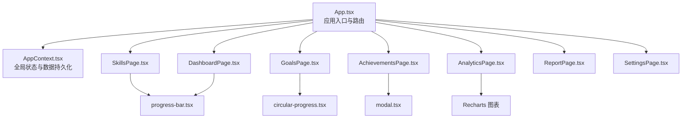

**图表来源**
- [apps/growth-tracker/src/App.tsx:1-37](file://apps/growth-tracker/src/App.tsx#L1-L37)
- [apps/growth-tracker/src/context/AppContext.tsx:1-163](file://apps/growth-tracker/src/context/AppContext.tsx#L1-L163)
- [apps/growth-tracker/src/pages/DashboardPage.tsx:1-265](file://apps/growth-tracker/src/pages/DashboardPage.tsx#L1-L265)
- [apps/growth-tracker/src/pages/SkillsPage.tsx:1-241](file://apps/growth-tracker/src/pages/SkillsPage.tsx#L1-L241)
- [apps/growth-tracker/src/pages/GoalsPage.tsx:1-262](file://apps/growth-tracker/src/pages/GoalsPage.tsx#L1-L262)
- [apps/growth-tracker/src/pages/AchievementsPage.tsx:1-226](file://apps/growth-tracker/src/pages/AchievementsPage.tsx#L1-L226)
- [apps/growth-tracker/src/pages/AnalyticsPage.tsx:1-235](file://apps/growth-tracker/src/pages/AnalyticsPage.tsx#L1-L235)
- [apps/growth-tracker/src/pages/ReportPage.tsx:1-256](file://apps/growth-tracker/src/pages/ReportPage.tsx#L1-L256)
- [apps/growth-tracker/src/pages/SettingsPage.tsx:1-211](file://apps/growth-tracker/src/pages/SettingsPage.tsx#L1-L211)
- [apps/growth-tracker/src/components/ui/progress-bar.tsx:1-47](file://apps/growth-tracker/src/components/ui/progress-bar.tsx#L1-L47)
- [apps/growth-tracker/src/components/ui/circular-progress.tsx:1-54](file://apps/growth-tracker/src/components/ui/circular-progress.tsx#L1-L54)
- [apps/growth-tracker/src/components/ui/modal.tsx:1-63](file://apps/growth-tracker/src/components/ui/modal.tsx#L1-L63)

**章节来源**
- [apps/growth-tracker/src/App.tsx:1-37](file://apps/growth-tracker/src/App.tsx#L1-L37)
- [apps/growth-tracker/package.json:1-33](file://apps/growth-tracker/package.json#L1-L33)

## 核心组件
- 应用入口与路由：集中定义页面路由与侧边栏导航，提供全局上下文注入与通知组件。
- 全局上下文 AppContext：封装 CRUD 操作与数据持久化，自动处理逾期目标状态变更。
- 页面组件：仪表板、技能管理、目标管理、成就记录、数据分析、年度报告、设置。
- UI 组件：进度条、环形进度、模态框等通用控件。
- 类型定义：统一约束技能、目标、成就、设置与整体数据结构。

**章节来源**
- [apps/growth-tracker/src/App.tsx:1-37](file://apps/growth-tracker/src/App.tsx#L1-L37)
- [apps/growth-tracker/src/context/AppContext.tsx:1-163](file://apps/growth-tracker/src/context/AppContext.tsx#L1-L163)
- [apps/growth-tracker/src/types/index.ts:1-44](file://apps/growth-tracker/src/types/index.ts#L1-L44)

## 架构总览
应用采用“页面组件 + 上下文 + UI 组件”的分层架构。页面组件通过上下文暴露的方法读写数据；UI 组件提供可复用的视觉与交互能力；类型定义确保数据一致性；路由负责页面切换与导航。

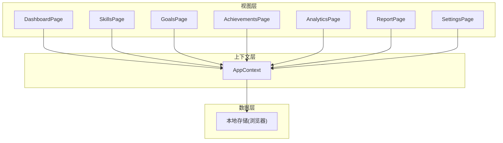

**图表来源**
- [apps/growth-tracker/src/context/AppContext.tsx:27-156](file://apps/growth-tracker/src/context/AppContext.tsx#L27-L156)
- [apps/growth-tracker/src/App.tsx:13-34](file://apps/growth-tracker/src/App.tsx#L13-L34)

## 详细组件分析

### 仪表板（DashboardPage）
- 功能要点
  - 展示关键指标卡片：技能总数、进行中目标、成就总数、连续打卡。
  - 技能概览：按等级排序的前 N 技能，配合进度条与颜色分级。
  - 即将到期目标：按截止日期排序的前若干目标，显示剩余天数与进度。
  - 近期成就：按时间倒序的最近若干成就，带分类图标。
  - 快速摘要：完成目标数、平均技能水平、累计成就数。
- 可视化与交互
  - 使用进度条组件展示技能等级。
  - 使用卡片与网格布局实现响应式展示。
  - 基于动画类实现逐项入场效果。

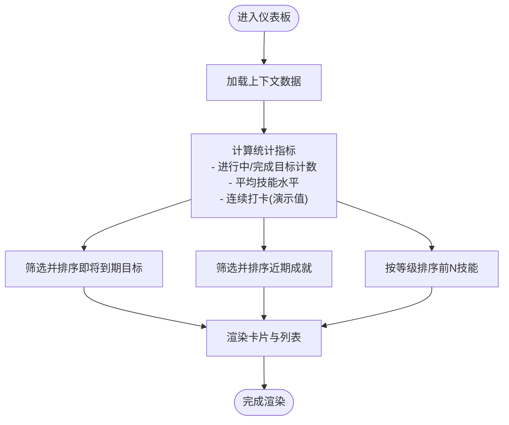

**图表来源**
- [apps/growth-tracker/src/pages/DashboardPage.tsx:22-264](file://apps/growth-tracker/src/pages/DashboardPage.tsx#L22-L264)

**章节来源**
- [apps/growth-tracker/src/pages/DashboardPage.tsx:1-265](file://apps/growth-tracker/src/pages/DashboardPage.tsx#L1-L265)

### 技能管理（SkillsPage）
- 功能要点
  - 技能增删改：支持添加新技能、编辑等级、删除技能。
  - 分类筛选：按技能分类过滤展示。
  - 历史趋势：以迷你柱状图展示近期等级变化。
  - 等级更新：每日等级变更记录，避免重复提交同一天的记录。
- 交互细节
  - 添加/编辑弹窗使用通用模态框组件。
  - 等级滑块范围 0-100，实时预览数值。
  - 成功/错误提示使用通知组件。

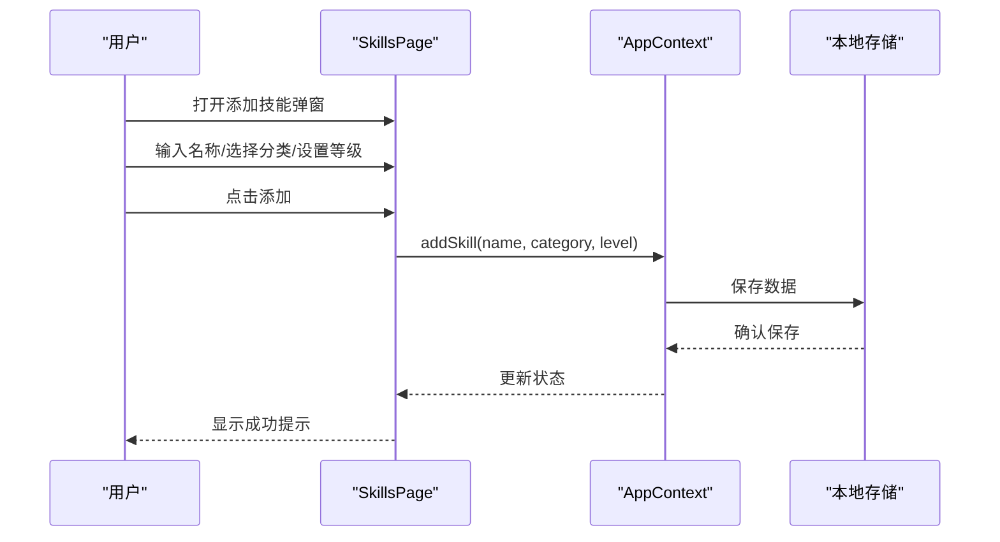

**图表来源**
- [apps/growth-tracker/src/pages/SkillsPage.tsx:25-35](file://apps/growth-tracker/src/pages/SkillsPage.tsx#L25-L35)
- [apps/growth-tracker/src/context/AppContext.tsx:49-54](file://apps/growth-tracker/src/context/AppContext.tsx#L49-L54)

**章节来源**
- [apps/growth-tracker/src/pages/SkillsPage.tsx:1-241](file://apps/growth-tracker/src/pages/SkillsPage.tsx#L1-L241)
- [apps/growth-tracker/src/components/ui/progress-bar.tsx:1-47](file://apps/growth-tracker/src/components/ui/progress-bar.tsx#L1-L47)
- [apps/growth-tracker/src/components/ui/modal.tsx:1-63](file://apps/growth-tracker/src/components/ui/modal.tsx#L1-L63)

### 目标管理（GoalsPage）
- 功能要点
  - 目标增删改：创建目标、更新进度、标记完成、删除目标。
  - 状态筛选：按“全部/进行中/已完成/已逾期”筛选。
  - 进度可视化：使用环形进度组件展示百分比。
  - 逾期检测：启动时检查并自动更新逾期目标状态。
- 交互细节
  - 进度滑块范围 0-100，实时预览百分比。
  - 完成按钮在进度达到阈值时自动置为完成状态。
  - 临近截止日期高亮提醒。

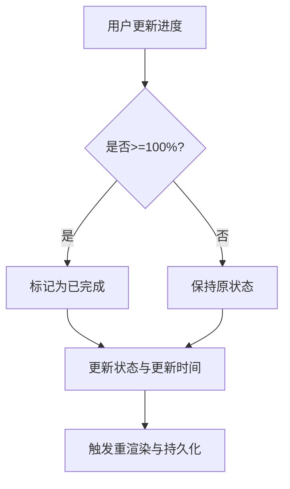

**图表来源**
- [apps/growth-tracker/src/pages/GoalsPage.tsx:40-49](file://apps/growth-tracker/src/pages/GoalsPage.tsx#L40-L49)
- [apps/growth-tracker/src/context/AppContext.tsx:84-98](file://apps/growth-tracker/src/context/AppContext.tsx#L84-L98)

**章节来源**
- [apps/growth-tracker/src/pages/GoalsPage.tsx:1-262](file://apps/growth-tracker/src/pages/GoalsPage.tsx#L1-L262)
- [apps/growth-tracker/src/components/ui/circular-progress.tsx:1-54](file://apps/growth-tracker/src/components/ui/circular-progress.tsx#L1-L54)

### 成就记录（AchievementsPage）
- 功能要点
  - 成就增删：记录新成就、删除成就。
  - 分类筛选：按学习/项目/个人/职业分类过滤。
  - 时间线展示：按月份分组的时间轴样式。
  - 分类配色：不同类别使用不同颜色与图标。
- 交互细节
  - 弹窗内支持选择分类与日期。
  - 删除按钮悬停可见，避免误操作。

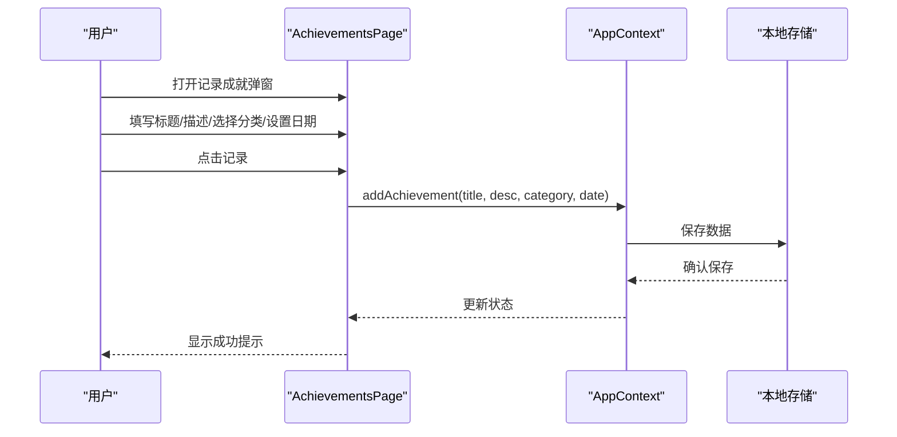

**图表来源**
- [apps/growth-tracker/src/pages/AchievementsPage.tsx:43-49](file://apps/growth-tracker/src/pages/AchievementsPage.tsx#L43-L49)
- [apps/growth-tracker/src/context/AppContext.tsx:115-123](file://apps/growth-tracker/src/context/AppContext.tsx#L115-L123)

**章节来源**
- [apps/growth-tracker/src/pages/AchievementsPage.tsx:1-226](file://apps/growth-tracker/src/pages/AchievementsPage.tsx#L1-L226)

### 数据分析（AnalyticsPage）
- 功能要点
  - 技能成长趋势：合并所有技能历史，按日期生成折线图。
  - 目标完成率：饼图展示完成/进行中/逾期比例。
  - 成就分类分布：柱状图展示各分类成就数量。
  - 月度活跃度：按月统计成就数量。
- 可视化
  - 使用 Recharts 的线图、饼图、柱状图与响应式容器。
  - 自定义主题色与工具提示样式。

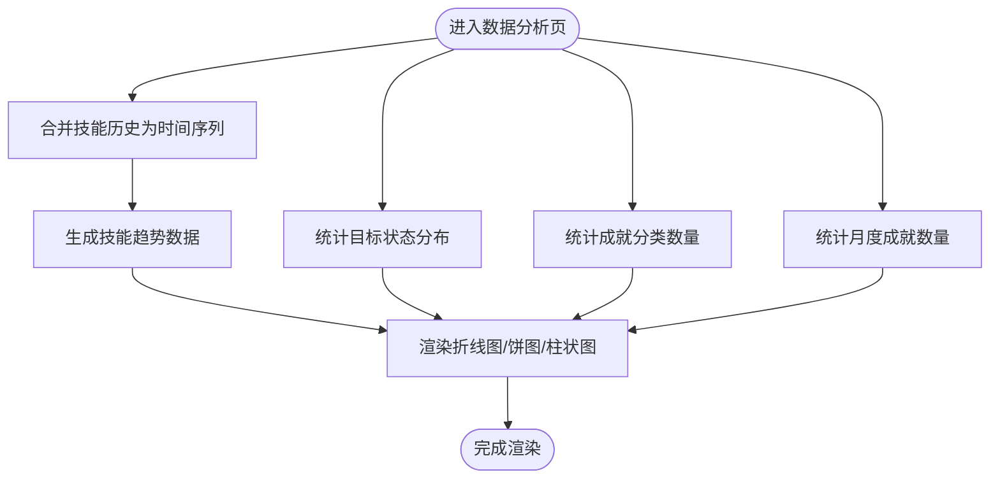

**图表来源**
- [apps/growth-tracker/src/pages/AnalyticsPage.tsx:21-62](file://apps/growth-tracker/src/pages/AnalyticsPage.tsx#L21-L62)

**章节来源**
- [apps/growth-tracker/src/pages/AnalyticsPage.tsx:1-235](file://apps/growth-tracker/src/pages/AnalyticsPage.tsx#L1-L235)

### 年度报告（ReportPage）
- 功能要点
  - 年度概览：技能总数、目标总数/完成数、年度成就数。
  - 已完成目标：列出本年度完成的目标。
  - 年度成就：按分类分组展示本年度成就。
  - 技能成长对比：计算本年度起止等级差值并排序。
  - 报告导出：生成 Markdown 文本并下载为 .md 文件。
- 交互细节
  - 导出按钮触发文本生成与下载流程。
  - 使用卡片与列表组合呈现结构化内容。

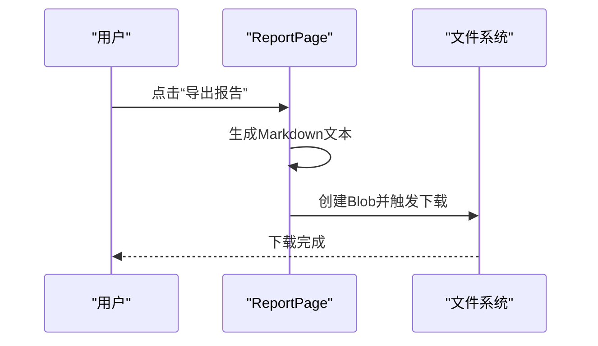

**图表来源**
- [apps/growth-tracker/src/pages/ReportPage.tsx:48-94](file://apps/growth-tracker/src/pages/ReportPage.tsx#L48-L94)

**章节来源**
- [apps/growth-tracker/src/pages/ReportPage.tsx:1-256](file://apps/growth-tracker/src/pages/ReportPage.tsx#L1-L256)

### 设置（SettingsPage）
- 功能要点
  - 个人资料：修改显示名称与个人简介并保存。
  - 隐私控制：切换私密/公开模式，影响数据可见性。
  - 数据管理：导出为 JSON 备份，从 JSON 恢复数据。
  - 存储信息：显示各类数据条目数量。
- 交互细节
  - 导入使用隐藏文件输入，读取后校验并替换数据。
  - 成功/失败提示明确反馈。

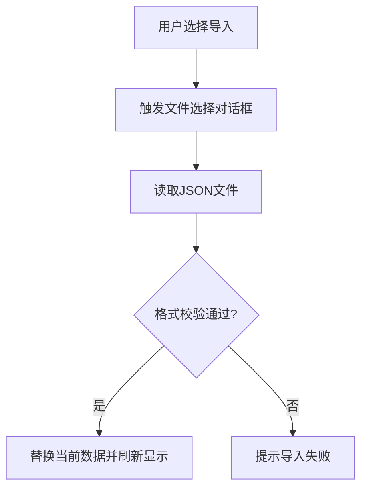

**图表来源**
- [apps/growth-tracker/src/pages/SettingsPage.tsx:40-63](file://apps/growth-tracker/src/pages/SettingsPage.tsx#L40-L63)

**章节来源**
- [apps/growth-tracker/src/pages/SettingsPage.tsx:1-211](file://apps/growth-tracker/src/pages/SettingsPage.tsx#L1-L211)

## 依赖关系分析
- 运行时依赖
  - @tao/shared、@tao/ui：共享组件与样式库。
  - react、react-router-dom：前端框架与路由。
  - lucide-react：图标库。
  - recharts：数据可视化。
  - sonner：通知组件。
- 开发依赖
  - TypeScript、Vite、TailwindCSS、PostCSS 等构建与样式工具链。

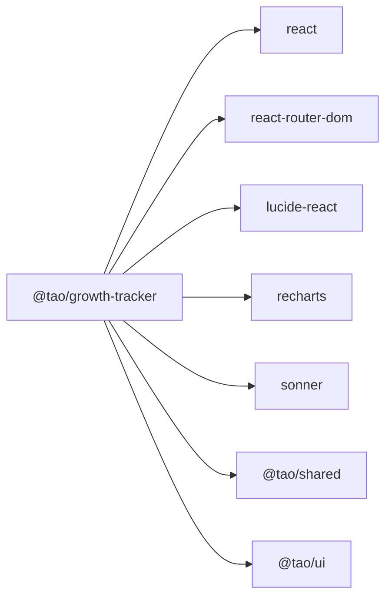

**图表来源**
- [apps/growth-tracker/package.json:12-22](file://apps/growth-tracker/package.json#L12-L22)

**章节来源**
- [apps/growth-tracker/package.json:1-33](file://apps/growth-tracker/package.json#L1-L33)

## 性能与可扩展性
- 性能优化建议
  - 列表渲染：页面组件已使用基础动画延迟，可进一步对大数据量列表启用虚拟滚动。
  - 图表渲染：Recharts 在大数据时可考虑分页或抽样渲染。
  - 状态更新：上下文中的回调函数已使用 useCallback 包裹，避免不必要的重渲染。
  - 本地存储：数据持久化在每次状态变更时触发，建议在高频更新场景下引入节流/防抖。
- 可扩展性建议
  - 数据模型：类型定义清晰，新增字段只需在 types 中扩展，不影响现有逻辑。
  - UI 组件：进度条、环形进度、模态框均为独立组件，便于复用与定制。
  - 路由扩展：新增页面只需在 App 路由中注册并创建对应页面组件。

[本节为通用指导，无需特定文件引用]

## 故障排查指南
- 无法保存/加载数据
  - 检查浏览器本地存储权限与容量限制。
  - 确认上下文在应用启动时正确初始化并持久化。
- 目标状态未自动更新为逾期
  - 检查上下文中逾期检测的日期比较逻辑是否执行。
- 图表不显示或空白
  - 确认数据中存在足够样本（如技能历史至少两条）。
  - 检查 Recharts 版本与依赖是否匹配。
- 导入失败
  - 确认导入文件为正确的 JSON 格式，且包含完整数据结构。
  - 查看控制台是否有解析异常。

**章节来源**
- [apps/growth-tracker/src/context/AppContext.tsx:30-47](file://apps/growth-tracker/src/context/AppContext.tsx#L30-L47)
- [apps/growth-tracker/src/pages/SettingsPage.tsx:40-63](file://apps/growth-tracker/src/pages/SettingsPage.tsx#L40-L63)
- [apps/growth-tracker/src/pages/AnalyticsPage.tsx:21-33](file://apps/growth-tracker/src/pages/AnalyticsPage.tsx#L21-L33)

## 结论
成长追踪器通过清晰的模块划分与一致的 UI 设计，为用户提供了从“记录—追踪—分析—总结”的完整成长路径。其数据模型简洁、上下文统一、图表丰富，既满足日常使用，也为后续扩展预留了空间。建议在实际使用中结合“目标优先级”“里程碑奖励”等策略，持续迭代个人成长计划。

[本节为总结性内容，无需特定文件引用]

## 附录

### 数据模型与类型定义
- 技能（Skill）
  - 字段：id、name、category、level、history、createdAt、updatedAt
  - 约束：level 为 0-100；history 为日期到等级的映射数组
- 目标（Goal）
  - 字段：id、title、description、deadline、progress、status、createdAt、updatedAt
  - 约束：progress 为 0-100；status 为 in-progress/completed/overdue
- 成就（Achievement）
  - 字段：id、title、description、category、date、createdAt
  - 约束：category 为 learning/project/personal/career
- 设置（AppSettings）
  - 字段：privacyMode、displayName、bio
- 数据（AppData）
  - 字段：skills、goals、achievements、settings

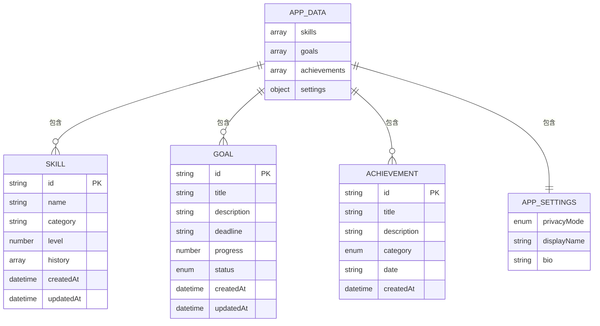

**图表来源**
- [apps/growth-tracker/src/types/index.ts:1-44](file://apps/growth-tracker/src/types/index.ts#L1-L44)

**章节来源**
- [apps/growth-tracker/src/types/index.ts:1-44](file://apps/growth-tracker/src/types/index.ts#L1-L44)

### 进度计算与可视化
- 技能等级更新
  - 每日等级变更记录会合并到 history，若当天已有记录则替换，避免重复。
  - 平均技能水平按技能数量与总等级计算。
- 目标进度与状态
  - 进度滑块限制在 0-100；达到 100% 自动置为完成。
  - 逾期检测基于 deadline 与当前日期比较。
- 可视化组件
  - 进度条：支持尺寸、颜色、标签与动画。
  - 环形进度：基于 SVG 圆弧长度计算百分比。
  - 模态框：支持 ESC 关闭、点击遮罩关闭、滚动锁定。

**章节来源**
- [apps/growth-tracker/src/context/AppContext.tsx:56-71](file://apps/growth-tracker/src/context/AppContext.tsx#L56-L71)
- [apps/growth-tracker/src/pages/DashboardPage.tsx:28-30](file://apps/growth-tracker/src/pages/DashboardPage.tsx#L28-L30)
- [apps/growth-tracker/src/pages/GoalsPage.tsx:84-98](file://apps/growth-tracker/src/pages/GoalsPage.tsx#L84-L98)
- [apps/growth-tracker/src/components/ui/progress-bar.tsx:1-47](file://apps/growth-tracker/src/components/ui/progress-bar.tsx#L1-L47)
- [apps/growth-tracker/src/components/ui/circular-progress.tsx:1-54](file://apps/growth-tracker/src/components/ui/circular-progress.tsx#L1-L54)
- [apps/growth-tracker/src/components/ui/modal.tsx:1-63](file://apps/growth-tracker/src/components/ui/modal.tsx#L1-L63)