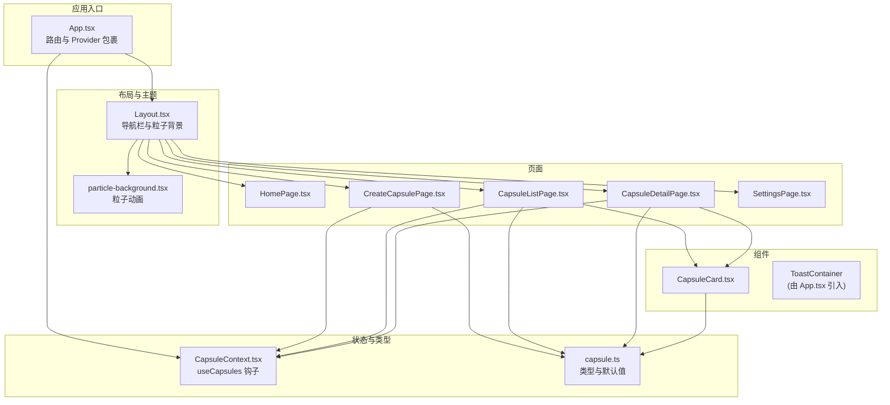
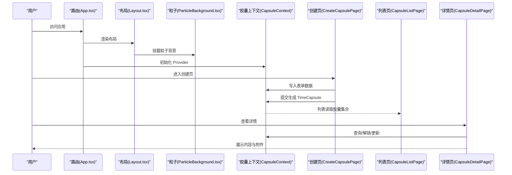
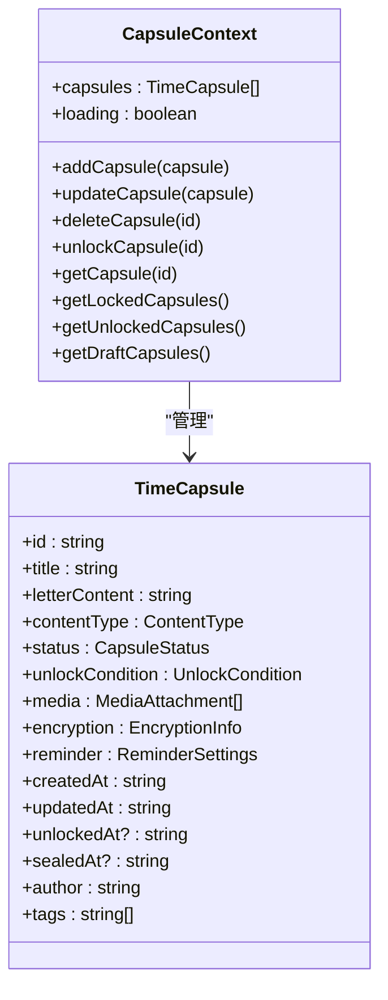
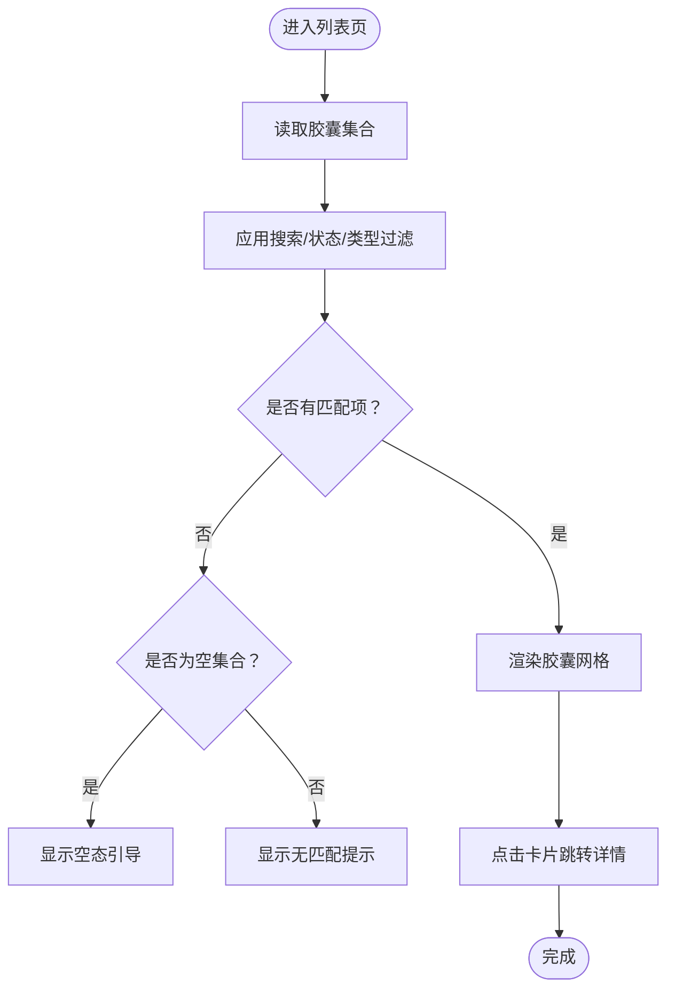
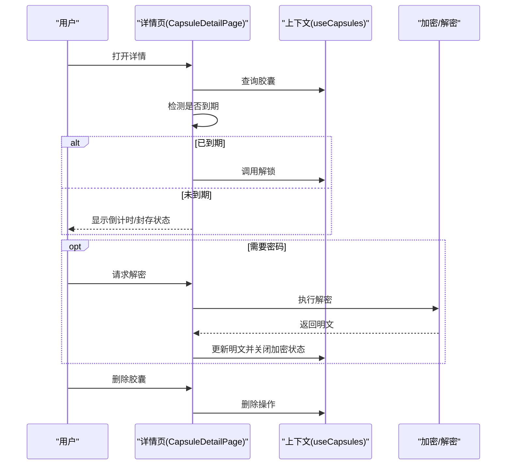
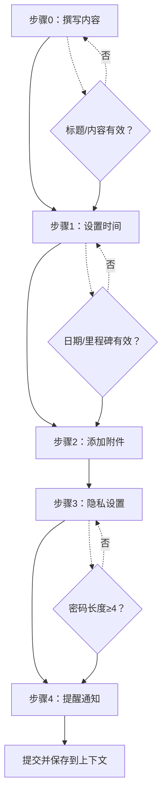
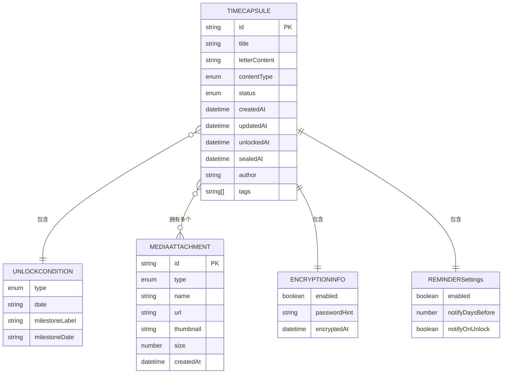
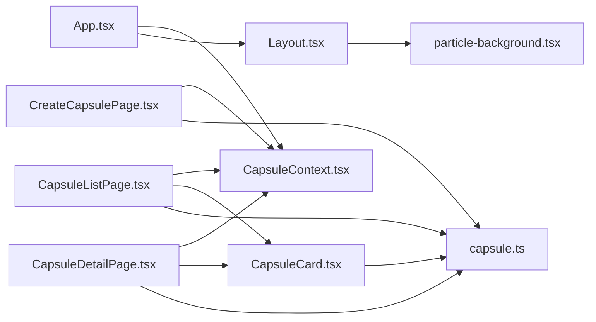

# 时光胶囊

<cite>
**本文引用的文件**
- [apps/time-capsule/src/App.tsx](file://apps/time-capsule/src/App.tsx)
- [apps/time-capsule/src/context/CapsuleContext.tsx](file://apps/time-capsule/src/context/CapsuleContext.tsx)
- [apps/time-capsule/src/types/capsule.ts](file://apps/time-capsule/src/types/capsule.ts)
- [apps/time-capsule/src/components/capsule/CapsuleCard.tsx](file://apps/time-capsule/src/components/capsule/CapsuleCard.tsx)
- [apps/time-capsule/src/pages/CapsuleListPage.tsx](file://apps/time-capsule/src/pages/CapsuleListPage.tsx)
- [apps/time-capsule/src/pages/CreateCapsulePage.tsx](file://apps/time-capsule/src/pages/CreateCapsulePage.tsx)
- [apps/time-capsule/src/pages/CapsuleDetailPage.tsx](file://apps/time-capsule/src/pages/CapsuleDetailPage.tsx)
- [apps/time-capsule/src/components/layout/Layout.tsx](file://apps/time-capsule/src/components/layout/Layout.tsx)
- [apps/time-capsule/src/components/ui/particle-background.tsx](file://apps/time-capsule/src/components/ui/particle-background.tsx)
- [apps/time-capsule/src/hooks/useToast.ts](file://apps/time-capsule/src/hooks/useToast.ts)
</cite>

## 目录
1. [简介](#简介)
2. [项目结构](#项目结构)
3. [核心组件](#核心组件)
4. [架构总览](#架构总览)
5. [详细组件分析](#详细组件分析)
6. [依赖分析](#依赖分析)
7. [性能考虑](#性能考虑)
8. [故障排除指南](#故障排除指南)
9. [结论](#结论)
10. [附录](#附录)

## 简介
时光胶囊是一个帮助用户创建、管理与回顾“数字纪念品”的应用。它支持多步骤创建胶囊（内容、时间解锁策略、附件、加密、提醒）、本地持久化存储、时间锁定与到期自动解锁、可视化进度展示、以及可选的端到端加密与解密体验。应用采用 React + TypeScript 构建，通过自定义上下文管理胶囊状态，并提供粒子背景等视觉增强。

## 项目结构
应用位于 monorepo 的 apps/time-capsule 目录下，采用按功能分层的组织方式：
- pages：页面级组件（首页、创建、列表、详情、设置）
- components：可复用 UI 组件（布局、胶囊卡片、粒子背景等）
- context：全局状态管理（胶囊上下文）
- types：类型定义（胶囊、表单、枚举等）
- hooks：自定义 Hook（如提示系统）

图表来源
- [apps/time-capsule/src/App.tsx:1-51](file://apps/time-capsule/src/App.tsx#L1-L51)
- [apps/time-capsule/src/components/layout/Layout.tsx:1-26](file://apps/time-capsule/src/components/layout/Layout.tsx#L1-L26)
- [apps/time-capsule/src/components/ui/particle-background.tsx:1-45](file://apps/time-capsule/src/components/ui/particle-background.tsx#L1-L45)
- [apps/time-capsule/src/context/CapsuleContext.tsx:1-161](file://apps/time-capsule/src/context/CapsuleContext.tsx#L1-L161)
- [apps/time-capsule/src/types/capsule.ts:1-101](file://apps/time-capsule/src/types/capsule.ts#L1-L101)
- [apps/time-capsule/src/components/capsule/CapsuleCard.tsx:1-112](file://apps/time-capsule/src/components/capsule/CapsuleCard.tsx#L1-L112)
- [apps/time-capsule/src/pages/CapsuleListPage.tsx:1-127](file://apps/time-capsule/src/pages/CapsuleListPage.tsx#L1-L127)
- [apps/time-capsule/src/pages/CreateCapsulePage.tsx:1-621](file://apps/time-capsule/src/pages/CreateCapsulePage.tsx#L1-L621)
- [apps/time-capsule/src/pages/CapsuleDetailPage.tsx:1-387](file://apps/time-capsule/src/pages/CapsuleDetailPage.tsx#L1-L387)

章节来源
- [apps/time-capsule/src/App.tsx:1-51](file://apps/time-capsule/src/App.tsx#L1-L51)
- [apps/time-capsule/src/components/layout/Layout.tsx:1-26](file://apps/time-capsule/src/components/layout/Layout.tsx#L1-L26)

## 核心组件
- 应用入口与路由：在 App.tsx 中配置路由、主题初始化、全局 Provider 包裹与提示容器挂载。
- 全局状态：CapsuleContext 提供胶囊的增删改查、加载状态、自动解锁检测与本地持久化。
- 类型系统：capsule.ts 定义胶囊实体、解锁条件、媒体附件、提醒设置、表单默认值等。
- 页面与卡片：CreateCapsulePage 实现多步骤创建；CapsuleListPage 展示与筛选；CapsuleDetailPage 展示详情与解锁；CapsuleCard 用于列表预览。
- 视觉与交互：Layout 负责整体布局与粒子背景；useToast 提供轻提示系统。

章节来源
- [apps/time-capsule/src/App.tsx:1-51](file://apps/time-capsule/src/App.tsx#L1-L51)
- [apps/time-capsule/src/context/CapsuleContext.tsx:1-161](file://apps/time-capsule/src/context/CapsuleContext.tsx#L1-L161)
- [apps/time-capsule/src/types/capsule.ts:1-101](file://apps/time-capsule/src/types/capsule.ts#L1-L101)
- [apps/time-capsule/src/components/capsule/CapsuleCard.tsx:1-112](file://apps/time-capsule/src/components/capsule/CapsuleCard.tsx#L1-L112)
- [apps/time-capsule/src/pages/CapsuleListPage.tsx:1-127](file://apps/time-capsule/src/pages/CapsuleListPage.tsx#L1-L127)
- [apps/time-capsule/src/pages/CreateCapsulePage.tsx:1-621](file://apps/time-capsule/src/pages/CreateCapsulePage.tsx#L1-L621)
- [apps/time-capsule/src/pages/CapsuleDetailPage.tsx:1-387](file://apps/time-capsule/src/pages/CapsuleDetailPage.tsx#L1-L387)
- [apps/time-capsule/src/components/layout/Layout.tsx:1-26](file://apps/time-capsule/src/components/layout/Layout.tsx#L1-L26)
- [apps/time-capsule/src/hooks/useToast.ts:1-26](file://apps/time-capsule/src/hooks/useToast.ts#L1-L26)

## 架构总览
应用采用“页面-组件-上下文-类型”分层架构：
- 页面负责业务流程与用户交互；
- 组件负责可复用 UI 与展示逻辑；
- 上下文统一管理状态与副作用（本地存储、自动解锁）；
- 类型定义确保数据结构一致性与可维护性。

图表来源
- [apps/time-capsule/src/App.tsx:1-51](file://apps/time-capsule/src/App.tsx#L1-L51)
- [apps/time-capsule/src/components/layout/Layout.tsx:1-26](file://apps/time-capsule/src/components/layout/Layout.tsx#L1-L26)
- [apps/time-capsule/src/components/ui/particle-background.tsx:1-45](file://apps/time-capsule/src/components/ui/particle-background.tsx#L1-L45)
- [apps/time-capsule/src/context/CapsuleContext.tsx:1-161](file://apps/time-capsule/src/context/CapsuleContext.tsx#L1-L161)
- [apps/time-capsule/src/pages/CreateCapsulePage.tsx:1-621](file://apps/time-capsule/src/pages/CreateCapsulePage.tsx#L1-L621)
- [apps/time-capsule/src/pages/CapsuleListPage.tsx:1-127](file://apps/time-capsule/src/pages/CapsuleListPage.tsx#L1-L127)
- [apps/time-capsule/src/pages/CapsuleDetailPage.tsx:1-387](file://apps/time-capsule/src/pages/CapsuleDetailPage.tsx#L1-L387)

## 详细组件分析

### 胶囊上下文与状态管理
- 负责加载/保存到 localStorage、自动检测解锁、提供 CRUD 与分类查询方法。
- 使用 useReducer 管理状态，保证状态变更可预测与可追踪。
- 通过 useCapsules 钩子暴露统一接口，避免跨组件重复逻辑。

图表来源
- [apps/time-capsule/src/context/CapsuleContext.tsx:1-161](file://apps/time-capsule/src/context/CapsuleContext.tsx#L1-L161)
- [apps/time-capsule/src/types/capsule.ts:45-61](file://apps/time-capsule/src/types/capsule.ts#L45-L61)

章节来源
- [apps/time-capsule/src/context/CapsuleContext.tsx:1-161](file://apps/time-capsule/src/context/CapsuleContext.tsx#L1-L161)
- [apps/time-capsule/src/types/capsule.ts:1-101](file://apps/time-capsule/src/types/capsule.ts#L1-L101)

### 胶囊卡片设计与列表展示
- CapsuleCard 呈现胶囊标题、状态徽标、内容预览、媒体数量、解锁时间与倒计时进度条。
- 列表页支持搜索、状态标签与类型过滤，空态引导创建。

图表来源
- [apps/time-capsule/src/pages/CapsuleListPage.tsx:1-127](file://apps/time-capsule/src/pages/CapsuleListPage.tsx#L1-L127)
- [apps/time-capsule/src/components/capsule/CapsuleCard.tsx:1-112](file://apps/time-capsule/src/components/capsule/CapsuleCard.tsx#L1-L112)

章节来源
- [apps/time-capsule/src/pages/CapsuleListPage.tsx:1-127](file://apps/time-capsule/src/pages/CapsuleListPage.tsx#L1-L127)
- [apps/time-capsule/src/components/capsule/CapsuleCard.tsx:1-112](file://apps/time-capsule/src/components/capsule/CapsuleCard.tsx#L1-L112)

### 详情页面与解锁流程
- 自动检测到期并解锁；支持手动解锁按钮；加密内容需输入密码解密。
- 展示内容、附件、解锁条件与提醒设置；提供删除危险操作确认。

图表来源
- [apps/time-capsule/src/pages/CapsuleDetailPage.tsx:1-387](file://apps/time-capsule/src/pages/CapsuleDetailPage.tsx#L1-L387)
- [apps/time-capsule/src/context/CapsuleContext.tsx:1-161](file://apps/time-capsule/src/context/CapsuleContext.tsx#L1-L161)

章节来源
- [apps/time-capsule/src/pages/CapsuleDetailPage.tsx:1-387](file://apps/time-capsule/src/pages/CapsuleDetailPage.tsx#L1-L387)

### 创建胶囊的多步骤流程
- 步骤包括：内容类型与标题、解锁方式（日期/里程碑）、附件上传、加密开关与密码、提醒设置与接收人。
- 表单校验与下一步可用性判断，提交时根据加密开关决定是否加密内容。

图表来源
- [apps/time-capsule/src/pages/CreateCapsulePage.tsx:1-621](file://apps/time-capsule/src/pages/CreateCapsulePage.tsx#L1-L621)

章节来源
- [apps/time-capsule/src/pages/CreateCapsulePage.tsx:1-621](file://apps/time-capsule/src/pages/CreateCapsulePage.tsx#L1-L621)

### 数据模型与类型定义
- 关键类型：CapsuleStatus、UnlockType、ContentType、MediaType、TimeCapsule、UnlockCondition、MediaAttachment、EncryptionInfo、ReminderSettings、CapsuleFormData。
- 默认表单数据 DEFAULT_FORM_DATA 提供初始值，便于表单快速填充。

图表来源
- [apps/time-capsule/src/types/capsule.ts:1-101](file://apps/time-capsule/src/types/capsule.ts#L1-L101)

章节来源
- [apps/time-capsule/src/types/capsule.ts:1-101](file://apps/time-capsule/src/types/capsule.ts#L1-L101)

### 应用上下文管理与数据持久化
- 初始化时从 localStorage 加载胶囊集合，自动检测到期并更新状态。
- 每当集合变化且非 loading 时写回 localStorage，确保离线可用与数据持久。
- 提供分类查询方法（已封存/已解锁/草稿），简化页面筛选逻辑。

章节来源
- [apps/time-capsule/src/context/CapsuleContext.tsx:75-102](file://apps/time-capsule/src/context/CapsuleContext.tsx#L75-L102)
- [apps/time-capsule/src/context/CapsuleContext.tsx:124-134](file://apps/time-capsule/src/context/CapsuleContext.tsx#L124-L134)

### 用户交互流程与提示系统
- useToast 提供轻提示，自动 4 秒移除，支持成功/错误/信息三类。
- App.tsx 中引入 ToastContainer 并注入 useToast 的状态与移除回调。

章节来源
- [apps/time-capsule/src/hooks/useToast.ts:1-26](file://apps/time-capsule/src/hooks/useToast.ts#L1-L26)
- [apps/time-capsule/src/App.tsx:9-10](file://apps/time-capsule/src/App.tsx#L9-L10)
- [apps/time-capsule/src/App.tsx:35-35](file://apps/time-capsule/src/App.tsx#L35-L35)

### 粒子背景效果与响应式设计
- particle-background.tsx 动态生成 20 个随机大小、透明度、延迟与周期的粒子，使用 CSS 动画实现漂浮效果。
- Layout.tsx 将粒子背景置于主内容之下，配合渐变背景与导航栏，营造温暖氛围。
- 页面广泛使用 Tailwind 的响应式断点（sm/lg），在小屏与大屏呈现不同网格密度与间距。

章节来源
- [apps/time-capsule/src/components/ui/particle-background.tsx:1-45](file://apps/time-capsule/src/components/ui/particle-background.tsx#L1-L45)
- [apps/time-capsule/src/components/layout/Layout.tsx:1-26](file://apps/time-capsule/src/components/layout/Layout.tsx#L1-L26)
- [apps/time-capsule/src/pages/CapsuleListPage.tsx:91-101](file://apps/time-capsule/src/pages/CapsuleListPage.tsx#L91-L101)

## 依赖分析
- 组件耦合：页面依赖上下文与类型；卡片依赖工具函数与样式；布局依赖粒子背景。
- 外部依赖：React Router（路由）、lucide-react（图标）、@tao/ui/@shared/@capsule-utils（共享 UI、工具与样式变量）。
- 可能的循环依赖：当前结构清晰，页面与组件通过上下文解耦，未见循环导入迹象。

图表来源
- [apps/time-capsule/src/App.tsx:1-51](file://apps/time-capsule/src/App.tsx#L1-L51)
- [apps/time-capsule/src/context/CapsuleContext.tsx:1-161](file://apps/time-capsule/src/context/CapsuleContext.tsx#L1-L161)
- [apps/time-capsule/src/components/layout/Layout.tsx:1-26](file://apps/time-capsule/src/components/layout/Layout.tsx#L1-L26)
- [apps/time-capsule/src/components/ui/particle-background.tsx:1-45](file://apps/time-capsule/src/components/ui/particle-background.tsx#L1-L45)
- [apps/time-capsule/src/pages/CreateCapsulePage.tsx:1-621](file://apps/time-capsule/src/pages/CreateCapsulePage.tsx#L1-L621)
- [apps/time-capsule/src/pages/CapsuleListPage.tsx:1-127](file://apps/time-capsule/src/pages/CapsuleListPage.tsx#L1-L127)
- [apps/time-capsule/src/pages/CapsuleDetailPage.tsx:1-387](file://apps/time-capsule/src/pages/CapsuleDetailPage.tsx#L1-L387)
- [apps/time-capsule/src/components/capsule/CapsuleCard.tsx:1-112](file://apps/time-capsule/src/components/capsule/CapsuleCard.tsx#L1-L112)
- [apps/time-capsule/src/types/capsule.ts:1-101](file://apps/time-capsule/src/types/capsule.ts#L1-L101)

## 性能考虑
- 列表渲染：使用 useMemo 过滤，避免每次渲染都重新计算；卡片入场动画通过延迟叠加，提升感知性能。
- 本地存储：仅在状态稳定后写入 localStorage，减少频繁 IO；初始化时批量解析与更新状态。
- 图形与动画：粒子数量固定为 20，随机参数在首次渲染时计算，后续不重新生成；CSS 动画优于 JS 动画。
- 附件处理：媒体以 Blob URL 存储，避免大对象在内存中复制；解密后替换明文，减少重复解密。

## 故障排除指南
- 胶囊未显示或丢失
  - 检查 localStorage 是否被清理；上下文会在启动时尝试恢复并自动解锁到期胶囊。
  - 章节来源
    - [apps/time-capsule/src/context/CapsuleContext.tsx:75-102](file://apps/time-capsule/src/context/CapsuleContext.tsx#L75-L102)
- 解锁按钮不可用
  - 确认解锁日期或里程碑是否已到达；详情页会自动检测并触发解锁。
  - 章节来源
    - [apps/time-capsule/src/pages/CapsuleDetailPage.tsx:52-56](file://apps/time-capsule/src/pages/CapsuleDetailPage.tsx#L52-L56)
- 解密失败
  - 确认密码正确；若设置了密码提示，可在弹窗中查看；解密成功后会更新状态关闭加密。
  - 章节来源
    - [apps/time-capsule/src/pages/CapsuleDetailPage.tsx:76-87](file://apps/time-capsule/src/pages/CapsuleDetailPage.tsx#L76-L87)
- 提示不消失
  - useToast 默认 4 秒自动移除；若未消失，检查是否重复添加相同 id 或未调用 removeToast。
  - 章节来源
    - [apps/time-capsule/src/hooks/useToast.ts:10-22](file://apps/time-capsule/src/hooks/useToast.ts#L10-L22)

## 结论
时光胶囊通过清晰的分层架构、完善的类型系统与本地持久化，为用户提供了一个安全、直观且富有情感温度的时间记忆管理工具。其多步骤创建流程、到期自动解锁与可选加密解密体验，使用户能够轻松地将重要时刻转化为可触达的“数字纪念品”。

## 附录
- 使用指南（基于现有实现）
  - 创建胶囊：进入创建页，按步骤填写内容、选择解锁方式、添加附件、设置加密与提醒，最后提交封存。
  - 管理解锁：在详情页查看倒计时与解锁状态，到期自动解锁；也可手动解锁。
  - 分类管理：列表页支持按状态与类型筛选，便于快速定位。
  - 访问控制：启用加密后，需输入密码方可查看明文内容。
  - 分享机制：当前版本未内置分享功能，但可通过导出附件与截图的方式进行分享（受加密影响）。
  - 响应式设计：页面在不同屏幕尺寸下自动调整网格与间距，保证良好阅读体验。
  - 粒子背景：作为装饰元素，不影响核心功能，提升视觉层次。
  - 提示系统：通过轻提示反馈操作结果，避免打断用户流程。