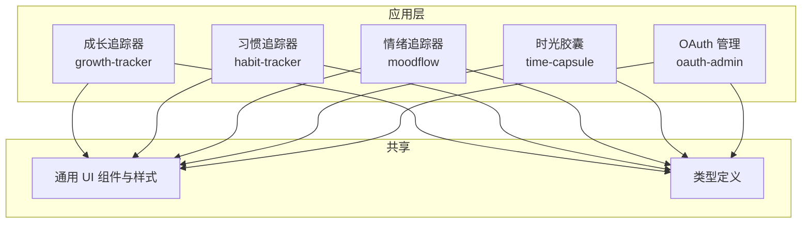
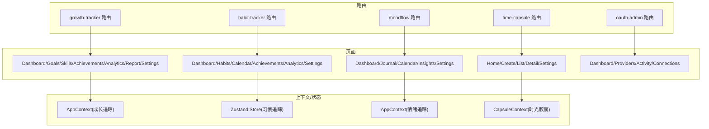
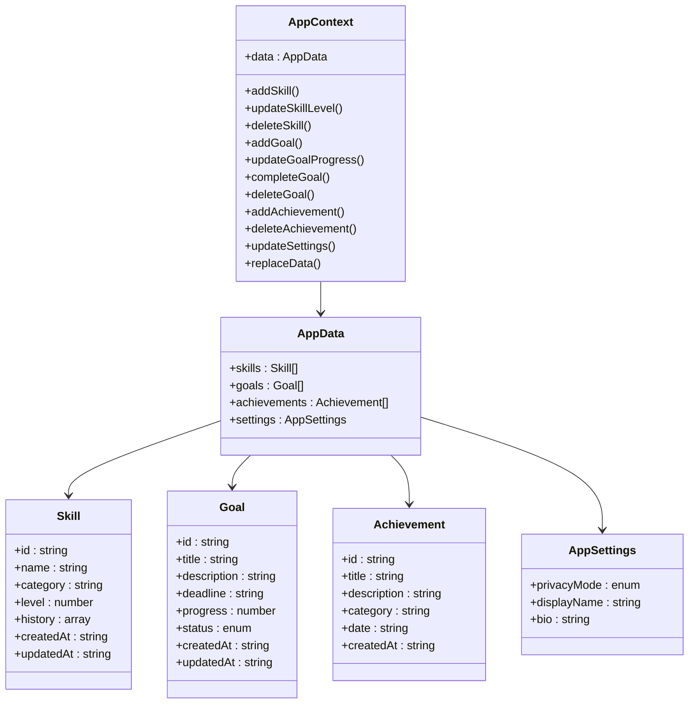
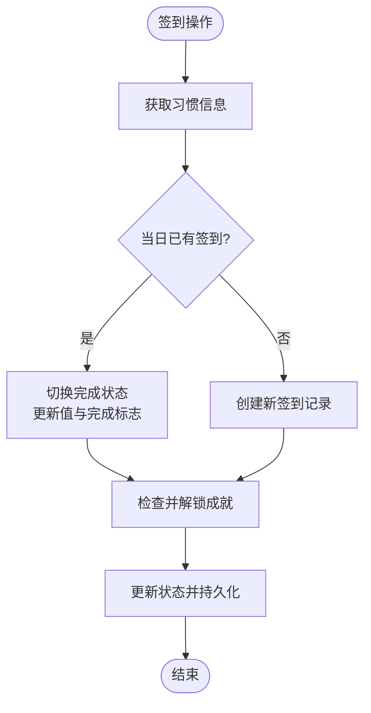
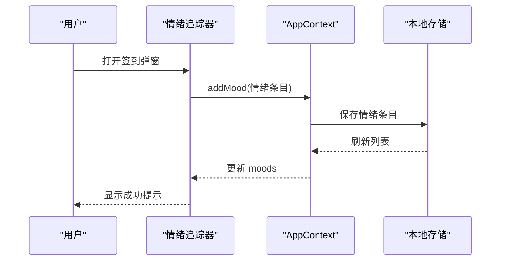
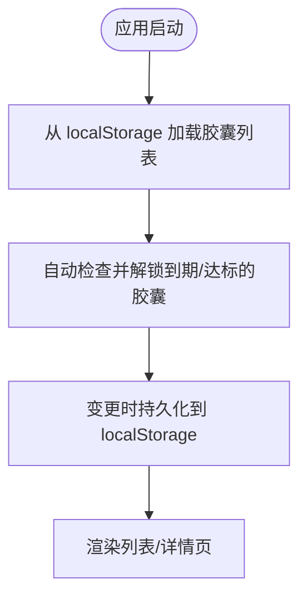
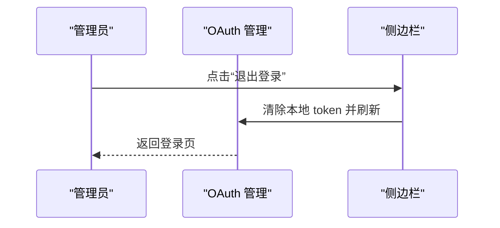
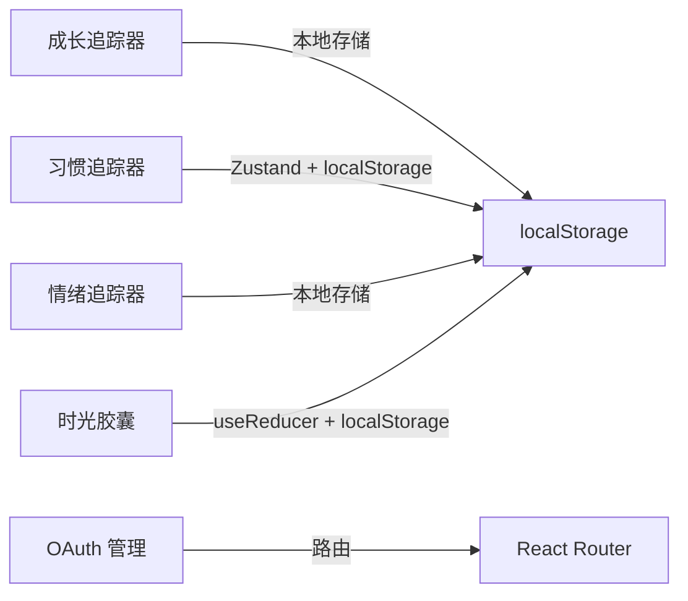

# 生产力应用套件

<cite>
**本文引用的文件**
- [apps/growth-tracker/src/App.tsx](file://apps/growth-tracker/src/App.tsx)
- [apps/growth-tracker/src/context/AppContext.tsx](file://apps/growth-tracker/src/context/AppContext.tsx)
- [apps/growth-tracker/src/types/index.ts](file://apps/growth-tracker/src/types/index.ts)
- [apps/habit-tracker/src/App.tsx](file://apps/habit-tracker/src/App.tsx)
- [apps/habit-tracker/src/store/habitStore.ts](file://apps/habit-tracker/src/store/habitStore.ts)
- [apps/habit-tracker/src/types/index.ts](file://apps/habit-tracker/src/types/index.ts)
- [apps/moodflow/src/App.tsx](file://apps/moodflow/src/App.tsx)
- [apps/moodflow/src/contexts/AppContext.tsx](file://apps/moodflow/src/contexts/AppContext.tsx)
- [apps/time-capsule/src/App.tsx](file://apps/time-capsule/src/App.tsx)
- [apps/time-capsule/src/context/CapsuleContext.tsx](file://apps/time-capsule/src/context/CapsuleContext.tsx)
- [apps/time-capsule/src/types/capsule.ts](file://apps/time-capsule/src/types/capsule.ts)
- [apps/oauth-admin/src/App.tsx](file://apps/oauth-admin/src/App.tsx)
- [apps/oauth-admin/src/components/layout/Sidebar.tsx](file://apps/oauth-admin/src/components/layout/Sidebar.tsx)
</cite>

## 目录
1. [简介](#简介)
2. [项目结构](#项目结构)
3. [核心组件](#核心组件)
4. [架构总览](#架构总览)
5. [详细组件分析](#详细组件分析)
6. [依赖关系分析](#依赖关系分析)
7. [性能考量](#性能考量)
8. [故障排查指南](#故障排查指南)
9. [结论](#结论)
10. [附录](#附录)

## 简介
本文件为 DAO Collective 的生产力应用套件提供系统化文档，覆盖以下应用：
- 成长追踪器：技能与目标管理、成就记录与统计分析
- 习惯追踪器：习惯打卡、统计与成就解锁
- 情绪追踪器：每日情绪签到、日记与洞察
- 时光胶囊：加密封存内容、到期或里程碑解锁
- OAuth 管理：认证提供商、活动日志与连接管理

文档从架构、数据模型、UI 设计、协同机制、数据同步策略、安装配置、定制与扩展等方面进行说明，帮助用户按需选择并高效使用这些工具。

## 项目结构
套件采用多应用单仓库（monorepo）组织方式，各应用独立构建与运行，共享通用样式与工具库。核心应用位于 apps 目录下，每个应用包含页面、组件、上下文/状态管理、类型定义与路由配置。

图表来源
- [apps/growth-tracker/src/App.tsx:1-37](file://apps/growth-tracker/src/App.tsx#L1-L37)
- [apps/habit-tracker/src/App.tsx:1-30](file://apps/habit-tracker/src/App.tsx#L1-L30)
- [apps/moodflow/src/App.tsx:1-43](file://apps/moodflow/src/App.tsx#L1-L43)
- [apps/time-capsule/src/App.tsx:1-51](file://apps/time-capsule/src/App.tsx#L1-L51)
- [apps/oauth-admin/src/App.tsx:1-26](file://apps/oauth-admin/src/App.tsx#L1-L26)

章节来源
- [apps/growth-tracker/src/App.tsx:1-37](file://apps/growth-tracker/src/App.tsx#L1-L37)
- [apps/habit-tracker/src/App.tsx:1-30](file://apps/habit-tracker/src/App.tsx#L1-L30)
- [apps/moodflow/src/App.tsx:1-43](file://apps/moodflow/src/App.tsx#L1-L43)
- [apps/time-capsule/src/App.tsx:1-51](file://apps/time-capsule/src/App.tsx#L1-L51)
- [apps/oauth-admin/src/App.tsx:1-26](file://apps/oauth-admin/src/App.tsx#L1-L26)

## 核心组件
- 上下文与状态管理
  - 成长追踪器：AppProvider 提供技能、目标、成就与设置的全局状态，并持久化至本地存储
  - 习惯追踪器：Zustand store 管理习惯、签到、成就、用户资料与设置，支持持久化与导入导出
  - 情绪追踪器：AppProvider 管理情绪与日记条目、设置与提示消息
  - 时光胶囊：useReducer + localStorage 管理胶囊列表、解锁状态与持久化
- 路由与布局
  - 各应用均通过 React Router 配置页面级路由；部分应用提供桌面/移动端导航与全局通知组件
- 类型系统
  - 应用均提供强类型接口，确保数据结构一致与可维护性

章节来源
- [apps/growth-tracker/src/context/AppContext.tsx:1-163](file://apps/growth-tracker/src/context/AppContext.tsx#L1-L163)
- [apps/habit-tracker/src/store/habitStore.ts:1-545](file://apps/habit-tracker/src/store/habitStore.ts#L1-L545)
- [apps/moodflow/src/contexts/AppContext.tsx:1-100](file://apps/moodflow/src/contexts/AppContext.tsx#L1-L100)
- [apps/time-capsule/src/context/CapsuleContext.tsx:1-161](file://apps/time-capsule/src/context/CapsuleContext.tsx#L1-L161)
- [apps/growth-tracker/src/types/index.ts:1-44](file://apps/growth-tracker/src/types/index.ts#L1-L44)
- [apps/habit-tracker/src/types/index.ts:1-113](file://apps/habit-tracker/src/types/index.ts#L1-L113)
- [apps/time-capsule/src/types/capsule.ts:1-101](file://apps/time-capsule/src/types/capsule.ts#L1-L101)

## 架构总览
各应用采用“页面 + 组件 + 上下文/状态”的分层结构，路由驱动页面切换，上下文/状态管理负责数据读写与跨组件共享。OAuth 管理作为独立应用，提供认证相关页面与侧边导航。

图表来源
- [apps/growth-tracker/src/App.tsx:1-37](file://apps/growth-tracker/src/App.tsx#L1-L37)
- [apps/habit-tracker/src/App.tsx:1-30](file://apps/habit-tracker/src/App.tsx#L1-L30)
- [apps/moodflow/src/App.tsx:1-43](file://apps/moodflow/src/App.tsx#L1-L43)
- [apps/time-capsule/src/App.tsx:1-51](file://apps/time-capsule/src/App.tsx#L1-L51)
- [apps/oauth-admin/src/App.tsx:1-26](file://apps/oauth-admin/src/App.tsx#L1-L26)

## 详细组件分析

### 成长追踪器
- 功能特性
  - 技能管理：新增、升级、删除；每日等级变更记录
  - 目标管理：设定截止日期、进度更新、自动逾期标记
  - 成就记录：手动添加与展示
  - 设置管理：隐私模式、显示名、个人简介
- 数据模型
  - 技能：名称、分类、等级、历史、时间戳
  - 目标：标题、描述、截止日期、进度、状态、时间戳
  - 成就：标题、描述、分类、日期、时间戳
  - 设置：隐私模式、显示名、个人简介
- 用户界面
  - 侧边栏导航 + 主区域路由渲染
  - 全局通知组件
- 协同与数据同步
  - 使用本地存储持久化，应用启动时加载，状态变更时保存
- 安装与配置
  - 基于 Vite + React + TailwindCSS，按需安装依赖后运行
- 扩展建议
  - 新增数据导出/导入、跨设备同步（如 IndexedDB 或后端服务）

图表来源
- [apps/growth-tracker/src/context/AppContext.tsx:1-163](file://apps/growth-tracker/src/context/AppContext.tsx#L1-L163)
- [apps/growth-tracker/src/types/index.ts:1-44](file://apps/growth-tracker/src/types/index.ts#L1-L44)

章节来源
- [apps/growth-tracker/src/App.tsx:1-37](file://apps/growth-tracker/src/App.tsx#L1-L37)
- [apps/growth-tracker/src/context/AppContext.tsx:1-163](file://apps/growth-tracker/src/context/AppContext.tsx#L1-L163)
- [apps/growth-tracker/src/types/index.ts:1-44](file://apps/growth-tracker/src/types/index.ts#L1-L44)

### 习惯追踪器
- 功能特性
  - 习惯 CRUD、归档、提醒
  - 签到：开关式与带数值签到，支持备注
  - 连击与最长连击统计
  - 成就系统：连击里程碑、累计打卡、类别探索、完美周/月、回血成就
  - 统计：总签到数、习惯完成率、整体完成率、活跃习惯
  - 用户资料与设置：头像、时区、主题、语言、周起始日等
  - 数据管理：导出 JSON、导入 JSON、清空数据
- 数据模型
  - Habit、CheckIn、Achievement、UserProfile、UserSettings
  - 成就类型：streak、milestone、perfect、explorer、comeback
- 用户界面
  - 侧边栏 + 移动端导航
  - 全局通知组件
- 协同与数据同步
  - Zustand + persist 中间件持久化到本地存储
- 安装与配置
  - Vite + React + Zustand，按需安装依赖后运行
- 扩展建议
  - 添加跨设备同步、成就推送通知、自定义提醒

图表来源
- [apps/habit-tracker/src/store/habitStore.ts:237-268](file://apps/habit-tracker/src/store/habitStore.ts#L237-L268)

章节来源
- [apps/habit-tracker/src/App.tsx:1-30](file://apps/habit-tracker/src/App.tsx#L1-L30)
- [apps/habit-tracker/src/store/habitStore.ts:1-545](file://apps/habit-tracker/src/store/habitStore.ts#L1-L545)
- [apps/habit-tracker/src/types/index.ts:1-113](file://apps/habit-tracker/src/types/index.ts#L1-L113)

### 情绪追踪器
- 功能特性
  - 每日情绪签到弹窗
  - 日记增删查
  - 设置：暗色模式、语言、时区
  - 全局提示消息
- 数据模型
  - 情绪条目、日记条目、应用设置
- 用户界面
  - 侧边栏 + 移动端导航 + 弹窗签到 + 全局 Toast
- 协同与数据同步
  - 本地存储持久化，设置变更即时生效
- 安装与配置
  - Vite + React + TailwindCSS，按需安装依赖后运行
- 扩展建议
  - 添加情绪趋势图、日记标签云、导出分析报告

图表来源
- [apps/moodflow/src/App.tsx:12-29](file://apps/moodflow/src/App.tsx#L12-L29)
- [apps/moodflow/src/contexts/AppContext.tsx:59-67](file://apps/moodflow/src/contexts/AppContext.tsx#L59-L67)

章节来源
- [apps/moodflow/src/App.tsx:1-43](file://apps/moodflow/src/App.tsx#L1-L43)
- [apps/moodflow/src/contexts/AppContext.tsx:1-100](file://apps/moodflow/src/contexts/AppContext.tsx#L1-L100)

### 时光胶囊
- 功能特性
  - 创建胶囊：标题、正文、类型、媒体附件、加密、提醒
  - 解锁条件：日期或里程碑
  - 状态管理：草稿、锁定、解锁
  - 列表与详情页
- 数据模型
  - TimeCapsule、UnlockCondition、MediaAttachment、EncryptionInfo、ReminderSettings
- 用户界面
  - 布局 + 导航 + Toast 容器
  - 主题初始化（深色/浅色）
- 协同与数据同步
  - useReducer + localStorage，自动检测解锁状态并持久化
- 安装与配置
  - Vite + React + TailwindCSS，按需安装依赖后运行
- 扩展建议
  - 支持密码保护、到期提醒、分享链接

图表来源
- [apps/time-capsule/src/context/CapsuleContext.tsx:75-102](file://apps/time-capsule/src/context/CapsuleContext.tsx#L75-L102)

章节来源
- [apps/time-capsule/src/App.tsx:1-51](file://apps/time-capsule/src/App.tsx#L1-L51)
- [apps/time-capsule/src/context/CapsuleContext.tsx:1-161](file://apps/time-capsule/src/context/CapsuleContext.tsx#L1-L161)
- [apps/time-capsule/src/types/capsule.ts:1-101](file://apps/time-capsule/src/types/capsule.ts#L1-L101)

### OAuth 管理
- 功能特性
  - 仪表盘、提供商管理、活动日志、连接管理
  - 侧边栏导航与移动端导航
  - 登出清理令牌并刷新页面
- 用户界面
  - 侧边栏 + 主区域路由 + 移动端底部导航
- 协同与数据同步
  - 无后端依赖，基于前端路由与本地状态
- 安装与配置
  - Vite + React + TailwindCSS，按需安装依赖后运行
- 扩展建议
  - 添加权限控制、审计日志导出、第三方集成

图表来源
- [apps/oauth-admin/src/components/layout/Sidebar.tsx:41-50](file://apps/oauth-admin/src/components/layout/Sidebar.tsx#L41-L50)

章节来源
- [apps/oauth-admin/src/App.tsx:1-26](file://apps/oauth-admin/src/App.tsx#L1-L26)
- [apps/oauth-admin/src/components/layout/Sidebar.tsx:1-77](file://apps/oauth-admin/src/components/layout/Sidebar.tsx#L1-L77)

## 依赖关系分析
- 应用间耦合
  - 各应用相对独立，通过各自上下文/状态管理实现内部解耦
  - OAuth 管理作为独立应用，不直接依赖其他生产力应用
- 外部依赖
  - React Router：路由与导航
  - Zustand（习惯追踪器）：轻量状态管理与持久化
  - 本地存储：成长追踪器、情绪追踪器、时光胶囊的核心持久化手段
- 可能的循环依赖
  - 当前结构未见明显循环依赖；若引入跨应用共享逻辑，建议通过工具库或公共包解耦

图表来源
- [apps/growth-tracker/src/context/AppContext.tsx:30-32](file://apps/growth-tracker/src/context/AppContext.tsx#L30-L32)
- [apps/habit-tracker/src/store/habitStore.ts:540-543](file://apps/habit-tracker/src/store/habitStore.ts#L540-L543)
- [apps/moodflow/src/contexts/AppContext.tsx:44-47](file://apps/moodflow/src/contexts/AppContext.tsx#L44-L47)
- [apps/time-capsule/src/context/CapsuleContext.tsx:98-102](file://apps/time-capsule/src/context/CapsuleContext.tsx#L98-L102)
- [apps/oauth-admin/src/App.tsx:1-26](file://apps/oauth-admin/src/App.tsx#L1-L26)

章节来源
- [apps/growth-tracker/src/context/AppContext.tsx:30-32](file://apps/growth-tracker/src/context/AppContext.tsx#L30-L32)
- [apps/habit-tracker/src/store/habitStore.ts:540-543](file://apps/habit-tracker/src/store/habitStore.ts#L540-L543)
- [apps/moodflow/src/contexts/AppContext.tsx:44-47](file://apps/moodflow/src/contexts/AppContext.tsx#L44-L47)
- [apps/time-capsule/src/context/CapsuleContext.tsx:98-102](file://apps/time-capsule/src/context/CapsuleContext.tsx#L98-L102)
- [apps/oauth-admin/src/App.tsx:1-26](file://apps/oauth-admin/src/App.tsx#L1-L26)

## 性能考量
- 状态粒度
  - 成长追踪器与情绪追踪器使用集中式上下文，适合小规模数据；若数据增长，可考虑拆分细粒度上下文
  - 习惯追踪器使用 Zustand，已内置持久化中间件，注意避免不必要的重渲染
- 存储策略
  - 本地存储容量有限，建议对大体量数据进行分片或压缩
  - 避免在渲染路径中执行大量序列化/反序列化
- UI 渲染
  - 使用 React.memo、useMemo、useCallback 优化高频组件
  - 控制一次性加载的数据量，采用分页或懒加载
- 通知与弹窗
  - 全局 Toast/弹窗数量不宜过多，避免阻塞主线程

## 故障排查指南
- 数据无法持久化
  - 检查浏览器是否禁用本地存储；确认 localStorage 可用且未被清理
  - 关注应用启动时的日志与错误提示
- 成就未解锁
  - 确认签到数据与统计逻辑是否正确；查看成就检查触发时机
- 页面空白或路由异常
  - 检查路由配置与页面导入是否正确
- 登录态失效（OAuth 管理）
  - 退出登录会清除本地 token，需重新登录

章节来源
- [apps/habit-tracker/src/store/habitStore.ts:266-268](file://apps/habit-tracker/src/store/habitStore.ts#L266-L268)
- [apps/oauth-admin/src/components/layout/Sidebar.tsx:41-50](file://apps/oauth-admin/src/components/layout/Sidebar.tsx#L41-L50)

## 结论
该套件以模块化方式提供多维度的个人生产力工具：成长追踪器聚焦长期能力与目标，习惯追踪器强调日常行为养成，情绪追踪器关注心理健康，时光胶囊承载记忆与期望，OAuth 管理保障认证安全。通过统一的路由与 UI 框架、清晰的类型定义与状态管理，用户可根据自身需求灵活组合使用。建议在团队协作场景下引入跨设备同步与审计日志，进一步增强协作与合规性。

## 附录
- 安装与运行
  - 在根目录安装依赖后，分别进入各应用目录运行开发服务器或构建产物
- 功能定制
  - 在各自上下文/状态文件中扩展字段与方法；在类型定义中补充接口
- 扩展开发
  - 新增应用时复用现有路由与 UI 模式；遵循类型定义与状态管理模式