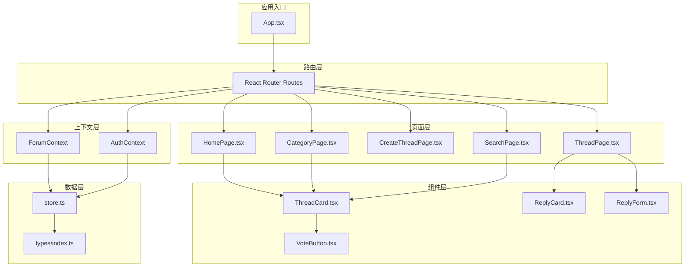
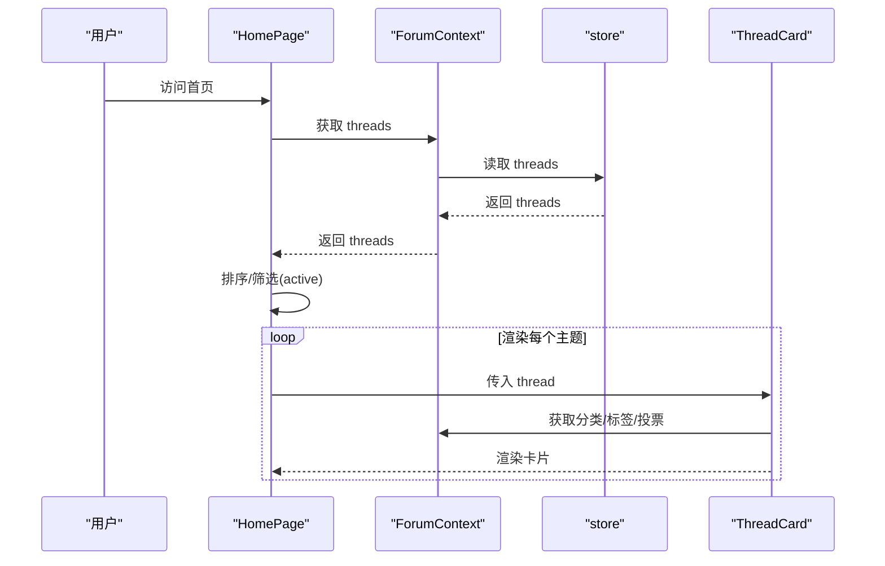
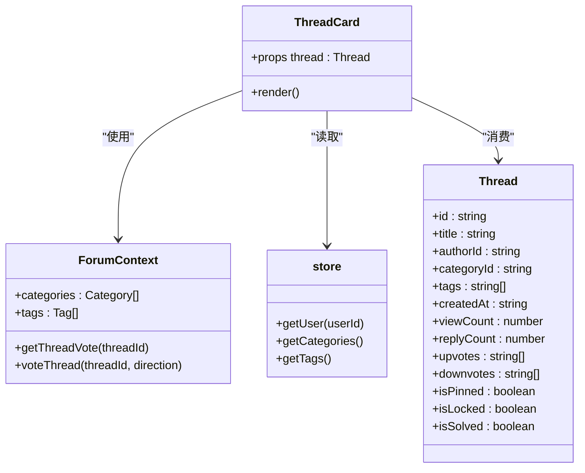
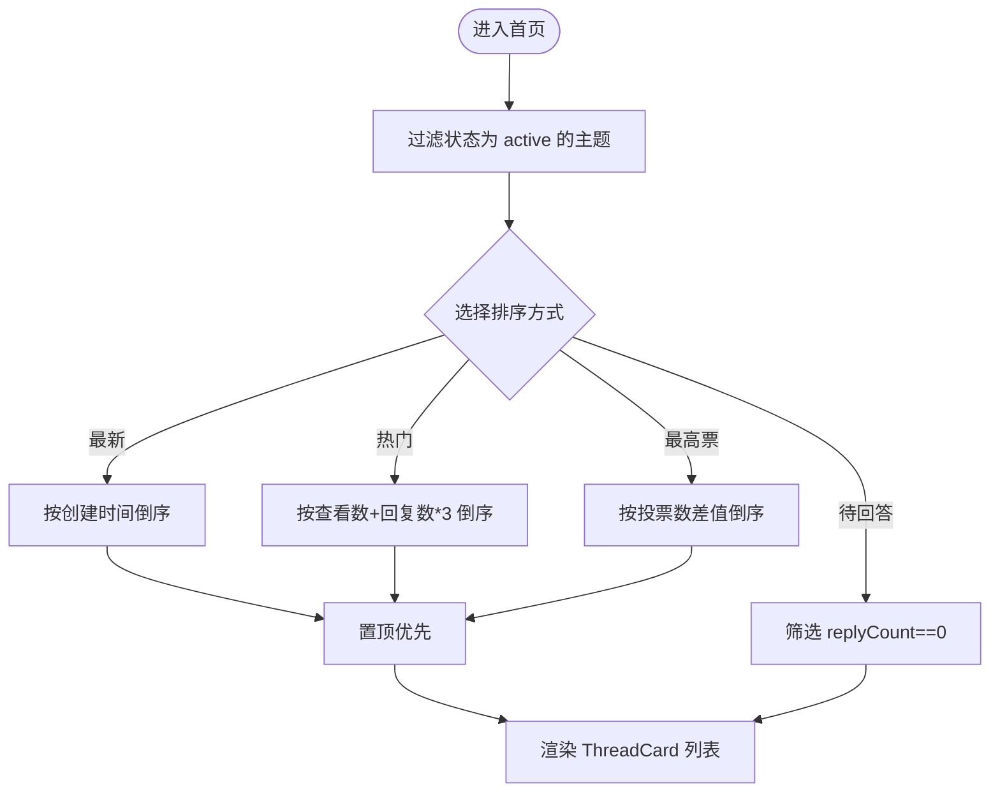
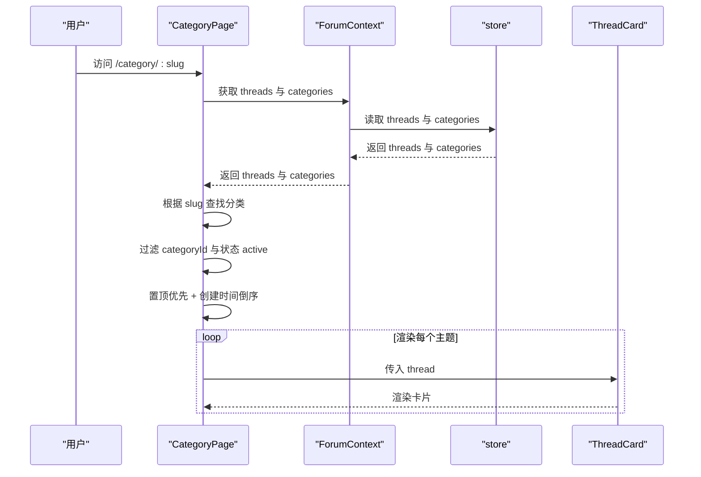
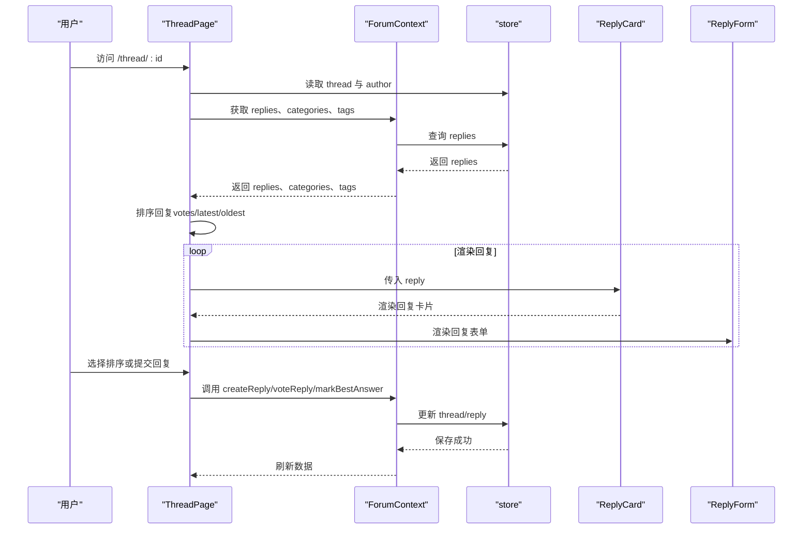
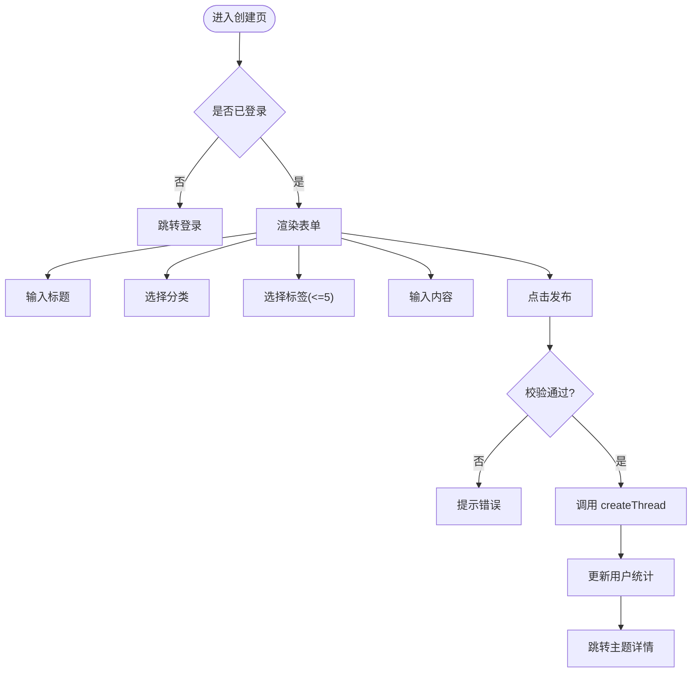
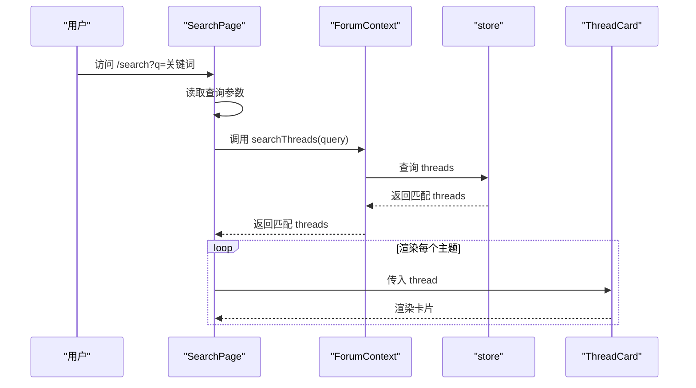
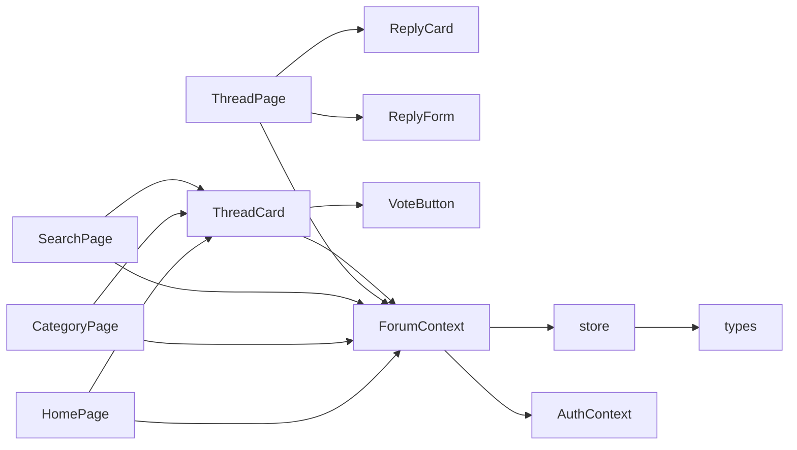

# 主题管理

<cite>
**本文引用的文件**
- [ThreadCard.tsx](file://apps/forum/src/components/thread/ThreadCard.tsx)
- [HomePage.tsx](file://apps/forum/src/pages/HomePage.tsx)
- [CategoryPage.tsx](file://apps/forum/src/pages/CategoryPage.tsx)
- [CreateThreadPage.tsx](file://apps/forum/src/pages/CreateThreadPage.tsx)
- [ThreadPage.tsx](file://apps/forum/src/pages/ThreadPage.tsx)
- [ForumContext.tsx](file://apps/forum/src/context/ForumContext.tsx)
- [types/index.ts](file://apps/forum/src/types/index.ts)
- [store.ts](file://apps/forum/src/data/store.ts)
- [ReplyCard.tsx](file://apps/forum/src/components/reply/ReplyCard.tsx)
- [ReplyForm.tsx](file://apps/forum/src/components/reply/ReplyForm.tsx)
- [VoteButton.tsx](file://apps/forum/src/components/thread/VoteButton.tsx)
- [App.tsx](file://apps/forum/src/App.tsx)
- [SearchPage.tsx](file://apps/forum/src/pages/SearchPage.tsx)
</cite>

## 目录
1. [简介](#简介)
2. [项目结构](#项目结构)
3. [核心组件](#核心组件)
4. [架构总览](#架构总览)
5. [详细组件分析](#详细组件分析)
6. [依赖关系分析](#依赖关系分析)
7. [性能考量](#性能考量)
8. [故障排查指南](#故障排查指南)
9. [结论](#结论)
10. [附录](#附录)

## 简介
本文件面向社区论坛的主题管理系统，围绕主题列表展示、主题详情页面、主题创建与编辑、分类筛选与排序、数据模型与状态管理、API 接口调用以及前端路由配置进行系统化说明。重点剖析 ThreadCard 组件的设计与实现，涵盖主题标题、作者信息、发布时间、回复数量等字段显示；解释分类页面的筛选机制与排序功能；并提供主题创建表单示例、数据验证规则与用户交互流程。

## 项目结构
论坛应用采用按功能模块划分的组织方式，核心目录如下：
- components：可复用 UI 组件，如 ThreadCard、ReplyCard、VoteButton 等
- pages：页面级组件，如 HomePage、CategoryPage、CreateThreadPage、ThreadPage、SearchPage 等
- context：全局状态上下文，如 ForumContext、AuthContext
- data：本地存储与种子数据，如 store.ts
- types：TypeScript 类型定义，如 index.ts
- App.tsx：路由与 Provider 包装入口

图表来源
- [App.tsx:21-46](file://apps/forum/src/App.tsx#L21-L46)
- [ForumContext.tsx:34-306](file://apps/forum/src/context/ForumContext.tsx#L34-L306)
- [store.ts:315-399](file://apps/forum/src/data/store.ts#L315-L399)

章节来源
- [App.tsx:18-19](file://apps/forum/src/App.tsx#L18-L19)
- [App.tsx:27-39](file://apps/forum/src/App.tsx#L27-L39)

## 核心组件
- ThreadCard：主题卡片组件，负责渲染主题标题、作者、发布时间、查看数、回复数、状态徽章、分类与标签等，并提供移动端投票按钮。
- HomePage：首页，聚合主题列表，支持多种排序方式（热门、最新、最高票、待回答），并提供“发起讨论”入口。
- CategoryPage：分类页，根据分类 slug 过滤主题并按置顶优先、时间倒序排序。
- CreateThreadPage：主题创建页，包含标题、分类、标签、内容等字段，提供表单校验与提交流程。
- ThreadPage：主题详情页，展示主题正文、作者信息、标签、统计信息、投票、回复列表与回复表单，支持回复排序与操作菜单。
- ForumContext：论坛上下文，封装主题与回复的 CRUD、投票、最佳回答标记、通知、搜索等功能。
- store：本地存储与种子数据，提供用户、主题、回复、分类、标签、通知等的 CRUD 与查询方法。
- ReplyCard/ReplyForm：回复卡片与回复表单，支持回复投票、最佳回答标记、删除、内嵌回复等。
- VoteButton：通用投票按钮，支持点赞/踩切换与不同尺寸。

章节来源
- [ThreadCard.tsx:14-117](file://apps/forum/src/components/thread/ThreadCard.tsx#L14-L117)
- [HomePage.tsx:18-121](file://apps/forum/src/pages/HomePage.tsx#L18-L121)
- [CategoryPage.tsx:7-67](file://apps/forum/src/pages/CategoryPage.tsx#L7-L67)
- [CreateThreadPage.tsx:9-160](file://apps/forum/src/pages/CreateThreadPage.tsx#L9-L160)
- [ThreadPage.tsx:17-271](file://apps/forum/src/pages/ThreadPage.tsx#L17-L271)
- [ForumContext.tsx:34-312](file://apps/forum/src/context/ForumContext.tsx#L34-L312)
- [store.ts:315-399](file://apps/forum/src/data/store.ts#L315-L399)
- [ReplyCard.tsx:18-117](file://apps/forum/src/components/reply/ReplyCard.tsx#L18-L117)
- [ReplyForm.tsx:15-68](file://apps/forum/src/components/reply/ReplyForm.tsx#L15-L68)
- [VoteButton.tsx:13-59](file://apps/forum/src/components/thread/VoteButton.tsx#L13-L59)

## 架构总览
论坛采用“页面 + 组件 + 上下文 + 存储”的分层架构：
- 页面层负责路由与业务编排，调用上下文提供的方法获取数据与执行操作。
- 组件层负责 UI 渲染与交互，复用投票、卡片、表单等通用组件。
- 上下文层封装业务逻辑，协调存储与认证上下文，提供统一的 API。
- 存储层提供本地持久化与种子数据初始化，支持 CRUD、搜索与通知管理。

图表来源
- [HomePage.tsx:20-47](file://apps/forum/src/pages/HomePage.tsx#L20-L47)
- [ForumContext.tsx:36-53](file://apps/forum/src/context/ForumContext.tsx#L36-L53)
- [store.ts:327-335](file://apps/forum/src/data/store.ts#L327-L335)
- [ThreadCard.tsx:14-117](file://apps/forum/src/components/thread/ThreadCard.tsx#L14-L117)

## 详细组件分析

### ThreadCard 组件设计与实现
ThreadCard 是主题列表的核心展示单元，承担以下职责：
- 渲染主题状态徽章（置顶、锁定、已解决）
- 渲染分类标签与跳转
- 渲染主题标题与链接
- 渲染标签集合
- 渲染作者头像、显示名、发布时间、查看数、回复数
- 提供桌面端与移动端投票按钮
- 支持置顶主题高亮边框与背景

实现要点：
- 通过 ForumContext 获取分类、标签与投票状态
- 通过 store 获取作者信息与标签详情
- 计算得分与当前投票方向
- 使用条件渲染控制徽章与移动端投票按钮

图表来源
- [ThreadCard.tsx:14-117](file://apps/forum/src/components/thread/ThreadCard.tsx#L14-L117)
- [ForumContext.tsx:14-16](file://apps/forum/src/context/ForumContext.tsx#L14-L16)
- [store.ts:317-361](file://apps/forum/src/data/store.ts#L317-L361)
- [types/index.ts:51-69](file://apps/forum/src/types/index.ts#L51-L69)

章节来源
- [ThreadCard.tsx:14-117](file://apps/forum/src/components/thread/ThreadCard.tsx#L14-L117)

### 主题列表展示（HomePage）
- 排序选项：热门、最新、最高票、待回答
- 热门排序综合考虑查看数与回复数权重
- 待回答排序仅返回回复数为 0 的主题
- 置顶主题始终排在最前

图表来源
- [HomePage.tsx:23-47](file://apps/forum/src/pages/HomePage.tsx#L23-L47)

章节来源
- [HomePage.tsx:18-121](file://apps/forum/src/pages/HomePage.tsx#L18-L121)

### 分类页面筛选与排序（CategoryPage）
- 通过路由参数 slug 获取分类
- 过滤属于该分类且状态为 active 的主题
- 置顶优先，其余按创建时间倒序

图表来源
- [CategoryPage.tsx:7-67](file://apps/forum/src/pages/CategoryPage.tsx#L7-L67)
- [ForumContext.tsx:36-38](file://apps/forum/src/context/ForumContext.tsx#L36-L38)
- [store.ts:327-335](file://apps/forum/src/data/store.ts#L327-L335)

章节来源
- [CategoryPage.tsx:7-67](file://apps/forum/src/pages/CategoryPage.tsx#L7-L67)

### 主题详情页面（ThreadPage）
- 展示主题正文、作者信息、标签、统计信息
- 支持桌面端与移动端投票
- 展示回复列表，支持按投票数、最新、最早排序
- 支持内嵌回复与回复表单
- 提供操作菜单（置顶、锁定、隐藏、删除）

图表来源
- [ThreadPage.tsx:17-271](file://apps/forum/src/pages/ThreadPage.tsx#L17-L271)
- [ForumContext.tsx:118-241](file://apps/forum/src/context/ForumContext.tsx#L118-L241)
- [store.ts:341-352](file://apps/forum/src/data/store.ts#L341-L352)

章节来源
- [ThreadPage.tsx:17-271](file://apps/forum/src/pages/ThreadPage.tsx#L17-L271)

### 主题创建与编辑（CreateThreadPage）
- 表单字段：标题、分类、标签（最多 5 个）、内容
- 数据验证：标题/内容非空、必须选择分类
- 提交流程：调用 ForumContext.createThread，成功后跳转至主题详情页
- 标签选择：支持多选与移除，限制数量

图表来源
- [CreateThreadPage.tsx:9-160](file://apps/forum/src/pages/CreateThreadPage.tsx#L9-L160)
- [ForumContext.tsx:55-82](file://apps/forum/src/context/ForumContext.tsx#L55-L82)
- [store.ts:327-335](file://apps/forum/src/data/store.ts#L327-L335)

章节来源
- [CreateThreadPage.tsx:9-160](file://apps/forum/src/pages/CreateThreadPage.tsx#L9-L160)

### 搜索功能（SearchPage）
- 通过 URL 参数 q 获取关键词
- 调用 ForumContext.searchThreads 进行全文检索（标题/内容）
- 渲染匹配的主题列表

图表来源
- [SearchPage.tsx:7-49](file://apps/forum/src/pages/SearchPage.tsx#L7-L49)
- [ForumContext.tsx:243-245](file://apps/forum/src/context/ForumContext.tsx#L243-L245)
- [store.ts:390-397](file://apps/forum/src/data/store.ts#L390-L397)

章节来源
- [SearchPage.tsx:7-49](file://apps/forum/src/pages/SearchPage.tsx#L7-L49)

## 依赖关系分析
- 组件依赖：ThreadCard 依赖 ForumContext 与 store；ThreadPage 依赖 ReplyCard/ReplyForm；VoteButton 为通用组件。
- 上下文依赖：ForumContext 依赖 store 与 AuthContext；提供 createThread、voteThread、getReplies、markBestAnswer 等方法。
- 存储依赖：store 提供 CRUD、搜索、通知管理；初始化时写入种子数据。
- 路由依赖：App.tsx 配置路由与 Provider 包装，确保上下文可用。

图表来源
- [HomePage.tsx:5-21](file://apps/forum/src/pages/HomePage.tsx#L5-L21)
- [CategoryPage.tsx:4-9](file://apps/forum/src/pages/CategoryPage.tsx#L4-L9)
- [SearchPage.tsx:4-10](file://apps/forum/src/pages/SearchPage.tsx#L4-L10)
- [ThreadPage.tsx:9-22](file://apps/forum/src/pages/ThreadPage.tsx#L9-L22)
- [ForumContext.tsx:34-306](file://apps/forum/src/context/ForumContext.tsx#L34-L306)
- [store.ts:315-399](file://apps/forum/src/data/store.ts#L315-L399)
- [types/index.ts:1-107](file://apps/forum/src/types/index.ts#L1-L107)

章节来源
- [ForumContext.tsx:34-312](file://apps/forum/src/context/ForumContext.tsx#L34-L312)
- [store.ts:315-399](file://apps/forum/src/data/store.ts#L315-L399)

## 性能考量
- 列表渲染：使用 useMemo 缓存过滤与排序结果，避免重复计算。
- 投票与回复：投票与回复操作通过上下文统一处理，减少组件内部状态复杂度。
- 本地存储：store 使用 localStorage，初始化时一次性写入种子数据，后续读取为 O(1) 数组查找。
- 图片与样式：首页英雄图使用懒加载与透明度叠加，提升首屏体验。
- 响应式设计：移动端投票按钮与布局自适应，减少不必要的 DOM 结构。

## 故障排查指南
- 未登录访问受限页面：CreateThreadPage 与 ReplyForm 在未登录时跳转登录页或提示登录。
- 主题不存在：ThreadPage 在找不到主题时返回友好提示并提供返回首页按钮。
- 分类不存在：CategoryPage 在找不到分类时提示并提供返回首页按钮。
- 表单校验失败：CreateThreadPage 与 ReplyForm 对必填字段进行校验并弹出提示。
- 投票异常：VoteButton 支持切换投票方向，若上下文未提供用户则不响应。

章节来源
- [CreateThreadPage.tsx:21-24](file://apps/forum/src/pages/CreateThreadPage.tsx#L21-L24)
- [ReplyForm.tsx:23-32](file://apps/forum/src/components/reply/ReplyForm.tsx#L23-L32)
- [ThreadPage.tsx:64-72](file://apps/forum/src/pages/ThreadPage.tsx#L64-L72)
- [CategoryPage.tsx:24-31](file://apps/forum/src/pages/CategoryPage.tsx#L24-L31)
- [CreateThreadPage.tsx:34-49](file://apps/forum/src/pages/CreateThreadPage.tsx#L34-L49)
- [VoteButton.tsx:14-20](file://apps/forum/src/components/thread/VoteButton.tsx#L14-L20)

## 结论
本主题管理系统以清晰的分层架构实现了主题列表、详情、创建与编辑、分类筛选与排序、回复交互与投票等核心功能。ThreadCard 作为主题卡片的核心组件，承担了丰富的展示与交互职责；ForumContext 将业务逻辑集中管理，结合 store 提供稳定的本地数据支撑；路由与 Provider 的组合确保了上下文在各页面的可用性。整体设计具备良好的扩展性与可维护性。

## 附录

### 主题数据模型
- 用户（User）：包含用户名、邮箱、显示名、角色、声望、徽章、统计信息等
- 分类（Category）：包含名称、slug、描述、图标、颜色、排序等
- 标签（Tag）：包含名称、slug、使用次数
- 主题（Thread）：包含标题、内容、作者、分类、标签、时间戳、统计、投票、状态等
- 回复（Reply）：包含内容、作者、父回复、最佳回答标记、状态等
- 通知（Notification）：包含类型、消息、链接、已读状态等

章节来源
- [types/index.ts:7-94](file://apps/forum/src/types/index.ts#L7-L94)

### 状态管理与 API 接口调用
- 主题 CRUD：createThread、deleteThread、togglePin、toggleLock、hideThread
- 投票：voteThread、getThreadVote、voteReply、getReplyVote
- 回复：createReply、deleteReply、markBestAnswer
- 搜索：searchThreads
- 通知：markNotificationRead、markAllRead

章节来源
- [ForumContext.tsx:12-29](file://apps/forum/src/context/ForumContext.tsx#L12-L29)
- [ForumContext.tsx:55-82](file://apps/forum/src/context/ForumContext.tsx#L55-L82)
- [ForumContext.tsx:84-107](file://apps/forum/src/context/ForumContext.tsx#L84-L107)
- [ForumContext.tsx:118-167](file://apps/forum/src/context/ForumContext.tsx#L118-L167)
- [ForumContext.tsx:169-200](file://apps/forum/src/context/ForumContext.tsx#L169-L200)
- [ForumContext.tsx:202-241](file://apps/forum/src/context/ForumContext.tsx#L202-L241)
- [ForumContext.tsx:243-245](file://apps/forum/src/context/ForumContext.tsx#L243-L245)
- [ForumContext.tsx:247-256](file://apps/forum/src/context/ForumContext.tsx#L247-L256)
- [ForumContext.tsx:258-290](file://apps/forum/src/context/ForumContext.tsx#L258-L290)

### 前端路由配置
- 首页：/
- 主题详情：/thread/:id
- 创建主题：/new
- 用户资料：/user/:id
- 分类：/category/:slug
- 搜索：/search?q=关键词
- 登录：/login
- 注册：/register
- 管理后台：/admin
- 设置：/settings

章节来源
- [App.tsx:27-39](file://apps/forum/src/App.tsx#L27-L39)