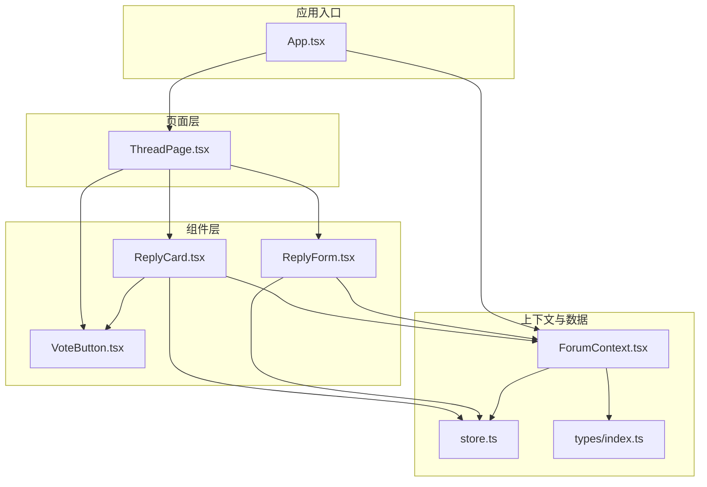
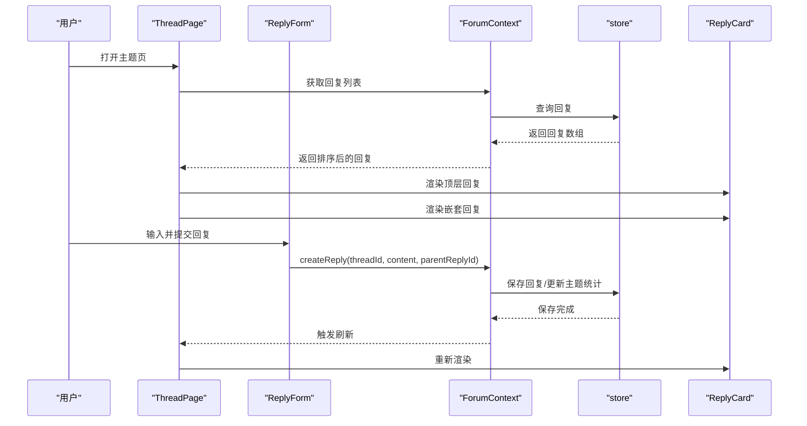
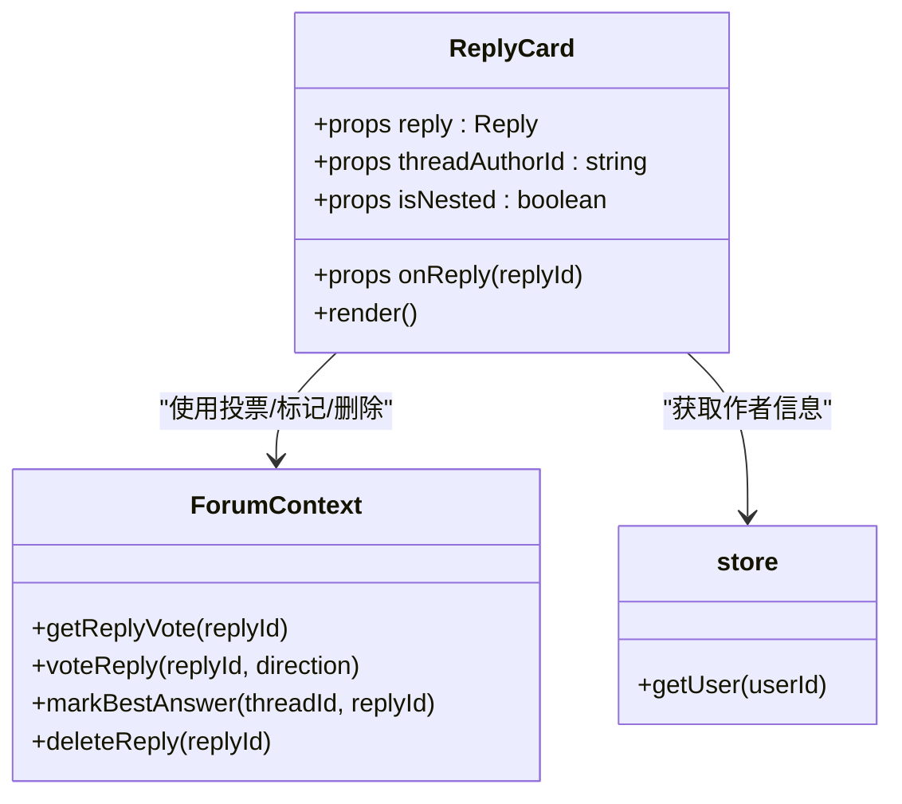
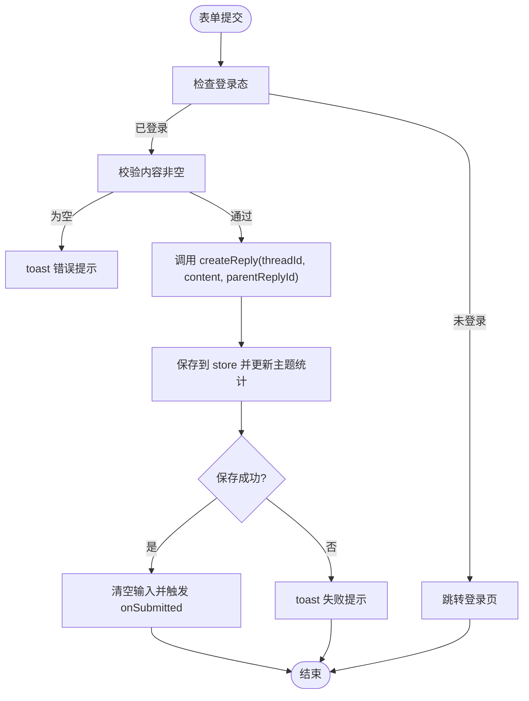
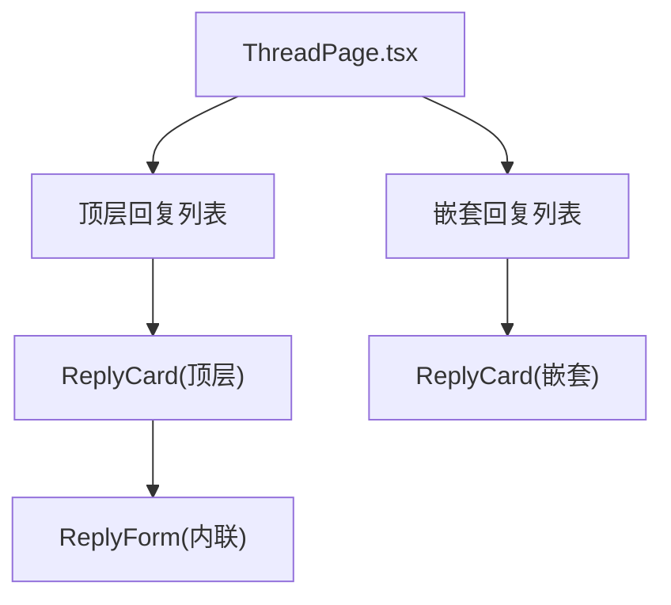
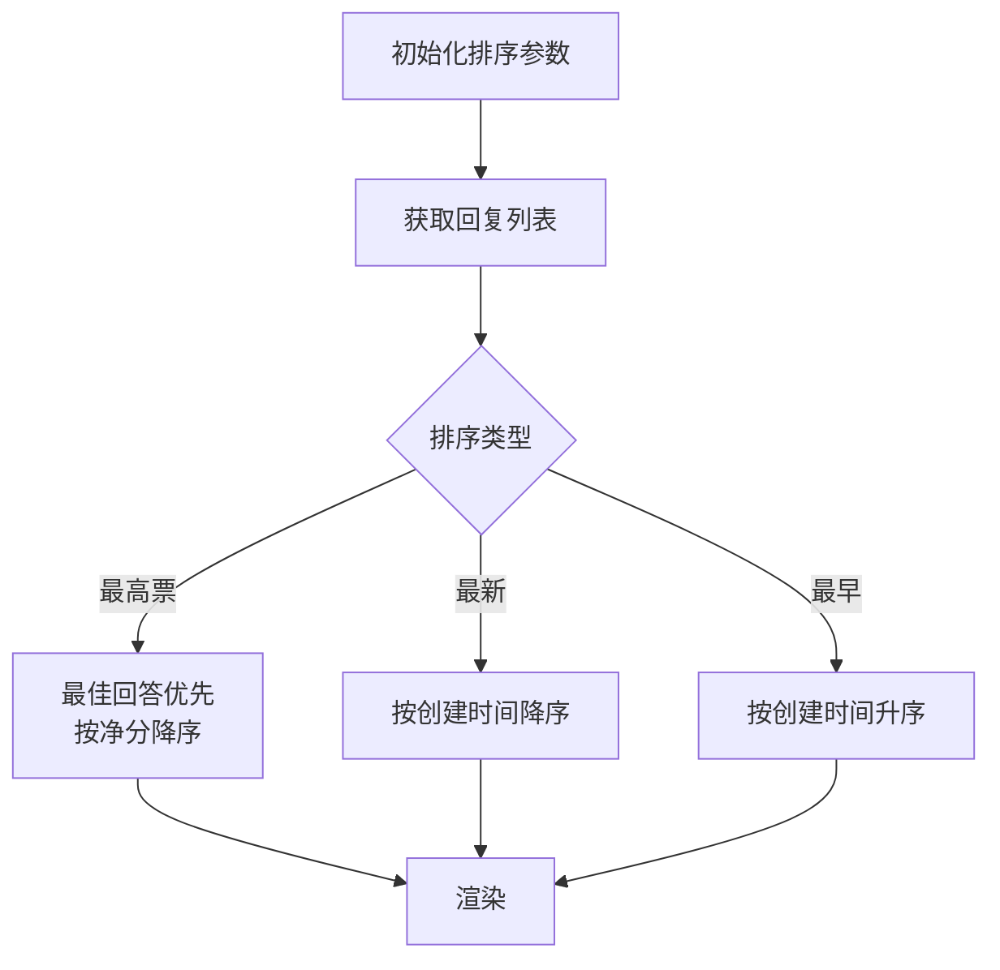
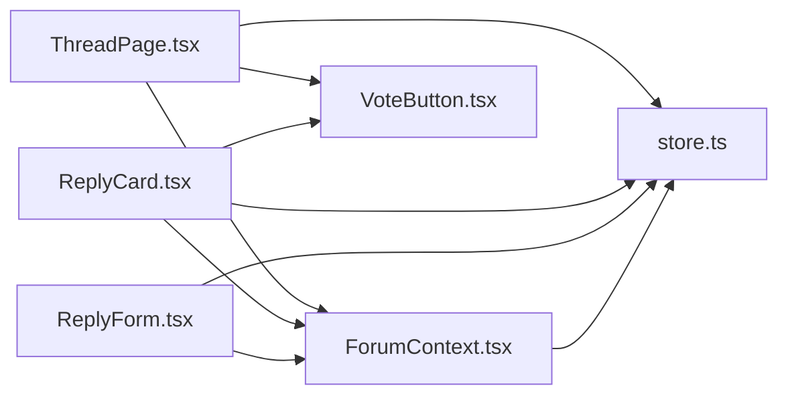

# 回复系统

<cite>
**本文引用的文件**
- [ReplyCard.tsx](file://apps/forum/src/components/reply/ReplyCard.tsx)
- [ReplyForm.tsx](file://apps/forum/src/components/reply/ReplyForm.tsx)
- [ThreadPage.tsx](file://apps/forum/src/pages/ThreadPage.tsx)
- [ForumContext.tsx](file://apps/forum/src/context/ForumContext.tsx)
- [store.ts](file://apps/forum/src/data/store.ts)
- [index.ts](file://apps/forum/src/types/index.ts)
- [VoteButton.tsx](file://apps/forum/src/components/thread/VoteButton.tsx)
- [App.tsx](file://apps/forum/src/App.tsx)
</cite>

## 目录
1. [简介](#简介)
2. [项目结构](#项目结构)
3. [核心组件](#核心组件)
4. [架构总览](#架构总览)
5. [组件详细分析](#组件详细分析)
6. [依赖关系分析](#依赖关系分析)
7. [性能考量](#性能考量)
8. [故障排查指南](#故障排查指南)
9. [结论](#结论)
10. [附录](#附录)

## 简介
本文件面向社区论坛的回复系统，聚焦以下目标：
- 深入说明 ReplyCard 组件的实现：回复内容渲染、用户头像显示、时间戳格式化、回复层级结构与交互。
- 详细解释 ReplyForm 表单的设计：富文本编辑器集成现状、文件附件上传能力、回复内容验证与提交流程。
- 文档化回复数据模型、嵌套回复机制、回复排序算法与实时更新机制。
- 提供回复交互示例、错误处理策略与性能优化建议。

## 项目结构
论坛应用采用分层与按功能模块组织的结构，回复系统位于 components/reply 下，并由上下文与数据层支撑。

图表来源
- [App.tsx:1-49](file://apps/forum/src/App.tsx#L1-L49)
- [ThreadPage.tsx:1-272](file://apps/forum/src/pages/ThreadPage.tsx#L1-L272)
- [ReplyCard.tsx:1-118](file://apps/forum/src/components/reply/ReplyCard.tsx#L1-L118)
- [ReplyForm.tsx:1-69](file://apps/forum/src/components/reply/ReplyForm.tsx#L1-L69)
- [ForumContext.tsx:1-313](file://apps/forum/src/context/ForumContext.tsx#L1-L313)
- [store.ts:1-399](file://apps/forum/src/data/store.ts#L1-L399)
- [index.ts:1-107](file://apps/forum/src/types/index.ts#L1-L107)

章节来源
- [App.tsx:1-49](file://apps/forum/src/App.tsx#L1-L49)
- [ThreadPage.tsx:1-272](file://apps/forum/src/pages/ThreadPage.tsx#L1-L272)

## 核心组件
- ReplyCard：渲染单条回复，包含作者信息、内容、投票按钮、操作菜单（标记最佳、删除）、时间戳与层级缩进。
- ReplyForm：表单组件，负责输入校验、提交与反馈；当前实现为纯文本输入框，未集成富文本编辑器或文件附件上传。
- ForumContext：提供回复创建、投票、最佳回答标记、删除等业务方法，并维护本地状态与通知。
- store：封装本地存储与种子数据，提供 CRUD 操作与查询。
- types：定义 Reply、Thread、User 等核心类型及排序选项。

章节来源
- [ReplyCard.tsx:1-118](file://apps/forum/src/components/reply/ReplyCard.tsx#L1-L118)
- [ReplyForm.tsx:1-69](file://apps/forum/src/components/reply/ReplyForm.tsx#L1-L69)
- [ForumContext.tsx:1-313](file://apps/forum/src/context/ForumContext.tsx#L1-L313)
- [store.ts:1-399](file://apps/forum/src/data/store.ts#L1-L399)
- [index.ts:71-83](file://apps/forum/src/types/index.ts#L71-L83)

## 架构总览
回复系统围绕“页面-组件-上下文-数据”四层展开，页面负责排序与渲染，组件负责展示与交互，上下文提供业务方法，数据层负责持久化与查询。

图表来源
- [ThreadPage.tsx:40-62](file://apps/forum/src/pages/ThreadPage.tsx#L40-L62)
- [ReplyForm.tsx:34-50](file://apps/forum/src/components/reply/ReplyForm.tsx#L34-L50)
- [ForumContext.tsx:122-167](file://apps/forum/src/context/ForumContext.tsx#L122-L167)
- [store.ts:342-352](file://apps/forum/src/data/store.ts#L342-L352)

## 组件详细分析

### ReplyCard 组件
- 功能要点
  - 展示作者头像、显示名、用户名、角色徽章与发布时间。
  - 渲染回复内容，保留换行与空格。
  - 提供投票按钮、回复按钮、标记最佳回答、更多菜单（举报、删除）。
  - 支持最佳回答高亮边框与徽章。
  - 支持嵌套缩进样式。
- 关键交互
  - 点击“回复”触发父组件回调，切换内联回复表单。
  - 管理员/版主可删除他人回复；作者可标记最佳回答。
- 数据来源
  - 作者信息来自 store.getUser。
  - 投票状态与分数通过 ForumContext 提供的方法计算。
- 时间戳格式化
  - 使用共享工具函数进行格式化显示。

图表来源
- [ReplyCard.tsx:18-118](file://apps/forum/src/components/reply/ReplyCard.tsx#L18-L118)
- [ForumContext.tsx:16-30](file://apps/forum/src/context/ForumContext.tsx#L16-L30)
- [store.ts:317-318](file://apps/forum/src/data/store.ts#L317-L318)

章节来源
- [ReplyCard.tsx:18-118](file://apps/forum/src/components/reply/ReplyCard.tsx#L18-L118)
- [ForumContext.tsx:16-30](file://apps/forum/src/context/ForumContext.tsx#L16-L30)
- [store.ts:317-318](file://apps/forum/src/data/store.ts#L317-L318)

### ReplyForm 表单
- 功能要点
  - 登录态校验：未登录时引导至登录页。
  - 输入校验：禁止空内容提交，提示错误。
  - 提交流程：调用 ForumContext.createReply，清空输入并触发父组件刷新。
  - 禁用状态：提交中或内容为空时禁用提交按钮。
- 当前限制
  - 仅支持纯文本输入框，未集成富文本编辑器。
  - 未实现文件附件上传与预览。
- 交互细节
  - 支持 parentReplyId 以实现内联回复。
  - 提交成功/失败通过 toast 反馈。

图表来源
- [ReplyForm.tsx:23-50](file://apps/forum/src/components/reply/ReplyForm.tsx#L23-L50)
- [ForumContext.tsx:122-167](file://apps/forum/src/context/ForumContext.tsx#L122-L167)
- [store.ts:342-352](file://apps/forum/src/data/store.ts#L342-L352)

章节来源
- [ReplyForm.tsx:15-69](file://apps/forum/src/components/reply/ReplyForm.tsx#L15-L69)
- [ForumContext.tsx:122-167](file://apps/forum/src/context/ForumContext.tsx#L122-L167)
- [store.ts:342-352](file://apps/forum/src/data/store.ts#L342-L352)

### 嵌套回复与层级结构
- 页面侧通过 parentReplyId 过滤顶层与嵌套回复，递归渲染。
- ReplyCard 支持 isNested 样式缩进，形成视觉层级。
- 内联回复表单与顶层回复绑定，点击“回复”切换显示。

图表来源
- [ThreadPage.tsx:81-82](file://apps/forum/src/pages/ThreadPage.tsx#L81-L82)
- [ThreadPage.tsx:231-254](file://apps/forum/src/pages/ThreadPage.tsx#L231-L254)
- [ReplyCard.tsx:30-36](file://apps/forum/src/components/reply/ReplyCard.tsx#L30-L36)

章节来源
- [ThreadPage.tsx:81-82](file://apps/forum/src/pages/ThreadPage.tsx#L81-L82)
- [ThreadPage.tsx:231-254](file://apps/forum/src/pages/ThreadPage.tsx#L231-L254)
- [ReplyCard.tsx:30-36](file://apps/forum/src/components/reply/ReplyCard.tsx#L30-L36)

### 回复排序算法
- 排序选项：按最高票、最新、最早。
- 排序规则：
  - 最高票：优先最佳回答，其次按净分（upvotes-downvotes）降序。
  - 最新/最早：按 createdAt 升/降序。
- 刷新机制：通过 refreshKey 强制重新计算排序。

图表来源
- [ThreadPage.tsx:23-24](file://apps/forum/src/pages/ThreadPage.tsx#L23-L24)
- [ThreadPage.tsx:40-62](file://apps/forum/src/pages/ThreadPage.tsx#L40-L62)

章节来源
- [ThreadPage.tsx:23-24](file://apps/forum/src/pages/ThreadPage.tsx#L23-L24)
- [ThreadPage.tsx:40-62](file://apps/forum/src/pages/ThreadPage.tsx#L40-L62)

### 实时更新机制
- ForumContext 在 createReply/voteReply/markBestAnswer/deleteReply 后触发刷新。
- ThreadPage 通过 refreshKey 与 useMemo 重新计算排序与渲染。
- store 使用 localStorage 持久化，初始化时注入种子数据。

章节来源
- [ForumContext.tsx:50-53](file://apps/forum/src/context/ForumContext.tsx#L50-L53)
- [ThreadPage.tsx:26, 40-62](file://apps/forum/src/pages/ThreadPage.tsx#L26, L40-L62)
- [store.ts:284-306](file://apps/forum/src/data/store.ts#L284-L306)

### 数据模型与类型
- Reply 字段：id、threadId、content、authorId、createdAt、updatedAt、upvotes、downvotes、parentReplyId、isBestAnswer、status。
- ThreadSortBy/ReplySortBy：排序枚举。
- 用户角色：user、moderator、admin。

章节来源
- [index.ts:71-83](file://apps/forum/src/types/index.ts#L71-L83)
- [index.ts:104-107](file://apps/forum/src/types/index.ts#L104-L107)

## 依赖关系分析
- ThreadPage 依赖 ForumContext 获取回复列表与排序，依赖 store 获取作者信息。
- ReplyCard 依赖 ForumContext 进行投票与标记，依赖 store 获取作者信息。
- ReplyForm 依赖 ForumContext 创建回复，依赖 store 获取用户信息。
- ForumContext 依赖 store 进行 CRUD 与查询。
- VoteButton 为通用投票控件，被 ThreadPage 与 ReplyCard 复用。

图表来源
- [ThreadPage.tsx:17-22](file://apps/forum/src/pages/ThreadPage.tsx#L17-L22)
- [ReplyCard.tsx:18-27](file://apps/forum/src/components/reply/ReplyCard.tsx#L18-L27)
- [ReplyForm.tsx:15-21](file://apps/forum/src/components/reply/ReplyForm.tsx#L15-L21)
- [ForumContext.tsx:34-48](file://apps/forum/src/context/ForumContext.tsx#L34-L48)
- [store.ts:315-398](file://apps/forum/src/data/store.ts#L315-L398)

章节来源
- [ThreadPage.tsx:17-22](file://apps/forum/src/pages/ThreadPage.tsx#L17-L22)
- [ReplyCard.tsx:18-27](file://apps/forum/src/components/reply/ReplyCard.tsx#L18-L27)
- [ReplyForm.tsx:15-21](file://apps/forum/src/components/reply/ReplyForm.tsx#L15-L21)
- [ForumContext.tsx:34-48](file://apps/forum/src/context/ForumContext.tsx#L34-L48)
- [store.ts:315-398](file://apps/forum/src/data/store.ts#L315-L398)

## 性能考量
- 渲染优化
  - 使用 useMemo 缓存排序结果，避免重复计算。
  - 通过 isNested 控制缩进样式，减少不必要的 DOM 结构。
- 状态更新
  - 通过 refreshKey 触发局部重渲染，避免全量刷新。
  - createReply/voteReply/markBestAnswer 后统一刷新，减少分散更新。
- 存储与查询
  - store 使用 localStorage，初始化时一次性注入种子数据，避免多次 IO。
- 建议
  - 对于大量回复场景，可考虑虚拟滚动或分页。
  - 将排序逻辑抽离为独立 hook，便于测试与复用。

章节来源
- [ThreadPage.tsx:40-62](file://apps/forum/src/pages/ThreadPage.tsx#L40-L62)
- [ForumContext.tsx:50-53](file://apps/forum/src/context/ForumContext.tsx#L50-L53)
- [store.ts:284-306](file://apps/forum/src/data/store.ts#L284-L306)

## 故障排查指南
- 未登录无法提交回复
  - 现象：显示登录引导。
  - 处理：引导用户登录后再提交。
  - 参考路径：[ReplyForm.tsx:23-32](file://apps/forum/src/components/reply/ReplyForm.tsx#L23-L32)
- 回复内容为空
  - 现象：toast 提示错误。
  - 处理：输入有效内容后重试。
  - 参考路径：[ReplyForm.tsx:34-50](file://apps/forum/src/components/reply/ReplyForm.tsx#L34-L50)
- 无法删除回复
  - 现象：删除按钮不可见。
  - 原因：需具备作者身份或管理员/版主权限。
  - 参考路径：[ReplyCard.tsx:26-27](file://apps/forum/src/components/reply/ReplyCard.tsx#L26-L27)
- 最佳回答标记无效
  - 现象：按钮不可见或无效果。
  - 原因：仅主题作者可标记，且需当前回复非最佳。
  - 参考路径：[ReplyCard.tsx:25-26](file://apps/forum/src/components/reply/ReplyCard.tsx#L25-L26)
- 排序异常
  - 现象：排序结果不符合预期。
  - 处理：切换排序类型或检查最佳回答状态。
  - 参考路径：[ThreadPage.tsx:40-62](file://apps/forum/src/pages/ThreadPage.tsx#L40-L62)

章节来源
- [ReplyForm.tsx:23-50](file://apps/forum/src/components/reply/ReplyForm.tsx#L23-L50)
- [ReplyCard.tsx:25-27](file://apps/forum/src/components/reply/ReplyCard.tsx#L25-L27)
- [ThreadPage.tsx:40-62](file://apps/forum/src/pages/ThreadPage.tsx#L40-L62)

## 结论
- ReplyCard 与 ReplyForm 构成了回复系统的核心交互层，职责清晰、耦合度低。
- ForumContext 与 store 提供了稳定的业务与数据支撑，实现了基本的嵌套回复、排序与实时更新。
- 当前版本未集成富文本编辑器与文件附件上传，建议后续扩展以提升用户体验。
- 性能方面通过 useMemo 与局部刷新已具备一定优化，可进一步引入虚拟滚动与分页。

## 附录
- 回复交互示例
  - 顶层回复：点击“回复”显示内联表单，提交后刷新。
  - 嵌套回复：在任意顶层回复下发起内联回复，形成多层嵌套。
  - 标记最佳：主题作者可将某回复标记为最佳，获得额外声誉。
- 错误处理策略
  - 登录态缺失：直接跳转登录页。
  - 内容校验失败：toast 提示并阻止提交。
  - 删除/标记失败：根据权限与状态判断，必要时提示。
- 性能优化方案
  - 虚拟滚动：针对长列表。
  - 分页：按需加载。
  - 缓存：对热门主题与回复列表进行缓存。
  - 防抖：对频繁排序与搜索进行防抖。