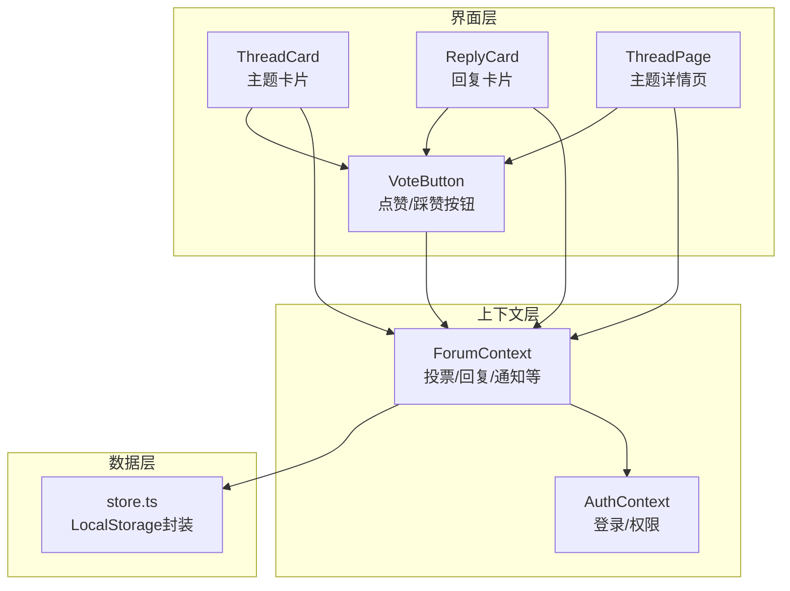
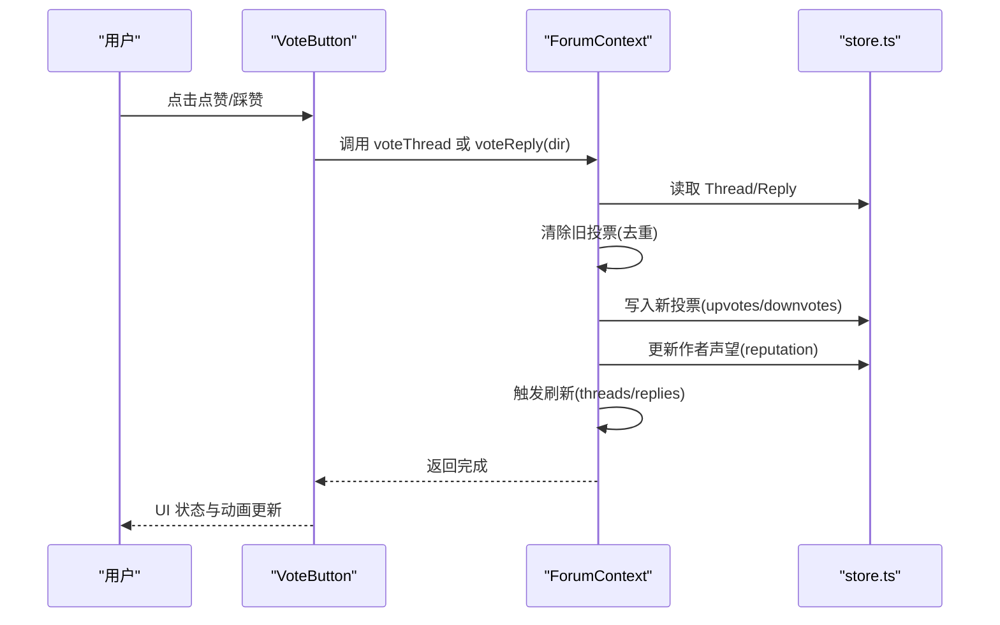
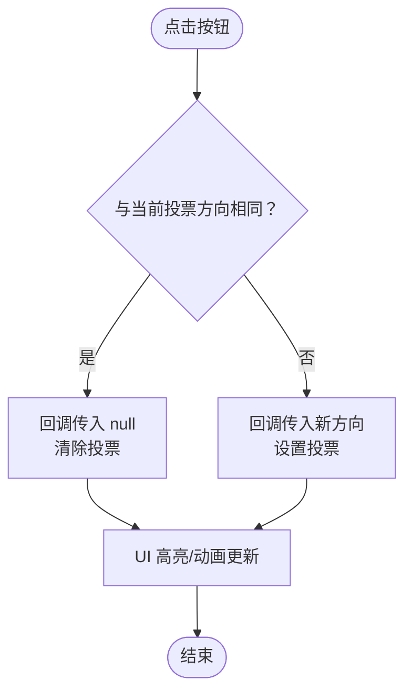
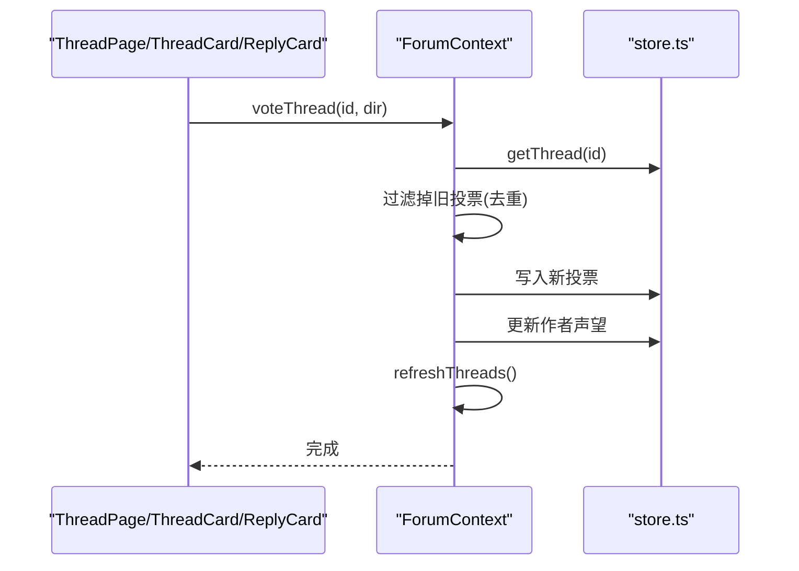
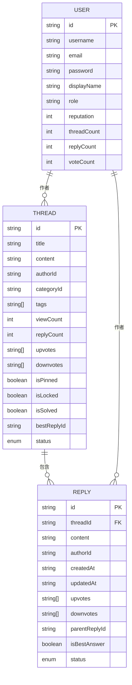
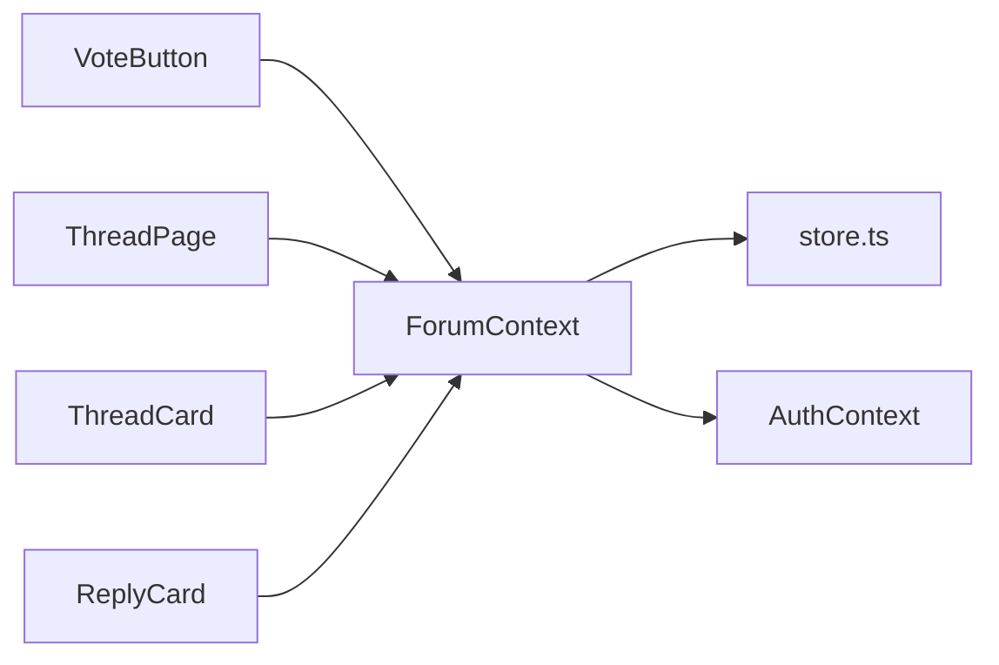

# 投票机制

<cite>
**本文引用的文件**
- [apps/forum/src/components/thread/VoteButton.tsx](file://apps/forum/src/components/thread/VoteButton.tsx)
- [apps/forum/src/context/ForumContext.tsx](file://apps/forum/src/context/ForumContext.tsx)
- [apps/forum/src/data/store.ts](file://apps/forum/src/data/store.ts)
- [apps/forum/src/times/index.ts](file://apps/forum/src/times/index.ts)
- [apps/forum/src/pages/ThreadPage.tsx](file://apps/forum/src/pages/ThreadPage.tsx)
- [apps/forum/src/components/thread/ThreadCard.tsx](file://apps/forum/src/components/thread/ThreadCard.tsx)
- [apps/forum/src/components/reply/ReplyCard.tsx](file://apps/forum/src/components/reply/ReplyCard.tsx)
- [apps/forum/src/context/AuthContext.tsx](file://apps/forum/src/context/AuthContext.tsx)
- [apps/forum/src/App.tsx](file://apps/forum/src/App.tsx)
</cite>

## 目录
1. [简介](#简介)
2. [项目结构](#项目结构)
3. [核心组件](#核心组件)
4. [架构总览](#架构总览)
5. [详细组件分析](#详细组件分析)
6. [依赖关系分析](#依赖关系分析)
7. [性能考量](#性能考量)
8. [故障排除指南](#故障排除指南)
9. [结论](#结论)
10. [附录](#附录)

## 简介
本文件聚焦社区论坛的投票机制，围绕 VoteButton 组件与 ForumContext 上下文展开，系统阐述点赞/踩赞的用户交互、状态切换动画、投票数据存储结构、统计计算与实时更新、投票历史记录与重复投票防护、权限控制，以及投票 API 的设计思路、数据一致性保障与性能优化策略，并提供使用示例与故障排除建议。

## 项目结构
投票功能涉及以下关键模块：
- UI 组件层：VoteButton 用于展示与交互；ThreadCard、ReplyCard 展示列表与详情页中的投票按钮。
- 上下文层：ForumContext 提供投票相关业务方法与状态管理。
- 数据层：store.ts 封装本地持久化与种子数据，负责投票数据的读写。
- 权限层：AuthContext 提供登录态与角色判断，影响投票与管理权限。
- 页面层：ThreadPage 展示线程详情并集成投票按钮；各卡片组件复用投票按钮。

图表来源
- [apps/forum/src/components/thread/VoteButton.tsx:1-60](file://apps/forum/src/components/thread/VoteButton.tsx#L1-L60)
- [apps/forum/src/context/ForumContext.tsx:1-313](file://apps/forum/src/context/ForumContext.tsx#L1-L313)
- [apps/forum/src/data/store.ts:260-399](file://apps/forum/src/data/store.ts#L260-L399)
- [apps/forum/src/context/AuthContext.tsx:1-93](file://apps/forum/src/context/AuthContext.tsx#L1-L93)
- [apps/forum/src/pages/ThreadPage.tsx:1-272](file://apps/forum/src/pages/ThreadPage.tsx#L1-L272)
- [apps/forum/src/components/thread/ThreadCard.tsx:1-118](file://apps/forum/src/components/thread/ThreadCard.tsx#L1-L118)
- [apps/forum/src/components/reply/ReplyCard.tsx:1-118](file://apps/forum/src/components/reply/ReplyCard.tsx#L1-L118)

章节来源
- [apps/forum/src/App.tsx:1-49](file://apps/forum/src/App.tsx#L1-L49)
- [apps/forum/src/context/ForumContext.tsx:1-313](file://apps/forum/src/context/ForumContext.tsx#L1-L313)
- [apps/forum/src/data/store.ts:260-399](file://apps/forum/src/data/store.ts#L260-L399)

## 核心组件
- VoteButton：提供点赞/踩赞按钮与分数显示，支持尺寸与水平布局，内置点击切换与动画类名。
- ForumContext：提供 voteThread、getThreadVote、voteReply、getReplyVote 等投票相关方法，负责投票历史记录、重复投票防护、作者声望变更与实时刷新。
- store.ts：以 LocalStorage 为基础的轻量数据存储，提供 Thread/Reply/User/Notification 等 CRUD 与搜索。
- AuthContext：提供登录态与角色，用于投票权限与管理操作的前置条件。
- ThreadPage/ThreadCard/ReplyCard：在页面与卡片中集成 VoteButton，计算分数并调用上下文方法。

章节来源
- [apps/forum/src/components/thread/VoteButton.tsx:1-60](file://apps/forum/src/components/thread/VoteButton.tsx#L1-L60)
- [apps/forum/src/context/ForumContext.tsx:84-200](file://apps/forum/src/context/ForumContext.tsx#L84-L200)
- [apps/forum/src/data/store.ts:315-399](file://apps/forum/src/data/store.ts#L315-L399)
- [apps/forum/src/context/AuthContext.tsx:17-86](file://apps/forum/src/context/AuthContext.tsx#L17-L86)
- [apps/forum/src/pages/ThreadPage.tsx:150-163](file://apps/forum/src/pages/ThreadPage.tsx#L150-L163)
- [apps/forum/src/components/thread/ThreadCard.tsx:29-35](file://apps/forum/src/components/thread/ThreadCard.tsx#L29-L35)
- [apps/forum/src/components/reply/ReplyCard.tsx:46-51](file://apps/forum/src/components/reply/ReplyCard.tsx#L46-L51)

## 架构总览
投票机制采用“组件-上下文-数据存储-权限”的分层设计：
- 组件层：VoteButton 仅负责 UI 行为与样式，不直接访问存储。
- 上下文层：ForumContext 负责投票业务规则、重复投票防护、作者声望变更与全局刷新。
- 数据层：store.ts 封装 CRUD 与初始化，使用 LocalStorage 存储。
- 权限层：AuthContext 提供 user 与角色，决定是否允许投票与管理操作。

图表来源
- [apps/forum/src/components/thread/VoteButton.tsx:14-20](file://apps/forum/src/components/thread/VoteButton.tsx#L14-L20)
- [apps/forum/src/context/ForumContext.tsx:84-107](file://apps/forum/src/context/ForumContext.tsx#L84-L107)
- [apps/forum/src/data/store.ts:328-352](file://apps/forum/src/data/store.ts#L328-L352)

## 详细组件分析

### VoteButton 组件
- 功能要点
  - 接收分数、当前投票方向、回调函数与尺寸/布局参数。
  - 点击同一方向即“取消投票”（切换为 null），点击不同方向则“切换为该方向”。
  - 根据当前投票方向设置按钮样式与图标动画类名。
- 交互与动画
  - 点赞/踩赞按钮在当前方向被选中时高亮并带弹跳动画类名。
  - 分数根据正负值显示不同颜色，便于快速识别。
- 尺寸与布局
  - 支持 sm/md 尺寸与水平/垂直布局，适配移动端与桌面端。

图表来源
- [apps/forum/src/components/thread/VoteButton.tsx:14-20](file://apps/forum/src/components/thread/VoteButton.tsx#L14-L20)
- [apps/forum/src/components/thread/VoteButton.tsx:37-55](file://apps/forum/src/components/thread/VoteButton.tsx#L37-L55)

章节来源
- [apps/forum/src/components/thread/VoteButton.tsx:1-60](file://apps/forum/src/components/thread/VoteButton.tsx#L1-L60)

### ForumContext 上下文（投票状态管理）
- 投票方法
  - voteThread(threadId, direction)：移除用户在该主题上的旧投票，写入新投票，更新作者声望，触发 threads 刷新。
  - voteReply(replyId, direction)：同上，针对回复。
  - getThreadVote/getReplyVote：根据当前用户查询其对该主题/回复的投票方向。
- 重复投票防护
  - 在写入新投票前，先从 upvotes/downvotes 数组中移除该用户的旧投票记录，确保“一次一票”。
- 作者声望变更
  - 点赞作者+10，踩赞作者最多扣2（不小于0），避免负值。
- 实时更新
  - 投票后调用 refreshThreads 或局部刷新键，使 UI 即时反映分数与高亮状态。
- 权限控制
  - 所有投票方法均在 user 存在时才执行，未登录用户无法投票。
  - 管理操作如置顶/锁定/隐藏主题由角色 admin/moderator 控制。

图表来源
- [apps/forum/src/context/ForumContext.tsx:84-107](file://apps/forum/src/context/ForumContext.tsx#L84-L107)
- [apps/forum/src/context/ForumContext.tsx:169-190](file://apps/forum/src/context/ForumContext.tsx#L169-L190)
- [apps/forum/src/data/store.ts:328-352](file://apps/forum/src/data/store.ts#L328-L352)

章节来源
- [apps/forum/src/context/ForumContext.tsx:84-200](file://apps/forum/src/context/ForumContext.tsx#L84-L200)

### 数据存储结构与统计计算
- Thread/Reply 投票字段
  - Thread：upvotes/downvotes 为用户 ID 数组，分别记录点赞/踩赞用户集合。
  - Reply：同上。
- 统计计算
  - 分数 = upvotes.length - downvotes.length，用于 UI 展示与排序。
- 初始化与持久化
  - 初始化时写入种子数据，包含多条带投票记录的主题与回复。
  - CRUD 方法统一通过 LocalStorage 读写，支持搜索与通知管理。

图表来源
- [apps/forum/src/times/index.ts:51-83](file://apps/forum/src/times/index.ts#L51-L83)
- [apps/forum/src/data/store.ts:140-250](file://apps/forum/src/data/store.ts#L140-L250)

章节来源
- [apps/forum/src/times/index.ts:51-83](file://apps/forum/src/times/index.ts#L51-L83)
- [apps/forum/src/data/store.ts:315-399](file://apps/forum/src/data/store.ts#L315-L399)

### 页面与卡片中的投票集成
- ThreadPage
  - 计算分数与当前投票方向，将 VoteButton 嵌入详情页侧边栏与移动端区域。
  - 通过 useForum 的 voteThread 与 getThreadVote 完成交互。
- ThreadCard
  - 在列表中复用 VoteButton，支持移动端水平布局。
- ReplyCard
  - 在回复卡片中嵌入 VoteButton，支持回复级投票与最佳回答标记。

章节来源
- [apps/forum/src/pages/ThreadPage.tsx:76-77](file://apps/forum/src/pages/ThreadPage.tsx#L76-L77)
- [apps/forum/src/pages/ThreadPage.tsx:150-163](file://apps/forum/src/pages/ThreadPage.tsx#L150-L163)
- [apps/forum/src/components/thread/ThreadCard.tsx:19-20](file://apps/forum/src/components/thread/ThreadCard.tsx#L19-L20)
- [apps/forum/src/components/thread/ThreadCard.tsx:30-34](file://apps/forum/src/components/thread/ThreadCard.tsx#L30-L34)
- [apps/forum/src/components/reply/ReplyCard.tsx:22-23](file://apps/forum/src/components/reply/ReplyCard.tsx#L22-L23)
- [apps/forum/src/components/reply/ReplyCard.tsx:46-51](file://apps/forum/src/components/reply/ReplyCard.tsx#L46-L51)

## 依赖关系分析
- 组件依赖
  - ThreadPage/ThreadCard/ReplyCard 依赖 VoteButton 与 ForumContext。
  - VoteButton 仅依赖样式与图标库，无业务耦合。
- 上下文依赖
  - ForumContext 依赖 store.ts 进行数据读写，依赖 AuthContext 获取 user。
- 数据依赖
  - store.ts 依赖 @tao/shared 的生成 ID 工具与浏览器 LocalStorage。

图表来源
- [apps/forum/src/components/thread/VoteButton.tsx:1-11](file://apps/forum/src/components/thread/VoteButton.tsx#L1-L11)
- [apps/forum/src/context/ForumContext.tsx:1-6](file://apps/forum/src/context/ForumContext.tsx#L1-L6)
- [apps/forum/src/data/store.ts:6-7](file://apps/forum/src/data/store.ts#L6-L7)
- [apps/forum/src/context/AuthContext.tsx:1-4](file://apps/forum/src/context/AuthContext.tsx#L1-L4)

章节来源
- [apps/forum/src/components/thread/VoteButton.tsx:1-11](file://apps/forum/src/components/thread/VoteButton.tsx#L1-L11)
- [apps/forum/src/context/ForumContext.tsx:1-6](file://apps/forum/src/context/ForumContext.tsx#L1-L6)
- [apps/forum/src/data/store.ts:6-7](file://apps/forum/src/data/store.ts#L6-L7)
- [apps/forum/src/context/AuthContext.tsx:1-4](file://apps/forum/src/context/AuthContext.tsx#L1-L4)

## 性能考量
- 本地存储与批量更新
  - store.ts 使用 LocalStorage，写入为 O(n) 查找 + O(1) 插入/删除，整体开销可控。
  - 投票后通过 refreshThreads 或局部刷新键触发重渲染，避免全量拉取。
- 重复投票防护
  - 通过数组过滤实现 O(n) 去重，n 通常很小（用户数），可接受。
- 分数计算
  - 每次渲染重新计算分数，复杂度 O(1)，成本极低。
- 建议优化
  - 若用户数增长，可将 upvotes/downvotes 改为 Set 结构以提升查找效率。
  - 对于大量主题/回复，可引入虚拟列表与懒加载，减少渲染压力。
  - 将 getThreadVote/getReplyVote 缓存到组件内部或上下文，避免重复查询。

## 故障排除指南
- 无法投票
  - 检查是否登录：未登录用户无法调用投票方法。
  - 检查目标是否存在：voteThread/voteReply 会在找不到对象时直接返回。
- 投票未生效
  - 确认是否重复投票：系统会自动移除旧投票，若仍无效，检查 LocalStorage 是否被清空。
  - 确认作者声望变更：若作者不是自己，点赞/踩赞应触发声望变化。
- UI 不刷新
  - 确认是否调用了 refreshThreads 或局部刷新键。
- 数据丢失
  - store.ts 初始化会重置 LocalStorage，请在开发阶段注意初始化调用位置。

章节来源
- [apps/forum/src/context/ForumContext.tsx:84-107](file://apps/forum/src/context/ForumContext.tsx#L84-L107)
- [apps/forum/src/context/ForumContext.tsx:169-190](file://apps/forum/src/context/ForumContext.tsx#L169-L190)
- [apps/forum/src/data/store.ts:284-311](file://apps/forum/src/data/store.ts#L284-L311)

## 结论
本投票机制以 VoteButton 为核心，结合 ForumContext 的业务规则与 store.ts 的本地持久化，实现了简洁高效的点赞/踩赞功能。通过重复投票防护、作者声望激励与实时刷新，既保证了用户体验，又维持了数据一致性。未来可在数据结构与渲染性能上进一步优化，以支撑更大规模的社区场景。

## 附录

### 投票 API 接口设计（概念性）
- 线程投票
  - 方法：POST /api/thread/{id}/vote
  - 参数：direction（'up'|'down'|null）
  - 返回：更新后的 Thread（含 upvotes/downvotes 与作者 reputation）
- 回复投票
  - 方法：POST /api/reply/{id}/vote
  - 参数：direction（'up'|'down'|null）
  - 返回：更新后的 Reply（含 upvotes/downvotes 与作者 reputation）

### 数据一致性与并发控制
- 前端一致性
  - 通过上下文层的去重与原子写入，保证同一用户在同一对象上只保留一条投票记录。
- 并发冲突
  - 当前实现为单用户本地存储，无跨标签页并发问题。
  - 如接入后端，需引入乐观锁或版本号以避免并发覆盖。

### 使用示例（路径指引）
- 在主题详情页集成投票按钮
  - 路径：[apps/forum/src/pages/ThreadPage.tsx:150-163](file://apps/forum/src/pages/ThreadPage.tsx#L150-L163)
- 在主题卡片中集成投票按钮
  - 路径：[apps/forum/src/components/thread/ThreadCard.tsx:30-34](file://apps/forum/src/components/thread/ThreadCard.tsx#L30-L34)
- 在回复卡片中集成投票按钮
  - 路径：[apps/forum/src/components/reply/ReplyCard.tsx:46-51](file://apps/forum/src/components/reply/ReplyCard.tsx#L46-L51)