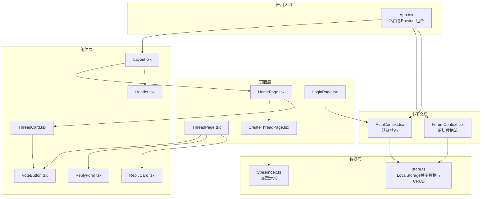
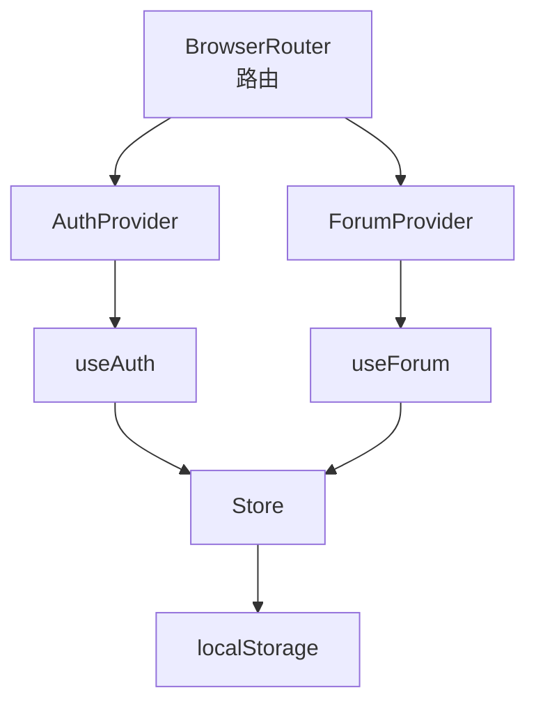
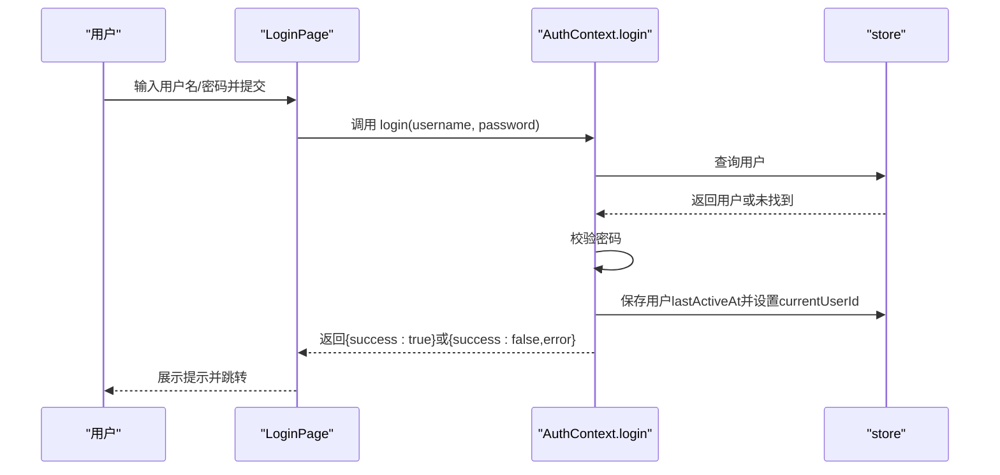
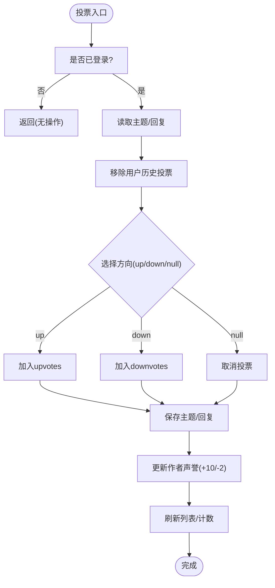
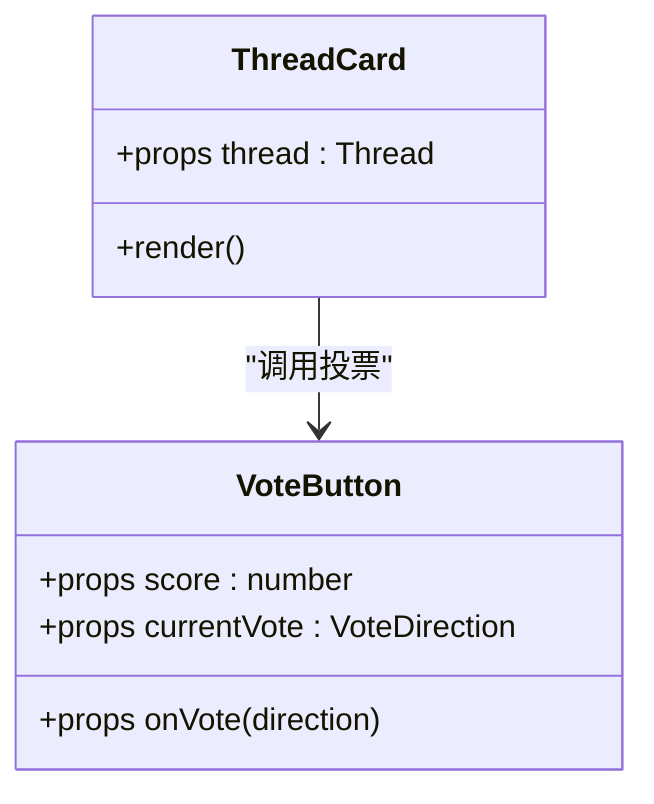
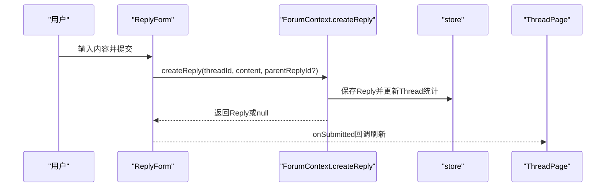
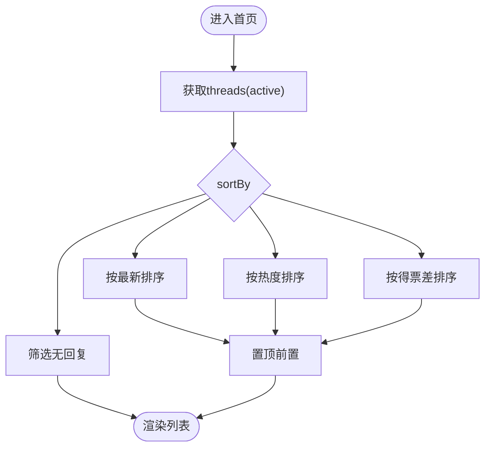
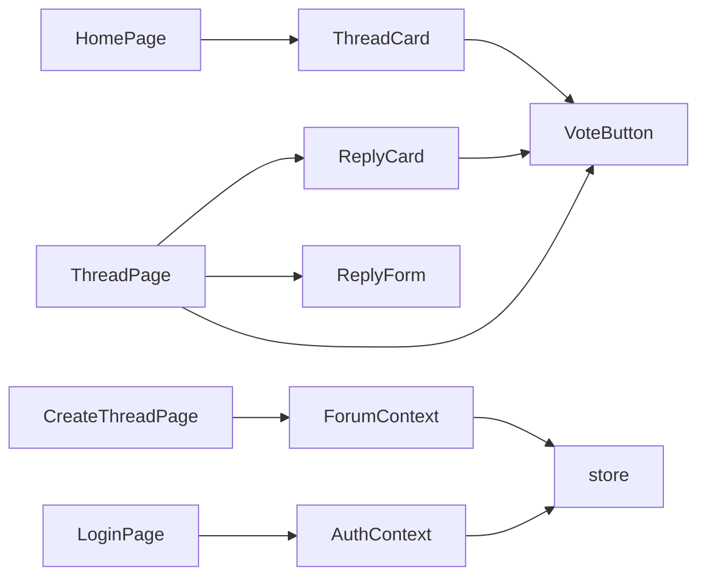

# 社区论坛

<cite>
**本文引用的文件**
- [apps/forum/src/App.tsx](file://apps/forum/src/App.tsx)
- [apps/forum/src/context/AuthContext.tsx](file://apps/forum/src/context/AuthContext.tsx)
- [apps/forum/src/context/ForumContext.tsx](file://apps/forum/src/context/ForumContext.tsx)
- [apps/forum/src/data/store.ts](file://apps/forum/src/data/store.ts)
- [apps/forum/src/components/thread/ThreadCard.tsx](file://apps/forum/src/components/thread/ThreadCard.tsx)
- [apps/forum/src/components/thread/VoteButton.tsx](file://apps/forum/src/components/thread/VoteButton.tsx)
- [apps/forum/src/components/reply/ReplyCard.tsx](file://apps/forum/src/components/reply/ReplyCard.tsx)
- [apps/forum/src/components/reply/ReplyForm.tsx](file://apps/forum/src/components/reply/ReplyForm.tsx)
- [apps/forum/src/pages/HomePage.tsx](file://apps/forum/src/pages/HomePage.tsx)
- [apps/forum/src/pages/ThreadPage.tsx](file://apps/forum/src/pages/ThreadPage.tsx)
- [apps/forum/src/pages/CreateThreadPage.tsx](file://apps/forum/src/pages/CreateThreadPage.tsx)
- [apps/forum/src/pages/LoginPage.tsx](file://apps/forum/src/pages/LoginPage.tsx)
- [apps/forum/src/types/index.ts](file://apps/forum/src/types/index.ts)
- [apps/forum/src/components/layout/Header.tsx](file://apps/forum/src/components/layout/Header.tsx)
- [apps/forum/src/components/layout/Layout.tsx](file://apps/forum/src/components/layout/Layout.tsx)
</cite>

## 目录
1. [简介](#简介)
2. [项目结构](#项目结构)
3. [核心组件](#核心组件)
4. [架构总览](#架构总览)
5. [详细组件分析](#详细组件分析)
6. [依赖关系分析](#依赖关系分析)
7. [性能考量](#性能考量)
8. [故障排查指南](#故障排查指南)
9. [结论](#结论)
10. [附录](#附录)

## 简介
本项目是一个基于 React 的社区论坛应用，围绕“主题讨论、回复管理、用户认证、投票系统”等核心功能构建。应用采用本地存储模拟数据与状态管理，提供完整的用户交互流程：注册登录、主题创建与浏览、回复与嵌套评论、点赞/踩投票、最佳答案标记、通知与搜索、以及管理员/版主的治理能力（置顶、锁定、隐藏、删除）。文档面向社区运营者与开发者，既提供高层架构说明，也包含组件级实现细节与最佳实践。

## 项目结构
应用位于多包工作区中的 forum 子应用，核心入口与路由配置在应用根部，上下文提供者贯穿全局，页面组件负责业务视图，UI 组件封装交互与展示，数据层通过本地存储提供种子数据与 CRUD 能力。

**图表来源**
- [apps/forum/src/App.tsx:1-49](file://apps/forum/src/App.tsx#L1-L49)
- [apps/forum/src/context/AuthContext.tsx:1-93](file://apps/forum/src/context/AuthContext.tsx#L1-L93)
- [apps/forum/src/context/ForumContext.tsx:1-313](file://apps/forum/src/context/ForumContext.tsx#L1-L313)
- [apps/forum/src/data/store.ts:1-399](file://apps/forum/src/data/store.ts#L1-L399)
- [apps/forum/src/components/layout/Layout.tsx:1-21](file://apps/forum/src/components/layout/Layout.tsx#L1-L21)
- [apps/forum/src/components/layout/Header.tsx:1-188](file://apps/forum/src/components/layout/Header.tsx#L1-L188)
- [apps/forum/src/components/thread/ThreadCard.tsx:1-118](file://apps/forum/src/components/thread/ThreadCard.tsx#L1-L118)
- [apps/forum/src/components/thread/VoteButton.tsx:1-60](file://apps/forum/src/components/thread/VoteButton.tsx#L1-L60)
- [apps/forum/src/components/reply/ReplyCard.tsx:1-118](file://apps/forum/src/components/reply/ReplyCard.tsx#L1-L118)
- [apps/forum/src/components/reply/ReplyForm.tsx:1-69](file://apps/forum/src/components/reply/ReplyForm.tsx#L1-L69)
- [apps/forum/src/pages/HomePage.tsx:1-122](file://apps/forum/src/pages/HomePage.tsx#L1-L122)
- [apps/forum/src/pages/ThreadPage.tsx:1-272](file://apps/forum/src/pages/ThreadPage.tsx#L1-L272)
- [apps/forum/src/pages/CreateThreadPage.tsx:1-161](file://apps/forum/src/pages/CreateThreadPage.tsx#L1-L161)
- [apps/forum/src/pages/LoginPage.tsx:1-93](file://apps/forum/src/pages/LoginPage.tsx#L1-L93)
- [apps/forum/src/types/index.ts:1-107](file://apps/forum/src/types/index.ts#L1-L107)

**章节来源**
- [apps/forum/src/App.tsx:1-49](file://apps/forum/src/App.tsx#L1-L49)
- [apps/forum/src/context/AuthContext.tsx:1-93](file://apps/forum/src/context/AuthContext.tsx#L1-L93)
- [apps/forum/src/context/ForumContext.tsx:1-313](file://apps/forum/src/context/ForumContext.tsx#L1-L313)
- [apps/forum/src/data/store.ts:1-399](file://apps/forum/src/data/store.ts#L1-L399)
- [apps/forum/src/types/index.ts:1-107](file://apps/forum/src/types/index.ts#L1-L107)

## 核心组件
- 认证上下文（AuthContext）
  - 负责用户登录、注册、登出与资料更新；持久化当前用户 ID；提供认证状态与回调。
- 论坛上下文（ForumContext）
  - 负责主题与回复的创建、投票、最佳答案标记、回复检索、通知管理、主题治理（置顶/锁定/隐藏/删除）。
- 数据存储（store）
  - 提供种子数据与 CRUD 操作，基于 localStorage 模拟后端数据层。
- UI 组件
  - 主题卡片、投票按钮、回复卡片与表单、页头导航与布局容器。
- 页面组件
  - 首页、主题详情、发帖页、登录页等，串联上下文与 UI 组件完成业务流程。

**章节来源**
- [apps/forum/src/context/AuthContext.tsx:17-92](file://apps/forum/src/context/AuthContext.tsx#L17-L92)
- [apps/forum/src/context/ForumContext.tsx:34-312](file://apps/forum/src/context/ForumContext.tsx#L34-L312)
- [apps/forum/src/data/store.ts:284-398](file://apps/forum/src/data/store.ts#L284-L398)
- [apps/forum/src/components/thread/ThreadCard.tsx:14-117](file://apps/forum/src/components/thread/ThreadCard.tsx#L14-L117)
- [apps/forum/src/components/thread/VoteButton.tsx:13-59](file://apps/forum/src/components/thread/VoteButton.tsx#L13-L59)
- [apps/forum/src/components/reply/ReplyCard.tsx:18-117](file://apps/forum/src/components/reply/ReplyCard.tsx#L18-L117)
- [apps/forum/src/components/reply/ReplyForm.tsx:15-68](file://apps/forum/src/components/reply/ReplyForm.tsx#L15-L68)
- [apps/forum/src/pages/HomePage.tsx:18-121](file://apps/forum/src/pages/HomePage.tsx#L18-L121)
- [apps/forum/src/pages/ThreadPage.tsx:17-271](file://apps/forum/src/pages/ThreadPage.tsx#L17-L271)
- [apps/forum/src/pages/CreateThreadPage.tsx:9-160](file://apps/forum/src/pages/CreateThreadPage.tsx#L9-L160)
- [apps/forum/src/pages/LoginPage.tsx:7-92](file://apps/forum/src/pages/LoginPage.tsx#L7-L92)

## 架构总览
应用采用“上下文驱动 + 本地存储”的轻量架构：路由在顶层装配 Provider，页面通过自定义 hook 访问上下文，UI 组件以函数式方式组合，数据通过 store 封装统一访问。认证与论坛两大上下文分别管理用户态与业务态，彼此解耦并通过 store 协作。

**图表来源**
- [apps/forum/src/App.tsx:21-46](file://apps/forum/src/App.tsx#L21-L46)
- [apps/forum/src/context/AuthContext.tsx:17-85](file://apps/forum/src/context/AuthContext.tsx#L17-L85)
- [apps/forum/src/context/ForumContext.tsx:34-305](file://apps/forum/src/context/ForumContext.tsx#L34-L305)
- [apps/forum/src/data/store.ts:284-398](file://apps/forum/src/data/store.ts#L284-L398)

## 详细组件分析

### 认证上下文（AuthContext）
- 关键职责
  - 登录：校验用户并持久化当前用户 ID。
  - 注册：去重用户名与邮箱，生成新用户并设置初始属性。
  - 登出：清除当前用户 ID。
  - 更新资料：合并更新并保存。
- 数据来源
  - 通过 store.getUser/getUserByUsername/saveUser/currentUserId 管理用户数据与会话。
- 错误处理
  - 用户名不存在、密码错误、重复注册等场景返回错误信息。

**图表来源**
- [apps/forum/src/pages/LoginPage.tsx:16-31](file://apps/forum/src/pages/LoginPage.tsx#L16-L31)
- [apps/forum/src/context/AuthContext.tsx:28-37](file://apps/forum/src/context/AuthContext.tsx#L28-L37)
- [apps/forum/src/data/store.ts:317-325](file://apps/forum/src/data/store.ts#L317-L325)

**章节来源**
- [apps/forum/src/context/AuthContext.tsx:17-92](file://apps/forum/src/context/AuthContext.tsx#L17-L92)
- [apps/forum/src/pages/LoginPage.tsx:7-92](file://apps/forum/src/pages/LoginPage.tsx#L7-L92)
- [apps/forum/src/data/store.ts:317-325](file://apps/forum/src/data/store.ts#L317-L325)

### 论坛上下文（ForumContext）
- 主题管理
  - 创建主题：填充作者、时间戳、默认状态与统计。
  - 投票主题：移除旧投票，写入新方向，更新作者声誉。
  - 获取投票状态：根据当前用户在 up/down 中的状态返回方向。
  - 搜索主题：按标题/内容模糊匹配 active 状态。
- 回复管理
  - 创建回复：更新主题回复数与时间，通知作者，更新作者统计。
  - 投票回复：与主题类似，更新作者声誉。
  - 最佳答案：仅作者可标记，清除旧最佳并奖励作者。
  - 删除回复：软/硬删除（此处为本地删除）。
- 通知与治理
  - 添加通知、标记已读、批量已读。
  - 主题治理：togglePin/toggleLock/hideThread/deleteThread。
- 数据一致性
  - 通过 refreshThreads/setRefreshKey 触发 UI 重渲染。

**图表来源**
- [apps/forum/src/context/ForumContext.tsx:84-107](file://apps/forum/src/context/ForumContext.tsx#L84-L107)
- [apps/forum/src/context/ForumContext.tsx:169-190](file://apps/forum/src/context/ForumContext.tsx#L169-L190)
- [apps/forum/src/context/ForumContext.tsx:192-200](file://apps/forum/src/context/ForumContext.tsx#L192-L200)

**章节来源**
- [apps/forum/src/context/ForumContext.tsx:55-82](file://apps/forum/src/context/ForumContext.tsx#L55-L82)
- [apps/forum/src/context/ForumContext.tsx:122-167](file://apps/forum/src/context/ForumContext.tsx#L122-L167)
- [apps/forum/src/context/ForumContext.tsx:202-241](file://apps/forum/src/context/ForumContext.tsx#L202-L241)
- [apps/forum/src/context/ForumContext.tsx:247-256](file://apps/forum/src/context/ForumContext.tsx#L247-L256)
- [apps/forum/src/context/ForumContext.tsx:258-290](file://apps/forum/src/context/ForumContext.tsx#L258-L290)

### 主题卡片（ThreadCard）
- 展示字段：状态徽章（置顶/锁定/已解决）、分类、标题、标签、作者、时间、浏览/回复数、移动端投票。
- 交互：点击进入主题详情；桌面端显示投票按钮；支持置顶样式高亮。

**图表来源**
- [apps/forum/src/components/thread/ThreadCard.tsx:14-117](file://apps/forum/src/components/thread/ThreadCard.tsx#L14-L117)
- [apps/forum/src/components/thread/VoteButton.tsx:13-59](file://apps/forum/src/components/thread/VoteButton.tsx#L13-L59)

**章节来源**
- [apps/forum/src/components/thread/ThreadCard.tsx:14-117](file://apps/forum/src/components/thread/ThreadCard.tsx#L14-L117)

### 回复卡片与表单（ReplyCard/ReplyForm）
- ReplyCard
  - 展示作者、角色徽章、内容、时间、投票、动作菜单（举报/删除）、最佳答案标记（仅作者）。
  - 支持嵌套回复与内联回复表单。
- ReplyForm
  - 未登录引导至登录；表单校验与提交；成功后清空并触发刷新。

**图表来源**
- [apps/forum/src/components/reply/ReplyForm.tsx:34-50](file://apps/forum/src/components/reply/ReplyForm.tsx#L34-L50)
- [apps/forum/src/context/ForumContext.tsx:122-167](file://apps/forum/src/context/ForumContext.tsx#L122-L167)
- [apps/forum/src/data/store.ts:342-352](file://apps/forum/src/data/store.ts#L342-L352)
- [apps/forum/src/pages/ThreadPage.tsx:243-252](file://apps/forum/src/pages/ThreadPage.tsx#L243-L252)

**章节来源**
- [apps/forum/src/components/reply/ReplyCard.tsx:18-117](file://apps/forum/src/components/reply/ReplyCard.tsx#L18-L117)
- [apps/forum/src/components/reply/ReplyForm.tsx:15-68](file://apps/forum/src/components/reply/ReplyForm.tsx#L15-L68)
- [apps/forum/src/pages/ThreadPage.tsx:230-268](file://apps/forum/src/pages/ThreadPage.tsx#L230-L268)

### 首页与主题详情（HomePage/ThreadPage）
- HomePage
  - 排序选项：热门、最新、最高票、待回答；置顶始终优先；未登录显示引导。
- ThreadPage
  - 增加浏览计数；回复排序（最高票/最新/最早）；支持回复与嵌套；作者/版主菜单（置顶/锁定/隐藏/删除）；分享链接。

**图表来源**
- [apps/forum/src/pages/HomePage.tsx:23-47](file://apps/forum/src/pages/HomePage.tsx#L23-L47)

**章节来源**
- [apps/forum/src/pages/HomePage.tsx:18-121](file://apps/forum/src/pages/HomePage.tsx#L18-L121)
- [apps/forum/src/pages/ThreadPage.tsx:17-271](file://apps/forum/src/pages/ThreadPage.tsx#L17-L271)

### 发帖与登录（CreateThreadPage/LoginPage）
- CreateThreadPage
  - 标题/内容/分类/标签校验；最多5个标签；提交后跳转到新主题。
- LoginPage
  - 表单校验与登录结果提示；演示账号展示。

**章节来源**
- [apps/forum/src/pages/CreateThreadPage.tsx:9-160](file://apps/forum/src/pages/CreateThreadPage.tsx#L9-L160)
- [apps/forum/src/pages/LoginPage.tsx:7-92](file://apps/forum/src/pages/LoginPage.tsx#L7-L92)

### 布局与导航（Header/Layout）
- Header
  - 搜索、发帖按钮、通知（未读角标、批量已读）、用户菜单（个人主页/设置/管理面板/退出）。
- Layout
  - 组合 Header/Sidebar/Outlet，控制侧边栏开关。

**章节来源**
- [apps/forum/src/components/layout/Header.tsx:17-187](file://apps/forum/src/components/layout/Header.tsx#L17-L187)
- [apps/forum/src/components/layout/Layout.tsx:6-20](file://apps/forum/src/components/layout/Layout.tsx#L6-L20)

## 依赖关系分析
- 组件依赖
  - 页面组件依赖上下文 hook 与 UI 组件。
  - UI 组件依赖上下文 hook 与共享工具（格式化、类名合并）。
- 上下文依赖
  - ForumContext 与 AuthContext 均依赖 store 提供的数据访问。
- 数据依赖
  - store 依赖 @tao/shared 工具与 @tao/ui 组件库。

**图表来源**
- [apps/forum/src/pages/HomePage.tsx:18-121](file://apps/forum/src/pages/HomePage.tsx#L18-L121)
- [apps/forum/src/pages/ThreadPage.tsx:17-271](file://apps/forum/src/pages/ThreadPage.tsx#L17-L271)
- [apps/forum/src/pages/CreateThreadPage.tsx:9-160](file://apps/forum/src/pages/CreateThreadPage.tsx#L9-L160)
- [apps/forum/src/pages/LoginPage.tsx:7-92](file://apps/forum/src/pages/LoginPage.tsx#L7-L92)
- [apps/forum/src/context/ForumContext.tsx:34-312](file://apps/forum/src/context/ForumContext.tsx#L34-L312)
- [apps/forum/src/context/AuthContext.tsx:17-92](file://apps/forum/src/context/AuthContext.tsx#L17-L92)
- [apps/forum/src/data/store.ts:284-398](file://apps/forum/src/data/store.ts#L284-L398)

**章节来源**
- [apps/forum/src/types/index.ts:1-107](file://apps/forum/src/types/index.ts#L1-L107)

## 性能考量
- 渲染优化
  - 使用 useMemo 缓存排序后的主题列表与回复列表，减少不必要的重渲染。
  - 通过 refreshKey 与 setRefreshKey 触发局部重渲染，避免全量刷新。
- 本地存储
  - store 基于 localStorage，适合演示与小规模数据；生产环境建议迁移到后端 API，并引入分页与缓存策略。
- 交互反馈
  - 投票与回复提交使用禁用态与 Toast 提示，改善用户体验。

[本节为通用指导，无需特定文件来源]

## 故障排查指南
- 登录失败
  - 检查用户名是否存在与密码是否一致；查看返回的错误信息。
  - 参考路径：[apps/forum/src/context/AuthContext.tsx:28-37](file://apps/forum/src/context/AuthContext.tsx#L28-L37)
- 注册失败
  - 用户名或邮箱重复会导致注册失败；请更换唯一值。
  - 参考路径：[apps/forum/src/context/AuthContext.tsx:39-67](file://apps/forum/src/context/AuthContext.tsx#L39-L67)
- 投票无效
  - 未登录无法投票；重复点击同一方向会取消投票；检查 currentVote 状态。
  - 参考路径：[apps/forum/src/context/ForumContext.tsx:84-107](file://apps/forum/src/context/ForumContext.tsx#L84-L107)
- 回复无法提交
  - 未登录会被重定向至登录页；内容为空会弹出错误提示；提交后需等待刷新。
  - 参考路径：[apps/forum/src/components/reply/ReplyForm.tsx:23-50](file://apps/forum/src/components/reply/ReplyForm.tsx#L23-L50)
- 通知未读
  - 点击通知项会标记为已读并跳转；可使用“全部标为已读”。
  - 参考路径：[apps/forum/src/components/layout/Header.tsx:97-129](file://apps/forum/src/components/layout/Header.tsx#L97-L129)

**章节来源**
- [apps/forum/src/context/AuthContext.tsx:28-67](file://apps/forum/src/context/AuthContext.tsx#L28-L67)
- [apps/forum/src/context/ForumContext.tsx:84-107](file://apps/forum/src/context/ForumContext.tsx#L84-L107)
- [apps/forum/src/components/reply/ReplyForm.tsx:23-50](file://apps/forum/src/components/reply/ReplyForm.tsx#L23-L50)
- [apps/forum/src/components/layout/Header.tsx:97-129](file://apps/forum/src/components/layout/Header.tsx#L97-L129)

## 结论
本应用以清晰的上下文分层与本地存储为基础，实现了从用户认证到主题讨论、回复交互、投票与通知的完整闭环。页面与组件职责明确，便于扩展与维护。建议在生产环境中替换为真实后端 API，增加分页、全文检索与更完善的权限控制与内容审核流程。

[本节为总结性内容，无需特定文件来源]

## 附录

### 数据模型与类型
- 用户、主题、回复、分类、标签、通知、投票方向与排序类型均在类型定义文件中声明，确保组件间契约一致。

**章节来源**
- [apps/forum/src/types/index.ts:5-107](file://apps/forum/src/types/index.ts#L5-L107)

### 示例：用户注册与登录流程
- 注册
  - 通过 AuthContext.register 创建用户，设置初始属性并自动登录。
  - 参考路径：[apps/forum/src/context/AuthContext.tsx:39-67](file://apps/forum/src/context/AuthContext.tsx#L39-L67)
- 登录
  - 通过 AuthContext.login 校验用户并设置当前会话。
  - 参考路径：[apps/forum/src/context/AuthContext.tsx:28-37](file://apps/forum/src/context/AuthContext.tsx#L28-L37)

### 示例：主题创建与编辑
- 创建
  - 通过 ForumContext.createThread 填充作者、时间戳、默认状态与统计。
  - 参考路径：[apps/forum/src/context/ForumContext.tsx:55-82](file://apps/forum/src/context/ForumContext.tsx#L55-L82)
- 编辑
  - 当前版本未提供主题编辑接口；可在 store 与上下文中扩展相应方法。

### 示例：回复交互
- 发表回复
  - 通过 ReplyForm 调用 ForumContext.createReply，更新主题与作者统计。
  - 参考路径：[apps/forum/src/components/reply/ReplyForm.tsx:34-50](file://apps/forum/src/components/reply/ReplyForm.tsx#L34-L50)
- 标记最佳答案
  - 仅主题作者可执行，清除旧最佳并奖励作者声誉。
  - 参考路径：[apps/forum/src/context/ForumContext.tsx:202-241](file://apps/forum/src/context/ForumContext.tsx#L202-L241)

### 权限控制与社区治理
- 角色
  - user、moderator、admin；不同角色具备不同治理权限。
- 治理操作
  - 置顶/锁定/隐藏/删除主题；删除回复；标记最佳答案。
  - 参考路径：[apps/forum/src/context/ForumContext.tsx:268-290](file://apps/forum/src/context/ForumContext.tsx#L268-L290)