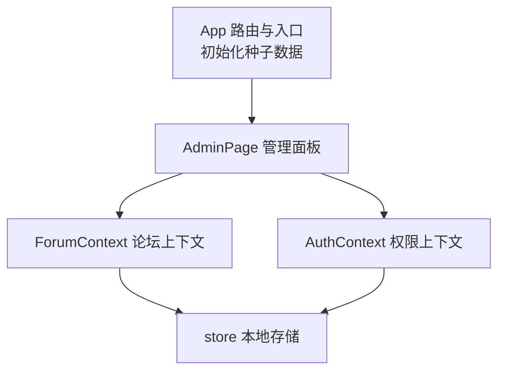
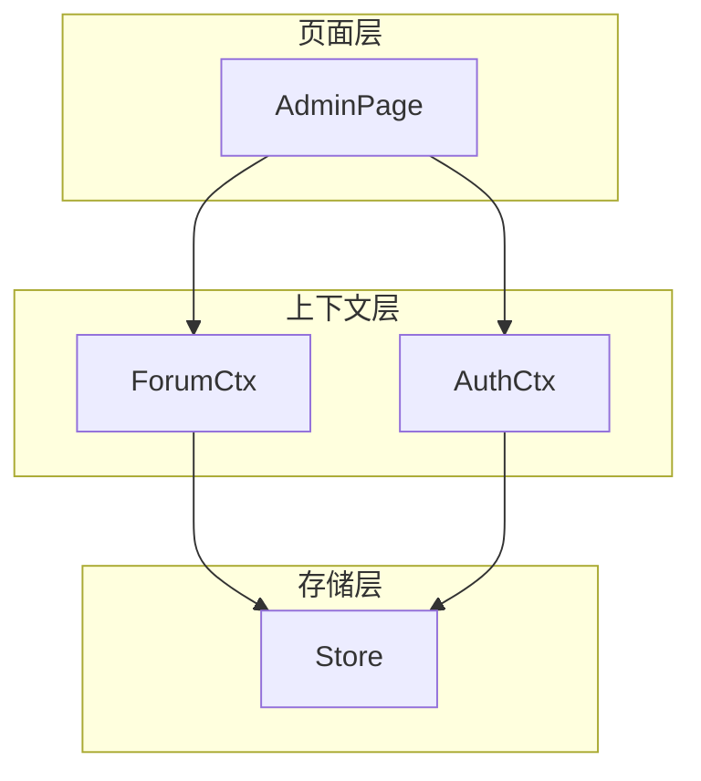
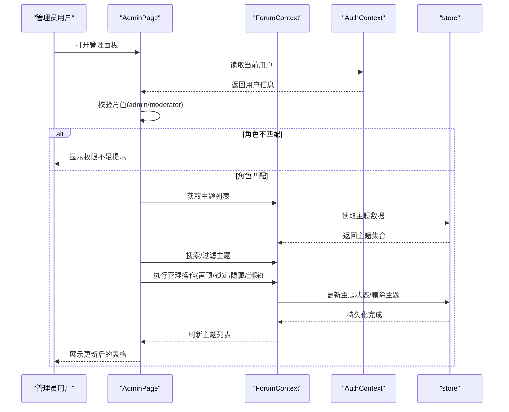
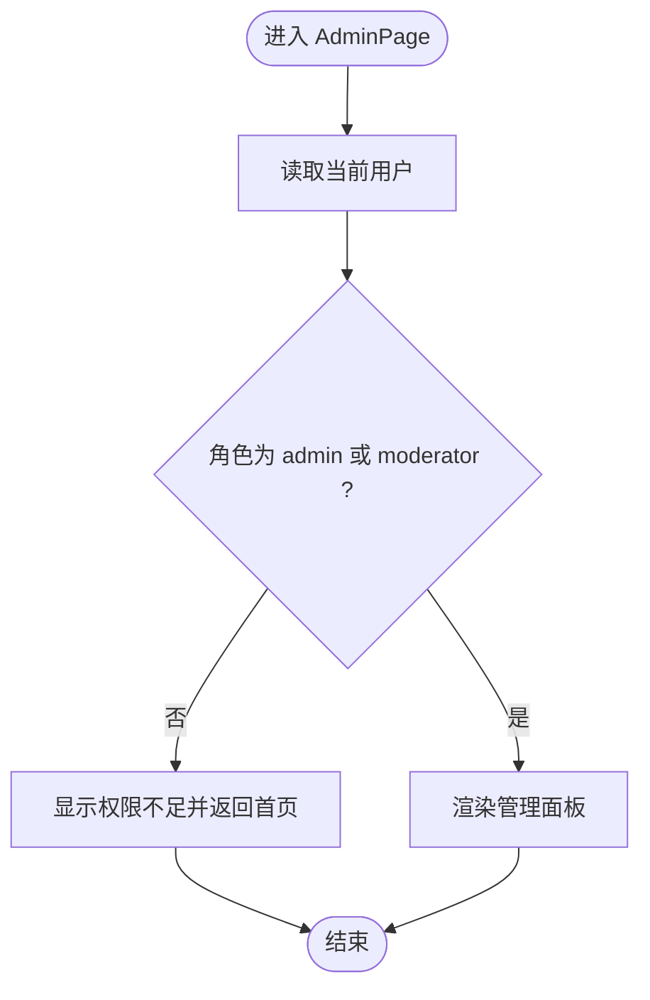
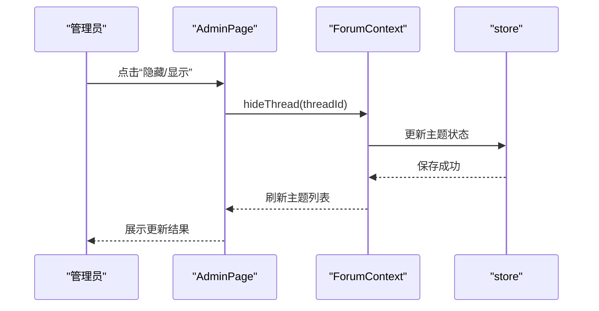
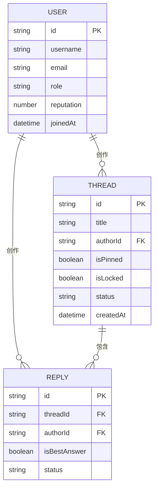
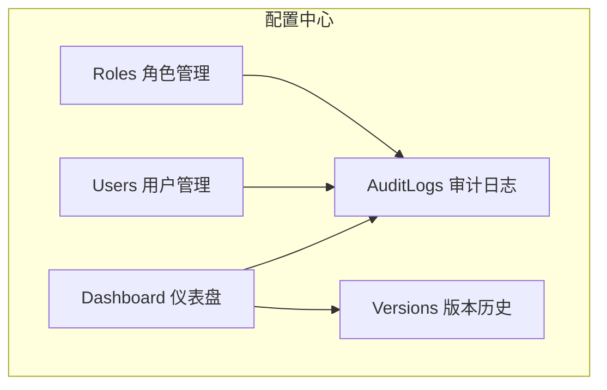
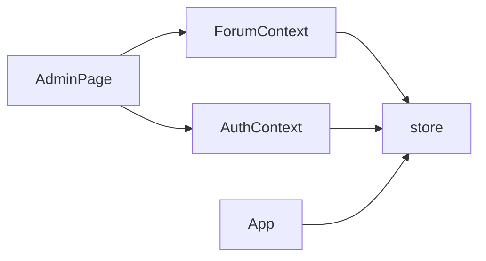

# 管理面板

<cite>
**本文引用的文件**
- [AdminPage.tsx](file://apps/forum/src/pages/AdminPage.tsx)
- [AuthContext.tsx](file://apps/forum/src/context/AuthContext.tsx)
- [ForumContext.tsx](file://apps/forum/src/context/ForumContext.tsx)
- [store.ts](file://apps/forum/src/data/store.ts)
- [index.ts](file://apps/forum/src/types/index.ts)
- [App.tsx](file://apps/forum/src/App.tsx)
- [ProtectedRoute.tsx](file://apps/config-center/src/components/ProtectedRoute.tsx)
- [authStore.ts](file://apps/config-center/src/store/authStore.ts)
- [RolesPage.tsx](file://apps/config-center/src/pages/RolesPage.tsx)
- [UsersPage.tsx](file://apps/config-center/src/pages/UsersPage.tsx)
- [AuditLogsPage.tsx](file://apps/config-center/src/pages/AuditLogsPage.tsx)
- [DashboardPage.tsx](file://apps/config-center/src/pages/DashboardPage.tsx)
- [VersionsPage.tsx](file://apps/config-center/src/pages/VersionsPage.tsx)
- [ConfigListPage.tsx](file://apps/config-center/src/pages/ConfigListPage.tsx)
</cite>

## 目录
1. [简介](#简介)
2. [项目结构](#项目结构)
3. [核心组件](#核心组件)
4. [架构总览](#架构总览)
5. [详细组件分析](#详细组件分析)
6. [依赖关系分析](#依赖关系分析)
7. [性能考量](#性能考量)
8. [故障排查指南](#故障排查指南)
9. [结论](#结论)
10. [附录](#附录)

## 简介
本文件为社区论坛管理面板的详细技术文档，聚焦 AdminPage 页面的功能设计与实现，涵盖用户管理、内容审核、权限控制与系统配置等维度。文档同时解释管理员权限验证机制、敏感操作的安全防护、批量操作能力、数据可视化与统计报表、日志审计与系统监控，并提供管理员工作流程、权限分配策略与内容治理规范，以及最佳实践与安全注意事项。

## 项目结构
管理面板位于论坛应用中，采用 React + Context + 本地存储的轻量架构：
- 路由与入口：App 组件负责初始化种子数据并挂载路由，管理面板路由指向 AdminPage。
- 权限上下文：AuthContext 提供登录、注册、登出与用户状态管理；ForumContext 提供论坛数据与管理操作。
- 数据存储：store.ts 封装本地存储的 CRUD 与查询方法，包含种子数据与初始化逻辑。
- 类型定义：统一声明用户、主题、回复、通知等核心类型。

图表来源
- [App.tsx:21-46](file://apps/forum/src/App.tsx#L21-L46)
- [AdminPage.tsx:15-32](file://apps/forum/src/pages/AdminPage.tsx#L15-L32)
- [AuthContext.tsx:17-86](file://apps/forum/src/context/AuthContext.tsx#L17-L86)
- [ForumContext.tsx:34-306](file://apps/forum/src/context/ForumContext.tsx#L34-L306)
- [store.ts:284-398](file://apps/forum/src/data/store.ts#L284-L398)

章节来源
- [App.tsx:18-19](file://apps/forum/src/App.tsx#L18-L19)
- [store.ts:284-306](file://apps/forum/src/data/store.ts#L284-L306)

## 核心组件
- 管理面板 AdminPage：提供内容管理、用户管理、举报处理三大板块，内置搜索与统计卡片，支持主题的置顶、锁定、隐藏与删除等操作。
- 权限上下文 AuthContext：提供登录、注册、登出与当前用户状态管理，用于 AdminPage 的权限校验。
- 论坛上下文 ForumContext：封装主题的增删改查、投票、最佳答案标记、通知等业务逻辑，并提供批量管理操作（如置顶、锁定、隐藏、删除）。
- 本地存储 store：以 localStorage 为基础的 CRUD 与查询接口，包含种子数据与初始化流程。

章节来源
- [AdminPage.tsx:15-242](file://apps/forum/src/pages/AdminPage.tsx#L15-L242)
- [AuthContext.tsx:6-92](file://apps/forum/src/context/AuthContext.tsx#L6-L92)
- [ForumContext.tsx:7-312](file://apps/forum/src/context/ForumContext.tsx#L7-L312)
- [store.ts:315-398](file://apps/forum/src/data/store.ts#L315-L398)

## 架构总览
管理面板采用“页面组件 + 上下文 + 存储”的分层设计：
- 页面层：AdminPage 负责 UI 呈现与交互，调用 ForumContext 的管理方法与 AuthContext 的用户信息。
- 上下文层：AuthContext 管理用户认证状态；ForumContext 管理论坛数据与业务操作。
- 存储层：store 提供统一的数据持久化与查询能力。

图表来源
- [AdminPage.tsx:15-32](file://apps/forum/src/pages/AdminPage.tsx#L15-L32)
- [AuthContext.tsx:17-86](file://apps/forum/src/context/AuthContext.tsx#L17-L86)
- [ForumContext.tsx:34-306](file://apps/forum/src/context/ForumContext.tsx#L34-L306)
- [store.ts:315-398](file://apps/forum/src/data/store.ts#L315-L398)

## 详细组件分析

### 管理面板 AdminPage 功能设计
- 权限验证：仅 admin 与 moderator 可访问，否则提示权限不足并引导返回首页。
- 统计卡片：展示总用户、总主题、隐藏内容、待处理举报等关键指标。
- 标签页切换：内容管理、用户管理、举报处理三类视图。
- 搜索功能：按标题或作者筛选内容与用户。
- 内容管理表格：支持置顶、锁定、隐藏/显示、删除主题，并提供跳转至主题详情。
- 用户管理表格：展示用户头像、角色、声望与注册时间，支持跳转至用户详情。
- 举报处理：展示举报类型、目标、举报人与时间，并提供忽略与处理按钮。

图表来源
- [AdminPage.tsx:23-32](file://apps/forum/src/pages/AdminPage.tsx#L23-L32)
- [ForumContext.tsx:258-290](file://apps/forum/src/context/ForumContext.tsx#L258-L290)
- [store.ts:328-339](file://apps/forum/src/data/store.ts#L328-L339)

章节来源
- [AdminPage.tsx:15-242](file://apps/forum/src/pages/AdminPage.tsx#L15-L242)
- [ForumContext.tsx:258-290](file://apps/forum/src/context/ForumContext.tsx#L258-L290)
- [store.ts:328-339](file://apps/forum/src/data/store.ts#L328-L339)

### 权限验证机制与安全防护
- 角色校验：AdminPage 在渲染阶段直接校验用户角色，非管理员/版主立即阻断并提示。
- 本地存储：AuthContext 通过 store.getCurrentUserId 与 store.getUser 实现登录态管理。
- 安全建议：当前实现为前端校验，生产环境需结合后端鉴权与 RBAC，前端仅作 UI 展示辅助。

图表来源
- [AdminPage.tsx:23-32](file://apps/forum/src/pages/AdminPage.tsx#L23-L32)
- [AuthContext.tsx:17-26](file://apps/forum/src/context/AuthContext.tsx#L17-L26)
- [store.ts:383-388](file://apps/forum/src/data/store.ts#L383-L388)

章节来源
- [AdminPage.tsx:23-32](file://apps/forum/src/pages/AdminPage.tsx#L23-L32)
- [AuthContext.tsx:17-26](file://apps/forum/src/context/AuthContext.tsx#L17-L26)
- [store.ts:383-388](file://apps/forum/src/data/store.ts#L383-L388)

### 敏感操作与批量管理
- 敏感操作：隐藏/显示主题、锁定/解锁主题、删除主题均通过 ForumContext 的回调触发，最终落地到 store 的持久化。
- 批量管理：当前 AdminPage 的表格未实现多选批量勾选，但可扩展为多选框 + 批量操作按钮，以减少重复点击。
- 确认与反馈：举报处理提供忽略/处理按钮，配合 toast 提示增强用户体验。

图表来源
- [AdminPage.tsx:151-154](file://apps/forum/src/pages/AdminPage.tsx#L151-L154)
- [ForumContext.tsx:284-290](file://apps/forum/src/context/ForumContext.tsx#L284-L290)
- [store.ts:328-335](file://apps/forum/src/data/store.ts#L328-L335)

章节来源
- [AdminPage.tsx:151-154](file://apps/forum/src/pages/AdminPage.tsx#L151-L154)
- [ForumContext.tsx:284-290](file://apps/forum/src/context/ForumContext.tsx#L284-L290)
- [store.ts:328-335](file://apps/forum/src/data/store.ts#L328-L335)

### 数据模型与上下文职责
- 用户模型：包含角色、声望、统计字段等，用于权限与治理。
- 主题模型：包含置顶、锁定、状态、投票等字段，支撑内容治理。
- 上下文职责：ForumContext 负责主题生命周期与治理操作；AuthContext 负责用户认证与状态。

图表来源
- [index.ts:7-83](file://apps/forum/src/types/index.ts#L7-L83)

章节来源
- [index.ts:5-107](file://apps/forum/src/types/index.ts#L5-L107)
- [ForumContext.tsx:34-306](file://apps/forum/src/context/ForumContext.tsx#L34-L306)

### 日志审计与系统监控（参考配置中心）
虽然论坛应用的 AdminPage 未内置审计日志与系统监控，但配置中心提供了完善的审计与监控范例，可作为扩展参考：
- 审计日志：支持按操作类型与资源搜索，展示操作者、资源、状态与时间。
- 仪表盘：展示配置总数、活跃配置、草稿配置与最近操作，支持环境分布可视化。
- 版本历史：按配置项查看变更版本、变更类型、操作者与变更原因。
- 用户与角色管理：支持用户与角色的增删改查与搜索过滤。

图表来源
- [DashboardPage.tsx:13-173](file://apps/config-center/src/pages/DashboardPage.tsx#L13-L173)
- [AuditLogsPage.tsx:11-161](file://apps/config-center/src/pages/AuditLogsPage.tsx#L11-L161)
- [VersionsPage.tsx:12-135](file://apps/config-center/src/pages/VersionsPage.tsx#L12-L135)
- [UsersPage.tsx:11-163](file://apps/config-center/src/pages/UsersPage.tsx#L11-L163)
- [RolesPage.tsx:11-169](file://apps/config-center/src/pages/RolesPage.tsx#L11-L169)

章节来源
- [DashboardPage.tsx:13-173](file://apps/config-center/src/pages/DashboardPage.tsx#L13-L173)
- [AuditLogsPage.tsx:11-161](file://apps/config-center/src/pages/AuditLogsPage.tsx#L11-L161)
- [VersionsPage.tsx:12-135](file://apps/config-center/src/pages/VersionsPage.tsx#L12-L135)
- [UsersPage.tsx:11-163](file://apps/config-center/src/pages/UsersPage.tsx#L11-L163)
- [RolesPage.tsx:11-169](file://apps/config-center/src/pages/RolesPage.tsx#L11-L169)

## 依赖关系分析
- AdminPage 依赖 AuthContext 获取用户角色，依赖 ForumContext 获取主题列表与执行治理操作，依赖 store 进行数据持久化。
- ForumContext 依赖 store 进行主题、回复、通知等数据的读写。
- AuthContext 依赖 store 进行用户与当前登录态的管理。
- App 初始化时调用 store.initializeStore 注入种子数据。

图表来源
- [AdminPage.tsx:17-18](file://apps/forum/src/pages/AdminPage.tsx#L17-L18)
- [ForumContext.tsx:35-36](file://apps/forum/src/context/ForumContext.tsx#L35-L36)
- [AuthContext.tsx:17-26](file://apps/forum/src/context/AuthContext.tsx#L17-L26)
- [App.tsx:18-19](file://apps/forum/src/App.tsx#L18-L19)

章节来源
- [AdminPage.tsx:17-18](file://apps/forum/src/pages/AdminPage.tsx#L17-L18)
- [ForumContext.tsx:35-36](file://apps/forum/src/context/ForumContext.tsx#L35-L36)
- [AuthContext.tsx:17-26](file://apps/forum/src/context/AuthContext.tsx#L17-L26)
- [App.tsx:18-19](file://apps/forum/src/App.tsx#L18-L19)

## 性能考量
- 渲染优化：AdminPage 使用 useMemo 与受控组件，避免不必要的重渲染；表格数据按需过滤与分页可进一步提升长列表性能。
- 存储效率：store 使用 localStorage，适合演示与小规模数据；生产环境建议迁移到后端数据库并引入分页与索引。
- 异步加载：举报处理与内容管理建议增加加载状态与骨架屏，提升交互流畅性。

## 故障排查指南
- 权限不足：确认当前用户角色是否为 admin 或 moderator；检查 AuthContext 的用户状态与 store 的当前登录用户 ID。
- 数据不一致：检查 store.initializeStore 是否正确执行；确认主题状态更新后是否触发 ForumContext 的刷新。
- 操作无响应：确认 ForumContext 的治理方法（如 hideThread、toggleLock）是否正确调用 store 的持久化方法。

章节来源
- [AdminPage.tsx:23-32](file://apps/forum/src/pages/AdminPage.tsx#L23-L32)
- [AuthContext.tsx:17-26](file://apps/forum/src/context/AuthContext.tsx#L17-L26)
- [store.ts:284-306](file://apps/forum/src/data/store.ts#L284-L306)
- [ForumContext.tsx:284-290](file://apps/forum/src/context/ForumContext.tsx#L284-L290)

## 结论
AdminPage 以简洁直观的方式实现了内容治理与用户管理的核心功能，结合 ForumContext 的治理能力与 store 的本地存储，形成完整的管理闭环。建议在生产环境中强化后端鉴权与审计日志体系，引入批量操作与分页加载，以提升安全性与可维护性。

## 附录

### 管理员工作流程与权限分配策略
- 工作流程：登录 → 角色校验 → 查看统计 → 选择标签页 → 搜索与筛选 → 执行治理操作 → 确认与反馈。
- 权限分配：admin 拥有最高权限，moderator 负责日常内容治理，普通用户仅可浏览与参与讨论。
- 内容治理规范：建立举报处理流程、敏感词过滤、违规处罚记录与申诉渠道，结合审计日志进行追溯。

### 最佳实践与安全注意事项
- 最佳实践：统一使用 ForumContext 的治理方法；对敏感操作增加二次确认；使用 toast 提示操作结果；为长列表添加分页与搜索。
- 安全注意事项：前端权限校验仅为 UI 辅助，必须在后端实施严格的 RBAC 与审计；避免在前端暴露敏感字段；定期备份与恢复测试。