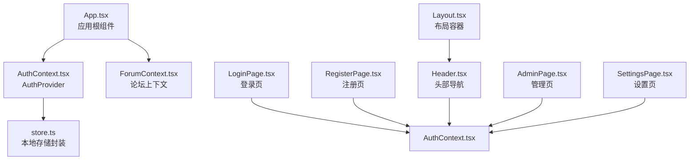
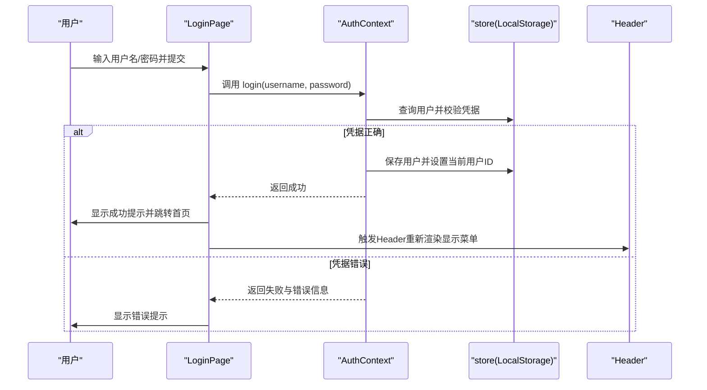
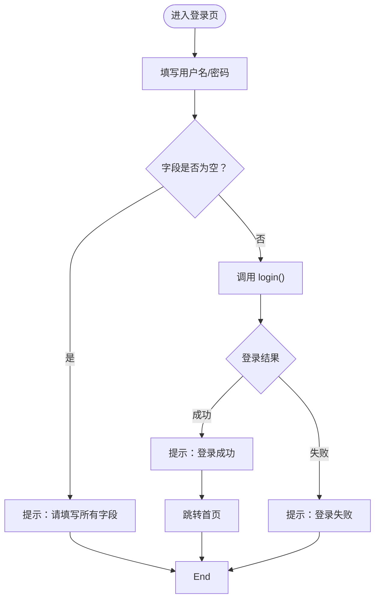
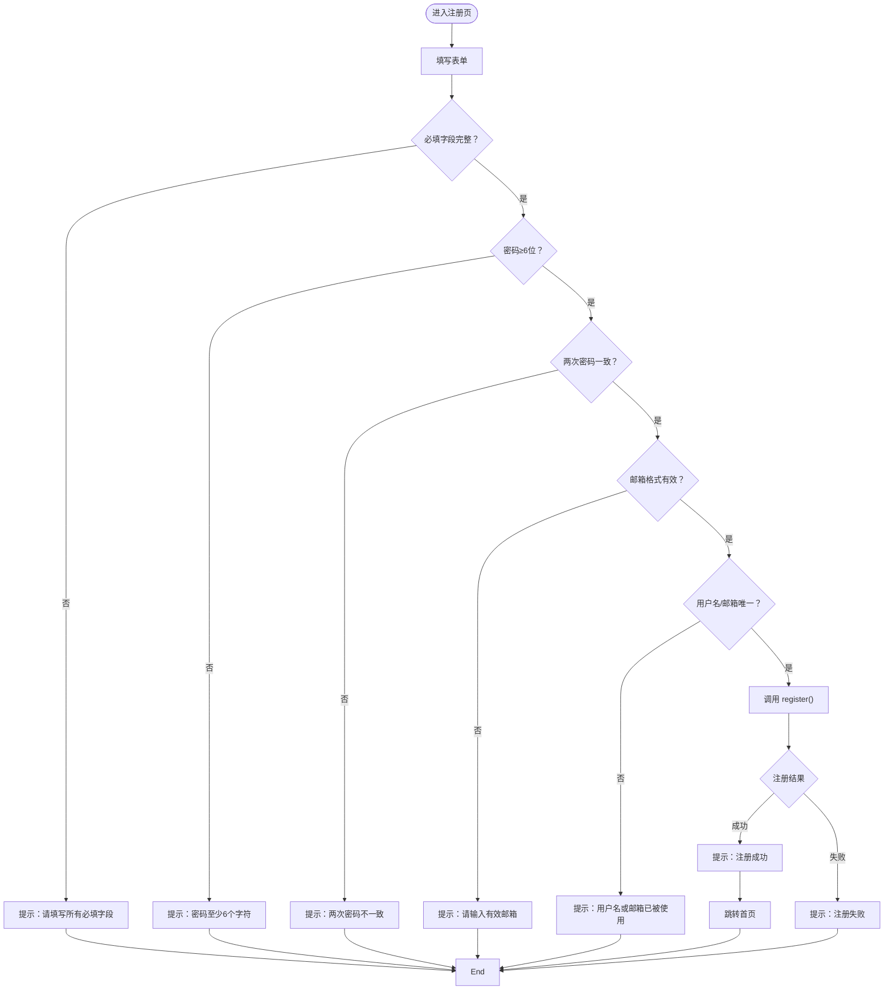
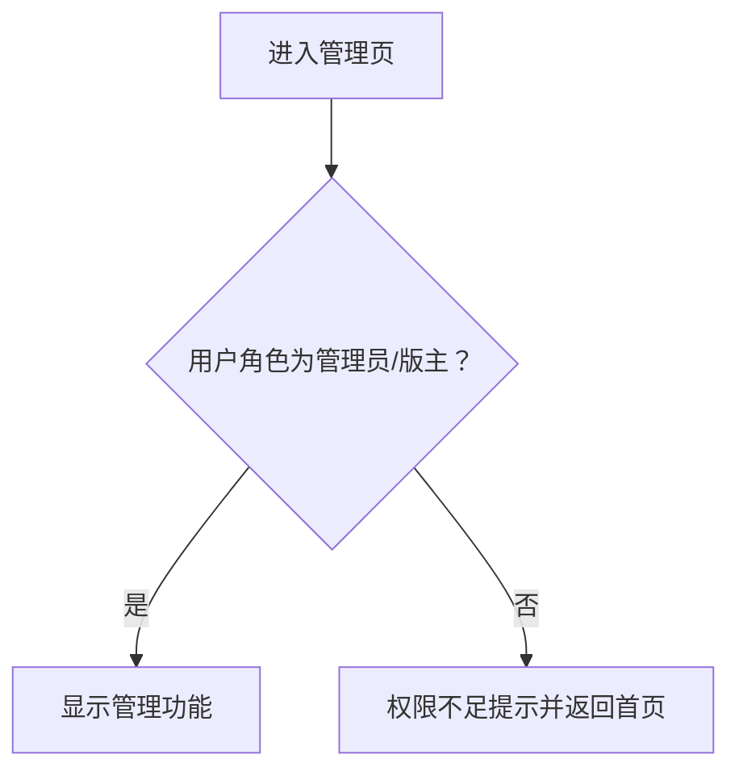
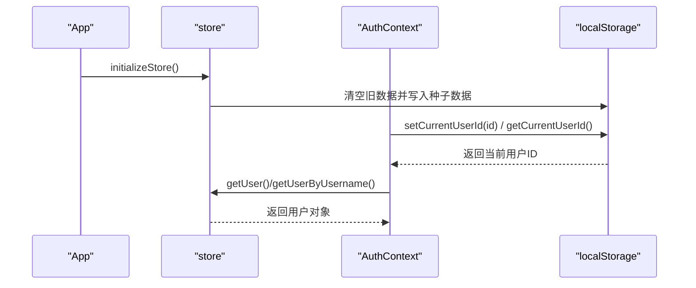
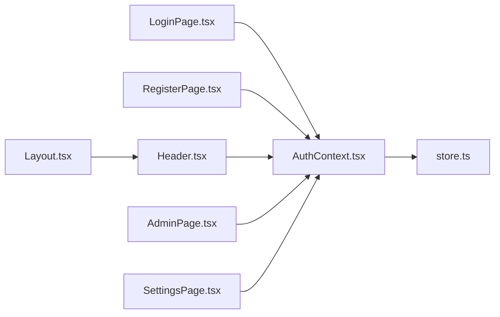

# 认证系统

<cite>
**本文引用的文件**
- [AuthContext.tsx](file://apps/forum/src/context/AuthContext.tsx)
- [store.ts](file://apps/forum/src/data/store.ts)
- [App.tsx](file://apps/forum/src/App.tsx)
- [LoginPage.tsx](file://apps/forum/src/pages/LoginPage.tsx)
- [RegisterPage.tsx](file://apps/forum/src/pages/RegisterPage.tsx)
- [Header.tsx](file://apps/forum/src/components/layout/Header.tsx)
- [AdminPage.tsx](file://apps/forum/src/pages/AdminPage.tsx)
- [SettingsPage.tsx](file://apps/forum/src/pages/SettingsPage.tsx)
- [Layout.tsx](file://apps/forum/src/components/layout/Layout.tsx)
- [index.ts](file://apps/forum/src/types/index.ts)
</cite>

## 目录
1. [引言](#引言)
2. [项目结构](#项目结构)
3. [核心组件](#核心组件)
4. [架构总览](#架构总览)
5. [详细组件分析](#详细组件分析)
6. [依赖关系分析](#依赖关系分析)
7. [性能考量](#性能考量)
8. [故障排查指南](#故障排查指南)
9. [结论](#结论)
10. [附录](#附录)

## 引言
本文件面向社区论坛的认证系统，聚焦于 AuthContext 上下文 API 的设计与实现，涵盖用户登录状态管理、认证令牌处理、会话持久化机制；同时详细说明登录与注册页面的表单验证、错误处理与用户体验设计，并给出用户角色权限控制、密码加密存储、安全令牌刷新等安全机制的建议与现状说明。文档包含认证流程图、状态管理示例与常见问题解决方案，帮助开发者快速理解与扩展认证体系。

## 项目结构
认证系统位于 forum 应用内，采用 React + TypeScript 构建，核心围绕上下文与本地存储实现演示级认证与权限控制：
- 上下文层：AuthContext 提供认证状态与操作方法
- 数据层：store.ts 封装本地存储与种子数据
- 页面层：LoginPage、RegisterPage 提供登录与注册表单
- 布局层：Header 展示登录后菜单与权限入口
- 权限控制：AdminPage、SettingsPage 基于角色进行页面级校验



图表来源
- [App.tsx:21-46](file://apps/forum/src/App.tsx#L21-L46)
- [AuthContext.tsx:17-86](file://apps/forum/src/context/AuthContext.tsx#L17-L86)
- [store.ts:315-398](file://apps/forum/src/data/store.ts#L315-L398)
- [LoginPage.tsx:7-92](file://apps/forum/src/pages/LoginPage.tsx#L7-L92)
- [RegisterPage.tsx:7-111](file://apps/forum/src/pages/RegisterPage.tsx#L7-L111)
- [Header.tsx:17-187](file://apps/forum/src/components/layout/Header.tsx#L17-L187)
- [AdminPage.tsx:15-32](file://apps/forum/src/pages/AdminPage.tsx#L15-L32)
- [SettingsPage.tsx:7-94](file://apps/forum/src/pages/SettingsPage.tsx#L7-L94)
- [Layout.tsx:6-20](file://apps/forum/src/components/layout/Layout.tsx#L6-L20)

章节来源
- [App.tsx:16-19](file://apps/forum/src/App.tsx#L16-L19)
- [AuthContext.tsx:17-86](file://apps/forum/src/context/AuthContext.tsx#L17-L86)
- [store.ts:284-306](file://apps/forum/src/data/store.ts#L284-L306)

## 核心组件
- AuthContext 上下文：提供用户状态、登录、注册、登出、更新资料等方法，并通过本地存储实现会话持久化
- store 本地存储：封装用户、主题、回复、分类、标签、通知等数据的读写，以及当前用户 ID 的持久化
- 登录/注册页面：负责表单校验、错误提示与跳转
- Header 头部：根据登录状态显示菜单项与管理入口
- 角色权限控制：AdminPage 基于用户角色进行页面级访问控制

章节来源
- [AuthContext.tsx:6-13](file://apps/forum/src/context/AuthContext.tsx#L6-L13)
- [store.ts:383-388](file://apps/forum/src/data/store.ts#L383-L388)
- [index.ts:5-23](file://apps/forum/src/types/index.ts#L5-L23)

## 架构总览
认证系统采用“上下文 + 本地存储”的轻量级架构：
- 初始化阶段：App 在启动时调用 store.initializeStore() 注入演示数据
- 登录阶段：LoginForm 调用 AuthContext.login，校验用户名/密码后持久化当前用户 ID
- 注册阶段：RegisterForm 调用 AuthContext.register，校验唯一性后创建新用户并持久化
- 权限阶段：Header/AdminPage 根据用户角色决定可见性与可操作项
- 更新阶段：SettingsPage 调用 AuthContext.updateProfile 更新用户资料



图表来源
- [LoginPage.tsx:16-31](file://apps/forum/src/pages/LoginPage.tsx#L16-L31)
- [AuthContext.tsx:28-37](file://apps/forum/src/context/AuthContext.tsx#L28-L37)
- [store.ts:317-325](file://apps/forum/src/data/store.ts#L317-L325)
- [Header.tsx:17-187](file://apps/forum/src/components/layout/Header.tsx#L17-L187)

## 详细组件分析

### AuthContext 上下文 API
- 用户状态与方法
  - user：当前登录用户对象或空
  - isAuthenticated：基于是否存在 user 的布尔值
  - login(username, password)：校验用户并持久化会话
  - register(data)：校验唯一性并创建新用户
  - logout()：清空当前用户 ID 与用户状态
  - updateProfile(updates)：合并更新用户资料并持久化
- 初始化与会话恢复
  - 组件挂载时从本地存储读取当前用户 ID，并加载对应用户信息
- 数据模型
  - User 接口包含角色、声誉、徽章、统计等字段

```mermaid
classDiagram
class AuthContext {
+user : User | null
+isAuthenticated : boolean
+login(username, password) { success, error? }
+register(data) { success, error? }
+logout() void
+updateProfile(updates) void
}
class Store {
+getCurrentUserId() string | null
+setCurrentUserId(id) void
+getUser(id) User | undefined
+getUserByUsername(username) User | undefined
+saveUser(user) void
+getUsers() User[]
}
class User {
+id : string
+username : string
+email : string
+password : string
+displayName : string
+role : UserRole
+joinedAt : string
+lastActiveAt : string
+reputation : number
+badges : Badge[]
+threadCount : number
+replyCount : number
+voteCount : number
}
AuthContext --> Store : "使用"
AuthContext --> User : "管理"
```

图表来源
- [AuthContext.tsx:6-13](file://apps/forum/src/context/AuthContext.tsx#L6-L13)
- [AuthContext.tsx:17-86](file://apps/forum/src/context/AuthContext.tsx#L17-L86)
- [store.ts:315-398](file://apps/forum/src/data/store.ts#L315-L398)
- [index.ts:7-23](file://apps/forum/src/types/index.ts#L7-L23)

章节来源
- [AuthContext.tsx:17-86](file://apps/forum/src/context/AuthContext.tsx#L17-L86)
- [store.ts:383-388](file://apps/forum/src/data/store.ts#L383-L388)
- [index.ts:5-23](file://apps/forum/src/types/index.ts#L5-L23)

### 登录页面 LoginPage
- 表单字段：用户名、密码，支持显示/隐藏密码
- 校验规则：
  - 必填字段校验
  - 调用 AuthContext.login 执行登录
  - 成功后提示并跳转首页；失败则提示错误
- 用户体验：
  - 加载态禁用按钮
  - 提供演示账号信息便于测试



图表来源
- [LoginPage.tsx:16-31](file://apps/forum/src/pages/LoginPage.tsx#L16-L31)
- [AuthContext.tsx:28-37](file://apps/forum/src/context/AuthContext.tsx#L28-L37)

章节来源
- [LoginPage.tsx:7-92](file://apps/forum/src/pages/LoginPage.tsx#L7-L92)
- [AuthContext.tsx:28-37](file://apps/forum/src/context/AuthContext.tsx#L28-L37)

### 注册页面 RegisterPage
- 表单字段：昵称、用户名、邮箱、密码、确认密码
- 校验规则：
  - 必填字段校验
  - 密码长度至少 6 位
  - 两次密码必须一致
  - 邮箱格式校验
  - 用户名与邮箱唯一性校验
  - 调用 AuthContext.register 创建用户
- 用户体验：
  - 加载态禁用按钮
  - 成功后提示并跳转首页



图表来源
- [RegisterPage.tsx:17-46](file://apps/forum/src/pages/RegisterPage.tsx#L17-L46)
- [AuthContext.tsx:39-67](file://apps/forum/src/context/AuthContext.tsx#L39-L67)

章节来源
- [RegisterPage.tsx:7-111](file://apps/forum/src/pages/RegisterPage.tsx#L7-L111)
- [AuthContext.tsx:39-67](file://apps/forum/src/context/AuthContext.tsx#L39-L67)

### 角色权限控制与页面保护
- 用户角色：user、moderator、admin
- Header 功能：
  - 登录后显示通知、个人菜单、管理入口（管理员/版主）
- 管理页 AdminPage：
  - 仅管理员与版主可见
  - 提供内容管理、用户管理、举报处理等功能
- 设置页 SettingsPage：
  - 仅登录用户可访问，支持更新个人资料



图表来源
- [AdminPage.tsx:23-32](file://apps/forum/src/pages/AdminPage.tsx#L23-L32)
- [Header.tsx:161-174](file://apps/forum/src/components/layout/Header.tsx#L161-L174)
- [SettingsPage.tsx:16-19](file://apps/forum/src/pages/SettingsPage.tsx#L16-L19)
- [index.ts:5](file://apps/forum/src/types/index.ts#L5)

章节来源
- [AdminPage.tsx:15-32](file://apps/forum/src/pages/AdminPage.tsx#L15-L32)
- [Header.tsx:161-174](file://apps/forum/src/components/layout/Header.tsx#L161-L174)
- [SettingsPage.tsx:16-26](file://apps/forum/src/pages/SettingsPage.tsx#L16-L26)
- [index.ts:5-23](file://apps/forum/src/types/index.ts#L5-L23)

### 会话持久化与状态管理
- 当前用户 ID 存储于 localStorage，键为 nexus_current_user
- 应用启动时初始化种子数据，每次刷新都会重置并注入演示数据
- 登录成功后设置当前用户 ID；登出后清除当前用户 ID



图表来源
- [App.tsx:16-19](file://apps/forum/src/App.tsx#L16-L19)
- [store.ts:284-306](file://apps/forum/src/data/store.ts#L284-L306)
- [store.ts:383-388](file://apps/forum/src/data/store.ts#L383-L388)
- [AuthContext.tsx:20-26](file://apps/forum/src/context/AuthContext.tsx#L20-L26)

章节来源
- [store.ts:284-306](file://apps/forum/src/data/store.ts#L284-L306)
- [store.ts:383-388](file://apps/forum/src/data/store.ts#L383-L388)
- [AuthContext.tsx:20-26](file://apps/forum/src/context/AuthContext.tsx#L20-L26)

## 依赖关系分析
- 组件耦合
  - AuthContext 依赖 store 进行用户与会话数据读写
  - 页面组件依赖 AuthContext 获取状态与执行操作
  - Header 依赖 AuthContext 与 ForumContext 展示菜单与通知
- 外部依赖
  - 使用 @tao/ui 组件库与 @tao/shared 工具库
  - 使用 react-router-dom 进行路由与导航



图表来源
- [LoginPage.tsx:9](file://apps/forum/src/pages/LoginPage.tsx#L9)
- [RegisterPage.tsx:9](file://apps/forum/src/pages/RegisterPage.tsx#L9)
- [Header.tsx:18](file://apps/forum/src/components/layout/Header.tsx#L18)
- [AdminPage.tsx:17](file://apps/forum/src/pages/AdminPage.tsx#L17)
- [SettingsPage.tsx:9](file://apps/forum/src/pages/SettingsPage.tsx#L9)
- [AuthContext.tsx:17-86](file://apps/forum/src/context/AuthContext.tsx#L17-L86)
- [store.ts:315-398](file://apps/forum/src/data/store.ts#L315-L398)
- [Layout.tsx:6-20](file://apps/forum/src/components/layout/Layout.tsx#L6-L20)

章节来源
- [AuthContext.tsx:17-86](file://apps/forum/src/context/AuthContext.tsx#L17-L86)
- [store.ts:315-398](file://apps/forum/src/data/store.ts#L315-L398)

## 性能考量
- 本地存储读写
  - store 使用 localStorage 进行数据持久化，适合演示场景；生产环境建议迁移到后端 API 与更安全的令牌存储
- 渲染优化
  - AuthContext 使用 useCallback 包裹方法，避免子组件不必要的重渲染
  - 页面组件按需渲染，Header 根据认证状态切换菜单
- 数据规模
  - 种子数据一次性注入，适合演示；生产环境应分页与懒加载

## 故障排查指南
- 登录失败
  - 检查用户名是否存在与密码是否匹配
  - 确认 store.initializeStore() 是否正确执行
  - 参考路径：[AuthContext.tsx:28-37](file://apps/forum/src/context/AuthContext.tsx#L28-L37)，[store.ts:317-325](file://apps/forum/src/data/store.ts#L317-L325)
- 注册失败
  - 检查用户名/邮箱唯一性与密码校验规则
  - 参考路径：[RegisterPage.tsx:17-46](file://apps/forum/src/pages/RegisterPage.tsx#L17-L46)，[AuthContext.tsx:39-67](file://apps/forum/src/context/AuthContext.tsx#L39-L67)
- 权限不足
  - 管理页仅管理员/版主可见，确认用户角色
  - 参考路径：[AdminPage.tsx:23-32](file://apps/forum/src/pages/AdminPage.tsx#L23-L32)，[index.ts:5](file://apps/forum/src/types/index.ts#L5)
- 会话未持久化
  - 确认 localStorage 中是否存在 nexus_current_user
  - 参考路径：[store.ts:383-388](file://apps/forum/src/data/store.ts#L383-L388)，[AuthContext.tsx:20-26](file://apps/forum/src/context/AuthContext.tsx#L20-L26)

章节来源
- [AuthContext.tsx:28-37](file://apps/forum/src/context/AuthContext.tsx#L28-L37)
- [RegisterPage.tsx:17-46](file://apps/forum/src/pages/RegisterPage.tsx#L17-L46)
- [AdminPage.tsx:23-32](file://apps/forum/src/pages/AdminPage.tsx#L23-L32)
- [store.ts:383-388](file://apps/forum/src/data/store.ts#L383-L388)

## 结论
本认证系统以 AuthContext 为核心，结合 store 的本地存储实现，完成了从登录、注册、会话持久化到角色权限控制的闭环。当前实现为演示级方案，具备清晰的状态流与良好的用户体验。建议在生产环境中引入后端 API、安全令牌（如 JWT）、密码哈希与安全刷新机制，以满足真实业务的安全与性能需求。

## 附录
- 安全建议
  - 密码加密存储：使用强哈希算法（如 bcrypt）存储密码摘要
  - 令牌安全：采用短期访问令牌与长期刷新令牌，令牌存储于 HttpOnly Cookie 或安全存储
  - 传输安全：启用 HTTPS，防止中间人攻击
  - 权限最小化：RBAC 精细化权限控制，避免过度授权
  - 审计日志：记录关键认证与权限变更事件
- 用户体验建议
  - 登录/注册表单增加实时校验反馈
  - 提供“记住我”选项与自动登出保护
  - 多设备同步与会话管理