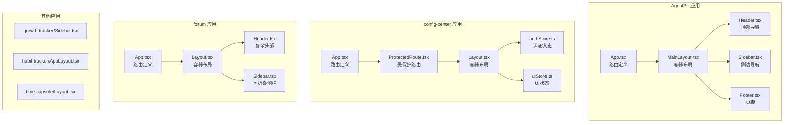
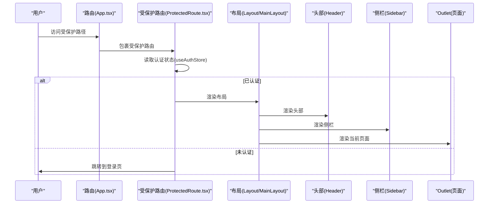
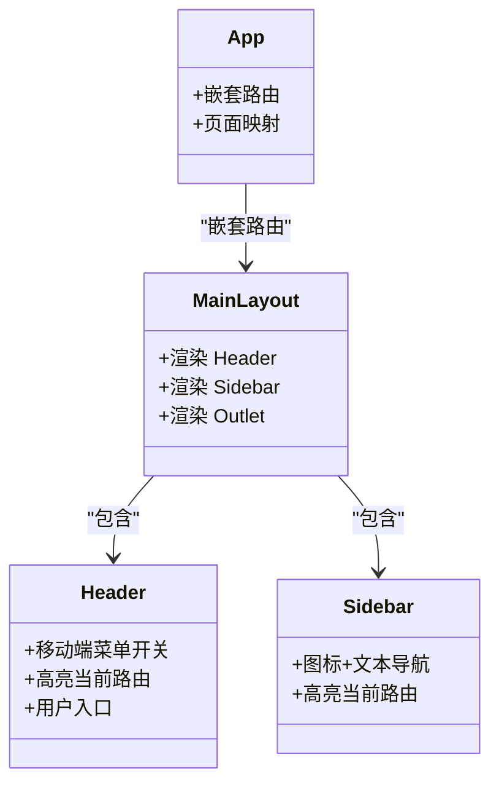
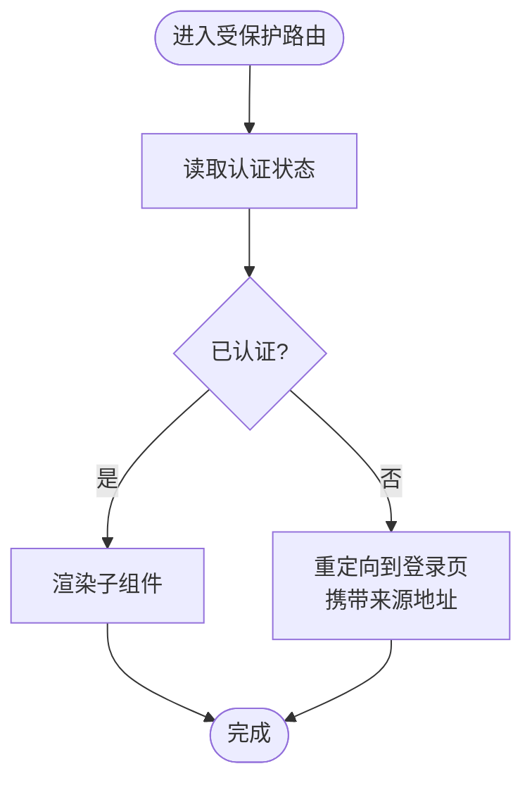
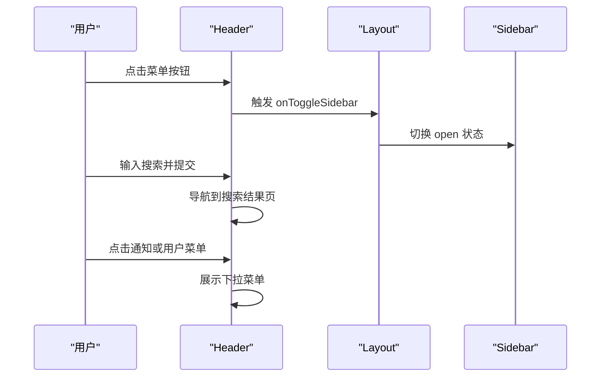
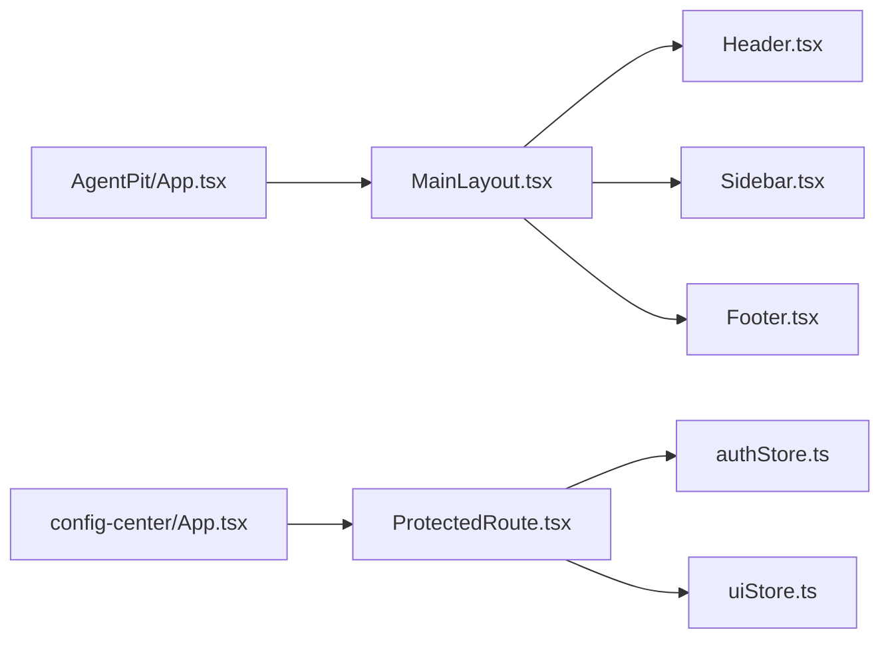

# UI组件架构

<cite>
**本文引用的文件**
- [apps/AgentPit/src/components/layout/Header.tsx](file://apps/AgentPit/src/components/layout/Header.tsx)
- [apps/AgentPit/src/components/layout/Sidebar.tsx](file://apps/AgentPit/src/components/layout/Sidebar.tsx)
- [apps/AgentPit/src/components/layout/MainLayout.tsx](file://apps/AgentPit/src/components/layout/MainLayout.tsx)
- [apps/AgentPit/src/components/layout/Footer.tsx](file://apps/AgentPit/src/components/layout/Footer.tsx)
- [apps/AgentPit/src/App.tsx](file://apps/AgentPit/src/App.tsx)
- [apps/AgentPit/tailwind.config.ts](file://apps/AgentPit/tailwind.config.ts)
- [apps/config-center/src/components/ProtectedRoute.tsx](file://apps/config-center/src/components/ProtectedRoute.tsx)
- [apps/config-center/src/store/authStore.ts](file://apps/config-center/src/store/authStore.ts)
- [apps/config-center/src/store/uiStore.ts](file://apps/config-center/src/store/uiStore.ts)
- [apps/config-center/src/App.tsx](file://apps/config-center/src/App.tsx)
- [apps/forum/src/components/layout/Header.tsx](file://apps/forum/src/components/layout/Header.tsx)
- [apps/forum/src/components/layout/Layout.tsx](file://apps/forum/src/components/layout/Layout.tsx)
- [apps/growth-tracker/src/components/Sidebar.tsx](file://apps/growth-tracker/src/components/Sidebar.tsx)
- [apps/habit-tracker/src/components/layout/AppLayout.tsx](file://apps/habit-tracker/src/components/layout/AppLayout.tsx)
- [apps/time-capsule/src/components/layout/Layout.tsx](file://apps/time-capsule/src/components/layout/Layout.tsx)
</cite>

## 目录
1. [引言](#引言)
2. [项目结构](#项目结构)
3. [核心组件](#核心组件)
4. [架构总览](#架构总览)
5. [详细组件分析](#详细组件分析)
6. [依赖关系分析](#依赖关系分析)
7. [性能考量](#性能考量)
8. [故障排查指南](#故障排查指南)
9. [结论](#结论)
10. [附录](#附录)

## 引言
本文件系统化梳理DAO生态中多个前端应用的UI组件架构，重点覆盖布局组件设计、头部组件实现、侧边栏导航与受保护路由组件。文档从组件职责、数据流、状态管理、响应式设计、主题与国际化支持等方面进行深入解析，并提供可复用、可扩展、易维护的设计建议与最佳实践。

## 项目结构
本仓库采用多应用（apps）组织方式，每个应用独立开发、独立构建。本文聚焦以下应用的UI组件：
- AgentPit：标准三段式布局（Header + Sidebar + 主内容），路由嵌套清晰。
- config-center：受保护路由与状态管理（Zustand），统一布局与权限控制。
- forum：更复杂的头部交互（搜索、通知、用户菜单），侧边栏可折叠。
- growth-tracker：固定侧边栏导航，强调视觉层级与图标一致性。
- habit-tracker：桌面端侧栏+移动端导航的双态布局。
- time-capsule：背景粒子动画与渐变主题的沉浸式布局。

图表来源
- [apps/AgentPit/src/App.tsx:1-41](file://apps/AgentPit/src/App.tsx#L1-L41)
- [apps/AgentPit/src/components/layout/MainLayout.tsx:1-22](file://apps/AgentPit/src/components/layout/MainLayout.tsx#L1-L22)
- [apps/AgentPit/src/components/layout/Header.tsx:1-99](file://apps/AgentPit/src/components/layout/Header.tsx#L1-L99)
- [apps/AgentPit/src/components/layout/Sidebar.tsx:1-137](file://apps/AgentPit/src/components/layout/Sidebar.tsx#L1-L137)
- [apps/AgentPit/src/components/layout/Footer.tsx:1-46](file://apps/AgentPit/src/components/layout/Footer.tsx#L1-L46)
- [apps/config-center/src/App.tsx:1-39](file://apps/config-center/src/App.tsx#L1-L39)
- [apps/config-center/src/components/ProtectedRoute.tsx:1-14](file://apps/config-center/src/components/ProtectedRoute.tsx#L1-L14)
- [apps/config-center/src/store/authStore.ts:1-108](file://apps/config-center/src/store/authStore.ts#L1-L108)
- [apps/config-center/src/store/uiStore.ts:1-14](file://apps/config-center/src/store/uiStore.ts#L1-L14)
- [apps/forum/src/components/layout/Layout.tsx:1-21](file://apps/forum/src/components/layout/Layout.tsx#L1-L21)
- [apps/forum/src/components/layout/Header.tsx:1-188](file://apps/forum/src/components/layout/Header.tsx#L1-L188)
- [apps/growth-tracker/src/components/Sidebar.tsx:1-74](file://apps/growth-tracker/src/components/Sidebar.tsx#L1-L74)
- [apps/habit-tracker/src/components/layout/AppLayout.tsx:1-27](file://apps/habit-tracker/src/components/layout/AppLayout.tsx#L1-L27)
- [apps/time-capsule/src/components/layout/Layout.tsx:1-26](file://apps/time-capsule/src/components/layout/Layout.tsx#L1-L26)

章节来源
- [apps/AgentPit/src/App.tsx:1-41](file://apps/AgentPit/src/App.tsx#L1-L41)
- [apps/config-center/src/App.tsx:1-39](file://apps/config-center/src/App.tsx#L1-L39)
- [apps/forum/src/components/layout/Layout.tsx:1-21](file://apps/forum/src/components/layout/Layout.tsx#L1-L21)

## 核心组件
本节概述各应用中关键UI组件的职责与交互模式：
- 布局容器：负责页面骨架、网格与主内容区域渲染。
- 头部组件：承载品牌标识、主导航、搜索、通知与用户操作。
- 侧边栏导航：提供二级导航入口，支持高亮与图标增强。
- 受保护路由：基于认证状态拦截未授权访问。
- 状态管理：集中处理认证、UI开关等跨组件共享状态。

章节来源
- [apps/AgentPit/src/components/layout/MainLayout.tsx:1-22](file://apps/AgentPit/src/components/layout/MainLayout.tsx#L1-L22)
- [apps/AgentPit/src/components/layout/Header.tsx:1-99](file://apps/AgentPit/src/components/layout/Header.tsx#L1-L99)
- [apps/AgentPit/src/components/layout/Sidebar.tsx:1-137](file://apps/AgentPit/src/components/layout/Sidebar.tsx#L1-L137)
- [apps/config-center/src/components/ProtectedRoute.tsx:1-14](file://apps/config-center/src/components/ProtectedRoute.tsx#L1-L14)
- [apps/config-center/src/store/authStore.ts:1-108](file://apps/config-center/src/store/authStore.ts#L1-L108)
- [apps/config-center/src/store/uiStore.ts:1-14](file://apps/config-center/src/store/uiStore.ts#L1-L14)

## 架构总览
下图展示AgentPit与config-center的典型交互流程：路由层决定是否进入受保护布局；受保护路由依赖认证状态；布局层组合Header、Sidebar与主内容区域。

图表来源
- [apps/config-center/src/App.tsx:14-38](file://apps/config-center/src/App.tsx#L14-L38)
- [apps/config-center/src/components/ProtectedRoute.tsx:4-13](file://apps/config-center/src/components/ProtectedRoute.tsx#L4-L13)
- [apps/config-center/src/store/authStore.ts:20-96](file://apps/config-center/src/store/authStore.ts#L20-L96)
- [apps/AgentPit/src/components/layout/MainLayout.tsx:6-19](file://apps/AgentPit/src/components/layout/MainLayout.tsx#L6-L19)

## 详细组件分析

### AgentPit 布局与导航
- 布局容器：MainLayout 组合 Header、Sidebar 与 Outlet，形成三段式骨架。
- 头部组件：Header 提供品牌区、桌面主导航、移动端菜单与用户入口。
- 侧栏组件：Sidebar 使用图标+文本的导航项，按当前路径高亮。
- 路由配置：App 中通过嵌套路由将页面挂载至 MainLayout。

图表来源
- [apps/AgentPit/src/components/layout/MainLayout.tsx:6-19](file://apps/AgentPit/src/components/layout/MainLayout.tsx#L6-L19)
- [apps/AgentPit/src/components/layout/Header.tsx:4-99](file://apps/AgentPit/src/components/layout/Header.tsx#L4-L99)
- [apps/AgentPit/src/components/layout/Sidebar.tsx:3-137](file://apps/AgentPit/src/components/layout/Sidebar.tsx#L3-L137)
- [apps/AgentPit/src/App.tsx:15-38](file://apps/AgentPit/src/App.tsx#L15-L38)

章节来源
- [apps/AgentPit/src/components/layout/MainLayout.tsx:1-22](file://apps/AgentPit/src/components/layout/MainLayout.tsx#L1-L22)
- [apps/AgentPit/src/components/layout/Header.tsx:1-99](file://apps/AgentPit/src/components/layout/Header.tsx#L1-L99)
- [apps/AgentPit/src/components/layout/Sidebar.tsx:1-137](file://apps/AgentPit/src/components/layout/Sidebar.tsx#L1-L137)
- [apps/AgentPit/src/App.tsx:1-41](file://apps/AgentPit/src/App.tsx#L1-L41)

### config-center 受保护路由与状态管理
- 受保护路由：ProtectedRoute 读取认证状态，未认证则跳转登录页并携带来源地址。
- 认证状态：authStore 管理用户、令牌、加载状态与权限判断，持久化存储令牌。
- UI状态：uiStore 管理侧栏展开/收起等UI行为。

图表来源
- [apps/config-center/src/components/ProtectedRoute.tsx:4-13](file://apps/config-center/src/components/ProtectedRoute.tsx#L4-L13)
- [apps/config-center/src/store/authStore.ts:20-96](file://apps/config-center/src/store/authStore.ts#L20-L96)
- [apps/config-center/src/store/uiStore.ts:9-13](file://apps/config-center/src/store/uiStore.ts#L9-L13)

章节来源
- [apps/config-center/src/components/ProtectedRoute.tsx:1-14](file://apps/config-center/src/components/ProtectedRoute.tsx#L1-L14)
- [apps/config-center/src/store/authStore.ts:1-108](file://apps/config-center/src/store/authStore.ts#L1-L108)
- [apps/config-center/src/store/uiStore.ts:1-14](file://apps/config-center/src/store/uiStore.ts#L1-L14)
- [apps/config-center/src/App.tsx:1-39](file://apps/config-center/src/App.tsx#L1-L39)

### forum 复杂头部与可折叠侧栏
- 头部组件：支持搜索、通知气泡、用户菜单、角色徽章等，具备弹层外点击关闭逻辑。
- 布局组件：通过 props 控制侧栏开闭，实现移动端与桌面端的差异化体验。

图表来源
- [apps/forum/src/components/layout/Header.tsx:17-187](file://apps/forum/src/components/layout/Header.tsx#L17-L187)
- [apps/forum/src/components/layout/Layout.tsx:6-20](file://apps/forum/src/components/layout/Layout.tsx#L6-L20)

章节来源
- [apps/forum/src/components/layout/Header.tsx:1-188](file://apps/forum/src/components/layout/Header.tsx#L1-L188)
- [apps/forum/src/components/layout/Layout.tsx:1-21](file://apps/forum/src/components/layout/Layout.tsx#L1-L21)

### 其他应用的侧栏与布局特色
- growth-tracker：固定侧栏，强调图标与高亮态，视觉层级清晰。
- habit-tracker：桌面端侧栏+移动端导航的双态布局，移动端导航占位避免遮挡。
- time-capsule：背景粒子动画与渐变主题，强调沉浸式体验。

章节来源
- [apps/growth-tracker/src/components/Sidebar.tsx:1-74](file://apps/growth-tracker/src/components/Sidebar.tsx#L1-L74)
- [apps/habit-tracker/src/components/layout/AppLayout.tsx:1-27](file://apps/habit-tracker/src/components/layout/AppLayout.tsx#L1-L27)
- [apps/time-capsule/src/components/layout/Layout.tsx:1-26](file://apps/time-capsule/src/components/layout/Layout.tsx#L1-L26)

## 依赖关系分析
- 组件耦合：AgentPit 的 MainLayout 对 Header、Sidebar、Footer 形成直接依赖；config-center 的受保护路由依赖 authStore。
- 状态管理：authStore 与 uiStore 分别承担业务状态与UI状态，降低组件间耦合。
- 路由集成：App 组件集中声明路由，受保护路由包裹需要鉴权的布局。

图表来源
- [apps/AgentPit/src/App.tsx:15-38](file://apps/AgentPit/src/App.tsx#L15-L38)
- [apps/AgentPit/src/components/layout/MainLayout.tsx:6-19](file://apps/AgentPit/src/components/layout/MainLayout.tsx#L6-L19)
- [apps/config-center/src/App.tsx:14-38](file://apps/config-center/src/App.tsx#L14-L38)
- [apps/config-center/src/components/ProtectedRoute.tsx:4-13](file://apps/config-center/src/components/ProtectedRoute.tsx#L4-L13)

章节来源
- [apps/AgentPit/src/App.tsx:1-41](file://apps/AgentPit/src/App.tsx#L1-L41)
- [apps/config-center/src/App.tsx:1-39](file://apps/config-center/src/App.tsx#L1-L39)

## 性能考量
- 路由懒加载：对大型页面采用动态导入，减少首屏体积。
- 状态持久化：authStore 使用持久化中间件，避免刷新后重复登录。
- 图标与样式：统一使用矢量图标与原子化CSS，减少包体与提升渲染效率。
- 响应式策略：根据断点切换布局（如移动端菜单、侧栏折叠），避免不必要的DOM节点。

## 故障排查指南
- 登录后仍被重定向到登录页
  - 检查认证状态是否正确写入与持久化。
  - 确认受保护路由的鉴权逻辑与路由嵌套是否正确。
- 侧栏无法展开/收起
  - 检查UI状态管理器的开关函数调用链路。
- 头部交互异常（下拉菜单不消失）
  - 确认外点击监听是否正确绑定与解绑。
- 主题色不生效
  - 检查Tailwind配置的主题扩展与类名使用是否一致。

章节来源
- [apps/config-center/src/store/authStore.ts:20-96](file://apps/config-center/src/store/authStore.ts#L20-L96)
- [apps/config-center/src/store/uiStore.ts:9-13](file://apps/config-center/src/store/uiStore.ts#L9-L13)
- [apps/forum/src/components/layout/Header.tsx:27-34](file://apps/forum/src/components/layout/Header.tsx#L27-L34)
- [apps/AgentPit/tailwind.config.ts:8-25](file://apps/AgentPit/tailwind.config.ts#L8-L25)

## 结论
本仓库的UI组件架构体现了“布局容器 + 头部 + 侧栏 + 页面”的清晰分层，配合受保护路由与Zustand状态管理，实现了认证、UI行为与页面内容的解耦。不同应用在响应式与交互细节上各有侧重，既保证了通用性，又兼顾了场景化体验。建议在后续迭代中进一步统一主题变量、抽象通用布局与导航组件，提升跨应用的一致性与可维护性。

## 附录
- 组件复用建议
  - 抽象通用布局容器（如 Layout、MainLayout），在各应用中仅注入差异化的 Header/Sidebar。
  - 将导航项配置化，便于多应用共享与统一更新。
- 扩展性建议
  - 为头部增加插槽（slots）以支持应用特有能力（如搜索、通知）。
  - 为侧栏引入分组与权限过滤，按用户角色动态渲染。
- 维护性建议
  - 统一命名规范与目录结构，明确组件边界。
  - 为关键流程补充单元测试与端到端测试，保障变更质量。
- 设计原则与工程化最佳实践
  - 单一职责：每个组件专注一个功能域。
  - 最小依赖：尽量通过props与上下文传递数据，避免全局污染。
  - 可测试性：保持纯函数与可注入依赖，便于测试。
  - 文档与规范：建立组件API文档与样式规范，降低沟通成本。