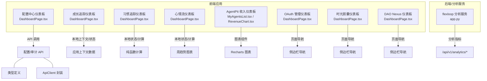
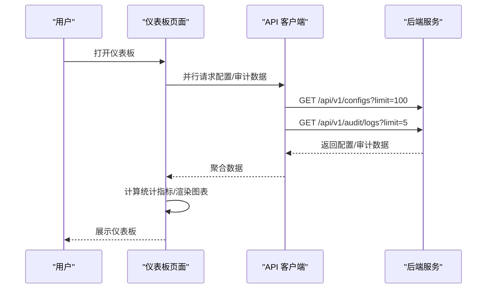
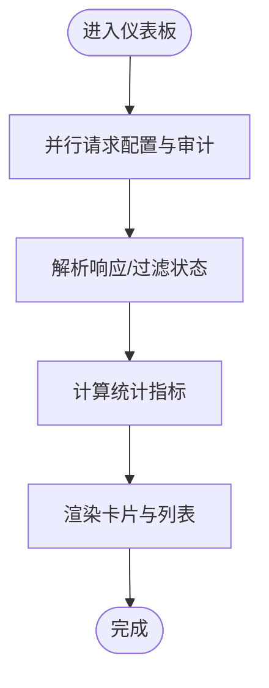
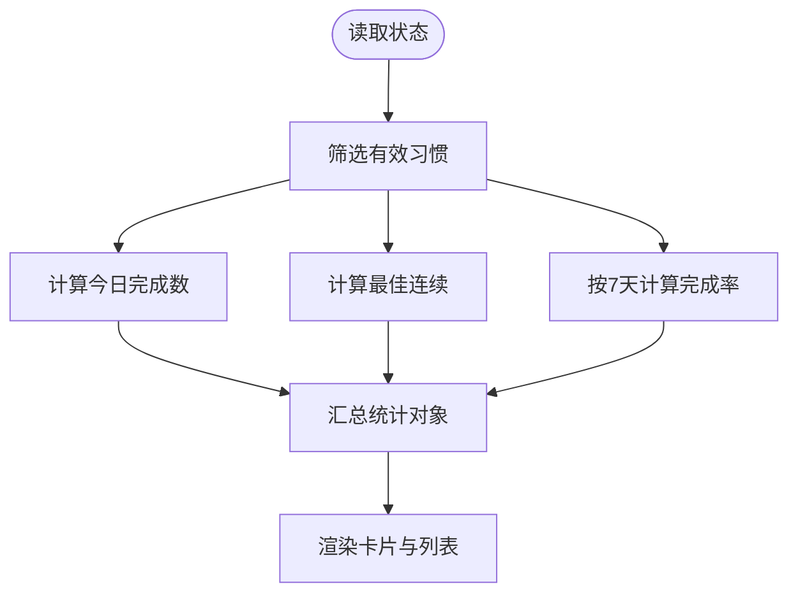
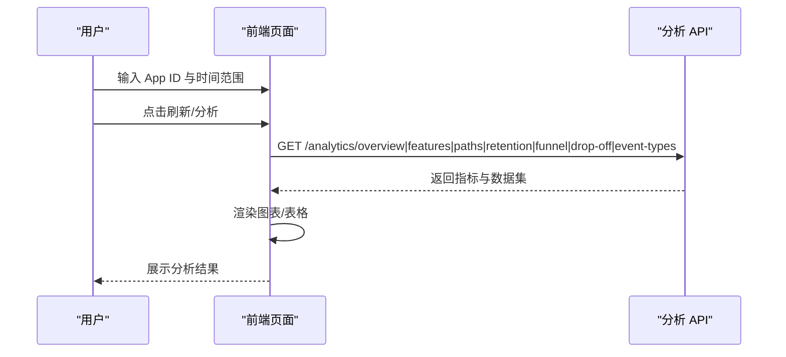
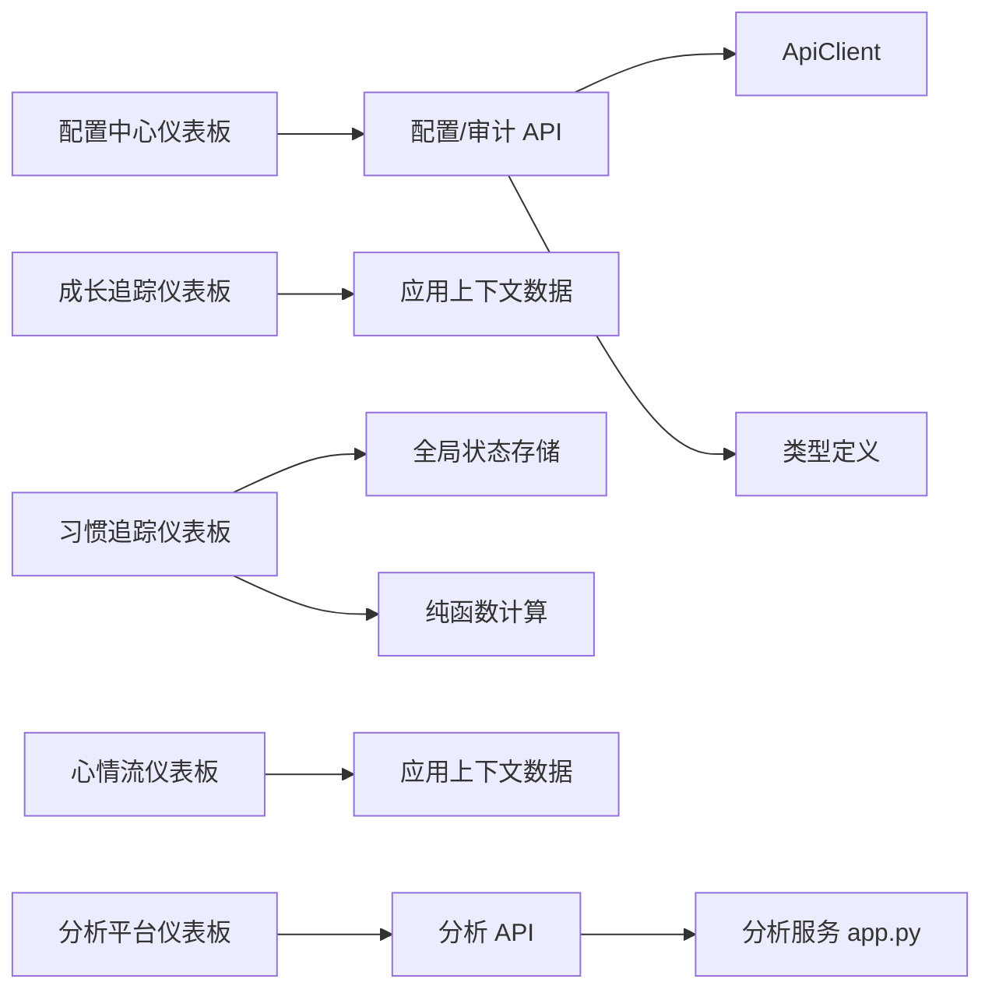

# 仪表板统计

<cite>
**本文引用的文件**
- [apps/config-center/src/pages/DashboardPage.tsx](file://apps/config-center/src/pages/DashboardPage.tsx)
- [apps/growth-tracker/src/pages/DashboardPage.tsx](file://apps/growth-tracker/src/pages/DashboardPage.tsx)
- [apps/habit-tracker/src/pages/DashboardPage.tsx](file://apps/habit-tracker/src/pages/DashboardPage.tsx)
- [apps/moodflow/src/pages/DashboardPage.tsx](file://apps/moodflow/src/pages/DashboardPage.tsx)
- [apps/config-center/src/api/configs.ts](file://apps/config-center/src/api/configs.ts)
- [apps/config-center/src/api/audit.ts](file://apps/config-center/src/api/audit.ts)
- [apps/config-center/src/api/client.ts](file://apps/config-center/src/api/client.ts)
- [apps/config-center/src/types/index.ts](file://apps/config-center/src/types/index.ts)
- [apps/AgentPit/src/components/customize/MyAgentsList.tsx](file://apps/AgentPit/src/components/customize/MyAgentsList.tsx)
- [apps/AgentPit/src/components/monetization/RevenueChart.tsx](file://apps/AgentPit/src/components/monetization/RevenueChart.tsx)
- [apps/oauth-admin/src/pages/DashboardPage.tsx](file://apps/oauth-admin/src/pages/DashboardPage.tsx)
- [apps/time-capsule/src/pages/DashboardPage.tsx](file://apps/time-capsule/src/pages/DashboardPage.tsx)
- [apps/daoNexus/src/pages/DashboardPage.tsx](file://apps/daoNexus/src/pages/DashboardPage.tsx)
- [tools/flexloop/src/taolib/testing/analytics/server/app.py](file://tools/flexloop/src/taolib/testing/analytics/server/app.py)
</cite>

## 目录
1. [简介](#简介)
2. [项目结构](#项目结构)
3. [核心组件](#核心组件)
4. [架构总览](#架构总览)
5. [详细组件分析](#详细组件分析)
6. [依赖关系分析](#依赖关系分析)
7. [性能考虑](#性能考虑)
8. [故障排查指南](#故障排查指南)
9. [结论](#结论)
10. [附录](#附录)

## 简介
本文件围绕“仪表板统计”主题，系统梳理并解读多应用中的仪表板实现，包括整体布局、统计数据展示与关键指标可视化、配置使用情况统计、用户活动分析、系统健康监控、数据获取与计算流程、界面使用示例、图表配置与数据刷新策略、自定义指标与预警机制、报表生成能力以及数据分析的可视化设计与用户体验优化。文档同时给出代码级架构图与流程图，帮助读者快速定位实现位置与扩展点。

## 项目结构
本仓库包含多个前端应用，其中多个应用内置仪表板或统计页面，主要涉及：
- 配置中心仪表板：集中展示配置与审计概览
- 成长追踪仪表板：技能、目标、成就等个人成长统计
- 习惯追踪仪表板：习惯完成率、连续打卡等行为统计
- 心情流仪表板：情绪记录、连续天数、周趋势等心理状态统计
- 收入与变现仪表板：收入趋势与来源分布（AgentPit）
- 分析平台仪表板：事件、路径、留存、漏斗等分析指标（flexloop）

**图表来源**
- [apps/config-center/src/pages/DashboardPage.tsx:13-36](file://apps/config-center/src/pages/DashboardPage.tsx#L13-L36)
- [apps/growth-tracker/src/pages/DashboardPage.tsx:22-35](file://apps/growth-tracker/src/pages/DashboardPage.tsx#L22-L35)
- [apps/habit-tracker/src/pages/DashboardPage.tsx:51-89](file://apps/habit-tracker/src/pages/DashboardPage.tsx#L51-L89)
- [apps/moodflow/src/pages/DashboardPage.tsx:7-24](file://apps/moodflow/src/pages/DashboardPage.tsx#L7-L24)
- [apps/AgentPit/src/components/customize/MyAgentsList.tsx:99-122](file://apps/AgentPit/src/components/customize/MyAgentsList.tsx#L99-L122)
- [apps/AgentPit/src/components/monetization/RevenueChart.tsx:50-52](file://apps/AgentPit/src/components/monetization/RevenueChart.tsx#L50-L52)
- [apps/oauth-admin/src/pages/DashboardPage.tsx](file://apps/oauth-admin/src/pages/DashboardPage.tsx)
- [apps/time-capsule/src/pages/DashboardPage.tsx](file://apps/time-capsule/src/pages/DashboardPage.tsx)
- [apps/daoNexus/src/pages/DashboardPage.tsx](file://apps/daoNexus/src/pages/DashboardPage.tsx)
- [tools/flexloop/src/taolib/testing/analytics/server/app.py:129-233](file://tools/flexloop/src/taolib/testing/analytics/server/app.py#L129-L233)

**章节来源**
- [apps/config-center/src/pages/DashboardPage.tsx:13-36](file://apps/config-center/src/pages/DashboardPage.tsx#L13-L36)
- [apps/growth-tracker/src/pages/DashboardPage.tsx:22-35](file://apps/growth-tracker/src/pages/DashboardPage.tsx#L22-L35)
- [apps/habit-tracker/src/pages/DashboardPage.tsx:51-89](file://apps/habit-tracker/src/pages/DashboardPage.tsx#L51-L89)
- [apps/moodflow/src/pages/DashboardPage.tsx:7-24](file://apps/moodflow/src/pages/DashboardPage.tsx#L7-L24)
- [apps/AgentPit/src/components/customize/MyAgentsList.tsx:99-122](file://apps/AgentPit/src/components/customize/MyAgentsList.tsx#L99-L122)
- [apps/AgentPit/src/components/monetization/RevenueChart.tsx:50-52](file://apps/AgentPit/src/components/monetization/RevenueChart.tsx#L50-L52)
- [apps/oauth-admin/src/pages/DashboardPage.tsx](file://apps/oauth-admin/src/pages/DashboardPage.tsx)
- [apps/time-capsule/src/pages/DashboardPage.tsx](file://apps/time-capsule/src/pages/DashboardPage.tsx)
- [apps/daoNexus/src/pages/DashboardPage.tsx](file://apps/daoNexus/src/pages/DashboardPage.tsx)
- [tools/flexloop/src/taolib/testing/analytics/server/app.py:129-233](file://tools/flexloop/src/taolib/testing/analytics/server/app.py#L129-L233)

## 核心组件
- 配置中心仪表板：聚合配置数量、活跃度、草稿数与最近审计操作；支持按环境分布展示与快速入口。
- 成长追踪仪表板：技能概览、目标进展、成就列表与快速汇总卡片。
- 习惯追踪仪表板：今日进度、最佳连续、近7天完成率、总打卡次数等统计卡片与习惯列表。
- 心情流仪表板：今日心情、连续天数、本周均值、日记篇数、近期记录与周趋势柱状图。
- 收入与变现仪表板：收入与用户规模卡片、时间范围选择与折线/柱状图切换。
- 分析平台仪表板：事件总量、会话数、用户数、平均时长、跳出率、漏斗、特征使用、用户路径、留存、事件分布等。

**章节来源**
- [apps/config-center/src/pages/DashboardPage.tsx:45-50](file://apps/config-center/src/pages/DashboardPage.tsx#L45-L50)
- [apps/growth-tracker/src/pages/DashboardPage.tsx:35-64](file://apps/growth-tracker/src/pages/DashboardPage.tsx#L35-L64)
- [apps/habit-tracker/src/pages/DashboardPage.tsx:136-166](file://apps/habit-tracker/src/pages/DashboardPage.tsx#L136-L166)
- [apps/moodflow/src/pages/DashboardPage.tsx:91-116](file://apps/moodflow/src/pages/DashboardPage.tsx#L91-L116)
- [apps/AgentPit/src/components/customize/MyAgentsList.tsx:99-122](file://apps/AgentPit/src/components/customize/MyAgentsList.tsx#L99-L122)
- [apps/AgentPit/src/components/monetization/RevenueChart.tsx:50-52](file://apps/AgentPit/src/components/monetization/RevenueChart.tsx#L50-L52)
- [tools/flexloop/src/taolib/testing/analytics/server/app.py:156-202](file://tools/flexloop/src/taolib/testing/analytics/server/app.py#L156-L202)

## 架构总览
仪表板数据来源与处理链路分为三类：
- 前端本地计算：如习惯追踪的连续天数、完成率由纯函数在前端计算。
- 前端状态聚合：如配置中心仪表板通过并行请求聚合配置与审计数据。
- 后端分析服务：如 flexloop 提供的分析 API，返回漏斗、路径、留存、事件分布等指标。

**图表来源**
- [apps/config-center/src/pages/DashboardPage.tsx:19-36](file://apps/config-center/src/pages/DashboardPage.tsx#L19-L36)
- [apps/config-center/src/api/configs.ts:4-12](file://apps/config-center/src/api/configs.ts#L4-L12)
- [apps/config-center/src/api/audit.ts:4-13](file://apps/config-center/src/api/audit.ts#L4-L13)
- [apps/config-center/src/api/client.ts:131-142](file://apps/config-center/src/api/client.ts#L131-L142)

## 详细组件分析

### 配置中心仪表板
- 数据来源：配置列表与审计日志，通过并行请求提升首屏速度。
- 统计指标：总配置数、活跃配置数、草稿配置数、最近操作条数；按环境分布占比。
- 可视化：统计卡片网格、环境分布进度条、最近操作列表。
- 刷新策略：首次进入加载，错误统一提示，骨架屏占位。
- 快捷入口：跳转到配置管理、用户管理、角色管理、审计日志。

**图表来源**
- [apps/config-center/src/pages/DashboardPage.tsx:19-36](file://apps/config-center/src/pages/DashboardPage.tsx#L19-L36)
- [apps/config-center/src/pages/DashboardPage.tsx:38-50](file://apps/config-center/src/pages/DashboardPage.tsx#L38-L50)

**章节来源**
- [apps/config-center/src/pages/DashboardPage.tsx:13-36](file://apps/config-center/src/pages/DashboardPage.tsx#L13-L36)
- [apps/config-center/src/pages/DashboardPage.tsx:45-50](file://apps/config-center/src/pages/DashboardPage.tsx#L45-L50)
- [apps/config-center/src/pages/DashboardPage.tsx:87-148](file://apps/config-center/src/pages/DashboardPage.tsx#L87-L148)

### 成长追踪仪表板
- 数据来源：应用上下文中的技能、目标、成就数据。
- 统计指标：技能总数、进行中目标、成就总数、连续打卡天数；平均技能水平。
- 可视化：统计卡片网格、技能进度条、即将到来的截止日期、近期成就卡片、快速汇总。
- 用户体验：动画入场、分类图标映射、进度条颜色分级。

**章节来源**
- [apps/growth-tracker/src/pages/DashboardPage.tsx:22-35](file://apps/growth-tracker/src/pages/DashboardPage.tsx#L22-L35)
- [apps/growth-tracker/src/pages/DashboardPage.tsx:90-110](file://apps/growth-tracker/src/pages/DashboardPage.tsx#L90-L110)
- [apps/growth-tracker/src/pages/DashboardPage.tsx:112-208](file://apps/growth-tracker/src/pages/DashboardPage.tsx#L112-L208)
- [apps/growth-tracker/src/pages/DashboardPage.tsx:210-240](file://apps/growth-tracker/src/pages/DashboardPage.tsx#L210-L240)
- [apps/growth-tracker/src/pages/DashboardPage.tsx:242-262](file://apps/growth-tracker/src/pages/DashboardPage.tsx#L242-L262)

### 习惯追踪仪表板
- 数据来源：全局状态存储中的习惯与签到数据。
- 统计指标：今日完成数、总习惯数、最佳连续天数、近7天完成率、总打卡次数。
- 可视化：统计卡片（含进度条）、今日习惯列表、习惯概览网格。
- 计算逻辑：纯函数计算连续天数与完成率，避免重复渲染。

**图表来源**
- [apps/habit-tracker/src/pages/DashboardPage.tsx:59-89](file://apps/habit-tracker/src/pages/DashboardPage.tsx#L59-L89)
- [apps/habit-tracker/src/pages/DashboardPage.tsx:12-49](file://apps/habit-tracker/src/pages/DashboardPage.tsx#L12-L49)

**章节来源**
- [apps/habit-tracker/src/pages/DashboardPage.tsx:51-89](file://apps/habit-tracker/src/pages/DashboardPage.tsx#L51-L89)
- [apps/habit-tracker/src/pages/DashboardPage.tsx:136-166](file://apps/habit-tracker/src/pages/DashboardPage.tsx#L136-L166)
- [apps/habit-tracker/src/pages/DashboardPage.tsx:168-222](file://apps/habit-tracker/src/pages/DashboardPage.tsx#L168-L222)

### 心情流仪表板
- 数据来源：应用上下文中的心情与日记数据。
- 统计指标：连续天数、本周均值、日记篇数、心情记录数。
- 可视化：今日心情卡片、统计网格、近期心情/日记列表、周趋势柱状图。
- 用户体验：问候语随时间段变化、标签云、相对日期格式化。

**章节来源**
- [apps/moodflow/src/pages/DashboardPage.tsx:7-24](file://apps/moodflow/src/pages/DashboardPage.tsx#L7-L24)
- [apps/moodflow/src/pages/DashboardPage.tsx:90-116](file://apps/moodflow/src/pages/DashboardPage.tsx#L90-L116)
- [apps/moodflow/src/pages/DashboardPage.tsx:118-225](file://apps/moodflow/src/pages/DashboardPage.tsx#L118-L225)
- [apps/moodflow/src/pages/DashboardPage.tsx:246-281](file://apps/moodflow/src/pages/DashboardPage.tsx#L246-L281)

### 收入与变现仪表板（AgentPit）
- 数据来源：模拟数据或后端接口（此处以组件为主）。
- 可视化：卡片式收入与用户规模展示、时间范围选择、折线/柱状图切换、自定义 Tooltip。
- 用户体验：响应式容器、颜色主题、交互式图例。

**章节来源**
- [apps/AgentPit/src/components/customize/MyAgentsList.tsx:99-122](file://apps/AgentPit/src/components/customize/MyAgentsList.tsx#L99-L122)
- [apps/AgentPit/src/components/monetization/RevenueChart.tsx:50-52](file://apps/AgentPit/src/components/monetization/RevenueChart.tsx#L50-L52)

### 分析平台仪表板（flexloop）
- 数据来源：分析服务 API，返回事件、会话、用户、时长、跳出率、漏斗、特征使用、用户路径、留存、事件分布等。
- 可视化：指标网格、漏斗图、特征使用柱状图、用户路径表格、留存柱状图、事件分布环形图。
- 交互：时间范围选择、步骤输入、刷新按钮、图表销毁重建。

**图表来源**
- [tools/flexloop/src/taolib/testing/analytics/server/app.py:144-152](file://tools/flexloop/src/taolib/testing/analytics/server/app.py#L144-L152)
- [tools/flexloop/src/taolib/testing/analytics/server/app.py:204-233](file://tools/flexloop/src/taolib/testing/analytics/server/app.py#L204-L233)

**章节来源**
- [tools/flexloop/src/taolib/testing/analytics/server/app.py:129-233](file://tools/flexloop/src/taolib/testing/analytics/server/app.py#L129-L233)

## 依赖关系分析
- 配置中心仪表板依赖：
  - API 客户端封装统一鉴权与重试
  - 类型定义约束配置与审计日志结构
  - UI 组件库提供卡片、徽标、按钮、骨架屏等
- 成长追踪/习惯追踪/心情流仪表板依赖：
  - 应用上下文或全局状态存储
  - UI 组件库与进度条组件
  - 日期/格式化工具
- 分析平台仪表板依赖：
  - Recharts 图表库
  - 分析服务 API

**图表来源**
- [apps/config-center/src/pages/DashboardPage.tsx:1-11](file://apps/config-center/src/pages/DashboardPage.tsx#L1-L11)
- [apps/config-center/src/api/client.ts:14-172](file://apps/config-center/src/api/client.ts#L14-L172)
- [apps/config-center/src/types/index.ts:1-163](file://apps/config-center/src/types/index.ts#L1-L163)
- [apps/growth-tracker/src/pages/DashboardPage.tsx:1-14](file://apps/growth-tracker/src/pages/DashboardPage.tsx#L1-L14)
- [apps/habit-tracker/src/pages/DashboardPage.tsx:1-8](file://apps/habit-tracker/src/pages/DashboardPage.tsx#L1-L8)
- [apps/moodflow/src/pages/DashboardPage.tsx:1-5](file://apps/moodflow/src/pages/DashboardPage.tsx#L1-L5)
- [tools/flexloop/src/taolib/testing/analytics/server/app.py:129-233](file://tools/flexloop/src/taolib/testing/analytics/server/app.py#L129-L233)

**章节来源**
- [apps/config-center/src/api/client.ts:14-172](file://apps/config-center/src/api/client.ts#L14-L172)
- [apps/config-center/src/types/index.ts:1-163](file://apps/config-center/src/types/index.ts#L1-L163)
- [apps/growth-tracker/src/pages/DashboardPage.tsx:1-14](file://apps/growth-tracker/src/pages/DashboardPage.tsx#L1-L14)
- [apps/habit-tracker/src/pages/DashboardPage.tsx:1-8](file://apps/habit-tracker/src/pages/DashboardPage.tsx#L1-L8)
- [apps/moodflow/src/pages/DashboardPage.tsx:1-5](file://apps/moodflow/src/pages/DashboardPage.tsx#L1-L5)
- [tools/flexloop/src/taolib/testing/analytics/server/app.py:129-233](file://tools/flexloop/src/taolib/testing/analytics/server/app.py#L129-L233)

## 性能考虑
- 并行请求：配置中心仪表板使用并行请求减少首屏等待。
- 骨架屏：加载期间显示骨架屏，改善感知性能。
- 纯函数计算：习惯追踪将复杂计算移至纯函数，避免不必要渲染。
- 图表销毁重建：分析平台在重新渲染前销毁旧实例，防止内存泄漏。
- 响应式图表：收入图表使用响应式容器，适配不同屏幕尺寸。

**章节来源**
- [apps/config-center/src/pages/DashboardPage.tsx:19-36](file://apps/config-center/src/pages/DashboardPage.tsx#L19-L36)
- [apps/habit-tracker/src/pages/DashboardPage.tsx:59-89](file://apps/habit-tracker/src/pages/DashboardPage.tsx#L59-L89)
- [tools/flexloop/src/taolib/testing/analytics/server/app.py:206-207](file://tools/flexloop/src/taolib/testing/analytics/server/app.py#L206-L207)
- [apps/AgentPit/src/components/monetization/RevenueChart.tsx:50-52](file://apps/AgentPit/src/components/monetization/RevenueChart.tsx#L50-L52)

## 故障排查指南
- API 错误处理：统一捕获 ApiError 并提示，401 自动跳转登录。
- 请求参数校验：确保 App ID 与时间范围非空再发起分析请求。
- 图表初始化：若数据为空，显示“无数据”占位，避免渲染异常。
- 令牌刷新：当 Access Token 失效时自动刷新并重试请求。

**章节来源**
- [apps/config-center/src/api/client.ts:1-10](file://apps/config-center/src/api/client.ts#L1-L10)
- [apps/config-center/src/api/client.ts:98-120](file://apps/config-center/src/api/client.ts#L98-L120)
- [apps/config-center/src/api/client.ts:113-119](file://apps/config-center/src/api/client.ts#L113-L119)
- [tools/flexloop/src/taolib/testing/analytics/server/app.py:204-233](file://tools/flexloop/src/taolib/testing/analytics/server/app.py#L204-L233)

## 结论
本仓库的仪表板统计功能覆盖配置、个人成长、行为习惯、心理状态等多个维度，采用“前端本地计算 + 并行请求 + 可视化组件”的组合模式，既保证了良好的用户体验，也便于扩展新的指标与图表。对于需要深度分析的场景，可借助分析平台 API 实现漏斗、路径、留存等高级指标，并通过时间范围与步骤配置灵活探索数据。

## 附录

### 使用示例与操作指引
- 配置中心仪表板
  - 打开仪表板，查看统计卡片与环境分布
  - 点击“最近操作”查看审计日志
  - 点击“管理配置/用户/角色/审计”快速跳转
- 成长追踪仪表板
  - 查看技能、目标、成就与连续打卡
  - 浏览即将到来的截止日期与近期成就
- 习惯追踪仪表板
  - 查看今日进度、最佳连续、完成率与总打卡
  - 管理与查看习惯列表
- 心情流仪表板
  - 记录今日心情或查看周趋势
  - 浏览近期心情与日记
- 分析平台仪表板
  - 输入 App ID 与时间范围，点击刷新
  - 分步分析漏斗、路径、留存与事件分布

**章节来源**
- [apps/config-center/src/pages/DashboardPage.tsx:65-172](file://apps/config-center/src/pages/DashboardPage.tsx#L65-L172)
- [apps/growth-tracker/src/pages/DashboardPage.tsx:79-262](file://apps/growth-tracker/src/pages/DashboardPage.tsx#L79-L262)
- [apps/habit-tracker/src/pages/DashboardPage.tsx:108-222](file://apps/habit-tracker/src/pages/DashboardPage.tsx#L108-L222)
- [apps/moodflow/src/pages/DashboardPage.tsx:25-227](file://apps/moodflow/src/pages/DashboardPage.tsx#L25-L227)
- [tools/flexloop/src/taolib/testing/analytics/server/app.py:144-152](file://tools/flexloop/src/taolib/testing/analytics/server/app.py#L144-L152)

### 图表配置与数据刷新策略
- 配置中心：骨架屏占位，错误统一提示，支持快速跳转
- 成长追踪：动画入场、进度条颜色分级、快速汇总卡片
- 习惯追踪：统计卡片含进度条、今日与概览双视图
- 心情流：周趋势柱状图、相对日期格式化
- 分析平台：时间范围选择、步骤输入、图表销毁重建、刷新按钮

**章节来源**
- [apps/config-center/src/pages/DashboardPage.tsx:52-63](file://apps/config-center/src/pages/DashboardPage.tsx#L52-L63)
- [apps/growth-tracker/src/pages/DashboardPage.tsx:90-110](file://apps/growth-tracker/src/pages/DashboardPage.tsx#L90-L110)
- [apps/habit-tracker/src/pages/DashboardPage.tsx:136-166](file://apps/habit-tracker/src/pages/DashboardPage.tsx#L136-L166)
- [apps/moodflow/src/pages/DashboardPage.tsx:216-225](file://apps/moodflow/src/pages/DashboardPage.tsx#L216-L225)
- [tools/flexloop/src/taolib/testing/analytics/server/app.py:144-152](file://tools/flexloop/src/taolib/testing/analytics/server/app.py#L144-L152)

### 自定义指标、预警机制与报表生成
- 自定义指标
  - 在现有统计卡片基础上新增字段（如“平均技能水平”、“总打卡次数”）
  - 在分析平台中扩展 API 参数（如更多漏斗步骤、留存维度）
- 预警机制
  - 当完成率低于阈值或连续天数中断时，卡片可高亮提示
  - 审计日志中记录关键变更，触发告警通知
- 报表生成
  - 导出图表为图片或 PDF（需引入导出库）
  - 生成 CSV 下载（按时间范围与指标维度）

[本节为概念性建议，无需代码来源]