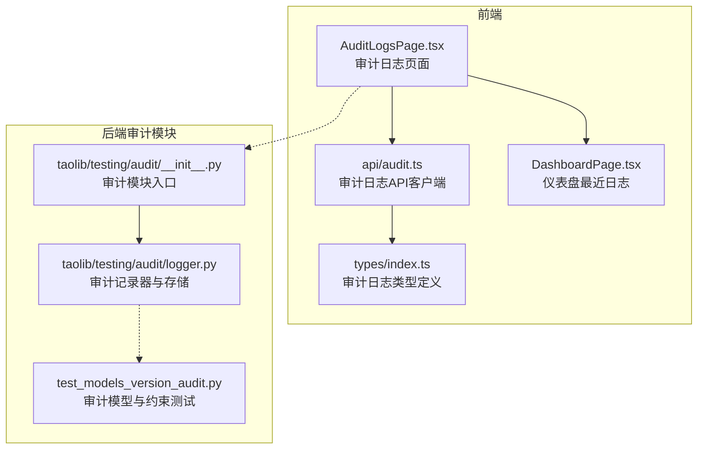
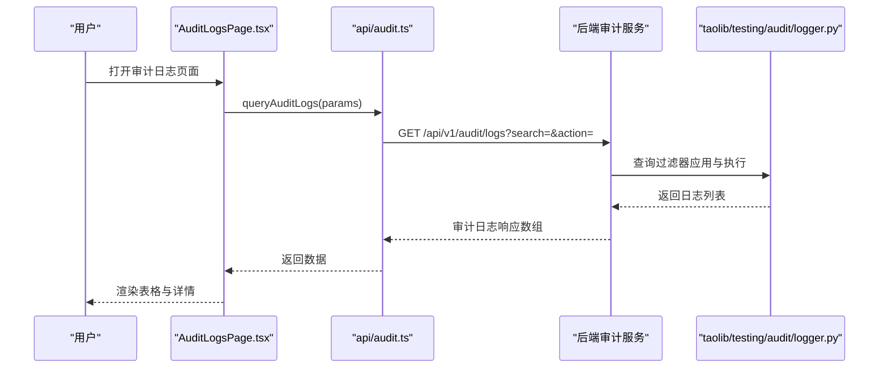
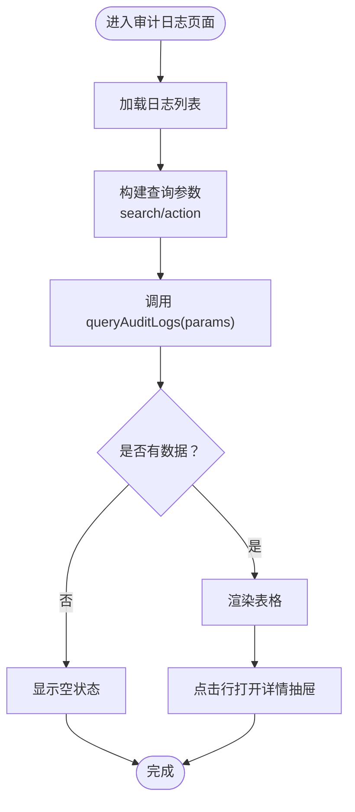
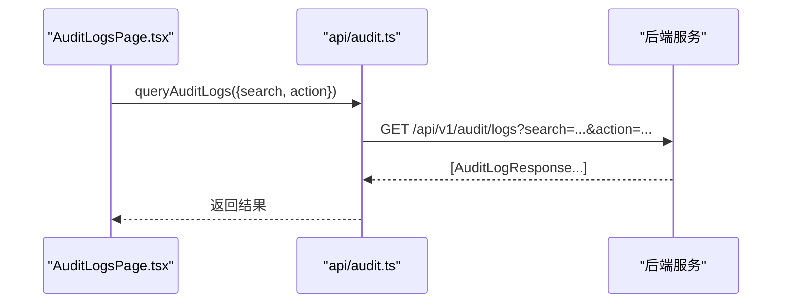
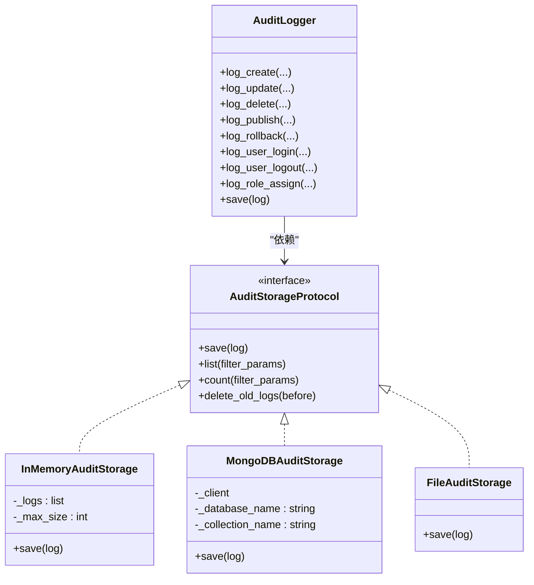
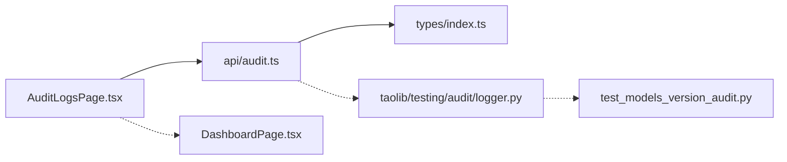

# 审计日志

<cite>
**本文引用的文件**
- [apps/config-center/src/pages/AuditLogsPage.tsx](file://apps/config-center/src/pages/AuditLogsPage.tsx)
- [apps/config-center/src/api/audit.ts](file://apps/config-center/src/api/audit.ts)
- [apps/config-center/src/types/index.ts](file://apps/config-center/src/types/index.ts)
- [apps/config-center/src/pages/DashboardPage.tsx](file://apps/config-center/src/pages/DashboardPage.tsx)
- [tools/flexloop/src/taolib/testing/audit/__init__.py](file://tools/flexloop/src/taolib/testing/audit/__init__.py)
- [tools/flexloop/src/taolib/testing/audit/logger.py](file://tools/flexloop/src/taolib/testing/audit/logger.py)
- [tools/flexloop/tests/testing/test_config_center/test_models_version_audit.py](file://tools/flexloop/tests/testing/test_config_center/test_models_version_audit.py)
</cite>

## 目录
1. [简介](#简介)
2. [项目结构](#项目结构)
3. [核心组件](#核心组件)
4. [架构总览](#架构总览)
5. [详细组件分析](#详细组件分析)
6. [依赖关系分析](#依赖关系分析)
7. [性能考量](#性能考量)
8. [故障排查指南](#故障排查指南)
9. [结论](#结论)
10. [附录](#附录)

## 简介
本文件围绕审计日志功能进行系统化说明，覆盖以下方面：
- 审计日志列表展示与查询过滤
- 审计事件记录格式、事件类型分类与日志存储机制
- 用户行为追踪、系统操作记录与安全事件监控
- 审计日志界面使用示例、查询条件与导出能力
- 日志清理策略、保留期限与隐私保护措施
- 审计合规要求与日志分析最佳实践

## 项目结构
审计日志功能由前端页面、API 客户端与后端审计模块共同构成。前端负责展示与交互，API 客户端封装请求参数与响应类型，后端审计模块负责记录、存储与查询。



**图表来源**
- [apps/config-center/src/pages/AuditLogsPage.tsx:1-162](file://apps/config-center/src/pages/AuditLogsPage.tsx#L1-L162)
- [apps/config-center/src/api/audit.ts:1-18](file://apps/config-center/src/api/audit.ts#L1-L18)
- [apps/config-center/src/types/index.ts:75-91](file://apps/config-center/src/types/index.ts#L75-L91)
- [apps/config-center/src/pages/DashboardPage.tsx:130-147](file://apps/config-center/src/pages/DashboardPage.tsx#L130-L147)
- [tools/flexloop/src/taolib/testing/audit/__init__.py:1-87](file://tools/flexloop/src/taolib/testing/audit/__init__.py#L1-L87)
- [tools/flexloop/src/taolib/testing/audit/logger.py:49-558](file://tools/flexloop/src/taolib/testing/audit/logger.py#L49-L558)
- [tools/flexloop/tests/testing/test_config_center/test_models_version_audit.py:223-321](file://tools/flexloop/tests/testing/test_config_center/test_models_version_audit.py#L223-L321)

**章节来源**
- [apps/config-center/src/pages/AuditLogsPage.tsx:1-162](file://apps/config-center/src/pages/AuditLogsPage.tsx#L1-L162)
- [apps/config-center/src/api/audit.ts:1-18](file://apps/config-center/src/api/audit.ts#L1-L18)
- [apps/config-center/src/types/index.ts:75-91](file://apps/config-center/src/types/index.ts#L75-L91)
- [apps/config-center/src/pages/DashboardPage.tsx:130-147](file://apps/config-center/src/pages/DashboardPage.tsx#L130-L147)
- [tools/flexloop/src/taolib/testing/audit/__init__.py:1-87](file://tools/flexloop/src/taolib/testing/audit/__init__.py#L1-L87)
- [tools/flexloop/src/taolib/testing/audit/logger.py:49-558](file://tools/flexloop/src/taolib/testing/audit/logger.py#L49-L558)
- [tools/flexloop/tests/testing/test_config_center/test_models_version_audit.py:223-321](file://tools/flexloop/tests/testing/test_config_center/test_models_version_audit.py#L223-L321)

## 核心组件
- 审计日志页面：提供搜索与筛选、表格展示、详情抽屉等能力。
- 审计日志 API 客户端：封装查询参数与响应类型，支持按资源类型/ID、操作者、动作等过滤。
- 审计日志类型定义：统一前后端的数据结构，包括动作类型、状态、资源标识、操作者信息、变更前/后值、元数据与时间戳。
- 后端审计模块：提供审计记录器、多种存储后端（内存/MongoDB/文件）以及中间件集成方式；包含日志清理与统计接口。

**章节来源**
- [apps/config-center/src/pages/AuditLogsPage.tsx:11-113](file://apps/config-center/src/pages/AuditLogsPage.tsx#L11-L113)
- [apps/config-center/src/api/audit.ts:4-17](file://apps/config-center/src/api/audit.ts#L4-L17)
- [apps/config-center/src/types/index.ts:7-11](file://apps/config-center/src/types/index.ts#L7-L11)
- [apps/config-center/src/types/index.ts:77-91](file://apps/config-center/src/types/index.ts#L77-L91)
- [tools/flexloop/src/taolib/testing/audit/__init__.py:1-87](file://tools/flexloop/src/taolib/testing/audit/__init__.py#L1-L87)
- [tools/flexloop/src/taolib/testing/audit/logger.py:49-76](file://tools/flexloop/src/taolib/testing/audit/logger.py#L49-L76)

## 架构总览
审计日志从“前端页面”发起查询，通过“API 客户端”构造参数，调用后端接口返回“审计日志响应”，并在页面中渲染。后端审计模块负责记录与持久化，并提供查询、统计与清理能力。



**图表来源**
- [apps/config-center/src/pages/AuditLogsPage.tsx:18-31](file://apps/config-center/src/pages/AuditLogsPage.tsx#L18-L31)
- [apps/config-center/src/api/audit.ts:4-13](file://apps/config-center/src/api/audit.ts#L4-L13)
- [tools/flexloop/src/taolib/testing/audit/logger.py:49-76](file://tools/flexloop/src/taolib/testing/audit/logger.py#L49-L76)

## 详细组件分析

### 前端：审计日志页面（AuditLogsPage）
- 功能要点
  - 支持关键词搜索与操作类型筛选。
  - 表格列包含：操作类型、资源标识与类型、操作者、状态、时间。
  - 点击行打开详情抽屉，展示旧值/新值 JSON 对比。
  - 加载态与空状态处理，错误提示使用统一错误组件。
- 查询参数
  - 支持 search、action 等参数，最终以查询字符串形式传递给 API。
- 展示细节
  - 使用标签展示操作类型与状态，时间格式化显示。
  - 资源列同时展示 key 与 id，便于识别。



**图表来源**
- [apps/config-center/src/pages/AuditLogsPage.tsx:18-31](file://apps/config-center/src/pages/AuditLogsPage.tsx#L18-L31)
- [apps/config-center/src/pages/AuditLogsPage.tsx:37-76](file://apps/config-center/src/pages/AuditLogsPage.tsx#L37-L76)
- [apps/config-center/src/pages/AuditLogsPage.tsx:115-158](file://apps/config-center/src/pages/AuditLogsPage.tsx#L115-L158)

**章节来源**
- [apps/config-center/src/pages/AuditLogsPage.tsx:1-162](file://apps/config-center/src/pages/AuditLogsPage.tsx#L1-L162)

### API 客户端：审计日志查询
- 接口定义
  - queryAuditLogs(params)：支持 resource_type、resource_id、actor_id、action、skip、limit 等参数。
  - getAuditLog(logId)：按 ID 获取单条日志详情。
- 类型约束
  - 返回类型为审计日志数组，遵循统一响应模型。



**图表来源**
- [apps/config-center/src/api/audit.ts:4-17](file://apps/config-center/src/api/audit.ts#L4-L17)

**章节来源**
- [apps/config-center/src/api/audit.ts:1-18](file://apps/config-center/src/api/audit.ts#L1-L18)

### 数据模型：审计日志响应
- 关键字段
  - id、action（枚举）、resource_type、resource_id、resource_key、actor_id、actor_name、actor_ip、old_value、new_value、status（枚举）、metadata、timestamp。
- 事件类型与状态
  - action：配置类（create/update/delete/publish/rollback）与用户类（login/logout/role.assign）。
  - status：success/failed。
- 元数据与变更对比
  - metadata 可承载额外上下文信息。
  - old_value/new_value 支持 JSON 结构，用于变更前后对比。

```mermaid
classDiagram
class AuditLogResponse {
+string id
+AuditAction action
+string resource_type
+string resource_id
+string resource_key
+string actor_id
+string actor_name
+string actor_ip
+unknown old_value
+unknown new_value
+AuditStatus status
+Record~string,unknown~ metadata
+string timestamp
}
class AuditAction {
<<enumeration>>
"config.create"
"config.update"
"config.delete"
"config.publish"
"config.rollback"
"user.login"
"user.logout"
"role.assign"
}
class AuditStatus {
<<enumeration>>
"success"
"failed"
}
AuditLogResponse --> AuditAction : "使用"
AuditLogResponse --> AuditStatus : "使用"
```

**图表来源**
- [apps/config-center/src/types/index.ts:7-11](file://apps/config-center/src/types/index.ts#L7-L11)
- [apps/config-center/src/types/index.ts:77-91](file://apps/config-center/src/types/index.ts#L77-L91)

**章节来源**
- [apps/config-center/src/types/index.ts:7-11](file://apps/config-center/src/types/index.ts#L7-L11)
- [apps/config-center/src/types/index.ts:77-91](file://apps/config-center/src/types/index.ts#L77-L91)

### 后端审计模块：记录、存储与查询
- 模块入口
  - 提供审计记录器、存储协议、中间件与模型导出，便于在 FastAPI 等框架中集成。
- 审计记录器
  - 支持多种动作方法（如 create/update/delete/publish 等），自动填充默认用户/IP 等信息。
  - 将日志写入存储后端。
- 存储后端
  - 内存存储：适用于测试与开发，具备容量上限与淘汰策略。
  - MongoDB 存储：异步插入，支持索引创建。
  - 文件存储：便于离线归档与审计。
- 查询与统计
  - 提供过滤器应用、计数与删除旧日志等接口，便于维护与合规。



**图表来源**
- [tools/flexloop/src/taolib/testing/audit/__init__.py:45-85](file://tools/flexloop/src/taolib/testing/audit/__init__.py#L45-L85)
- [tools/flexloop/src/taolib/testing/audit/logger.py:49-76](file://tools/flexloop/src/taolib/testing/audit/logger.py#L49-L76)
- [tools/flexloop/src/taolib/testing/audit/logger.py:79-104](file://tools/flexloop/src/taolib/testing/audit/logger.py#L79-L104)
- [tools/flexloop/src/taolib/testing/audit/logger.py:325-366](file://tools/flexloop/src/taolib/testing/audit/logger.py#L325-L366)
- [tools/flexloop/src/taolib/testing/audit/logger.py:555-558](file://tools/flexloop/src/taolib/testing/audit/logger.py#L555-L558)

**章节来源**
- [tools/flexloop/src/taolib/testing/audit/__init__.py:1-87](file://tools/flexloop/src/taolib/testing/audit/__init__.py#L1-L87)
- [tools/flexloop/src/taolib/testing/audit/logger.py:49-76](file://tools/flexloop/src/taolib/testing/audit/logger.py#L49-L76)
- [tools/flexloop/src/taolib/testing/audit/logger.py:79-104](file://tools/flexloop/src/taolib/testing/audit/logger.py#L79-L104)
- [tools/flexloop/src/taolib/testing/audit/logger.py:325-366](file://tools/flexloop/src/taolib/testing/audit/logger.py#L325-L366)
- [tools/flexloop/src/taolib/testing/audit/logger.py:555-558](file://tools/flexloop/src/taolib/testing/audit/logger.py#L555-L558)

### 日志清理策略与保留期限
- 清理接口
  - 提供按时间阈值删除旧日志的方法，便于控制存储规模与成本。
- 保留期限建议
  - 依据法规与业务需求设定保留期（例如 90 天/180 天），到期后自动清理或归档。
- 存储后端选择
  - 生产环境优先考虑 MongoDB 或文件存储，便于分片、索引与长期归档。

**章节来源**
- [tools/flexloop/src/taolib/testing/audit/logger.py:67-76](file://tools/flexloop/src/taolib/testing/audit/logger.py#L67-L76)

### 隐私保护措施
- 敏感字段脱敏
  - 在日志中避免记录明文密码、密钥等敏感信息，必要时仅记录摘要或掩码。
- 访问控制
  - 限制审计日志查看权限，仅授权人员可访问。
- 数据最小化
  - 仅记录完成审计目的所必需的信息，减少数据暴露面。

[本节为通用指导，无需特定文件来源]

### 合规要求与最佳实践
- 合规性
  - 确保日志不可抵赖、完整性和可用性满足监管要求。
  - 建立日志备份与异地容灾机制。
- 分析最佳实践
  - 建立告警规则（异常登录、批量删除、高权限操作等）。
  - 定期生成合规报告，留存证据链。
  - 使用可视化工具对热点资源与高频操作进行趋势分析。

[本节为通用指导，无需特定文件来源]

## 依赖关系分析
- 前端依赖
  - 页面依赖 API 客户端与类型定义；仪表盘页面复用相同类型与部分常量。
- 后端依赖
  - 审计模块提供统一的记录器与存储协议，便于替换不同后端实现。
- 测试验证
  - 单测覆盖审计动作枚举、资源键与操作者字段长度约束、元数据可选等边界条件。



**图表来源**
- [apps/config-center/src/pages/AuditLogsPage.tsx:1-10](file://apps/config-center/src/pages/AuditLogsPage.tsx#L1-L10)
- [apps/config-center/src/api/audit.ts:1-2](file://apps/config-center/src/api/audit.ts#L1-L2)
- [apps/config-center/src/types/index.ts:77-91](file://apps/config-center/src/types/index.ts#L77-L91)
- [apps/config-center/src/pages/DashboardPage.tsx:130-147](file://apps/config-center/src/pages/DashboardPage.tsx#L130-L147)
- [tools/flexloop/src/taolib/testing/audit/logger.py:49-76](file://tools/flexloop/src/taolib/testing/audit/logger.py#L49-L76)
- [tools/flexloop/tests/testing/test_config_center/test_models_version_audit.py:223-321](file://tools/flexloop/tests/testing/test_config_center/test_models_version_audit.py#L223-L321)

**章节来源**
- [apps/config-center/src/pages/AuditLogsPage.tsx:1-10](file://apps/config-center/src/pages/AuditLogsPage.tsx#L1-L10)
- [apps/config-center/src/api/audit.ts:1-2](file://apps/config-center/src/api/audit.ts#L1-L2)
- [apps/config-center/src/types/index.ts:77-91](file://apps/config-center/src/types/index.ts#L77-L91)
- [apps/config-center/src/pages/DashboardPage.tsx:130-147](file://apps/config-center/src/pages/DashboardPage.tsx#L130-L147)
- [tools/flexloop/src/taolib/testing/audit/logger.py:49-76](file://tools/flexloop/src/taolib/testing/audit/logger.py#L49-L76)
- [tools/flexloop/tests/testing/test_config_center/test_models_version_audit.py:223-321](file://tools/flexloop/tests/testing/test_config_center/test_models_version_audit.py#L223-L321)

## 性能考量
- 查询优化
  - 后端应为常用过滤字段建立索引（如 resource_type、resource_id、actor_id、action、timestamp）。
  - 分页查询（skip/limit）需配合索引与游标优化。
- 存储容量
  - 生产环境采用分片/归档策略，定期清理过期日志。
- 前端渲染
  - 大列表场景建议虚拟滚动与懒加载，避免一次性渲染过多节点。

[本节为通用指导，无需特定文件来源]

## 故障排查指南
- 常见问题
  - 查询无结果：检查查询参数是否正确，确认后端过滤逻辑与索引是否生效。
  - 详情为空：确认是否存在旧值/新值字段，或该动作不涉及变更。
  - 错误提示：统一使用错误组件提示，定位到具体 API 错误类型。
- 后端排查
  - 检查存储后端连接与权限，确认索引创建成功。
  - 使用统计接口核对日志总量与分布，辅助定位异常时段。

**章节来源**
- [apps/config-center/src/pages/AuditLogsPage.tsx:26-28](file://apps/config-center/src/pages/AuditLogsPage.tsx#L26-L28)
- [tools/flexloop/src/taolib/testing/audit/logger.py:67-76](file://tools/flexloop/src/taolib/testing/audit/logger.py#L67-L76)

## 结论
本项目提供了完整的审计日志前端展示与查询能力，并通过统一的类型定义与 API 客户端对接后端审计模块。后端模块支持多种存储后端与清理策略，满足生产环境的可扩展性与合规要求。建议结合索引优化、容量规划与隐私保护措施，持续完善审计体系。

[本节为总结性内容，无需特定文件来源]

## 附录

### 审计日志界面使用示例
- 打开“审计日志”页面，输入关键词搜索资源，选择操作类型筛选器，即可查看匹配的日志列表。
- 点击任意一行打开详情抽屉，查看旧值与新值的 JSON 对比，以及操作者与时间等信息。

**章节来源**
- [apps/config-center/src/pages/AuditLogsPage.tsx:82-113](file://apps/config-center/src/pages/AuditLogsPage.tsx#L82-L113)
- [apps/config-center/src/pages/AuditLogsPage.tsx:115-158](file://apps/config-center/src/pages/AuditLogsPage.tsx#L115-L158)

### 查询条件与导出
- 查询条件
  - 支持按资源类型/ID、操作者、动作类型、关键词搜索等条件组合查询。
- 导出能力
  - 当前页面未内置导出按钮；可在后端增加 CSV/Excel 导出接口，或在前端通过复制表格数据实现简易导出。

**章节来源**
- [apps/config-center/src/api/audit.ts:4-13](file://apps/config-center/src/api/audit.ts#L4-L13)

### 审计事件类型与分类
- 配置类事件
  - config.create、config.update、config.delete、config.publish、config.rollback。
- 用户类事件
  - user.login、user.logout、role.assign。
- 状态
  - success、failed。

**章节来源**
- [apps/config-center/src/types/index.ts:7-11](file://apps/config-center/src/types/index.ts#L7-L11)

### 日志存储机制与清理
- 存储后端
  - 内存存储（测试/开发）、MongoDB（生产）、文件存储（归档）。
- 清理策略
  - 按时间阈值删除旧日志，结合业务保留期策略执行。

**章节来源**
- [tools/flexloop/src/taolib/testing/audit/logger.py:79-104](file://tools/flexloop/src/taolib/testing/audit/logger.py#L79-L104)
- [tools/flexloop/src/taolib/testing/audit/logger.py:325-366](file://tools/flexloop/src/taolib/testing/audit/logger.py#L325-L366)
- [tools/flexloop/src/taolib/testing/audit/logger.py:67-76](file://tools/flexloop/src/taolib/testing/audit/logger.py#L67-L76)