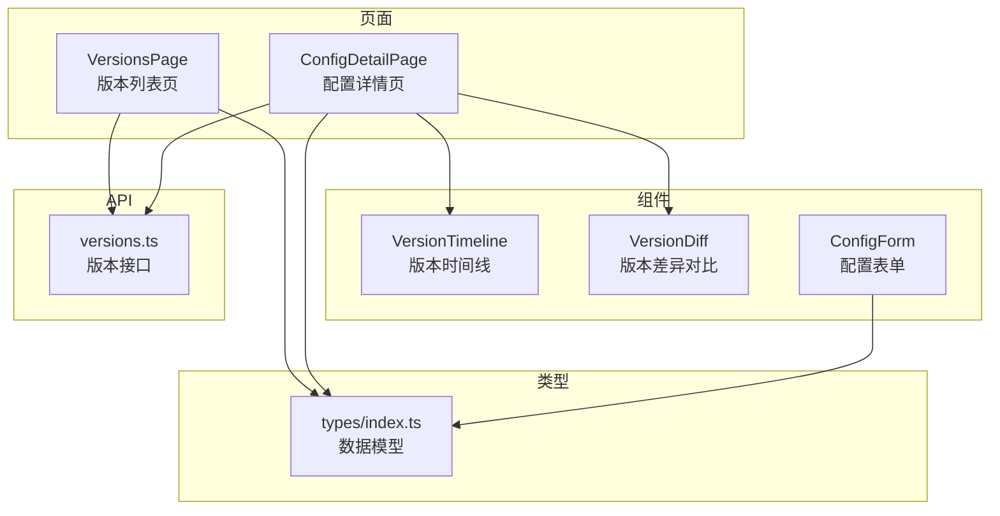
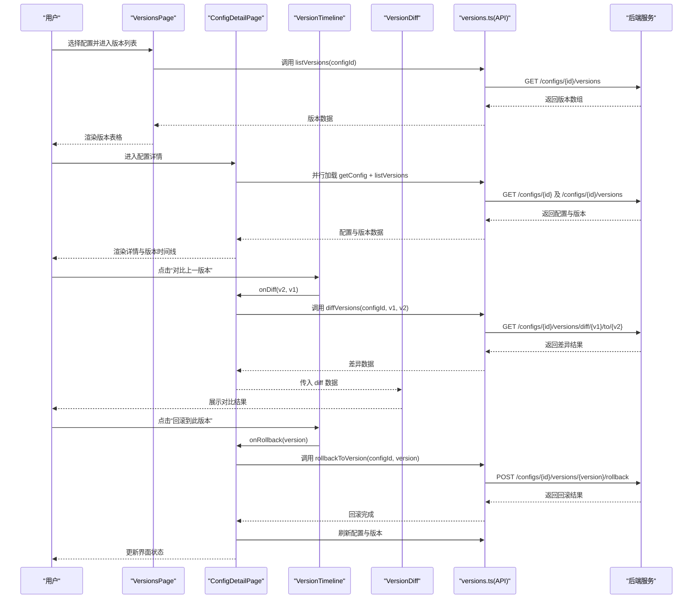
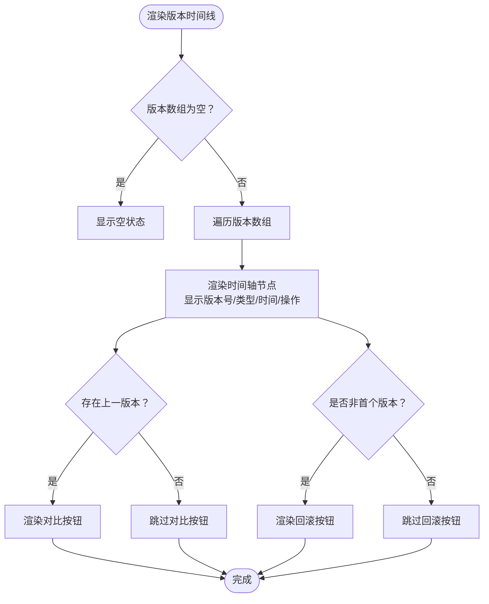
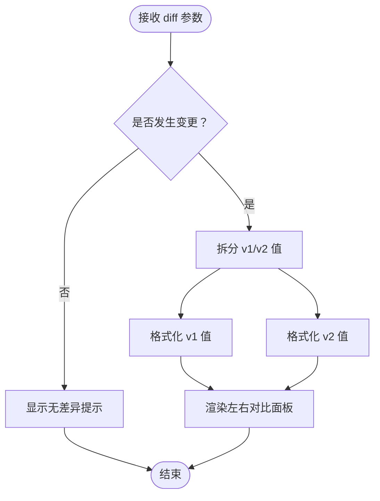
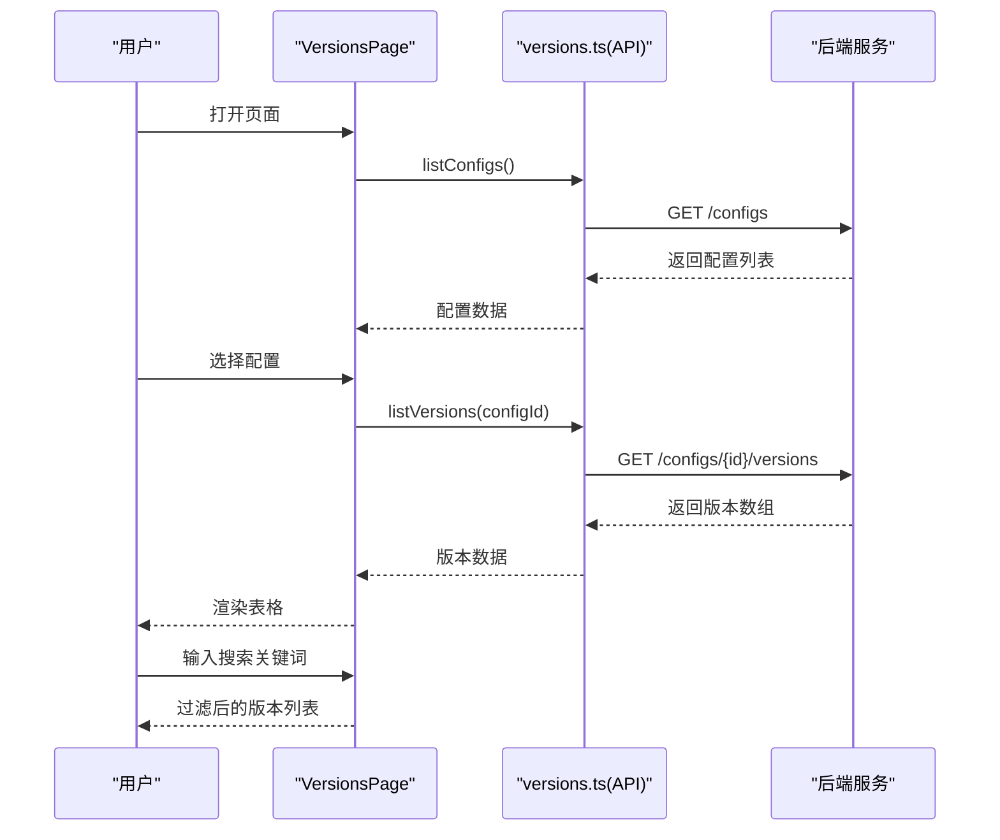
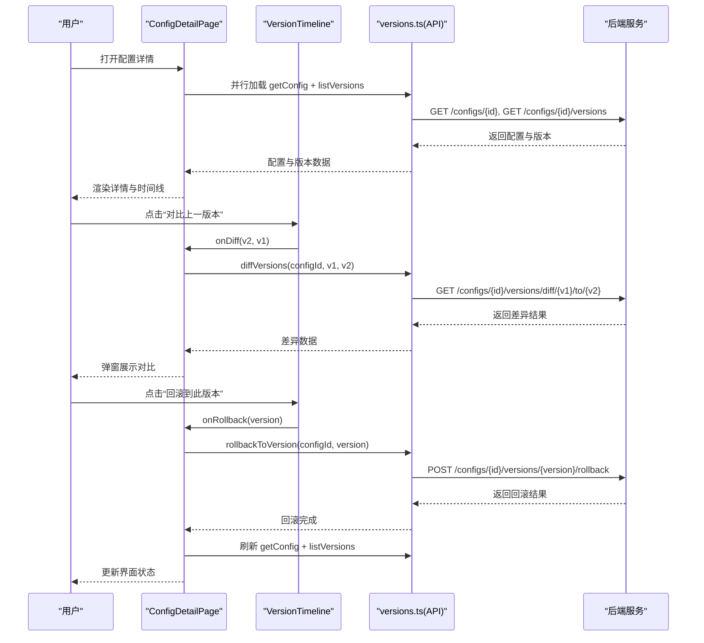
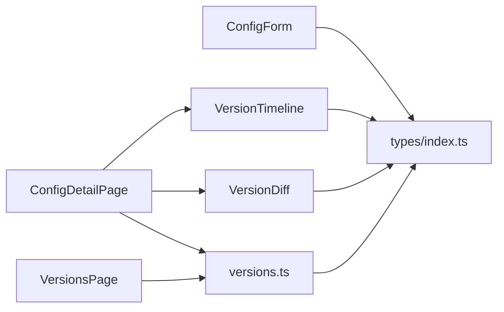

# 版本控制

<cite>
**本文引用的文件**
- [apps/config-center/src/components/version/VersionTimeline.tsx](file://apps/config-center/src/components/version/VersionTimeline.tsx)
- [apps/config-center/src/components/version/VersionDiff.tsx](file://apps/config-center/src/components/version/VersionDiff.tsx)
- [apps/config-center/src/pages/VersionsPage.tsx](file://apps/config-center/src/pages/VersionsPage.tsx)
- [apps/config-center/src/pages/ConfigDetailPage.tsx](file://apps/config-center/src/pages/ConfigDetailPage.tsx)
- [apps/config-center/src/api/versions.ts](file://apps/config-center/src/api/versions.ts)
- [apps/config-center/src/types/index.ts](file://apps/config-center/src/types/index.ts)
- [apps/config-center/src/components/config/ConfigForm.tsx](file://apps/config-center/src/components/config/ConfigForm.tsx)
</cite>

## 目录
1. [简介](#简介)
2. [项目结构](#项目结构)
3. [核心组件](#核心组件)
4. [架构总览](#架构总览)
5. [详细组件分析](#详细组件分析)
6. [依赖关系分析](#依赖关系分析)
7. [性能考量](#性能考量)
8. [故障排查指南](#故障排查指南)
9. [结论](#结论)
10. [附录](#附录)

## 简介
本文件系统性阐述配置中心的版本控制能力，覆盖版本列表展示、版本时间线组件、版本差异对比、配置版本历史、版本回滚与冲突处理、版本创建/比较/合并流程、版本管理界面使用示例、差异分析与版本恢复方案，以及版本标签、注释与批量版本操作的策略建议。文档同时给出版本控制策略与版本迁移最佳实践，帮助团队在多环境、多服务场景下安全、可追溯地管理配置。

## 项目结构
版本控制功能主要分布在以下模块：
- 页面层：版本列表页与配置详情页，负责数据加载、筛选与交互入口
- 组件层：版本时间线与差异对比组件，负责可视化呈现与用户操作
- API 层：版本查询、差异计算、回滚等接口封装
- 类型定义：统一的数据模型与枚举，确保前后端契约一致
- 表单组件：支持配置编辑、标签与注释输入，间接参与版本创建

图表来源
- [apps/config-center/src/pages/VersionsPage.tsx:1-136](file://apps/config-center/src/pages/VersionsPage.tsx#L1-L136)
- [apps/config-center/src/pages/ConfigDetailPage.tsx:1-239](file://apps/config-center/src/pages/ConfigDetailPage.tsx#L1-L239)
- [apps/config-center/src/components/version/VersionTimeline.tsx:1-67](file://apps/config-center/src/components/version/VersionTimeline.tsx#L1-L67)
- [apps/config-center/src/components/version/VersionDiff.tsx:1-40](file://apps/config-center/src/components/version/VersionDiff.tsx#L1-L40)
- [apps/config-center/src/components/config/ConfigForm.tsx:1-126](file://apps/config-center/src/components/config/ConfigForm.tsx#L1-L126)
- [apps/config-center/src/api/versions.ts:1-29](file://apps/config-center/src/api/versions.ts#L1-L29)
- [apps/config-center/src/types/index.ts:1-163](file://apps/config-center/src/types/index.ts#L1-L163)

章节来源
- [apps/config-center/src/pages/VersionsPage.tsx:1-136](file://apps/config-center/src/pages/VersionsPage.tsx#L1-L136)
- [apps/config-center/src/pages/ConfigDetailPage.tsx:1-239](file://apps/config-center/src/pages/ConfigDetailPage.tsx#L1-L239)
- [apps/config-center/src/components/version/VersionTimeline.tsx:1-67](file://apps/config-center/src/components/version/VersionTimeline.tsx#L1-L67)
- [apps/config-center/src/components/version/VersionDiff.tsx:1-40](file://apps/config-center/src/components/version/VersionDiff.tsx#L1-L40)
- [apps/config-center/src/components/config/ConfigForm.tsx:1-126](file://apps/config-center/src/components/config/ConfigForm.tsx#L1-L126)
- [apps/config-center/src/api/versions.ts:1-29](file://apps/config-center/src/api/versions.ts#L1-L29)
- [apps/config-center/src/types/index.ts:1-163](file://apps/config-center/src/types/index.ts#L1-L163)

## 核心组件
- 版本时间线组件：以时间轴形式展示版本序列，支持“对比上一版本”和“回滚到此版本”的快捷操作
- 版本差异对比组件：以左右对比的方式直观呈现两个版本的值差异，并标注更新时间
- 版本列表页：提供配置选择、搜索过滤与版本表格展示，作为全局版本视图入口
- 配置详情页：聚合配置详情与版本历史，串联差异对比与回滚流程
- 版本 API：封装版本列表、指定版本查询、版本差异计算、版本回滚等后端接口
- 类型定义：统一版本响应、差异结果、变更类型等数据结构

章节来源
- [apps/config-center/src/components/version/VersionTimeline.tsx:1-67](file://apps/config-center/src/components/version/VersionTimeline.tsx#L1-L67)
- [apps/config-center/src/components/version/VersionDiff.tsx:1-40](file://apps/config-center/src/components/version/VersionDiff.tsx#L1-L40)
- [apps/config-center/src/pages/VersionsPage.tsx:1-136](file://apps/config-center/src/pages/VersionsPage.tsx#L1-L136)
- [apps/config-center/src/pages/ConfigDetailPage.tsx:1-239](file://apps/config-center/src/pages/ConfigDetailPage.tsx#L1-L239)
- [apps/config-center/src/api/versions.ts:1-29](file://apps/config-center/src/api/versions.ts#L1-L29)
- [apps/config-center/src/types/index.ts:52-74](file://apps/config-center/src/types/index.ts#L52-L74)

## 架构总览
版本控制采用“页面-组件-API-类型”分层设计，前端通过 API 层访问后端版本数据，组件负责渲染与交互；类型定义保证数据一致性。

图表来源
- [apps/config-center/src/pages/VersionsPage.tsx:31-49](file://apps/config-center/src/pages/VersionsPage.tsx#L31-L49)
- [apps/config-center/src/pages/ConfigDetailPage.tsx:33-100](file://apps/config-center/src/pages/ConfigDetailPage.tsx#L33-L100)
- [apps/config-center/src/components/version/VersionTimeline.tsx:44-59](file://apps/config-center/src/components/version/VersionTimeline.tsx#L44-L59)
- [apps/config-center/src/components/version/VersionDiff.tsx:8-39](file://apps/config-center/src/components/version/VersionDiff.tsx#L8-L39)
- [apps/config-center/src/api/versions.ts:4-28](file://apps/config-center/src/api/versions.ts#L4-L28)
- [apps/config-center/src/types/index.ts:54-73](file://apps/config-center/src/types/index.ts#L54-L73)

## 详细组件分析

### 版本时间线组件（VersionTimeline）
- 功能要点
  - 接收版本数组与回调函数，渲染时间轴节点与操作按钮
  - 支持“对比上一版本”和“回滚到此版本”，便于快速定位问题与恢复
  - 显示版本号、变更类型、变更人、变更原因与创建时间
- 交互流程
  - 用户点击“对比上一版本”触发 onDiff(v2, v1)，其中 v2 为当前版本，v1 为上一版本
  - 用户点击“回滚到此版本”触发 onRollback(version)
- 错误处理
  - 当版本数组为空时，展示空状态提示
- 性能考虑
  - 使用 key 基于版本 id，避免不必要的重渲染
  - 按需渲染时间轴连线，仅对非末尾版本绘制连接线

图表来源
- [apps/config-center/src/components/version/VersionTimeline.tsx:13-66](file://apps/config-center/src/components/version/VersionTimeline.tsx#L13-L66)

章节来源
- [apps/config-center/src/components/version/VersionTimeline.tsx:1-67](file://apps/config-center/src/components/version/VersionTimeline.tsx#L1-L67)

### 版本差异对比组件（VersionDiff）
- 功能要点
  - 接收差异结果对象，分别展示 v1 与 v2 的值与更新时间
  - 若未发生变更，显示“无差异”提示
  - 对象值自动格式化为 JSON 字符串，便于阅读
- 使用场景
  - 在配置详情页中通过对话框展示两版本对比结果
- 错误处理
  - 依赖上层调用方确保传入有效 diff 数据

图表来源
- [apps/config-center/src/components/version/VersionDiff.tsx:8-39](file://apps/config-center/src/components/version/VersionDiff.tsx#L8-L39)

章节来源
- [apps/config-center/src/components/version/VersionDiff.tsx:1-40](file://apps/config-center/src/components/version/VersionDiff.tsx#L1-L40)

### 版本列表页（VersionsPage）
- 功能要点
  - 加载所有配置，支持按配置选择与关键词搜索过滤版本
  - 渲染版本表格，包含版本号、变更类型、操作者、变更原因、时间等列
  - 提供空状态提示与加载状态
- 关键交互
  - 选择配置后异步加载版本列表
  - 支持实时搜索，基于配置键、操作者、变更原因进行过滤
- 错误处理
  - 请求异常统一通过消息提示反馈

图表来源
- [apps/config-center/src/pages/VersionsPage.tsx:19-58](file://apps/config-center/src/pages/VersionsPage.tsx#L19-L58)
- [apps/config-center/src/api/versions.ts:4-9](file://apps/config-center/src/api/versions.ts#L4-L9)

章节来源
- [apps/config-center/src/pages/VersionsPage.tsx:1-136](file://apps/config-center/src/pages/VersionsPage.tsx#L1-L136)

### 配置详情页（ConfigDetailPage）
- 功能要点
  - 并发加载配置与版本，展示配置详情与版本历史
  - 提供编辑与发布按钮（草稿态）
  - 通过选项卡切换“详情”与“版本历史”
- 版本操作
  - 差异对比：调用 diffVersions 计算两版本差异并弹窗展示
  - 回滚操作：调用 rollbackToVersion 执行回滚，刷新配置与版本
- 错误处理
  - 统一捕获 API 异常并通过消息提示反馈

图表来源
- [apps/config-center/src/pages/ConfigDetailPage.tsx:33-100](file://apps/config-center/src/pages/ConfigDetailPage.tsx#L33-L100)
- [apps/config-center/src/components/version/VersionTimeline.tsx:44-59](file://apps/config-center/src/components/version/VersionTimeline.tsx#L44-L59)
- [apps/config-center/src/api/versions.ts:15-28](file://apps/config-center/src/api/versions.ts#L15-L28)

章节来源
- [apps/config-center/src/pages/ConfigDetailPage.tsx:1-239](file://apps/config-center/src/pages/ConfigDetailPage.tsx#L1-L239)

### 版本 API（versions.ts）
- 接口清单
  - listVersions：获取配置的所有版本
  - getVersion：获取指定版本详情
  - diffVersions：计算两个版本的差异
  - rollbackToVersion：执行回滚到指定版本
- 参数与返回
  - 统一通过 api.get/api.post 调用，遵循 REST 风格路径约定
  - 返回类型由 types/index.ts 中的 ConfigVersionResponse 与 VersionDiffResult 定义

章节来源
- [apps/config-center/src/api/versions.ts:1-29](file://apps/config-center/src/api/versions.ts#L1-L29)
- [apps/config-center/src/types/index.ts:54-73](file://apps/config-center/src/types/index.ts#L54-L73)

### 类型定义（types/index.ts）
- 版本相关
  - ConfigVersionResponse：版本列表项的完整信息，含变更类型、变更原因、是否可回滚目标等
  - VersionDiffResult：差异结果，包含 v1/v2 的版本号、值与更新时间，以及是否发生变更
- 其他关键类型
  - ConfigResponse：配置对象，含键、环境、服务、值类型、标签、状态、版本号等
  - ChangeType/AuditAction：变更与审计动作枚举，用于语义化展示与审计追踪

章节来源
- [apps/config-center/src/types/index.ts:52-74](file://apps/config-center/src/types/index.ts#L52-L74)
- [apps/config-center/src/types/index.ts:15-50](file://apps/config-center/src/types/index.ts#L15-L50)

### 配置表单（ConfigForm）
- 功能要点
  - 支持配置键、环境、服务、值类型、状态、描述、标签等字段编辑
  - 根据值类型解析/校验输入（字符串、数值、布尔、JSON），并在提交时组装 payload
  - 支持草稿态创建与后续编辑
- 与版本的关系
  - 编辑与保存会生成新的版本记录，便于后续对比与回滚

章节来源
- [apps/config-center/src/components/config/ConfigForm.tsx:1-126](file://apps/config-center/src/components/config/ConfigForm.tsx#L1-L126)

## 依赖关系分析
- 组件耦合
  - ConfigDetailPage 依赖 VersionTimeline 与 VersionDiff，形成“详情页承载时间线与对比”的清晰职责划分
  - VersionsPage 依赖 API 层进行版本列表加载，与类型定义保持契约一致
- 外部依赖
  - API 层依赖统一客户端封装，确保错误处理与拦截器的一致性
  - 时间线与对比组件依赖共享工具库进行日期格式化
- 潜在风险
  - 若后端未实现“回滚目标标记”字段，可能影响时间线按钮可用性
  - 差异对比组件对复杂对象的 JSON 序列化展示，需注意大体量配置的性能与可读性

图表来源
- [apps/config-center/src/components/config/ConfigForm.tsx:1-126](file://apps/config-center/src/components/config/ConfigForm.tsx#L1-L126)
- [apps/config-center/src/pages/VersionsPage.tsx:1-136](file://apps/config-center/src/pages/VersionsPage.tsx#L1-L136)
- [apps/config-center/src/pages/ConfigDetailPage.tsx:1-239](file://apps/config-center/src/pages/ConfigDetailPage.tsx#L1-L239)
- [apps/config-center/src/components/version/VersionTimeline.tsx:1-67](file://apps/config-center/src/components/version/VersionTimeline.tsx#L1-L67)
- [apps/config-center/src/components/version/VersionDiff.tsx:1-40](file://apps/config-center/src/components/version/VersionDiff.tsx#L1-L40)
- [apps/config-center/src/api/versions.ts:1-29](file://apps/config-center/src/api/versions.ts#L1-L29)
- [apps/config-center/src/types/index.ts:1-163](file://apps/config-center/src/types/index.ts#L1-L163)

章节来源
- [apps/config-center/src/components/config/ConfigForm.tsx:1-126](file://apps/config-center/src/components/config/ConfigForm.tsx#L1-L126)
- [apps/config-center/src/pages/VersionsPage.tsx:1-136](file://apps/config-center/src/pages/VersionsPage.tsx#L1-L136)
- [apps/config-center/src/pages/ConfigDetailPage.tsx:1-239](file://apps/config-center/src/pages/ConfigDetailPage.tsx#L1-L239)
- [apps/config-center/src/components/version/VersionTimeline.tsx:1-67](file://apps/config-center/src/components/version/VersionTimeline.tsx#L1-L67)
- [apps/config-center/src/components/version/VersionDiff.tsx:1-40](file://apps/config-center/src/components/version/VersionDiff.tsx#L1-L40)
- [apps/config-center/src/api/versions.ts:1-29](file://apps/config-center/src/api/versions.ts#L1-L29)
- [apps/config-center/src/types/index.ts:1-163](file://apps/config-center/src/types/index.ts#L1-L163)

## 性能考量
- 渲染优化
  - 版本时间线按需绘制连接线，减少 DOM 开销
  - 差异对比面板限制最大高度，避免长文本导致滚动卡顿
- 网络优化
  - 配置详情页并发加载配置与版本，缩短首屏等待
  - 版本列表页支持搜索过滤，降低无效渲染
- 数据处理
  - 对象值统一序列化展示，避免深层嵌套导致的渲染压力
  - 差异结果仅在需要时请求，避免频繁网络调用

## 故障排查指南
- 无法加载版本
  - 检查配置 ID 是否正确，确认后端接口路径与权限
  - 查看 API 层错误处理与消息提示
- 对比无结果或异常
  - 确认传入的版本号顺序（v1 → v2），检查后端差异接口参数
  - 若值为复杂对象，确认序列化是否成功
- 回滚失败
  - 确认当前用户具备回滚权限，检查后端回滚接口返回
  - 回滚后刷新配置与版本，确保界面状态同步
- 搜索无结果
  - 确认搜索关键词与过滤字段匹配（配置键、操作者、变更原因）

章节来源
- [apps/config-center/src/pages/VersionsPage.tsx:24-26](file://apps/config-center/src/pages/VersionsPage.tsx#L24-L26)
- [apps/config-center/src/pages/ConfigDetailPage.tsx:78-89](file://apps/config-center/src/pages/ConfigDetailPage.tsx#L78-L89)
- [apps/config-center/src/components/version/VersionDiff.tsx:9-10](file://apps/config-center/src/components/version/VersionDiff.tsx#L9-L10)
- [apps/config-center/src/api/versions.ts:15-28](file://apps/config-center/src/api/versions.ts#L15-L28)

## 结论
版本控制功能通过清晰的页面-组件-API-类型分层，实现了从版本列表、时间线展示到差异对比与回滚的完整闭环。配合配置表单的标签与注释能力，团队可在多环境、多服务场景下高效管理配置变更，提升可追溯性与安全性。建议在生产环境中结合审计日志与权限控制，完善版本回滚的审批与通知机制。

## 附录

### 版本创建、比较与合并操作流程
- 创建版本
  - 通过配置表单编辑并保存，系统自动生成新版本
  - 支持设置标签与变更原因，便于后续检索与审计
- 比较版本
  - 在版本时间线中选择“对比上一版本”，或在版本列表中选择任意两个版本进行对比
  - 差异结果以左右面板展示，支持快速定位变更点
- 合并版本
  - 本代码库未直接提供“合并版本”接口；建议通过“回滚到目标版本”或“重新编辑并创建新版本”的方式实现合并效果

章节来源
- [apps/config-center/src/components/config/ConfigForm.tsx:29-55](file://apps/config-center/src/components/config/ConfigForm.tsx#L29-L55)
- [apps/config-center/src/components/version/VersionTimeline.tsx:44-52](file://apps/config-center/src/components/version/VersionTimeline.tsx#L44-L52)
- [apps/config-center/src/api/versions.ts:15-21](file://apps/config-center/src/api/versions.ts#L15-L21)

### 版本管理界面使用示例
- 版本列表页
  - 步骤：打开页面 → 选择配置 → 输入关键词搜索 → 查看版本表格
  - 适用场景：批量查看与筛选版本，快速定位目标配置
- 配置详情页
  - 步骤：打开配置详情 → 切换至“版本历史” → 选择对比或回滚
  - 适用场景：深度分析变更、执行回滚与对比验证

章节来源
- [apps/config-center/src/pages/VersionsPage.tsx:98-132](file://apps/config-center/src/pages/VersionsPage.tsx#L98-L132)
- [apps/config-center/src/pages/ConfigDetailPage.tsx:211-217](file://apps/config-center/src/pages/ConfigDetailPage.tsx#L211-L217)

### 差异分析与版本恢复方案
- 差异分析
  - 使用“版本对比”功能，结合变更原因与操作者信息，定位问题根因
  - 对于复杂对象，建议先核对关键字段，再逐步缩小范围
- 版本恢复
  - 在版本时间线上选择“回滚到此版本”，确认后立即生效
  - 回滚后刷新配置与版本，确保界面状态一致

章节来源
- [apps/config-center/src/components/version/VersionTimeline.tsx:54-59](file://apps/config-center/src/components/version/VersionTimeline.tsx#L54-L59)
- [apps/config-center/src/pages/ConfigDetailPage.tsx:76-89](file://apps/config-center/src/pages/ConfigDetailPage.tsx#L76-L89)

### 版本标签、注释与批量版本操作
- 标签与注释
  - 配置表单支持设置标签与描述，便于分类与检索
  - 版本记录包含变更原因字段，建议每次变更填写明确原因
- 批量操作
  - 本代码库未提供批量版本删除/回滚功能；建议通过脚本或后端接口实现批量任务，前端以进度条与结果汇总反馈

章节来源
- [apps/config-center/src/components/config/ConfigForm.tsx:25-51](file://apps/config-center/src/components/config/ConfigForm.tsx#L25-L51)
- [apps/config-center/src/types/index.ts:54-66](file://apps/config-center/src/types/index.ts#L54-L66)

### 版本控制策略与迁移最佳实践
- 策略建议
  - 严格区分环境与服务维度，避免跨域配置互相影响
  - 对关键配置启用“只读保护”与“审批回滚”机制
  - 建议保留至少 30 天的版本历史，满足审计与追溯需求
- 迁移最佳实践
  - 迁移前先创建快照版本，迁移后进行对比验证
  - 分批迁移并观察监控指标，必要时回滚至上一个稳定版本
  - 迁移过程中保持变更原因与标签一致，便于追踪