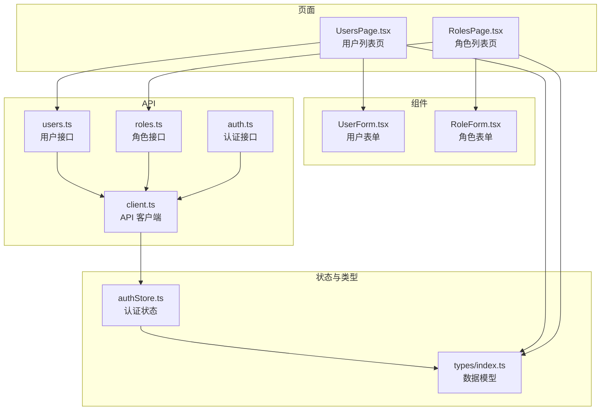
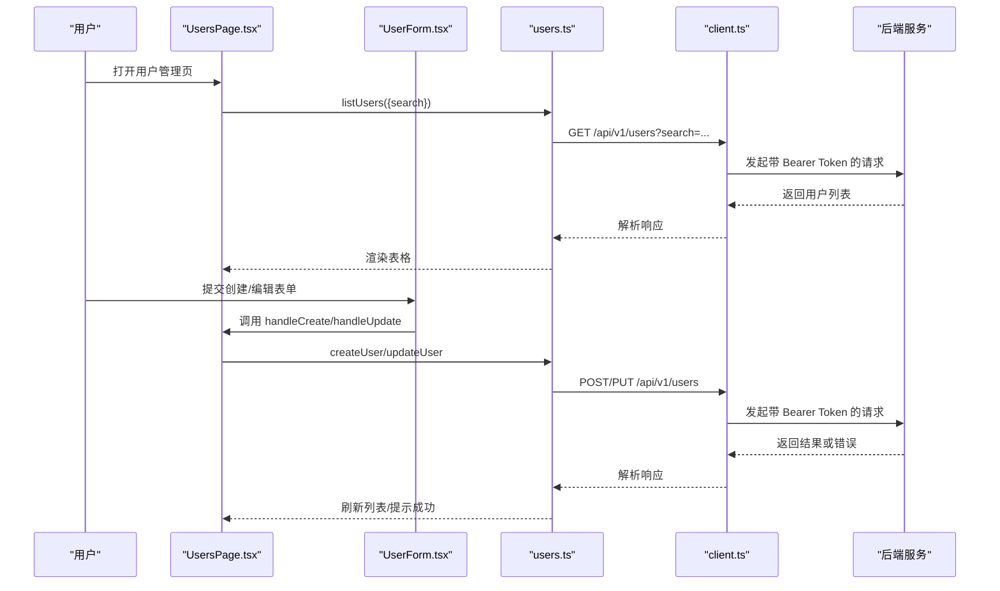
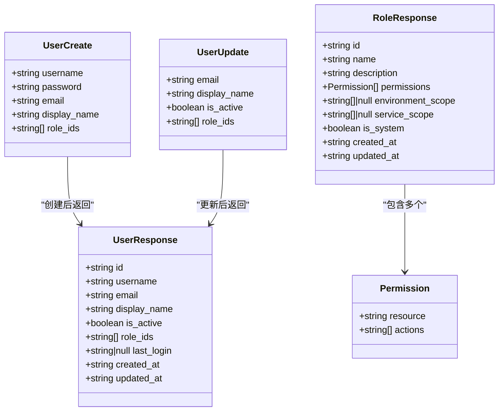
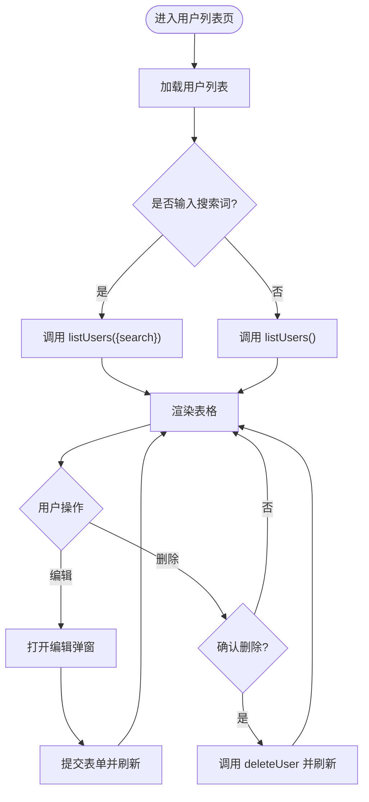
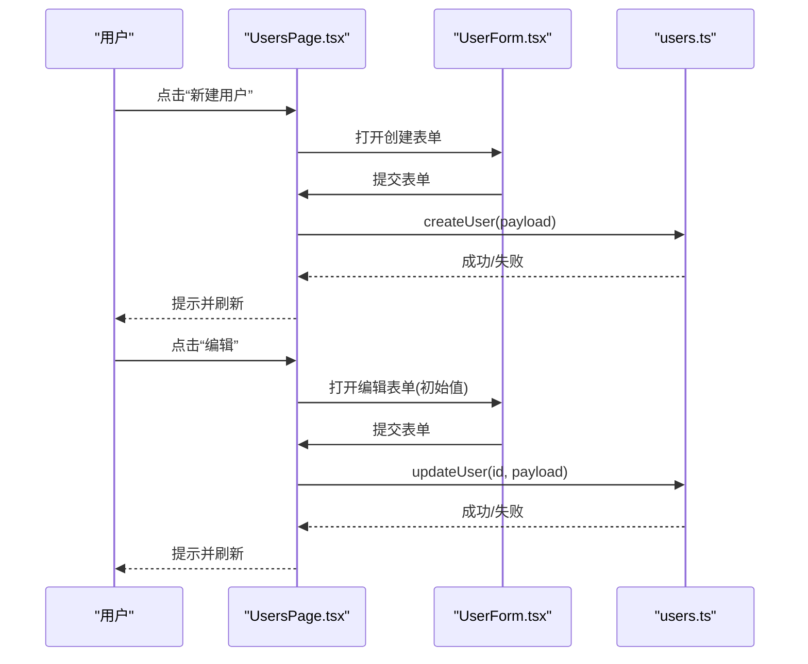
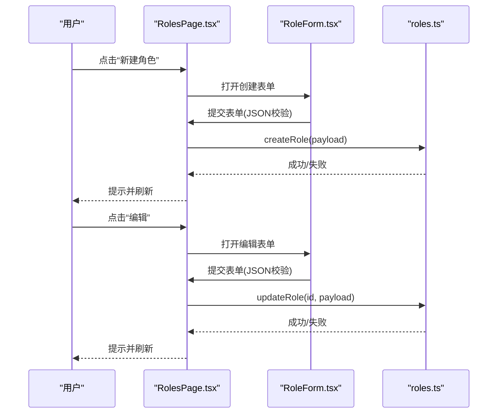
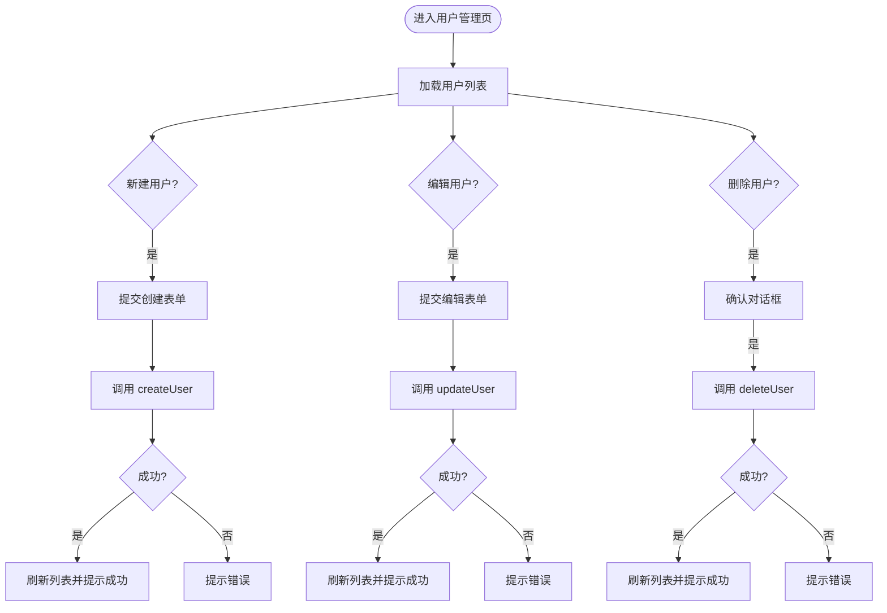
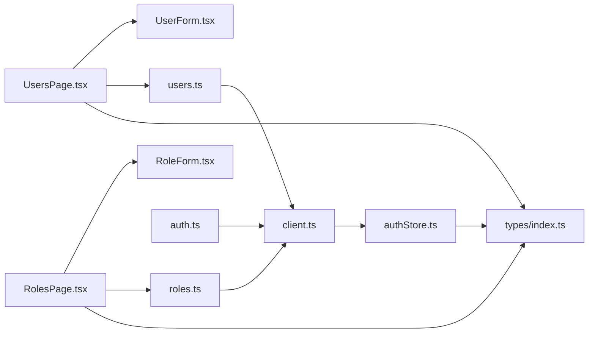

# 用户管理

<cite>
**本文引用的文件**
- [apps/config-center/src/pages/UsersPage.tsx](file://apps/config-center/src/pages/UsersPage.tsx)
- [apps/config-center/src/components/user/UserForm.tsx](file://apps/config-center/src/components/user/UserForm.tsx)
- [apps/config-center/src/api/users.ts](file://apps/config-center/src/api/users.ts)
- [apps/config-center/src/api/roles.ts](file://apps/config-center/src/api/roles.ts)
- [apps/config-center/src/pages/RolesPage.tsx](file://apps/config-center/src/pages/RolesPage.tsx)
- [apps/config-center/src/components/role/RoleForm.tsx](file://apps/config-center/src/components/role/RoleForm.tsx)
- [apps/config-center/src/api/auth.ts](file://apps/config-center/src/api/auth.ts)
- [apps/config-center/src/store/authStore.ts](file://apps/config-center/src/store/authStore.ts)
- [apps/config-center/src/api/client.ts](file://apps/config-center/src/api/client.ts)
- [apps/config-center/src/types/index.ts](file://apps/config-center/src/types/index.ts)
</cite>

## 目录
1. [简介](#简介)
2. [项目结构](#项目结构)
3. [核心组件](#核心组件)
4. [架构总览](#架构总览)
5. [详细组件分析](#详细组件分析)
6. [依赖关系分析](#依赖关系分析)
7. [性能考量](#性能考量)
8. [故障排查指南](#故障排查指南)
9. [结论](#结论)
10. [附录](#附录)

## 简介
本文件围绕配置中心应用中的“用户管理”能力进行系统化说明，覆盖用户列表展示、用户详情编辑、用户表单组件设计；深入解析用户与角色的数据模型、权限分配与角色管理机制；阐述用户的创建、更新、删除操作流程与安全验证；提供界面使用示例、数据验证规则与错误处理方案，并包含用户搜索、筛选与批量操作的扩展建议。同时总结安全考虑与最佳实践。

## 项目结构
用户管理相关代码主要位于配置中心应用（config-center）中，前端采用 React + TypeScript 构建，通过统一的 API 客户端访问后端服务。核心模块包括：
- 页面层：用户列表页与角色列表页
- 组件层：用户表单与角色表单
- API 层：用户、角色、认证相关接口封装
- 类型层：用户、角色、权限等数据模型定义
- 状态层：认证状态与权限判断逻辑

图表来源
- [apps/config-center/src/pages/UsersPage.tsx](file://apps/config-center/src/pages/UsersPage.tsx)
- [apps/config-center/src/components/user/UserForm.tsx](file://apps/config-center/src/components/user/UserForm.tsx)
- [apps/config-center/src/api/users.ts](file://apps/config-center/src/api/users.ts)
- [apps/config-center/src/api/roles.ts](file://apps/config-center/src/api/roles.ts)
- [apps/config-center/src/pages/RolesPage.tsx](file://apps/config-center/src/pages/RolesPage.tsx)
- [apps/config-center/src/components/role/RoleForm.tsx](file://apps/config-center/src/components/role/RoleForm.tsx)
- [apps/config-center/src/api/auth.ts](file://apps/config-center/src/api/auth.ts)
- [apps/config-center/src/store/authStore.ts](file://apps/config-center/src/store/authStore.ts)
- [apps/config-center/src/api/client.ts](file://apps/config-center/src/api/client.ts)
- [apps/config-center/src/types/index.ts](file://apps/config-center/src/types/index.ts)

章节来源
- [apps/config-center/src/pages/UsersPage.tsx](file://apps/config-center/src/pages/UsersPage.tsx)
- [apps/config-center/src/pages/RolesPage.tsx](file://apps/config-center/src/pages/RolesPage.tsx)
- [apps/config-center/src/api/users.ts](file://apps/config-center/src/api/users.ts)
- [apps/config-center/src/api/roles.ts](file://apps/config-center/src/api/roles.ts)
- [apps/config-center/src/api/auth.ts](file://apps/config-center/src/api/auth.ts)
- [apps/config-center/src/store/authStore.ts](file://apps/config-center/src/store/authStore.ts)
- [apps/config-center/src/api/client.ts](file://apps/config-center/src/api/client.ts)
- [apps/config-center/src/types/index.ts](file://apps/config-center/src/types/index.ts)

## 核心组件
- 用户列表页（UsersPage）
  - 负责渲染用户表格、支持搜索过滤、触发新增/编辑弹窗、执行删除操作。
  - 使用分页参数（skip/limit）从后端拉取用户列表，支持 search 查询参数。
- 用户表单（UserForm）
  - 支持创建与编辑两种模式；创建时要求用户名与密码；编辑时可更新邮箱、显示名称与状态。
  - 表单提交时按模式组装 payload，调用上层回调完成持久化。
- 角色列表页（RolesPage）与角色表单（RoleForm）
  - 角色列表支持搜索、编辑、删除；角色表单以 JSON 文本形式维护权限集合。
- 认证与权限（auth.ts、authStore.ts、client.ts）
  - 提供登录、刷新令牌、获取当前用户信息的能力；API 客户端自动注入 Authorization 头并在 401 时尝试刷新。
  - 前端提供 hasPermission 的简化判断（超级管理员直接放行，其他用户默认返回允许用于 UI 渲染提示）。

章节来源
- [apps/config-center/src/pages/UsersPage.tsx](file://apps/config-center/src/pages/UsersPage.tsx)
- [apps/config-center/src/components/user/UserForm.tsx](file://apps/config-center/src/components/user/UserForm.tsx)
- [apps/config-center/src/pages/RolesPage.tsx](file://apps/config-center/src/pages/RolesPage.tsx)
- [apps/config-center/src/components/role/RoleForm.tsx](file://apps/config-center/src/components/role/RoleForm.tsx)
- [apps/config-center/src/api/auth.ts](file://apps/config-center/src/api/auth.ts)
- [apps/config-center/src/store/authStore.ts](file://apps/config-center/src/store/authStore.ts)
- [apps/config-center/src/api/client.ts](file://apps/config-center/src/api/client.ts)

## 架构总览
下图展示了用户管理在前端的端到端交互路径：页面发起请求 -> API 封装 -> API 客户端 -> 后端服务；认证状态贯穿其中，确保受保护资源的访问控制。

图表来源
- [apps/config-center/src/pages/UsersPage.tsx](file://apps/config-center/src/pages/UsersPage.tsx)
- [apps/config-center/src/components/user/UserForm.tsx](file://apps/config-center/src/components/user/UserForm.tsx)
- [apps/config-center/src/api/users.ts](file://apps/config-center/src/api/users.ts)
- [apps/config-center/src/api/client.ts](file://apps/config-center/src/api/client.ts)

## 详细组件分析

### 用户数据模型与权限分配
- 用户模型（UserResponse/UserCreate/UserUpdate）
  - 关键字段：id、username、email、display_name、is_active、role_ids、last_login、created_at、updated_at。
  - 创建/更新时可传入 role_ids 以绑定角色。
- 角色模型（RoleResponse/RoleCreate/RoleUpdate）
  - 权限以 Permission 数组表示，包含 resource 与 actions。
  - 支持环境范围与服务范围的限制。
- 权限判定
  - 前端 hasPermission 对超级管理员直接放行；对普通用户默认返回允许，仅用于 UI 控制，不作为安全边界。

图表来源
- [apps/config-center/src/types/index.ts](file://apps/config-center/src/types/index.ts)

章节来源
- [apps/config-center/src/types/index.ts](file://apps/config-center/src/types/index.ts)
- [apps/config-center/src/store/authStore.ts](file://apps/config-center/src/store/authStore.ts)

### 用户列表展示与搜索筛选
- 列表渲染
  - 表头包含用户名、邮箱、状态、最后登录时间等列；状态列根据 is_active 显示不同标签。
- 搜索与筛选
  - 顶部搜索框输入关键词，调用 listUsers 时附加 search 参数。
- 分页参数
  - 接口支持 skip/limit 参数，当前实现未在 UI 中显式暴露，可通过扩展增加分页控件。

图表来源
- [apps/config-center/src/pages/UsersPage.tsx](file://apps/config-center/src/pages/UsersPage.tsx)
- [apps/config-center/src/api/users.ts](file://apps/config-center/src/api/users.ts)

章节来源
- [apps/config-center/src/pages/UsersPage.tsx](file://apps/config-center/src/pages/UsersPage.tsx)
- [apps/config-center/src/api/users.ts](file://apps/config-center/src/api/users.ts)

### 用户详情编辑与表单设计
- 表单字段
  - 创建模式：用户名、密码（必填）。
  - 编辑模式：邮箱、显示名称（可选），以及状态切换（通过更新接口）。
- 表单提交
  - 组装 payload：创建时包含用户名与密码；编辑时仅包含变更字段。
  - 调用上层回调完成持久化，成功后关闭弹窗并刷新列表。

图表来源
- [apps/config-center/src/components/user/UserForm.tsx](file://apps/config-center/src/components/user/UserForm.tsx)
- [apps/config-center/src/api/users.ts](file://apps/config-center/src/api/users.ts)
- [apps/config-center/src/pages/UsersPage.tsx](file://apps/config-center/src/pages/UsersPage.tsx)

章节来源
- [apps/config-center/src/components/user/UserForm.tsx](file://apps/config-center/src/components/user/UserForm.tsx)
- [apps/config-center/src/api/users.ts](file://apps/config-center/src/api/users.ts)
- [apps/config-center/src/pages/UsersPage.tsx](file://apps/config-center/src/pages/UsersPage.tsx)

### 角色管理与权限分配
- 角色列表
  - 支持搜索、编辑、删除；系统内置角色禁用编辑与删除。
- 角色表单
  - 以 JSON 文本维护权限数组，提交前进行 JSON 校验。
- 权限分配
  - 用户模型包含 role_ids 字段，可在创建/更新时指定角色 ID 列表。

图表来源
- [apps/config-center/src/pages/RolesPage.tsx](file://apps/config-center/src/pages/RolesPage.tsx)
- [apps/config-center/src/components/role/RoleForm.tsx](file://apps/config-center/src/components/role/RoleForm.tsx)
- [apps/config-center/src/api/roles.ts](file://apps/config-center/src/api/roles.ts)

章节来源
- [apps/config-center/src/pages/RolesPage.tsx](file://apps/config-center/src/pages/RolesPage.tsx)
- [apps/config-center/src/components/role/RoleForm.tsx](file://apps/config-center/src/components/role/RoleForm.tsx)
- [apps/config-center/src/api/roles.ts](file://apps/config-center/src/api/roles.ts)
- [apps/config-center/src/types/index.ts](file://apps/config-center/src/types/index.ts)

### 用户创建、更新、删除流程与安全验证
- 创建流程
  - 表单收集用户名与密码；提交后调用 createUser，成功后提示并刷新列表。
- 更新流程
  - 编辑模式下仅提交变更字段；成功后提示并刷新列表。
- 删除流程
  - 弹出确认对话框；确认后调用 deleteUser，成功后提示并刷新列表。
- 安全验证
  - API 客户端在 401 时尝试刷新令牌；若刷新失败则跳转登录页。
  - hasPermission 为前端 UI 辅助判断，不替代后端鉴权。

图表来源
- [apps/config-center/src/pages/UsersPage.tsx](file://apps/config-center/src/pages/UsersPage.tsx)
- [apps/config-center/src/api/users.ts](file://apps/config-center/src/api/users.ts)
- [apps/config-center/src/api/client.ts](file://apps/config-center/src/api/client.ts)

章节来源
- [apps/config-center/src/pages/UsersPage.tsx](file://apps/config-center/src/pages/UsersPage.tsx)
- [apps/config-center/src/api/users.ts](file://apps/config-center/src/api/users.ts)
- [apps/config-center/src/api/client.ts](file://apps/config-center/src/api/client.ts)
- [apps/config-center/src/store/authStore.ts](file://apps/config-center/src/store/authStore.ts)

### 数据验证规则与错误处理
- 表单层面
  - 创建模式下用户名与密码为必填；邮箱与显示名称为可选。
  - 角色表单对权限 JSON 进行解析校验，解析失败则阻止提交。
- API 层面
  - ApiError 包含状态码、消息与可选详情；统一捕获并提示。
  - 401 时自动刷新令牌并重试，失败则登出并跳转登录页。
- 前端状态
  - 加载态、保存态、错误提示通过 toast 给出反馈。

章节来源
- [apps/config-center/src/components/user/UserForm.tsx](file://apps/config-center/src/components/user/UserForm.tsx)
- [apps/config-center/src/components/role/RoleForm.tsx](file://apps/config-center/src/components/role/RoleForm.tsx)
- [apps/config-center/src/api/client.ts](file://apps/config-center/src/api/client.ts)
- [apps/config-center/src/pages/UsersPage.tsx](file://apps/config-center/src/pages/UsersPage.tsx)
- [apps/config-center/src/pages/RolesPage.tsx](file://apps/config-center/src/pages/RolesPage.tsx)

### 批量操作建议
- 当前实现未提供批量勾选与批量操作入口。建议扩展：
  - 在表格头部添加全选/反选复选框；
  - 提供批量启用/禁用、批量删除等操作；
  - 在提交时对所选项进行分组处理，避免过多独立请求，必要时合并为批量接口。
- 注意：批量操作需结合后端接口能力，前端仅负责 UI 与交互编排。

## 依赖关系分析
- 页面依赖组件与 API
  - UsersPage 依赖 UserForm 与 users.ts；RolesPage 依赖 RoleForm 与 roles.ts。
- API 依赖客户端
  - users.ts、roles.ts、auth.ts 均基于统一的 ApiClient 实例封装请求。
- 认证状态贯穿
  - authStore 管理 token 与用户信息；hasPermission 为 UI 提示辅助。
- 类型定义统一
  - types/index.ts 提供用户、角色、权限等核心类型，前后端契约一致。

图表来源
- [apps/config-center/src/pages/UsersPage.tsx](file://apps/config-center/src/pages/UsersPage.tsx)
- [apps/config-center/src/components/user/UserForm.tsx](file://apps/config-center/src/components/user/UserForm.tsx)
- [apps/config-center/src/api/users.ts](file://apps/config-center/src/api/users.ts)
- [apps/config-center/src/pages/RolesPage.tsx](file://apps/config-center/src/pages/RolesPage.tsx)
- [apps/config-center/src/components/role/RoleForm.tsx](file://apps/config-center/src/components/role/RoleForm.tsx)
- [apps/config-center/src/api/roles.ts](file://apps/config-center/src/api/roles.ts)
- [apps/config-center/src/api/auth.ts](file://apps/config-center/src/api/auth.ts)
- [apps/config-center/src/store/authStore.ts](file://apps/config-center/src/store/authStore.ts)
- [apps/config-center/src/api/client.ts](file://apps/config-center/src/api/client.ts)
- [apps/config-center/src/types/index.ts](file://apps/config-center/src/types/index.ts)

章节来源
- [apps/config-center/src/api/client.ts](file://apps/config-center/src/api/client.ts)
- [apps/config-center/src/store/authStore.ts](file://apps/config-center/src/store/authStore.ts)
- [apps/config-center/src/types/index.ts](file://apps/config-center/src/types/index.ts)

## 性能考量
- 列表加载
  - 使用 search 参数进行服务端过滤，减少前端渲染压力；如需分页，建议在 UI 中增加分页控件并传递 skip/limit。
- 请求优化
  - API 客户端已内置 401 自动刷新与重试，避免重复鉴权失败带来的 UI 卡顿。
- 表单提交
  - 提交时设置保存态，防止重复提交；成功后统一刷新列表，避免局部状态不一致。
- 渲染优化
  - 表格使用 keyExtractor 确保行级重渲染最小化；空状态与加载态提升用户体验。

## 故障排查指南
- 登录与鉴权
  - 若出现 401，检查本地存储中的令牌是否存在；确认刷新流程是否成功；必要时清除缓存并重新登录。
- 请求失败
  - 捕获 ApiError 并提示具体错误；查看 details 字段定位问题。
- 表单提交异常
  - 用户表单：确认创建模式下的用户名与密码必填；编辑模式仅提交变更字段。
  - 角色表单：确认权限 JSON 格式正确；解析失败会阻止提交。
- UI 不一致
  - 确保每次提交后调用刷新函数；避免手动修改本地状态导致与服务端不一致。

章节来源
- [apps/config-center/src/api/client.ts](file://apps/config-center/src/api/client.ts)
- [apps/config-center/src/store/authStore.ts](file://apps/config-center/src/store/authStore.ts)
- [apps/config-center/src/components/user/UserForm.tsx](file://apps/config-center/src/components/user/UserForm.tsx)
- [apps/config-center/src/components/role/RoleForm.tsx](file://apps/config-center/src/components/role/RoleForm.tsx)
- [apps/config-center/src/pages/UsersPage.tsx](file://apps/config-center/src/pages/UsersPage.tsx)
- [apps/config-center/src/pages/RolesPage.tsx](file://apps/config-center/src/pages/RolesPage.tsx)

## 结论
用户管理模块以清晰的页面-组件-接口-类型分层构建，具备完善的增删改查与权限管理基础能力。通过统一的 API 客户端与认证状态管理，实现了较好的安全性与可用性。后续可在现有基础上扩展分页、批量操作与更细粒度的权限控制，持续提升用户体验与系统健壮性。

## 附录
- 使用示例（概念性说明）
  - 新建用户：打开用户列表页 -> 点击“新建用户” -> 填写用户名与密码 -> 提交 -> 查看成功提示与列表刷新。
  - 编辑用户：在列表点击“编辑” -> 修改邮箱/显示名称 -> 提交 -> 查看成功提示与列表刷新。
  - 删除用户：在列表点击“删除” -> 确认 -> 查看成功提示与列表刷新。
  - 角色管理：在角色页新建/编辑/删除角色，注意系统角色不可编辑与删除。
- 安全最佳实践
  - 密码字段仅在创建时必填；更新时避免明文传输敏感字段。
  - 前端 hasPermission 仅为 UI 提示，严禁将其作为安全边界。
  - 定期轮换与清理无效令牌，避免长期有效令牌泄露风险。
  - 对批量操作与高危操作增加二次确认与审计日志。