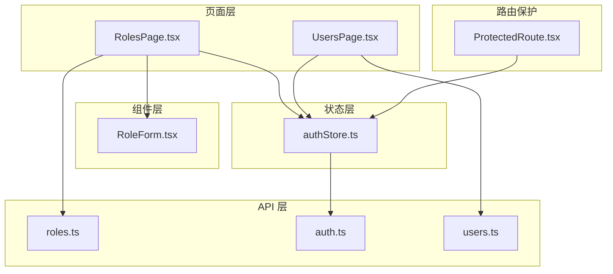
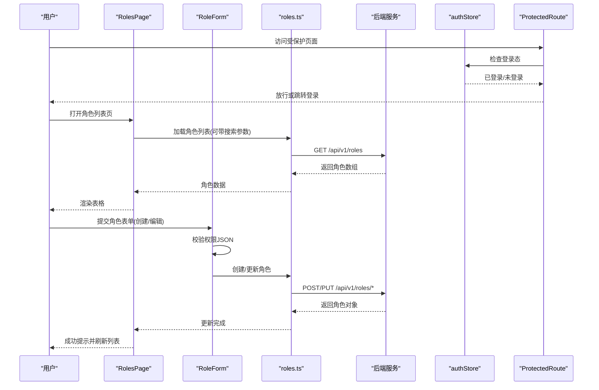
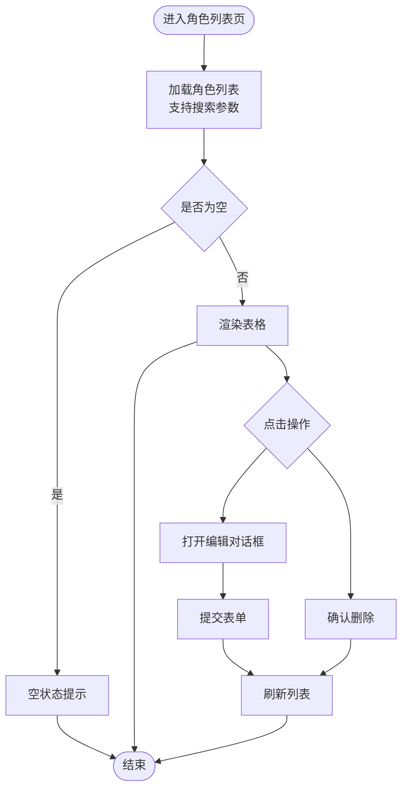
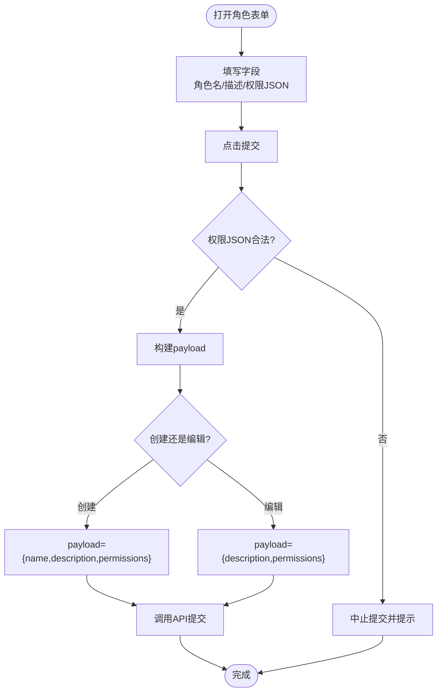
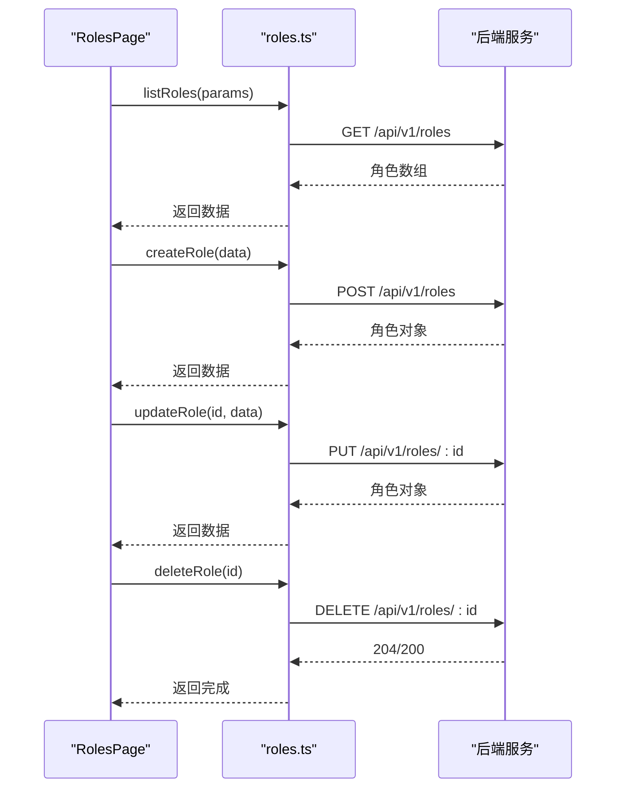
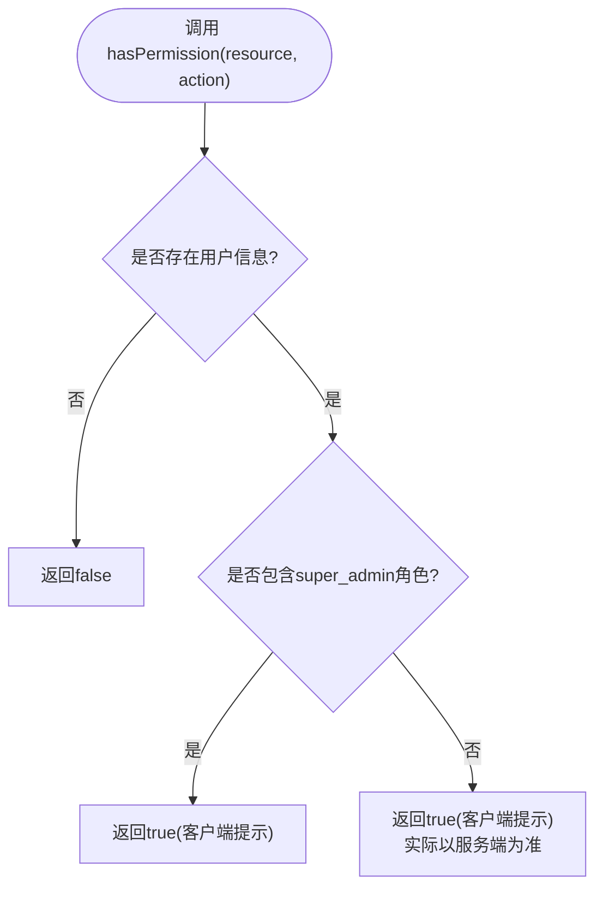
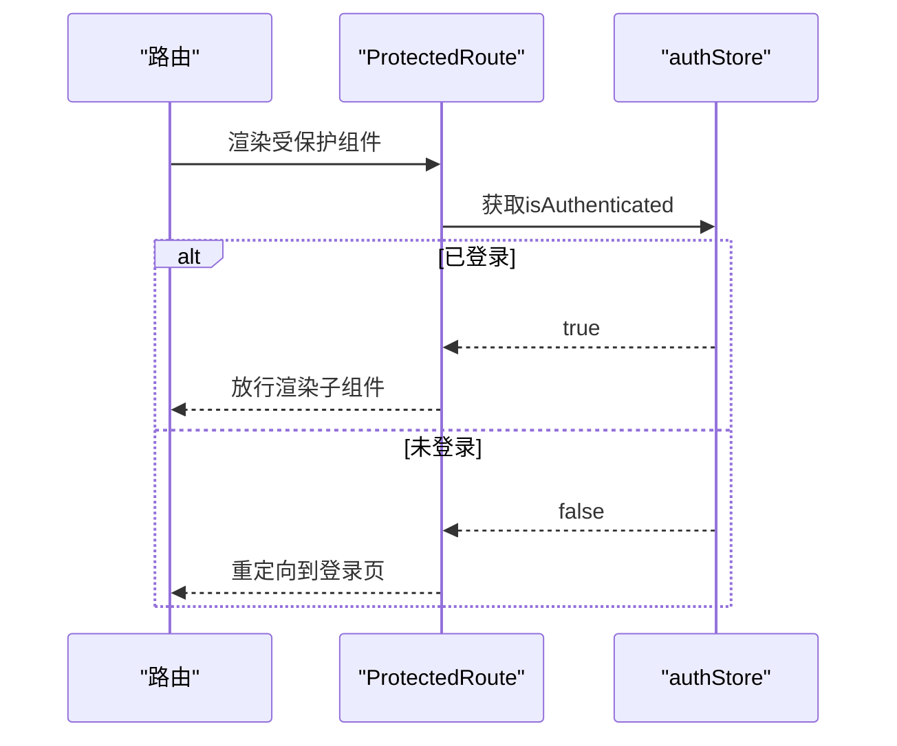
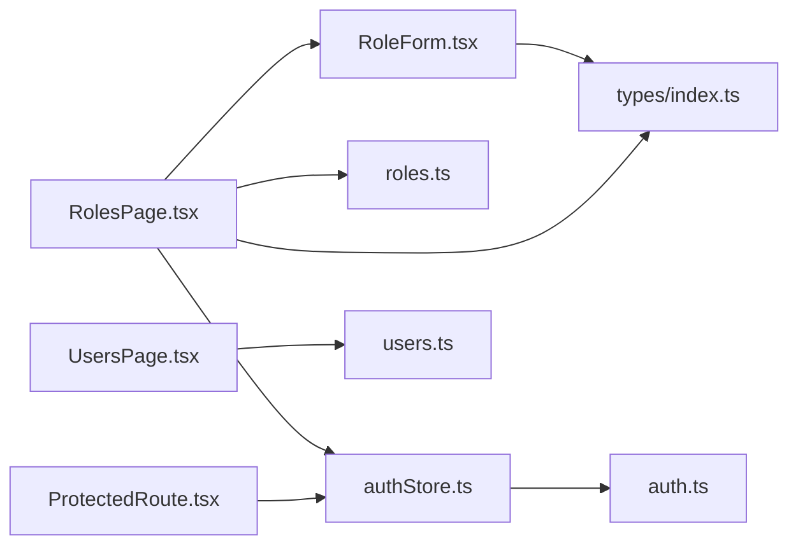

# 角色权限

<cite>
**本文引用的文件**
- [apps/config-center/src/pages/RolesPage.tsx](file://apps/config-center/src/pages/RolesPage.tsx)
- [apps/config-center/src/components/role/RoleForm.tsx](file://apps/config-center/src/components/role/RoleForm.tsx)
- [apps/config-center/src/api/roles.ts](file://apps/config-center/src/api/roles.ts)
- [apps/config-center/src/store/authStore.ts](file://apps/config-center/src/store/authStore.ts)
- [apps/config-center/src/components/ProtectedRoute.tsx](file://apps/config-center/src/components/ProtectedRoute.tsx)
- [apps/config-center/src/types/index.ts](file://apps/config-center/src/types/index.ts)
- [apps/config-center/src/api/auth.ts](file://apps/config-center/src/api/auth.ts)
- [apps/config-center/src/pages/UsersPage.tsx](file://apps/config-center/src/pages/UsersPage.tsx)
- [apps/config-center/src/api/users.ts](file://apps/config-center/src/api/users.ts)
</cite>

## 目录
1. [简介](#简介)
2. [项目结构](#项目结构)
3. [核心组件](#核心组件)
4. [架构总览](#架构总览)
5. [详细组件分析](#详细组件分析)
6. [依赖关系分析](#依赖关系分析)
7. [性能考量](#性能考量)
8. [故障排查指南](#故障排查指南)
9. [结论](#结论)
10. [附录](#附录)

## 简介
本文件围绕配置中心应用中的“角色权限管理”功能，系统性阐述角色列表展示、角色详情编辑与角色表单组件实现；深入解析 RBAC 权限模型、角色权限映射与访问控制机制；明确角色的创建、更新、删除流程与权限验证策略；提供角色管理界面的使用示例、权限分配与校验规则，并覆盖角色继承、权限检查与安全策略配置的设计原则与最佳实践。

## 项目结构
角色权限管理相关模块主要分布在以下位置：
- 页面层：角色列表页与用户列表页，负责数据拉取、交互与展示
- 组件层：角色表单组件，封装角色创建/编辑的输入与提交逻辑
- API 层：角色与用户的 REST 接口封装
- 状态层：认证与授权状态管理（含 hasPermission 客户端提示）
- 路由保护：受保护路由组件，确保未登录用户无法访问受控页面

**图表来源**
- [apps/config-center/src/pages/RolesPage.tsx:1-170](file://apps/config-center/src/pages/RolesPage.tsx#L1-L170)
- [apps/config-center/src/components/role/RoleForm.tsx:1-65](file://apps/config-center/src/components/role/RoleForm.tsx#L1-L65)
- [apps/config-center/src/api/roles.ts:1-26](file://apps/config-center/src/api/roles.ts#L1-L26)
- [apps/config-center/src/api/auth.ts:1-15](file://apps/config-center/src/api/auth.ts#L1-L15)
- [apps/config-center/src/api/users.ts:1-26](file://apps/config-center/src/api/users.ts#L1-L26)
- [apps/config-center/src/store/authStore.ts:1-108](file://apps/config-center/src/store/authStore.ts#L1-L108)
- [apps/config-center/src/components/ProtectedRoute.tsx:1-14](file://apps/config-center/src/components/ProtectedRoute.tsx#L1-L14)

**章节来源**
- [apps/config-center/src/pages/RolesPage.tsx:1-170](file://apps/config-center/src/pages/RolesPage.tsx#L1-L170)
- [apps/config-center/src/components/role/RoleForm.tsx:1-65](file://apps/config-center/src/components/role/RoleForm.tsx#L1-L65)
- [apps/config-center/src/api/roles.ts:1-26](file://apps/config-center/src/api/roles.ts#L1-L26)
- [apps/config-center/src/store/authStore.ts:1-108](file://apps/config-center/src/store/authStore.ts#L1-L108)
- [apps/config-center/src/components/ProtectedRoute.tsx:1-14](file://apps/config-center/src/components/ProtectedRoute.tsx#L1-L14)
- [apps/config-center/src/types/index.ts:122-154](file://apps/config-center/src/types/index.ts#L122-L154)
- [apps/config-center/src/api/auth.ts:1-15](file://apps/config-center/src/api/auth.ts#L1-L15)
- [apps/config-center/src/pages/UsersPage.tsx:1-164](file://apps/config-center/src/pages/UsersPage.tsx#L1-L164)
- [apps/config-center/src/api/users.ts:1-26](file://apps/config-center/src/api/users.ts#L1-L26)

## 核心组件
- 角色列表页（RolesPage）：负责分页/搜索加载角色、渲染表格、触发创建/编辑/删除操作，并通过全局通知反馈结果。
- 角色表单组件（RoleForm）：封装角色名称、描述与权限 JSON 的输入，进行 JSON 校验后提交；支持创建与编辑两种模式。
- 角色 API（roles.ts）：提供角色列表、详情、创建、更新、删除的异步接口。
- 认证状态（authStore）：维护登录态、刷新令牌、获取当前用户信息；提供 hasPermission 客户端提示方法。
- 受保护路由（ProtectedRoute）：在导航时校验登录态，未登录则重定向至登录页。
- 类型定义（types/index.ts）：定义角色、权限、用户等数据结构，包括权限条目（资源+动作集合）。

**章节来源**
- [apps/config-center/src/pages/RolesPage.tsx:11-170](file://apps/config-center/src/pages/RolesPage.tsx#L11-L170)
- [apps/config-center/src/components/role/RoleForm.tsx:12-65](file://apps/config-center/src/components/role/RoleForm.tsx#L12-L65)
- [apps/config-center/src/api/roles.ts:4-25](file://apps/config-center/src/api/roles.ts#L4-L25)
- [apps/config-center/src/store/authStore.ts:20-107](file://apps/config-center/src/store/authStore.ts#L20-L107)
- [apps/config-center/src/components/ProtectedRoute.tsx:4-13](file://apps/config-center/src/components/ProtectedRoute.tsx#L4-L13)
- [apps/config-center/src/types/index.ts:122-154](file://apps/config-center/src/types/index.ts#L122-L154)

## 架构总览
下图展示了角色管理从 UI 到 API 再到状态层的整体调用链路与职责边界：

**图表来源**
- [apps/config-center/src/pages/RolesPage.tsx:19-75](file://apps/config-center/src/pages/RolesPage.tsx#L19-L75)
- [apps/config-center/src/components/role/RoleForm.tsx:21-34](file://apps/config-center/src/components/role/RoleForm.tsx#L21-L34)
- [apps/config-center/src/api/roles.ts:4-25](file://apps/config-center/src/api/roles.ts#L4-L25)
- [apps/config-center/src/store/authStore.ts:84-95](file://apps/config-center/src/store/authStore.ts#L84-L95)
- [apps/config-center/src/components/ProtectedRoute.tsx:4-13](file://apps/config-center/src/components/ProtectedRoute.tsx#L4-L13)

## 详细组件分析

### 角色列表页（RolesPage）
- 数据加载：支持按关键字搜索，使用防抖式回调拉取角色列表，异常统一通过全局通知提示。
- 表格列：包含角色名、描述、权限数量、更新时间；对系统内置角色显示“系统”徽标且禁用编辑/删除。
- 操作列：提供编辑与删除按钮；删除前弹窗确认；编辑打开表单并回填初始值。
- 对话框：分别承载“新建角色”和“编辑角色”的表单。
- 错误处理：捕获 API 异常并以错误消息提示；加载状态避免重复请求。

**图表来源**
- [apps/config-center/src/pages/RolesPage.tsx:19-132](file://apps/config-center/src/pages/RolesPage.tsx#L19-L132)

**章节来源**
- [apps/config-center/src/pages/RolesPage.tsx:11-170](file://apps/config-center/src/pages/RolesPage.tsx#L11-L170)

### 角色表单组件（RoleForm）
- 输入字段：角色名（创建时必填）、描述、权限 JSON 文本域。
- JSON 校验：提交前尝试解析权限 JSON，解析失败则阻止提交。
- 提交策略：创建模式仅提交 name/description/permissions；编辑模式仅提交变更字段。
- UI 交互：使用通用按钮与输入组件，字体与尺寸适配。

**图表来源**
- [apps/config-center/src/components/role/RoleForm.tsx:21-34](file://apps/config-center/src/components/role/RoleForm.tsx#L21-L34)

**章节来源**
- [apps/config-center/src/components/role/RoleForm.tsx:12-65](file://apps/config-center/src/components/role/RoleForm.tsx#L12-L65)

### 角色 API（roles.ts）
- 列表/详情：支持分页参数与 ID 查询。
- 创建/更新：接收角色创建/更新数据结构，返回完整角色对象。
- 删除：按 ID 删除角色。

**图表来源**
- [apps/config-center/src/api/roles.ts:4-25](file://apps/config-center/src/api/roles.ts#L4-L25)

**章节来源**
- [apps/config-center/src/api/roles.ts:1-26](file://apps/config-center/src/api/roles.ts#L1-L26)

### 认证与授权状态（authStore）
- 登录/登出/刷新：维护访问令牌与刷新令牌，获取当前用户信息。
- hasPermission：客户端侧“提示性”权限判断，超级管理员直接放行；非超级管理员默认返回允许以避免 UI 隐藏过多，真实权限由服务端强制执行。
- 状态持久化：使用持久化中间件保存必要字段，提升体验。

**图表来源**
- [apps/config-center/src/store/authStore.ts:84-95](file://apps/config-center/src/store/authStore.ts#L84-L95)

**章节来源**
- [apps/config-center/src/store/authStore.ts:20-107](file://apps/config-center/src/store/authStore.ts#L20-L107)

### 受保护路由（ProtectedRoute）
- 在渲染子组件前检查登录态；未登录则重定向到登录页并携带来源地址。

**图表来源**
- [apps/config-center/src/components/ProtectedRoute.tsx:4-13](file://apps/config-center/src/components/ProtectedRoute.tsx#L4-L13)

**章节来源**
- [apps/config-center/src/components/ProtectedRoute.tsx:1-14](file://apps/config-center/src/components/ProtectedRoute.tsx#L1-L14)

### 用户管理（UsersPage 与 users.ts）
- 用户列表页与角色列表页类似，提供搜索、表格展示、创建/编辑/删除能力。
- 用户 API 提供用户列表、详情、创建、更新、删除接口。

**章节来源**
- [apps/config-center/src/pages/UsersPage.tsx:11-164](file://apps/config-center/src/pages/UsersPage.tsx#L11-L164)
- [apps/config-center/src/api/users.ts:4-25](file://apps/config-center/src/api/users.ts#L4-L25)

## 依赖关系分析
- RolesPage 依赖 RoleForm 进行创建/编辑；依赖 roles.ts 进行数据操作；依赖 authStore 与 ProtectedRoute 实现访问控制。
- RoleForm 依赖通用 UI 组件与类型定义（Permission）。
- authStore 依赖 auth.ts 获取令牌与用户信息。
- 类型定义集中于 types/index.ts，为所有模块提供统一的数据契约。

**图表来源**
- [apps/config-center/src/pages/RolesPage.tsx:1-10](file://apps/config-center/src/pages/RolesPage.tsx#L1-L10)
- [apps/config-center/src/components/role/RoleForm.tsx:1-10](file://apps/config-center/src/components/role/RoleForm.tsx#L1-L10)
- [apps/config-center/src/api/roles.ts:1-2](file://apps/config-center/src/api/roles.ts#L1-L2)
- [apps/config-center/src/store/authStore.ts:1-4](file://apps/config-center/src/store/authStore.ts#L1-L4)
- [apps/config-center/src/components/ProtectedRoute.tsx:1-2](file://apps/config-center/src/components/ProtectedRoute.tsx#L1-L2)
- [apps/config-center/src/types/index.ts:122-154](file://apps/config-center/src/types/index.ts#L122-L154)
- [apps/config-center/src/api/auth.ts:1-2](file://apps/config-center/src/api/auth.ts#L1-L2)
- [apps/config-center/src/pages/UsersPage.tsx:1-9](file://apps/config-center/src/pages/UsersPage.tsx#L1-L9)
- [apps/config-center/src/api/users.ts:1-2](file://apps/config-center/src/api/users.ts#L1-L2)

**章节来源**
- [apps/config-center/src/types/index.ts:122-154](file://apps/config-center/src/types/index.ts#L122-L154)
- [apps/config-center/src/api/auth.ts:1-15](file://apps/config-center/src/api/auth.ts#L1-L15)

## 性能考量
- 列表加载优化：使用防抖式搜索回调，减少不必要的网络请求；分页参数由 API 层处理。
- 表单提交：权限 JSON 解析在前端进行，建议限制 JSON 大小与复杂度，避免阻塞 UI。
- 状态持久化：authStore 使用持久化中间件，减少刷新后的重新登录成本。
- UI 响应：加载状态与错误提示及时反馈，提升用户体验。

## 故障排查指南
- 角色创建/更新失败：检查表单权限 JSON 是否合法；查看全局错误提示；确认网络请求是否被拦截。
- 删除失败：确认删除确认弹窗是否被取消；检查后端返回状态码与错误信息。
- 无角色显示：确认搜索关键词是否正确；检查后端分页参数与过滤条件。
- 权限提示不生效：hasPermission 仅为客户端 UI 提示，真实权限由服务端强制；如出现 UI 与实际不符，请检查服务端策略与登录用户角色。
- 未登录访问受保护页面：ProtectedRoute 将自动重定向到登录页；确认登录态与刷新令牌流程正常。

**章节来源**
- [apps/config-center/src/pages/RolesPage.tsx:26-75](file://apps/config-center/src/pages/RolesPage.tsx#L26-L75)
- [apps/config-center/src/components/role/RoleForm.tsx:24-28](file://apps/config-center/src/components/role/RoleForm.tsx#L24-L28)
- [apps/config-center/src/store/authStore.ts:84-95](file://apps/config-center/src/store/authStore.ts#L84-L95)
- [apps/config-center/src/components/ProtectedRoute.tsx:8-10](file://apps/config-center/src/components/ProtectedRoute.tsx#L8-L10)

## 结论
该角色权限管理模块以清晰的分层设计实现了角色的增删改查与权限 JSON 的可视化配置；通过受保护路由与认证状态管理保障了访问控制；hasPermission 的客户端提示提升了 UI 体验但不构成安全边界，真实权限由服务端强制执行。整体架构具备良好的扩展性与可维护性，适合进一步引入角色继承、环境/服务范围约束与审计日志等高级能力。

## 附录

### RBAC 权限模型与角色权限映射
- 资源与动作：权限条目由资源标识与动作数组组成，用于精确控制对特定资源的操作。
- 角色聚合：角色可包含多个权限条目，形成“资源-动作”矩阵。
- 用户角色：用户通过角色获得权限集合；支持多角色叠加。

**章节来源**
- [apps/config-center/src/types/index.ts:124-127](file://apps/config-center/src/types/index.ts#L124-L127)
- [apps/config-center/src/types/index.ts:144-154](file://apps/config-center/src/types/index.ts#L144-L154)

### 访问控制机制与安全策略
- 登录与令牌：登录成功后获取访问/刷新令牌；刷新令牌过期自动登出。
- 客户端提示：hasPermission 用于 UI 控制，非安全边界；服务端必须进行最终校验。
- 系统角色：系统内置角色通常不可编辑/删除，防止破坏基础权限结构。

**章节来源**
- [apps/config-center/src/api/auth.ts:4-14](file://apps/config-center/src/api/auth.ts#L4-L14)
- [apps/config-center/src/store/authStore.ts:29-82](file://apps/config-center/src/store/authStore.ts#L29-L82)
- [apps/config-center/src/store/authStore.ts:84-95](file://apps/config-center/src/store/authStore.ts#L84-L95)
- [apps/config-center/src/pages/RolesPage.tsx:117-125](file://apps/config-center/src/pages/RolesPage.tsx#L117-L125)

### 角色管理界面使用示例
- 新建角色：在角色列表页点击“新建角色”，填写名称、描述与权限 JSON，提交后刷新列表查看。
- 编辑角色：在角色列表点击“编辑”，修改描述或权限 JSON 后提交。
- 删除角色：在角色列表点击“删除”，确认后刷新列表。

**章节来源**
- [apps/config-center/src/pages/RolesPage.tsx:134-166](file://apps/config-center/src/pages/RolesPage.tsx#L134-L166)
- [apps/config-center/src/components/role/RoleForm.tsx:36-63](file://apps/config-center/src/components/role/RoleForm.tsx#L36-L63)

### 权限分配与验证规则
- 权限 JSON 格式：必须为合法 JSON 数组，元素为包含 resource 与 actions 的对象。
- 必填字段：创建时角色名必填；描述与权限 JSON 可选但建议填写。
- 服务端校验：最终权限生效以服务端策略为准，客户端仅作 UI 提示。

**章节来源**
- [apps/config-center/src/components/role/RoleForm.tsx:13-19](file://apps/config-center/src/components/role/RoleForm.tsx#L13-L19)
- [apps/config-center/src/components/role/RoleForm.tsx:21-34](file://apps/config-center/src/components/role/RoleForm.tsx#L21-L34)
- [apps/config-center/src/store/authStore.ts:84-95](file://apps/config-center/src/store/authStore.ts#L84-L95)