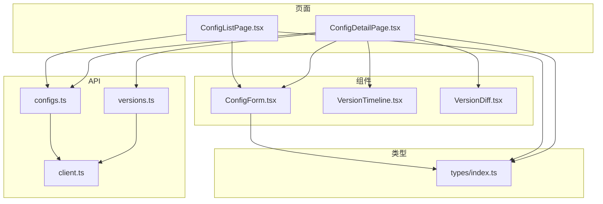
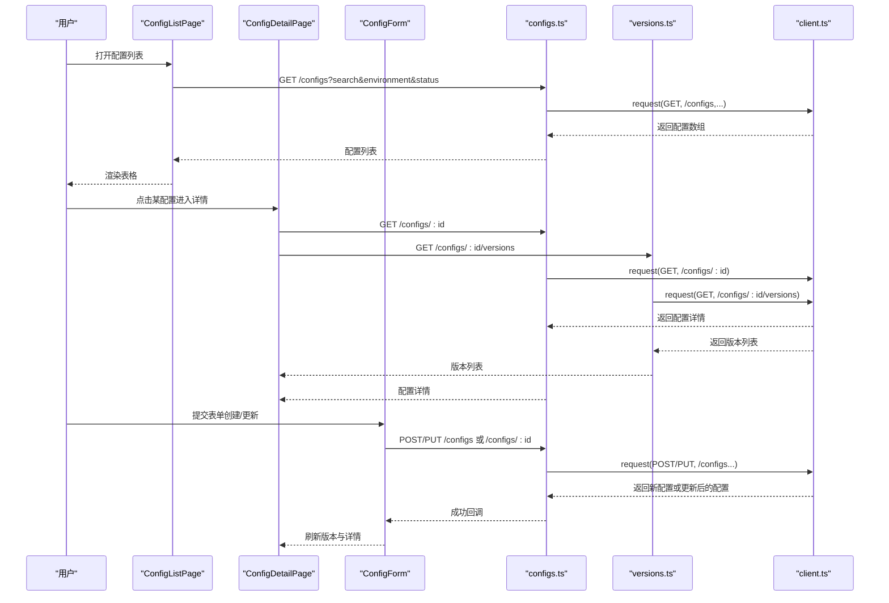
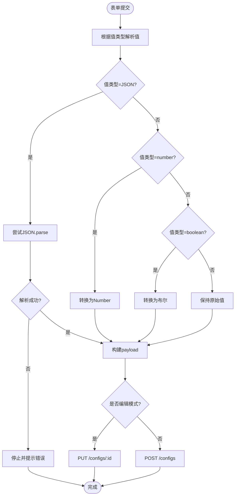
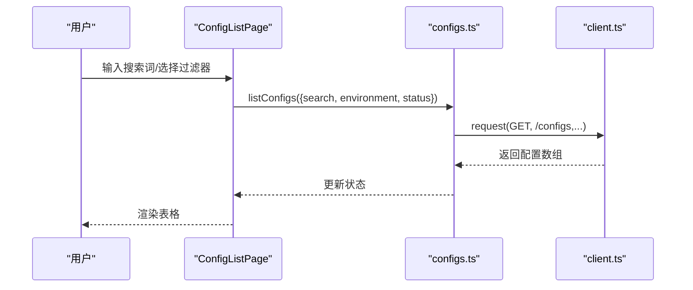
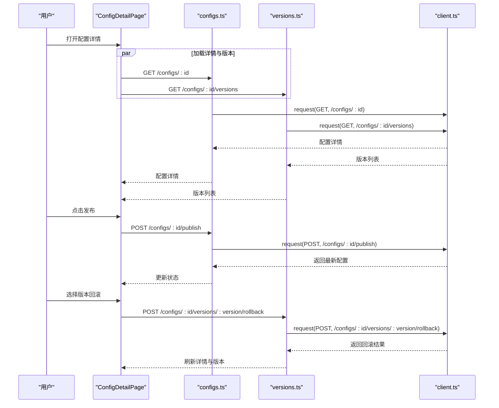
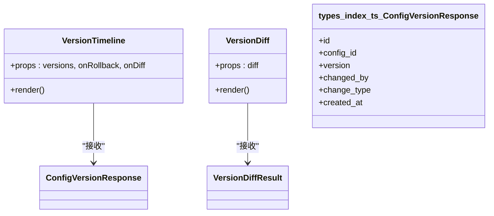
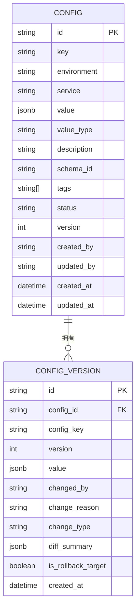
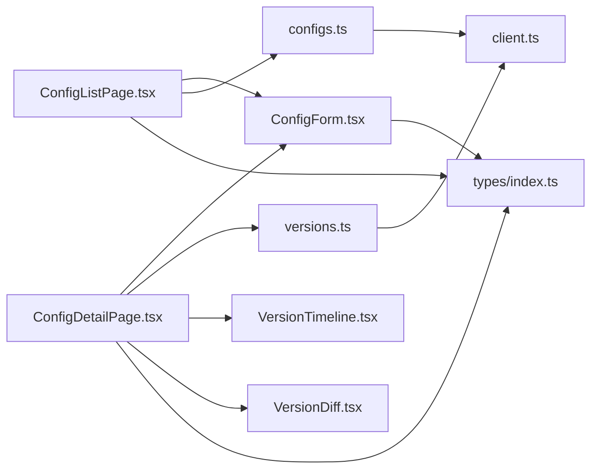

# 配置管理

<cite>
**本文引用的文件**
- [ConfigForm.tsx](file://apps/config-center/src/components/config/ConfigForm.tsx)
- [ConfigListPage.tsx](file://apps/config-center/src/pages/ConfigListPage.tsx)
- [ConfigDetailPage.tsx](file://apps/config-center/src/pages/ConfigDetailPage.tsx)
- [index.ts（类型定义）](file://apps/config-center/src/types/index.ts)
- [configs.ts（配置API）](file://apps/config-center/src/api/configs.ts)
- [versions.ts（版本API）](file://apps/config-center/src/api/versions.ts)
- [client.ts（HTTP客户端）](file://apps/config-center/src/api/client.ts)
- [VersionTimeline.tsx](file://apps/config-center/src/components/version/VersionTimeline.tsx)
- [VersionDiff.tsx](file://apps/config-center/src/components/version/VersionDiff.tsx)
</cite>

## 目录
1. [简介](#简介)
2. [项目结构](#项目结构)
3. [核心组件](#核心组件)
4. [架构总览](#架构总览)
5. [详细组件分析](#详细组件分析)
6. [依赖关系分析](#依赖关系分析)
7. [性能考量](#性能考量)
8. [故障排查指南](#故障排查指南)
9. [结论](#结论)
10. [附录](#附录)

## 简介
本文件系统性阐述配置中心的“配置管理”能力，覆盖配置列表展示、配置详情编辑、配置表单组件实现；详解配置项数据结构、验证规则与存储机制；解释增删改查、版本控制与冲突处理流程；并提供表单使用示例、字段校验与错误处理方案，以及导入导出、批量操作与搜索过滤机制的设计建议与最佳实践。

## 项目结构
配置管理前端位于 config-center 应用中，采用按页面与组件分层组织：
- 页面层：列表页、详情页
- 组件层：配置表单、版本时间线、版本对比
- 类型层：统一的 TS 类型定义
- API 层：配置与版本的 HTTP 接口封装
- 工具层：通用 HTTP 客户端与鉴权刷新逻辑

图示来源
- [ConfigListPage.tsx:13-177](file://apps/config-center/src/pages/ConfigListPage.tsx#L13-L177)
- [ConfigDetailPage.tsx:16-238](file://apps/config-center/src/pages/ConfigDetailPage.tsx#L16-L238)
- [ConfigForm.tsx:13-125](file://apps/config-center/src/components/config/ConfigForm.tsx#L13-L125)
- [VersionTimeline.tsx:13-66](file://apps/config-center/src/components/version/VersionTimeline.tsx#L13-L66)
- [VersionDiff.tsx:8-39](file://apps/config-center/src/components/version/VersionDiff.tsx#L8-L39)
- [configs.ts:4-32](file://apps/config-center/src/api/configs.ts#L4-L32)
- [versions.ts:4-28](file://apps/config-center/src/api/versions.ts#L4-L28)
- [client.ts:14-171](file://apps/config-center/src/api/client.ts#L14-L171)
- [index.ts（类型定义）:15-73](file://apps/config-center/src/types/index.ts#L15-L73)

章节来源
- [ConfigListPage.tsx:13-177](file://apps/config-center/src/pages/ConfigListPage.tsx#L13-L177)
- [ConfigDetailPage.tsx:16-238](file://apps/config-center/src/pages/ConfigDetailPage.tsx#L16-L238)
- [ConfigForm.tsx:13-125](file://apps/config-center/src/components/config/ConfigForm.tsx#L13-L125)
- [configs.ts:4-32](file://apps/config-center/src/api/configs.ts#L4-L32)
- [versions.ts:4-28](file://apps/config-center/src/api/versions.ts#L4-L28)
- [client.ts:14-171](file://apps/config-center/src/api/client.ts#L14-L171)
- [index.ts（类型定义）:15-73](file://apps/config-center/src/types/index.ts#L15-L73)

## 核心组件
- 配置表单组件：负责配置项的创建与编辑，支持多值类型解析与字段校验
- 列表页：展示配置列表、搜索过滤、批量删除入口
- 详情页：展示配置详情、版本历史、发布与回滚、版本对比
- 版本组件：版本时间线与版本差异对比
- API 封装：配置与版本的 CRUD、发布、回滚、对比等接口
- 类型定义：统一的配置、版本、审计、用户与角色等类型

章节来源
- [ConfigForm.tsx:13-125](file://apps/config-center/src/components/config/ConfigForm.tsx#L13-L125)
- [ConfigListPage.tsx:13-177](file://apps/config-center/src/pages/ConfigListPage.tsx#L13-L177)
- [ConfigDetailPage.tsx:16-238](file://apps/config-center/src/pages/ConfigDetailPage.tsx#L16-L238)
- [VersionTimeline.tsx:13-66](file://apps/config-center/src/components/version/VersionTimeline.tsx#L13-L66)
- [VersionDiff.tsx:8-39](file://apps/config-center/src/components/version/VersionDiff.tsx#L8-L39)
- [configs.ts:4-32](file://apps/config-center/src/api/configs.ts#L4-L32)
- [versions.ts:4-28](file://apps/config-center/src/api/versions.ts#L4-L28)
- [index.ts（类型定义）:15-73](file://apps/config-center/src/types/index.ts#L15-L73)

## 架构总览
配置管理采用“页面-组件-API-类型-HTTP客户端”的分层架构：
- 页面负责交互与状态管理
- 组件负责表单与展示
- API 封装对后端接口进行统一调用
- 类型定义确保前后端一致的数据契约
- HTTP 客户端负责鉴权、刷新与错误处理

图示来源
- [ConfigListPage.tsx:23-41](file://apps/config-center/src/pages/ConfigListPage.tsx#L23-L41)
- [ConfigDetailPage.tsx:28-46](file://apps/config-center/src/pages/ConfigDetailPage.tsx#L28-L46)
- [ConfigForm.tsx:29-55](file://apps/config-center/src/components/config/ConfigForm.tsx#L29-L55)
- [configs.ts:4-32](file://apps/config-center/src/api/configs.ts#L4-L32)
- [versions.ts:4-28](file://apps/config-center/src/api/versions.ts#L4-L28)
- [client.ts:85-129](file://apps/config-center/src/api/client.ts#L85-L129)

## 详细组件分析

### 配置表单组件（ConfigForm）
职责与行为
- 支持创建与编辑两种模式
- 字段包括：键、环境、服务、值类型、值、描述、标签、状态
- 值类型解析：字符串、数字、布尔、JSON、密钥（secret）
- 表单提交时根据值类型进行解析与序列化
- 标签以逗号分隔转为数组

字段与验证规则
- 必填字段：键、服务、值类型、值
- 值类型为 JSON 时，要求 JSON 可解析
- 值类型为 number 时，要求可转换为数字
- 值类型为 boolean 时，要求字符串为 "true"/"false"
- 标签为空时忽略；非空时按逗号拆分并去空白过滤

存储机制
- 创建时携带键、环境、服务、值、值类型、描述、标签、状态
- 更新时仅携带变更字段

图示来源
- [ConfigForm.tsx:29-55](file://apps/config-center/src/components/config/ConfigForm.tsx#L29-L55)

章节来源
- [ConfigForm.tsx:13-125](file://apps/config-center/src/components/config/ConfigForm.tsx#L13-L125)
- [index.ts（类型定义）:15-32](file://apps/config-center/src/types/index.ts#L15-L32)

### 配置列表页（ConfigListPage）
职责与行为
- 加载配置列表，支持搜索与筛选
- 提供新建配置弹窗
- 支持删除配置（带确认）

搜索与过滤
- 搜索：按配置键模糊匹配
- 过滤：按环境与状态过滤
- 分页参数：skip/limit（在 API 中定义）

错误处理
- 使用统一的 ApiError 错误包装
- 通过 toast 展示友好错误信息

图示来源
- [ConfigListPage.tsx:23-41](file://apps/config-center/src/pages/ConfigListPage.tsx#L23-L41)
- [configs.ts:4-12](file://apps/config-center/src/api/configs.ts#L4-L12)
- [client.ts:131-142](file://apps/config-center/src/api/client.ts#L131-L142)

章节来源
- [ConfigListPage.tsx:13-177](file://apps/config-center/src/pages/ConfigListPage.tsx#L13-L177)
- [configs.ts:4-12](file://apps/config-center/src/api/configs.ts#L4-L12)
- [client.ts:131-142](file://apps/config-center/src/api/client.ts#L131-L142)

### 配置详情页（ConfigDetailPage）
职责与行为
- 加载配置详情与版本历史
- 支持编辑、发布、回滚、版本对比
- 并发加载详情与版本，提升体验

发布与回滚
- 发布：将草稿置为活跃
- 回滚：选择目标版本进行回滚，并刷新详情与版本

版本对比
- 选择任意两个版本进行对比，展示差异摘要

图示来源
- [ConfigDetailPage.tsx:28-46](file://apps/config-center/src/pages/ConfigDetailPage.tsx#L28-L46)
- [ConfigDetailPage.tsx:48-100](file://apps/config-center/src/pages/ConfigDetailPage.tsx#L48-L100)
- [configs.ts:30-32](file://apps/config-center/src/api/configs.ts#L30-L32)
- [versions.ts:23-28](file://apps/config-center/src/api/versions.ts#L23-L28)
- [client.ts:85-129](file://apps/config-center/src/api/client.ts#L85-L129)

章节来源
- [ConfigDetailPage.tsx:16-238](file://apps/config-center/src/pages/ConfigDetailPage.tsx#L16-L238)
- [configs.ts:30-32](file://apps/config-center/src/api/configs.ts#L30-L32)
- [versions.ts:23-28](file://apps/config-center/src/api/versions.ts#L23-L28)
- [client.ts:85-129](file://apps/config-center/src/api/client.ts#L85-L129)

### 版本组件（VersionTimeline 与 VersionDiff）
职责与行为
- 时间线：展示版本变更记录、变更类型、变更人与时间，支持“对比上一版本”和“回滚到此版本”
- 对比：展示两个版本的值，便于定位差异

图示来源
- [VersionTimeline.tsx:13-66](file://apps/config-center/src/components/version/VersionTimeline.tsx#L13-L66)
- [VersionDiff.tsx:8-39](file://apps/config-center/src/components/version/VersionDiff.tsx#L8-L39)
- [index.ts（类型定义）:54-73](file://apps/config-center/src/types/index.ts#L54-L73)

章节来源
- [VersionTimeline.tsx:13-66](file://apps/config-center/src/components/version/VersionTimeline.tsx#L13-L66)
- [VersionDiff.tsx:8-39](file://apps/config-center/src/components/version/VersionDiff.tsx#L8-L39)
- [index.ts（类型定义）:54-73](file://apps/config-center/src/types/index.ts#L54-L73)

### 数据模型与类型
关键数据结构
- 配置创建/更新/响应：包含键、环境、服务、值、值类型、描述、标签、状态、版本、创建/更新信息等
- 版本响应：包含版本号、变更原因、变更类型、变更人、时间戳等
- 版本对比结果：包含两个版本的值与更新时间

图示来源
- [index.ts（类型定义）:34-73](file://apps/config-center/src/types/index.ts#L34-L73)

章节来源
- [index.ts（类型定义）:15-73](file://apps/config-center/src/types/index.ts#L15-L73)

## 依赖关系分析
- 页面依赖组件与 API
- 组件依赖类型定义
- API 依赖 HTTP 客户端
- HTTP 客户端依赖本地存储的鉴权信息

图示来源
- [ConfigListPage.tsx:11-11](file://apps/config-center/src/pages/ConfigListPage.tsx#L11-L11)
- [ConfigDetailPage.tsx:12-14](file://apps/config-center/src/pages/ConfigDetailPage.tsx#L12-L14)
- [ConfigForm.tsx:2-4](file://apps/config-center/src/components/config/ConfigForm.tsx#L2-L4)
- [configs.ts:1-2](file://apps/config-center/src/api/configs.ts#L1-L2)
- [versions.ts:1-2](file://apps/config-center/src/api/versions.ts#L1-L2)
- [client.ts:171-171](file://apps/config-center/src/api/client.ts#L171-L171)
- [index.ts（类型定义）:1-10](file://apps/config-center/src/types/index.ts#L1-L10)

章节来源
- [ConfigListPage.tsx:11-11](file://apps/config-center/src/pages/ConfigListPage.tsx#L11-L11)
- [ConfigDetailPage.tsx:12-14](file://apps/config-center/src/pages/ConfigDetailPage.tsx#L12-L14)
- [ConfigForm.tsx:2-4](file://apps/config-center/src/components/config/ConfigForm.tsx#L2-L4)
- [configs.ts:1-2](file://apps/config-center/src/api/configs.ts#L1-L2)
- [versions.ts:1-2](file://apps/config-center/src/api/versions.ts#L1-L2)
- [client.ts:171-171](file://apps/config-center/src/api/client.ts#L171-L171)
- [index.ts（类型定义）:1-10](file://apps/config-center/src/types/index.ts#L1-L10)

## 性能考量
- 列表加载：使用防抖与合理的分页参数，避免一次性加载过多数据
- 并发请求：详情页并发加载配置与版本，减少等待时间
- 表单解析：JSON/数字/布尔解析在前端完成，避免无效请求
- 缓存策略：可结合浏览器缓存与本地状态，减少重复请求
- 大 JSON 值渲染：详情页对 JSON 值进行格式化显示，避免长文本导致的渲染压力

## 故障排查指南
常见问题与处理
- 401 未授权：自动触发刷新令牌流程；若刷新失败，跳转登录页
- 请求异常：捕获 ApiError，展示友好错误信息
- JSON 解析失败：表单在值类型为 JSON 时需确保可解析，否则阻止提交
- 网络波动：重试与错误提示结合，必要时引导用户重试

章节来源
- [client.ts:98-119](file://apps/config-center/src/api/client.ts#L98-L119)
- [ConfigForm.tsx:32-37](file://apps/config-center/src/components/config/ConfigForm.tsx#L32-L37)
- [ConfigListPage.tsx:32-36](file://apps/config-center/src/pages/ConfigListPage.tsx#L32-L36)
- [ConfigDetailPage.tsx:39-43](file://apps/config-center/src/pages/ConfigDetailPage.tsx#L39-L43)

## 结论
配置管理模块以清晰的分层设计实现了从列表到详情、从表单到版本的全链路能力。通过统一的类型定义与 API 封装，保证了前后端一致性与可维护性。版本控制与对比功能完善，满足生产环境的变更追踪与回滚需求。建议在后续迭代中补充导入导出、批量操作与更丰富的搜索过滤能力，以进一步提升运维效率。

## 附录

### 配置项数据结构与字段说明
- 键：配置唯一标识，创建时必填
- 环境：开发/预发/生产等环境枚举
- 服务：所属服务名称
- 值类型：字符串/数字/布尔/JSON/密钥
- 值：实际配置内容，按类型解析
- 描述：可选描述信息
- 标签：逗号分隔的标签集合
- 状态：草稿/活跃/已废弃
- 版本：当前版本号
- 创建/更新信息：创建者、更新者、时间戳

章节来源
- [index.ts（类型定义）:34-50](file://apps/config-center/src/types/index.ts#L34-L50)

### 验证规则与存储机制
- 创建：键、环境、服务、值类型、值必填；描述/标签可选；状态默认草稿
- 更新：仅变更字段参与更新
- 存储：值类型为 JSON 时存储为 JSONB；布尔/数字按对应类型存储

章节来源
- [ConfigForm.tsx:18-54](file://apps/config-center/src/components/config/ConfigForm.tsx#L18-L54)
- [configs.ts:18-24](file://apps/config-center/src/api/configs.ts#L18-L24)

### 增删改查与版本控制流程
- 列表：GET /configs，支持搜索与过滤
- 详情：GET /configs/:id 与 GET /configs/:id/versions
- 创建：POST /configs
- 更新：PUT /configs/:id
- 删除：DELETE /configs/:id
- 发布：POST /configs/:id/publish
- 回滚：POST /configs/:id/versions/:version/rollback
- 对比：GET /configs/:id/versions/diff/:v1/to/:v2

章节来源
- [configs.ts:4-32](file://apps/config-center/src/api/configs.ts#L4-L32)
- [versions.ts:4-28](file://apps/config-center/src/api/versions.ts#L4-L28)

### 冲突处理与最佳实践
- 冲突场景：多人同时修改同一配置
- 处理建议：采用乐观锁或版本号比较，在更新前拉取最新版本；若版本不一致，提示用户重新编辑
- 最佳实践：严格区分草稿与活跃状态；变更前生成变更原因；启用审计日志；对敏感配置使用密钥类型

### 导入导出、批量操作与搜索过滤建议
- 导入导出：提供 CSV/JSON 导出模板与批量导入接口，支持值类型校验与冲突检测
- 批量操作：支持批量删除、批量发布、批量状态变更
- 搜索过滤：支持键名、服务、标签、状态、环境组合查询；支持排序与分页